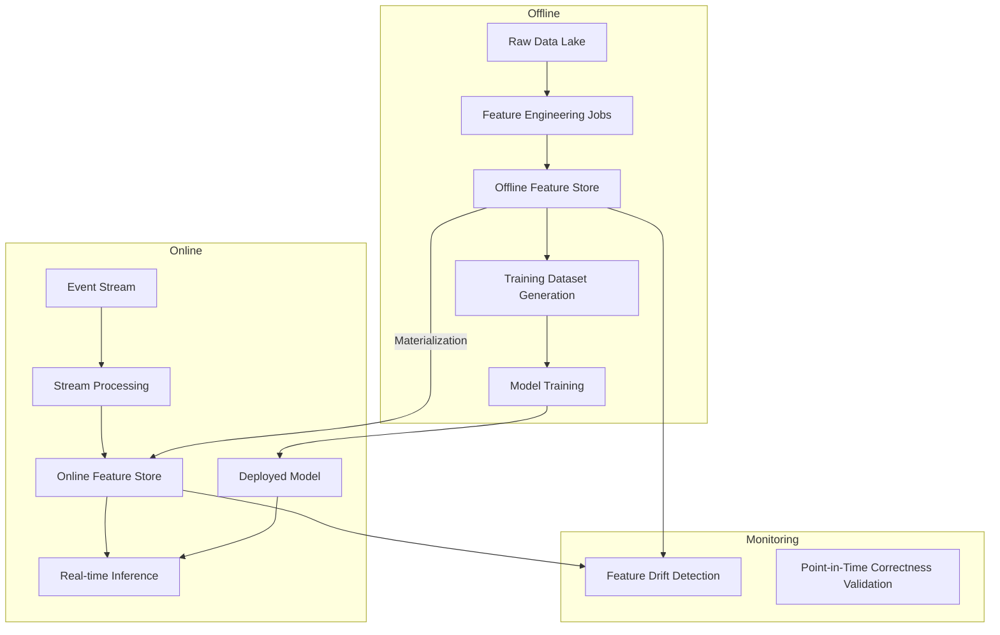
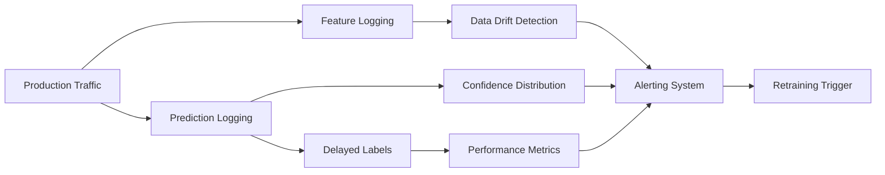

# ⚙️ Advanced MLOps

## Introduction

Machine Learning Operations (MLOps) is the engineering discipline that bridges the gap between experimental [[Machine Learning]] research and reliable production systems. While traditional software engineering focuses on code versioning and deployment, MLOps must additionally manage data, models, features, and continuously evolving statistical behavior. Advanced MLOps encompasses pipeline orchestration, feature management, and sophisticated monitoring to ensure that models remain accurate, fair, and scalable over time.

The complexity of production ML systems arises from their inherent coupling with data distributions. Unlike deterministic software, models degrade when the real-world data drifts away from the training distribution. Furthermore, the feature engineering layer—the transformation of raw data into model inputs—often becomes the most brittle and hardest-to-reproduce component of the system. Advanced MLOps practices address these challenges through automated pipelines, centralized feature stores, and multi-dimensional monitoring frameworks.

This course explores the theoretical foundations and practical implementation of enterprise-grade MLOps. We will analyze Directed Acyclic Graph (DAG) orchestration patterns, dissect the architectural requirements of feature stores, and build comprehensive monitoring dashboards that track data drift, concept drift, and bias. By the end, you will understand how to architect ML platforms that support hundreds of models across dozens of teams with rigorous reproducibility and governance.

## 1. Pipeline Orchestration and DAG Design

ML pipelines are fundamentally Directed Acyclic Graphs (DAGs) where nodes represent computational steps (data ingestion, preprocessing, training, evaluation, deployment) and edges represent data dependencies. The theoretical properties of DAGs—specifically the guarantee of no circular dependencies—make them the natural abstraction for pipeline execution.

A well-designed orchestration system must handle several non-trivial requirements:

- **Dependency resolution**: When a node has multiple upstream dependencies, the orchestrator must ensure all inputs are materialized before execution. This requires topological sorting and careful handling of conditional branches.
- **Retries and idempotency**: Transient failures in distributed systems are inevitable. Each pipeline step should be idempotent—running it twice produces the same result as running it once. Backoff strategies, exponential jitter, and maximum retry limits must be configurable per task.
- **Backfills**: When pipeline logic changes or historical data is corrected, the system must support re-execution over past time windows. Backfills must respect resource quotas to avoid overwhelming the cluster and should support partition-level granularity to minimize recomputation.
- **Dynamic task generation**: Some pipelines require runtime task generation based on data partitions or hyperparameter grids. The orchestrator must support mapping over dynamic collections while maintaining the DAG abstraction.

Modern orchestrators like Apache Airflow, Prefect, and Dagster implement these concepts with varying philosophical approaches. Airflow uses explicit Python DAG files with cron-based scheduling. Prefect introduces a hybrid mode where tasks can run locally for development and remotely for production. Dagster emphasizes software-defined assets—treating data assets as first-class entities rather than mere task outputs.

Real case: Uber's Michelangelo platform processes hundreds of thousands of features across thousands of models daily. Their pipeline orchestration layer supports time-based partitioning, automatic backfills on schema changes, and dynamic resource allocation based on historical task duration predictions. The platform automatically retries failed training jobs up to three times before paging the on-call engineer.

⚠️ **Warning**: Circular dependencies in feature engineering pipelines are a common source of subtle bugs. A feature derived from model predictions that is then fed back into the same model's training data creates a feedback loop. Always enforce DAG validation and use temporal barriers (e.g., only use predictions from t-1 for training at time t) to break potential cycles.

💡 **Tip**: Design your pipelines with "task idempotency by default." Store intermediate outputs with deterministic naming based on input hashes. This enables automatic caching—if the inputs haven't changed, the orchestrator can skip recomputation entirely, dramatically speeding up iterative development.

## 2. Feature Stores: Offline vs Online Serving

Feature stores emerged as the solution to the training-serving skew problem—the discrepancy between feature computation logic at training time and inference time. They provide a unified layer for feature definition, storage, and serving across batch and real-time contexts.

**Offline Store (Batch Serving)**

The offline store holds historical feature values, typically partitioned by time and entity ID. It is optimized for large-scale analytical queries—joining feature tables with label tables to generate training datasets. Storage backends include data lakes (Delta Lake, Iceberg), data warehouses (BigQuery, Snowflake), and distributed file systems (HDFS, S3). The critical theoretical requirement is **point-in-time correctness**: when generating a training example for event time t, only features computed with data available up to time t can be used. Violating this principle introduces future information leakage (data leakage), producing optimistically biased model performance estimates.

**Online Store (Real-time Serving)**

The online store serves the latest feature values with millisecond latency for real-time inference. It is typically implemented on key-value stores (Redis, DynamoDB, Cassandra) or specialized feature store backends (Feast, Tecton). The online store is populated by streaming pipelines (Kafka + Flink) or materialization jobs that sync the latest offline values.



| Platform | Offline Store | Online Store | Orchestration | Best For |
|----------|--------------|--------------|---------------|----------|
| Vertex AI | BigQuery | Bigtable | Vertex Pipelines | Google Cloud native |
| SageMaker | S3 + Athena | DynamoDB | SageMaker Pipelines | AWS native, tight SageMaker integration |
| Azure ML | Azure Blob + SQL | Redis | Azure ML Pipelines | Microsoft ecosystem |
| Databricks | Delta Lake | Redis / DynamoDB | Delta Live Tables | Lakehouse architecture |
| Feast | Any (plugin) | Any (plugin) | External (Airflow, etc.) | Multi-cloud, open-source |

⚠️ **Warning**: Point-in-time correctness is notoriously difficult to enforce in SQL-based training set generation. A simple `JOIN` without temporal predicates will silently leak future information. Always use AS-OF joins or dedicated feature store APIs that enforce time-travel semantics.

## 3. Model Monitoring and Drift Detection

Production models are not static artifacts—they are dynamic systems whose behavior changes as the world changes. Comprehensive monitoring requires tracking four distinct drift categories:

**Data Drift (Covariate Shift)**

Occurs when the distribution of input features P(X) changes over time. Even if the relationship between X and Y remains constant, shifted inputs can push the model into regions of feature space where it is uncertain. Detection methods include:

- **Population Stability Index (PSI)**: Measures the divergence between the distribution of a feature in a reference window versus a current window. The formula is:

$$
\text{PSI} = \sum_{i} (A_i - E_i) \times \ln\left(\frac{A_i}{E_i}\right)
$$

Where A_i is the actual proportion of observations in bin i, and E_i is the expected proportion from the reference distribution. PSI < 0.1 indicates minimal shift, 0.1-0.25 moderate, and >0.25 significant.

- **Kolmogorov-Smirnov test**: Non-parametric test for continuous features comparing empirical CDFs.
- **Wasserstein distance**: Earth-mover's distance between distributions, sensitive to both location and shape changes.

**Concept Drift**

Occurs when the conditional distribution P(Y|X) changes—the fundamental relationship between inputs and outputs evolves. This is harder to detect than data drift because it requires labeled data, which may have significant delay in production. Proxy detection methods include monitoring model confidence distributions or using ensemble disagreement metrics.

**Performance Decay**

Direct measurement of model accuracy, precision, recall, or business metrics (revenue, click-through rate) over time. The challenge is label latency—knowing the ground truth may take days or weeks. For fraud detection, true labels may take months to materialize.

**Bias Drift**

Tracks whether model fairness metrics change across demographic subgroups. A model that is fair at deployment may become unfair as data distributions shift. Metrics include demographic parity difference, equalized odds, and calibration across groups.



Real case: Airbnb's Bighead platform automatically monitors every deployed model for data drift, concept drift, and performance decay. They compute PSI and KS statistics across hundreds of features hourly. When drift exceeds thresholds, the platform can automatically trigger retraining pipelines or page model owners. Their bias monitoring module specifically tracks demographic parity across guest and host populations to ensure fair booking recommendations.

## 4. Implementing Monitoring and Orchestration

The following Python code demonstrates a drift detection system with PSI calculation, a simple DAG orchestrator, and an automated retraining trigger:

```python
import numpy as np
from typing import Dict, List, Callable, Any
from dataclasses import dataclass
from collections import defaultdict
import heapq

@dataclass
class Task:
    name: str
    func: Callable
    upstream: List[str]
    retries: int = 3

def compute_psi(expected: np.ndarray, actual: np.ndarray, bins: int = 10) -> float:
    """Compute Population Stability Index between two distributions."""
    breakpoints = np.percentile(expected, np.linspace(0, 100, bins + 1))
    breakpoints[-1] += 1e-9  # Ensure max value falls in last bin
    
    def get_proportions(arr):
        counts, _ = np.histogram(arr, breakpoints)
        return counts / len(arr)
    
    E = get_proportions(expected)
    A = get_proportions(actual)
    
    # Avoid division by zero
    E = np.where(E == 0, 1e-10, E)
    A = np.where(A == 0, 1e-10, A)
    
    psi = np.sum((A - E) * np.log(A / E))
    return psi

class SimpleOrchestrator:
    """Minimal DAG orchestrator with retries and backfill support."""
    def __init__(self):
        self.tasks: Dict[str, Task] = {}
        self.results: Dict[str, Any] = {}
    
    def add_task(self, task: Task):
        self.tasks[task.name] = task
    
    def _ topological_sort(self) -> List[str]:
        in_degree = {name: 0 for name in self.tasks}
        for task in self.tasks.values():
            for dep in task.upstream:
                in_degree[task.name] += 1
        
        queue = [name for name, deg in in_degree.items() if deg == 0]
        order = []
        
        while queue:
            current = queue.pop(0)
            order.append(current)
            for task in self.tasks.values():
                if current in task.upstream:
                    in_degree[task.name] -= 1
                    if in_degree[task.name] == 0:
                        queue.append(task.name)
        
        return order
    
    def run(self, backfill_date: str = None):
        order = self._topological_sort()
        for task_name in order:
            task = self.tasks[task_name]
            inputs = {dep: self.results[dep] for dep in task.upstream}
            
            for attempt in range(task.retries):
                try:
                    result = task.func(**inputs) if inputs else task.func()
                    self.results[task_name] = result
                    break
                except Exception as e:
                    if attempt == task.retries - 1:
                        raise RuntimeError(f"Task {task_name} failed after {task.retries} retries: {e}")
        
        return self.results

class DriftMonitor:
    """Monitors features for drift and triggers retraining."""
    def __init__(self, reference_data: Dict[str, np.ndarray], psi_threshold: float = 0.25):
        self.reference = reference_data
        self.psi_threshold = psi_threshold
        self.alerts = []
    
    def check(self, current_data: Dict[str, np.ndarray]) -> Dict[str, float]:
        results = {}
        for feature, ref_values in self.reference.items():
            if feature not in current_data:
                continue
            psi = compute_psi(ref_values, current_data[feature])
            results[feature] = psi
            if psi > self.psi_threshold:
                self.alerts.append({
                    "feature": feature,
                    "psi": psi,
                    "severity": "high" if psi > 0.3 else "medium"
                })
        return results
    
    def should_retrain(self) -> bool:
        return any(a["severity"] == "high" for a in self.alerts)

# Example usage:
# orchestrator = SimpleOrchestrator()
# orchestrator.add_task(Task("extract", extract_func, []))
# orchestrator.add_task(Task("train", train_func, ["extract"]))
# results = orchestrator.run()
#
# monitor = DriftMonitor(reference_features)
# drift_scores = monitor.check(current_features)
# if monitor.should_retrain():
#     trigger_retraining_pipeline()
```

💡 **Tip**: When monitoring high-cardinality categorical features (like user IDs or zip codes), standard PSI becomes noisy because each bin contains very few samples. Instead, track the distribution of embedding vectors for categorical features, or monitor proxy metrics like the rate of unseen categories and the entropy of the category distribution.

---

## 📦 Compression Code

```python
"""
Advanced MLOps - Complete Summarizing Script
Encapsulates DAG orchestration, feature store concepts, drift detection
(PSI, KS), automated retraining triggers, and monitoring dashboards.
"""

import numpy as np
from typing import Dict, List, Callable, Any, Set
from dataclasses import dataclass, field
from collections import defaultdict, deque
import json


@dataclass
class Task:
    name: str
    func: Callable
    upstream: List[str] = field(default_factory=list)
    retries: int = 3
    cache_key: str = None


class DAGOrchestrator:
    def __init__(self):
        self.tasks: Dict[str, Task] = {}
        self.results: Dict[str, Any] = {}
        self.cache: Dict[str, Any] = {}
    
    def add_task(self, task: Task):
        self.tasks[task.name] = task
    
    def _topological_sort(self) -> List[str]:
        in_degree = {name: 0 for name in self.tasks}
        adj = defaultdict(list)
        for task in self.tasks.values():
            for dep in task.upstream:
                adj[dep].append(task.name)
                in_degree[task.name] += 1
        
        queue = deque([n for n, d in in_degree.items() if d == 0])
        order = []
        while queue:
            curr = queue.popleft()
            order.append(curr)
            for neighbor in adj[curr]:
                in_degree[neighbor] -= 1
                if in_degree[neighbor] == 0:
                    queue.append(neighbor)
        
        if len(order) != len(self.tasks):
            raise ValueError("Cycle detected in DAG")
        return order
    
    def run(self, context: Dict[str, Any] = None) -> Dict[str, Any]:
        order = self._topological_sort()
        ctx = context or {}
        
        for name in order:
            task = self.tasks[name]
            if task.cache_key and task.cache_key in self.cache:
                self.results[name] = self.cache[task.cache_key]
                continue
            
            inputs = {dep: self.results[dep] for dep in task.upstream}
            inputs.update(ctx)
            
            for attempt in range(task.retries):
                try:
                    result = task.func(**inputs)
                    self.results[name] = result
                    if task.cache_key:
                        self.cache[task.cache_key] = result
                    break
                except Exception as e:
                    if attempt == task.retries - 1:
                        raise RuntimeError(f"Task '{name}' failed: {e}")
        return self.results


def compute_psi(expected: np.ndarray, actual: np.ndarray, bins: int = 10) -> float:
    min_val = min(expected.min(), actual.min())
    max_val = max(expected.max(), actual.max())
    breakpoints = np.linspace(min_val, max_val, bins + 1)
    breakpoints[-1] += 1e-9
    
    def proportions(arr):
        c, _ = np.histogram(arr, breakpoints)
        return np.clip(c / len(arr), 1e-10, 1.0)
    
    E, A = proportions(expected), proportions(actual)
    return float(np.sum((A - E) * np.log(A / E)))


def ks_test(sample1: np.ndarray, sample2: np.ndarray) -> float:
    from scipy import stats
    return float(stats.ks_2samp(sample1, sample2).statistic)


class FeatureStoreMonitor:
    def __init__(self, reference: Dict[str, np.ndarray]):
        self.reference = reference
        self.history: List[Dict] = []
    
    def evaluate(self, current: Dict[str, np.ndarray], timestamp: str) -> Dict:
        report = {"timestamp": timestamp, "features": {}, "alerts": []}
        for feat, ref_vals in self.reference.items():
            if feat not in current:
                continue
            psi = compute_psi(ref_vals, current[feat])
            report["features"][feat] = {"psi": psi}
            if psi > 0.25:
                report["alerts"].append({"feature": feat, "metric": "PSI", "value": psi})
        self.history.append(report)
        return report
    
    def generate_summary(self) -> str:
        total_alerts = sum(len(h["alerts"]) for h in self.history)
        return json.dumps({
            "windows_checked": len(self.history),
            "total_alerts": total_alerts,
            "latest_status": "CRITICAL" if total_alerts > 5 else "HEALTHY"
        }, indent=2)


# Usage example:
# orch = DAGOrchestrator()
# orch.add_task(Task("load", load_data, []))
# orch.add_task(Task("features", build_features, ["load"], cache_key="feat_v1"))
# orch.add_task(Task("train", train_model, ["features"]))
# results = orch.run()
#
# monitor = FeatureStoreMonitor(reference_features)
# report = monitor.evaluate(current_batch, "2024-01-15T00:00:00Z")
# print(monitor.generate_summary())
```

## 🎯 Documented Project

### Description

Construct an enterprise MLOps platform supporting the full lifecycle of 50+ machine learning models across fraud detection, recommendation, and demand forecasting domains. The platform must provide unified feature management with point-in-time correctness guarantees, automated pipeline orchestration with dependency resolution and backfills, and comprehensive model monitoring covering data drift, concept drift, and bias. Deployed on Kubernetes with multi-tenancy and RBAC.

### Functional Requirements

1. Feature store with dual storage backend (Delta Lake for offline, Redis Cluster for online) and automatic materialization syncing between stores.
2. DAG-based pipeline orchestrator supporting dynamic task generation, conditional branching, automatic retries with exponential backoff, and partition-aware backfills.
3. Real-time monitoring dashboard computing PSI, KS statistics, and custom business metrics per model with configurable alerting thresholds and PagerDuty integration.
4. Automated retraining triggers based on drift detection, performance decay, or scheduled cadence, with A/B testing gates before model promotion.
5. Model registry with versioned artifacts, lineage tracking from raw data to predictions, and governance workflows for approval and rollback.

### Main Components

- **Feature Store**: Feast-based abstraction over Delta Lake (offline) and Redis (online) with PySpark materialization jobs and point-in-time join validation.
- **Orchestrator**: Apache Airflow 2.x with dynamic DAG generation from YAML configurations, KubernetesPodOperator for task isolation, and CeleryExecutor for horizontal scaling.
- **Monitoring Service**: Python microservice consuming Kafka prediction logs, computing drift statistics in sliding windows, and exposing REST/ Prometheus metrics.
- **Model Registry**: MLflow tracking server with S3 artifact storage, custom tagging for staging (Staging/Production/Archived), and webhook-triggered CI/CD gates.
- **Retraining Controller**: Scheduled job evaluating drift reports and performance metrics, initiating SageMaker/Vertex training jobs, and orchestrating canary deployments.

### Success Metrics

- **Pipeline success rate ≥ 99.5%** across all scheduled DAG runs over a 30-day window, excluding explicitly retried transient failures.
- **Feature serving latency P99 ≤ 20ms** for online store lookups from the inference service under 10,000 QPS load testing.
- **Mean time to detect drift ≤ 1 hour** from the moment a feature distribution shifts beyond the PSI threshold of 0.25.
- **Model rollback time ≤ 5 minutes** from alert trigger to restoring the previous production model version via the registry API.

### References

- Sculley, D., et al. (2015). "Hidden Technical Debt in Machine Learning Systems." *NeurIPS*.
- Huyen, C. (2022). *Designing Machine Learning Systems*. O'Reilly Media.
- Polyzotis, N., et al. (2018). "Data Management Challenges in Production Machine Learning." *SIGMOD*.
- Uber Engineering Blog. "Michelangelo: Uber's Machine Learning Platform."
