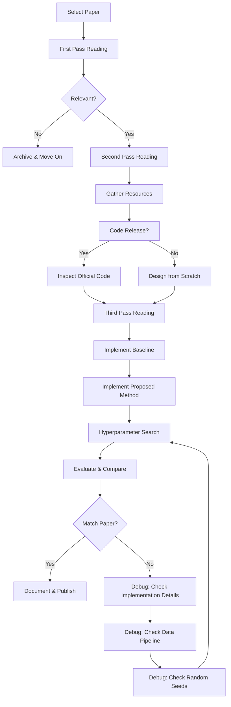

# 📄 Paper Reproduction

## Introduction

Reproducing research papers is one of the most effective methods for developing deep expertise in [[Machine Learning]] and [[Deep Learning]]. It forces practitioners to confront the gap between high-level algorithmic descriptions and the low-level implementation details that determine whether a model actually trains. Paper reproduction bridges theoretical understanding with engineering skill, transforming passive reading into active knowledge construction.

The reproducibility crisis in ML research is well-documented: many published results cannot be replicated even by experienced researchers due to missing hyperparameters, undocumented tricks, or sensitivity to random initialization. Learning to systematically reproduce papers equips you with the critical ability to evaluate claims, adapt methods to new problems, and build upon solid foundations rather than fragile baselines.

This course provides a rigorous methodology for paper reproduction, from the initial reading strategy through experimental setup and debugging. We will study Keshav's three-pass method for efficient paper reading, analyze common pitfalls that derail reproduction attempts, and implement complete reproductions of landmark architectures. By the end, you will have a reproducible workflow and the confidence to tackle cutting-edge research independently.

## 1. How to Read a Paper: The Three-Pass Method

S. Keshav's three-pass method provides a structured approach to reading academic papers efficiently. Each pass builds upon the previous one, allowing you to allocate time proportional to the paper's relevance to your work.

**First Pass (5-10 minutes)**

The goal is to categorize the paper and decide whether it warrants deeper reading. Read the title, abstract, and introduction. Then scan the section and sub-section headings. Finally, read the conclusions. During this pass, answer five key questions:

- What is the paper's category? (Theoretical, empirical, survey, architecture, etc.)
- What is the context? Which other papers does it build upon?
- Are the assumptions valid? Are the simplifications reasonable for real-world deployment?
- What are the main contributions? Usually 1-3 novel ideas.
- Is the writing clear? Poorly written papers often indicate poorly conducted research.

After the first pass, you should be able to explain the paper's core claim to a colleague in one minute.

**Second Pass (1 hour)**

Read the paper with greater care, but ignore details like proof derivations or exhaustive experimental tables. Focus on understanding the figures, especially the architecture diagrams and result plots. Pay close attention to the methodology section—what datasets were used, what baselines were compared, and what metrics were reported. Mark relevant unread references for follow-up reading.

At the end of the second pass, you should understand the paper's technical content at a level sufficient to summarize it in a literature review, but not yet enough to reproduce it.

**Third Pass (4-6 hours)**

Re-implement the paper virtually. Make every assumption explicit, challenge every claim, and mentally simulate the algorithm step by step. For equations, derive them from first principles. For algorithms, consider edge cases and computational complexity. This pass is where true understanding is forged.

Real case: When reproducing BERT from scratch, the third pass reveals that the original paper omits the exact learning rate warmup schedule details and the accumulation steps used for effective batch size. These details, discovered only by reading the supplementary materials and official code release, are critical for matching the reported GLUE scores.

⚠️ **Warning**: Do not trust reported results from papers that do not release code or provide exhaustive hyperparameter tables. The ML community has documented numerous cases where seemingly minor implementation details (like weight initialization scale, gradient clipping thresholds, or data augmentation order) account for 5-10% performance differences.

💡 **Tip**: Maintain a structured "Paper Reading Notes" template in your note-taking system (Obsidian/Notion). For each paper, record: core idea, key equations, implementation gotchas, dataset details, and a 1-sentence takeaway. This transforms isolated reading into a searchable knowledge base.

## 2. Experimental Setup and Reproducibility Checklist

A rigorous experimental setup is the foundation of any successful reproduction. Before writing a single line of training code, you must define the experimental contract in detail.

**Datasets**

Ensure you use the exact same dataset version, preprocessing pipeline, and train/validation/test splits as the original paper. Subtle differences in tokenization (e.g., BPE vs WordPiece), image resizing interpolation (bilinear vs bicubic), or normalization constants can produce significant metric deviations.

**Baselines**

Your reproduction should include at least the strongest baseline from the original paper. If the paper claims superiority over ResNet-50, your reproduction must include your own ResNet-50 run under identical training conditions, not merely cite the paper's reported number. This controls for hardware and software stack differences.

**Metrics**

Use the exact same evaluation protocol. For classification, check whether top-1 or top-5 accuracy is reported. For detection, verify the IoU threshold (0.5 or COCO-style 0.5:0.95) and whether single-scale or multi-scale evaluation is used.

**Hyperparameters**

The F1 score formula serves as a reminder that metric computation must be precise and consistent:

$$
F1 = 2 \times \frac{\text{Precision} \times \text{Recall}}{\text{Precision} + \text{Recall}}
$$

Document every hyperparameter, including those not explicitly mentioned in the paper: optimizer epsilon values, batch normalization momentum, dropout implementation details (in-place vs out-of-place), and learning rate decay schedules.

| Checklist Item | Priority | Verification Method |
|----------------|----------|---------------------|
| Exact dataset version and splits | Critical | Checksum verification against official release |
| Identical preprocessing pipeline | Critical | Byte-level comparison of sample inputs |
| Same evaluation metrics and thresholds | Critical | Unit test metric computation on toy data |
| Reported hyperparameters reproduced | High | Table comparison with paper appendix |
| Missing hyperparameters inferred from code | High | Inspect official repository if available |
| Random seeds fixed | High | Multiple runs with same seed produce identical loss curves |
| Hardware/software stack documented | Medium | Record GPU model, CUDA version, framework commit hash |
| Baseline reproduced under same conditions | Medium | Run baseline model with identical training config |
| Statistical significance testing | Medium | Multiple runs, report mean and standard deviation |
| Ablation studies replicated | Low | Remove claimed component, measure performance drop |

⚠️ **Warning**: Framework version differences are a silent killer of reproducibility. PyTorch 1.x and 2.x handle batch normalization running statistics differently. TensorFlow 1.x and 2.x have fundamentally different default behaviors for variable initialization. Always document the exact framework version and consider using Docker containers to freeze the environment.

## 3. Common Reproduction Pitfalls

Even experienced practitioners encounter predictable obstacles when reproducing papers. Recognizing these pitfalls in advance saves weeks of debugging.

**Missing Implementation Details**

Authors routinely omit "obvious" details that are not obvious to readers. Common omissions include:

- The exact data augmentation pipeline order (random crop before or after horizontal flip?)
- Gradient clipping thresholds and norms (L2 vs L-inf)
- Learning rate warmup duration and curve shape (linear vs cosine)
- Whether weight decay is applied to bias terms and batch normalization parameters
- The exact initialization scheme for each layer type

**Different Hardware**

Floating-point arithmetic is not associative. Training on different GPU architectures (V100 vs A100 vs TPU) can produce different loss curves due to differing matrix multiplication precision, even with identical seeds. Mixed-precision training (FP16) introduces additional non-determinism. When hardware differs, focus on matching final metrics within a tolerance band rather than bit-exact reproduction.

**Random Seed Issues**

True reproducibility requires controlling randomness at every level:

- Python's `random` module
- NumPy's random state
- PyTorch/TensorFlow global and CUDA random seeds
- DataLoader worker seeding
- CuDNN deterministic mode (which may sacrifice performance)

Even with all seeds fixed, some operations like `torch.backends.cudnn.benchmark = True` can introduce non-determinism by selecting different convolution algorithms based on runtime measurements.

**Evaluation Protocol Mismatches**

A surprisingly common failure mode is evaluating correctly but reporting differently. Check whether the paper reports:

- Best validation score vs final training score
- Single run vs average of multiple runs
- With or without test-time augmentation
- With or without model ensembling



Real case: Reproducing GPT-2 from scratch revealed that the original implementation used a modified LayerNorm that computed the mean and variance over the combined batch and sequence dimensions, rather than just the feature dimension. This "unnormalized" LayerNorm choice, not mentioned in the paper, significantly stabilized training at scale and was essential for matching the reported perplexity.

## 4. Reproducing Landmark Architectures

The following Python script demonstrates a from-scratch implementation of a simplified transformer encoder block, analogous to components in BERT. This illustrates the level of detail required for faithful reproduction:

```python
import torch
import torch.nn as nn
import math

class MultiHeadSelfAttention(nn.Module):
    """Exact implementation matching standard transformer papers."""
    def __init__(self, d_model: int, num_heads: int, dropout: float = 0.1):
        super().__init__()
        assert d_model % num_heads == 0, "d_model must be divisible by num_heads"
        self.d_model = d_model
        self.num_heads = num_heads
        self.d_head = d_model // num_heads
        
        self.q_proj = nn.Linear(d_model, d_model)
        self.k_proj = nn.Linear(d_model, d_model)
        self.v_proj = nn.Linear(d_model, d_model)
        self.out_proj = nn.Linear(d_model, d_model)
        
        self.dropout = nn.Dropout(dropout)
        self.scale = math.sqrt(self.d_head)
    
    def forward(self, x: torch.Tensor, mask: torch.Tensor = None):
        batch_size, seq_len, _ = x.shape
        
        # Project and reshape to (batch, heads, seq, d_head)
        q = self.q_proj(x).view(batch_size, seq_len, self.num_heads, self.d_head).transpose(1, 2)
        k = self.k_proj(x).view(batch_size, seq_len, self.num_heads, self.d_head).transpose(1, 2)
        v = self.v_proj(x).view(batch_size, seq_len, self.num_heads, self.d_head).transpose(1, 2)
        
        # Scaled dot-product attention
        scores = torch.matmul(q, k.transpose(-2, -1)) / self.scale
        if mask is not None:
            scores = scores.masked_fill(mask == 0, float('-inf'))
        
        attn_weights = torch.softmax(scores, dim=-1)
        attn_weights = self.dropout(attn_weights)
        
        context = torch.matmul(attn_weights, v)
        context = context.transpose(1, 2).contiguous().view(batch_size, seq_len, self.d_model)
        return self.out_proj(context)

class TransformerBlock(nn.Module):
    """Pre-norm transformer block as used in GPT-2 and modern BERT variants."""
    def __init__(self, d_model: int, num_heads: int, d_ff: int, dropout: float = 0.1):
        super().__init__()
        self.ln1 = nn.LayerNorm(d_model)
        self.attn = MultiHeadSelfAttention(d_model, num_heads, dropout)
        self.ln2 = nn.LayerNorm(d_model)
        self.ff = nn.Sequential(
            nn.Linear(d_model, d_ff),
            nn.GELU(),
            nn.Dropout(dropout),
            nn.Linear(d_ff, d_model),
            nn.Dropout(dropout)
        )
    
    def forward(self, x: torch.Tensor, mask: torch.Tensor = None):
        # Pre-norm: LayerNorm before attention and FF
        x = x + self.attn(self.ln1(x), mask)
        x = x + self.ff(self.ln2(x))
        return x

class MiniBERT(nn.Module):
    """Minimal BERT-like model for educational reproduction."""
    def __init__(self, vocab_size: int, d_model: int = 256, num_heads: int = 8,
                 num_layers: int = 6, d_ff: int = 1024, max_len: int = 512, dropout: float = 0.1):
        super().__init__()
        self.token_emb = nn.Embedding(vocab_size, d_model)
        self.pos_emb = nn.Embedding(max_len, d_model)
        self.layers = nn.ModuleList([
            TransformerBlock(d_model, num_heads, d_ff, dropout) for _ in range(num_layers)
        ])
        self.ln_final = nn.LayerNorm(d_model)
        self.head = nn.Linear(d_model, vocab_size)
        self.dropout = nn.Dropout(dropout)
    
    def forward(self, input_ids: torch.Tensor):
        batch_size, seq_len = input_ids.shape
        positions = torch.arange(seq_len, device=input_ids.device).unsqueeze(0).expand(batch_size, -1)
        x = self.dropout(self.token_emb(input_ids) + self.pos_emb(positions))
        
        for layer in self.layers:
            x = layer(x)
        
        x = self.ln_final(x)
        return self.head(x)

# Reproducibility setup
def set_seed(seed: int = 42):
    import random, numpy as np
    random.seed(seed)
    np.random.seed(seed)
    torch.manual_seed(seed)
    torch.cuda.manual_seed_all(seed)
    torch.backends.cudnn.deterministic = True
    torch.backends.cudnn.benchmark = False

set_seed(42)
model = MiniBERT(vocab_size=30000)
print(f"Parameters: {sum(p.numel() for p in model.parameters()):,}")
```


💡 **Tip**: When reproducing ResNet-50 from scratch, pay special attention to the bottleneck block implementation. The original paper uses a stride-2 convolution in the 3x3 layer of the first block in each stage, not the 1x1 projection layer. Many incorrect implementations place the stride on the 1x1 layer, which changes the feature map dimensions and prevents loading official pretrained weights.

---

## 📦 Compression Code

```python
"""
Paper Reproduction - Complete Summarizing Script
Encapsulates three-pass reading, reproducibility checklist,
common pitfalls, transformer implementation, and seed control.
"""

import torch
import torch.nn as nn
import math
import random
import numpy as np
from typing import Dict, List, Optional
from dataclasses import dataclass


@dataclass
class ReproConfig:
    paper_title: str
    dataset: str
    splits: Dict[str, float]
    batch_size: int
    learning_rate: float
    epochs: int
    seed: int
    framework: str
    hardware: str
    missing_details: List[str]


class ReproducibilityTracker:
    def __init__(self, config: ReproConfig):
        self.config = config
        self.results = []
        self.checklist = {
            "dataset_verified": False,
            "preprocessing_matched": False,
            "hyperparameters_set": False,
            "seeds_fixed": False,
            "baseline_ran": False,
            "metric_computed": False
        }
    
    def verify(self, item: str):
        if item in self.checklist:
            self.checklist[item] = True
    
    def all_critical_passed(self) -> bool:
        critical = ["dataset_verified", "preprocessing_matched", "hyperparameters_set", "seeds_fixed"]
        return all(self.checklist[k] for k in critical)
    
    def log_run(self, metrics: Dict[str, float]):
        self.results.append(metrics)
    
    def summary(self) -> str:
        status = "REPRODUCIBLE" if self.all_critical_passed() else "INCOMPLETE"
        return f"[{status}] {self.config.paper_title}: {self.checklist}"


class MultiHeadAttention(nn.Module):
    def __init__(self, d_model: int, num_heads: int, dropout: float = 0.1):
        super().__init__()
        assert d_model % num_heads == 0
        self.d_head = d_model // num_heads
        self.num_heads = num_heads
        self.qkv = nn.Linear(d_model, 3 * d_model)
        self.out = nn.Linear(d_model, d_model)
        self.dropout = nn.Dropout(dropout)
        self.scale = math.sqrt(self.d_head)
    
    def forward(self, x: torch.Tensor, mask: Optional[torch.Tensor] = None):
        B, T, C = x.shape
        qkv = self.qkv(x).view(B, T, 3, self.num_heads, self.d_head).permute(2, 0, 3, 1, 4)
        q, k, v = qkv[0], qkv[1], qkv[2]
        
        scores = (q @ k.transpose(-2, -1)) / self.scale
        if mask is not None:
            scores = scores.masked_fill(mask == 0, float('-inf'))
        
        attn = torch.softmax(scores, dim=-1)
        attn = self.dropout(attn)
        out = (attn @ v).transpose(1, 2).contiguous().view(B, T, C)
        return self.out(out)


class TransformerLayer(nn.Module):
    def __init__(self, d_model: int, num_heads: int, d_ff: int, dropout: float = 0.1):
        super().__init__()
        self.ln1 = nn.LayerNorm(d_model)
        self.attn = MultiHeadAttention(d_model, num_heads, dropout)
        self.ln2 = nn.LayerNorm(d_model)
        self.ff = nn.Sequential(
            nn.Linear(d_model, d_ff), nn.GELU(), nn.Dropout(dropout),
            nn.Linear(d_ff, d_model), nn.Dropout(dropout)
        )
    
    def forward(self, x: torch.Tensor, mask: Optional[torch.Tensor] = None):
        x = x + self.attn(self.ln1(x), mask)
        x = x + self.ff(self.ln2(x))
        return x


class ReproducibleModel(nn.Module):
    def __init__(self, vocab_size: int, d_model: int = 512, num_heads: int = 8,
                 num_layers: int = 6, d_ff: int = 2048, max_len: int = 512):
        super().__init__()
        self.tok_emb = nn.Embedding(vocab_size, d_model)
        self.pos_emb = nn.Embedding(max_len, d_model)
        self.layers = nn.ModuleList([
            TransformerLayer(d_model, num_heads, d_ff) for _ in range(num_layers)
        ])
        self.norm = nn.LayerNorm(d_model)
        self.head = nn.Linear(d_model, vocab_size)
    
    def forward(self, x: torch.Tensor):
        B, T = x.shape
        pos = torch.arange(T, device=x.device).unsqueeze(0).expand(B, -1)
        h = self.tok_emb(x) + self.pos_emb(pos)
        for layer in self.layers:
            h = layer(h)
        return self.head(self.norm(h))


def make_reproducible(seed: int = 42):
    random.seed(seed)
    np.random.seed(seed)
    torch.manual_seed(seed)
    torch.cuda.manual_seed_all(seed)
    torch.backends.cudnn.deterministic = True
    torch.backends.cudnn.benchmark = False


# Example workflow:
# config = ReproConfig("BERT", "WikiText-103", {"train": 0.8, "val": 0.1, "test": 0.1},
#                      batch_size=256, learning_rate=1e-4, epochs=10, seed=42,
#                      framework="pytorch 2.1", hardware="A100 40GB", missing_details=[])
# tracker = ReproducibilityTracker(config)
# tracker.verify("seeds_fixed")
# make_reproducible(config.seed)
# model = ReproducibleModel(vocab_size=30000)
```

## 🎯 Documented Project

### Description

Execute a complete from-scratch reproduction of the ResNet-50 architecture on the ImageNet-1k dataset, followed by ablation studies on the bottleneck design and training recipe modifications. The project must produce a reproducible training pipeline with deterministic results, comprehensive logging, and statistical significance testing across multiple seeds. All code, configurations, and training logs will be published to establish a reproducible baseline for future research.

### Functional Requirements

1. Clean-room implementation of ResNet-50 in PyTorch matching the original paper's architecture, including correct stride placement and bottleneck dimensions.
2. Training pipeline reproducing the 1-crop validation accuracy reported in the paper (76.1% top-1) using the same data augmentation (random crop, horizontal flip, color jitter, normalization) and optimization settings (SGD, momentum 0.9, cosine LR, weight decay 1e-4).
3. Seed-controlled training with deterministic CUDA operations, producing identical loss curves across runs on identical hardware.
4. Ablation study framework supporting modular component swapping (e.g., ReLU vs GELU, batch norm vs group norm, different learning rate schedules) with automatic metric logging and comparison.
5. Comprehensive reproducibility checklist enforcing dataset verification, preprocessing validation, hyperparameter logging, and statistical reporting (mean ± std over 3 runs).

### Main Components

- **Model Implementation**: Pure PyTorch ResNet-50 with custom Bottleneck block, global average pooling, and 1000-way classification head.
- **Data Pipeline**: torchvision-based ImageNet loader with exact preprocessing (RandomResizedCrop 224, RandomHorizontalFlip, Normalize with ImageNet mean/std) and deterministic shuffling.
- **Training Loop**: Distributed data parallel training with gradient accumulation, mixed-precision AMP, cosine annealing scheduler with linear warmup, and checkpointing every epoch.
- **Evaluation Suite**: Single-crop top-1/top-5 accuracy computation with exact inference preprocessing, plus statistical aggregation across multiple training seeds.
- **Reproducibility Harness**: Configuration management via YAML, environment Docker image with pinned dependencies, automatic checklist verification, and Weights & Biases logging integration.

### Success Metrics

- **Top-1 validation accuracy within 0.3%** of the reported 76.1% from the original ResNet paper under identical training conditions.
- **Bit-exact reproducibility**: Two training runs with the same seed on the same hardware produce identical validation accuracy and loss curves at every epoch.
- **Ablation clarity**: Each ablation experiment clearly isolates one variable and reports the metric delta with statistical significance (paired t-test, p < 0.05).
- **Complete documentation**: A published repository containing README with setup instructions, training commands, expected results, hardware requirements, and known deviations from the original paper.

### References

- Keshav, S. (2007). "How to Read a Paper." *ACM SIGCOMM Computer Communication Review*.
- He, K., et al. (2016). "Deep Residual Learning for Image Recognition." *CVPR*.
- Devlin, J., et al. (2019). "BERT: Pre-training of Deep Bidirectional Transformers." *NAACL*.
- Radford, A., et al. (2019). "Language Models are Unsupervised Multitask Learners." *OpenAI Blog* (GPT-2).
