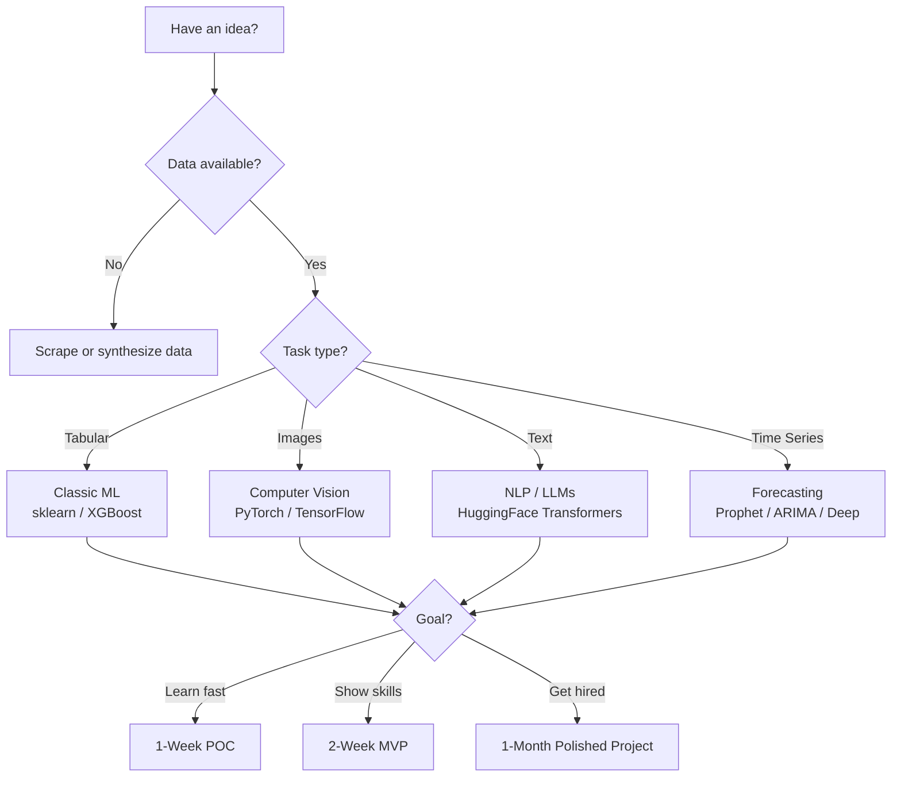

# 📋 Project Planning Guide for ML and AI Engineering

## Overview

Why this project matters for a first job.

Recruiters screen portfolios in under 30 seconds. A clear project plan proves you can scope work, estimate timelines, and deliver business value — the exact skills junior ML engineers are hired for. This guide gives you a reusable framework to choose, build, and ship projects that get interviews.

## Prerequisites

- Basic Python (pandas, numpy, matplotlib)
- Familiarity with one ML framework (scikit-learn, PyTorch, or TensorFlow)
- Git and GitHub basics
- A Kaggle account and a HuggingFace account

## Learning Objectives

1. Evaluate project ideas using feasibility, data availability, and job-market relevance.
2. Time-box projects into 1-week POC, 2-week MVP, and 1-month polished deliverables.
3. Design a portfolio strategy that balances breadth and depth.
4. Create architecture diagrams and decision logs before writing code.

## Official Resources & Links

| Resource | Type | URL | Why It Matters |
|----------|------|-----|----------------|
| Kaggle | Platform | https://www.kaggle.com | Source of datasets, competitions, and notebook portfolio hosting |
| HuggingFace | Platform | https://huggingface.co | Hub for LLMs, datasets, and model deployment |
| Papers With Code | Index | https://paperswithcode.com | Find state-of-the-art methods with official implementations |
| MLflow | Tool | https://mlflow.org | Industry-standard experiment tracking and model registry |
| Weights & Biases | Tool | https://wandb.ai | Experiment tracking with rich visual dashboards |
| Made With ML | Course | https://madewithml.com | End-to-end ML engineering curriculum used by practitioners |

## Architecture & Planning

### Project Selection Decision Tree



### Key Decisions

- **1-Week POC**: Validate that a model can beat a trivial baseline. No deployment, no hyper-parameter tuning grid.
- **2-Week MVP**: Add feature engineering, cross-validation, and a simple API or Streamlit app.
- **1-Month Polished Project**: Full CI/CD, monitoring, documentation, and a blog post or README case study.
- **Portfolio Mix**: 1 flagship end-to-end project + 2 specialized projects (Kaggle + LLM/CV).

## Step-by-Step Implementation Guide

1. **Ideate and screen**
   - What: List 5 ideas. Score each 1-5 on data availability, novelty, and job relevance.
   - Why: Prevents mid-project abandonment due to scope creep.
   - Code: Use a simple spreadsheet or Notion board.
   - Expected output: A ranked list with the top idea highlighted.

2. **Define success metrics**
   - What: Choose 1 business metric and 1 technical metric (e.g., RMSE, F1, BLEU).
   - Why: Gives you a stopping condition and a story for recruiters.
   - Code:
     ```python
     success_criteria = {
         "business": "Reduce churn by 5%",
         "technical": "F1-score > 0.75 on validation set"
     }
     ```
   - Expected output: A printed dictionary or markdown table.

3. **Set time boxes**
   - What: Allocate calendar blocks for POC → MVP → Polish.
   - Why: Forces prioritization and avoids perfectionism.
   - Code: Create GitHub milestones with due dates.
   - Expected output: Three milestones in your repo.

4. **Draft the architecture**
   - What: Draw the data flow and model lifecycle.
   - Why: Exposes integration risks early.
   - Code: Write a Mermaid diagram in your README.
   - Expected output: A diagram reviewed by a peer or mentor.

5. **Build the POC**
   - What: Baseline model, minimal preprocessing, single notebook.
   - Why: Confirms the problem is solvable.
   - Code: See the Guide Class below.
   - Expected output: A notebook that runs end-to-end in under 10 minutes.

6. **Expand to MVP**
   - What: Modular scripts, logging, and a simple app.
   - Why: Demonstrates software engineering, not just modeling.
   - Code: Split notebook cells into `train.py`, `predict.py`, and `app.py`.
   - Expected output: A repo with a working `README` and setup instructions.

7. **Polish and deploy**
   - What: Dockerize, add tests, write a blog post.
   - Why: Recruiters click demo links; hiring managers read write-ups.
   - Code: `docker build -t my-ml-app . && docker run -p 8000:8000 my-ml-app`
   - Expected output: A live URL and a LinkedIn post.

## Guide Class / Example

Complete copy-pasteable code.

```python
"""project_planner.py — Score and track ML project ideas."""

from dataclasses import dataclass
from typing import List


@dataclass
class MLProject:
    name: str
    data_available: bool
    job_relevance: int  # 1-5
    complexity: int     # 1-5
    estimated_days: int

    def feasibility_score(self) -> float:
        """Higher is better. Penalizes high complexity."""
        base = self.job_relevance * 2
        if not self.data_available:
            base -= 3
        base -= self.complexity
        return max(base, 0)


def rank_projects(projects: List[MLProject]) -> List[MLProject]:
    return sorted(projects, key=lambda p: p.feasibility_score(), reverse=True)


if __name__ == "__main__":
    ideas = [
        MLProject("Customer Churn Predictor", True, 5, 2, 14),
        MLProject("Real-Time Fraud Detection", False, 5, 4, 30),
        MLProject("Sentiment Analysis API", True, 4, 3, 10),
    ]
    ranked = rank_projects(ideas)
    for p in ranked:
        print(f"{p.name}: score={p.feasibility_score():.1f}, days={p.estimated_days}")
```

## Common Pitfalls & Checklist

⚠️ **Picking a dataset that is too clean** — Real-world data is messy. Use raw sources or intentionally dirty data.

⚠️ **Skipping a baseline** — Always compare against a trivial model (mean, majority class, or random).

⚠️ **No README or documentation** — Recruiters will not run your code if they cannot understand it in 60 seconds.

⚠️ **Perfecting the model forever** — A deployed 80% solution beats an unpublished 99% solution.

| Checkpoint | Status |
|------------|--------|
| Idea scored and time-boxed | ☐ |
| Baseline implemented and logged | ☐ |
| README with architecture diagram | ☐ |
| Code runs in a fresh environment | ☐ |
| Live demo or notebook link shared | ☐ |

## Deployment & Portfolio Integration

How to deploy and present for recruiters.

- **GitHub**: Pin your 3 best repos. Use descriptive repo names (`churn-prediction-end-to-end`, not `project-1`).
- **HuggingFace Spaces**: Deploy Streamlit or Gradio apps for free.
- **Blog post**: Write a 5-minute read on Medium, Dev.to, or LinkedIn. Structure: Problem → Data → Model → Results → Lessons.
- **Resume**: One bullet per project. Mention metrics, tools, and deployment platform.

## Next Steps

- [[01 - Kaggle Competitions — Project Guide]]
- [[02 - End-to-End ML Project — Project Guide]]
- [[03 - Fine-Tuning LLMs — Project Guide]]
