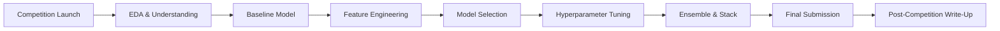

# 🏆 Kaggle Competitions — Project Guide

## Overview

Why this project matters for a first job.

Kaggle competitions prove you can work with real data, iterate under constraints, and produce reproducible results. A top-tier notebook or medal signals to recruiters that you understand the full modeling cycle and can write clean, narrative-driven code.

## Prerequisites

- Intermediate Python and pandas
- scikit-learn or XGBoost basics
- A Kaggle account
- Optional: Kaggle API configured locally

## Learning Objectives

1. Navigate Kaggle competition tiers and pick the right level.
2. Execute a repeatable workflow: EDA → baseline → feature engineering → model → ensemble → submission.
3. Write notebooks that tell a story, not just run code.
4. Use experiment tracking to compare submissions systematically.

## Official Resources & Links

| Resource | Type | URL | Why It Matters |
|----------|------|-----|----------------|
| Kaggle Competitions | Platform | https://www.kaggle.com/competitions | The primary arena for practice and credibility |
| Kaggle Learn | Course | https://www.kaggle.com/learn | Free micro-courses on ML, Python, and feature engineering |
| Kaggle API | Tool | https://github.com/Kaggle/kaggle-api | Download datasets and submit predictions from the command line |
| Weights & Biases | Tool | https://wandb.ai | Track experiments and compare Kaggle runs with beautiful charts |
| XGBoost Docs | Docs | https://xgboost.readthedocs.io | The most winning library on structured data competitions |
| Optuna | Tool | https://optuna.org | Hyperparameter optimization to squeeze extra performance |

## Architecture & Planning

### Competition Workflow



### Key Decisions

- **Getting Started**: Best for learning. No medals, but great for building habits.
- **Research**: Experimental tasks. Good for CV if you place well.
- **Featured**: Highest prestige. Medals here are resume gold.
- Always start with a quick baseline within 24 hours of joining a competition.

## Step-by-Step Implementation Guide

1. **Join and inspect**
   - What: Read the overview, evaluation metric, and data description.
   - Why: Misunderstanding the metric is the fastest way to waste weeks.
   - Code: Download data via Kaggle API.
     ```bash
     kaggle competitions download -c titanic
     unzip titanic.zip -d data/
     ```
   - Expected output: `data/train.csv`, `data/test.csv`, and a clear mental model of the target variable.

2. **Exploratory Data Analysis (EDA)**
   - What: Distributions, missing values, correlations, and outliers.
   - Why: Guides feature engineering and prevents data leakage.
   - Code: See the Guide Class below.
   - Expected output: A notebook section with at least 5 visualizations and a data-quality summary table.

3. **Build a baseline**
   - What: Minimal preprocessing + a simple model (logistic regression or a shallow tree).
   - Why: Sets a reference score and validates the pipeline.
   - Code:
     ```python
     from sklearn.dummy import DummyClassifier
     dummy = DummyClassifier(strategy="most_frequent")
     dummy.fit(X_train, y_train)
     print(dummy.score(X_valid, y_valid))
     ```
   - Expected output: A score on the validation set that every future model must beat.

4. **Feature engineering**
   - What: Imputation, encoding, scaling, and domain-specific transformations.
   - Why: Often provides larger gains than model swapping.
   - Code:
     ```python
     from sklearn.preprocessing import OneHotEncoder
     from sklearn.compose import ColumnTransformer
     preprocessor = ColumnTransformer([
         ("cat", OneHotEncoder(handle_unknown="ignore"), categorical_cols),
         ("num", "passthrough", numerical_cols),
     ])
     ```
   - Expected output: A transformed `X_train` with shape and sparsity noted.

5. **Model selection**
   - What: Try 3-5 algorithms (Random Forest, XGBoost, LightGBM, CatBoost).
   - Why: Different algorithms exploit different data patterns.
   - Code:
     ```python
     import xgboost as xgb
     model = xgb.XGBClassifier(n_estimators=500, learning_rate=0.05)
     model.fit(X_train, y_train, eval_set=[(X_valid, y_valid)], early_stopping_rounds=50)
     ```
   - Expected output: A leaderboard of validation scores per algorithm.

6. **Hyperparameter tuning**
   - What: Grid search or Bayesian optimization.
   - Why: Extracts the last few percentage points of performance.
   - Code:
     ```python
     import optuna
     def objective(trial):
         params = {
             "n_estimators": trial.suggest_int("n_estimators", 100, 1000),
             "max_depth": trial.suggest_int("max_depth", 3, 10),
         }
         model = xgb.XGBClassifier(**params)
         model.fit(X_train, y_train)
         return model.score(X_valid, y_valid)
     study = optuna.create_study(direction="maximize")
     study.optimize(objective, n_trials=20)
     ```
   - Expected output: Best parameters and a convergence plot.

7. **Ensemble and submit**
   - What: Weighted average or stacking of top models.
   - Why: Reduces variance and improves generalization.
   - Code:
     ```python
     preds = 0.6 * model_a.predict_proba(X_test) + 0.4 * model_b.predict_proba(X_test)
     submission = pd.DataFrame({"Id": test_ids, "Target": preds.argmax(axis=1)})
     submission.to_csv("submission.csv", index=False)
     ```
   - Expected output: A `submission.csv` uploaded to Kaggle with a public LB score.

8. **Write a post-competition notebook**
   - What: A narrative notebook summarizing your journey.
   - Why: Demonstrates communication skills and becomes a portfolio piece.
   - Code: Use markdown cells heavily. One section per step above.
   - Expected output: A public Kaggle notebook with comments and upvotes.

## Guide Class / Example

Complete copy-pasteable code.

```python
"""kaggle_baseline.py — Complete EDA + model script template."""

import pandas as pd
import numpy as np
import matplotlib.pyplot as plt
import seaborn as sns
from sklearn.model_selection import train_test_split
from sklearn.preprocessing import StandardScaler
from sklearn.ensemble import RandomForestClassifier
from sklearn.metrics import accuracy_score, classification_report

# ---------------------------
# 1. Load data
# ---------------------------
train = pd.read_csv("data/train.csv")
test = pd.read_csv("data/test.csv")

# ---------------------------
# 2. Quick EDA
# ---------------------------
print(train.shape)
print(train.isnull().sum().sort_values(ascending=False).head())

sns.countplot(x="Survived", data=train)
plt.title("Target Distribution")
plt.savefig("target_dist.png")
plt.close()

# ---------------------------
# 3. Minimal preprocessing
# ---------------------------
features = ["Pclass", "Sex", "Age", "SibSp", "Parch", "Fare"]
train["Age"] = train["Age"].fillna(train["Age"].median())
train["Fare"] = train["Fare"].fillna(train["Fare"].median())
train["Sex"] = train["Sex"].map({"male": 0, "female": 1})

X = train[features]
y = train["Survived"]

X_train, X_valid, y_train, y_valid = train_test_split(
    X, y, test_size=0.2, random_state=42, stratify=y
)

scaler = StandardScaler()
X_train_scaled = scaler.fit_transform(X_train)
X_valid_scaled = scaler.transform(X_valid)

# ---------------------------
# 4. Baseline model
# ---------------------------
model = RandomForestClassifier(n_estimators=200, random_state=42)
model.fit(X_train_scaled, y_train)

valid_preds = model.predict(X_valid_scaled)
print("Accuracy:", accuracy_score(y_valid, valid_preds))
print(classification_report(y_valid, valid_preds))

# ---------------------------
# 5. Prepare submission
# ---------------------------
test["Age"] = test["Age"].fillna(test["Age"].median())
test["Fare"] = test["Fare"].fillna(test["Fare"].median())
test["Sex"] = test["Sex"].map({"male": 0, "female": 1})
X_test = scaler.transform(test[features])
test_preds = model.predict(X_test)

submission = pd.DataFrame({"PassengerId": test["PassengerId"], "Survived": test_preds})
submission.to_csv("submission.csv", index=False)
print("Saved submission.csv")
```

## Common Pitfalls & Checklist

⚠️ **Overfitting the public leaderboard** — The public LB is only a subset. Trust your local CV.

⚠️ **Data leakage** — Never use future information or the test set to inform training decisions.

⚠️ **Ignoring the discussion forum** — Goldmine of insights, especially for new competitions.

⚠️ **Messy notebooks** — Recruiters read your public notebooks. Keep them clean and narrated.

| Checkpoint | Status |
|------------|--------|
| Baseline submitted within 24 hours | ☐ |
| EDA notebook published | ☐ |
| Cross-validation strategy defined | ☐ |
| Feature engineering documented | ☐ |
| Final ensemble justified in write-up | ☐ |
| Post-mortem notebook shared | ☐ |

## Deployment & Portfolio Integration

How to deploy and present for recruiters.

- **Kaggle Profile**: Keep it public. Pin your best notebooks. A bronze medal is better than none.
- **GitHub Mirror**: Push final code to a repo with a `README` linking back to your Kaggle notebook.
- **Resume Bullet**: "Placed top X% in Kaggle competition using XGBoost + Optuna, improving baseline by Y%."
- **LinkedIn**: Share your notebook with a key chart and a one-sentence takeaway.

## Next Steps

- [[00 - Project Planning Guide for ML and AI Engineering]]
- [[02 - End-to-End ML Project — Project Guide]]
- [[03 - Fine-Tuning LLMs — Project Guide]]
