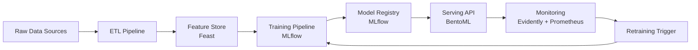

# 🔚 End-to-End ML Project — Project Guide

## Overview

Why this project matters for a first job.

Most junior candidates stop at a Jupyter notebook. Hiring managers want engineers who can ship: collect data, build pipelines, train reproducibly, serve predictions, and monitor drift. This guide walks through a production-grade ML lifecycle that separates you from the crowd.

## Prerequisites

- Intermediate Python and SQL
- Docker basics
- Familiarity with REST APIs
- One cloud account (AWS, GCP, or Azure) for optional deployment

## Learning Objectives

1. Build a reproducible ETL pipeline.
2. Manage features with a lightweight feature store.
3. Track experiments and register models with MLflow.
4. Serve models via containerized APIs.
5. Monitor model and data drift in production.

## Official Resources & Links

| Resource | Type | URL | Why It Matters |
|----------|------|-----|----------------|
| MLflow | Tool | https://mlflow.org | Experiment tracking, model registry, and deployment standard |
| Feast | Tool | https://feast.dev | Open-source feature store for real-time and batch serving |
| BentoML | Tool | https://www.bentoml.com | Model serving framework with adaptive batching and auto-generated APIs |
| Evidently AI | Tool | https://www.evidentlyai.com | Open-source ML monitoring for data and model drift |
| Prometheus | Tool | https://prometheus.io | Metrics collection and alerting for production systems |
| Docker Docs | Docs | https://docs.docker.com | Containerization is required for most ML engineering roles |

## Architecture & Planning

### End-to-End Architecture



### Key Decisions

- **Feast**: Keeps training and serving features consistent without heavy infrastructure.
- **MLflow**: Centralizes model versioning and artifact storage.
- **BentoML**: Abstracts framework-specific serving code into a unified API.
- **Evidently + Prometheus**: Lightweight, open-source monitoring stack.

## Step-by-Step Implementation Guide

1. **Data collection and ETL**
   - What: Ingest raw data, clean, and store in Parquet or a database.
   - Why: Production systems need reproducible data pipelines.
   - Code: `pandas` or `dask` for batch; `requests` for API ingestion.
   - Expected output: A `data/processed/` folder with versioned datasets.

2. **Feature engineering and store**
   - What: Define features in Feast and materialize them for training and serving.
   - Why: Prevents training-serving skew and enables feature reuse across teams.
   - Code:
     ```python
     from feast import FeatureStore
     store = FeatureStore(repo_path="feature_repo/")
     store.materialize_incremental(end_date=datetime.now())
     ```
   - Expected output: A Feast repo with `feature_view.py` and materialized features.

3. **Experiment tracking**
   - What: Log parameters, metrics, and artifacts with MLflow.
   - Why: Enables reproducibility and model comparison.
   - Code:
     ```python
     import mlflow
     mlflow.set_experiment("churn_prediction")
     with mlflow.start_run():
         mlflow.log_param("model", "xgboost")
         mlflow.log_metric("f1", 0.82)
         mlflow.sklearn.log_model(model, "model")
     ```
   - Expected output: An MLflow UI showing runs, parameters, and metrics.

4. **Model registration**
   - What: Promote the best run to a named model in the MLflow Model Registry.
   - Why: Decouples training from serving and enables rollback.
   - Code:
     ```python
     model_version = mlflow.register_model(
         model_uri=f"runs:/{best_run.info.run_id}/model",
         name="churn_model"
     )
     ```
   - Expected output: A registered model version in MLflow UI.

5. **Model serving**
   - What: Build a BentoML service that loads the registered model and exposes an API.
   - Why: Recruiters can `curl` your endpoint; it proves deployment skills.
   - Code: See `serve.py` in the Guide Class below.
   - Expected output: A local API returning predictions via HTTP POST.

6. **Containerization**
   - What: Dockerize the training and serving environments.
   - Why: Guarantees that code runs identically on any machine.
   - Code: See `docker-compose.yml` in the Guide Class below.
   - Expected output: `docker-compose up` spins up training, serving, and monitoring.

7. **Monitoring and drift detection**
   - What: Log request features and predictions; run Evidently reports periodically.
   - Why: Models degrade in production. Monitoring triggers retraining.
   - Code:
     ```python
     from evidently.report import Report
     from evidently.metric_preset import DataDriftPreset
     report = Report(metrics=[DataDriftPreset()])
     report.run(reference_data=ref, current_data=cur)
     report.save_html("drift_report.html")
     ```
   - Expected output: An HTML drift report saved on a schedule.

## Guide Class / Example

Complete copy-pasteable code.

### `train.py`

```python
"""train.py — Train a model and log to MLflow."""

import pandas as pd
from sklearn.model_selection import train_test_split
from sklearn.ensemble import RandomForestClassifier
from sklearn.metrics import f1_score
import mlflow
import mlflow.sklearn

DATA_PATH = "data/processed/churn.csv"
TEST_SIZE = 0.2
RANDOM_STATE = 42

if __name__ == "__main__":
    df = pd.read_csv(DATA_PATH)
    X = df.drop("churn", axis=1)
    y = df["churn"]
    X_train, X_test, y_train, y_test = train_test_split(
        X, y, test_size=TEST_SIZE, random_state=RANDOM_STATE, stratify=y
    )

    mlflow.set_experiment("churn_prediction")
    with mlflow.start_run():
        model = RandomForestClassifier(n_estimators=200, random_state=RANDOM_STATE)
        model.fit(X_train, y_train)

        preds = model.predict(X_test)
        f1 = f1_score(y_test, preds)

        mlflow.log_param("n_estimators", 200)
        mlflow.log_metric("f1", f1)
        mlflow.sklearn.log_model(model, "model")
        print(f"Logged model with F1={f1:.4f}")
```

### `serve.py`

```python
"""serve.py — BentoML service for the churn model."""

import bentoml
from bentoml.io import NumpyNdarray

model_ref = bentoml.sklearn.get("churn_model:latest")
model_runner = model_ref.to_runner()

svc = bentoml.Service("churn_service", runners=[model_runner])

@svc.api(input=NumpyNdarray(), output=NumpyNdarray())
def predict(input_data):
    return model_runner.predict.run(input_data)
```

### `docker-compose.yml`

```yaml
version: "3.8"

services:
  mlflow:
    image: python:3.10-slim
    ports:
      - "5000:5000"
    volumes:
      - ./mlruns:/mlruns
    command: >
      bash -c "pip install mlflow && mlflow ui --host 0.0.0.0 --port 5000"

  api:
    build: .
    ports:
      - "3000:3000"
    depends_on:
      - mlflow
    environment:
      - BENTOML_PORT=3000
```

## Common Pitfalls & Checklist

⚠️ **No environment reproducibility** — Always pin dependencies in `requirements.txt` or use Docker.

⚠️ **Training-serving skew** — Ensure feature transformations applied at training time are identical at inference time.

⚠️ **No model versioning** — Without a registry, you cannot roll back a bad deployment.

⚠️ **Ignoring data drift** — A model that was 95% accurate last quarter may be 70% today.

| Checkpoint | Status |
|------------|--------|
| ETL script is idempotent | ☐ |
| Features defined in a store or module | ☐ |
| MLflow experiment has >3 logged runs | ☐ |
| Model registered and versioned | ☐ |
| API responds to `curl` locally | ☐ |
| Docker Compose runs end-to-end | ☐ |
| Drift report generated automatically | ☐ |

## Deployment & Portfolio Integration

How to deploy and present for recruiters.

- **GitHub**: Structure the repo as a monorepo with `data/`, `feature_repo/`, `training/`, `serving/`, and `monitoring/` folders.
- **Live Demo**: Deploy the BentoML service to AWS ECS, GCP Cloud Run, or Railway.
- **Blog Post**: Write about one challenge you solved (e.g., "How I fixed training-serving skew with Feast").
- **Resume**: "Built end-to-end ML pipeline with MLflow, BentoML, and Docker; reduced model deployment time from days to minutes."

## Next Steps

- [[00 - Project Planning Guide for ML and AI Engineering]]
- [[01 - Kaggle Competitions — Project Guide]]
- [[03 - Fine-Tuning LLMs — Project Guide]]
