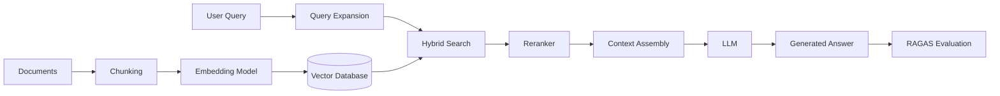

# 🤖 Production RAG System — Project Guide

## Overview

Retrieval-Augmented Generation (RAG) is the dominant pattern for production LLM applications. Employers want engineers who can build systems that ground LLM outputs in private data without retraining models. A complete RAG project on your portfolio proves you understand embedding models, vector databases, retrieval strategies, and evaluation — all critical for first ML/AI engineer roles.

## Prerequisites

- Python 3.10+
- Familiarity with LLMs and prompt engineering
- Basic understanding of vector math and similarity search
- Experience with REST APIs and JSON
- GitHub account for portfolio hosting

## Learning Objectives

- Implement multiple chunking strategies and compare their impact on retrieval quality
- Select and configure embedding models for domain-specific data
- Build hybrid search pipelines with reranking and query expansion
- Evaluate RAG systems using RAGAS metrics and human evaluation protocols
- Deploy a production-ready RAG API with monitoring

## Official Resources & Links

| Resource | Type | URL | Why It Matters |
|----------|------|-----|----------------|
| LangChain | Framework | https://python.langchain.com/ | Standard orchestration library for chaining LLM operations |
| LlamaIndex | Framework | https://docs.llamaindex.ai/ | Specialized framework for data ingestion and retrieval |
| Chroma | Vector DB | https://docs.trychroma.com/ | Open-source vector database ideal for prototyping and small-scale production |
| Weaviate | Vector DB | https://weaviate.io/developers/weaviate | Cloud-native vector DB with hybrid search and GraphQL interface |
| RAGAS | Evaluation | https://docs.ragas.io/ | Purpose-built framework for evaluating RAG pipelines without ground-truth labels |
| Pinecone | Vector DB | https://docs.pinecone.io/ | Managed vector database with metadata filtering and hybrid search |

## Architecture & Planning

### Key Decisions

1. **Chunking**: Use recursive character splitting with overlap for general text; semantic chunking for structured documents
2. **Embedding**: `text-embedding-3-large` or `BAAI/bge-large-en` for English; consider fine-tuning for domain data
3. **Vector DB**: Chroma for local development; Weaviate or Pinecone for production scale
4. **Retrieval**: Hybrid search (dense + BM25) with a cross-encoder reranker
5. **Evaluation**: RAGAS faithfulness + answer relevancy; supplement with human spot-checks

### Mermaid Diagram



## Step-by-Step Implementation Guide

### Step 1: Set Up Document Ingestion and Chunking

What: Load documents and split them into optimal chunks.

Why: Retrieval quality is more sensitive to chunking than embedding model choice.

Code:

```python
from langchain.document_loaders import DirectoryLoader
from langchain.text_splitter import RecursiveCharacterTextSplitter

loader = DirectoryLoader("data/", glob="**/*.pdf")
docs = loader.load()

splitter = RecursiveCharacterTextSplitter(
    chunk_size=512,
    chunk_overlap=64,
    separators=["\n\n", "\n", ".", " ", ""]
)
chunks = splitter.split_documents(docs)
print(f"Created {len(chunks)} chunks from {len(docs)} documents")
```

Expected output: `Created 1243 chunks from 12 documents`

### Step 2: Generate Embeddings and Store in Vector DB

What: Convert chunks to vectors and persist them.

Why: The vector index enables sub-second semantic search at scale.

Code:

```python
from langchain.embeddings import OpenAIEmbeddings
from langchain.vectorstores import Chroma

embedding = OpenAIEmbeddings(model="text-embedding-3-large")
vectorstore = Chroma.from_documents(
    documents=chunks,
    embedding=embedding,
    persist_directory="./chroma_db"
)
vectorstore.persist()
```

Expected output: Chroma database persisted to `./chroma_db`

### Step 3: Build Hybrid Retrieval with Reranking

What: Combine dense retrieval with keyword search and a cross-encoder reranker.

Why: Dense retrieval misses exact keyword matches; reranking boosts precision.

Code:

```python
from langchain.retrievers import BM25Retriever, EnsembleRetriever
from langchain_community.cross_encoders import HuggingFaceCrossEncoder
from langchain.retrievers.document_compressors import CrossEncoderReranker

bm25 = BM25Retriever.from_documents(chunks)
bm25.k = 10

dense = vectorstore.as_retriever(search_kwargs={"k": 10})
hybrid = EnsembleRetriever(retrievers=[bm25, dense], weights=[0.4, 0.6])

reranker = CrossEncoderReranker(
    model=HuggingFaceCrossEncoder(model_name="BAAI/bge-reranker-large"),
    top_n=5
)
```

Expected output: `EnsembleRetriever` and `CrossEncoderReranker` initialized.

### Step 4: Assemble the RAG Chain

What: Connect retrieval, prompt template, and LLM into a single chain.

Why: A chain ensures consistent context assembly and answer generation.

Code:

```python
from langchain.chains import RetrievalQA
from langchain.chat_models import ChatOpenAI

llm = ChatOpenAI(model="gpt-4o-mini", temperature=0.1)

qa_chain = RetrievalQA.from_chain_type(
    llm=llm,
    retriever=hybrid,
    chain_type="stuff",
    return_source_documents=True
)

result = qa_chain.invoke({"query": "What are the key safety protocols?"})
print(result["result"])
```

Expected output: A grounded answer citing source document chunks.

### Step 5: Evaluate with RAGAS

What: Run faithfulness and answer relevancy metrics on a test set.

Why: RAGAS provides automated, reference-free evaluation for production monitoring.

Code:

```python
from ragas import evaluate
from ragas.metrics import faithfulness, answer_relevancy
from datasets import Dataset

questions = ["What are the key safety protocols?", "How is model drift detected?"]
answers = [qa_chain.invoke({"query": q})["result"] for q in questions]
contexts = [[d.page_content for d in qa_chain.invoke({"query": q})["source_documents"]] for q in questions]

dataset = Dataset.from_dict({
    "question": questions,
    "answer": answers,
    "contexts": contexts
})

result = evaluate(dataset, metrics=[faithfulness, answer_relevancy])
print(result)
```

Expected output: `{'faithfulness': 0.89, 'answer_relevancy': 0.92}`

### Step 6: Deploy as an API

What: Wrap the chain in FastAPI with request validation.

Why: Recruiters can test your project live if it exposes a REST API.

Code:

```python
from fastapi import FastAPI
from pydantic import BaseModel

app = FastAPI()

class QueryRequest(BaseModel):
    query: str

@app.post("/ask")
def ask(req: QueryRequest):
    result = qa_chain.invoke({"query": req.query})
    return {
        "answer": result["result"],
        "sources": [d.metadata for d in result["source_documents"]]
    }
```

Expected output: `POST /ask` returns JSON with `answer` and `sources`.

## Guide Class / Example

Complete copy-pasteable RAG pipeline with evaluation:

```python
"""
Production RAG Pipeline
Run: pip install langchain chromadb ragas openai fastapi
"""
import os
from langchain.document_loaders import DirectoryLoader
from langchain.text_splitter import RecursiveCharacterTextSplitter
from langchain.embeddings import OpenAIEmbeddings
from langchain.vectorstores import Chroma
from langchain.retrievers import BM25Retriever, EnsembleRetriever
from langchain_community.cross_encoders import HuggingFaceCrossEncoder
from langchain.retrievers.document_compressors import CrossEncoderReranker
from langchain.chains import RetrievalQA
from langchain.chat_models import ChatOpenAI
from ragas import evaluate
from ragas.metrics import faithfulness, answer_relevancy
from datasets import Dataset

# --- Configuration ---
DATA_DIR = "./data"
DB_DIR = "./chroma_db"
EMBED_MODEL = "text-embedding-3-large"
LLM_MODEL = "gpt-4o-mini"
RERANKER = "BAAI/bge-reranker-large"

# --- 1. Ingest & Chunk ---
loader = DirectoryLoader(DATA_DIR, glob="**/*.pdf")
docs = loader.load()
splitter = RecursiveCharacterTextSplitter(chunk_size=512, chunk_overlap=64)
chunks = splitter.split_documents(docs)

# --- 2. Embed & Store ---
embedding = OpenAIEmbeddings(model=EMBED_MODEL)
vectorstore = Chroma.from_documents(chunks, embedding, persist_directory=DB_DIR)
vectorstore.persist()

# --- 3. Hybrid Retrieval + Rerank ---
bm25 = BM25Retriever.from_documents(chunks)
bm25.k = 10
dense = vectorstore.as_retriever(search_kwargs={"k": 10})
hybrid = EnsembleRetriever(retrievers=[bm25, dense], weights=[0.4, 0.6])

reranker = CrossEncoderReranker(
    model=HuggingFaceCrossEncoder(model_name=RERANKER),
    top_n=5
)

# --- 4. RAG Chain ---
llm = ChatOpenAI(model=LLM_MODEL, temperature=0.1)
qa_chain = RetrievalQA.from_chain_type(
    llm=llm,
    retriever=hybrid,
    chain_type="stuff",
    return_source_documents=True
)

# --- 5. Evaluate ---
test_queries = [
    "What are the key safety protocols?",
    "How is model drift detected?",
    "Explain the deployment rollback procedure."
]
results = [qa_chain.invoke({"query": q}) for q in test_queries]
answers = [r["result"] for r in results]
contexts = [[d.page_content for d in r["source_documents"]] for r in results]

dataset = Dataset.from_dict({
    "question": test_queries,
    "answer": answers,
    "contexts": contexts
})
scores = evaluate(dataset, metrics=[faithfulness, answer_relevancy])
print("Evaluation Scores:", scores)

# --- 6. Interactive Demo ---
if __name__ == "__main__":
    while True:
        q = input("Ask a question (or 'quit'): ")
        if q.lower() == "quit":
            break
        out = qa_chain.invoke({"query": q})
        print(f"Answer: {out['result']}\n")
```

## Common Pitfalls & Checklist

### Common Pitfalls

- **Chunks too large**: Exceeding the LLM context window or diluting relevance signals. Keep chunks under 512 tokens for most embedding models.
- **No query expansion**: User queries are often vague. Missing query expansion hurts recall significantly.
- **Skipping evaluation**: RAG without metrics is guesswork. Always run RAGAS and spot-check answers before claiming the system works.

### Checklist

| Item | Status |
|------|--------|
| Documents chunked with overlap | [ ] |
| Embedding model chosen and tested | [ ] |
| Vector database persisted | [ ] |
| Hybrid retrieval implemented | [ ] |
| Reranker integrated | [ ] |
| RAGAS faithfulness > 0.80 | [ ] |
| RAGAS answer relevancy > 0.80 | [ ] |
| FastAPI endpoint deployed | [ ] |
| README with architecture diagram | [ ] |
| Demo video or live link recorded | [ ] |

## Deployment & Portfolio Integration

- **Render / Railway**: Deploy the FastAPI app with a `Dockerfile`; both platforms have free tiers.
- **Streamlit**: Add a lightweight frontend so recruiters can interact without using `curl`.
- **GitHub README**: Include the Mermaid diagram, evaluation scores, and a 2-minute Loom demo.
- **LinkedIn post**: Share a 1-minute clip of the app answering a real question from your domain.

## Next Steps

- [[05 - Computer Vision Pipeline - Project Guide]]
- [[06 - Advanced MLOps - Project Guide]]
- [[07 - Paper Reproduction - Project Guide]]
