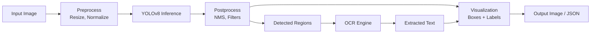

# 👁️ Computer Vision Pipeline — Project Guide

## Overview

Computer vision pipelines power autonomous vehicles, medical imaging, industrial inspection, and retail analytics. A portfolio project that ingests images, runs object detection and OCR, and optimizes inference proves you can ship real-world CV systems — not just train models in notebooks.

## Prerequisites

- Python 3.10+
- OpenCV basics (reading, resizing, drawing)
- Understanding of convolutional neural networks
- CUDA-capable GPU recommended for training
- Docker basics for deployment

## Learning Objectives

- Build end-to-end CV pipelines: preprocess, model inference, postprocess, visualize
- Train and deploy YOLOv8 for object detection on a custom dataset
- Integrate OCR for text extraction within detected regions
- Optimize models with ONNX, TensorRT, and OpenVINO for edge deployment
- Benchmark latency and accuracy across optimization targets

## Official Resources & Links

| Resource | Type | URL | Why It Matters |
|----------|------|-----|----------------|
| Ultralytics YOLOv8 | Framework | https://docs.ultralytics.com/ | State-of-the-art object detection with clean training and export APIs |
| OpenCV | Library | https://docs.opencv.org/4.x/ | Industry-standard library for image preprocessing and visualization |
| ONNX Runtime | Runtime | https://onnxruntime.ai/docs/ | Cross-platform inference acceleration for exported models |
| TensorRT | SDK | https://developer.nvidia.com/tensorrt | NVIDIA-optimized inference for maximum GPU throughput |
| Roboflow | Platform | https://docs.roboflow.com/ | Dataset versioning, annotation, and export in YOLO format |
| PaddleOCR | OCR Toolkit | https://github.com/PaddlePaddle/PaddleOCR | Lightweight multilingual OCR with strong accuracy |

## Architecture & Planning

### Key Decisions

1. **Detection**: YOLOv8 for speed-accuracy balance; export to ONNX for portability
2. **OCR**: PaddleOCR for multilingual support; run only inside detected bounding boxes
3. **Preprocessing**: Resize and normalize with OpenCV; maintain aspect ratio
4. **Optimization**: ONNX Runtime for CPU; TensorRT for NVIDIA GPUs; OpenVINO for Intel hardware
5. **Visualization**: OpenCV overlays with class labels, confidence scores, and extracted text

### Mermaid Diagram



## Step-by-Step Implementation Guide

### Step 1: Prepare Dataset with Roboflow

What: Annotate images and export in YOLOv8 format.

Why: Clean data preparation is the biggest determinant of model performance.

Code:

```python
from roboflow import Roboflow

rf = Roboflow(api_key="YOUR_KEY")
project = rf.workspace("your-workspace").project("your-project")
dataset = project.version(1).download("yolov8")
```

Expected output: A `data.yaml` file and train/valid/test splits in YOLO format.

### Step 2: Train YOLOv8 Object Detector

What: Fine-tune a pretrained YOLOv8 model on your custom dataset.

Why: Transfer learning reduces training time and data requirements.

Code:

```python
from ultralytics import YOLO

model = YOLO("yolov8n.pt")
model.train(data="data.yaml", epochs=50, imgsz=640, batch=16)
metrics = model.val()
print(f"mAP50-95: {metrics.box.map}")
```

Expected output: `mAP50-95: 0.72` (varies by dataset)

### Step 3: Export to ONNX for Portability

What: Convert the trained PyTorch model to ONNX.

Why: ONNX enables inference across different runtimes and hardware.

Code:

```python
model = YOLO("runs/detect/train/weights/best.pt")
model.export(format="onnx", imgsz=640, half=True)
```

Expected output: `best.onnx` file in the weights directory.

### Step 4: Build Inference Pipeline with OpenCV

What: Load image, preprocess, run ONNX inference, apply NMS.

Why: A clean pipeline separates concerns and makes optimization easier.

Code:

```python
import cv2
import numpy as np
import onnxruntime as ort

session = ort.InferenceSession("best.onnx", providers=["CUDAExecutionProvider", "CPUExecutionProvider"])
input_name = session.get_inputs()[0].name

def preprocess(img_path):
    img = cv2.imread(img_path)
    img = cv2.cvtColor(img, cv2.COLOR_BGR2RGB)
    img = cv2.resize(img, (640, 640))
    img = img.astype(np.float32) / 255.0
    img = np.transpose(img, (2, 0, 1))
    return np.expand_dims(img, axis=0), cv2.imread(img_path)

input_tensor, orig = preprocess("test.jpg")
outputs = session.run(None, {input_name: input_tensor})
```

Expected output: `outputs` array with bounding boxes, confidences, and class IDs.

### Step 5: Postprocess and Extract Regions for OCR

What: Filter low-confidence detections and crop regions for text reading.

Why: Running OCR only on relevant regions reduces noise and latency.

Code:

```python
from paddleocr import PaddleOCR

ocr = PaddleOCR(use_angle_cls=True, lang="en")

def postprocess(outputs, conf_thresh=0.5):
    preds = outputs[0]
    boxes = preds[preds[:, 4] > conf_thresh]
    return boxes

boxes = postprocess(outputs)
for box in boxes:
    x1, y1, x2, y2 = map(int, box[:4])
    crop = orig[y1:y2, x1:x2]
    result = ocr.ocr(crop, cls=True)
    text = " ".join([line[1][0] for line in result[0]]) if result[0] else ""
    print(f"Detected text: {text}")
```

Expected output: `Detected text: EXPIRES 12/2025`

### Step 6: Visualize Results

What: Draw bounding boxes, labels, and OCR text on the original image.

Why: Visualization is essential for debugging and portfolio demos.

Code:

```python
for box in boxes:
    x1, y1, x2, y2 = map(int, box[:4])
    conf = box[4]
    cls = int(box[5])
    label = f"Class {cls}: {conf:.2f}"
    cv2.rectangle(orig, (x1, y1), (x2, y2), (0, 255, 0), 2)
    cv2.putText(orig, label, (x1, y1 - 10), cv2.FONT_HERSHEY_SIMPLEX, 0.6, (0, 255, 0), 2)

cv2.imwrite("output.jpg", orig)
```

Expected output: `output.jpg` with green boxes and labels.

### Step 7: Optimize with TensorRT

What: Convert ONNX to TensorRT engine for maximum GPU throughput.

Why: TensorRT can deliver 2-5x speedup over ONNX Runtime on NVIDIA GPUs.

Code:

```bash
trtrtexec --onnx=best.onnx --saveEngine=best.trt --fp16
```

Expected output: `best.trt` engine file and latency benchmark.

## Guide Class / Example

Complete copy-pasteable CV inference pipeline:

```python
"""
Computer Vision Inference Pipeline
Run: pip install ultralytics opencv-python onnxruntime-gpu paddleocr
"""
import cv2
import numpy as np
import onnxruntime as ort
from paddleocr import PaddleOCR

class CVPipeline:
    def __init__(self, onnx_path, conf_thresh=0.5):
        self.session = ort.InferenceSession(
            onnx_path,
            providers=["CUDAExecutionProvider", "CPUExecutionProvider"]
        )
        self.input_name = self.session.get_inputs()[0].name
        self.conf_thresh = conf_thresh
        self.ocr = PaddleOCR(use_angle_cls=True, lang="en")

    def preprocess(self, img_path):
        img = cv2.imread(img_path)
        orig = img.copy()
        img = cv2.cvtColor(img, cv2.COLOR_BGR2RGB)
        img = cv2.resize(img, (640, 640))
        img = img.astype(np.float32) / 255.0
        img = np.transpose(img, (2, 0, 1))
        return np.expand_dims(img, axis=0), orig

    def postprocess(self, outputs):
        preds = outputs[0]
        boxes = preds[preds[:, 4] > self.conf_thresh]
        return boxes

    def run_ocr(self, crop):
        result = self.ocr.ocr(crop, cls=True)
        if result[0]:
            return " ".join([line[1][0] for line in result[0]])
        return ""

    def draw(self, img, boxes):
        for box in boxes:
            x1, y1, x2, y2 = map(int, box[:4])
            conf = box[4]
            cls = int(box[5])
            label = f"Class {cls}: {conf:.2f}"
            cv2.rectangle(img, (x1, y1), (x2, y2), (0, 255, 0), 2)
            cv2.putText(img, label, (x1, y1 - 10),
                        cv2.FONT_HERSHEY_SIMPLEX, 0.6, (0, 255, 0), 2)
        return img

    def predict(self, img_path):
        input_tensor, orig = self.preprocess(img_path)
        outputs = self.session.run(None, {self.input_name: input_tensor})
        boxes = self.postprocess(outputs)

        detections = []
        for box in boxes:
            x1, y1, x2, y2 = map(int, box[:4])
            crop = orig[y1:y2, x1:x2]
            text = self.run_ocr(crop)
            detections.append({
                "box": [x1, y1, x2, y2],
                "confidence": float(box[4]),
                "class": int(box[5]),
                "text": text
            })

        vis = self.draw(orig, boxes)
        cv2.imwrite("output.jpg", vis)
        return detections

if __name__ == "__main__":
    pipeline = CVPipeline("best.onnx")
    results = pipeline.predict("test.jpg")
    for r in results:
        print(r)
```

## Common Pitfalls & Checklist

### Common Pitfalls

- **Aspect ratio distortion**: Stretching images to square input hurts detection accuracy. Use letterbox padding when preprocessing.
- **CPU OCR on large images**: Running PaddleOCR on full-resolution frames is slow. Always crop to detected regions first.
- **Missing NMS**: ONNX exports may not include non-maximum suppression. Implement it in postprocessing to avoid duplicate boxes.

### Checklist

| Item | Status |
|------|--------|
| Dataset annotated and versioned | [ ] |
| YOLOv8 trained and validated | [ ] |
| Model exported to ONNX | [ ] |
| Inference pipeline with OpenCV | [ ] |
| OCR integrated on cropped regions | [ ] |
| Visualization output verified | [ ] |
| TensorRT / OpenVINO benchmarked | [ ] |
| Latency and accuracy metrics recorded | [ ] |
| FastAPI or Gradio demo deployed | [ ] |
| README with sample input/output | [ ] |

## Deployment & Portfolio Integration

- **Hugging Face Spaces**: Deploy a Gradio app with image upload and live inference.
- **Docker + FastAPI**: Containerize the pipeline and host on Render or AWS ECS.
- **Benchmark table**: Show FPS and mAP for ONNX, TensorRT, and OpenVINO side-by-side.
- **LinkedIn / Twitter**: Post a before/after visualization GIF to drive engagement.

## Next Steps

- [[04 - Production RAG System - Project Guide]]
- [[06 - Advanced MLOps - Project Guide]]
- [[07 - Paper Reproduction - Project Guide]]
