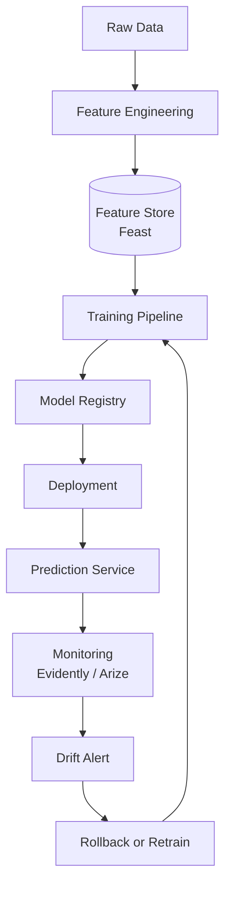

# ⚙️ Advanced MLOps — Project Guide

## Overview

MLOps is what separates research prototypes from production systems. Companies hire engineers who can automate training, version features, monitor drift, and recover from failures. This project demonstrates orchestration, feature stores, and model monitoring — the three pillars of mature ML platforms.

## Prerequisites

- Python 3.10+
- Experience with Docker and basic CI/CD
- Familiarity with scikit-learn or PyTorch
- Cloud basics (AWS, GCP, or Azure)
- Understanding of data pipelines and SQL

## Learning Objectives

- Orchestrate ML pipelines with Apache Airflow, Prefect, or Dagster
- Implement a feature store workflow with Feast
- Set up automated model monitoring with Evidently and Arize
- Build reproducible training pipelines with versioned data and artifacts
- Design rollback strategies for model deployments

## Official Resources & Links

| Resource | Type | URL | Why It Matters |
|----------|------|-----|----------------|
| Apache Airflow | Orchestration | https://airflow.apache.org/docs/ | Industry-standard scheduler for batch workflows |
| Prefect | Orchestration | https://docs.prefect.io/ | Modern Python-native workflow orchestration |
| Feast | Feature Store | https://docs.feast.dev/ | Open-source feature store for training-serving consistency |
| Evidently AI | Monitoring | https://docs.evidentlyai.com/ | Open-source ML monitoring and data drift detection |
| Arize AI | Monitoring | https://docs.arize.com/ | Production model observability and explainability platform |
| Dagster | Orchestration | https://docs.dagster.io/ | Data-aware orchestrator with strong testing support |

## Architecture & Planning

### Key Decisions

1. **Orchestrator**: Airflow for maturity and ecosystem; Prefect for simpler Python syntax; Dagster for data testing
2. **Feature Store**: Feast for open-source flexibility; Tecton for enterprise managed feature platform
3. **Monitoring**: Evidently for local dashboards and reports; Arize for cloud-native observability
4. **Storage**: S3 / GCS for artifacts; PostgreSQL or Redis for Feast online store
5. **CI/CD**: GitHub Actions to trigger Airflow DAGs on model code changes

### Mermaid Diagram



## Step-by-Step Implementation Guide

### Step 1: Define Features with Feast

What: Create feature definitions and materialize to online store.

Why: Feature stores eliminate training-serving skew and enable feature reuse.

Code:

```python
from feast import Entity, Feature, FeatureView, ValueType
from feast.types import Float32, Int64
from datetime import timedelta

user = Entity(name="user_id", value_type=ValueType.INT64)

user_fv = FeatureView(
    name="user_features",
    entities=["user_id"],
    ttl=timedelta(days=1),
    features=[
        Feature(name="age", dtype=Float32),
        Feature(name="purchase_count_7d", dtype=Int64),
    ],
    online=True,
    source=parquet_source
)
```

Expected output: `user_features` registered in Feast registry.

### Step 2: Materialize Features

What: Push latest feature values to Redis or PostgreSQL online store.

Why: Online materialization enables sub-millisecond feature lookups at inference time.

Code:

```bash
feast apply
feast materialize-incremental $(date +%Y-%m-%d)
```

Expected output: Features synced to online store for all entities.

### Step 3: Build an Airflow DAG for Training

What: Define a DAG that extracts features, trains a model, and validates it.

Why: Orchestration ensures pipelines run on schedule and failures are retried automatically.

Code:

```python
from airflow import DAG
from airflow.operators.python import PythonOperator
from datetime import datetime, timedelta

def extract_features():
    from feast import FeatureStore
    store = FeatureStore(repo_path=".")
    features = store.get_historical_features(
        entity_df=entity_df,
        features=["user_features:age", "user_features:purchase_count_7d"]
    ).to_df()
    features.to_parquet("training_data.parquet")

def train_model():
    import pandas as pd
    from sklearn.ensemble import RandomForestClassifier
    import joblib

    df = pd.read_parquet("training_data.parquet")
    X = df[["age", "purchase_count_7d"]]
    y = df["label"]
    model = RandomForestClassifier()
    model.fit(X, y)
    joblib.dump(model, "model.pkl")

with DAG(
    "ml_training_pipeline",
    start_date=datetime(2024, 1, 1),
    schedule_interval="@daily",
    catchup=False
) as dag:
    extract = PythonOperator(task_id="extract_features", python_callable=extract_features)
    train = PythonOperator(task_id="train_model", python_callable=train_model)
    extract >> train
```

Expected output: DAG `ml_training_pipeline` visible in Airflow UI with daily runs.

### Step 4: Add Data Validation with Great Expectations

What: Validate training data before model training starts.

Why: Catching schema drift or null spikes early prevents training on garbage data.

Code:

```python
import great_expectations as gx

context = gx.get_context()
datasource = context.sources.add_pandas("training_data")
data_asset = datasource.add_dataframe_asset(name="features")
batch_request = data_asset.build_batch_request(dataframe=df)

validator = context.get_validator(
    batch_request=batch_request,
    expectation_suite_name="training_suite"
)
validator.expect_column_values_to_not_be_null("age")
validator.expect_column_values_to_be_between("purchase_count_7d", min_value=0)
validator.save_expectation_suite(discard_failed_expectations=False)
```

Expected output: `training_suite` saved; validation fails if nulls or negative counts appear.

### Step 5: Monitor Model Drift with Evidently

What: Generate drift reports comparing reference and current datasets.

Why: Automated drift detection triggers retraining before performance degrades.

Code:

```python
from evidently.report import Report
from evidently.metric_preset import DataDriftPreset

report = Report(metrics=[DataDriftPreset()])
report.run(reference_data=reference_df, current_data=current_df)
report.save_html("drift_report.html")
```

Expected output: `drift_report.html` with drift scores per feature.

### Step 6: Integrate Arize for Production Monitoring

What: Log predictions and actuals to Arize.

Why: Arize provides centralized dashboards for performance, drift, and explainability.

Code:

```python
from arize.pandas.logger import Client

client = Client(organization_key="YOUR_ORG", api_key="YOUR_KEY")
client.log(
    dataframe=production_df,
    model_id="churn-model-v1",
    model_version="1.0.0",
    prediction_id_column="prediction_id",
    prediction_label_column="prediction",
    actual_label_column="actual"
)
```

Expected output: Predictions visible in Arize dashboard within minutes.

## Guide Class / Example

Complete copy-pasteable Airflow DAG for an MLOps pipeline:

```python
"""
Advanced MLOps Airflow DAG
Run: pip install apache-airflow feast evidently arize great_expectations scikit-learn
"""
from airflow import DAG
from airflow.operators.python import PythonOperator
from datetime import datetime, timedelta
import pandas as pd
import joblib
from sklearn.ensemble import RandomForestClassifier
from feast import FeatureStore
from evidently.report import Report
from evidently.metric_preset import DataDriftPreset
import great_expectations as gx

# --- Configuration ---
FEAST_REPO = "/opt/airflow/feast_repo"
MODEL_PATH = "/opt/airflow/models/model.pkl"
DATA_PATH = "/opt/airflow/data/training.parquet"

# --- Tasks ---
def extract_features():
    store = FeatureStore(repo_path=FEAST_REPO)
    entity_df = pd.read_parquet("/opt/airflow/data/entities.parquet")
    features = store.get_historical_features(
        entity_df=entity_df,
        features=["user_features:age", "user_features:purchase_count_7d"]
    ).to_df()
    features.to_parquet(DATA_PATH)

def validate_data():
    df = pd.read_parquet(DATA_PATH)
    context = gx.get_context(context_root_dir="/opt/airflow/gx")
    datasource = context.sources.add_pandas("training_data")
    data_asset = datasource.add_dataframe_asset(name="features")
    batch_request = data_asset.build_batch_request(dataframe=df)
    validator = context.get_validator(
        batch_request=batch_request,
        expectation_suite_name="training_suite"
    )
    validator.expect_column_values_to_not_be_null("age")
    validator.expect_column_values_to_be_between("purchase_count_7d", min_value=0)
    result = validator.validate()
    if not result.success:
        raise ValueError("Data validation failed")

def train_model():
    df = pd.read_parquet(DATA_PATH)
    X = df[["age", "purchase_count_7d"]]
    y = df["label"]
    model = RandomForestClassifier(n_estimators=100)
    model.fit(X, y)
    joblib.dump(model, MODEL_PATH)

def monitor_drift():
    reference = pd.read_parquet("/opt/airflow/data/reference.parquet")
    current = pd.read_parquet(DATA_PATH)
    report = Report(metrics=[DataDriftPreset()])
    report.run(reference_data=reference, current_data=current)
    report.save_html("/opt/airflow/reports/drift_report.html")

# --- DAG Definition ---
with DAG(
    dag_id="advanced_mlops_pipeline",
    default_args={"owner": "airflow", "retries": 1},
    start_date=datetime(2024, 1, 1),
    schedule_interval="@daily",
    catchup=False,
    tags=["mlops"]
) as dag:
    extract = PythonOperator(task_id="extract_features", python_callable=extract_features)
    validate = PythonOperator(task_id="validate_data", python_callable=validate_data)
    train = PythonOperator(task_id="train_model", python_callable=train_model)
    monitor = PythonOperator(task_id="monitor_drift", python_callable=monitor_drift)

    extract >> validate >> train >> monitor
```

## Common Pitfalls & Checklist

### Common Pitfalls

- **Training-serving skew**: Using different feature transformations in training and inference. Feast solves this by serving the same feature definitions to both.
- **Silent pipeline failures**: A task fails but the DAG continues. Always set `retries` and use sensors or SLAs to catch hangs.
- **No data validation**: Retraining on corrupted data propagates errors. Always validate schema and distributions before training.

### Checklist

| Item | Status |
|------|--------|
| Feast feature repository initialized | [ ] |
| Features materialized to online store | [ ] |
| Airflow DAG scheduled and tested | [ ] |
| Data validation with Great Expectations | [ ] |
| Model training automated | [ ] |
| Model artifact versioned (MLflow or S3) | [ ] |
| Drift report generated with Evidently | [ ] |
| Production predictions logged to Arize | [ ] |
| Alerting configured for drift or failure | [ ] |
| README with architecture and runbook | [ ] |

## Deployment & Portfolio Integration

- **Docker Compose**: Ship Airflow + Feast + Postgres + Redis in one command for local demos.
- **GitHub Actions**: Trigger DAG deployment on push to `main`.
- **Blog post**: Write about how you reduced training-serving skew by 90% using Feast.
- **LinkedIn**: Share a screenshot of your Airflow DAG graph and drift report side-by-side.

## Next Steps

- [[04 - Production RAG System - Project Guide]]
- [[05 - Computer Vision Pipeline - Project Guide]]
- [[07 - Paper Reproduction - Project Guide]]
