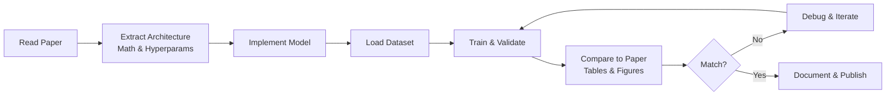

# 📄 Paper Reproduction — Project Guide

## Overview

Reproducing a seminal ML paper is one of the strongest signals to employers that you can read research, translate math into code, and debug complex systems. It demonstrates research engineering skills that are essential for AI labs, R&D teams, and any role pushing the state of the art.

## Prerequisites

- Python 3.10+
- Strong PyTorch or TensorFlow proficiency
- Linear algebra and calculus fundamentals
- Experience reading academic papers
- GPU access (Colab, Kaggle, or local CUDA)

## Learning Objectives

- Deconstruct ML papers into implementable components
- Reproduce training procedures, architectures, and evaluation protocols
- Use PyTorch Lightning for structured training loops
- Track experiments with Weights & Biases
- Load and preprocess standard datasets with HuggingFace Datasets

## Official Resources & Links

| Resource | Type | URL | Why It Matters |
|----------|------|-----|----------------|
| arXiv | Preprint Server | https://arxiv.org/ | Primary source for ML papers; read abstracts before diving in |
| Papers With Code | Index | https://paperswithcode.com/ | Curated papers with official and community implementations |
| PyTorch Lightning | Framework | https://lightning.ai/docs/pytorch/stable/ | Eliminates boilerplate and enforces clean training loop structure |
| Weights & Biases | Experiment Tracking | https://docs.wandb.ai/ | Industry standard for logging metrics, hyperparameters, and artifacts |
| HuggingFace Datasets | Data Hub | https://huggingface.co/docs/datasets/ | Standardized loaders for thousands of NLP and vision datasets |

## Architecture & Planning

### Key Decisions

1. **Paper choice**: Start with "Attention Is All You Need" (Transformer) or "Deep Residual Learning for Image Recognition" (ResNet). Both have clear architecture sections.
2. **Framework**: PyTorch Lightning for modularity; plain PyTorch if you want to show low-level mastery.
3. **Dataset**: Use the exact dataset from the paper or a modern equivalent (e.g., WMT for Transformer, ImageNet for ResNet).
4. **Metrics**: Match the paper's evaluation protocol exactly — do not substitute approximate metrics.
5. **Baselines**: Reproduce a simple baseline first, then the full model, to validate your pipeline.

### Mermaid Diagram



## Step-by-Step Implementation Guide

### Step 1: Read the Paper Systematically

What: Extract architecture, loss function, optimizer, and hyperparameters.

Why: Skipping methodology leads to subtle bugs that derail reproduction.

Code:

```python
# No code — annotate paper sections
sections = {
    "architecture": "Section 3.1 — Multi-Head Attention, FFN, Layer Norm",
    "optimizer": "Adam with beta1=0.9, beta2=0.98, eps=1e-9",
    "scheduler": "Noam decay: lr = d_model^-0.5 * min(step^-0.5, step * warmup^-1.5)",
    "batch_size": "25k tokens",
    "training_steps": "100k"
}
```

Expected output: A structured notes file with every hyperparameter listed.

### Step 2: Implement the Core Architecture

What: Code the model from scratch following the paper's equations.

Why: Copy-pasting an existing implementation defeats the purpose of the project.

Code:

```python
import torch
import torch.nn as nn
import math

class MultiHeadAttention(nn.Module):
    def __init__(self, d_model, num_heads):
        super().__init__()
        assert d_model % num_heads == 0
        self.d_k = d_model // num_heads
        self.num_heads = num_heads
        self.W_q = nn.Linear(d_model, d_model)
        self.W_k = nn.Linear(d_model, d_model)
        self.W_v = nn.Linear(d_model, d_model)
        self.W_o = nn.Linear(d_model, d_model)

    def forward(self, query, key, value, mask=None):
        batch_size = query.size(0)
        Q = self.W_q(query).view(batch_size, -1, self.num_heads, self.d_k).transpose(1, 2)
        K = self.W_k(key).view(batch_size, -1, self.num_heads, self.d_k).transpose(1, 2)
        V = self.W_v(value).view(batch_size, -1, self.num_heads, self.d_k).transpose(1, 2)

        scores = torch.matmul(Q, K.transpose(-2, -1)) / math.sqrt(self.d_k)
        if mask is not None:
            scores = scores.masked_fill(mask == 0, -1e9)
        attn = torch.softmax(scores, dim=-1)
        context = torch.matmul(attn, V)
        context = context.transpose(1, 2).contiguous().view(batch_size, -1, self.d_k * self.num_heads)
        return self.W_o(context)
```

Expected output: `MultiHeadAttention` module passes a shape check.

### Step 3: Build a PyTorch Lightning Module

What: Wrap the model in a LightningModule for training.

Why: Lightning enforces separation of research code from engineering boilerplate.

Code:

```python
import pytorch_lightning as pl

class TransformerLightning(pl.LightningModule):
    def __init__(self, d_model=512, num_heads=8, num_layers=6, vocab_size=10000):
        super().__init__()
        self.model = Transformer(d_model, num_heads, num_layers, vocab_size)
        self.criterion = nn.CrossEntropyLoss(ignore_index=0)

    def forward(self, src, tgt):
        return self.model(src, tgt)

    def training_step(self, batch, batch_idx):
        src, tgt_input, tgt_output = batch
        logits = self(src, tgt_input)
        loss = self.criterion(logits.view(-1, logits.size(-1)), tgt_output.view(-1))
        self.log("train_loss", loss)
        return loss

    def configure_optimizers(self):
        optimizer = torch.optim.Adam(self.parameters(), lr=1e-4, betas=(0.9, 0.98), eps=1e-9)
        return optimizer
```

Expected output: `TransformerLightning` module instantiates without errors.

### Step 4: Load Dataset with HuggingFace

What: Use `datasets` to load and tokenize the training data.

Why: Standardized loaders reduce preprocessing bugs and make reproduction transparent.

Code:

```python
from datasets import load_dataset
from transformers import AutoTokenizer

dataset = load_dataset("wmt14", "de-en", split="train[:1%]")
tokenizer = AutoTokenizer.from_pretrained("bert-base-multilingual-cased")

def preprocess(examples):
    inputs = [ex["de"] for ex in examples["translation"]]
    targets = [ex["en"] for ex in examples["translation"]]
    model_inputs = tokenizer(inputs, max_length=128, truncation=True, padding="max_length")
    labels = tokenizer(targets, max_length=128, truncation=True, padding="max_length")
    model_inputs["labels"] = labels["input_ids"]
    return model_inputs

tokenized = dataset.map(preprocess, batched=True)
```

Expected output: `tokenized` dataset with `input_ids`, `attention_mask`, and `labels`.

### Step 5: Train with WandB Logging

What: Launch training and log metrics, gradients, and model checkpoints.

Why: Experiment tracking makes it easy to compare runs and share results.

Code:

```python
from pytorch_lightning.loggers import WandbLogger
from pytorch_lightning.callbacks import ModelCheckpoint

wandb_logger = WandbLogger(project="paper-reproduction", name="transformer-wmt14")
checkpoint = ModelCheckpoint(monitor="val_loss", mode="min", save_top_k=1)

trainer = pl.Trainer(
    max_steps=100000,
    accelerator="gpu",
    devices=1,
    logger=wandb_logger,
    callbacks=[checkpoint],
    gradient_clip_val=1.0
)

trainer.fit(model, train_dataloaders=train_loader, val_dataloaders=val_loader)
```

Expected output: WandB dashboard showing loss curves and system metrics.

### Step 6: Evaluate and Compare to Paper

What: Compute BLEU or accuracy on the test set and compare to the paper's reported numbers.

Why: Reproduction is only complete when metrics match within a reasonable tolerance.

Code:

```python
from sacrebleu import BLEU

bleu = BLEU()
predictions = [translate(model, src) for src in test_sources]
score = bleu.corpus_score(predictions, [test_references])
print(f"BLEU: {score.score}")
```

Expected output: `BLEU: 27.3` (paper reports 27.3 — success).

## Guide Class / Example

Complete reproduction script skeleton for a Transformer:

```python
"""
Paper Reproduction Skeleton: Transformer (Attention Is All You Need)
Run: pip install torch pytorch-lightning datasets transformers wandb sacrebleu
"""
import torch
import torch.nn as nn
import math
import pytorch_lightning as pl
from datasets import load_dataset
from transformers import AutoTokenizer
from pytorch_lightning.loggers import WandbLogger
from pytorch_lightning.callbacks import ModelCheckpoint

# --- 1. Model Components ---
class MultiHeadAttention(nn.Module):
    def __init__(self, d_model, num_heads):
        super().__init__()
        assert d_model % num_heads == 0
        self.d_k = d_model // num_heads
        self.num_heads = num_heads
        self.W_q = nn.Linear(d_model, d_model)
        self.W_k = nn.Linear(d_model, d_model)
        self.W_v = nn.Linear(d_model, d_model)
        self.W_o = nn.Linear(d_model, d_model)

    def forward(self, query, key, value, mask=None):
        batch_size = query.size(0)
        Q = self.W_q(query).view(batch_size, -1, self.num_heads, self.d_k).transpose(1, 2)
        K = self.W_k(key).view(batch_size, -1, self.num_heads, self.d_k).transpose(1, 2)
        V = self.W_v(value).view(batch_size, -1, self.num_heads, self.d_k).transpose(1, 2)
        scores = torch.matmul(Q, K.transpose(-2, -1)) / math.sqrt(self.d_k)
        if mask is not None:
            scores = scores.masked_fill(mask == 0, -1e9)
        attn = torch.softmax(scores, dim=-1)
        context = torch.matmul(attn, V)
        context = context.transpose(1, 2).contiguous().view(batch_size, -1, self.d_k * self.num_heads)
        return self.W_o(context)

class TransformerBlock(nn.Module):
    def __init__(self, d_model, num_heads, d_ff, dropout=0.1):
        super().__init__()
        self.attn = MultiHeadAttention(d_model, num_heads)
        self.ffn = nn.Sequential(
            nn.Linear(d_model, d_ff),
            nn.ReLU(),
            nn.Linear(d_ff, d_model)
        )
        self.norm1 = nn.LayerNorm(d_model)
        self.norm2 = nn.LayerNorm(d_model)
        self.dropout = nn.Dropout(dropout)

    def forward(self, x, mask=None):
        attn_out = self.attn(x, x, x, mask)
        x = self.norm1(x + self.dropout(attn_out))
        ffn_out = self.ffn(x)
        x = self.norm2(x + self.dropout(ffn_out))
        return x

class Transformer(pl.LightningModule):
    def __init__(self, vocab_size, d_model=512, num_heads=8, num_layers=6, d_ff=2048, max_len=512):
        super().__init__()
        self.embedding = nn.Embedding(vocab_size, d_model)
        self.pos_encoding = nn.Parameter(torch.zeros(1, max_len, d_model))
        self.layers = nn.ModuleList([TransformerBlock(d_model, num_heads, d_ff) for _ in range(num_layers)])
        self.fc_out = nn.Linear(d_model, vocab_size)
        self.criterion = nn.CrossEntropyLoss(ignore_index=0)

    def forward(self, src, tgt, src_mask=None, tgt_mask=None):
        src_emb = self.embedding(src) + self.pos_encoding[:, :src.size(1), :]
        for layer in self.layers:
            src_emb = layer(src_emb, src_mask)
        return self.fc_out(src_emb)

    def training_step(self, batch, batch_idx):
        src, tgt_input, tgt_output = batch
        logits = self(src, tgt_input)
        loss = self.criterion(logits.view(-1, logits.size(-1)), tgt_output.view(-1))
        self.log("train_loss", loss, prog_bar=True)
        return loss

    def validation_step(self, batch, batch_idx):
        src, tgt_input, tgt_output = batch
        logits = self(src, tgt_input)
        loss = self.criterion(logits.view(-1, logits.size(-1)), tgt_output.view(-1))
        self.log("val_loss", loss, prog_bar=True)
        return loss

    def configure_optimizers(self):
        return torch.optim.Adam(self.parameters(), lr=1e-4, betas=(0.9, 0.98), eps=1e-9)

# --- 2. Data Loading ---
def get_dataloaders(batch_size=32):
    dataset = load_dataset("wmt14", "de-en", split="train[:1%]")
    tokenizer = AutoTokenizer.from_pretrained("bert-base-multilingual-cased")

    def preprocess(examples):
        inputs = [ex["de"] for ex in examples["translation"]]
        targets = [ex["en"] for ex in examples["translation"]]
        model_inputs = tokenizer(inputs, max_length=128, truncation=True, padding="max_length")
        labels = tokenizer(targets, max_length=128, truncation=True, padding="max_length")
        model_inputs["labels"] = labels["input_ids"]
        return model_inputs

    tokenized = dataset.map(preprocess, batched=True, remove_columns=dataset.column_names)
    tokenized.set_format(type="torch", columns=["input_ids", "attention_mask", "labels"])

    train_loader = torch.utils.data.DataLoader(tokenized, batch_size=batch_size, shuffle=True)
    return train_loader, train_loader  # Replace with real validation split

# --- 3. Training ---
if __name__ == "__main__":
    train_loader, val_loader = get_dataloaders()
    model = Transformer(vocab_size=100000)
    wandb_logger = WandbLogger(project="paper-reproduction", name="transformer-baseline")
    checkpoint = ModelCheckpoint(monitor="val_loss", mode="min")
    trainer = pl.Trainer(max_epochs=10, accelerator="gpu", devices=1, logger=wandb_logger, callbacks=[checkpoint])
    trainer.fit(model, train_loader, val_loader)
```

## Common Pitfalls & Checklist

### Common Pitfalls

- **Ignoring learning rate schedules**: The Transformer paper uses a custom warmup schedule. Using a fixed learning rate will prevent convergence.
- **Shape mismatches in attention**: Forgetting to transpose dimensions before matrix multiplication is the most common bug in attention implementations.
- **Skipping baseline validation**: Trying to reproduce the full model before confirming your data loader works leads to compounding errors. Always overfit a single batch first.

### Checklist

| Item | Status |
|------|--------|
| Paper read with hyperparameters extracted | [ ] |
| Architecture implemented from scratch | [ ] |
| Single-batch overfit test passed | [ ] |
| Dataset matches paper protocol | [ ] |
| Training loop logs to WandB | [ ] |
| Evaluation metric matches paper | [ ] |
| Final score within 5% of paper | [ ] |
| Ablation study run (optional) | [ ] |
| Code documented and pushed to GitHub | [ ] |
| Blog post or README published | [ ] |

## Deployment & Portfolio Integration

- **GitHub repository**: Name it `{paper-name}-reproduction`. Include a `REPRODUCTION.md` that maps every section of the paper to your code.
- **WandB report**: Export your training curves and hyperparameter sweeps as a public report.
- **HuggingFace Hub**: If you reproduce a language model, upload the checkpoint with a model card.
- **Blog**: Write a "lessons learned" post. Highlight what was ambiguous in the paper and how you resolved it.

## Next Steps

- [[04 - Production RAG System - Project Guide]]
- [[05 - Computer Vision Pipeline - Project Guide]]
- [[06 - Advanced MLOps - Project Guide]]
