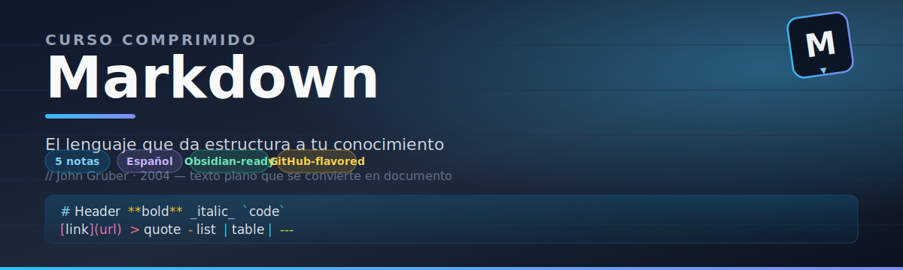

# 📘 Bienvenida al Curso Markdown

Bienvenido al curso comprimido de **Markdown**. Aquí aprenderás todo lo necesario para escribir documentos limpios, estructurados y compatibles con cualquier plataforma.

---

## 🗂️ Módulos del curso

1. [[01 - Sintaxis Basica|Sintaxis Básica]]
2. [[02 - Tablas y Bloques Avanzados|Tablas y Bloques Avanzados]]
3. [[03 - Markdown en Obsidian|Markdown en Obsidian]]
4. [[04 - Buenas Practicas|Buenas Prácticas]]

---

## 🤔 ¿Qué es Markdown?

Markdown es un lenguaje de marcado ligero creado por John Gruber en 2004. Su objetivo es escribir texto formateado de forma sencilla, usando una sintaxis que sea legible tal cual, sin necesidad de renderizarlo.

**Ventajas:**
- Fácil de aprender y escribir.
- Se lee perfectamente como texto plano.
- Compatible con GitHub, Obsidian, Notion, blogs, documentación y más.

---

> 💡 **Consejo:** Markdown no es un lenguaje de programación. Es solo una forma de darle estructura a tu texto.
