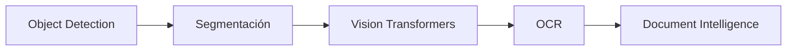

# 🎓 Bienvenida a Computer Vision Avanzada

Esta carpeta contiene las notas del curso **04 - Computer Vision Avanzada**, parte del módulo **01 - Deep Learning y Computer Vision**.

La visión por computadora avanzada representa el salto de entender "qué hay en una imagen" a entender "dónde está", "qué forma tiene" y "qué relación guarda con el texto". Estas capacidades son el núcleo de sistemas modernos de conducción autónoma, análisis médico, robótica e inteligencia documental.




---

## 📚 Índice del curso

1. [[01 - Object Detection]]: De la clasificación a la localización. Arquitecturas R-CNN, YOLO, SSD y métricas de detección.
2. [[02 - Segmentacion Semantica]]: Clasificación por píxel, FCN, U-Net, DeepLab, Mask R-CNN y métricas de segmentación.
3. [[03 - Vision Transformers]]: El paradigma transformer aplicado a imágenes. ViT, DeiT, Swin Transformer y comparativa con CNNs.
4. [[04 - OCR y Document Understanding]]: Reconocimiento óptico de caracteres con deep learning y comprensión documental con LayoutLM y Donut.
5. [[05 - Caso Practico - Sistema de Document Intelligence]]: Proyecto integrador de extracción inteligente de documentos.

---

## 📖 Glosario de términos

| Término | Definición |
|---------|------------|
| **IoU (Intersection over Union)** | Métrica que mide la superposición entre dos bounding boxes o máscaras. Rango [0, 1]. |
| **mAP (mean Average Precision)** | Promedio de precisión promedio sobre múltiples clases y umbrales de IoU. Métrica estándar en detección. |
| **NMS (Non-Maximum Suppression)** | Algoritmo para eliminar detecciones duplicadas sobrelapadas, conservando solo la más confiable. |
| **Anchor boxes** | Cajas de referencia de múltiples escalas y aspect ratios que guían la predicción de bounding boxes. |
| **FPN (Feature Pyramid Network)** | Red que construye pirámides de caracteres para detectar objetos a distintas escalas. |
| **ROI (Region of Interest)** | Región candidata de una imagen que potencialmente contiene un objeto. |
| **Semantic segmentation** | Clasificación de cada píxel en una clase sin distinguir instancias individuales. |
| **Instance segmentation** | Segmentación que además diferencia objetos individuales de la misma clase. |
| **Transformer** | Arquitectura basada en mecanismos de atención, originalmente para NLP, adaptada a visión. |
| **Self-attention** | Mecanismo que calcula la importancia relativa entre todos los pares de elementos de una secuencia. |
| **OCR (Optical Character Recognition)** | Reconocimiento automático de texto en imágenes o documentos escaneados. |
| **LayoutLM** | Modelo multimodal que combina representaciones de texto y layout espacial para comprensión documental. |
| **Document AI** | Campo de IA dedicado a extraer información estructurada de documentos no estructurados. |

---

## 🎯 Objetivos de aprendizaje

Al completar este curso serás capaz de:

1. Explicar las diferencias fundamentales entre clasificación, detección y segmentación, y elegir la técnica adecuada para cada problema.
2. Implementar y entrenar modelos de detección de objetos utilizando arquitecturas modernas (YOLO, RetinaNet).
3. Aplicar redes de segmentación semántica e instancia para análisis detallado de imágenes médicas o satelitales.
4. Comprender el mecanismo de self-attention y cómo los transformers redefinen la visión por computadora.
5. Construir pipelines de OCR y comprensión documental que extraigan texto, layout y entidades de documentos reales.
6. Diseñar e implementar un sistema de Document Intelligence completo, desde la ingesta hasta el despliegue.

---

## ⚠️ Advertencia general

No intentes aprender estos temas en orden aleatorio. La detección de objetos depende de comprender bien las convoluciones y el backpropagation. Los transformers requieren entender atención. El caso práctico asume dominio de todo lo anterior.

💡 **Regla mnemotécnica**: **"Detecta, segmenta, transforma, lee, integra"** — este es el flujo natural de complejidad creciente en visión avanzada.

---

## 📦 Código de compresión

```python
"""
Bienvenida: script de verificación de entorno para Computer Vision Avanzada.
Asegúrate de tener instaladas las dependencias necesarias.
"""

import importlib
import sys

def check_package(name, import_name=None):
    import_name = import_name or name
    try:
        importlib.import_module(import_name)
        print(f"[OK] {name}")
        return True
    except ImportError:
        print(f"[FALTA] {name}")
        return False

requirements = {
    "torch": "torch",
    "torchvision": "torchvision",
    "opencv-python": "cv2",
    "numpy": "numpy",
    "Pillow": "PIL",
    "transformers": "transformers",
    "timm": "timm",
    "matplotlib": "matplotlib",
    "pycocotools": "pycocotools",
    "ultralytics": "ultralytics",
}

print("Verificando entorno de Computer Vision Avanzada...\n")
all_ok = all(check_package(pkg, mod) for pkg, mod in requirements.items())

if not all_ok:
    print("\n⚠️ Instala los paquetes faltantes con: pip install <paquete>")
    sys.exit(1)
else:
    print("\n✅ Todo listo. ¡Bienvenido al curso!")
```

---

## 🎯 Proyecto documentado: Preparación para Document Intelligence

### Descripción
Proyecto guía que se construirá a lo largo del curso y se consolidará en la nota 05.

### Requisitos funcionales
1. El sistema debe recibir imágenes de documentos en formatos JPG, PNG o PDF.
2. Debe detectar regiones de interés (texto, tablas, sellos) mediante detección de objetos.
3. Debe segmentar áreas semánticamente (título, párrafo, tabla, firma).
4. Debe extraer texto mediante OCR y entender relaciones espaciales.
5. Debe exportar resultados estructurados en JSON.

### Componentes principales
- **Ingesta**: Conversión y preprocesamiento de documentos.
- **Detección**: Modelo tipo LayoutLMv3 / YOLO para regiones.
- **OCR**: TrOCR o Tesseract como base.
- **Extracción**: NER y key-value pairing.
- **Exportación**: API REST con respuesta JSON.

### Métricas de éxito
- F1-score por campo extraído > 0.90 en facturas.
- Latencia de inferencia < 3 segundos por página.
- Precisión de OCR > 95 % en documentos limpios.

### Referencias
- Redmon, J., et al. "You Only Look Once." CVPR 2016.
- Vaswani, A., et al. "Attention Is All You Need." NeurIPS 2017.
- Xu, Y., et al. "LayoutLM: Pre-training of Text and Layout." KDD 2020.
