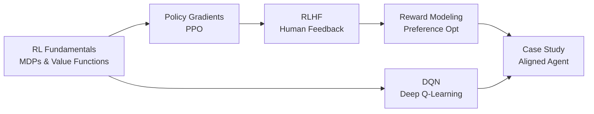

# 🎮 Welcome to Reinforcement Learning for AI Engineers

Reinforcement Learning is no longer just about playing Atari games. It is the technology that aligns ChatGPT, Claude, and Gemini with human values. It powers autonomous agents that navigate the web, trade stocks, and control robots. For AI engineers in 2026, RL is not optional — it is the mechanism that turns a raw foundation model into a safe, helpful, and aligned product.

This course bridges theory and practice: from Markov Decision Processes and value functions to PPO, DQN, RLHF, reward modeling, and alignment theory. Every concept is grounded in production applications, not arcade games.

---

## Course Index

1. [[01 - RL Fundamentals|RL Fundamentals: MDPs, Value Functions, and Policies]]
2. [[02 - DQN and Deep Q-Learning|DQN and Deep Q-Learning]]
3. [[03 - PPO and Policy Gradients|PPO and Policy Gradient Methods]]
4. [[04 - RLHF and Alignment|RLHF: Reinforcement Learning from Human Feedback]]
5. [[05 - Reward Modeling|Reward Modeling and Preference Optimization]]
6. [[06 - RL Case Study|Building an Aligned Agent: End-to-End Case Study]]

---

## Learning Path

---

## Why RL Matters for AI Engineers

| Application | RL Technique | Real System |
|---|---|---|
| **LLM Alignment** | RLHF + PPO | ChatGPT, Claude, Gemini, Llama |
| **Agent Decision-Making** | PPO + MCTS | OpenAI Operator, Anthropic Computer Use |
| **Recommendation Systems** | Bandits + Deep Q-Networks | YouTube, TikTok, Spotify |
| **Autonomous Vehicles** | Model-Based RL + PPO | Waymo, Tesla FSD |
| **Robotics** | Sim-to-Real RL | Boston Dynamics, Figure AI |

---

## Prerequisites

- Python and PyTorch fundamentals
- Deep learning basics (neural networks, gradient descent)
- Probability theory (expectations, distributions)
- No prior RL experience required — this course starts from zero

---

💡 **Tip:** RL is harder to debug than supervised learning because the training signal (reward) is sparse, delayed, and noisy. The first rule of RL debugging: always log the reward distribution, not just the mean.

⚠️ **Warning:** RL experiments are computationally expensive. Budget time for hyperparameter tuning — PPO performance can vary 2x with different learning rate and entropy coefficient settings.
