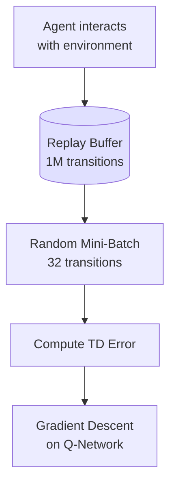

# 🕹️ DQN and Deep Q-Learning

## Introduction

Q-learning works beautifully when your state space is small enough to fit in a lookup table — but the real world has states you cannot enumerate. A chess position, a conversation history, a camera frame: these are states with millions or continuous dimensions. Deep Q-Networks (DQN) solved this problem by replacing the Q-table with a neural network: $Q_\theta(s, a)$ is approximated by a deep net that takes raw pixels (or any high-dimensional state) and outputs Q-values for each action.

DQN was the breakthrough that launched deep reinforcement learning. Published by DeepMind in 2015, it achieved superhuman performance on 29 out of 49 Atari games — from raw pixels, with no game-specific engineering. Every subsequent deep RL algorithm (PPO, SAC, TD3) inherited DQN's core innovations: experience replay and target networks.

---

## 1. 🧠 From Tabular Q-Learning to Deep Q-Networks

### The Tabular Bottleneck

Tabular Q-learning stores one number per state-action pair. If you have 10 states and 4 actions, that's 40 numbers — trivial. If you have images (84×84 pixels × 3 channels = 21,168 dimensions), the state space is effectively infinite. You cannot store a Q-table.

### The Neural Network Solution

Instead of `Q[state, action]`, use a neural network: $Q(s, a; \theta)$.

```mermaid
graph LR
    A[State s<br/>84x84x4 frames] --> B[Conv Layers<br/>Feature extraction]
    B --> C[Dense Layers]
    C --> D[Q-values<br/>Q(s,a₁), Q(s,a₂), ..., Q(s,aₙ)]

    style A fill:#ccffcc
    style D fill:#ffcccc
```

The network takes a state (or state representation) as input and outputs a Q-value for each possible action. This generalizes across states — similar states produce similar Q-values, even for states never seen during training.

### The DQN Loss Function

DQN minimizes the temporal difference (TD) error:

$$
\mathcal{L}(\theta) = \mathbb{E}_{(s, a, r, s') \sim \mathcal{D}} \left[ \left( r + \gamma \max_{a'} Q(s', a'; \theta^-) - Q(s, a; \theta) \right)^2 \right]
$$

Where:
- $Q(s, a; \theta)$ is the **online network** — the one being trained
- $Q(s', a'; \theta^-)$ is the **target network** — a frozen copy, updated periodically
- $\mathcal{D}$ is the **replay buffer** — a dataset of past experiences

---

## 2. ⚡ Two Innovations That Made DQN Work

### Innovation 1: Experience Replay

Instead of learning from consecutive experiences (which are highly correlated), DQN stores experiences in a replay buffer and samples mini-batches randomly:



**Why this matters:**
| Without Replay | With Replay |
|---|---|
| Consecutive samples are correlated → unstable gradients | Random samples are i.i.d. → stable gradients (like supervised learning) |
| Each experience used once and discarded | Each experience reused many times → data efficient |
| Recent experiences dominate → catastrophic forgetting | Old and new experiences mixed → stable long-term learning |

### Innovation 2: Target Network

If you use the same network for both the current Q-estimate and the target, the target moves while you're chasing it — like trying to hit a moving target while standing on it:

$$
\text{No target net: } \mathcal{L} = (r + \gamma \max_a Q_\theta(s', a) - Q_\theta(s, a))^2
$$

Both terms depend on $\theta$ — the optimization is chasing its own tail.

**Solution:** Freeze a copy of the network (target network $\theta^-$) and update it every $C$ steps:

$$
\mathcal{L} = (r + \gamma \max_a Q_{\theta^-}(s', a) - Q_\theta(s, a))^2
$$

| Parameter | Typical Value | Effect |
|---|---|---|
| **Target update frequency (C)** | 1,000 — 10,000 steps | Lower = less stable; higher = slower convergence |
| **Replay buffer size** | 100K — 1M transitions | Larger = more diverse training data |
| **Mini-batch size** | 32 — 128 | Standard SGD batch sizing |

---

## 3. 💻 DQN Implementation

```python
import torch
import torch.nn as nn
import torch.optim as optim
import numpy as np
from collections import deque
import random

class DQN(nn.Module):
    """Deep Q-Network for discrete action spaces."""

    def __init__(self, state_dim, action_dim, hidden_dim=256):
        super().__init__()
        self.net = nn.Sequential(
            nn.Linear(state_dim, hidden_dim),
            nn.ReLU(),
            nn.Linear(hidden_dim, hidden_dim),
            nn.ReLU(),
            nn.Linear(hidden_dim, action_dim)
        )

    def forward(self, state):
        return self.net(state)


class ReplayBuffer:
    """Stores and samples past experiences."""

    def __init__(self, capacity=100000):
        self.buffer = deque(maxlen=capacity)

    def push(self, state, action, reward, next_state, done):
        self.buffer.append((state, action, reward, next_state, done))

    def sample(self, batch_size):
        batch = random.sample(self.buffer, batch_size)
        states, actions, rewards, next_states, dones = zip(*batch)
        return (torch.FloatTensor(np.array(states)),
                torch.LongTensor(actions),
                torch.FloatTensor(rewards),
                torch.FloatTensor(np.array(next_states)),
                torch.FloatTensor(dones))

    def __len__(self):
        return len(self.buffer)


class DQNAgent:
    def __init__(self, state_dim, action_dim, gamma=0.99, lr=1e-3,
                 epsilon_start=1.0, epsilon_end=0.01, epsilon_decay=10000):
        self.action_dim = action_dim
        self.gamma = gamma
        self.epsilon = epsilon_start
        self.epsilon_end = epsilon_end
        self.epsilon_decay = epsilon_decay
        self.steps = 0

        # Online and target networks
        self.q_net = DQN(state_dim, action_dim)
        self.target_net = DQN(state_dim, action_dim)
        self.target_net.load_state_dict(self.q_net.state_dict())

        self.optimizer = optim.Adam(self.q_net.parameters(), lr=lr)
        self.replay = ReplayBuffer()

    def act(self, state, evaluate=False):
        self.steps += 1
        self.epsilon = max(
            self.epsilon_end,
            self.epsilon_start - (self.epsilon_start - self.epsilon_end) *
            self.steps / self.epsilon_decay
        )

        if not evaluate and random.random() < self.epsilon:
            return random.randrange(self.action_dim)

        with torch.no_grad():
            state = torch.FloatTensor(state).unsqueeze(0)
            q_values = self.q_net(state)
            return q_values.argmax().item()

    def learn(self, batch_size=64):
        if len(self.replay) < batch_size:
            return None

        states, actions, rewards, next_states, dones = self.replay.sample(batch_size)

        # Current Q-values for taken actions
        q_values = self.q_net(states).gather(1, actions.unsqueeze(1)).squeeze()

        # Target Q-values using target network
        with torch.no_grad():
            next_q = self.target_net(next_states).max(1)[0]
            target = rewards + self.gamma * next_q * (1 - dones)

        loss = nn.MSELoss()(q_values, target)

        self.optimizer.zero_grad()
        loss.backward()
        # Gradient clipping prevents instability
        torch.nn.utils.clip_grad_norm_(self.q_net.parameters(), 1.0)
        self.optimizer.step()

        return loss.item()

    def update_target(self):
        """Periodically copy online weights to target."""
        self.target_net.load_state_dict(self.q_net.state_dict())
```

---

## 4. 🔬 DQN Variants and Improvements

| Variant | Key Idea | When to Use |
|---|---|---|
| **Double DQN** | Use online net for action selection, target net for evaluation — reduces overestimation bias | Default choice over vanilla DQN |
| **Dueling DQN** | Split Q-network into V(s) and A(s,a) streams — better value estimation | When many actions have similar values |
| **Prioritized Experience Replay** | Sample important transitions more often (high TD error) | When rewards are rare |
| **Noisy DQN** | Replace ε-greedy with learned parametric noise | Better exploration than ε-greedy |
| **Rainbow** | Combines all 6 improvements | State-of-the-art for discrete action spaces |
| **C51 / QR-DQN** | Distributional RL — learn distribution of returns, not just mean | When risk matters (finance, safety) |

### Double DQN — The Default Choice

Vanilla DQN overestimates Q-values because the max operator is biased upward:

$$
\text{Vanilla target: } r + \gamma \max_{a'} Q(s', a'; \theta^-)
$$

Double DQN decouples action selection from evaluation:

$$
\text{Double DQN target: } r + \gamma Q(s', \argmax_{a'} Q(s', a'; \theta); \theta^-)
$$

The action is chosen by the online network ($\theta$), but evaluated by the target network ($\theta^-$). This unbiased estimation typically gives 5-10% better performance with zero additional compute.

---

## 5. 🎯 When to Use DQN (and When Not To)

### Ideal for DQN

- **Discrete action spaces** (DQN outputs one Q-value per action)
- **High-dimensional state spaces** (images, sensor readings)
- **Off-policy learning** (replay buffer enables learning from any experience)
- **Single-agent environments** with clear reward signals

### Not Ideal for DQN

- **Continuous action spaces** → Use DDPG, SAC, or PPO
- **Stochastic policies matter** → Use policy gradient methods
- **Multi-agent settings** → Q-learning becomes non-stationary
- **Very sparse rewards** → Consider hierarchical RL or intrinsic motivation

---

## 6. 🌍 Production DQN Deployments

| Company | Application | DQN Variant |
|---|---|---|
| **Google DeepMind** | Data center cooling optimization | Double DQN + ensemble |
| **YouTube** | Video bitrate adaptation for streaming | DQN + contextual bandits |
| **Alibaba** | E-commerce search ranking | Dueling DQN for ad placement |
| **Unity** | NPC behavior in games | Rainbow DQN |
| **Huawei** | 5G network resource allocation | Double DQN + prioritized replay |

---

## ⚠️ Pitfalls

- **Catastrophic forgetting in replay buffer:** If your replay buffer is too small, the agent forgets old experiences. If too large, the agent learns from outdated policies. Balance with buffer size = 100K-1M for moderate environments.
- **Q-value overestimation compounds:** The max operator consistently overestimates Q. In environments with hundreds of actions, this bias can be catastrophic. Always use Double DQN.
- **Reward scale matters:** DQN is sensitive to reward magnitude. Rewards in [0, 1] or [-1, 1] work well. Rewards in [0, 1000] cause gradient explosions. Clip or normalize rewards.
- **Frame stacking is essential for partial observability:** If your state is a single image, the agent can't perceive motion. Stack 4 consecutive frames as the state.

---

## 💡 Tips

- **Start with a simple environment:** CartPole or LunarLander before Atari. These converge in minutes, not days, allowing rapid hyperparameter iteration.
- **Monitor TD error as a debugging signal:** If TD error explodes, reduce learning rate. If it collapses to zero, increase exploration. A healthy TD error fluctuates but trends downward.
- **Use Huber loss instead of MSE for robustness:** `nn.SmoothL1Loss()` (Huber) is less sensitive to outliers than `nn.MSELoss()`, which is critical when rewards are stochastic.

---

## 📦 Compression Code

```python
import gymnasium as gym
import torch
import torch.nn as nn

env = gym.make("CartPole-v1")
agent = DQNAgent(state_dim=4, action_dim=2, epsilon_decay=5000)

episodes = 500
target_update_freq = 100
step_counter = 0

for ep in range(episodes):
    state, _ = env.reset()
    total_reward = 0

    for t in range(500):
        action = agent.act(state)
        next_state, reward, terminated, truncated, _ = env.step(action)
        done = terminated or truncated

        agent.replay.push(state, action, reward, next_state, done)
        loss = agent.learn(batch_size=64)

        state = next_state
        total_reward += reward
        step_counter += 1

        if step_counter % target_update_freq == 0:
            agent.update_target()

        if done:
            break

    if ep % 50 == 0:
        print(f"Episode {ep:3d} | Reward: {total_reward:5.1f} | ε: {agent.epsilon:.3f}")

env.close()
```

---

## ✅ Knowledge Check

1. **Why is experience replay necessary for stable DQN training?** — Consecutive experiences are correlated (temporal dependence), which causes unstable gradients. Random sampling from a replay buffer breaks this correlation, making training closer to supervised i.i.d. learning.

2. **What problem does the target network solve?** — Without a target network, the Q-values used in the TD target depend on the same parameters being optimized — the target is non-stationary. Freezing a target network stabilizes the learning objective.

3. **How does Double DQN reduce Q-value overestimation?** — It decouples action selection (using the online network) from action evaluation (using the target network). The online net chooses the action; the frozen target net evaluates it — removing the positive bias from the max operator.

4. **When should you use DQN vs Policy Gradient methods?** — DQN for discrete action spaces with off-policy efficiency. Policy gradients (PPO) for continuous actions, stochastic policies, and when you need to constrain policy updates (critical for RLHF).

---

## 🎯 Key Takeaways

- DQN replaces the Q-table with a neural network, enabling RL on high-dimensional states.
- Experience replay breaks temporal correlation; target networks stabilize the learning objective.
- Double DQN is the minimal viable DQN — always use it over vanilla DQN for the same compute cost.
- DQN works for discrete action spaces; for continuous actions, use policy gradient methods.
- Reward scaling, frame stacking, and gradient clipping are not optional — they're survival requirements for DQN in practice.

---

## References

- Mnih et al., "Human-level control through deep reinforcement learning" (Nature, 2015)
- Van Hasselt et al., "Deep Reinforcement Learning with Double Q-learning" (AAAI, 2016)
- Schaul et al., "Prioritized Experience Replay" (ICLR, 2016)
- Hessel et al., "Rainbow: Combining Improvements in Deep Reinforcement Learning" (AAAI, 2018)
