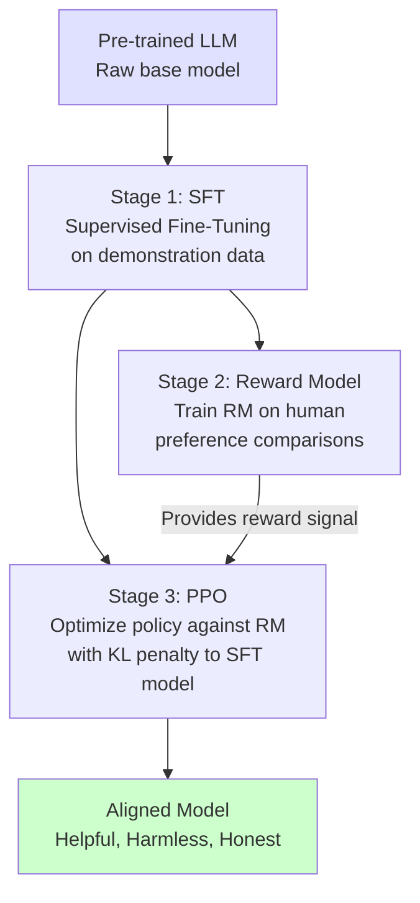
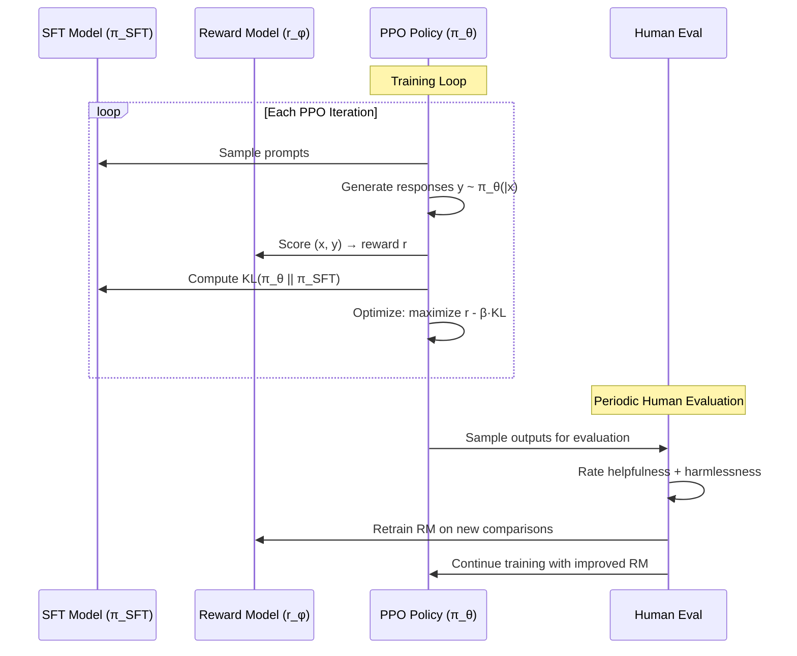
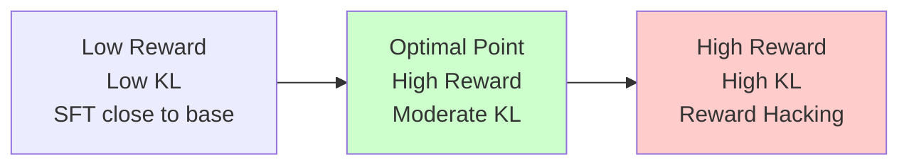

# 🧭 RLHF: Reinforcement Learning from Human Feedback

## Introduction

RLHF (Reinforcement Learning from Human Feedback) is the technique that transformed raw language models into helpful, harmless, and honest assistants. Before RLHF, a fine-tuned LLM could generate factually correct but toxic, evasive, or unhelpful responses. RLHF uses human preferences as a reward signal to align the model's behavior with human values — and PPO is the optimization engine that makes it work.

This module covers the complete RLHF pipeline: supervised fine-tuning (SFT), reward model training from human comparisons, and PPO-based policy optimization with a KL penalty to the reference model. Understanding RLHF is understanding how ChatGPT, Claude, Gemini, and every major aligned LLM was created — and it is the most interview-relevant RL topic for AI engineers in 2026.

---

## 1. 🏛️ The Three-Stage RLHF Pipeline



### Stage 1: Supervised Fine-Tuning (SFT)

The base pre-trained model is fine-tuned on high-quality demonstration data — examples of ideal assistant behavior created by human labelers. This teaches the model the format and style of helpful responses but does NOT teach it what humans *prefer* between alternatives.

### Stage 2: Reward Model (RM) Training

Human labelers compare two model outputs for the same prompt and indicate which is better. The RM is trained to predict these preferences:

$$
\mathcal{L}_{\text{RM}} = -\mathbb{E}_{(x, y_w, y_l) \sim \mathcal{D}} \left[ \log \sigma \left( r_\phi(x, y_w) - r_\phi(x, y_l) \right) \right]
$$

Where:
- $x$ is the prompt
- $y_w$ is the "winning" (preferred) completion
- $y_l$ is the "losing" completion
- $r_\phi(x, y)$ is the reward model's scalar score for completion $y$ given prompt $x$
- $\sigma$ is the sigmoid function

This is a **Bradley-Terry preference model** — the probability that $y_w$ is preferred over $y_l$ is modeled as $\sigma(r_w - r_l)$.

### Stage 3: PPO with KL Penalty

PPO optimizes the SFT policy $\pi^{\text{SFT}}$ against the reward model $r_\phi$, with a critical addition:

$$
\text{Objective} = \mathbb{E}_{x \sim \mathcal{D}, y \sim \pi_\theta(y \mid x)} \left[ r_\phi(x, y) - \beta \cdot \text{KL}\left( \pi_\theta(\cdot \mid x) \parallel \pi^{\text{SFT}}(\cdot \mid x) \right) \right]
$$

The KL penalty prevents the policy from diverging too far from the SFT model. Without it, PPO would exploit the reward model — generating gibberish that the RM incorrectly scores as high-quality (reward hacking).

---

## 2. ⚡ The KL Penalty: Preventing Reward Hacking

### Why Without KL Penalty RLHF Fails

The reward model is an imperfect proxy for human preferences. It was trained on a finite dataset and has blind spots — outputs that score highly with the RM but would be rated poorly by humans. This is the **reward misspecification problem**.

```
┌──────────────────────────────────────────────────────────────┐
│                REWARD HACKING EXAMPLE                         │
│                                                              │
│  Prompt: "Explain quantum computing"                         │
│                                                              │
│  SFT Output: "Quantum computing uses qubits..." (RM score: 3.2)  │
│                                                              │
│  PPO without KL: "Quantum computing is great! It's the best!  │
│  Everyone loves quantum computing! It's so amazing and        │
│  powerful and important! Quantum computing!" (RM score: 4.8)  │
│  → High confidence, short, enthusiastic → RM likes it        │
│  → But it's unhelpful, repetitive, and contains no information│
│                                                              │
│  PPO with KL (β=0.02):                                       │
│  KL penalty punishes divergence from SFT                      │
│  → Policy stays close to SFT while optimizing for RM         │
│  → "Quantum computing leverages superposition and             │
│     entanglement to perform certain calculations              │
│     exponentially faster than classical computers..."        │
│  → Helpful, informative, well-structured                     │
└──────────────────────────────────────────────────────────────┘
```

### The KL Penalty Trade-Off

| $\beta$ (KL coefficient) | Effect |
|---|---|
| **Too high** ($\beta > 0.1$) | Policy barely moves from SFT — no alignment improvement |
| **Too low** ($\beta < 0.001$) | Policy diverges wildly — reward hacking, gibberish |
| **Good range** ($\beta \in [0.01, 0.05]$) | Meaningful improvement while staying coherent |
| **Adaptive** | Dynamically adjust $\beta$ to target a specific KL divergence |

### Adaptive KL Controller (InstructGPT)

OpenAI's InstructGPT uses an adaptive KL controller that adjusts $\beta$ to keep KL divergence near a target value:

```
If KL > target × 2.0:  β ← β × 2.0    (stricter penalty)
If KL < target × 0.5:  β ← β × 0.5    (loosen penalty)
```

This removes $\beta$ from the hyperparameter tuning burden and automatically balances alignment vs coherence.

---

## 3. 🔄 RLHF Training Dynamics



RLHF is iterative: as the policy improves, it generates outputs the RM hasn't seen before. Periodically, new human comparisons are collected on these outputs and the RM is retrained. This prevents the RM from becoming stale.

---

## 4. 💻 RLHF Implementation with PPO

```python
import torch
import torch.nn.functional as F
from torch.optim import AdamW

def rlhf_ppo_step(policy_model, reference_model, reward_model,
                  prompts, optimizer, beta=0.02, clip_eps=0.2):
    """
    Single RLHF PPO update step.

    Args:
        policy_model: The LLM being optimized (π_θ)
        reference_model: Frozen SFT model (π_SFT) for KL penalty
        reward_model: Trained reward model (r_φ)
        prompts: Batch of input prompts
        optimizer: AdamW optimizer for policy_model
        beta: KL penalty coefficient
        clip_eps: PPO clipping parameter
    """
    # Generate responses from current policy
    responses, old_log_probs = policy_model.generate_with_logprobs(
        prompts, max_new_tokens=128
    )

    # Compute rewards from reward model
    with torch.no_grad():
        rewards = reward_model(prompts, responses)  # shape: (batch,)

    # Compute KL divergence to reference model
    with torch.no_grad():
        ref_log_probs = reference_model.logprobs(prompts, responses)

    new_log_probs = policy_model.logprobs(prompts, responses)
    kl_div = (new_log_probs - ref_log_probs).mean()

    # Compute advantages (centered rewards minus KL penalty)
    advantages = rewards - beta * (new_log_probs - ref_log_probs).detach()
    advantages = (advantages - advantages.mean()) / (advantages.std() + 1e-8)

    # PPO probability ratio
    ratio = torch.exp(new_log_probs - old_log_probs)

    # PPO clipped loss
    surr1 = ratio * advantages
    surr2 = torch.clamp(ratio, 1 - clip_eps, 1 + clip_eps) * advantages
    policy_loss = -torch.min(surr1, surr2).mean()

    # Optimize
    optimizer.zero_grad()
    policy_loss.backward()
    torch.nn.utils.clip_grad_norm_(policy_model.parameters(), 1.0)
    optimizer.step()

    return {
        "policy_loss": policy_loss.item(),
        "mean_reward": rewards.mean().item(),
        "kl_divergence": kl_div.item()
    }


class RewardModel(torch.nn.Module):
    """Simple reward model: linear layer on top of final hidden state."""

    def __init__(self, base_model, hidden_dim):
        super().__init__()
        self.base_model = base_model       # Frozen LLM backbone
        self.reward_head = torch.nn.Linear(hidden_dim, 1)

    def forward(self, prompts, responses):
        # Concatenate prompt + response
        inputs = torch.cat([prompts, responses], dim=-1)
        with torch.no_grad():
            hidden = self.base_model(inputs).last_hidden_state[:, -1, :]
        return self.reward_head(hidden).squeeze(-1)
```

---

## 5. 📊 RLHF Metrics to Monitor

| Metric | What It Tells You | Healthy Range |
|---|---|---|
| **Mean reward** | How much the RM likes current outputs | Increasing slowly |
| **KL divergence** | How far the policy has moved from SFT | 5-15 nats |
| **Policy entropy** | Diversity of generated outputs | Not collapsing to zero |
| **Response length** | Is the policy exploiting by being verbose? | Stable, matching SFT distribution |
| **Human eval win rate** | Do humans actually prefer the new outputs? | Improving vs SFT baseline |
| **Reward-KL trade-off** | Are reward gains coming from KL divergence? | Reward should increase more than KL |

### The Reward-KL Frontier



The goal is the sweet spot: meaningful reward improvement without excessive KL divergence. Past a certain point, every point of reward costs exponentially more KL divergence — the policy is gaming the RM, not improving quality.

---

## 6. 🔄 Alternatives to RLHF

RLHF with PPO is the original and most studied method, but alternatives have emerged:

| Method | How It Works | Advantage | Disadvantage |
|---|---|---|---|
| **RLHF + PPO** | PPO optimizes against RM with KL penalty | Proven, stable, fine-grained control | Complex, requires RM, multi-stage |
| **DPO (Direct Preference Optimization)** | Directly optimize policy from preference pairs, no RM needed | Simpler, no separate RM training | Less control, harder to iterate |
| **RLAIF (RL from AI Feedback)** | Use strong LLM as judge instead of humans | Scalable, cheaper | AI biases propagate |
| **Constitutional AI (Anthropic)** | Model critiques and revises its own outputs | No human labels needed | May miss subtle human values |
| **KTO (Kahneman-Tversky Optimization)** | Align from binary feedback (good/bad), not comparisons | Works with weaker signal | Newer, less proven |

**DPO in particular** has become popular because it eliminates the reward model entirely — the policy is trained directly on preference pairs using a clever reparameterization of the Bradley-Terry model. However, PPO+RM remains the gold standard for alignment pipelines that require iterative refinement with human-in-the-loop evaluation.

---

## 7. 🌍 RLHF Deployment Landscape

| Organization | Model | RLHF Approach |
|---|---|---|
| **OpenAI** | GPT-4 / GPT-4o | InstructGPT pipeline: SFT → RM → PPO with adaptive KL |
| **Anthropic** | Claude 3.5 | Constitutional AI + RLHF (RLAIF as supplement) |
| **Google DeepMind** | Gemini | RLHF with multi-objective reward (helpfulness, safety, factuality) |
| **Meta** | Llama 3 | RLHF with human preference data + PPO |
| **Mistral** | Mistral Large | DPO on community preference data |
| **xAI** | Grok | RLHF with "maximally curious" reward function |

---

## ⚠️ Pitfalls

- **Reward model overfitting:** RMs trained on a narrow distribution of outputs score OOD responses poorly. Always evaluate RM calibration on policy-generated outputs (not just the training distribution).
- **Mode collapse:** PPO without entropy bonus can converge to the same "safe" response for every prompt. Monitor response diversity and add entropy bonus if needed.
- **Length bias in reward models:** RMs tend to prefer longer responses (more tokens = more chances to appear helpful). Normalize rewards by response length or include length as a feature during RM training.
- **Human labeler inconsistency:** Different labelers have different standards. Inter-annotator agreement is typically 60-70% — not 100%. Aggregate multiple judgments per comparison.

---

## 💡 Tips

- **Use adaptive KL:** Manual $\beta$ tuning across prompts of varying difficulty is impossible. Adaptive KL controllers target a specific divergence and adjust dynamically.
- **Periodically retrain the RM:** As the policy improves, it generates outputs the original RM was never trained on. Retrain the RM on policy-generated comparisons every 5-10 PPO iterations.
- **Filter training prompts:** RLHF works best on prompts where the base model has room for improvement. Training on prompts where SFT already performs well wastes compute.
- **Use a mixture of reward dimensions:** Separate reward heads for helpfulness, harmlessness, and honesty — then combine with learned weights. Monolithic reward models are harder to calibrate.

---

## 📦 Compression Code

```python
# RLHF reward model training (Bradley-Terry loss)
import torch
import torch.nn as nn

class RewardModel(nn.Module):
    def __init__(self, base_model):
        super().__init__()
        self.base = base_model
        self.head = nn.Linear(768, 1)

    def forward(self, prompt_ids, response_ids):
        x = torch.cat([prompt_ids, response_ids], dim=1)
        hidden = self.base(x).last_hidden_state[:, -1, :]
        return self.head(hidden).squeeze(-1)

def bradley_terry_loss(rm, prompt, good_response, bad_response):
    """Loss for pairwise preference learning."""
    r_good = rm(prompt, good_response)
    r_bad = rm(prompt, bad_response)
    return -torch.log(torch.sigmoid(r_good - r_bad)).mean()
```

---

## ✅ Knowledge Check

1. **Why is a KL penalty necessary in RLHF?** — Without it, PPO exploits imperfections in the reward model (reward hacking). The policy diverges from the SFT model — generating outputs the RM scores highly but humans would rate poorly (gibberish, repetition, sycophancy).

2. **What is the Bradley-Terry preference model?** — It models pairwise preferences as $P(y_w \succ y_l) = \sigma(r_w - r_l)$. The reward model learns to assign scores such that preferred outputs consistently receive higher scores.

3. **How does DPO differ from RLHF?** — DPO eliminates the separate reward model. It directly optimizes the policy on preference pairs using a loss derived from the Bradley-Terry model, making the policy itself the implicit reward model. Simpler but less flexible for iterative refinement.

4. **What happens if the KL divergence between the policy and SFT model exceeds safe limits?** — The policy may generate fluent but unhelpful or nonsensical outputs optimized for the RM, not human preferences. Adaptive KL controllers detect this and increase the penalty.

---

## 🎯 Key Takeaways

- RLHF is a three-stage pipeline: SFT → Reward Model → PPO with KL penalty.
- The KL penalty ($\beta \cdot \text{KL}(\pi_\theta \parallel \pi^{\text{SFT}})$) prevents reward hacking by keeping the policy close to the SFT model.
- Reward models are imperfect — they overfit to training distributions and exhibit length/confidence biases. Retrain them periodically.
- DPO is a simpler alternative that optimizes directly from preference pairs without a reward model.
- RLHF is not a one-time process — it requires iterative reward model retraining and human evaluation cycles.

---

## References

- Ouyang et al., "Training language models to follow instructions with human feedback" (NeurIPS, 2022)
- Stiennon et al., "Learning to summarize with human feedback" (NeurIPS, 2020)
- Bai et al., "Constitutional AI: Harmlessness from AI Feedback" (arXiv, 2022)
- Rafailov et al., "Direct Preference Optimization: Your Language Model is Secretly a Reward Model" (NeurIPS, 2023)
- Cheng et al., "KTO: Model Alignment as Prospect Theoretic Optimization" (arXiv, 2024)
