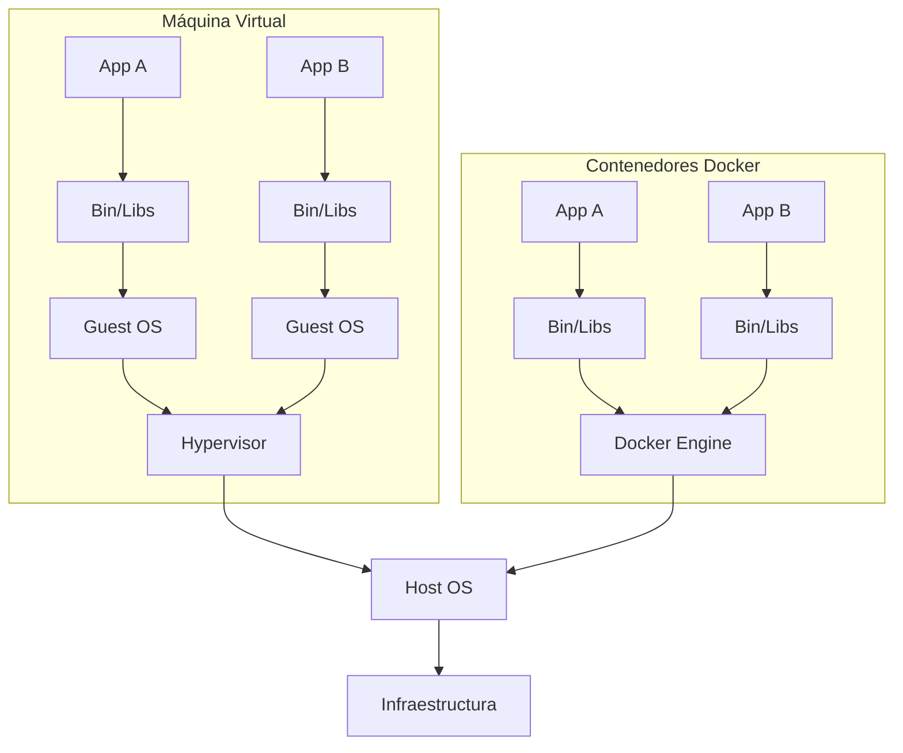
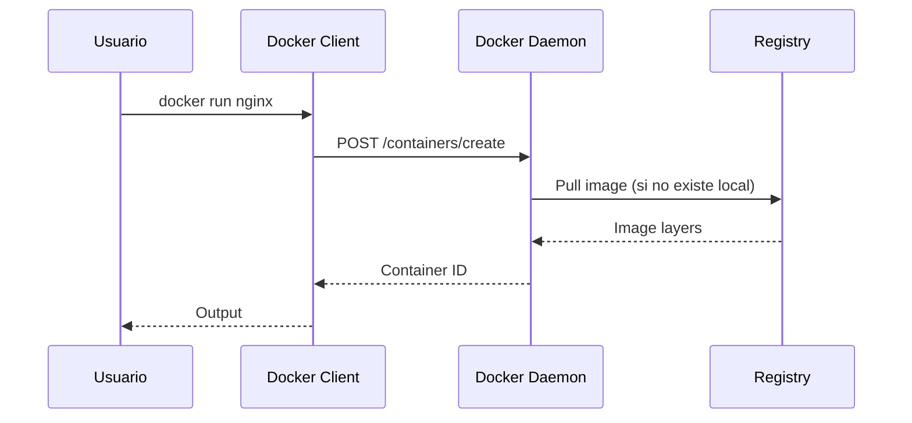
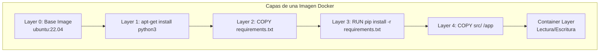
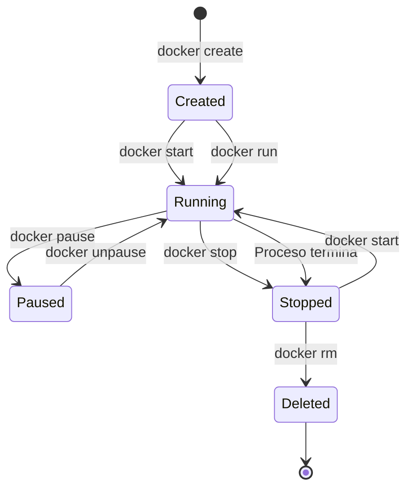

# 🐋 01 - Fundamentos de Docker y Contenedores

Docker ha revolucionado la forma en que diseñamos, construimos y desplegamos software. Para un **Backend Engineer**, significa entornos de ejecución idénticos entre desarrollo y producción. Para un **ML/AI Engineer**, representa la capacidad de empaquetar modelos con sus dependencias exactas (incluyendo versiones de CUDA, cuDNN y bibliotecas científicas) y desplegarlos en cualquier infraestructura con garantía de reproducibilidad.

Caso real: Un equipo de MLOps en una fintech necesita desplegar un modelo de detección de fraude entrenado con PyTorch 2.1 + CUDA 11.8. Sin Docker, cada servidor de producción requiere configuración manual de drivers y librerías. Con Docker, el modelo se empaqueta una sola vez y funciona idénticamente en cualquier nodo con Docker Engine instalado.

---

## 1. Historia y Evolución: VMs vs Contenedores

Antes de Docker (2013), la virtualización completa era la norma. Las máquinas virtuales (VMs) emulan hardware completo mediante un hypervisor, lo que permite ejecutar sistemas operativos guest sobre un host. Sin embargo, esto introduce overhead significativo.

| Característica | Máquina Virtual (VM) | Contenedor Docker |
|----------------|----------------------|-------------------|
| Aislamiento | Hardware-level (hypervisor) | OS-level (kernel namespaces) |
| Tamaño | Gigabytes (OS completo) | Megabytes (solo capas necesarias) |
| Arranque | Minutos | Segundos |
| Overhead | Alto (múltiples kernels) | Bajo (comparte kernel del host) |
| Portabilidad | Dependiente del hypervisor | Portable entre cualquier Docker runtime |
| Densidad | Decenas por servidor | Miles por servidor |



⚠️ **Advertencia**: Aunque los contenedores ofrecen aislamiento de procesos, no proporcionan el mismo nivel de seguridad que una VM contra vulnerabilidades del kernel. En entornos multi-tenant altamente sensibles, considera usar VMs o gVisor/Kata Containers como capa adicional.

💡 **Tip**: Para cargas de trabajo ML con GPU, los contenedores son superiores porque el NVIDIA Container Toolkit permite pasar GPUs directamente al contenedor sin overhead de virtualización de hardware.

---

## 2. Arquitectura Docker

Docker utiliza una arquitectura cliente-servidor. Los componentes principales son:

| Componente | Función |
|------------|---------|
| **Docker Daemon** (`dockerd`) | Proceso de fondo que gestiona objetos Docker (imágenes, contenedores, redes, volúmenes). Escucha en un socket UNIX o TCP. |
| **Docker Client** (`docker`) | CLI que envía comandos al daemon mediante la API REST de Docker. |
| **Docker Registry** | Servicio de almacenamiento de imágenes (Docker Hub por defecto). |



Caso real: En un pipeline de CI, el Docker client dentro del runner de GitHub Actions se comunica con el daemon del host para construir imágenes. La latencia entre client y daemon puede afectar el rendimiento si están en máquinas separadas.

---

## 3. Namespaces: El Corazón del Aislamiento

Linux namespaces son la primitiva del kernel que Docker utiliza para aislamiento. Cada namespace encapsula una vista global del sistema para un grupo de procesos.

| Namespace | Aisla | Uso en Docker |
|-----------|-------|---------------|
| **PID** | IDs de procesos | El contenedor ve PID 1 como su proceso raíz |
| **NET** | Interfaces de red, tablas de routing, sockets | Cada contenedor obtiene su propio loopback y interfaces virtuales |
| **MNT** | Puntos de montaje | El contenedor ve su propio filesystem raíz (la imagen) |
| **UTS** | Hostname y NIS domain | Cada contenedor puede tener su propio hostname |
| **IPC** | Recursos de comunicación entre procesos (shared memory, semáforos) | Previene que contenedores accedan a memoria compartida de otros |
| **USER** | IDs de usuario y grupo | Permite mapear root del contenedor a un usuario no privilegiado del host |
| **CGROUP** (namespace en kernels recientes) | Control groups | Aisla la vista de los recursos del sistema |

⚠️ **Advertencia**: El namespace USER no está habilitado por defecto en todas las distribuciones. Sin él, el usuario root dentro del contenedor es root en el host, lo que representa un riesgo de seguridad grave.

💡 **Tip**: Puedes inspeccionar los namespaces de un contenedor en ejecución con:

```bash
ls -la /proc/<pid_del_contenedor>/ns/
```

---

## 4. Control Groups (cgroups): Limitación de Recursos

Mientras los namespaces aislan lo que un contenedor puede *ver*, los cgroups limitan lo que un contenedor puede *usar*. Docker utiliza cgroups v2 (o v1 en sistemas antiguos) para:

- **CPU**: Límites de uso (`--cpus`), shares (`--cpu-shares`), pinning (`--cpuset-cpus`).
- **Memoria**: Límite RAM (`-m`), swap (`--memory-swap`), kernel memory (`--kernel-memory`).
- **I/O de disco**: Throttling de lectura/escritura (`--device-read-bps`).
- **Red**: Control de ancho de banda de red.

| Flag | Descripción | Ejemplo |
|------|-------------|---------|
| `--cpus="1.5"` | Limita a 1.5 cores | `docker run --cpus="1.5" nginx` |
| `-m 512m` | Máximo 512 MB RAM | `docker run -m 512m nginx` |
| `--memory-swap -1` | Swap ilimitado | `docker run -m 512m --memory-swap -1 nginx` |
| `--pids-limit 100` | Máximo 100 procesos | `docker run --pids-limit 100 nginx` |

Caso real: Un servicio de inferencia de ML con TensorFlow Serving puede consumir toda la RAM disponible si no se limita. Usar `-m 8g --memory-swap 8g` fuerza a OOM Killer a terminar el contenedor antes de que el host entre en swap death.

```bash
# Ejemplo: ejecutar un contenedor con recursos limitados
docker run -d \
  --name ml-inference \
  --cpus="2.0" \
  -m 4g \
  --memory-swap 4g \
  --pids-limit 200 \
  my-ml-model:latest
```

⚠️ **Advertencia**: Si estableces `--memory-swap` igual a `--memory`, el contenedor no podrá usar swap en absoluto. Esto es útil para aplicaciones de baja latencia, pero puede causar fallos si la memoria heap supera el límite.

---

## 5. Union File System y el Almacenamiento en Capas

Docker utiliza un **Union File System** (específicamente **overlay2** en instalaciones modernas) para combinar múltiples capas de solo lectura (la imagen) con una capa de escritura (el container layer).

| Concepto | Descripción |
|----------|-------------|
| **Base Layer** | Capa inferior con el sistema operativo mínimo. |
| **Image Layers** | Capas intermedias generadas por instrucciones Dockerfile (RUN, COPY). Son compartidas entre contenedores. |
| **Container Layer** | Capa superior de lectura-escritura, única por contenedor. Se elimina al borrar el contenedor a menos que se use commit. |



💡 **Tip**: Las capas son cacheables. Si cambias una línea intermedia en un Dockerfile, todas las capas posteriores deben reconstruirse. Ordena tus instrucciones de menos cambiante a más cambiante.

---

## 6. Imagen vs Contenedor

| Aspecto | Imagen | Contenedor |
|---------|--------|------------|
| Estado | Inmutable, solo lectura | Mutable, lectura-escritura |
| Definición | Plantilla | Instancia en ejecución |
| Persistencia | Almacenada en registry/registry local | Efímero por defecto |
| Creación | `docker build` o `docker pull` | `docker run` o `docker create` |
| Identificador | Image ID (SHA256) | Container ID |

---

## 7. Ciclo de Vida de un Contenedor

Un contenedor pasa por varios estados bien definidos:



| Comando | Descripción | Ejemplo |
|---------|-------------|---------|
| `docker create` | Crea un contenedor sin iniciarlo | `docker create --name db postgres:15` |
| `docker start` | Inicia un contenedor creado o detenido | `docker start db` |
| `docker run` | Crea e inicia un contenedor (equivalente a create + start) | `docker run -d --name web nginx` |
| `docker stop` | Envía SIGTERM (y SIGKILL tras grace period) | `docker stop web` |
| `docker rm` | Elimina un contenedor detenido | `docker rm web` |
| `docker exec` | Ejecuta un comando en un contenedor en ejecución | `docker exec -it web bash` |

⚠️ **Advertencia**: `docker stop` espera 10 segundos por defecto antes de forzar la terminación. Para aplicaciones que necesitan shutdown graceful (como servidores web o workers de Celery), asegúrate de que manejen correctamente la señal SIGTERM o aumenta el timeout con `-t`.

---

## 8. Comandos Esenciales

### Gestión de contenedores

```bash
# Listar contenedores en ejecución
docker ps

# Listar todos los contenedores (incluidos los detenidos)
docker ps -a

# Ver logs de un contenedor
docker logs -f <container_id>

# Inspeccionar metadata JSON de un contenedor
docker inspect <container_id>

# Ver uso de recursos en tiempo real
docker stats
```

### Gestión de imágenes

```bash
# Listar imágenes locales
docker images

# Eliminar una imagen
docker rmi <image_id>

# Construir una imagen desde Dockerfile
docker build -t myapp:1.0 .

# Descargar una imagen del registry
docker pull python:3.11-slim
```

### Modos de ejecución

| Modo | Flag | Uso |
|------|------|-----|
| **Detached** | `-d` | El contenedor corre en segundo plano. Retorna el container ID. |
| **Interactivo** | `-it` | Mantiene STDIN abierto y asigna un pseudo-TTY. Ideal para shells. |
| **Auto-remove** | `--rm` | Elimina el contenedor automáticamente al detenerse. Útil para one-off scripts. |
| **Nombre** | `--name` | Asigna un nombre legible en lugar de un ID aleatorio. |

```bash
# Modo interactivo con auto-remove
docker run -it --rm ubuntu:22.04 bash

# Modo detached con nombre y reinicio automático
docker run -d --name api --restart unless-stopped -p 8000:8000 myapi:latest
```

---

## 9. Port Mapping y Exposición de Servicios

Por defecto, los contenedores están aislados de la red del host. Para exponer servicios, se utiliza **port mapping** (`-p`):

```bash
# Mapear puerto 8080 del host al puerto 80 del contenedor
docker run -d -p 8080:80 nginx

# Mapear un puerto aleatorio del host
docker run -d -p 80 nginx

# Mapear un rango de puertos
docker run -d -p 8000-8010:8000-8010 myapp
```

⚠️ **Advertencia**: Publicar el socket de Docker (`-v /var/run/docker.sock:/var/run/docker.sock`) es extremadamente peligroso porque otorga acceso root-equivalente al host. Solo hazlo en entornos controlados y nunca en producción sin autenticación adicional.

💡 **Tip**: Usa `docker port <container>` para ver qué puertos del host están mapeados a un contenedor.

---

## 10. Caso Real: Despliegue de Modelos ML en Contenedores

Caso real: Una startup de computer vision necesita servir un modelo YOLOv8 para detección de objetos en tiempo real. El stack incluye:

- Python 3.11 con PyTorch, OpenCV, Ultralytics.
- Exposición de una API REST con FastAPI.
- GPU NVIDIA para inferencia acelerada.

El Dockerfile base incluye la imagen oficial de NVIDIA (`nvidia/cuda:11.8.0-runtime-ubuntu22.04`) y el modelo se carga en memoria al iniciar el contenedor. Gracias a Docker, el equipo de investigación entrena en estaciones de trabajo con Docker Desktop y el equipo de operaciones despliega en servidores bare-metal con Docker Engine usando exactamente la misma imagen.

```dockerfile
FROM nvidia/cuda:11.8.0-runtime-ubuntu22.04
WORKDIR /app
RUN apt-get update && apt-get install -y python3-pip
COPY requirements.txt .
RUN pip install --no-cache-dir -r requirements.txt
COPY . .
EXPOSE 8000
CMD ["python3", "serve.py"]
```

💡 **Tip**: Para inferencia ML en producción, siempre fija las versiones exactas de las librerías en `requirements.txt`. Un cambio menor en NumPy puede alterar la precisión de cálculos matriciales.

---

## 11. 📦 Código de Compresión

```dockerfile
# Dockerfile básico para servicio Python
FROM python:3.11-slim
WORKDIR /app
COPY requirements.txt .
RUN pip install --no-cache-dir -r requirements.txt
COPY src/ ./src/
EXPOSE 8000
CMD ["python", "-m", "src.main"]
```

```bash
# Script de utilidad: gestión rápida de contenedores
#!/bin/bash
set -e

IMAGE_NAME="myapp"
CONTAINER_NAME="myapp_container"

echo "=== Building image ==="
docker build -t "$IMAGE_NAME:latest" .

echo "=== Stopping existing container ==="
docker stop "$CONTAINER_NAME" 2>/dev/null || true
docker rm "$CONTAINER_NAME" 2>/dev/null || true

echo "=== Running new container ==="
docker run -d \
  --name "$CONTAINER_NAME" \
  -p 8000:8000 \
  --restart unless-stopped \
  "$IMAGE_NAME:latest"

echo "=== Status ==="
docker ps | grep "$CONTAINER_NAME"
```
