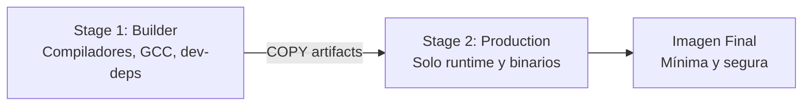

# 🏗️ 02 - Dockerfile y Buenas Prácticas

El Dockerfile es el contrato de construcción de tu aplicación. Para un **Backend Engineer**, un Dockerfile bien diseñado significa tiempos de build predecibles, imágenes pequeñas y despliegues rápidos. Para un **ML/AI Engineer**, es aún más crítico: las imágenes de machine learning pueden alcanzar fácilmente los 5-10 GB si no se optimizan, y una mala gestión de capas puede hacer que cada cambio en el código de inferencia reconstruya gigabytes de dependencias.

Caso real: Un equipo de NLP desplega un modelo LLaMA-2 fine-tuned. La imagen original pesaba 14 GB porque incluía pesos del modelo, toolchain de compilación y caches de pip. Aplicando multi-stage builds y eliminando archivos innecesarios, redujeron la imagen de producción a 3.2 GB, acelerando el despliegue en Kubernetes de 8 minutos a 90 segundos.

---

## 1. Sintaxis del Dockerfile

Un Dockerfile es un archivo de texto que contiene una serie de instrucciones ejecutadas secuencialmente por el Docker daemon.

| Instrucción | Propósito | Ejemplo |
|-------------|-----------|---------|
| `FROM` | Define la imagen base. Debe ser la primera instrucción (salvo ARG). | `FROM python:3.11-slim` |
| `RUN` | Ejecuta comandos en una nueva capa. Ideal para instalar paquetes. | `RUN apt-get update && apt-get install -y curl` |
| `CMD` | Comando por defecto al iniciar el contenedor. Sobreescribible al hacer `docker run`. | `CMD ["python", "app.py"]` |
| `ENTRYPOINT` | Comando fijo que no se sobreescribe fácilmente. Útil para wrappers. | `ENTRYPOINT ["python", "app.py"]` |
| `COPY` | Copia archivos/directorios desde el contexto de build al filesystem del contenedor. | `COPY . /app` |
| `ADD` | Similar a COPY pero soporta URLs y extracción automática de tar.gz. Preferir COPY. | `ADD https://example.com/file.tar.gz /tmp/` |
| `ENV` | Define variables de entorno persistentes en la imagen. | `ENV PYTHONUNBUFFERED=1` |
| `ARG` | Define variables disponibles solo durante el build. No persisten en la imagen final. | `ARG MODEL_VERSION=1.0` |
| `WORKDIR` | Establece el directorio de trabajo para instrucciones posteriores. | `WORKDIR /app` |
| `EXPOSE` | Documenta los puertos que el contenedor escucha (no los publica automáticamente). | `EXPOSE 8000` |
| `USER` | Establece el usuario para ejecutar comandos posteriores y el contenedor. | `USER appuser` |
| `HEALTHCHECK` | Define un comando para verificar si el contenedor está saludable. | `HEALTHCHECK --interval=30s CMD curl -f http://localhost:8000/health` |

⚠️ **Advertencia**: Nunca ejecutes contenedores como root en producción. El usuario root dentro del contenedor tiene UID 0, y si el contenedor escapa (mediante un kernel exploit), obtiene privilegios de root en el host.

💡 **Tip**: Usa `CMD` para aplicaciones normales y `ENTRYPOINT` cuando quieras forzar un comportamiento (por ejemplo, un contenedor que siempre ejecuta un linter o un script de migración).

---

## 2. Multi-Stage Builds: La Técnica Definitiva de Optimización

Los **multi-stage builds** permiten usar múltiples instrucciones `FROM` en un solo Dockerfile. Puedes copiar artefactos de una etapa a otra, dejando atrás herramientas de compilación, caches y archivos intermedios.



| Escenario | Sin Multi-Stage | Con Multi-Stage |
|-----------|-----------------|-----------------|
| Tamaño de imagen Python + C extensions | 1.2 GB | 180 MB |
| Superficie de ataque | Alta (compiladores, headers) | Baja (solo runtime) |
| Tiempo de push al registry | 3 minutos | 25 segundos |
| Cache de capas | Mixta | Aisladas por stage |

```dockerfile
# ==========================================
# Stage 1: Builder
# ==========================================
FROM python:3.11-slim AS builder

WORKDIR /build
RUN apt-get update && apt-get install -y --no-install-recommends gcc build-essential

COPY requirements.txt .
RUN pip install --user --no-cache-dir -r requirements.txt

# ==========================================
# Stage 2: Production
# ==========================================
FROM python:3.11-slim AS production

ENV PYTHONUNBUFFERED=1
ENV PATH=/root/.local/bin:$PATH

# Crear usuario no privilegiado
RUN groupadd -r appgroup && useradd -r -g appgroup appuser

# Copiar solo las dependencias instaladas desde el builder
COPY --from=builder /root/.local /home/appuser/.local
ENV PATH=/home/appuser/.local/bin:$PATH

WORKDIR /app
COPY --chown=appuser:appgroup src/ ./src/

USER appuser
EXPOSE 8000
HEALTHCHECK --interval=30s --timeout=5s --start-period=5s --retries=3 \
  CMD python -c "import urllib.request; urllib.request.urlopen('http://localhost:8000/health')" || exit 1

CMD ["python", "-m", "src.main"]
```

💡 **Tip**: En proyectos ML, usa un stage para descargar y pre-procesar datasets, otro para entrenar el modelo, y un stage final que solo copie el modelo entrenado y el servidor de inferencia.

---

## 3. Layer Caching: Orden de Instrucciones

Docker cachea cada capa del build. Si una capa cambia, todas las capas posteriores se invalidan y reconstruyen.

**Regla de oro**: Ordena las instrucciones de menos cambiante a más cambiante.

```dockerfile
# ✅ BUENO: Las dependencias se cachean porque requirements.txt cambia poco
FROM python:3.11-slim
WORKDIR /app
COPY requirements.txt .
RUN pip install --no-cache-dir -r requirements.txt
COPY src/ ./src/
CMD ["python", "-m", "src.main"]

# ❌ MALO: Cada cambio en src/ invalida la capa de pip install
FROM python:3.11-slim
WORKDIR /app
COPY . .
RUN pip install --no-cache-dir -r requirements.txt
CMD ["python", "-m", "src.main"]
```

| Estrategia | Impacto en Build Time |
|------------|----------------------|
| Copiar requirements.txt antes que el código | Build de dependencias cacheado en 95% de los casos |
| Copiar todo con `COPY . .` al inicio | Reconstrucción completa en cada commit |
| Separar dependencias de desarrollo y producción | Imagen final más pequeña, stage de testing más rápido |

⚠️ **Advertencia**: Las capas de `RUN apt-get update` deben combinarse con `apt-get install` en una sola instrucción. De lo contrario, el cache de `apt-get update` puede quedar obsoleto mientras `apt-get install` se sirve desde cache, fallando la instalación de paquetes.

---

## 4. Imágenes Base Ligeras

La elección de la imagen base tiene un impacto directo en el tamaño, la seguridad y la superficie de ataque.

| Imagen Base | Tamaño aprox. | Caso de Uso |
|-------------|---------------|-------------|
| `ubuntu:22.04` | ~77 MB | Compatibilidad máxima, debugging fácil |
| `python:3.11` | ~1 GB | Incluye toolchain completa (no ideal para prod) |
| `python:3.11-slim` | ~120 MB | Balance entre tamaño y utilidad. Recomendada por defecto. |
| `python:3.11-alpine` | ~55 MB | Muy pequeña, pero usa musl libc. Problemas con wheels de C. |
| `gcr.io/distroless/python3` | ~50 MB | Sin shell, sin package manager. Máxima seguridad. |

Caso real: Un servicio de inferencia con ONNX Runtime falló al usar `alpine` porque las wheels de `onnxruntime-gpu` estaban compiladas contra glibc. Migrar a `python:3.11-slim` resolvió el problema manteniendo un tamaño razonable.

💡 **Tip**: Para Python, `slim` es generalmente la mejor opción. `alpine` puede parecer atractivo pero el tiempo de build aumenta significativamente porque muchas librerías deben compilarse desde fuente.

```dockerfile
# Dockerfile optimizado para Python ML/Backend
FROM python:3.11-slim

# Evitar prompts de apt
ENV DEBIAN_FRONTEND=noninteractive

# Instalar dependencias del sistema necesarias (ej. para psycopg2, Pillow, etc.)
RUN apt-get update && apt-get install -y --no-install-recommends \
    libpq5 \
    libjpeg62-turbo \
    && rm -rf /var/lib/apt/lists/*

WORKDIR /app
COPY requirements.txt .
RUN pip install --no-cache-dir -r requirements.txt

COPY src/ ./src/
EXPOSE 8000
CMD ["python", "-m", "src.main"]
```

---

## 5. .dockerignore: Reduciendo el Contexto de Build

El contexto de build es todo lo que Docker envía al daemon antes de construir. Un contexto grande ralentiza el build y aumenta el uso de memoria.

```gitignore
# .dockerignore
__pycache__
*.pyc
*.pyo
*.pyd
.Python
env/
venv/
.venv/
pip-log.txt
pip-delete-this-directory.txt
.tox/
.coverage
.coverage.*
.cache
nosetests.xml
coverage.xml
*.cover
*.log
.git
.mypy_cache
.pytest_cache
.hypothesis

# ML/AI específico
*.pkl
*.h5
*.pt
*.pth
models/
notebooks/
data/raw/
data/processed/
```

⚠️ **Advertencia**: Nunca incluyas archivos `.env` con credenciales en el contexto de build. Aunque no los copies en la imagen, quedan expuestos en el cache del daemon. Usa BuildKit secrets para pasar credenciales de forma segura durante el build.

---

## 6. Seguridad: No Root User y Reducción de Superficie de Ataque

### Crear un usuario no privilegiado

```dockerfile
FROM python:3.11-slim

# Crear grupo y usuario sin privilegios
RUN groupadd -r appgroup && useradd -r -g appgroup appuser

WORKDIR /app
COPY --chown=appuser:appgroup . .
RUN pip install --no-cache-dir -r requirements.txt

USER appuser
EXPOSE 8000
CMD ["python", "app.py"]
```

### Escaneo de vulnerabilidades

| Herramienta | Comando | Uso |
|-------------|---------|-----|
| Docker Scout | `docker scout cves myimage:latest` | Análisis integrado en Docker Desktop y CLI reciente |
| Trivy | `trivy image myimage:latest` | Scanner open-source de Aqua Security. Soporta SBOM. |
| Snyk | `snyk container test myimage:latest` | Plataforma comercial con integración CI/CD robusta |

```bash
# Escaneo con Trivy (open source)
trivy image --severity HIGH,CRITICAL myapp:latest

# Escaneo con Docker Scout
docker scout cves --only-severity critical myapp:latest
```

Caso real: Una auditoría de seguridad en una fintech reveló que la imagen base `python:3.9` contenía 47 vulnerabilidades CRITICAL en librerías del sistema operativo. Migrar a `python:3.11-slim` y escanear con Trivy en CI redujo las vulnerabilidades críticas a cero.

💡 **Tip**: Configura tu pipeline CI para fallar si Trivy detecta vulnerabilidades CRITICAL. Esto previene que imágenes inseguras lleguen al registry.

---

## 7. HEALTHCHECK y Confiabilidad

Un `HEALTHCHECK` permite que Docker monitoree si tu aplicación está realmente lista para recibir tráfico, no solo si el proceso principal está corriendo.

```dockerfile
HEALTHCHECK --interval=30s \
            --timeout=10s \
            --start-period=40s \
            --retries=3 \
            CMD curl -fsS http://localhost:8000/health || exit 1
```

| Parámetro | Significado |
|-----------|-------------|
| `interval` | Tiempo entre health checks |
| `timeout` | Tiempo máximo para que el check considere failure |
| `start-period` | Tiempo de gracia al inicio antes de contar failures |
| `retries` | Número de fallos consecutivos para marcar como `unhealthy` |

⚠️ **Advertencia**: Un HEALTHCHECK mal configurado puede causar que Docker Swarm o Kubernetes reinicie contenedores sanos. Asegúrate de que el `start-period` cubra el tiempo de arranque de tu aplicación (especialmente importante en servicios ML que cargan modelos grandes en memoria).

---

## 8. 📦 Código de Compresión

```dockerfile
# Dockerfile profesional optimizado para Python (Backend / ML Inference)
# ============================================================
FROM python:3.11-slim AS builder

WORKDIR /build
COPY requirements.txt .
RUN pip install --user --no-cache-dir -r requirements.txt

# ============================================================
FROM python:3.11-slim AS production

ENV PYTHONUNBUFFERED=1
ENV PYTHONDONTWRITEBYTECODE=1

RUN groupadd -r appgroup && useradd -r -g appgroup appuser

COPY --from=builder /root/.local /home/appuser/.local
ENV PATH=/home/appuser/.local/bin:$PATH

WORKDIR /app
COPY --chown=appuser:appgroup src/ ./src/

USER appuser
EXPOSE 8000

HEALTHCHECK --interval=30s --timeout=5s --start-period=10s --retries=3 \
  CMD python -c "import urllib.request; urllib.request.urlopen('http://localhost:8000/health')" || exit 1

CMD ["python", "-m", "src.main"]
```

```gitignore
# .dockerignore
__pycache__
*.pyc
.env
.venv
data/
notebooks/
models/*.pt
models/*.pth
.git
```

```bash
# build.sh - Script de build con escaneo de seguridad
#!/bin/bash
set -e

IMAGE_NAME="myapp"
TAG="${1:-latest}"

echo "=== Building image ==="
docker build -t "${IMAGE_NAME}:${TAG}" .

echo "=== Scanning with Trivy ==="
trivy image --severity HIGH,CRITICAL --exit-code 1 "${IMAGE_NAME}:${TAG}"

echo "=== Image size ==="
docker images "${IMAGE_NAME}:${TAG}" --format "{{.Size}}"
```
