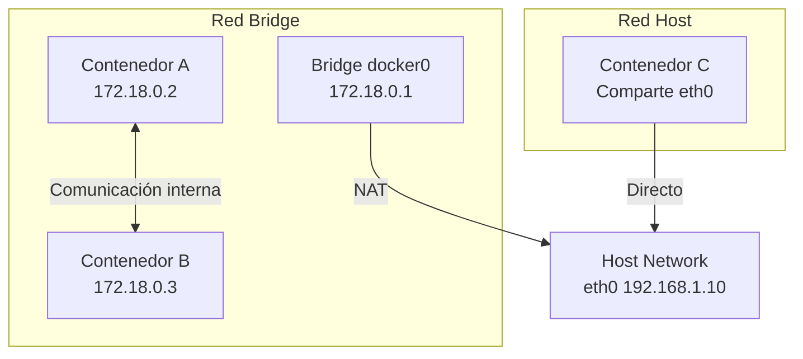

# 💾 04 - Volúmenes, Redes y Persistencia

Los contenedores son efímeros por diseño. Cuando un contenedor se elimina, todos los datos escritos en su capa de escritura desaparecen. Para un **Backend Engineer**, esto significa que bases de datos, logs y archivos subidos por usuarios deben vivir fuera del contenedor. Para un **ML/AI Engineer**, los datasets de entrenamiento, modelos entrenados y checkpoints deben persistir entre ejecuciones de pipelines. Docker ofrece mecanismos robustos de persistencia y networking para resolver estos desafíos.

Caso real: Un equipo de ML entrena modelos de forecasting en contenedores efímeros de Kubernetes. Cada pod de entrenamiento escribe checkpoints en un volumen compartido de tipo `nfs`. Si el pod falla a la mitad del epoch 50, un nuevo pod puede recuperar el último checkpoint desde el volumen y continuar, evitando perder 8 horas de computación en GPU.

---

## 1. Tipos de Almacenamiento en Docker

Docker proporciona tres mecanismos principales para persistir datos fuera del ciclo de vida del contenedor:

| Tipo | Gestión por Docker | Persistencia | Caso de Uso |
|------|--------------------|--------------|-------------|
| **Volume** | Sí | Sí | Datos de bases de datos, modelos, configuraciones. Recomendado por defecto. |
| **Bind Mount** | No | Sí | Desarrollo local (código fuente en host), archivos de configuración del sistema. |
| **tmpfs mount** | Sí | No (RAM) | Datos sensibles temporales (tokens, sesiones) que no deben escribirse a disco. |

```mermaid
graph TB
    subgraph "Host"
        H1[Volumen Docker<br/>/var/lib/docker/volumes/]
        H2[Directorio Host<br/>/home/user/proyecto]
        H3[RAM<br/>tmpfs]
    end
    subgraph "Contenedor"
        C1[/app/data]
        C2[/app/src]
        C3[/tmp/secrets]
    end
    H1 -->|Volume| C1
    H2 -->|Bind Mount| C2
    H3 -->|tmpfs| C3
```

⚠️ **Advertencia**: Los bind mounts pueden tener problemas de permisos entre host y contenedor, especialmente cuando el contenedor ejecuta como un usuario diferente (por ejemplo, UID 1000 en el host vs UID 999 en el contenedor). Los volúmenes manejan estos casos de forma más transparente.

---

## 2. Volúmenes: Named vs Anonymous

### Volúmenes Nombrados (Named Volumes)

Son la forma recomendada de persistir datos. Tienen un nombre legible, son gestionados por Docker y pueden compartirse entre contenedores.

```bash
# Crear un volumen nombrado
docker volume create pgdata

# Usar en un contenedor
docker run -d -v pgdata:/var/lib/postgresql/data postgres:15

# Listar volúmenes
docker volume ls

# Inspeccionar
docker volume inspect pgdata
```

### Volúmenes Anónimos

Se crean automáticamente cuando se usa la flag `-v` sin especificar un nombre. Son difíciles de referenciar posteriormente.

```bash
# Volumen anónimo
docker run -d -v /var/lib/postgresql/data postgres:15
```

| Característica | Named Volume | Anonymous Volume |
|----------------|--------------|------------------|
| Referencia | Por nombre | Por hash automático |
| Reutilización | Fácil entre contenedores | Difícil |
| Gestión | `docker volume rm` | Limpieza manual o `--rm` |
| Uso típico | Producción, datos importantes | Cache temporal, datos descartables |

💡 **Tip**: Siempre nombra tus volúmenes en `docker-compose.yml`. Los volúmenes anónimos generan "basura" en el host que es difícil de rastrear.

---

## 3. Drivers de Volumen

Docker soporta múltiples drivers para extender el almacenamiento más allá del host local.

| Driver | Descripción | Uso |
|--------|-------------|-----|
| `local` | Driver por defecto. Almacena en el filesystem del host. | Desarrollo y single-node. |
| `nfs` | Montaje NFS para compartir volúmenes entre hosts. | Clusters on-premise. |
| `ebs` | Amazon EBS (requiere plugin). | AWS ECS/EKS. |
| `azure_file` | Azure File Storage. | Azure AKS. |
| `gcsfuse` | Google Cloud Storage FUSE. | GCP GKE. |

```yaml
# docker-compose.yml con driver nfs
services:
  app:
    image: myapp
    volumes:
      - shared_data:/data

volumes:
  shared_data:
    driver: local
    driver_opts:
      type: nfs
      o: addr=192.168.1.100,rw
      device: ":/exports/data"
```

---

## 4. Copia de Seguridad de Volúmenes

Los volúmenes deben respaldarse periódicamente. Las estrategias más comunes son:

### Backup con contenedor efímero

```bash
# Backup de un volumen PostgreSQL a un tar.gz en el host
docker run --rm \
  -v pgdata:/source:ro \
  -v $(pwd)/backups:/backup \
  alpine tar czf /backup/pgdata_$(date +%Y%m%d_%H%M%S).tar.gz -C /source .
```

### Restore desde backup

```bash
# Restaurar un volumen desde backup
docker run --rm \
  -v pgdata:/target \
  -v $(pwd)/backups:/backup \
  alpine sh -c "cd /target && tar xzf /backup/pgdata_20240115_120000.tar.gz"
```

⚠️ **Advertencia**: Nunca hagas backup de volúmenes de base de datos mientras la base de datos está escribiendo. Usa las herramientas nativas (`pg_dump`, `mysqldump`, `mongodump`) para backups consistentes, o pausa el contenedor momentáneamente.

💡 **Tip**: Para backups automatizados, programa un contenedor cron con Docker que ejecute el backup periódicamente y suba el resultado a S3 usando AWS CLI.

---

## 5. Redes Docker: Bridge, Host, None y Overlay

Docker proporciona drivers de red para diferentes escenarios de comunicación.

| Driver | Alcance | Descripción | Uso |
|--------|---------|-------------|-----|
| **bridge** | Single host | Red privada virtual en el host. Los contenedores obtienen IPs internas. | Desarrollo local, Compose por defecto. |
| **host** | Single host | El contenedor comparte la stack de red del host. Sin aislamiento de puertos. | Alta performance de red, sensores de red. |
| **none** | Single host | Sin interfaz de red. Solo loopback. | Contenedores de procesamiento offline seguro. |
| **overlay** | Multi-host | Red distribuida entre múltiples nodos Docker (Swarm). | Producción en cluster. |



⚠️ **Advertencia**: El driver `host` elimina el aislamiento de red del contenedor. En Linux, el contenedor ve todas las interfaces del host. En Docker Desktop (Windows/Mac), `host` no funciona como en Linux porque hay una VM intermediaria.

---

## 6. DNS Interno y Conexión por Nombre

En una red bridge definida por el usuario (no la default bridge), Docker ejecuta un servidor DNS interno que resuelve nombres de contenedor a direcciones IP.

```bash
# Crear red personalizada
docker network create my_app_network

# Ejecutar contenedores en la red
docker run -d --name db --network my_app_network postgres:15
docker run -d --name api --network my_app_network myapi

# Desde 'api', 'db' resuelve a la IP interna del contenedor
docker exec api ping db
```

💡 **Tip**: La red bridge por defecto (`docker0`) NO tiene DNS interno. Los contenedores solo se comunican por IP, lo cual es frágil. Siempre usa redes definidas por el usuario para aplicaciones multi-contenedor.

---

## 7. Exposición de Puertos y Port Mapping

### Port Mapping

```bash
# Mapeo explícito host:contenedor
docker run -d -p 8080:80 nginx

# Mapeo a todas las interfaces
docker run -d -p 0.0.0.0:8080:80 nginx

# Mapeo restringido a localhost
docker run -d -p 127.0.0.1:8080:80 nginx

# Puerto aleatorio del host
docker run -d -p 80 nginx
```

### Exposición entre contenedores (sin publicar al host)

Cuando dos contenedores están en la misma red, pueden comunicarse por el puerto expuesto sin necesidad de `-p`.

```yaml
services:
  api:
    build: ./api
    ports:
      - "8000:8000"  # Expuesto al mundo exterior
    networks:
      - backend

  db:
    image: postgres:15
    expose:
      - "5432"  # Solo visible dentro de la red 'backend'
    networks:
      - backend
```

⚠️ **Advertencia**: La instrucción `EXPOSE` en Dockerfile y `expose:` en Compose son documentativas. No publican realmente el puerto al host. Solo `ports:` con `-p` hace eso.

---

## 8. IPv6 en Docker

Docker puede operar con IPv6, aunque requiere configuración explícita.

```json
// /etc/docker/daemon.json
{
  "ipv6": true,
  "fixed-cidr-v6": "2001:db8:1::/64"
}
```

```bash
# Reiniciar Docker para aplicar cambios
sudo systemctl restart docker
```

💡 **Tip**: IPv6 es crucial en infraestructuras modernas y para evitar el agotamiento de IPs en redes de contenedores masivas. Sin embargo, muchos firewalls corporativos aún no manejan IPv6 correctamente; verifica tu política de red antes de habilitarlo.

---

## 9. Caso Real: Persistencia de Modelos ML y Datasets

Caso real: Una empresa de computer vision procesa 2 TB de imágenes médicas para entrenar modelos de segmentación. El pipeline de entrenamiento corre en contenedores efímeros gestionados por Apache Airflow.

- **Volumen `datasets`**: NFS montado en `/data/raw` y `/data/processed`. Compartido entre nodos de pre-procesamiento y entrenamiento.
- **Volumen `model-registry`**: Almacena artefactos versionados de modelos (`.pt`, `.onnx`, configuraciones).
- **Bind Mount `configs`**: Desarrolladores montan `./configs` localmente para iterar rápidamente sobre hiperparámetros sin reconstruir la imagen.
- **tmpfs `secrets`**: Tokens de API de cloud se montan en `/run/secrets` como tmpfs para que nunca toquen el disco físico.

```yaml
version: "3.9"
services:
  trainer:
    image: ml-trainer:latest
    volumes:
      - datasets:/data
      - model_registry:/models
      - ./configs:/app/configs:ro
      - type: tmpfs
        target: /run/secrets
    environment:
      - DATA_DIR=/data/processed
      - MODEL_OUTPUT=/models
    networks:
      - ml_backend

volumes:
  datasets:
    driver: local
  model_registry:
    driver: local

networks:
  ml_backend:
    driver: bridge
```

---

## 10. 📦 Código de Compresión

```yaml
# docker-compose.yml con volúmenes y red personalizada
version: "3.9"

services:
  api:
    build: ./api
    ports:
      - "8000:8000"
    volumes:
      - api_uploads:/app/uploads
    networks:
      - app_network

  db:
    image: postgres:15-alpine
    volumes:
      - pgdata:/var/lib/postgresql/data
    environment:
      POSTGRES_DB: appdb
      POSTGRES_USER: app
      POSTGRES_PASSWORD: secret
    networks:
      - app_network

volumes:
  pgdata:
    driver: local
  api_uploads:
    driver: local

networks:
  app_network:
    driver: bridge
    ipam:
      config:
        - subnet: 172.28.0.0/16
```

```bash
# backup-volume.sh
#!/bin/bash
VOLUME_NAME="${1:-pgdata}"
BACKUP_DIR="./backups"
mkdir -p "$BACKUP_DIR"

docker run --rm \
  -v "${VOLUME_NAME}:/source:ro" \
  -v "$(pwd)/${BACKUP_DIR}:/backup" \
  alpine tar czf "/backup/${VOLUME_NAME}_$(date +%Y%m%d_%H%M%S).tar.gz" -C /source .

echo "Backup de ${VOLUME_NAME} completado."
```

```bash
# network-inspect.sh
#!/bin/bash
NETWORK_NAME="${1:-app_network}"
docker network inspect "$NETWORK_NAME" --format '{{json .Containers}}' | python -m json.tool
```
