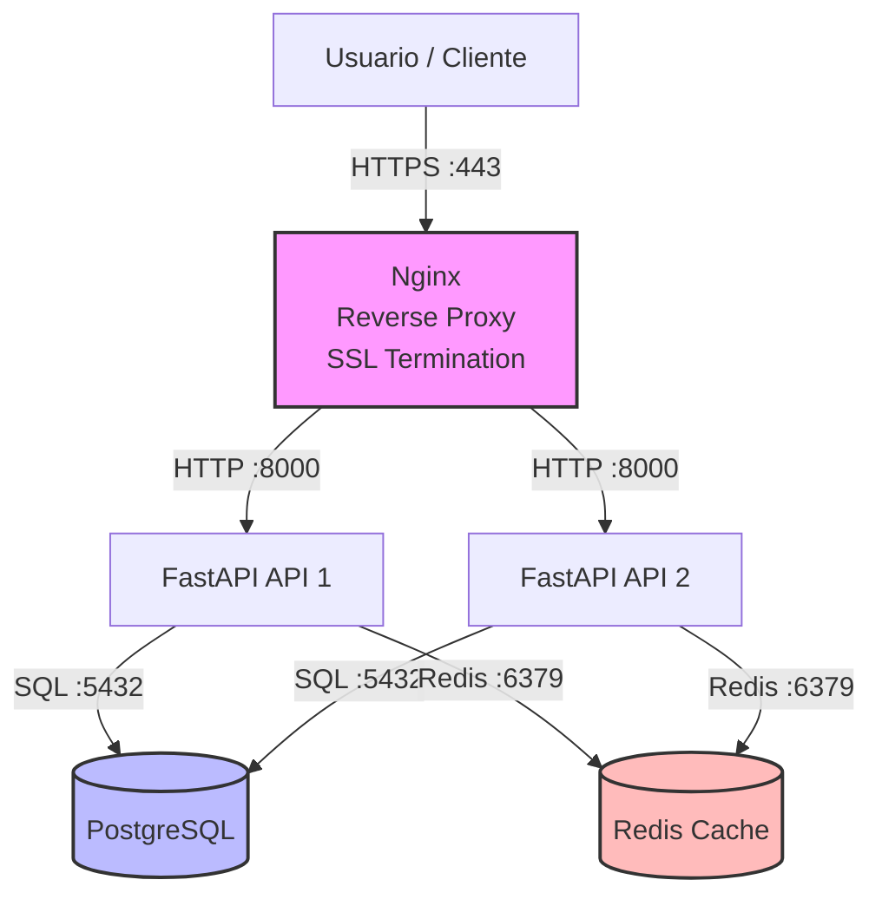

# 🎯 06 - Caso Práctico: Despliegue Completo con Docker

Este módulo integra todo lo aprendido en un proyecto real y completo. Vamos a desplegar una aplicación de producción con **FastAPI**, **PostgreSQL**, **Redis** y **Nginx** como reverse proxy, utilizando Docker Compose. Para un **Backend Engineer**, este es el stack mínimo viable de una API moderna. Para un **ML/AI Engineer**, FastAPI sirve el modelo, PostgreSQL almacena feedback y metadatos de predicciones, Redis cachea resultados de inferencia, y Nginx maneja SSL terminación y balanceo de carga.

Caso real: Una empresa de predicción de demanda para retail despliega su API de forecasting. El modelo Prophet (Meta) se sirve mediante FastAPI. Las predicciones generadas se almacenan en PostgreSQL para auditoría. Redis cachea las predicciones de los últimos 7 días para SKUs frecuentes, reduciendo la carga computacional en un 80%. Nginx termina SSL y distribuye tráfico entre dos réplicas de la API.

---

## 1. Requisitos Funcionales y Arquitectura

### Requisitos Funcionales

1. **API REST** con FastAPI, exponiendo endpoints de healthcheck y predicción.

2. **Persistencia** con PostgreSQL para almacenar predicciones y logs de requests.

3. **Cache** con Redis para resultados de inferencia frecuentes.

4. **Reverse Proxy** con Nginx para enrutamiento, compresión y SSL (mención).

5. **Monitoreo de salud** con healthchecks en todos los servicios críticos.

6. **Backup automático** de base de datos.

### Diagrama de Arquitectura



---

## 2. Estructura del Proyecto

```
docker-complete-deployment/
├── docker-compose.prod.yml
├── .env.prod
├── nginx/
│   ├── Dockerfile
│   └── nginx.conf
├── api/
│   ├── Dockerfile
│   ├── requirements.txt
│   └── src/
│       ├── main.py
│       ├── config.py
│       └── database.py
├── scripts/
│   └── backup-db.sh
└── README.md
```

---

## 3. Variables de Entorno de Producción

```bash
# .env.prod
# === API ===
API_WORKERS=2
API_PORT=8000
DATABASE_URL=postgresql://api_user:SuperSecret123@db:5432/appdb
REDIS_URL=redis://redis:6379/0
LOG_LEVEL=info

# === DATABASE ===
POSTGRES_USER=api_user
POSTGRES_PASSWORD=SuperSecret123
POSTGRES_DB=appdb
POSTGRES_PORT=5432

# === REDIS ===
REDIS_PASSWORD=RedisSecret456

# === NGINX ===
NGINX_PORT=80
```

⚠️ **Advertencia**: El archivo `.env.prod` contiene credenciales. En un entorno real, estas variables se inyectan desde un secret manager (AWS Secrets Manager, Azure Key Vault, HashiCorp Vault) o se pasan como secrets de Docker Swarm/Kubernetes. Nunca comitees este archivo.

---

## 4. Dockerfile Multi-Stage para la API

```dockerfile
# api/Dockerfile
# ==========================================
# Stage 1: Builder
# ==========================================
FROM python:3.11-slim AS builder

WORKDIR /build
RUN apt-get update && apt-get install -y --no-install-recommends gcc libpq-dev

COPY requirements.txt .
RUN pip install --user --no-cache-dir -r requirements.txt

# ==========================================
# Stage 2: Production
# ==========================================
FROM python:3.11-slim AS production

ENV PYTHONUNBUFFERED=1
ENV PYTHONDONTWRITEBYTECODE=1

RUN apt-get update && apt-get install -y --no-install-recommends libpq5 curl \
    && rm -rf /var/lib/apt/lists/*

RUN groupadd -r appgroup && useradd -r -g appgroup appuser

COPY --from=builder /root/.local /home/appuser/.local
ENV PATH=/home/appuser/.local/bin:$PATH

WORKDIR /app
COPY --chown=appuser:appgroup src/ ./src/

USER appuser
EXPOSE 8000

HEALTHCHECK --interval=30s --timeout=10s --start-period=40s --retries=3 \
  CMD curl -fsS http://localhost:8000/health || exit 1

CMD ["uvicorn", "src.main:app", "--host", "0.0.0.0", "--port", "8000"]
```

```txt
# api/requirements.txt
fastapi==0.104.1
uvicorn[standard]==0.24.0
pydantic==2.5.0
psycopg2-binary==2.9.9
redis==5.0.1
httpx==0.25.2
```

💡 **Tip**: Para servicios ML, añade las dependencias científicas en el `requirements.txt` (por ejemplo, `numpy`, `scikit-learn`, `onnxruntime`). El multi-stage build sigue siendo válido: instala en builder y copia solo las librerías compiladas.

---

## 5. Configuración de Nginx

```nginx
# nginx/nginx.conf
upstream api_backend {
    server api:8000;
}

server {
    listen 80;
    server_name localhost;

    location / {
        proxy_pass http://api_backend;
        proxy_set_header Host $host;
        proxy_set_header X-Real-IP $remote_addr;
        proxy_set_header X-Forwarded-For $proxy_add_x_forwarded_for;
        proxy_set_header X-Forwarded-Proto $scheme;
        proxy_connect_timeout 30s;
        proxy_send_timeout 30s;
        proxy_read_timeout 30s;
    }

    location /health {
        access_log off;
        proxy_pass http://api_backend/health;
    }
}
```

```dockerfile
# nginx/Dockerfile
FROM nginx:1.25-alpine
COPY nginx.conf /etc/nginx/conf.d/default.conf
EXPOSE 80
```

⚠️ **Advertencia**: En producción real, Nginx debe escuchar en 443 con certificados SSL (Let's Encrypt, certbot). Para este caso práctico, mencionamos SSL pero mantenemos HTTP en 80 para simplicidad del entorno local de prueba. En cloud, un load balancer (AWS ALB, GCP LB) suele manejar la terminación SSL antes de llegar a Nginx.

---

## 6. docker-compose.prod.yml

```yaml
version: "3.9"

services:
  nginx:
    build: ./nginx
    ports:
      - "80:80"
    depends_on:
      api:
        condition: service_healthy
    networks:
      - frontend
      - backend
    restart: unless-stopped
    deploy:
      resources:
        limits:
          cpus: '0.50'
          memory: 128M

  api:
    build:
      context: ./api
      dockerfile: Dockerfile
      target: production
    expose:
      - "8000"
    environment:
      - DATABASE_URL=${DATABASE_URL}
      - REDIS_URL=${REDIS_URL}
      - LOG_LEVEL=${LOG_LEVEL}
    depends_on:
      db:
        condition: service_healthy
      redis:
        condition: service_started
    networks:
      - backend
    restart: unless-stopped
    deploy:
      replicas: 2
      resources:
        limits:
          cpus: '1.00'
          memory: 512M
    healthcheck:
      test: ["CMD", "curl", "-fsS", "http://localhost:8000/health"]
      interval: 30s
      timeout: 10s
      retries: 3
      start_period: 40s

  db:
    image: postgres:15-alpine
    volumes:
      - pgdata:/var/lib/postgresql/data
    environment:
      POSTGRES_USER: ${POSTGRES_USER}
      POSTGRES_PASSWORD: ${POSTGRES_PASSWORD}
      POSTGRES_DB: ${POSTGRES_DB}
    expose:
      - "5432"
    networks:
      - backend
    restart: unless-stopped
    deploy:
      resources:
        limits:
          cpus: '1.00'
          memory: 1G
    healthcheck:
      test: ["CMD-SHELL", "pg_isready -U ${POSTGRES_USER} -d ${POSTGRES_DB}"]
      interval: 10s
      timeout: 5s
      retries: 5
      start_period: 10s

  redis:
    image: redis:7-alpine
    command: redis-server --requirepass ${REDIS_PASSWORD}
    expose:
      - "6379"
    networks:
      - backend
    restart: unless-stopped
    deploy:
      resources:
        limits:
          cpus: '0.50'
          memory: 256M
    healthcheck:
      test: ["CMD", "redis-cli", "--raw", "incr", "ping"]
      interval: 10s
      timeout: 5s
      retries: 3

volumes:
  pgdata:
    driver: local

networks:
  frontend:
    driver: bridge
  backend:
    driver: bridge
    internal: false
```

⚠️ **Advertencia**: En este compose, `db` y `redis` usan `expose` en lugar de `ports`, lo que significa que solo son accesibles dentro de la red Docker. Esto es crítico para producción: nunca expongas bases de datos directamente al host.

---

## 7. Código de la API (FastAPI)

```python
# api/src/main.py
from fastapi import FastAPI
from contextlib import asynccontextmanager
import redis.asyncio as redis
import asyncpg
import os

REDIS_URL = os.getenv("REDIS_URL", "redis://redis:6379/0")
DATABASE_URL = os.getenv("DATABASE_URL", "postgresql://api_user:pass@db:5432/appdb")

pool = None
cache = None

@asynccontextmanager
async def lifespan(app: FastAPI):
    global pool, cache
    pool = await asyncpg.create_pool(DATABASE_URL, min_size=1, max_size=10)
    cache = redis.from_url(REDIS_URL, decode_responses=True)
    yield
    await pool.close()
    await cache.close()

app = FastAPI(title="ML Inference API", lifespan=lifespan)

@app.get("/health")
async def health():
    return {"status": "ok", "service": "api"}

@app.get("/predict/{sku}")
async def predict(sku: str):
    # Intentar cache
    cached = await cache.get(f"pred:{sku}")
    if cached:
        return {"sku": sku, "prediction": cached, "source": "cache"}

    # Simular inferencia ML
    prediction = f"forecast_for_{sku}"

    # Guardar en cache (TTL 1 hora)
    await cache.setex(f"pred:{sku}", 3600, prediction)

    # Persistir en DB
    async with pool.acquire() as conn:
        await conn.execute(
            "INSERT INTO predictions(sku, result) VALUES($1, $2)",
            sku, prediction
        )

    return {"sku": sku, "prediction": prediction, "source": "model"}
```

```python
# api/src/database.py
import asyncpg
import os

DATABASE_URL = os.getenv("DATABASE_URL")

async def init_db():
    conn = await asyncpg.connect(DATABASE_URL)
    await conn.execute("""
        CREATE TABLE IF NOT EXISTS predictions (
            id SERIAL PRIMARY KEY,
            sku VARCHAR(255) NOT NULL,
            result TEXT NOT NULL,
            created_at TIMESTAMP DEFAULT NOW()
        )
    """)
    await conn.close()
```

---

## 8. Script de Backup de Base de Datos

```bash
# scripts/backup-db.sh
#!/bin/bash
set -e

# Configuración
CONTAINER_NAME="docker-complete-deployment-db-1"
BACKUP_DIR="./backups"
TIMESTAMP=$(date +%Y%m%d_%H%M%S)
BACKUP_FILE="${BACKUP_DIR}/db_backup_${TIMESTAMP}.sql"

# Crear directorio de backups
mkdir -p "$BACKUP_DIR"

# Ejecutar pg_dump dentro del contenedor
docker exec -e PGPASSWORD="${POSTGRES_PASSWORD}" \
  "$CONTAINER_NAME" \
  pg_dump -U "${POSTGRES_USER}" -d "${POSTGRES_DB}" \
  --clean --if-exists --no-owner --no-privileges \
  > "$BACKUP_FILE"

# Comprimir
gzip "$BACKUP_FILE"

echo "✅ Backup completado: ${BACKUP_FILE}.gz"

# (Opcional) Subir a S3
# aws s3 cp "${BACKUP_FILE}.gz" s3://my-backup-bucket/db-backups/
```

💡 **Tip**: Programa este script con cron en el host o como un job programado en tu orquestador. Para backups más robustos, usa `pg_dumpall` o herramientas como `wal-g` para backups incrementales (WAL archiving).

---

## 9. Métricas de Éxito y Optimización

Para validar la calidad del despliegue, monitorea las siguientes métricas:

| Métrica | Objetivo | Cómo Medir |
|---------|----------|------------|
| **Tiempo de build** | < 2 minutos para la API | `time docker compose build api` |
| **Tamaño de imagen API** | < 200 MB | `docker images myapp-api` |
| **Tamaño de imagen DB** | ~80 MB (postgres:alpine) | `docker images postgres:15-alpine` |
| **Uptime esperado** | 99.9% | Monitoreo con healthchecks y restart policies |
| **Latencia p95** | < 100ms (con cache) | Logs de Nginx o métricas de FastAPI |
| **Uso de CPU/Memoria** | Dentro de los límites de `deploy.resources` | `docker stats` |

```bash
# Medir tiempo de build
time docker compose -f docker-compose.prod.yml build

# Ver tamaños de imágenes
docker images --format "table {{.Repository}}\t{{.Tag}}\t{{.Size}}"

# Monitorear recursos en tiempo real
docker stats
```

---

## 10. 🎯 Proyecto Documentado

### Instrucciones de Despliegue

```bash
# 1. Clonar y entrar al directorio
cd docker-complete-deployment

# 2. Copiar y configurar variables de entorno
cp .env.example .env.prod
# Editar .env.prod con credenciales seguras

# 3. Construir imágenes
docker compose -f docker-compose.prod.yml build

# 4. Iniciar servicios
docker compose -f docker-compose.prod.yml up -d

# 5. Verificar estado
docker compose -f docker-compose.prod.yml ps
docker compose -f docker-compose.prod.yml logs -f

# 6. Ejecutar backup
./scripts/backup-db.sh

# 7. Detener servicios
docker compose -f docker-compose.prod.yml down

# 8. Detener y eliminar volúmenes (⚠️ borra datos)
docker compose -f docker-compose.prod.yml down -v
```

### Checklist de Producción

- [ ] Usuario no root en todos los servicios custom.
- [ ] Healthchecks definidos en API y base de datos.
- [ ] Bases de datos y caches NO expuestos al host.
- [ ] Volúmenes nombrados para persistencia.
- [ ] Variables de entorno sensibles gestionadas vía secrets.
- [ ] Imágenes escaneadas por vulnerabilidades antes del push.
- [ ] Backup automatizado de base de datos.
- [ ] Nginx configurado como reverse proxy (SSL en cloud LB).
- [ ] Límites de recursos definidos (`deploy.resources`).
- [ ] Restart policy configurada (`unless-stopped` o `on-failure`).

---

## 11. Evolución del Proyecto

Este stack puede evolucionar hacia:

- **SSL/TLS**: Integrar certbot con Nginx para Let's Encrypt.
- **Monitoreo**: Añadir Prometheus + Grafana para métricas, y Loki para logs agregados.
- **Orquestación**: Migrar de Compose a Kubernetes (EKS, GKE, AKS) para auto-scaling y rolling updates.
- **CI/CD**: Automatizar el build y despliegue con GitHub Actions hacia un VPS o cloud.
- **ML específico**: Añadir un servicio de GPU para inferencia con NVIDIA Container Toolkit.

Caso real: El mismo stack aquí documentado fue migrado por una startup fintech a AWS ECS con Fargate. El `docker-compose.prod.yml` sirvió como base para definir Task Definitions. La imagen de API se construía en GitHub Actions, se escaneaba con Trivy, se subía a ECR y se desplegaba via AWS CodeDeploy con zero-downtime deployment.

---

## 12. 📦 Código de Compresión

```dockerfile
# api/Dockerfile (resumen)
FROM python:3.11-slim AS builder
WORKDIR /build
COPY requirements.txt .
RUN pip install --user --no-cache-dir -r requirements.txt

FROM python:3.11-slim AS production
RUN apt-get update && apt-get install -y libpq5 curl && rm -rf /var/lib/apt/lists/*
RUN groupadd -r appgroup && useradd -r -g appgroup appuser
COPY --from=builder /root/.local /home/appuser/.local
ENV PATH=/home/appuser/.local/bin:$PATH
WORKDIR /app
COPY --chown=appuser:appgroup src/ ./src/
USER appuser
EXPOSE 8000
HEALTHCHECK --interval=30s --timeout=10s --start-period=40s --retries=3 \
  CMD curl -fsS http://localhost:8000/health || exit 1
CMD ["uvicorn", "src.main:app", "--host", "0.0.0.0", "--port", "8000"]
```

```yaml
# docker-compose.prod.yml (resumen)
version: "3.9"
services:
  nginx:
    build: ./nginx
    ports: ["80:80"]
    depends_on: { api: { condition: service_healthy } }
    networks: [frontend, backend]
  api:
    build: ./api
    expose: ["8000"]
    environment: [DATABASE_URL, REDIS_URL, LOG_LEVEL]
    depends_on: { db: { condition: service_healthy }, redis: { condition: service_started } }
    networks: [backend]
    deploy: { replicas: 2, resources: { limits: { cpus: '1.00', memory: 512M } } }
  db:
    image: postgres:15-alpine
    volumes: [pgdata:/var/lib/postgresql/data]
    environment: [POSTGRES_USER, POSTGRES_PASSWORD, POSTGRES_DB]
    networks: [backend]
  redis:
    image: redis:7-alpine
    command: redis-server --requirepass ${REDIS_PASSWORD}
    networks: [backend]
volumes: { pgdata: }
networks: { frontend: {}, backend: {} }
```

```bash
# deploy.sh
#!/bin/bash
set -e
docker compose -f docker-compose.prod.yml down
docker compose -f docker-compose.prod.yml build
docker compose -f docker-compose.prod.yml up -d
docker compose -f docker-compose.prod.yml ps
echo "Despliegue completado."
```
