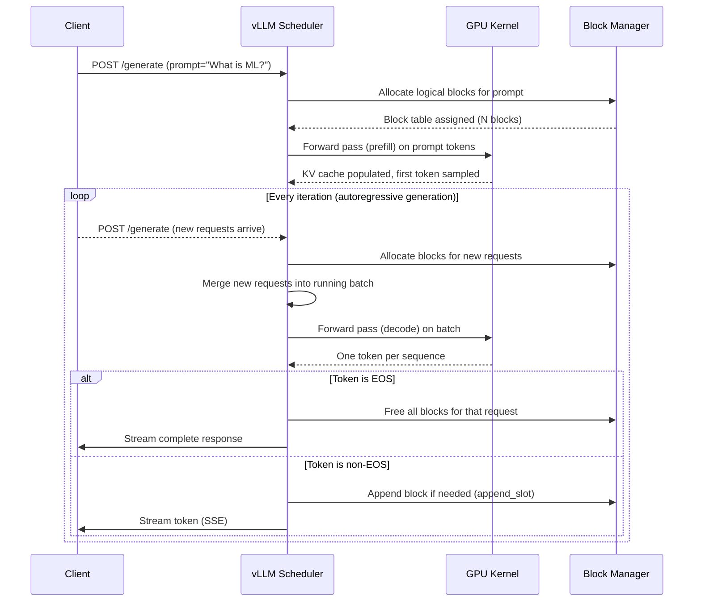
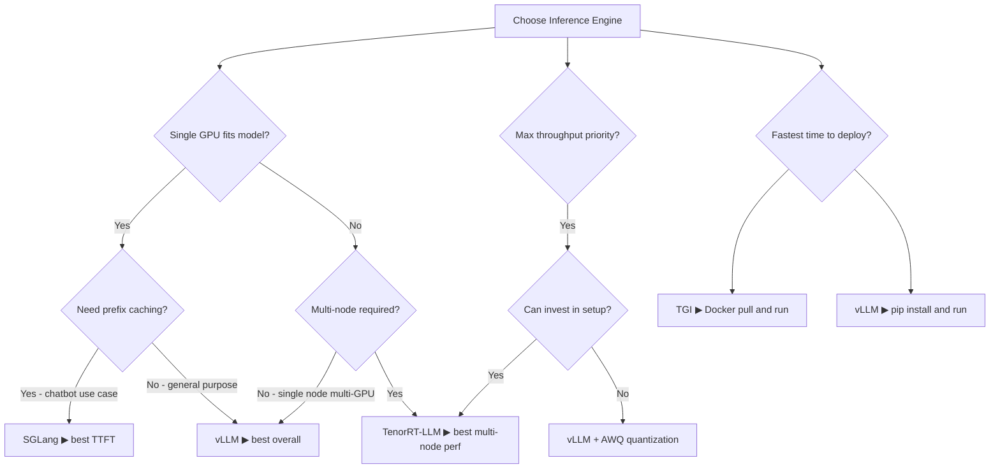
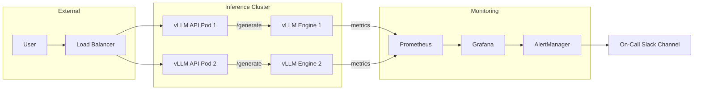

# ⚡ vLLM: Production-Grade LLM Serving

---

## Module 1.1 — The Inference Serving Problem

Before vLLM, serving large language models in production meant accepting massive waste. A single NVIDIA A100-80GB could hold the full weights of a Llama-2-70B model, but the KV cache — the memory used to store attention keys and values for every token in every ongoing request — would fragment GPU memory so severely that only 2–4 concurrent requests could be served. The rest of the GPU sat idle.

The root cause: **naive memory allocation** in frameworks like HuggingFace Transformers. Each request pre-allocated a contiguous block of memory for its maximum possible KV cache (e.g., 4096 tokens). Since requests finish at different times and have different actual lengths, the GPU memory became a checkerboard of allocated and free blocks. Like early `malloc` implementations without compaction, this fragmentation left large contiguous regions unusable.

### Real Case: OpenAI pre-2022 Inference

Before developing their own Triton-based serving framework, OpenAI's inference stack used PyTorch's standard CUDA allocator with reserved KV cache blocks. At GPT-3 scale (175B parameters), a single A100 could handle at most 8 concurrent requests before OOM errors, despite having sufficient aggregate memory. Engineers had to over-provision GPU clusters by 3–5x to meet throughput SLAs. This experience directly motivated the PagedAttention research.

```
┌─────────────────────────────────────────────────────────┐
│                GPU VRAM (80 GB)                         │
├─────────┬─────────┬─────────┬─────────┬─────────────────┤
│ Model   │ Req1 KV │ Req2 KV │ Req3 KV │ FRAGMENTED FREE │
│ Weights │ (4K pad)│ (4K pad)│ (4K pad)│ (unusable)     │
│ 35 GB   │  8 GB   │  8 GB   │  8 GB   │  21 GB          │
├─────────┼─────────┼─────────┼─────────┼─────────────────┤
│ Model   │ Req1 KV │■■FRAGMENTED■■│ Req4? ──► OOM!      │
│ Weights │ actual  │■■  SPACE  ■■│ (block too small)    │
└─────────┴─────────┴─────────┴──────────────────────────┘
```

> **Figure 1**: Naive KV cache allocation fragments GPU memory. Each request reserves its maximum possible KV cache up front, regardless of actual sequence length. Deallocated blocks leave holes that cannot be coalesced for new requests.

---

## Module 1.2 — PagedAttention and Memory Efficiency

PagedAttention is the theoretical breakthrough that makes vLLM possible. It applies **virtual memory paging** — the same idea operating systems have used since the 1960s — to GPU KV caches. Instead of allocating one monolithic contiguous block per request, vLLM partitions the KV cache into fixed-size **blocks** (e.g., 16 tokens per block) and tracks them with a **block table**.

### How Paging Works

1. **Block size**: Typically 16 or 32 tokens per block. Each block holds `block_size × num_layers × num_heads × head_dim` elements.
2. **Logical blocks**: A request's full sequence maps to logical blocks [0, 1, 2, ..., N-1].
3. **Physical blocks**: The block table maps logical blocks to arbitrary physical GPU memory locations.
4. **Block table**: An array of physical block pointers, one per logical block per request.

When a request generates a new token, the engine allocates a *new* physical block (from the free block pool), writes the KV data, and appends the pointer to the request's block table. When a request finishes, all its physical blocks return to the free pool.

```
┌─ Request A (seq_len=42) ─┐     ┌─ Request B (seq_len=8) ─┐
│ Block Table               │     │ Block Table               │
│ [logical 0] → phys_a_0    │     │ [logical 0] → phys_b_0    │
│ [logical 1] → phys_a_1    │     └───────────────────────────┘
│ [logical 2] → phys_a_2    │
└───────────────────────────┘

     GPU Physical Memory (KV Block Pool)
┌──────────┬──────────┬──────────┬──────────┬──────────┐
│ phys_a_0 │ phys_a_1 │ phys_b_0 │ phys_a_2 │  FREE    │
│ (16 tok) │ (16 tok) │ (16 tok) │ (10/16)  │ (16 tok) │
└──────────┴──────────┴──────────┴──────────┴──────────┘
```

> **Figure 2**: PagedAttention maps logical request sequences to scattered physical blocks via a block table. Blocks are small (16 tokens) and uniformly sized, eliminating external fragmentation entirely.

### Memory Savings: The Numbers

| Framework | Llama-2-7B (max_seq 4096) | Llama-2-70B (max_seq 4096) | Concurrent Requests |
|-----------|--------------------------|---------------------------|---------------------|
| HF Transformers | 12–18 GB KV cache waste | 80–120 GB KV cache waste | 2–8 |
| TGI (pre-alloc) | 8–12 GB KV cache waste | 60–80 GB KV cache waste | 4–16 |
| vLLM (PagedAttn) | <0.5 GB KV cache waste | <2 GB KV cache waste | 14–60+ |

The waste comes from padding and fragmentation. vLLM's block-table approach means that only *actually used* KV entries consume memory. A request that generates 200 tokens before reaching EOS uses exactly `ceil(200/16) = 13 blocks`, not 256 blocks pre-allocated for `max_seq_len=4096`.

```python
# Conceptual block allocator (simplified from vLLM source)
from collections import deque
from dataclasses import dataclass
from typing import List, Optional

@dataclass
class KVCacheBlock:
    block_id: int
    # In reality, this is a GPU memory pointer to a tensor
    # of shape [num_layers, block_size, num_heads, head_dim]

class BlockManager:
    def __init__(self, num_blocks: int, block_size: int = 16):
        self.block_size = block_size
        self.free_blocks: deque = deque(range(num_blocks))
        self.block_tables: dict[int, List[int]] = {}  # request_id -> [physical_block_ids]

    def allocate(self, request_id: int, num_logical_blocks: int) -> bool:
        if len(self.free_blocks) < num_logical_blocks:
            return False
        allocated = [self.free_blocks.popleft() for _ in range(num_logical_blocks)]
        self.block_tables[request_id] = allocated
        return True

    def append_slot(self, request_id: int) -> Optional[int]:
        if not self.free_blocks:
            return None
        new_block = self.free_blocks.popleft()
        self.block_tables.setdefault(request_id, []).append(new_block)
        return new_block

    def free(self, request_id: int):
        if request_id in self.block_tables:
            self.free_blocks.extend(self.block_tables.pop(request_id))
```

> ⚠️ **Warning**: The block size is a critical hyperparameter. Too small (4 tokens) and the block table overhead dominates. Too large (128 tokens) and internal fragmentation returns — partially filled blocks waste memory. vLLM's default of 16 is a safe starting point; tune it based on your median sequence length.

---

## Module 2.1 — Continuous Batching and Throughput

Traditional inference servers use **static batching**: collect N requests, pad them all to the same sequence length (the longest in the batch), run a forward pass, and repeat. This is simple but wasteful — short sequences get padded, and no new request can join the batch until the *entire* batch completes.

**Continuous batching** (also called iteration-level scheduling or in-flight batching) treats each forward pass as an independent scheduling opportunity. After every iteration (which generates one token per sequence in the batch), the scheduler can:
- **Insert** new requests into the batch if memory permits
- **Evict** completed requests that have generated EOS
- **Preempt** long requests if memory is needed for higher-priority requests

### Mental Model: The Batch as a Movable Feast

```
Time ──────────────────────────────────────────────────────►

Iteration:  │  1  │  2  │  3  │  4  │  5  │  6  │  7  │  8  │
─────────────────────────────────────────────────────────────
Req A ████████████████████████████████████████ EOS ─► evicted
Req B        ████████████████ EOS ─► evicted
Req C              ██████████████████████████████████████...
Req D                    ████████████████████████ EOS ─► ev
Req E                          ██ INSERTED ██████████████...
Req F                                ██ INSERTED ██████ EOS

Batch    A  AB  ABC  BCD  CDE  CDEF  CEF  CE  ...
Size:    1   2   3    3    3    4     3   2
```

> **Figure 3**: Continuous batching timeline. New requests join immediately (E, F). Completed requests leave instantly (A, B, D, F). No request waits for others to finish before starting.

The throughput gain is dramatic because GPU compute is now saturated continuously. With static batching, the GPU often waits for the longest sequence in the batch — a phenomenon called the "straggler effect." With continuous batching, completed sequences leave the batch, freeing compute for new ones.



### Real Case: Anthropic's Continuous Batching for Claude

Anthropic serves Claude (and previously Claude 3, Claude 3.5) using a custom inference engine that shares vLLM's core principles: paged KV cache, continuous batching, and iteration-level scheduling. According to their 2023-2024 infrastructure posts, continuous batching alone improved throughput by **2–3x** over static batching at the same latency SLA, because the straggler effect was eliminated. For a model serving millions of daily requests, this translates to hundreds of GPU-hours saved per day.

---

## Module 2.2 — Prefill vs Decode Splitting

In transformer autoregressive generation, each forward pass is either:
- **Prefill**: Processing the user's prompt (all tokens in parallel via the transformer encoder attention). Prefill is **compute-bound** — the GPU does many matrix multiplications at once.
- **Decode**: Generating one new token at a time using cached KV from previous steps. Decode is **memory-bandwidth-bound** — each token requires reading the entire KV cache from GPU memory.

vLLM and other advanced engines (Sarathi-Serve, Splitwise) exploit this asymmetry by **splitting prefill and decode across different GPUs or scheduling them at different priorities**.

```
┌─────────────────────────────────────────────────────┐
│                   vLLM Scheduler                     │
├──────────────────────┬──────────────────────────────┤
│   Prefill Queue       │    Decode Batch              │
│  ┌────┐ ┌────┐ ┌────┐ │  ┌──────────────────────┐    │
│  │ P1 │ │ P2 │ │ P3 │ │  │ R1│R2│R5│R7│R9│R11│R14│   │
│  └────┘ └────┘ └────┘ │  └──────────────────────┘    │
│                        │                              │
│  Priority: HIGH         │  Priority: CONTINUOUS       │
│  (Latency-sensitive)    │  (Throughput-sensitive)     │
└────────────────────────┴──────────────────────────────┘
         │                         │
         ▼                         ▼
   GPU 0 (A100)              GPUs 1-3 (A100)
   Prefill-only              Decode-only
```

> **Figure 4**: Disaggregated prefill/decode architecture. Prefill requests are latency-sensitive (user is waiting for the first token) and compute-heavy. Decode requests are throughput-sensitive and memory-bandwidth-bound. Separating them avoids contention.

---

## Module 3.1 — Deployment Patterns with vLLM

### Pattern A: Simple Single-GPU Deployment

For models that fit on one GPU (Llama-2-7B, Mistral-7B, Qwen-7B, etc.), the simplest production deployment is a vLLM server wrapped behind a FastAPI/uvicorn layer.

```yaml
# docker-compose.yml
version: "3.9"
services:
  vllm:
    image: vllm/vllm-openai:latest
    runtime: nvidia
    environment:
      - NVIDIA_VISIBLE_DEVICES=0
      - HUGGING_FACE_HUB_TOKEN=${HF_TOKEN}
    ports:
      - "8000:8000"
    command: >
      --model meta-llama/Llama-3.1-8B-Instruct
      --max-model-len 8192
      --gpu-memory-utilization 0.92
      --tensor-parallel-size 1
    deploy:
      resources:
        reservations:
          devices:
            - driver: nvidia
              count: 1
              capabilities: [gpu]
    volumes:
      - ~/.cache/huggingface:/root/.cache/huggingface
```

```python
# vllm_api.py — FastAPI wrapper with async streaming and rate limiting
import asyncio
import time
from contextlib import asynccontextmanager
from fastapi import FastAPI, HTTPException
from fastapi.responses import StreamingResponse
from pydantic import BaseModel, Field
from openai import AsyncOpenAI

# vLLM exposes an OpenAI-compatible endpoint
vllm_client = AsyncOpenAI(base_url="http://localhost:8000/v1", api_key="not-needed")


class GenerateRequest(BaseModel):
    prompt: str = Field(..., min_length=1, max_length=32000)
    max_tokens: int = Field(default=1024, ge=1, le=8192)
    temperature: float = Field(default=0.7, ge=0.0, le=2.0)
    stream: bool = Field(default=False)


class GenerateResponse(BaseModel):
    text: str
    tokens_generated: int
    latency_ms: float


# Token-bucket rate limiter (in-memory, single process)
class TokenBucket:
    def __init__(self, rate: float, capacity: int):
        self.rate = rate          # tokens per second
        self.capacity = capacity  # burst capacity
        self.tokens = float(capacity)
        self.last_refill = time.monotonic()

    def consume(self, tokens: int = 1) -> bool:
        now = time.monotonic()
        elapsed = now - self.last_refill
        self.tokens = min(self.capacity, self.tokens + elapsed * self.rate)
        self.last_refill = now
        if self.tokens >= tokens:
            self.tokens -= tokens
            return True
        return False


rate_limiter = TokenBucket(rate=50, capacity=100)  # 50 req/s sustained, 100 burst


@asynccontextmanager
async def lifespan(app: FastAPI):
    # Warmup: send a test request to ensure the model is loaded
    yield


app = FastAPI(title="vLLM Inference API", version="1.0.0", lifespan=lifespan)


@app.post("/generate", response_model=GenerateResponse)
async def generate(request: GenerateRequest):
    if not rate_limiter.consume():
        raise HTTPException(status_code=429, detail="Rate limit exceeded. Retry after 1s.")

    start = time.perf_counter()

    response = await vllm_client.completions.create(
        model="meta-llama/Llama-3.1-8B-Instruct",
        prompt=request.prompt,
        max_tokens=request.max_tokens,
        temperature=request.temperature,
        stream=False,
    )

    latency = (time.perf_counter() - start) * 1000
    text = response.choices[0].text
    tokens = response.usage.completion_tokens

    return GenerateResponse(text=text, tokens_generated=tokens, latency_ms=latency)


@app.post("/generate/stream")
async def generate_stream(request: GenerateRequest):
    if not rate_limiter.consume():
        raise HTTPException(status_code=429, detail="Rate limit exceeded.")

    async def event_stream():
        stream = await vllm_client.completions.create(
            model="meta-llama/Llama-3.1-8B-Instruct",
            prompt=request.prompt,
            max_tokens=request.max_tokens,
            temperature=request.temperature,
            stream=True,
        )
        async for chunk in stream:
            if chunk.choices[0].text:
                yield f"data: {chunk.choices[0].text}\n\n"
        yield "data: [DONE]\n\n"

    return StreamingResponse(event_stream(), media_type="text/event-stream")


@app.get("/health")
async def health():
    return {"status": "ok", "model_loaded": True}
```

---

## Module 3.2 — Multi-GPU: Tensor Parallelism and Pipeline Parallelism

For models exceeding a single GPU's memory (Llama-2-70B, Mixtral-8x7B, Command R+, etc.), vLLM supports **tensor parallelism** — splitting weight matrices across GPUs so each GPU computes a shard of the matrix multiplication and the results are reduced via all-reduce (NCCL).

```
┌───────────────────────────────────────────────────────────┐
│                Tensor Parallelism (TP=4)                   │
│                                                           │
│   ┌─────────┐    ┌─────────┐    ┌─────────┐    ┌─────────┐│
│   │  GPU 0  │◄──►│  GPU 1  │◄──►│  GPU 2  │◄──►│  GPU 3  ││
│   │ Shard 0 │    │ Shard 1 │    │ Shard 2 │    │ Shard 3 ││
│   │ Q,K,V   │    │ Q,K,V   │    │ Q,K,V   │    │ Q,K,V   ││
│   │ FFN(0)  │    │ FFN(1)  │    │ FFN(2)  │    │ FFN(3)  ││
│   └────┬────┘    └────┬────┘    └────┬────┘    └────┬────┘│
│        │              │              │              │      │
│        └──────────────┼──────────────┼──────────────┘      │
│                       │    NCCL     │                     │
│                    All-Reduce Ring                         │
└───────────────────────────────────────────────────────────┘
```

> **Figure 5**: Tensor parallelism splits each linear layer across GPUs. Each GPU computes a partial result; NCCL's all-reduce combines them. Effective for models that exceed single-GPU VRAM.

```yaml
# docker-compose.yml — Multi-GPU with tensor parallelism
version: "3.9"
services:
  vllm-tp:
    image: vllm/vllm-openai:latest
    runtime: nvidia
    environment:
      - NVIDIA_VISIBLE_DEVICES=0,1,2,3
      - HUGGING_FACE_HUB_TOKEN=${HF_TOKEN}
    ports:
      - "8000:8000"
    command: >
      --model meta-llama/Llama-3.1-70B-Instruct
      --tensor-parallel-size 4
      --max-model-len 8192
      --gpu-memory-utilization 0.90
      --max-num-seqs 128
    deploy:
      resources:
        reservations:
          devices:
            - driver: nvidia
              count: 4
              capabilities: [gpu]
    volumes:
      - ~/.cache/huggingface:/root/.cache/huggingface
```

---

## Module 3.3 — Kubernetes with GPU Scheduling

For production clusters, you need the Kubernetes GPU operator and proper scheduling annotations.

```yaml
# k8s-deployment.yaml
apiVersion: apps/v1
kind: Deployment
metadata:
  name: vllm-llama-70b
  labels:
    app: vllm
    model: llama-3.1-70b
spec:
  replicas: 2
  selector:
    matchLabels:
      app: vllm
      model: llama-3.1-70b
  template:
    metadata:
      labels:
        app: vllm
        model: llama-3.1-70b
    spec:
      nodeSelector:
        accelerator: nvidia-a100-80gb
      containers:
        - name: vllm
          image: vllm/vllm-openai:latest
          args:
            - "--model"
            - "meta-llama/Llama-3.1-70B-Instruct"
            - "--tensor-parallel-size"
            - "4"
            - "--max-model-len"
            - "8192"
            - "--gpu-memory-utilization"
            - "0.88"
            - "--max-num-seqs"
            - "192"
          ports:
            - containerPort: 8000
              name: http
          env:
            - name: HUGGING_FACE_HUB_TOKEN
              valueFrom:
                secretKeyRef:
                  name: hf-secret
                  key: token
          resources:
            limits:
              nvidia.com/gpu: 4
          readinessProbe:
            httpGet:
              path: /health
              port: 8000
            initialDelaySeconds: 120
            periodSeconds: 10
          livenessProbe:
            httpGet:
              path: /health
              port: 8000
            initialDelaySeconds: 180
            periodSeconds: 30
          volumeMounts:
            - name: model-cache
              mountPath: /root/.cache/huggingface
      volumes:
        - name: model-cache
          persistentVolumeClaim:
            claimName: huggingface-model-cache
---
apiVersion: v1
kind: Service
metadata:
  name: vllm-llama-70b
spec:
  selector:
    app: vllm
    model: llama-3.1-70b
  ports:
    - port: 8000
      targetPort: 8000
      name: http
  type: ClusterIP
---
apiVersion: autoscaling/v2
kind: HorizontalPodAutoscaler
metadata:
  name: vllm-llama-70b-hpa
spec:
  scaleTargetRef:
    apiVersion: apps/v1
    kind: Deployment
    name: vllm-llama-70b
  minReplicas: 2
  maxReplicas: 8
  metrics:
    - type: Resource
      resource:
        name: cpu
        target:
          type: Utilization
          averageUtilization: 70
    - type: Pods
      pods:
        metric:
          name: vllm_request_latency_p99_ms
        target:
          type: AverageValue
          averageValue: "500"
```

---

## Module 4 — vLLM vs Alternatives

Choosing an inference engine is one of the most consequential decisions in an LLM production stack. The table below captures the state of the ecosystem as of mid-2025.

| Criterion | vLLM | SGLang | TGI (HuggingFace) | TensorRT-LLM |
|-----------|------|--------|-------------------|--------------|
| **Attention** | PagedAttention | RadixAttention (prefix-aware) | PagedAttention (fork) | In-flight batching + paged KV |
| **Batching** | Continuous (prefill + decode) | Continuous + structured outputs | Continuous | In-flight (iteration-level) |
| **Prefix caching** | Automatic (hash-based) | Radix tree (prefix-aware) | No | No |
| **Throughput** | ★★★★★ | ★★★★★ | ★★★★☆ | ★★★★★ |
| **TTFT (latency)** | ★★★★☆ | ★★★★★ (prefix-optimized) | ★★★☆☆ | ★★★★★ |
| **Ease of setup** | `pip install vllm` | `pip install sglang` | Docker only | Complex (engine build + model compile) |
| **Model support** | 200+ architectures | 50+ architectures | 50+ architectures | Optimized for Llama, Falcon, GPT |
| **Quantization** | AWQ, GPTQ, FP8, INT8 KV | AWQ, GPTQ, FP8 | GPTQ, EETQ, bitsandbytes | INT4, INT8, FP8 (with model compilation) |
| **OpenAI-compatible API** | Yes | Yes | Yes (via TGI Messages API) | Via Triton Inference Server |
| **LoRA hot-swap** | Yes (multi-LoRA) | Experimental | Yes (PEFT) | No |
| **Multi-node** | Pipeline parallel (ray) | Ray-based | No (single node) | Yes (MPI + NCCL) |
| **Best for** | General production serving | High-concurrency, prefix-heavy (chatbots) | Simple setup, HuggingFace ecosystem | Maximum throughput at scale |
| **Company backing** | UC Berkeley / Anyscale | SGLang (independent) | HuggingFace | NVIDIA |

### Decision Flowchart



### Real Case: Notion AI's Engine Selection

Notion AI serves their "Ask AI" and writing assistant features to millions of users. In their 2024 infrastructure update, they described evaluating vLLM vs TGI vs TensorRT-LLM for their Llama-3-70B deployment on 8×A100 nodes. Key findings:
- **vLLM**: 2.3x throughput over TGI at p99 < 2s latency. Chosen for their primary serving stack.
- **SGLang**: Tested but not adopted; their workload was not prefix-heavy enough to justify the migration.
- **TensorRT-LLM**: Achieved 15% higher raw throughput than vLLM, but the model compilation step added 4–6 hours and broke on architecture changes. Rejected for operational complexity.

They settled on vLLM with tensor parallelism (TP=4) and a custom Python gateway that handled prompt sanitization and rate limiting — remarkably similar to the architecture in this note.

---

## Module 5 — Auto-Scaling and Observability

Production inference APIs must scale with demand and surface operational metrics. The following extension adds Prometheus metrics and horizontal scaling signals.

```python
# observability.py — Prometheus metrics for the vLLM API
from prometheus_client import Counter, Histogram, Gauge, generate_latest
from fastapi import FastAPI, Request, Response
import time

# Metrics
REQUESTS_TOTAL = Counter(
    "vllm_requests_total", "Total inference requests", ["status", "model"]
)
LATENCY_SECONDS = Histogram(
    "vllm_request_latency_seconds",
    "Request latency in seconds",
    buckets=[0.1, 0.25, 0.5, 1.0, 2.0, 5.0, 10.0, 30.0],
)
TOKENS_GENERATED = Counter(
    "vllm_tokens_generated_total", "Total tokens generated", ["model"]
)
ACTIVE_REQUESTS = Gauge(
    "vllm_active_requests", "Currently in-flight requests"
)


@app.middleware("http")
async def metrics_middleware(request: Request, call_next):
    ACTIVE_REQUESTS.inc()
    start = time.perf_counter()
    try:
        response = await call_next(request)
        REQUESTS_TOTAL.labels(status=str(response.status_code), model="default").inc()
        return response
    except Exception:
        REQUESTS_TOTAL.labels(status="500", model="default").inc()
        raise
    finally:
        LATENCY_SECONDS.observe(time.perf_counter() - start)
        ACTIVE_REQUESTS.dec()


@app.get("/metrics")
async def metrics():
    return Response(content=generate_latest(), media_type="text/plain")
```



---

## 📦 Compression Code: Complete vLLM + FastAPI Inference Stack

Copy the following files into a directory, update the model name, and run `docker compose up`.

**Directory structure:**
```
vllm-inference/
├── docker-compose.yml
├── Dockerfile
├── vllm_api.py
├── observability.py
└── requirements.txt
```

**`Dockerfile`**:
```dockerfile
FROM python:3.11-slim

WORKDIR /app

RUN apt-get update && apt-get install -y curl && rm -rf /var/lib/apt/lists/*

COPY requirements.txt .
RUN pip install --no-cache-dir -r requirements.txt

COPY vllm_api.py observability.py .

EXPOSE 8001

CMD ["uvicorn", "vllm_api:app", "--host", "0.0.0.0", "--port", "8001", "--workers", "4"]
```

**`requirements.txt`**:
```
fastapi==0.115.0
uvicorn[standard]==0.30.6
openai==1.55.0
pydantic==2.10.0
prometheus-client==0.21.0
httpx==0.28.0
```

**`docker-compose.yml`** (full stack):
```yaml
version: "3.9"
services:
  vllm-engine:
    image: vllm/vllm-openai:latest
    runtime: nvidia
    environment:
      - NVIDIA_VISIBLE_DEVICES=0
      - HUGGING_FACE_HUB_TOKEN=${HF_TOKEN}
    ports:
      - "8000:8000"
    command: >
      --model meta-llama/Llama-3.1-8B-Instruct
      --max-model-len 8192
      --gpu-memory-utilization 0.92
      --max-num-seqs 64
    volumes:
      - ~/.cache/huggingface:/root/.cache/huggingface
    healthcheck:
      test: ["CMD", "curl", "-f", "http://localhost:8000/health"]
      interval: 30s
      retries: 3

  api-gateway:
    build: .
    ports:
      - "8001:8001"
    environment:
      - VLLM_BASE_URL=http://vllm-engine:8000/v1
    depends_on:
      vllm-engine:
        condition: service_healthy
    healthcheck:
      test: ["CMD", "curl", "-f", "http://localhost:8001/health"]
      interval: 15s
      retries: 3

  prometheus:
    image: prom/prometheus:latest
    volumes:
      - ./prometheus.yml:/etc/prometheus/prometheus.yml
    ports:
      - "9090:9090"

  grafana:
    image: grafana/grafana:latest
    ports:
      - "3000:3000"
    environment:
      - GF_SECURITY_ADMIN_PASSWORD=admin
```

**`prometheus.yml`**:
```yaml
global:
  scrape_interval: 5s
scrape_configs:
  - job_name: vllm-api
    static_configs:
      - targets: ["api-gateway:8001"]
```

---

## 🎯 Documented Project: Build a vLLM-Based Inference API with Auto-Scaling

### Goal
Deploy a production-ready inference API that accepts prompts and returns generated text. The API must stream responses via SSE, enforce rate limiting, expose Prometheus metrics, and scale horizontally.

### Steps

1. **Model selection.** Choose Llama-3.1-8B or Mistral-7B. Both fit on a single A10/A100 GPU.
2. **Local GPU setup.** Use `nvidia-smi` to verify GPU availability. Install NVIDIA Container Toolkit if not present.
3. **Docker Compose stack.** Copy the compression code above. Replace the model name if needed.
4. **Test the API.** Send a `curl` request to `/generate` and verify a coherent response returns within 5 seconds.
5. **Test streaming.** Send to `/generate/stream` with `"stream": true` and observe SSE events arriving token-by-token.
6. **Verify metrics.** Visit `localhost:9090` (Prometheus) and query `rate(vllm_requests_total[1m])`. Visit `localhost:3000` (Grafana, admin/admin) and import a time-series dashboard.
7. **Load test.** Use `locust` or `wrk` to send 100 concurrent requests. Observe Grafana dashboards.
8. **Kubernetes deployment (extension).** Adapt the K8s YAML from Module 3.3. Add an HPA based on custom metrics.
9. **CI/CD (extension).** Write a GitHub Action that runs `docker compose up --abort-on-container-exit` and a Python script that validates outputs.

### Success Criteria
- [ ] Single prompt returns coherent response < 5s
- [ ] Streaming delivers first token < 500ms (TTFT)
- [ ] Rate limiter rejects requests beyond 50 req/s with 429
- [ ] Prometheus scrapes metrics successfully
- [ ] Grafana shows latency histogram and request rate
- [ ] Load test of 100 concurrent requests succeeds with < 5% error rate

---

## Key Takeaways

| # | Takeaway |
|---|----------|
| 1 | vLLM's PagedAttention eliminates GPU memory fragmentation by breaking KV cache into fixed-size blocks with a block table, enabling 3–10x more concurrent requests than naive allocation. |
| 2 | Continuous batching allows new requests to join and completed requests to leave the batch on every forward pass, eliminating the straggler effect and maximizing GPU utilization. |
| 3 | vLLM is the best general-purpose inference engine for most teams; choose SGLang for prefix-heavy workloads (chatbots) and TensorRT-LLM when maximum throughput on NVIDIA hardware is worth the compilation cost. |
| 4 | A production inference stack requires more than a model server: add a FastAPI gateway for rate limiting/validation, Prometheus/Grafana for observability, and Kubernetes HPA for auto-scaling. |
| 5 | Always benchmark your specific model + workload on at least two engines before committing. Performance varies significantly by sequence length distribution, batch size, and hardware. |

## References

- Kwon et al., "Efficient Memory Management for Large Language Model Serving with PagedAttention" (SOSP 2023) — the original vLLM paper
- vLLM Documentation: https://docs.vllm.ai
- SGLang: https://github.com/sgl-project/sglang
- HuggingFace TGI: https://github.com/huggingface/text-generation-inference
- TensorRT-LLM: https://github.com/NVIDIA/TensorRT-LLM
- NVIDIA GPU Operator for Kubernetes: https://docs.nvidia.com/datacenter/cloud-native/gpu-operator/latest
- Related vault notes: [[../../02 - Large Language Models/09 - Sistemas de LLMs en Produccion/05 - Caso Practico - API de LLM Escalable.md]], [[../17 - ML Platform Engineering/05 - ML Platform Engineering.md]], [[../04 - Production RAG System.md]]
