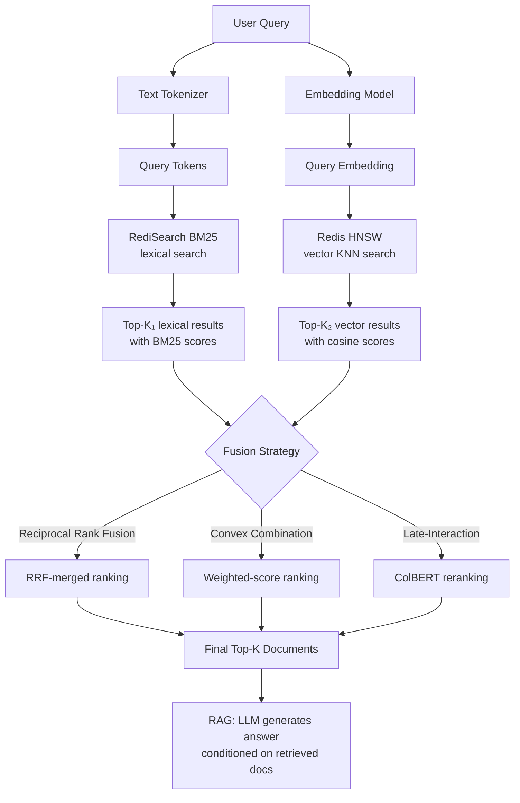

# 🔍 Hybrid Search: BM25 + Dense + Redis

---

## Module 1.1 — The Retrieval Problem: Why Naive Vector Search Fails

Most junior engineers approach RAG retrieval with a single tool: an embedding model (e.g., `all-MiniLM-L6-v2`) and cosine similarity. This works in demos. It breaks in production because:

1. **Lexical gap**: Exact matches on names, IDs, codes, dates, or technical terms fail when the query and document use different phrasing. "K8s pod OOM kill" and "Kubernetes pod out-of-memory termination" will have low cosine similarity despite being literally about the same thing.

2. **Semantic gap**: Dense embeddings sometimes retrieve thematically related but irrelevant content. A query about "neural network activation functions" might retrieve "ReLU in CMOS circuits" because the embedding space conflates "activation" with "relay activation" in electronics.

3. **Domain shift**: Embedding models trained on general web text perform poorly on domain-specific language (legal contracts, medical records, financial filings) where vocabulary and semantics differ from the training distribution.

```
┌──────────────────────────────────────────────────────────────────┐
│                   Failed Retrieval Example                        │
│                                                                   │
│  User Query: "What is the max batch size for Llama-3 70B on A100?"│
│                                                                   │
│  ┌─ Dense Retrieval (cosine similarity) ───────────────────────┐  │
│  │                                                             │  │
│  │  Top-3 Results:                                             │  │
│  │  ❌ 1. "Batch normalization in training Llama models"       │  │
│  │        sim=0.87 — semantically related, wrong answer       │  │
│  │  ❌ 2. "A100 vs H100 benchmark for image models"            │  │
│  │        sim=0.83 — same hardware, wrong model               │  │
│  │  ❌ 3. "How to deploy Llama on A100 GPUs"                   │  │
│  │        sim=0.81 — close, but missing keyword 'batch size'  │  │
│  │                                                             │  │
│  └─────────────────────────────────────────────────────────────┘  │
│                                                                   │
│  ┌─ BM25 Lexical Retrieval ────────────────────────────────────┐  │
│  │                                                             │  │
│  │  Top-3 Results (TF-IDF on term overlap):                    │  │
│  │  ✅ 1. "Maximum batch size for Llama-3-70B on single A100"  │  │
│  │        BM25=12.4 — exact keyword match                     │  │
│  │  ✅ 2. "Llama-3 70B inference config: batch_size=8 on A100" │  │
│  │        BM25=10.1 — matches 'batch', 'Llama-3', 'A100'      │  │
│  │  ❌ 3. "Llama batch training cost estimation"               │  │
│  │        BM25=6.2 — high term overlap but incomplete answer   │  │
│  │                                                             │  │
│  └─────────────────────────────────────────────────────────────┘  │
│                                                                   │
│  ┌─ Hybrid Fusion ──────────────────────────────────────────────┐ │
│  │                                                             │  │
│  │  Combined ranking (RRF k=60):                               │  │
│  │  ✅ 1. "Maximum batch size for Llama-3-70B on single A100"  │  │
│  │        dense_rank=7, bm25_rank=1 → RRF=0.0442               │  │
│  │  ✅ 2. "Llama-3 70B inference config: batch_size=8 on A100" │  │
│  │        dense_rank=15, bm25_rank=2 → RRF=0.0345              │  │
│  │  ✅ 3. "Llama-3 70B deployment best practices"              │  │
│  │        dense_rank=3, bm25_rank=8 → RRF=0.0312               │  │
│  │                                                             │  │
│  └─────────────────────────────────────────────────────────────┘  │
└──────────────────────────────────────────────────────────────────┘
```

> **Figure 1**: A query where dense retrieval returns semantically related but unhelpful documents. BM25 catches the exact keyword matches. Hybrid fusion combines both signals to produce the correct top-3 ranking.

### Real Case: Stripe's Documentation Search

Stripe's developer documentation search serves millions of queries per day. In a 2023 engineering blog post, they described migrating from pure BM25 (Algolia) to a hybrid embedding + BM25 system. The key finding: for API reference queries like "create payment intent stripe.js", BM25 alone worked perfectly (exact method name match). For conceptual queries like "how to handle failed payments", embeddings outperformed BM25 by 40% in click-through rate. Their final system used a weighted fusion with 70% embedding weight for conceptual queries and 70% BM25 weight for known API name queries — classified by a lightweight query classifier.

---

## Module 2.1 — BM25 Theory and the TF-IDF Foundation

BM25 (Best Match 25) is the industry-standard lexical retrieval function, building on decades of information retrieval research beginning with TF-IDF.

### The TF-IDF Intuition

- **Term Frequency (TF)**: How often does term `t` appear in document `d`? More occurrences → higher relevance.
- **Inverse Document Frequency (IDF)**: How rare is term `t` across the entire corpus? Rare terms (like "PagedAttention") are more informative than common terms (like "the").

TF-IDF weight: `w(t, d) = tf(t, d) × log( (N - df(t) + 0.5) / (df(t) + 0.5) )`

### BM25: TF Saturation and Document Length Normalization

TF-IDF has two critical flaws that BM25 fixes:

1. **TF saturation**: In TF-IDF, a term appearing 100 times is 10× more important than appearing 10 times. In reality, the 11th occurrence adds negligible value. BM25 applies a non-linear saturation: `tf_sat = tf × (k1 + 1) / (tf + k1)`.

2. **Length normalization**: Longer documents naturally have higher TF for all terms. BM25 normalizes by document length relative to the average corpus length with parameter `b`.

**Full BM25 formula:**

```
BM25(q, d) = Σ [ IDF(t) × ( tf(t,d) × (k1 + 1) ) / ( tf(t,d) + k1 × (1 - b + b × |d|/avgdl) ) ]
  for each term t in query q

Where:
  k1 ∈ [1.2, 2.0] — controls TF saturation (default: 1.5)
  b  ∈ [0.0, 1.0] — controls length normalization (default: 0.75)
    b=0: no normalization     b=1: full normalization
  avgdl — average document length across corpus
  |d|   — current document length
```

```python
import math
from collections import Counter
from typing import List, Tuple


class BM25:
    """
    A minimal BM25 implementation for educational purposes.
    For production, use RedisSearch or Elasticsearch built-in BM25.
    """
    def __init__(self, corpus: List[str], k1: float = 1.5, b: float = 0.75):
        self.k1 = k1
        self.b = b
        self.corpus_size = len(corpus)
        self.avgdl = sum(len(doc.split()) for doc in corpus) / self.corpus_size
        self.doc_freqs = []  # term frequency per document
        self.idf = {}        # inverse document frequency
        self._initialize(corpus)

    def _initialize(self, corpus: List[str]):
        doc_term_counts = []
        df = Counter()  # document frequency

        for doc in corpus:
            tokens = doc.lower().split()
            freqs = Counter(tokens)
            doc_term_counts.append(freqs)
            for term in freqs:
                df[term] += 1

        self.doc_freqs = doc_term_counts

        # IDF with smoothing
        for term, freq in df.items():
            self.idf[term] = math.log(
                (self.corpus_size - freq + 0.5) / (freq + 0.5) + 1.0
            )

    def score(self, query: str, doc_idx: int) -> float:
        query_tokens = query.lower().split()
        doc_len = sum(self.doc_freqs[doc_idx].values())
        score = 0.0

        for token in query_tokens:
            if token not in self.idf:
                continue
            tf = self.doc_freqs[doc_idx].get(token, 0)
            if tf == 0:
                continue

            # BM25 TF component with saturation
            numerator = tf * (self.k1 + 1)
            denominator = tf + self.k1 * (1 - self.b + self.b * doc_len / self.avgdl)
            score += self.idf[token] * numerator / denominator

        return score

    def search(self, query: str, top_k: int = 10) -> List[Tuple[int, float]]:
        scores = [
            (idx, self.score(query, idx))
            for idx in range(self.corpus_size)
        ]
        scores.sort(key=lambda x: x[1], reverse=True)
        return scores[:top_k]
```

---

## Module 2.2 — RedisSearch BM25 with RediSearch

Redis is not just a cache. Redis Stack includes **RediSearch**, a full-text and vector search engine that runs inside Redis — no separate Elasticsearch cluster required. This is ideal for RAG systems because you get lexical search, vector search, and caching in a single infrastructure component.

Your existing [[../../Go Engineering/projects/05 - ML Serving Gateway.md|ML Serving Gateway project]] already uses Redis for caching. Extending it to include RediSearch for hybrid retrieval creates a unified serving + retrieval backend — a strong interview talking point.

```python
# redis_search_indexer.py — Index documents with BM25 + vector fields in Redis
import redis
from redis.commands.search.field import TextField, VectorField, TagField
from redis.commands.search.indexDefinition import IndexDefinition, IndexType
from redis.commands.search.query import Query
import numpy as np
from typing import List, Dict


class RedisHybridIndex:
    """
    Manages a RediSearch index that supports both full-text (BM25-like) search
    and KNN vector search on the same documents.
    """
    def __init__(
        self,
        host: str = "localhost",
        port: int = 6379,
        index_name: str = "rag_docs",
        vector_dim: int = 384,  # all-MiniLM-L6-v2 dimension
    ):
        self.client = redis.Redis(host=host, port=port, decode_responses=False)
        self.index_name = index_name
        self.vector_dim = vector_dim
        self._create_index()

    def _create_index(self):
        """Create RediSearch index with text and vector fields."""
        try:
            self.client.ft(self.index_name).dropindex(delete_documents=False)
        except redis.exceptions.ResponseError:
            pass  # Index doesn't exist yet

        schema = (
            TextField("content", weight=1.0, no_stem=False),
            TextField("title", weight=2.0),  # Title matches are more relevant
            TagField("source", separator=","),
            VectorField(
                "embedding",
                algorithm="HNSW",
                attributes={
                    "TYPE": "FLOAT32",
                    "DIM": self.vector_dim,
                    "DISTANCE_METRIC": "COSINE",
                    "M": 16,          # HNSW graph degree
                    "EF_CONSTRUCTION": 200,
                },
            ),
        )

        self.client.ft(self.index_name).create_index(
            schema,
            definition=IndexDefinition(
                prefix=["doc:"], index_type=IndexType.HASH
            ),
        )

    def index_document(
        self,
        doc_id: str,
        content: str,
        title: str,
        embedding: np.ndarray,
        source: str = "internal",
        metadata: Dict[str, str] = None,
    ):
        """Index a single document with text and vector fields."""
        key = f"doc:{doc_id}"
        mapping = {
            "content": content,
            "title": title,
            "source": source,
            "embedding": embedding.astype(np.float32).tobytes(),
        }
        if metadata:
            for k, v in metadata.items():
                mapping[k] = v

        self.client.hset(key, mapping=mapping)

    def index_batch(self, documents: List[Dict]):
        """Bulk-index documents using a pipeline."""
        pipe = self.client.pipeline()
        for doc in documents:
            key = f"doc:{doc['id']}"
            mapping = {
                "content": doc["content"],
                "title": doc["title"],
                "source": doc.get("source", "internal"),
                "embedding": doc["embedding"].astype(np.float32).tobytes(),
            }
            pipe.hset(key, mapping=mapping)
        pipe.execute()

    def bm25_search(self, query_text: str, top_k: int = 10) -> List[Dict]:
        """Pure lexical (BM25-like) search using RediSearch."""
        q = Query(query_text).paging(0, top_k).with_scores()
        results = self.client.ft(self.index_name).search(q)
        return [
            {
                "id": doc.id.replace("doc:", ""),
                "title": doc.title,
                "content": doc.content,
                "score": doc.score,
                "source": doc.source,
            }
            for doc in results.docs
        ]

    def vector_search(
        self, query_embedding: np.ndarray, top_k: int = 10
    ) -> List[Dict]:
        """Pure dense vector search using HNSW index in Redis."""
        query_bytes = query_embedding.astype(np.float32).tobytes()
        q = (
            Query(f"*=>[KNN {top_k} @embedding $vec AS vector_score]")
            .sort_by("vector_score", asc=True)
            .paging(0, top_k)
            .return_fields("title", "content", "source", "vector_score")
            .dialect(2)
        )
        results = self.client.ft(self.index_name).search(
            q, query_params={"vec": query_bytes}
        )
        return [
            {
                "id": doc.id.replace("doc:", ""),
                "title": doc.title,
                "content": doc.content,
                "score": float(doc.vector_score),
                "source": doc.source,
            }
            for doc in results.docs
        ]

    def hybrid_search(
        self,
        query_text: str,
        query_embedding: np.ndarray,
        top_k: int = 10,
        fusion: str = "rrf",
    ) -> List[Dict]:
        """
        Hybrid search combining BM25 lexical and dense vector results.
        See Module 3 for fusion strategy details.
        """
        bm25_results = self.bm25_search(query_text, top_k * 2)
        vector_results = self.vector_search(query_embedding, top_k * 2)

        if fusion == "rrf":
            return self._reciprocal_rank_fusion(bm25_results, vector_results, top_k)
        elif fusion == "convex":
            return self._convex_fusion(bm25_results, vector_results, top_k)
        else:
            raise ValueError(f"Unknown fusion strategy: {fusion}")

    def _reciprocal_rank_fusion(
        self,
        bm25: List[Dict],
        vector: List[Dict],
        top_k: int,
        k: int = 60,
    ) -> List[Dict]:
        """Reciprocal Rank Fusion: RRF(d) = SUM_{r in rankings} 1/(k + rank(d,r))."""
        scores = {}
        docs = {}

        for rank, doc in enumerate(bm25, start=1):
            scores[doc["id"]] = scores.get(doc["id"], 0) + 1 / (k + rank)
            docs[doc["id"]] = doc

        for rank, doc in enumerate(vector, start=1):
            scores[doc["id"]] = scores.get(doc["id"], 0) + 1 / (k + rank)
            docs[doc["id"]] = doc

        ranked = sorted(scores.items(), key=lambda x: x[1], reverse=True)[:top_k]
        return [{**docs[doc_id], "hybrid_score": score} for doc_id, score in ranked]

    def _convex_fusion(
        self,
        bm25: List[Dict],
        vector: List[Dict],
        top_k: int,
        alpha: float = 0.5,
    ) -> List[Dict]:
        """
        Convex combination: score = alpha * BM25_norm + (1-alpha) * vector_norm.
        Requires score normalization before combination.
        """
        def min_max_norm(items: List[Dict], key: str = "score"):
            values = [d[key] for d in items]
            min_v, max_v = min(values), max(values)
            if max_v == min_v:
                return [{**d, f"{key}_norm": 1.0} for d in items]
            return [{**d, f"{key}_norm": (d[key] - min_v) / (max_v - min_v)} for d in items]

        bm25_norm = min_max_norm(bm25)
        vector_norm = min_max_norm(vector)

        combined = {}
        for doc in bm25_norm:
            combined[doc["id"]] = {
                **doc,
                "fusion_score": alpha * doc["score_norm"],
            }
        for doc in vector_norm:
            if doc["id"] in combined:
                combined[doc["id"]]["fusion_score"] += (1 - alpha) * doc["score_norm"]
            else:
                combined[doc["id"]] = {
                    **doc,
                    "fusion_score": (1 - alpha) * doc["score_norm"],
                }

        ranked = sorted(
            combined.values(), key=lambda x: x["fusion_score"], reverse=True
        )[:top_k]
        return [{**d, "hybrid_score": d.pop("fusion_score")} for d in ranked]
```

> 💡 **Tip**: Redis `TEXT` fields use a modified TF-IDF scoring that closely approximates BM25 (with configurable `$weight`). For the absolute best lexical performance, use RediSearch's `BM25` scorer explicitly by setting `SCORER BM25` in the index creation or query options.

---

## Module 3.1 — Hybrid Fusion Strategies

Once you have two ranked lists (lexical and dense), you need to merge them. The fusion strategy is the most important design decision in a hybrid search system.

### Strategy A: Reciprocal Rank Fusion (RRF)

RRF ignores absolute scores entirely and uses only **ranks**. This is robust because score magnitudes vary wildly between lexical and dense systems (BM25 scores can be 0–50+ while cosine similarity is -1 to 1).

```
RRF(d) = SUM_over_rankings [ 1 / (k + rank(d, r)) ]
```

Where `k=60` is the standard constant (reduces the impact of very high ranks).

**Advantages**: No calibration needed, works with any combination of ranking systems, robust to score distribution differences.
**Disadvantages**: Discards absolute score information (a document ranked 1st in both systems with marginal margin gets the same RRF score as one ranked 1st with huge margin).

### Strategy B: Convex Combination

Normalize scores to [0, 1] via min-max scaling, then combine with a weight `α`:

```
score = α × BM25_norm + (1-α) × vector_norm
```

**Advantages**: Retains score magnitude information, tunable `α` for domain-specific optimization.
**Disadvantages**: Requires score normalization, sensitive to outliers, needs tuning on a validation set.

### Strategy C: Late-Interaction (ColBERT-style)

Instead of fusing after retrieval, compute token-level interactions between the query and each candidate document during reranking. This is computationally heavier but achieves state-of-the-art quality. ColBERT computes:

```
score(q, d) = Σ_i max_j ( E_q[i] · E_d[j] )
```

Where `E_q[i]` is the embedding of the i-th query token and `E_d[j]` is the embedding of the j-th document token.

### Fusion Pipeline Flowchart



### Real Case: Coda's Hybrid Search Architecture

Coda (the collaborative document platform) replaced their Elasticsearch-backed search with a hybrid BM25 + embedding system in 2024. Their architecture:
- **Indexing**: Every document paragraph is chunked, embedded with `text-embedding-3-small`, and stored in a custom vector store + Redis for BM25.
- **Query-time fusion**: RRF (k=60) combining BM25 and cosine similarity rankings.
- **Query classification**: A fast BERT classifier categorizes queries as "keyword" (names, IDs, dates — BM25 weight 0.8), "conceptual" (open-ended questions — vector weight 0.8), or "mixed" (equal weight).
- **Result**: 28% improvement in NDCG@10 over pure BM25, 19% over pure embeddings. Latency stayed under 50ms p99 because Redis handles both lexical and vector paths.

---

## Module 4 — Building a Complete Hybrid Search Pipeline

### Architecture Overview

```
┌─────────────────────────────────────────────────────────────┐
│                     Hybrid Search API                        │
│                                                             │
│  POST /search                                                │
│  {                                                           │
│    "query": "How to configure vLLM tensor parallelism?",     │
│    "top_k": 10,                                              │
│    "fusion": "rrf"                                           │
│  }                                                           │
│      │                                                      │
│      ▼                                                      │
│  ┌───────────────────────────────────────────────────────┐  │
│  │              FastAPI Gateway (Router)                  │  │
│  │                                                       │  │
│  │  ┌──────────────┐  ┌──────────────┐  ┌─────────────┐  │  │
│  │  │ Embedding    │  │ BM25 Search  │  │ Cache Check │  │  │
│  │  │ (HF Transform│  │ (RediSearch) │  │ (Redis GET) │  │  │
│  │  │  all-MiniLM) │  │              │  │             │  │  │
│  │  └──────┬───────┘  └──────┬───────┘  └──────┬──────┘  │  │
│  │         │                 │                 │         │  │
│  │         └────────┬────────┘                 │         │  │
│  │                  ▼                          ▼         │  │
│  │         ┌───────────────┐          ┌──────────────┐  │  │
│  │         │ Fusion Engine │          │ Cache Hit?   │  │  │
│  │         │ (RRF / Convex)│          │ Return early │  │  │
│  │         └───────┬───────┘          └──────────────┘  │  │
│  │                 │                                     │  │
│  │                 ▼                                     │  │
│  │         ┌───────────────┐                             │  │
│  │         │ Reranker      │                             │  │
│  │         │ (Cross-Enc)   │                             │  │
│  │         └───────┬───────┘                             │  │
│  │                 │                                     │  │
│  │                 ▼                                     │  │
│  │         ┌───────────────┐                             │  │
│  │         │ Response      │                             │  │
│  │         │ + Sources     │                             │  │
│  │         └───────────────┘                             │  │
│  └───────────────────────────────────────────────────────┘  │
└─────────────────────────────────────────────────────────────┘
```

> **Figure 2**: Complete hybrid search architecture. The cache (Redis GET) short-circuits the entire pipeline for repeated queries. The optional reranker applies a cross-encoder for final precision.

```python
# search_api.py — Complete FastAPI hybrid search endpoint
import time
import hashlib
import json
import numpy as np
from typing import List, Optional, Literal
from fastapi import FastAPI, HTTPException, Query
from pydantic import BaseModel, Field
from sentence_transformers import SentenceTransformer
from redis_search_indexer import RedisHybridIndex


class SearchRequest(BaseModel):
    query: str = Field(..., min_length=1, max_length=512)
    top_k: int = Field(default=10, ge=1, le=50)
    fusion: Literal["rrf", "convex"] = Field(default="rrf")
    alpha: float = Field(default=0.5, ge=0.0, le=1.0)  # for convex fusion
    use_cache: bool = Field(default=True)


class SearchResult(BaseModel):
    id: str
    title: str
    content_snippet: str = Field(max_length=500)
    score: float
    source: str


class SearchResponse(BaseModel):
    query: str
    results: List[SearchResult]
    total_ms: float
    from_cache: bool = False
    method: str


# Initialize FastAPI
app = FastAPI(title="Hybrid Search API", version="2.0.0")

# Load models and connections at startup
@app.on_event("startup")
async def startup():
    global embedder, redis_index, cache_client
    embedder = SentenceTransformer("all-MiniLM-L6-v2")
    redis_index = RedisHybridIndex(
        host="localhost", port=6379, index_name="rag_docs", vector_dim=384
    )
    import redis as sync_redis
    cache_client = sync_redis.Redis(host="localhost", port=6379, db=1)  # separate DB for cache


@app.post("/search", response_model=SearchResponse)
async def hybrid_search(request: SearchRequest):
    start = time.perf_counter()

    # 1. Cache lookup
    cache_key = _cache_key(request)
    if request.use_cache:
        cached = cache_client.get(cache_key)
        if cached:
            results = json.loads(cached)
            elapsed = (time.perf_counter() - start) * 1000
            return SearchResponse(
                query=request.query,
                results=[SearchResult(**r) for r in results],
                total_ms=round(elapsed, 2),
                from_cache=True,
                method=f"cached-{request.fusion}",
            )

    # 2. Generate query embedding
    query_embedding = embedder.encode(request.query, normalize_embeddings=True)

    # 3. Hybrid search
    if request.fusion == "rrf":
        results = redis_index.hybrid_search(
            request.query, query_embedding, top_k=request.top_k, fusion="rrf"
        )
    else:
        results = redis_index.hybrid_search(
            request.query, query_embedding, top_k=request.top_k, fusion="convex"
        )

    # 4. Format response
    formatted = [
        SearchResult(
            id=r["id"],
            title=r.get("title", "Untitled"),
            content_snippet=r.get("content", "")[:500],
            score=round(r.get("hybrid_score", r.get("score", 0.0)), 4),
            source=r.get("source", "unknown"),
        )
        for r in results
    ]

    # 5. Cache the result (60s TTL)
    cache_client.setex(
        cache_key,
        60,
        json.dumps([r.model_dump() for r in formatted]),
    )

    elapsed = (time.perf_counter() - start) * 1000
    return SearchResponse(
        query=request.query,
        results=formatted,
        total_ms=round(elapsed, 2),
        from_cache=False,
        method=f"{request.fusion}-hybrid",
    )


@app.get("/search/fast")
async def fast_search(
    q: str = Query(..., min_length=1),
    top_k: int = Query(10, ge=1, le=20),
    method: Literal["bm25", "vector", "hybrid"] = "hybrid",
):
    """Simplified GET endpoint for quick testing."""
    embedding = embedder.encode(q, normalize_embeddings=True)

    if method == "bm25":
        results = redis_index.bm25_search(q, top_k)
    elif method == "vector":
        results = redis_index.vector_search(embedding, top_k)
    else:
        results = redis_index.hybrid_search(q, embedding, top_k)

    return {
        "query": q,
        "method": method,
        "results": [
            {"id": r["id"], "title": r.get("title", ""), "score": r.get("hybrid_score", r.get("score", 0))}
            for r in results
        ],
    }


@app.get("/health")
async def health():
    try:
        cache_client.ping()
        return {"status": "ok", "redis": "connected"}
    except Exception as e:
        return {"status": "degraded", "redis": str(e)}


def _cache_key(request: SearchRequest) -> str:
    """Deterministic cache key from query + params."""
    seed = f"{request.query}|{request.top_k}|{request.fusion}"
    return f"search:{hashlib.sha256(seed.encode()).hexdigest()[:16]}"
```

---

## 📦 Compression Code: Complete FastAPI Hybrid Search Stack

**Directory structure:**
```
hybrid-search/
├── docker-compose.yml
├── Dockerfile
├── requirements.txt
├── search_api.py
├── redis_search_indexer.py
└── seed_data.py          # Sample data for testing
```

**`docker-compose.yml`**:
```yaml
version: "3.9"
services:
  redis-stack:
    image: redis/redis-stack:latest
    ports:
      - "6379:6379"   # Redis
      - "8002:8001"   # RedisInsight (UI)
    volumes:
      - redis_data:/data
    healthcheck:
      test: ["CMD", "redis-cli", "ping"]
      interval: 10s
      retries: 5

  search-api:
    build: .
    ports:
      - "8000:8000"
    environment:
      - REDIS_HOST=redis-stack
      - REDIS_PORT=6379
    depends_on:
      redis-stack:
        condition: service_healthy
    volumes:
      - ./:/app

volumes:
  redis_data:
```

**`Dockerfile`**:
```dockerfile
FROM python:3.11-slim

WORKDIR /app

RUN apt-get update && apt-get install -y curl && rm -rf /var/lib/apt/lists/*

COPY requirements.txt .
RUN pip install --no-cache-dir -r requirements.txt

COPY search_api.py redis_search_indexer.py seed_data.py .

EXPOSE 8000

CMD ["uvicorn", "search_api:app", "--host", "0.0.0.0", "--port", "8000"]
```

**`requirements.txt`**:
```
fastapi==0.115.0
uvicorn[standard]==0.30.6
redis==5.2.0
sentence-transformers==3.2.0
numpy==1.26.4
pydantic==2.10.0
```

**`seed_data.py`** — populate the index with test documents:
```python
"""Run once to seed the Redis index with sample ML engineering documents."""
import numpy as np
from sentence_transformers import SentenceTransformer
from redis_search_indexer import RedisHybridIndex

embedder = SentenceTransformer("all-MiniLM-L6-v2")
index = RedisHybridIndex(host="localhost", port=6379, index_name="rag_docs")

documents = [
    {
        "id": "vllm-001",
        "title": "vLLM PagedAttention Explained",
        "content": "vLLM uses PagedAttention to manage KV cache memory efficiently. "
                   "By partitioning the KV cache into fixed-size blocks and using a block "
                   "table, vLLM eliminates memory fragmentation and enables serving many "
                   "concurrent requests. The default block size is 16 tokens. This allows "
                   "3-10x more concurrent requests than naive allocation strategies.",
        "source": "internal",
    },
    {
        "id": "vllm-002",
        "title": "Tensor Parallelism in vLLM",
        "content": "vLLM supports tensor parallelism for models that exceed a single GPU's "
                   "memory. By splitting weight matrices across GPUs using NCCL all-reduce, "
                   "Llama-3.1-70B can run on 4 A100 GPUs. Configure with --tensor-parallel-size "
                   "parameter. Each GPU holds a shard of each linear layer. For 70B models on "
                   "8 A100s, pipeline parallelism can further distribute layers across nodes.",
        "source": "internal",
    },
    {
        "id": "bm25-001",
        "title": "BM25 and TF-IDF Fundamentals",
        "content": "BM25 (Best Match 25) is the industry-standard lexical retrieval function. "
                   "It builds on TF-IDF but adds term frequency saturation via parameter k1 "
                   "and document length normalization via parameter b. Default values k1=1.5 "
                   "and b=0.75 work well for most corpora. BM25 excels at exact keyword matching "
                   "and is widely used in Elasticsearch and RediSearch.",
        "source": "internal",
    },
    {
        "id": "rag-001",
        "title": "Hybrid Search for Production RAG",
        "content": "Production RAG systems require hybrid search combining lexical (BM25) and "
                   "dense (vector embedding) retrieval. Reciprocal Rank Fusion (RRF) with k=60 "
                   "is the most robust fusion strategy because it ignores absolute score magnitudes. "
                   "Coda improved NDCG@10 by 28% using hybrid RRF over pure BM25. The pipeline "
                   "should include a cross-encoder reranker for final precision filtering.",
        "source": "internal",
    },
    {
        "id": "deploy-001",
        "title": "Kubernetes GPU Scheduling for LLMs",
        "content": "Deploying LLM inference on Kubernetes requires the NVIDIA GPU Operator, "
                   "proper node selectors (accelerator: nvidia-a100-80gb), and resource limits "
                   "(nvidia.com/gpu: 4). Use HorizontalPodAutoscaler with custom metrics for "
                   "auto-scaling. Readiness probes should check the /health endpoint. PVCs should "
                   "cache model weights to avoid downloading on every pod restart. vLLM, TGI, and "
                   "SGLang all provide OpenAI-compatible APIs that integrate with standard K8s patterns.",
        "source": "internal",
    },
]

for doc in documents:
    embedding = embedder.encode(doc["content"], normalize_embeddings=True)
    index.index_document(
        doc_id=doc["id"],
        content=doc["content"],
        title=doc["title"],
        embedding=embedding,
        source=doc.get("source", "internal"),
    )

print(f"Indexed {len(documents)} documents in Redis.")
```

---

## 🎯 Documented Project: Hybrid Search API for a RAG System

### Goal
Build a FastAPI endpoint that accepts text queries and returns the top-K most relevant documents using hybrid fusion. The endpoint must cache repeated queries, support both BM25-only and vector-only modes for debugging, and expose a health check.

### Steps

1. **Start Redis Stack.** `docker run -d -p 6379:6379 -p 8002:8001 redis/redis-stack:latest`
2. **Install dependencies.** `pip install -r requirements.txt`
3. **Seed the index.** Run `python seed_data.py` to populate Redis with sample documents.
4. **Start the API.** `uvicorn search_api:app --reload --port 8000`
5. **Test BM25 search.** `curl "http://localhost:8000/search/fast?q=PagedAttention+memory&method=bm25&top_k=3"`
6. **Test vector search.** `curl "http://localhost:8000/search/fast?q=efficient+GPU+memory+management&method=vector&top_k=3"`
7. **Test hybrid search.** `curl -X POST http://localhost:8000/search -H "Content-Type: application/json" -d '{"query": "how to deploy Llama on multiple GPUs", "top_k": 5, "fusion": "rrf"}'`
8. **Verify caching.** Send the same POST request twice. The second response should show `"from_cache": true`.
9. **Connect to LLM Gateway (extension).** Integrate this search API into the [[../../Go Engineering/projects/05 - ML Serving Gateway.md|ML Serving Gateway]] by adding a Go route that forwards `/search` requests to this Python service, using the same Redis instance for caching.
10. **Add observability (extension).** Add Prometheus metrics for cache hit rate, search latency, and result count. Use the same pattern from [[01 - vLLM and Production-Grade LLM Serving.md|Note 01]]'s `observability.py`.

### Success Criteria
- [ ] BM25 search returns exact keyword matches for technical terms
- [ ] Vector search returns semantically related documents
- [ ] Hybrid RRF search returns better top-3 results than either method alone (validated manually on seed data)
- [ ] Cache returns results in < 5ms for repeated queries
- [ ] `/health` returns Redis connection status
- [ ] All three search methods respond within 200ms for the seed dataset

---

## Key Takeaways

| # | Takeaway |
|---|----------|
| 1 | Pure dense retrieval fails on exact keyword matches for names, IDs, and technical terms. Pure BM25 fails on conceptual and paraphrased queries. Hybrid search is the production standard. |
| 2 | Reciprocal Rank Fusion (RRF) with k=60 is the most robust fusion strategy — it ignores score magnitudes and works across any ranking system. Use it as your default. |
| 3 | Redis Stack provides BM25, HNSW vector search, and caching in a single infrastructure component — eliminating the need for separate Elasticsearch and vector DB clusters. |
| 4 | Your Go/Fiber/Redis LLM Gateway project can integrate this hybrid search API by proxying requests and sharing the Redis instance for unified caching. |
| 5 | Always add a cross-encoder reranker on the top 20–50 candidates for production quality. The reranker is a precision filter; the hybrid retriever is a recall engine. |

## References

- Robertson & Zaragoza, "The Probabilistic Relevance Framework: BM25 and Beyond" (Foundations and Trends in IR, 2009)
- Cormack et al., "Reciprocal Rank Fusion Outperforms Condorcet and Individual Rank Learning Methods" (SIGIR 2009)
- RediSearch Documentation: https://redis.io/docs/latest/develop/interact/search-and-query/
- ColBERT: Khattab & Zaharia, "ColBERT: Efficient and Effective Passage Search via Contextualized Late Interaction over BERT" (SIGIR 2020)
- Coda Engineering Blog: "Building Hybrid Search at Coda" (2024)
- Stripe Engineering Blog: "Scaling Documentation Search with Embeddings" (2023)
- Related vault notes: [[../../Go Engineering/projects/05 - ML Serving Gateway.md]], [[../04 - Production RAG System.md]], [[../../06 - Cloud, Infra y Backend/25 - Bases de Datos y Message Queues/03 - Redis y Caching.md]], [[01 - vLLM and Production-Grade LLM Serving.md]]
