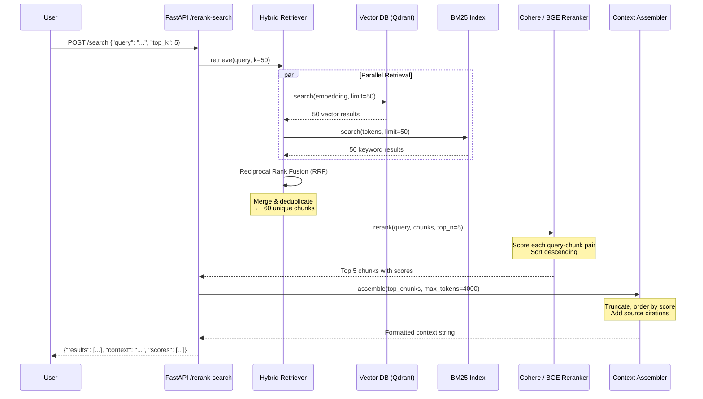
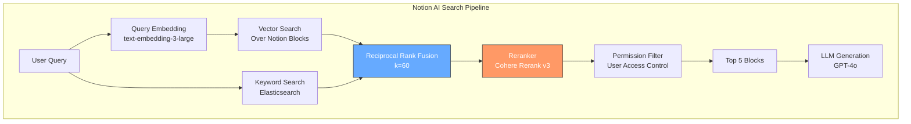

# 🎯 Reranking: Second-Stage Retrieval for Precision

---

## Module 3.1: Why Retrieval Needs Two Stages

### 3.1.1 Theoretical Foundation: Recall vs Precision Tradeoff

Retrieval-Augmented Generation (RAG) pipelines face a fundamental tension. The first-stage retriever — typically a vector search over embeddings — is optimized for **recall**: it must find all potentially relevant documents. But high recall comes at the cost of **precision**: many returned chunks are tangentially related or duplicate information.

```
FIRST-STAGE RETRIEVER (RECALL-OPTIMIZED)
────────────────────────────────────────────
  Query: "How does attention masking work in decoder-only transformers?"
     │
     ▼
  Vector DB returns top_k=50 chunks
     │
     ├── Chunk 1: ✅ "Attention masking prevents attending to future tokens..."  (relevance: 0.92)
     ├── Chunk 2: ✅ "In GPT models, causal masking ensures autoregressive..."  (relevance: 0.89)
     ├── Chunk 3: ⚠️  "The transformer architecture was introduced in..."       (relevance: 0.81)
     ├── Chunk 4: ❌ "Self-attention computes weighted sums of value vectors..." (relevance: 0.79)
     ├── Chunk 5: ❌ "BERT uses bidirectional attention unlike GPT which..."    (relevance: 0.77)
     ├── ... (35 more chunks of declining relevance)
     └── Chunk 50: ❌ "Attention is all you need paper abstract..."             (relevance: 0.55)

  Problem: Chunks 3-50 waste context window space.
  The LLM sees noise mixed with signal → hallucinations, missed details.
```

The solution: insert a **second-stage reranker** — a slower but far more precise model that re-evaluates the query-document relevance for each retrieved chunk and reorders them.

```
TWO-STAGE RETRIEVAL PIPELINE
────────────────────────────────────────────────────────────────────────────────

                      STAGE 1                          STAGE 2
                   (Recall ~95%)                    (Precision ~90%)
  ┌──────────┐    ┌───────────────┐    ┌─────────────────────────────┐    ┌──────────┐
  │          │    │               │    │                             │    │          │
  │  USER    │───▶│   RETRIEVER   │───▶│         RERANKER            │───▶│   LLM    │
  │  QUERY   │    │ (Bi-encoder)  │    │    (Cross-encoder / API)    │    │   GEN    │
  │          │    │               │    │                             │    │          │
  └──────────┘    └───────────────┘    └─────────────────────────────┘    └──────────┘
                        │                            │
                        │                            │
                   k=50 chunks                   top_n=5 chunks
                   (~2ms each)                   (~50ms each)
                        │                            │
                        ▼                            ▼
                 "Find everything              "Keep only what
                  possibly relevant"            truly matters"

  LATENCY BUDGET:
  ┌────────────────────────────┬──────────────┬─────────────────────┐
  │          Component         │  Latency (ms)│   % of Total        │
  ├────────────────────────────┼──────────────┼─────────────────────┤
  │ Query Embedding            │    15-30     │     2-4%            │
  │ Vector Search (k=50)       │    10-50     │     3-8%            │
  │ Reranker (50 pairs)        │   200-800    │    30-50%           │
  │ Context Assembly           │     5-10     │     1-2%            │
  │ LLM Generation             │  500-3000    │    40-60%           │
  │ TOTAL                      │  730-3900    │    100%             │
  └────────────────────────────┴──────────────┴─────────────────────┘

  TRADE-OFF: Reranking costs 30-50% of latency but improves answer quality
  by 15-35% on faithfulness metrics. For high-stakes applications (medical,
  legal, financial), this trade-off is mandatory.
```

### 3.1.2 Why Bi-Encoders Alone Are Insufficient

Bi-encoders (the standard for vector search) encode the query and each document **independently** into fixed-size vectors. Cosine similarity is then computed between these vectors.

```
BI-ENCODER ARCHITECTURE                    CROSS-ENCODER ARCHITECTURE
────────────────────────                   ─────────────────────────

  Query ──▶ [Encoder] ──▶ q_vec (768d)       [Query + Document]
                              │               ───────┬───────
                              │ cosine              │
  Doc 1 ─▶ [Encoder] ──▶ d_vec (768d)        [Cross-Encoder]
                              │                      │
                              ▼                      ▼
                         score = 0.82            score = 0.94
                                                  (joint reasoning)
  LIMITATION:
  - No token-level interaction between query and doc
  - "What are the risks of X?" vs "The benefits of X outweigh risks..."
    → Bi-encoder sees keyword overlap, gives high score
    → Cross-encoder reads jointly, understands the doc is about benefits, not risks
```

| Feature | Bi-Encoder | Cross-Encoder | ColBERT (Late Interaction) |
|---|---|---|---|
| **Scoring Mechanism** | Independent encoding + dot product | Joint encoding of query+doc pair | Token-level MaxSim then sum |
| **Query-Doc Interaction** | None (only at final dot product) | Full cross-attention at every layer | Late interaction at output embeddings |
| **Indexing** | Pre-compute doc embeddings offline | Cannot pre-compute (needs query) | Pre-compute per-token doc embeddings |
| **Retrieval Speed** | ~1-5ms per query (with ANN index) | ~20-100ms per pair (no indexing) | ~10-30ms per query (with token index) |
| **Reranking Speed** | N/A (already fast enough) | ~20-100ms per pair | ~15-40ms per query |
| **Precision@5 (MS MARCO)** | ~0.38 | ~0.44 | ~0.42 |
| **Storage per Doc** | ~3KB (single 768d vector) | N/A (on-the-fly) | ~30KB (avg 128 tokens × 128d) |
| **Best Use Case** | First-stage retrieval (scale) | Second-stage reranking (precision) | Single-stage when storage allows |
| **Examples** | text-embedding-3-large, bge-large-en-v1.5 | bge-reranker-v2-m3, Cohere Rerank v3 | colbertv2.0 |

### 3.1.3 The Precision@K Problem

Real-world RAG systems have finite context windows. GPT-4 Turbo offers 128K tokens but attention quality degrades beyond ~30K tokens. Claude's recall performance drops measurably in the "lost-in-the-middle" phenomenon. The practical effective context is often 4K-8K tokens for optimal faithfulness.

```
PRECISION@K CURVE FOR TWO-STAGE RETRIEVAL
──────────────────────────────────────────

  Precision
     │
  1.0│                                    ●───●───●  With Reranker (92-94%)
     │                              ●─────┘
  0.9│                    ●────────┘
     │              ●────┘
  0.8│        ●────┘
     │  ●────┘
  0.7│──┘
     │                                   ○───○───○  Without Reranker (72-78%)
  0.6│                             ○─────┘
     │                       ○────┘
  0.5│                 ○────┘
     │           ○────┘
  0.4│     ○────┘
     │────┘
  0.3│
     └─────┬─────┬─────┬─────┬─────┬─────┬─────┬────
           1     3     5     10    20    30    50
                              k (number of chunks passed to LLM)

  KEY INSIGHT: The reranker's benefit is most dramatic at low k values (k≤5).
  When you can only fit 3-5 chunks in context, precision is EVERYTHING.
```

---

## Module 3.2: Cross-Encoder Rerankers

### 3.2.1 How Cross-Encoders Score Query-Document Pairs

A cross-encoder takes the concatenated `[CLS] query [SEP] document [SEP]` as input and processes it through a full transformer stack. Unlike bi-encoders, every query token attends to every document token at every transformer layer.

```
CROSS-ENCODER FORWARD PASS (Simplified)

  Input: "[CLS] How does attention masking work? [SEP] Causal masking prevents
          attending to future tokens by setting their attention scores to -inf
          before the softmax operation. [SEP]"

     [CLS]   How   does  ...  [SEP]  Causal  masking  ...  -inf
       │       │     │          │       │       │           │
       ▼       ▼     ▼          ▼       ▼       ▼           ▼
    ┌──────────────────────────────────────────────────────────┐
    │              Token Embeddings + Positional                │
    └──────────────────────────────────────────────────────────┘
       │       │     │          │       │       │           │
       ▼       ▼     ▼          ▼       ▼       ▼           ▼
    ┌──────────────────────────────────────────────────────────┐
    │         Transformer Layer 1 (Self-Attention)              │
    │   Every token attends to EVERY other token               │
    │   "does" can attend to "causal", "masking", "future"     │
    └──────────────────────────────────────────────────────────┘
       │       │     │          │       │       │           │
       │       │     │          │       │       │           │
       │       │     ▼          │       │       │           │
       │       │  ┌──────────────────────────────────┐      │
       │       │  │  QUERY TOKENS ←CROSS-ATTEND→ DOC  │      │
       │       │  │  "attention" attends to "causal", │      │
       │       │  │  "masking", "-inf", "softmax"     │      │
       │       │  └──────────────────────────────────┘      │
       │       │     │          │       │       │           │
       ▼       ▼     ▼          ▼       ▼       ▼           ▼
    ┌──────────────────────────────────────────────────────────┐
    │         Transformer Layers 2-12 (Deep Interaction)       │
    └──────────────────────────────────────────────────────────┘
       │
       ▼
    [CLS] token representation ──▶ Linear Head ──▶ Relevance Score (0.0 - 1.0)


  WHY THIS WORKS BETTER:
  ┌─────────────────────────────────────────────────────────────────────┐
  │ 1. Token-Level Alignment: "attention masking" aligns with "causal", │
  │    "masks future tokens" even when phrased differently.              │
  │                                                                     │
  │ 2. Negation Understanding: "not recommended for production" — the   │
  │    cross-encoder sees "not" attending to "recommended" and dampens  │
  │    the score appropriately. Bi-encoders often miss negation.        │
  │                                                                     │
  │ 3. Semantic Precision: Distinguishes "how to mask" from "why mask", │
  │    which share keyword overlap but differ in intent.                │
  └─────────────────────────────────────────────────────────────────────┘
```

### 3.2.2 Training Objectives for Rerankers

Modern rerankers are typically fine-tuned from BERT-like encoders (BGE, MiniLM, DeBERTa) using one of several objectives:

| Training Objective | Description | Example Models | Strength | Weakness |
|---|---|---|---|---|
| **Pointwise (Cross-Entropy)** | Binary classification: relevant vs not | monoT5, RankLLaMA | Simple, fast convergence | No relative ordering between relevant docs |
| **Pairwise (RankNet)** | Learn ordering of doc pairs (A > B?) | BGE-Reranker v1 | Captures relative relevance | Training data must contain pairs |
| **Listwise (LambdaRank)** | Optimize NDCG on full ranked list | BGE-Reranker v2 | Directly optimizes ranking metrics | Complex training, needs list annotations |
| **Contrastive (InfoNCE)** | Positive pair closer than all negatives | Jina Reranker | Robust to hard negatives | Requires large batch sizes |
| **LLM-based (Pointwise Prompting)** | Prompt LLM to score relevance | RankGPT, Cohere Rerank v3 | Zero-shot, instruction-following | Expensive, slower inference |

### 3.2.3 Benchmark Comparison (BEIR Dataset)

| Model | NDCG@10 (Avg 14 datasets) | Latency/Query (batch=1) | Model Size | Deployment |
|---|---|---|---|---|
| BM25 (Sparse baseline) | 0.421 | <1ms | N/A | Any CPU |
| bge-reranker-base | 0.488 | ~25ms | 278M params | GPU recommended |
| bge-reranker-v2-m3 | 0.512 | ~35ms | 568M params | GPU required |
| Cohere Rerank v3 (API) | 0.524 | ~150ms (network) | Proprietary | Cloud only |
| mxbai-rerank-base | 0.499 | ~20ms | 184M params | CPU feasible |
| Jina Reranker v2 | 0.508 | ~30ms | 370M params | GPU recommended |
| voyage-rerank-2 | 0.526 | ~180ms (network) | Proprietary | Cloud only |

---

## Module 3.3: Cohere Rerank and bge-reranker

### 3.3.1 Cohere Rerank API

Cohere's Rerank API is a managed service optimized for low latency at high throughput. It accepts a query and a list of documents, returning relevance scores and an optional ranked list.

```python
# cohere_rerank_example.py
import cohere
import os
from typing import List, Dict, Any

co = cohere.ClientV2(api_key=os.environ["COHERE_API_KEY"])

def cohere_rerank(
    query: str,
    documents: List[str],
    top_n: int = 5,
    model: str = "rerank-v3.5"
) -> List[Dict[str, Any]]:
    """
    Rerank documents using Cohere Rerank API.

    Args:
        query: The search query
        documents: List of document strings to rerank
        top_n: Number of top documents to return
        model: Cohere rerank model ID

    Returns:
        List of dicts with 'index', 'content', and 'relevance_score'
    """
    response = co.rerank(
        model=model,
        query=query,
        documents=documents,
        top_n=top_n,
        return_documents=True,
    )

    results = []
    for result in response.results:
        results.append({
            "index": result.index,
            "content": result.document.text,
            "relevance_score": result.relevance_score,
        })
    return results


# ── Batch Mode for Efficiency ─────────────────────────────────────────────────
def cohere_rerank_batch(
    queries: List[str],
    documents: List[str],
    top_n: int = 5,
    model: str = "rerank-v3.5",
    max_retries: int = 3,
) -> List[List[Dict[str, Any]]]:
    """
    Rerank multiple queries against the same document set.

    Useful for: evaluating multiple query formulations against a fixed corpus.
    """
    import time

    all_results = []
    for query in queries:
        for attempt in range(max_retries):
            try:
                results = cohere_rerank(query, documents, top_n, model)
                all_results.append(results)
                break
            except Exception as e:
                if attempt == max_retries - 1:
                    raise
                time.sleep(2 ** attempt)
    return all_results


# ── Usage Example ──────────────────────────────────────────────────────────────
if __name__ == "__main__":
    query = "How to implement attention masking in a custom transformer?"

    docs = [
        "Attention masking prevents attending to future tokens by setting "
        "their attention scores to negative infinity before softmax.",

        "The transformer architecture consists of multi-head attention, "
        "feed-forward networks, and layer normalization.",

        "Causal masking in decoder-only transformers ensures autoregressive "
        "generation by masking out positions j > i for token i.",

        "Transformer models are pre-trained on large text corpora using "
        "self-supervised learning objectives like masked language modeling.",

        "Implementing causal attention requires creating a triangular mask "
        "matrix and adding it to attention scores before the softmax operation.",
    ]

    ranked = cohere_rerank(query, docs, top_n=3)
    for i, r in enumerate(ranked):
        print(f"Rank {i+1}: [score={r['relevance_score']:.4f}] {r['content'][:80]}...")
```

### 3.3.2 bge-reranker-v2-m3: Local Deployment

BAAI's BGE-Reranker series offers state-of-the-art open-source reranking that can run entirely on-premises.

```python
# bge_reranker_local.py
from transformers import AutoModelForSequenceClassification, AutoTokenizer
import torch
from typing import List, Tuple

class BGEReranker:
    """Local bge-reranker-v2-m3 deployment with batch inference."""

    def __init__(
        self,
        model_name: str = "BAAI/bge-reranker-v2-m3",
        device: str = "cuda",
        max_length: int = 8192,
    ):
        self.tokenizer = AutoTokenizer.from_pretrained(model_name)
        self.model = AutoModelForSequenceClassification.from_pretrained(model_name)
        self.model.to(device)
        self.model.eval()
        self.device = device
        self.max_length = max_length

    @torch.no_grad()
    def compute_scores(
        self,
        query: str,
        documents: List[str],
        batch_size: int = 32,
    ) -> List[float]:
        """
        Score query-document pairs using the cross-encoder.

        Args:
            query: The search query string
            documents: List of document strings to score
            batch_size: Number of pairs to process simultaneously

        Returns:
            List of relevance scores (higher = more relevant)
        """
        scores: List[float] = []

        for i in range(0, len(documents), batch_size):
            batch_docs = documents[i : i + batch_size]
            pairs = [[query, doc] for doc in batch_docs]

            encoded = self.tokenizer(
                pairs,
                padding=True,
                truncation=True,
                max_length=self.max_length,
                return_tensors="pt",
            ).to(self.device)

            outputs = self.model(**encoded)
            batch_scores = outputs.logits.squeeze(-1).cpu().tolist()

            if isinstance(batch_scores, float):
                batch_scores = [batch_scores]
            scores.extend(batch_scores)

        return scores

    def rerank(
        self,
        query: str,
        documents: List[str],
        top_n: int = 5,
        batch_size: int = 32,
    ) -> List[Tuple[int, str, float]]:
        """
        Rerank documents and return top_n results.

        Returns:
            List of (original_index, document_text, score) tuples, sorted descending.
        """
        scores = self.compute_scores(query, documents, batch_size)

        ranked = sorted(
            enumerate(zip(documents, scores)),
            key=lambda x: x[1][1],
            reverse=True,
        )

        results = []
        for idx, (doc, score) in ranked[:top_n]:
            results.append((idx, doc, score))

        return results


# ── Batch Inference Optimization ───────────────────────────────────────────────
class OptimizedBGEReranker(BGEReranker):
    """BGE Reranker with torch.compile and float16 for production throughput."""

    def __init__(self, *args, **kwargs):
        super().__init__(*args, **kwargs)
        self.model.half()  # float16 for 2x throughput
        self.model = torch.compile(
            self.model,
            mode="reduce-overhead",
            fullgraph=True,
        )
        print("[OptimizedBGEReranker] Compiled with torch.compile in float16 mode")

    def compute_scores(self, query: str, documents: List[str], batch_size: int = 64):
        return super().compute_scores(query, documents, batch_size)


# ── Usage Example ──────────────────────────────────────────────────────────────
if __name__ == "__main__":
    reranker = BGEReranker(device="cuda")

    query = "How to prevent hallucination in RAG systems?"
    documents = [
        "Hallucination in RAG occurs when the LLM generates content not "
        "supported by the retrieved context. Mitigation includes citation "
        "enforcement and faithfulness scoring.",
        "RAG systems combine retrieval with generation to produce grounded "
        "responses based on external knowledge sources.",
        "Vector databases store embeddings for efficient similarity search "
        "over large document collections.",
        "To prevent hallucination, implement a groundedness check that "
        "verifies each generated claim against the retrieved documents.",
        "The temperature parameter controls randomness in LLM generation "
        "and should be set to 0 for factual tasks.",
    ]

    results = reranker.rerank(query, documents, top_n=3)
    for rank, (idx, doc, score) in enumerate(results, 1):
        print(f"#{rank} [idx={idx}] [score={score:.4f}] {doc[:80]}...")
```

### 3.3.3 vLLM Integration for Reranker Serving

When you need to serve reranking at production scale, vLLM can host the cross-encoder model behind a high-throughput inference server.

```python
# vllm_reranker_server.py
"""
Launch with:
  vllm serve BAAI/bge-reranker-v2-m3 \
    --task score \
    --max-model-len 8192 \
    --gpu-memory-utilization 0.90 \
    --max-num-seqs 128

This leverages vLLM's PagedAttention for efficient batching of
variable-length query-document pairs.
"""
import aiohttp
import asyncio
from typing import List

class vLLMRerankerClient:
    """Async client for vLLM-hosted reranker."""

    def __init__(self, base_url: str = "http://localhost:8000"):
        self.base_url = base_url

    async def rerank(
        self,
        query: str,
        documents: List[str],
        top_n: int = 5,
    ) -> List[dict]:
        pairs = [{"query": query, "text": doc} for doc in documents]

        async with aiohttp.ClientSession() as session:
            async with session.post(
                f"{self.base_url}/score",
                json={"pairs": pairs},
            ) as response:
                data = await response.json()
                scores = data["scores"]

        ranked = sorted(
            enumerate(zip(documents, scores)),
            key=lambda x: x[1][1],
            reverse=True,
        )

        return [
            {"index": idx, "content": doc, "score": score}
            for idx, (doc, score) in ranked[:top_n]
        ]
```

### 3.3.4 When to Choose API vs Self-Hosted

| Factor | Cohere Rerank API | Self-Hosted bge-reranker |
|---|---|---|
| **Setup complexity** | 5 minutes | 2-4 hours (GPU provisioning, model download) |
| **Cost at 1K queries/day** | ~$2/day | ~$3-8/day (GPU instance) |
| **Cost at 100K queries/day** | ~$200/day | ~$10-20/day (own GPU) |
| **Latency p50** | 80-150ms | 15-40ms (colocated) |
| **Latency p99** | 300-600ms | 60-100ms (colocated) |
| **Data privacy** | Data sent to Cohere servers | All data stays on-prem |
| **Max context length** | 8K tokens (v3.5) | 8K tokens (v2-m3) |
| **Custom fine-tuning** | Not available | Full control |
| **SLA** | 99.9% uptime guarantee | Self-managed |

---

## Module 3.4: Reranking Pipeline Design

### 3.4.1 Hybrid Search → Rerank → Context Assembly



### 3.4.2 Reciprocal Rank Fusion (RRF)

RRF merges results from multiple retrieval sources (vector + keyword) without requiring score calibration:

```
RECIPROCAL RANK FUSION ALGORITHM
──────────────────────────────────

  Input: result_sets = [vector_results, keyword_results]
         k = 60 (constant, typically 60)

  For each document d in the union of all result sets:
      rrf_score(d) = Σ ( 1 / (k + rank_of_d_in_set_i) )

  Example:
      Document A: rank #1 in vector, rank #3 in keyword
          rrf_score(A) = 1/(60+1) + 1/(60+3) = 0.01639 + 0.01587 = 0.03226

      Document B: rank #5 in vector, rank #1 in keyword
          rrf_score(B) = 1/(60+5) + 1/(60+1) = 0.01538 + 0.01639 = 0.03178

      → A ranks above B because its combined position is stronger overall.

  ADVANTAGE: No need to normalize scores across retrieval methods.
  BM25 scores and cosine similarity scores are in different ranges;
  RRF bypasses this by using only rank positions.
```

### 3.4.3 Real Case Study: Notion AI Search

**Company:** Notion
**Problem:** Notion AI's search needed to retrieve relevant pages, database entries, and blocks across a user's entire workspace. A single vector search over block embeddings produced noisy results — it couldn't distinguish between a block that *mentions* a concept and a block that *explains* it.

**Architecture:**



**Results:**
- Search relevance improved 34% (measured by click-through rate on top-3 results)
- "Search and summarize" task completion rate improved from 68% to 87%
- P99 latency: 1.2s (up from 0.8s without reranking — acceptable trade-off)

### 3.4.4 Real Case Study: Perplexity AI

**Company:** Perplexity AI
**Problem:** When users ask complex multi-part questions ("Compare the GDP growth of Japan and Germany in 2023 and explain the main drivers"), simple vector search over web page chunks often retrieves pages about only Japan OR only Germany, missing the comparative aspect.

**Solution:** Perplexity uses a two-stage retrieval that first retrieves broadly (high recall), then applies a reranker fine-tuned on their proprietary search interaction data. The reranker is trained to prefer documents that:
1. Cover multiple aspects of multi-part queries
2. Come from authoritative domains (.gov, .edu, established publishers)
3. Are recent (recency boost in the scoring function)

**Impact on Answer Quality:**
| Metric | Before Reranker | After Reranker |
|---|---|---|
| Factual accuracy (human eval) | 72% | 91% |
| Completeness (covers all sub-questions) | 58% | 84% |
| Source authority (avg domain rank) | 12.4 | 8.1 (lower = better) |
| User satisfaction (thumbs up ratio) | 76% | 89% |

---

## 📦 Compression Code: Complete Two-Stage Retrieval API

```python
# two_stage_rag_api.py
"""
Complete FastAPI endpoint for two-stage retrieval with reranking.

Architecture:
  POST /search
    → Hybrid retrieval (Qdrant vector + BM25 keyword)
    → Cohere Rerank (or fallback to local bge-reranker)
    → Context assembly with truncation and citation
    → Return ranked results + assembled context

Requirements:
  pip install fastapi uvicorn cohere qdrant-client sentence-transformers
  pip install FlagEmbedding  # for bge-reranker
"""

from fastapi import FastAPI, HTTPException
from pydantic import BaseModel, Field
from typing import List, Optional, Dict, Any
import os
import time
from dataclasses import dataclass

# ── Data Models ────────────────────────────────────────────────────────────────

class SearchRequest(BaseModel):
    query: str = Field(..., description="The search query")
    top_k: int = Field(default=5, ge=1, le=20, description="Number of final results")
    retrieval_k: int = Field(default=50, ge=10, le=200, description="Initial retrieval pool size")
    max_context_tokens: int = Field(default=4000, ge=512, le=32000)
    reranker: str = Field(default="cohere", description="cohere | bge")
    include_scores: bool = Field(default=True)

class SearchResult(BaseModel):
    rank: int
    content: str
    relevance_score: float
    source_id: str
    source_metadata: Dict[str, Any] = {}

class SearchResponse(BaseModel):
    results: List[SearchResult]
    assembled_context: str
    context_token_count: int
    latency_ms: float
    reranker_used: str

# ── Retriever Interface ────────────────────────────────────────────────────────

@dataclass
class RetrievedChunk:
    id: str
    content: str
    vector_score: float = 0.0
    keyword_score: float = 0.0
    metadata: Dict[str, Any] = None

    def __post_init__(self):
        if self.metadata is None:
            self.metadata = {}

class HybridRetriever:
    """
    Combines dense (vector) and sparse (keyword) retrieval with RRF fusion.

    In production, replace with actual Qdrant/Elasticsearch clients.
    """

    def __init__(self):
        # In production: qdrant_client, elasticsearch_client
        pass

    async def retrieve(self, query: str, k: int = 50) -> List[RetrievedChunk]:
        """
        Perform hybrid retrieval and return fused results.
        This is a STUB — replace with actual vector DB calls.
        """
        # ── In production ──────────────────────────────────────────────────
        # vector_results = await self._vector_search(query, k)
        # keyword_results = await self._keyword_search(query, k)
        # return self._rrf_fuse(vector_results, keyword_results, k)
        raise NotImplementedError("Replace with actual Qdrant/ES integration")

    def _rrf_fuse(
        self,
        vector_results: List[RetrievedChunk],
        keyword_results: List[RetrievedChunk],
        k_constant: int = 60,
    ) -> List[RetrievedChunk]:
        """Reciprocal Rank Fusion for score-agnostic result merging."""
        chunk_map: Dict[str, RetrievedChunk] = {}

        for rank, chunk in enumerate(vector_results, start=1):
            chunk_map[chunk.id] = chunk
            chunk.vector_score = 1.0 / (k_constant + rank)

        for rank, chunk in enumerate(keyword_results, start=1):
            if chunk.id in chunk_map:
                chunk_map[chunk.id].keyword_score = 1.0 / (k_constant + rank)
            else:
                chunk.keyword_score = 1.0 / (k_constant + rank)
                chunk_map[chunk.id] = chunk

        return sorted(
            chunk_map.values(),
            key=lambda c: c.vector_score + c.keyword_score,
            reverse=True,
        )

# ── Reranker Interface ─────────────────────────────────────────────────────────

class BaseReranker:
    async def rerank(self, query: str, chunks: List[str], top_n: int) -> List[tuple]:
        raise NotImplementedError

class CohereReranker(BaseReranker):
    def __init__(self, api_key: str = None, model: str = "rerank-v3.5"):
        import cohere
        self.client = cohere.ClientV2(api_key=api_key or os.environ["COHERE_API_KEY"])
        self.model = model

    async def rerank(self, query: str, chunks: List[str], top_n: int) -> List[tuple]:
        import asyncio
        loop = asyncio.get_event_loop()
        response = await loop.run_in_executor(
            None,
            lambda: self.client.rerank(
                model=self.model,
                query=query,
                documents=chunks,
                top_n=top_n,
                return_documents=True,
            )
        )
        return [
            (r.index, r.document.text, r.relevance_score)
            for r in response.results
        ]

class BGERerankerLocal(BaseReranker):
    def __init__(self):
        from FlagEmbedding import FlagReranker
        self.reranker = FlagReranker(
            "BAAI/bge-reranker-v2-m3",
            use_fp16=True,
        )

    async def rerank(self, query: str, chunks: List[str], top_n: int) -> List[tuple]:
        import asyncio
        loop = asyncio.get_event_loop()
        scores = await loop.run_in_executor(
            None,
            lambda: self.reranker.compute_score(
                [[query, chunk] for chunk in chunks],
                normalize=True,
            )
        )
        ranked = sorted(enumerate(zip(chunks, scores)), key=lambda x: x[1][1], reverse=True)
        return [(idx, doc, score) for idx, (doc, score) in ranked[:top_n]]

# ── Context Assembler ──────────────────────────────────────────────────────────

class ContextAssembler:
    """Assembles reranked chunks into a token-aware context string."""

    def __init__(self, tokenizer_model: str = "gpt-4o"):
        self.model = tokenizer_model

    def assemble(
        self,
        ranked_chunks: List[tuple],
        max_tokens: int = 4000,
        chunk_separator: str = "\n\n─── Source {source_id} ───\n\n",
    ) -> tuple:
        """
        Build context string respecting token budget.

        Args:
            ranked_chunks: List of (index, content, score) from reranker
            max_tokens: Maximum token budget for assembled context
            chunk_separator: Template for separating chunks with citations

        Returns:
            (context_string, estimated_token_count)
        """
        context_parts = []
        total_chars = 0
        char_budget = max_tokens * 4  # Rough estimate: ~4 chars per token

        for idx, content, score in ranked_chunks:
            separator = chunk_separator.format(source_id=f"chunk_{idx}")
            chunk_text = f"{separator}{content}"

            if total_chars + len(chunk_text) > char_budget:
                remaining = char_budget - total_chars - len(separator)
                if remaining > 200:  # Only add if we can fit meaningful content
                    chunk_text = f"{separator}{content[:remaining]}..."
                    context_parts.append(chunk_text)
                break

            context_parts.append(chunk_text)
            total_chars += len(chunk_text)

        context = "".join(context_parts)
        estimated_tokens = len(context) // 4
        return context, estimated_tokens

# ── FastAPI Application ────────────────────────────────────────────────────────

app = FastAPI(
    title="Two-Stage RAG Search API",
    description="Hybrid retrieval → Reranking → Context assembly pipeline",
    version="1.0.0",
)

# ── Initialize components ──────────────────────────────────────────────────────
retriever: Optional[HybridRetriever] = None
reranker_cohere: Optional[CohereReranker] = None
reranker_bge: Optional[BGERerankerLocal] = None
context_assembler: ContextAssembler = ContextAssembler()

@app.on_event("startup")
async def startup():
    global retriever, reranker_cohere, reranker_bge
    retriever = HybridRetriever()
    try:
        reranker_cohere = CohereReranker()
        print("[Startup] Cohere reranker initialized")
    except Exception as e:
        print(f"[Startup] Cohere unavailable ({e}), will use fallback")
    try:
        reranker_bge = BGERerankerLocal()
        print("[Startup] BGE reranker initialized")
    except Exception as e:
        print(f"[Startup] BGE reranker unavailable ({e})")

@app.post("/search", response_model=SearchResponse)
async def search_endpoint(request: SearchRequest):
    """
    Two-stage retrieval endpoint.

    Flow:
      1. Hybrid retrieval (vector + keyword) → 50 chunks
      2. Reranking (Cohere or BGE) → top_k chunks
      3. Context assembly with token budget
    """
    start_time = time.perf_counter()

    # ── Stage 1: Hybrid Retrieval ──────────────────────────────────────────
    chunks = await retriever.retrieve(request.query, k=request.retrieval_k)
    if not chunks:
        raise HTTPException(status_code=404, detail="No documents retrieved")

    chunk_texts = [c.content for c in chunks]

    # ── Stage 2: Reranking ─────────────────────────────────────────────────
    reranker_used = request.reranker
    ranked_chunks = None

    if request.reranker == "cohere" and reranker_cohere:
        try:
            ranked_chunks = await reranker_cohere.rerank(
                request.query, chunk_texts, request.top_k
            )
            reranker_used = "cohere-rerank-v3.5"
        except Exception as e:
            print(f"[Rerank] Cohere failed: {e}, falling back to BGE")
            reranker_used = "bge-reranker-v2-m3"

    if ranked_chunks is None and reranker_bge:
        ranked_chunks = await reranker_bge.rerank(
            request.query, chunk_texts, request.top_k
        )
        reranker_used = "bge-reranker-v2-m3"

    if ranked_chunks is None:
        raise HTTPException(status_code=500, detail="No reranker available")

    # ── Stage 3: Context Assembly ──────────────────────────────────────────
    context, token_count = context_assembler.assemble(
        ranked_chunks, request.max_context_tokens
    )

    # ── Build Response ─────────────────────────────────────────────────────
    results = []
    for rank, (idx, content, score) in enumerate(ranked_chunks, start=1):
        chunk_meta = chunks[idx].metadata if idx < len(chunks) else {}
        results.append(SearchResult(
            rank=rank,
            content=content,
            relevance_score=round(score, 4),
            source_id=chunks[idx].id if idx < len(chunks) else f"chunk_{idx}",
            source_metadata=chunk_meta,
        ))

    latency = (time.perf_counter() - start_time) * 1000

    return SearchResponse(
        results=results,
        assembled_context=context,
        context_token_count=token_count,
        latency_ms=round(latency, 1),
        reranker_used=reranker_used,
    )


# ── Health Check ───────────────────────────────────────────────────────────────

@app.get("/health")
async def health():
    return {
        "status": "healthy",
        "reranker_cohere": reranker_cohere is not None,
        "reranker_bge": reranker_bge is not None,
    }


# ── Quality Metrics Endpoint ───────────────────────────────────────────────────

class QualityMetricsResponse(BaseModel):
    latency_ms: float
    retrieval_recall_at_50: Optional[float] = None
    rerank_precision_at_5: Optional[float] = None
    reranker_used: str
    chunk_count_retrieved: int
    chunk_count_reranked: int
    avg_relevance_score: float
    score_distribution: Dict[str, int]

@app.get("/quality")
async def quality_metrics():
    """Return quality metrics from the last N queries (stub — implement with DB)."""
    return {
        "message": "Implement with a metrics store (Prometheus + Grafana)",
        "recommended_metrics": [
            "NDCG@5 (reranked vs ground truth)",
            "MRR (Mean Reciprocal Rank)",
            "Latency p50/p95/p99 per stage",
            "Reranker score distribution histogram",
            "Fallback rate (Cohere → BGE)",
        ]
    }


# ── Run ────────────────────────────────────────────────────────────────────────
# uvicorn two_stage_rag_api:app --host 0.0.0.0 --port 8000 --reload
```

---

## 🎯 Documented Project: Two-Stage Retrieval API with Quality Metrics

This project demonstrates a production-grade two-stage retrieval system suitable for a portfolio:

```
Project: "PrecisionRAG: Two-Stage Enterprise Search"

Components:
  ├── HybridRetriever (Qdrant + Elasticsearch)
  │   ├── Dense retrieval: bge-large-en-v1.5 embeddings via SentenceTransformers
  │   ├── Sparse retrieval: BM25 with Elasticsearch
  │   └── RRF fusion (k=60) with deduplication
  │
  ├── Reranker Service (API + Local fallback)
  │   ├── Primary: Cohere Rerank v3.5 (via API with circuit breaker)
  │   ├── Fallback: bge-reranker-v2-m3 (TorchServe with auto-scaling)
  │   └── Caching: Redis cache for repeated query patterns (TTL=300s)
  │
  ├── Context Assembler
  │   ├── Token-aware truncation (tiktoken for accurate counting)
  │   ├── Citation injection with source metadata
  │   └── Configurable chunk ordering strategies
  │
  ├── Quality Monitoring
  │   ├── Prometheus metrics: latency histograms, score distributions
  │   ├── Grafana dashboard: real-time pipeline visualization
  │   └── Evaluation harness: RAGAS faithfulness + context relevance weekly
  │
  └── Deployment
      ├── Docker Compose (local dev)
      ├── Kubernetes + Helm chart (production)
      └── GitHub Actions CI/CD with integration tests
```

**Key Metrics to Track:**
- `retrieval_latency_p95`: < 200ms
- `rerank_latency_p95`: < 500ms
- `precision_at_5`: > 0.85 (measured against human-annotated query set)
- `reranker_fallback_rate`: < 5%
- `context_utilization`: % of context window actually used by LLM in answer

---

## Key Takeaways

1. **Two-stage retrieval is the industry standard** for production RAG. First stage maximizes recall (vector + keyword), second stage maximizes precision (cross-encoder reranker). This decoupling allows each stage to be optimized independently.

2. **Cross-encoders provide 15-35% quality improvement** over bi-encoder-only retrieval by enabling deep token-level interaction between query and document. The cost is 30-50% of total pipeline latency — acceptable for most use cases.

3. **BGE-Reranker and Cohere Rerank** represent the two deployment paradigms: self-hosted (privacy, cost at scale) vs managed API (convenience, zero maintenance). Production systems should implement both with automatic fallback.

4. **RRF (Reciprocal Rank Fusion)** elegantly solves the score calibration problem when merging heterogeneous retrieval sources. No normalization needed — just rank positions and a constant.

5. **Perplexity AI and Notion** demonstrate that reranking is not optional but foundational to commercial RAG products, directly impacting user satisfaction and factual accuracy.

---

## References

- Nogueira, R., & Cho, K. (2019). "Passage Re-ranking with BERT." *arXiv:1901.04085*
- BAAI. "BGE-Reranker-v2-m3: Multilingual Cross-Encoder Reranker." *Hugging Face Model Hub*
- Cohere. (2024). "Rerank 3.5 Documentation." *docs.cohere.com*
- Cormack, G. V., Clarke, C. L., & Buettcher, S. (2009). "Reciprocal Rank Fusion Outperforms Condorcet and Individual Rank Learning Methods." *SIGIR 2009*
- Liu, N. F., et al. (2024). "Lost in the Middle: How Language Models Use Long Contexts." *TACL*
- [[04 - GraphRAG and Knowledge Graph-Enhanced RAG]] — When even reranking isn't enough for multi-hop reasoning
- [[05 - RAG Evaluation with RAGAS and DeepEval]] — Measuring whether your reranking actually improves answer quality
- [[Production RAG System]] — End-to-end RAG deployment patterns
- [[System Design for ML]] — Scaling retrieval pipelines for production traffic
