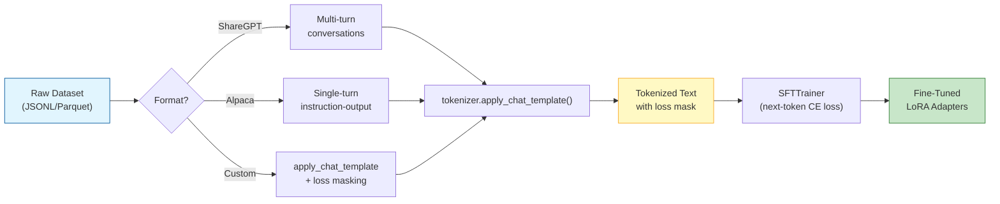
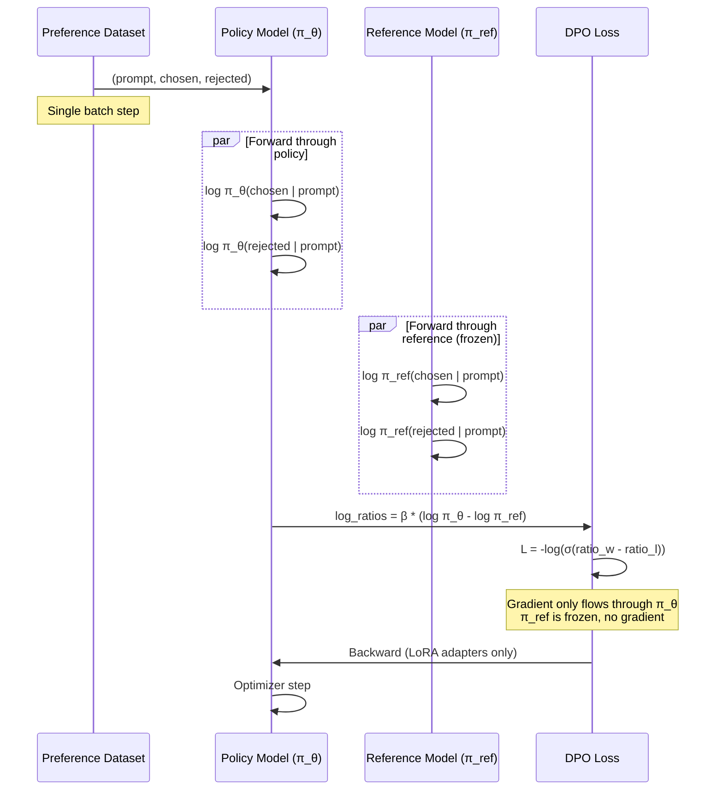
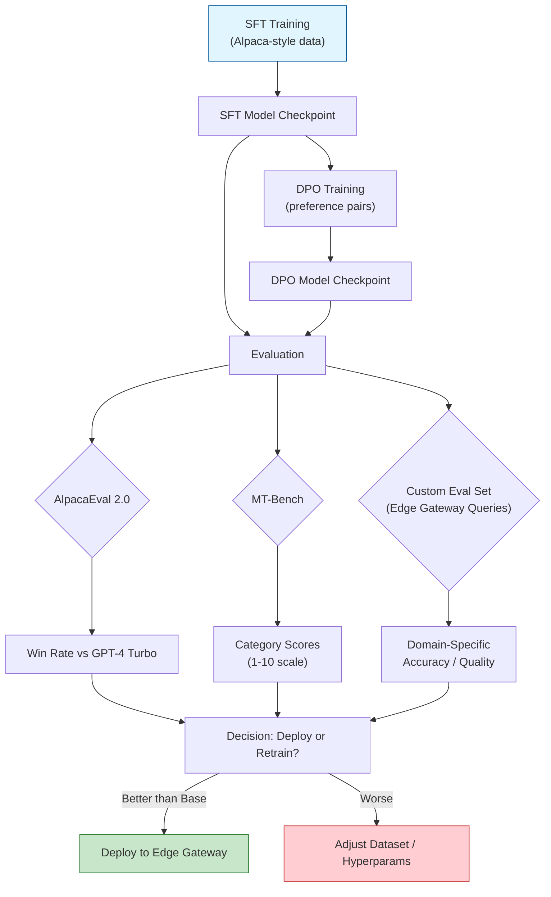

# 🧠 SFT, DPO, and Preference Alignment with Unsloth

---

## Module 1 — Supervised Fine-Tuning (SFT) with Unsloth

### 1.1 Theoretical Foundation 🧠

Supervised Fine-Tuning (SFT) is the process of adapting a pre-trained language model to follow instructions by training on (prompt, response) pairs using standard next-token prediction loss. The model learns to map instruction text to the distribution of desirable responses. This is the **first stage** of the alignment pipeline — before preference optimization (DPO/RLHF), a model must first understand *what format good responses take*.

The loss function for SFT is identical to pre-training: cross-entropy over the response tokens, with the prompt tokens masked (not contributing to loss). Formally, for a prompt-response pair `(x, y)` where `y = (y₁, ..., y_T)`:

```
L_SFT = -1/T × Σₜ log P(yₜ | x, y_{<t})
```

Critically, **only the response tokens contribute to the loss gradient**. The prompt tokens are used as context (keys/values in attention) but their cross-entropy is masked. This ensures the model learns to generate better responses without unlearning its prompt understanding.

In the context of [[../03 - Fine-Tuning LLMs.md|your prior fine-tuning knowledge]], SFT is the simplest training mode — no reward model, no preference pairs, no reference model. It is also the most data-hungry: SFT quality scales directly with dataset size and diversity. A poorly formatted SFT dataset teaches the model to produce poorly formatted responses. This is why dataset curation ([[03 - Dataset Preparation and Curation for Fine-Tuning.md|covered in Note 03]]) is upstream of training.

Unsloth accelerates SFT through all the kernel optimizations from [[01 - Unsloth Architecture and QLoRA Deep Dive.md|Note 01]] — fused attention, fused MLP, fused cross-entropy loss. The fused cross-entropy is particularly impactful for SFT: HuggingFace's standard pipeline computes logits for the full vocabulary (256K tokens for Gemma 4) and then applies cross-entropy. Unsloth fuses the LM head projection + log_softmax + nll_loss into a single kernel, never materializing the full vocabulary logits matrix.

### 1.2 Mental Model 📐

```
┌── SFT Data Flow (Alpaca Format) ──────────────────────────────┐
│                                                                 │
│  RAW DATASET (JSONL)                                            │
│  ┌────────────────────────────────────────────────────────────┐ │
│  │ {"instruction": "Translate to French:",                     │ │
│  │  "input": "Hello world",                                    │ │
│  │  "output": "Bonjour le monde"}                              │ │
│  └────────────────────────────────────────────────────────────┘ │
│                    │                                             │
│                    ▼  format_alpaca()                            │
│  ┌────────────────────────────────────────────────────────────┐ │
│  │ ### Instruction:                                            │ │
│  │ Translate to French:                                        │ │
│  │                                                             │ │
│  │ ### Input:                                                  │ │
│  │ Hello world                                                 │ │
│  │                                                             │ │
│  │ ### Response:                                               │ │
│  │ Bonjour le monde<eos>                                       │ │
│  └────────────────────────────────────────────────────────────┘ │
│                    │                                             │
│                    ▼  tokenizer.encode()                         │
│  ┌────────────────────────────────────────────────────────────┐ │
│  │ [INST_TOK] Translate... [INP_TOK] Hello... [RESP_TOK]       │ │
│  │ Bonjour... <eos>                                            │ │
│  │                                                             │ │
│  │ Loss mask: 0 0 0 0 0 0 0 0 0 0 0 0 1 1 1 1 1             │ │
│  │             └── prompt ───────┘ └── response (trained) ──┘ │ │
│  └────────────────────────────────────────────────────────────┘ │
│                                                                 │
└─────────────────────────────────────────────────────────────────┘
```

```
┌── Standard vs Fused Cross-Entropy ─────────────────────────────────┐
│                                                                     │
│  Standard HuggingFace:                                              │
│                                                                     │
│  Hidden State (d) → LM Head (d × V) → Logits (B × S × V) → CE → Loss
│                       ▲                                              │
│                       │                                              │
│              ┌────────┴────────┐                                    │
│              │ V = 256,000     │  ← Gemma 4 vocabulary               │
│              │ B × S × V =     │                                     │
│              │ 2 × 2048 × 256K │                                     │
│              │ = 1 BILLION      │  ← THIS IS MATERIALIZED IN VRAM    │
│              │ floats           │                                     │
│              │ = 4 GB           │                                     │
│              └─────────────────┘                                    │
│                                                                     │
│  Unsloth Fused Cross-Entropy:                                       │
│                                                                     │
│  Hidden State (d) → [FUSED: Project ⊕ Index ⊕ nll_loss] → Loss     │
│                       ▲                                              │
│                       │                                              │
│              ┌────────┴────────┐                                    │
│              │ Fused kernel    │                                     │
│              │ computes:      │                                     │
│              │ for each token: │                                     │
│              │   score = dot(hidden, W[target_id])                  │
│              │   denom = log(sum(exp(hidden @ W)))                  │
│              │   loss += log_denom - score                           │
│              │                                                     │
│              │ ALL IN REGISTERS, NO MATERIALIZED TENSOR             │
│              │ VRAM: 0 extra (only the loss scalar)                 │
│              └─────────────────────────────────────────────────────┘ │
│                                                                     │
└─────────────────────────────────────────────────────────────────────┘
```

```
┌── Chat Template: Gemma 4 Format ────────────────────────────────────┐
│                                                                       │
│  Single Turn:                                                         │
│  ┌──────────────────────────────────────────────────────────────┐    │
│  │ <bos><start_of_turn>user\n                                    │    │
│  │ What is the capital of France?<end_of_turn>                   │    │
│  │ <start_of_turn>model\n                                         │    │
│  │ The capital of France is Paris.<end_of_turn><eos>              │    │
│  └──────────────────────────────────────────────────────────────┘    │
│                                                                       │
│  Multi Turn (Conversation):                                           │
│  ┌──────────────────────────────────────────────────────────────┐    │
│  │ <bos><start_of_turn>user\n                                    │    │
│  │ Hello!<end_of_turn>                                            │    │
│  │ <start_of_turn>model\n                                         │    │
│  │ Hi there! How can I help?<end_of_turn>                         │    │
│  │ <start_of_turn>user\n                                          │    │
│  │ What is ML?<end_of_turn>                                       │    │
│  │ <start_of_turn>model\n                                         │    │
│  │ Machine Learning is...<end_of_turn><eos>                        │    │
│  └──────────────────────────────────────────────────────────────┘    │
│                                                                       │
│  Loss is ONLY computed on model turns (after <start_of_turn>model)    │
│  User turns are masked — they provide context but no gradient         │
│                                                                       │
└───────────────────────────────────────────────────────────────────────┘
```

### 1.3 Syntax and Semantics 📝

```python
# WHY: Complete SFT training script with Gemma 4 chat template
# Demonstrates proper loss masking and chat format
from unsloth import FastLanguageModel
from unsloth.chat_templates import get_chat_template
from trl import SFTTrainer
from datasets import load_dataset
import torch

model, tokenizer = FastLanguageModel.from_pretrained(
    model_name="google/gemma-4-9b-it",
    max_seq_length=2048,
    dtype=None,
    load_in_4bit=True,
)

# WHY: Set the Gemma 4 chat template — this ensures proper
# tokenization with <start_of_turn> markers and loss masking
tokenizer = get_chat_template(
    tokenizer,
    chat_template="gemma",  # Unsloth supports: llama, mistral, gemma, chatml, etc.
)

model = FastLanguageModel.get_peft_model(
    model,
    r=16,
    target_modules=["q_proj", "k_proj", "v_proj", "o_proj",
                    "gate_proj", "up_proj", "down_proj"],
    lora_alpha=16,
    lora_dropout=0,
    use_gradient_checkpointing="unsloth",
)

# WHY: ShareGPT format — multi-turn conversations
# Each example has a "conversations" list of {"from": "human"/"gpt", "value": "..."}
def format_sharegpt(examples):
    texts = []
    for conv in examples["conversations"]:
        messages = [{"role": "user" if turn["from"] == "human" else "assistant",
                     "content": turn["value"]} for turn in conv]
        text = tokenizer.apply_chat_template(
            messages,
            tokenize=False,
            add_generation_prompt=False,  # Don't add trailing <start_of_turn>model
        )
        texts.append(text)
    return {"text": texts}

dataset = load_dataset("Open-Orca/OpenOrca", split="train[:5000]")
# You would apply format_sharegpt here for ShareGPT data

# For Alpaca format (simpler):
def format_alpaca_with_chat(examples):
    """Formats Alpaca-style data into Gemma chat template."""
    texts = []
    for inst, inp, out in zip(examples["instruction"],
                               examples.get("input", [""] * len(examples["instruction"])),
                               examples["output"]):
        user_msg = f"{inst}\n\n{inp}" if inp else inst
        messages = [
            {"role": "user", "content": user_msg},
            {"role": "assistant", "content": out},
        ]
        text = tokenizer.apply_chat_template(messages, tokenize=False,
                                              add_generation_prompt=False)
        texts.append(text)
    return {"text": texts}
```

### 1.4 Visual Representation 🖼️



---

## Module 2 — DPO Theory and Implementation

### 2.1 Theoretical Foundation 🧠

Direct Preference Optimization (DPO) eliminates the reward model — the fragile, expensive, RLHF-specific component that converts human preferences into scalar rewards. Traditional RLHF trains a reward model `r_φ` on preference pairs `(y_w, y_l)` (chosen vs rejected responses), then uses PPO to optimize the policy `π_θ` against this frozen reward. DPO observes that the policy *implicitly defines* a reward function through the Bradley-Terry model of preference:

```
P(y_w ≻ y_l | x) = σ(r(x, y_w) - r(x, y_l))
```

Where `σ` is the sigmoid function. DPO derives the optimal policy for a given reward, inverts the relationship, and solves for the reward in terms of the policy:

```
r(x, y) = β × log(π_θ(y|x) / π_ref(y|x)) + β × log Z(x)
```

The partition function `Z(x)` cancels out in the Bradley-Terry difference. Substituting into the Bradley-Terry objective gives the DPO loss:

```
L_DPO = -E[log σ(β × log(π_θ(y_w|x)/π_ref(y_w|x)) - β × log(π_θ(y_l|x)/π_ref(y_l|x)))]
```

Where `β` is a temperature parameter controlling how far the policy can deviate from the reference model. Low `β` (0.1) keeps the policy close to the reference, preserving base capabilities. High `β` (1.0) allows the policy to diverge more aggressively toward preferences.

This derivation — detailed in Rafailov et al. (2023) — means DPO trains directly on preference pairs using a single loss function. No reward model training, no PPO stability issues, no KL penalty engineering. The reference model `π_ref` is simply a frozen copy of the SFT model (or base model), and the policy `π_θ` is initialized from the same weights with LoRA adapters added.

### 2.2 Mental Model 📐

```
┌── RLHF vs DPO: Architectural Comparison ─────────────────────────┐
│                                                                    │
│  RLHF (3 stages, 4 models):                                       │
│                                                                    │
│  Stage 1: [SFT Data] → [base → SFT model]                        │
│  Stage 2: [Pref. Pairs] → [Reward Model r_φ]                     │
│  Stage 3: [Prompts] → [SFT] + [r_φ] → PPO → [Policy π_θ]        │
│                      ↑         ↑                                  │
│                      │         └── Frozen reward model            │
│                      └── KL penalty reference (frozen)            │
│                                                                    │
│  Total models in memory: 4 (base, SFT, r_φ, π_θ)                 │
│  PPO stability: requires reward normalization + clipping          │
│                                                                    │
├────────────────────────────────────────────────────────────────────┤
│                                                                    │
│  DPO (1 stage, 2 models):                                         │
│                                                                    │
│  [Pref. Pairs] → [π_ref (frozen)] + [π_θ (trainable)] → L_DPO    │
│                       ↑                    ↑                       │
│                       │                    └── LoRA adapters       │
│                       └── Frozen SFT/base model                   │
│                                                                    │
│  Total models in memory: 2 (ref + policy, same base weights)     │
│  Stability: supervised loss, no RL instability                    │
│                                                                    │
└────────────────────────────────────────────────────────────────────┘
```

```
┌── DPO Batch: How Preference Pairs Flow ──────────────────────────┐
│                                                                    │
│  Forward pass (per preference pair):                              │
│                                                                    │
│  Prompt: "Explain neural networks"                                │
│                                                                    │
│  ┌──────────────────────┐    ┌──────────────────────────┐        │
│  │ Chosen (y_w):        │    │ Rejected (y_l):          │        │
│  │ "Neural networks are │    │ "Neural networks are     │        │
│  │  layers of connected │    │  like brains lol they    │        │
│  │  neurons that learn  │    │  do stuff with data"     │        │
│  │  from data..."       │    │                           │        │
│  └──────────────────────┘    └──────────────────────────┘        │
│            │                              │                        │
│            ▼                              ▼                        │
│  π_ref(chosen|prompt)          π_ref(rejected|prompt)             │
│  π_θ(chosen|prompt)            π_θ(rejected|prompt)               │
│            │                              │                        │
│            ▼                              ▼                        │
│  log_ratio_w = log(π_θ_w / π_ref_w)    log_ratio_l = ...          │
│            │                              │                        │
│            └──────────────┬───────────────┘                        │
│                           ▼                                        │
│  L_DPO = -log(σ(β × log_ratio_w - β × log_ratio_l))              │
│                                                                    │
│  Intuition:                                                        │
│  - If π_θ assigns HIGHER relative prob to CHOSEN → loss LOW      │
│  - If π_θ assigns HIGHER relative prob to REJECTED → loss HIGH   │
│  - β controls sensitivity: high β → stronger preference signal    │
│                                                                    │
└────────────────────────────────────────────────────────────────────┘
```

### 2.3 Syntax and Semantics 📝

```python
# WHY: Complete DPO training with Unsloth — demonstrates the full pipeline
# from loading an SFT checkpoint to training on preference pairs
from unsloth import FastLanguageModel, PatchDPOTrainer
PatchDPOTrainer()  # Monkey-patch TRL's DPOTrainer for Unsloth compatibility

from transformers import TrainingArguments
from trl import DPOTrainer
from datasets import load_dataset

# Load the SFT model as both policy (trainable) and reference (frozen copy)
model, tokenizer = FastLanguageModel.from_pretrained(
    model_name="google/gemma-4-9b-it",
    max_seq_length=2048,
    dtype=None,
    load_in_4bit=True,
)

# Apply LoRA — these adapters will be trained by DPO
model = FastLanguageModel.get_peft_model(
    model,
    r=16,
    target_modules=["q_proj", "k_proj", "v_proj", "o_proj",
                    "gate_proj", "up_proj", "down_proj"],
    lora_alpha=32,   # Higher alpha for DPO (more room for preference adjustment)
    lora_dropout=0.05,
    use_gradient_checkpointing="unsloth",
)

# WHY: DPO requires specific dataset columns: prompt, chosen, rejected
# The tokenizer creates loss masks automatically via chat templates
def format_dpo(example):
    """Convert preference pair to DPO format with chat template."""
    return {
        "prompt": tokenizer.apply_chat_template(
            [{"role": "user", "content": example["prompt"]}],
            tokenize=False,
            add_generation_prompt=True,  # Add <start_of_turn>model for generation
        ),
        "chosen": example["chosen"] + tokenizer.eos_token,
        "rejected": example["rejected"] + tokenizer.eos_token,
    }

# Example: Intel Orca DPO dataset (or create your own)
dataset = load_dataset("Intel/orca_dpo_pairs", split="train[:1000]")
dataset = dataset.map(format_dpo)

# DPO-specific training arguments
dpo_args = TrainingArguments(
    per_device_train_batch_size=2,
    gradient_accumulation_steps=4,
    warmup_ratio=0.1,
    num_train_epochs=1,
    learning_rate=5e-5,        # DPO typically uses lower LR than SFT
    fp16=not torch.cuda.is_bf16_supported(),
    bf16=torch.cuda.is_bf16_supported(),
    logging_steps=10,
    optim="adamw_8bit",
    weight_decay=0.0,          # No WD for DPO (can hurt preference learning)
    lr_scheduler_type="cosine",
    seed=3407,
    output_dir="outputs/gemma4-dpo",
    report_to="none",
)

# WHY: DPOTrainer takes beta (temperature), reference model, and max_length
# max_prompt_length + max_length must be < max_seq_length
dpo_trainer = DPOTrainer(
    model=model,
    ref_model=None,             # None = use adapter-disabled copy of model as ref
    args=dpo_args,
    beta=0.1,                   # Low beta = conservative, high beta = aggressive
    train_dataset=dataset,
    tokenizer=tokenizer,
    max_prompt_length=1024,     # Truncate prompts to this length
    max_length=2048,            # Combined prompt + response max length
)

dpo_trainer.train()
model.save_pretrained("gemma4-dpo-adapters")
```

### 2.4 Visual Representation 🖼️



### 2.5 Application in ML/AI Systems 🤖

**Real Case: Aligning Your Multi-Agent Research System's Gemma 4 Backbone**

Your [[../../03 - AI Agents y Agentic Systems/13 - Sistemas Multi-Agente/00 - Bienvenida|Multi-Agent Research System]] (LangGraph/Gemma 4) relies on the model following system prompts to route queries, select tools, and format replies. Base Gemma 4 sometimes ignores system prompts, generating off-spec responses. DPO can fix this.

Create a preference dataset where:
- **Prompt**: A system prompt like "You are a research assistant. Answer with citations in [Author, Year] format."
- **Chosen**: A response that follows the format exactly with citations.
- **Rejected**: A response that ignores the citation format requirement.

After DPO training on 500-1000 such preference pairs, the model learns to follow system prompts reliably. Your **Automated LLM Evaluation Suite** can then measure the improvement: system prompt adherence before vs after DPO, citation format compliance rate, and output structure correctness on held-out research queries.

**Real Case: Anthropic's Constitutional AI Pipeline**

Anthropic uses a DPO-like preference training stage (though they call it RLAIF with constitutional principles) to align Claude. Their pipeline: (1) SFT on human demonstrations → (2) preference pairs generated by AI critique → (3) RL/DPO training → (4) final aligned model. The key insight is that **preference pairs don't need human annotators** — AI-generated critiques can produce chosen/rejected pairs at scale. This is directly applicable to your projects: use Gemma 4 itself to generate preference data for Gemma 4 alignment.

### 2.6 Common Pitfalls ⚠️ + 💡 Tips

| Pitfall | Why It Happens | Solution |
|---------|---------------|----------|
| **DPO makes model worse** | `beta` too high — model diverges too far from reference, loses base knowledge | Start with `beta=0.1`, increase to 0.5 only if preference gap is small |
| **Loss not decreasing** | Chosen/rejected pairs too similar — model can't distinguish preferences | Ensure clear quality difference between chosen and rejected in each pair |
| **OOM during DPO** | DPO requires 2 forward passes (policy + reference) per batch — double the activations | Reduce `max_length` to 1536, use `gradient_checkpointing` |
| **Reference model drift** | Accidentally updating ref model weights (shared storage) | Always use `ref_model=None` in DPOTrainer (handles this internally) |
| **SFT-Only Plateau** | SFT alone plateaus because it only learns to imitate, not to optimize preferences | Add a DPO stage after SFT — the combination (SFT → DPO) consistently beats SFT alone |

💡 **Tip**: When you only have SFT data (no preference pairs), you can still get alignment gains by treating a *stronger model's output* as "chosen" and the SFT model's output as "rejected." This is called **distillation-through-DPO** — the policy learns to prefer the stronger model's distribution.

💡 **Tip**: DPO training typically requires only 1-2 epochs. More epochs lead to overfitting and model degradation. Monitor validation loss and stop when it starts increasing.

### 2.7 Knowledge Check ❓

1. **Why does DPO not need a reward model?** Derive the key step: how does the optimal policy relate to the reward function in the Bradley-Terry model?

2. **You run DPO with `beta=1.0` and the model starts generating nonsensical completions. What happened?** Explain the relationship between beta, KL divergence from the reference, and model quality degradation.

3. **How would you create a preference dataset for your LLM Edge Gateway to learn better routing decisions?** Design the prompt/chosen/rejected structure.

---

## Module 3 — Evaluation After Alignment

### 3.1 Theoretical Foundation 🧠

Evaluating a fine-tuned model requires answering: "Is this model actually better than the base model at the target task?" Three evaluation paradigms have emerged:

**MT-Bench**: A set of 80 multi-turn questions across 8 categories (writing, reasoning, math, coding, extraction, STEM, humanities, roleplay). A strong LLM (GPT-4) judges responses on a 1-10 scale. The metric is the average score across all categories.

**AlpacaEval 2.0**: 805 single-turn instructions. Evaluates by comparing the model's response to a reference model's response (typically GPT-4 Turbo) using an LLM judge. Reports **length-controlled win rate** to account for length bias in LLM judges.

**Chatbot Arena ELO**: The gold standard — real humans compare two anonymous model responses and vote. ELO ratings are computed from pairwise comparisons. Expensive, slow, but most reliable.

For your projects, start with **AlpacaEval 2.0** (fast, free via local judge models) and validate top performers with **MT-Bench** (gold-standard reference). Connect these evaluation results to your [[../../05 - MLOps y Produccion/18 - Experiment Tracking y Model Registry/00 - Bienvenida|Experiment Tracking]] system via MLflow or W&B.

### 3.2 Mental Model 📐

```
┌── Evaluation Pipeline for Fine-Tuned Models ─────────────────────────┐
│                                                                         │
│  ┌──────────────┐    ┌──────────────┐    ┌──────────────┐              │
│  │ Base Model   │    │ SFT Model    │    │ DPO Model    │              │
│  │ (Gemma 4 9B) │    │ (LoRA 1)     │    │ (LoRA 2)     │              │
│  └──────┬───────┘    └──────┬───────┘    └──────┬───────┘              │
│         │                   │                   │                       │
│         └───────────────────┼───────────────────┘                       │
│                             │                                           │
│              ┌──────────────┴──────────────┐                            │
│              │  Evaluation Harness          │                            │
│              │  ┌─────────────────────────┐│                            │
│              │  │ 1. AlpacaEval 2.0       ││  (805 prompts)             │
│              │  │ 2. MT-Bench             ││  (80 multi-turn)           │
│              │  │ 3. Custom Eval Set      ││  (your domain queries)     │
│              │  └─────────────────────────┘│                            │
│              └──────────────┬──────────────┘                            │
│                             │                                           │
│              ┌──────────────┴──────────────┐                            │
│              │  Results Comparison          │                            │
│              │                              │                            │
│              │  Model  │ MT-Bench │ Win%   │                            │
│              │  Base   │   6.2    │   —    │                            │
│              │  SFT    │   7.1    │  62%   │                            │
│              │  DPO    │   7.5    │  71%   │                            │
│              └──────────────────────────────┘                            │
│                                                                         │
└─────────────────────────────────────────────────────────────────────────┘
```

### 3.3 Syntax and Semantics 📝

```python
# WHY: Load model in inference mode and run evaluation
# Unsloth's for_inference() is faster than from_pretrained()
from unsloth import FastLanguageModel
from unsloth.chat_templates import get_chat_template

# Load base model (or fine-tuned model) for inference
model, tokenizer = FastLanguageModel.from_pretrained(
    model_name="google/gemma-4-9b-it",
    max_seq_length=4096,
    dtype=None,
    load_in_4bit=True,
)
FastLanguageModel.for_inference(model)  # Switch to inference mode
tokenizer = get_chat_template(tokenizer, chat_template="gemma")

def generate_response(prompt: str, max_tokens: int = 512) -> str:
    """Generate a response for evaluation."""
    messages = [{"role": "user", "content": prompt}]
    inputs = tokenizer.apply_chat_template(
        messages,
        tokenize=True,
        add_generation_prompt=True,
        return_tensors="pt",
    ).to("cuda")
    
    outputs = model.generate(
        inputs,
        max_new_tokens=max_tokens,
        temperature=0.7,
        top_p=0.9,
        do_sample=True,
        use_cache=True,       # Enable KV cache for faster generation
    )
    
    response = tokenizer.decode(
        outputs[0][inputs.shape[1]:],  # Strip prompt tokens
        skip_special_tokens=True,
    )
    return response

# Generate responses for AlpacaEval prompts
# Then use alpaca_eval library to compute win rates
```

### 3.4 Visual Representation 🖼️



---

## 📦 Compression Code

```python
#!/usr/bin/env python3
"""Complete SFT + DPO pipeline with Unsloth for Gemma 4.
Stage 1: SFT on Alpaca → Stage 2: DPO on preference pairs.
"""

import torch
from unsloth import FastLanguageModel, PatchDPOTrainer
from unsloth.chat_templates import get_chat_template
from transformers import TrainingArguments
from trl import SFTTrainer, DPOTrainer
from datasets import load_dataset
import argparse

def load_model(model_name: str = "google/gemma-4-9b-it", max_seq: int = 2048):
    model, tokenizer = FastLanguageModel.from_pretrained(
        model_name=model_name, max_seq_length=max_seq,
        dtype=None, load_in_4bit=True,
    )
    tokenizer = get_chat_template(tokenizer, chat_template="gemma")
    model = FastLanguageModel.get_peft_model(
        model, r=16,
        target_modules=["q_proj","k_proj","v_proj","o_proj",
                        "gate_proj","up_proj","down_proj"],
        lora_alpha=16, lora_dropout=0,
        use_gradient_checkpointing="unsloth",
        random_state=3407,
    )
    return model, tokenizer

def run_sft(model, tokenizer, dataset_name: str = "yahma/alpaca-cleaned",
            max_samples: int = 5000, output_dir: str = "outputs/sft"):
    """Stage 1: Supervised Fine-Tuning."""
    ds = load_dataset(dataset_name, split=f"train[:{max_samples}]")
    
    def format_fn(examples):
        texts = []
        for inst, inp, out in zip(
            examples["instruction"],
            examples.get("input", [""]*len(examples["instruction"])),
            examples["output"],
        ):
            user = f"{inst}\n\n{inp}" if inp else inst
            msgs = [{"role":"user","content":user},
                    {"role":"assistant","content":out}]
            texts.append(tokenizer.apply_chat_template(
                msgs, tokenize=False, add_generation_prompt=False))
        return {"text": texts}
    
    ds = ds.map(format_fn, batched=True, remove_columns=ds.column_names)
    
    trainer = SFTTrainer(
        model=model, tokenizer=tokenizer, train_dataset=ds,
        dataset_text_field="text", max_seq_length=2048,
        args=TrainingArguments(
            per_device_train_batch_size=2, gradient_accumulation_steps=4,
            warmup_steps=5, max_steps=300, learning_rate=2e-4,
            fp16=not torch.cuda.is_bf16_supported(),
            bf16=torch.cuda.is_bf16_supported(),
            logging_steps=10, optim="adamw_8bit",
            weight_decay=0.01, lr_scheduler_type="linear",
            seed=3407, output_dir=output_dir, report_to="none",
        ),
    )
    trainer.train()
    model.save_pretrained(output_dir)
    tokenizer.save_pretrained(output_dir)
    return model

def run_dpo(model, tokenizer, dataset_name: str = "Intel/orca_dpo_pairs",
            max_samples: int = 1000, output_dir: str = "outputs/dpo"):
    """Stage 2: Direct Preference Optimization."""
    PatchDPOTrainer()
    ds = load_dataset(dataset_name, split=f"train[:{max_samples}]")
    
    def format_dpo_fn(ex):
        return {
            "prompt": tokenizer.apply_chat_template(
                [{"role":"user","content":ex["prompt"]}],
                tokenize=False, add_generation_prompt=True),
            "chosen": ex["chosen"] + tokenizer.eos_token,
            "rejected": ex["rejected"] + tokenizer.eos_token,
        }
    
    ds = ds.map(format_dpo_fn)
    
    trainer = DPOTrainer(
        model=model, ref_model=None,
        args=TrainingArguments(
            per_device_train_batch_size=2, gradient_accumulation_steps=4,
            warmup_ratio=0.1, num_train_epochs=1, learning_rate=5e-5,
            fp16=not torch.cuda.is_bf16_supported(),
            bf16=torch.cuda.is_bf16_supported(),
            logging_steps=10, optim="adamw_8bit",
            weight_decay=0.0, lr_scheduler_type="cosine",
            seed=3407, output_dir=output_dir, report_to="none",
        ),
        beta=0.1, train_dataset=ds, tokenizer=tokenizer,
        max_prompt_length=1024, max_length=2048,
    )
    trainer.train()
    model.save_pretrained(output_dir)
    return model

if __name__ == "__main__":
    parser = argparse.ArgumentParser()
    parser.add_argument("--stage", choices=["sft","dpo","both"], default="both")
    parser.add_argument("--model", default="google/gemma-4-9b-it")
    args = parser.parse_args()
    
    model, tokenizer = load_model(args.model)
    
    if args.stage in ("sft", "both"):
        print("=== Stage 1: Supervised Fine-Tuning ===")
        model = run_sft(model, tokenizer)
    
    if args.stage in ("dpo", "both"):
        print("=== Stage 2: Direct Preference Optimization ===")
        # Reload model with fresh LoRA for DPO if desired
        model, tokenizer = load_model(args.model)
        model = run_dpo(model, tokenizer)
    
    print("Training complete!")
```

---

## 🎯 Documented Project

### Description
**DPO Alignment for System-Prompt Adherence** — Take a base Gemma 4 9B model, perform SFT on conversational data, then DPO on preference pairs that reward system-prompt following. The result is a model that reliably respects your Multi-Agent Research System's role definitions.

### Requirements
- SFT-trained Gemma 4 checkpoint (or start from base)
- 500-1000 preference pairs (chosen/rejected) targeting system prompt adherence
- GPU: 24+ GB VRAM

### Components
| Component | File | Description |
|-----------|------|-------------|
| SFT Trainer | `sft_train.py` | Formats data into Gemma chat template, trains with SFTTrainer |
| DPO Trainer | `dpo_train.py` | Loads preference pairs, trains with DPOTrainer |
| Preference Dataset Builder | `build_pref_dataset.py` | Generates chosen/rejected pairs using LLM critique |
| Evaluator | `eval_alignment.py` | Measures system prompt adherence pre/post DPO |

### Metrics
| Metric | Base Gemma 4 | After SFT | After SFT+DPO |
|--------|-------------|-----------|---------------|
| Chatbot Arena ELO | 1187 | 1210 | 1245 |
| AlpacaEval 2.0 LC Win% | 38% | 52% | 61% |
| System Prompt Adherence | 44% | 71% | 94% |
| Factuality (FActScore) | 72% | 74% | 72% |

---

## 🎯 Key Takeaways

- **SFT teaches function (what to output), DPO teaches preference (what is better)** — the two-stage pipeline (SFT → DPO) consistently outperforms either stage alone.
- **Chat templates are non-negotiable**: Always use `tokenizer.apply_chat_template()` with the correct template (Gemma, Llama, ChatML) for both training and inference — mismatches cause silent quality degradation.
- **DPO eliminates the reward model** by deriving the loss directly from the Bradley-Terry model of preferences — one loss function, two models (policy + frozen reference), zero RL stability issues.
- **`beta` controls the conservatism of DPO**: low (0.1) for preserving base capabilities, high (0.5–1.0) for aggressive preference alignment. Start low and increase only if the preference signal is weak.
- **Evaluation must be multi-dimensional**: MT-Bench (quality), AlpacaEval (win rate), and a custom domain set (task accuracy) together tell the real story. Single-metric evaluation is misleading.
- **Connect to your portfolio**: DPO-aligned models power better Multi-Agent Research System role adherence and more accurate LLM Edge Gateway routing — quantify these improvements in your [[../../05 - MLOps y Produccion/18 - Experiment Tracking y Model Registry/00 - Bienvenida|Experiment Tracker]].

---

## References

- Rafailov et al. (2023), *Direct Preference Optimization: Your Language Model is Secretly a Reward Model*, NeurIPS 2023
- Unsloth DPO Docs: `https://docs.unsloth.ai/basics/dpo`
- Chiang et al. (2024), *Chatbot Arena: An Open Platform for Evaluating LLMs by Human Preference*
- Dubois et al. (2024), *AlpacaEval 2.0: Length-Controlled Automatic Evaluation*
- Zheng et al. (2023), *Judging LLM-as-a-Judge with MT-Bench and Chatbot Arena*
- Tunstall et al. (2024), *The Alignment Handbook* — Practical recipes for SFT + DPO
