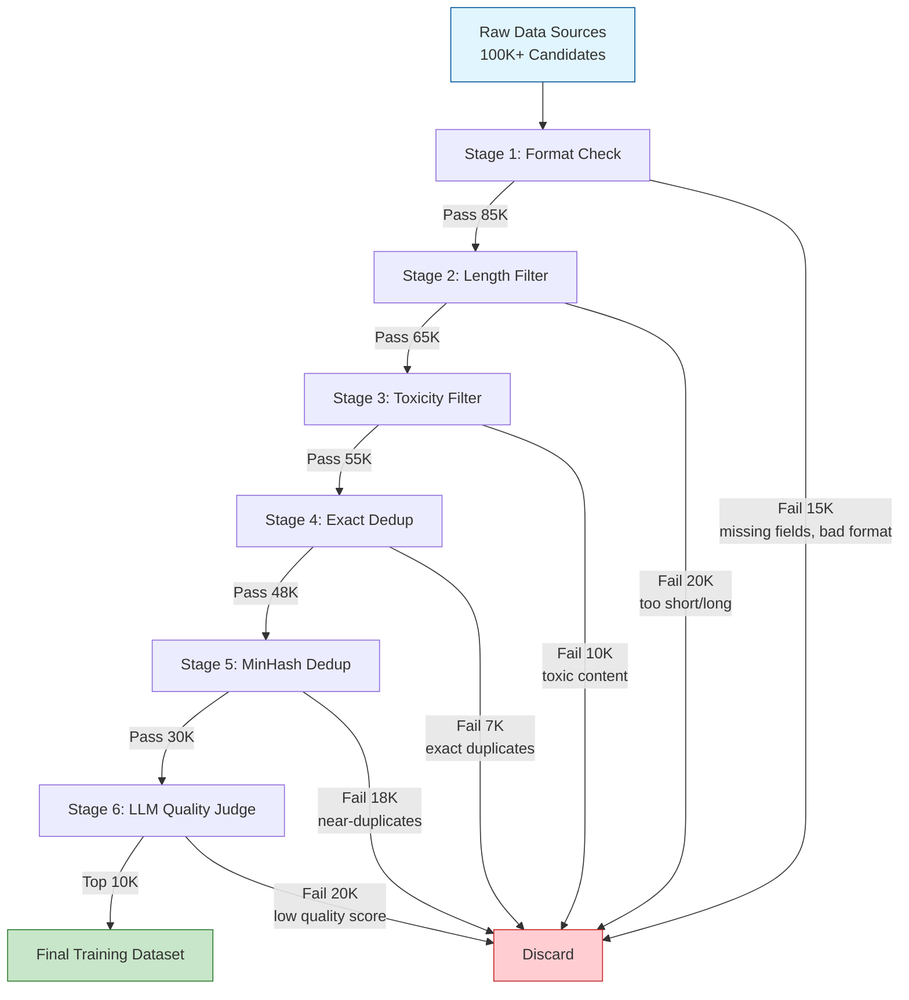
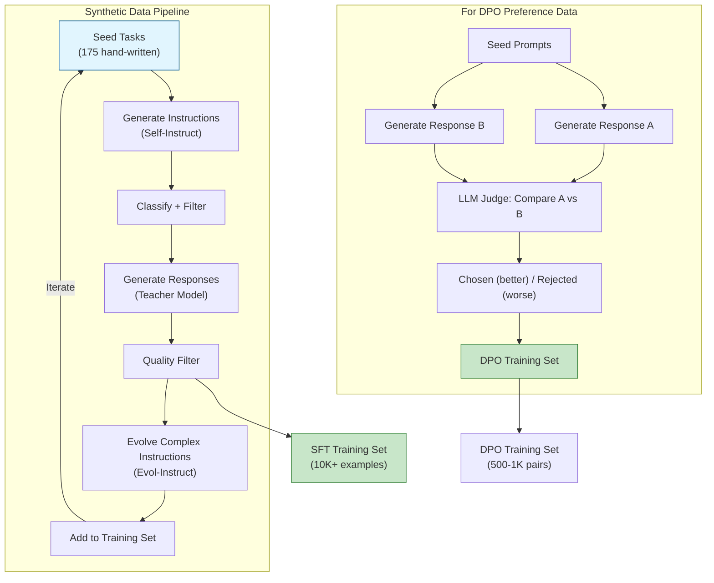
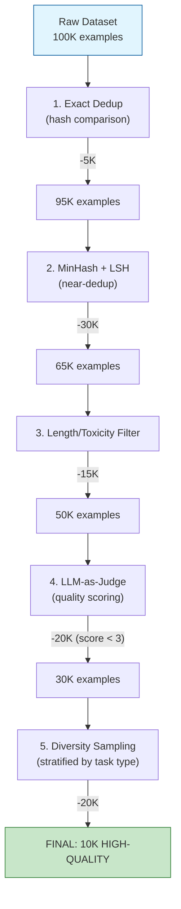

# 📊 Dataset Preparation and Curation for Fine-Tuning

---

## Module 1 — Dataset Quality Theory

### 1.1 Theoretical Foundation 🧠

The saying "garbage in, garbage out" is more literal in fine-tuning than anywhere else in ML. A language model trained on 1,000 high-quality diverse examples routinely outperforms the same model trained on 50,000 noisy, redundant, or misaligned examples. This is because the model's next-token prediction loss optimizes for the distribution of the training data — if 60% of your dataset contains grammar errors, the model learns to produce grammar errors. If 80% of examples are about coding, the model forgets how to write essays.

Three properties define dataset quality for fine-tuning: **diversity** (coverage of the intended downstream distribution), **correctness** (factual accuracy and formatting consistency of responses), and **difficulty** (examples should be challenging enough to teach the model something new, not trivially answered from pre-training). Research from Touvron et al. (2023) in the Llama-2 paper shows that even a few thousand high-quality SFT examples can dramatically improve helpfulness when curated using these criteria.

The foundational paper on data quality for instruction tuning is Zhou et al. (2023), "LIMA: Less Is More for Alignment." They demonstrated that a Llama model fine-tuned on only **1,000 carefully curated examples** produced outputs preferred by human evaluators over models trained on 52,000 Alpaca examples. The LIMA dataset prioritized: diverse task types (brainstorming, editing, coding, Q&A), high-quality human-written responses, and uniform coverage across difficulty levels.

This module connects to your [[../../07 - Research y Ciencia de Datos/28 - ETL y Data Engineering/00 - Bienvenida|Data Engineering knowledge]] — dataset curation is an ETL problem. You extract from sources (model outputs, human annotations, existing datasets), transform (format, filter, deduplicate), and load (into training-ready formats).

### 1.2 Mental Model 📐

```
┌── Ideal Dataset Composition (10K examples) ────────────────────────┐
│                                                                       │
│  ┌────────────────────────────────────────────────────────────────┐  │
│  │  Task Diversity (what the model should DO):                    │  │
│  │                                                                │  │
│  │  Coding (20%)  ████████                                       │  │
│  │  Writing (15%) ██████                                         │  │
│  │  Q&A     (15%) ██████                                         │  │
│  │  Summarization (10%) ████                                     │  │
│  │  Math/Reasoning (10%) ████                                    │  │
│  │  Creative (10%) ████                                          │  │
│  │  Extraction (10%) ████                                        │  │
│  │  Classification (10%) ████                                    │  │
│  └────────────────────────────────────────────────────────────────┘  │
│                                                                       │
│  ┌────────────────────────────────────────────────────────────────┐  │
│  │  Difficulty Distribution:                                       │  │
│  │                                                                │  │
│  │  Easy (30%)    ████████████   ← Baseline: the model should     │  │
│  │  Medium (50%)  ████████████████████ ← Core training signal     │  │
│  │  Hard (20%)    ████████       ← Pushes model capability        │  │
│  └────────────────────────────────────────────────────────────────┘  │
│                                                                       │
│  ┌────────────────────────────────────────────────────────────────┐  │
│  │  Response Length Distribution:                                  │  │
│  │                                                                │  │
│  │  Short (<200 tokens)     ████████████████     40%              │  │
│  │  Medium (200-800 tokens) ████████████████     40%              │  │
│  │  Long (>800 tokens)      ████████             20%              │  │
│  └────────────────────────────────────────────────────────────────┘  │
│                                                                       │
└───────────────────────────────────────────────────────────────────────┘
```

```
┌── The Noise Problem: How Bad Data Poisons Training ──────────────────┐
│                                                                         │
│  CLEAN DATASET (1K examples):                                          │
│                                                                         │
│  ┌─────────────────────────────────────────────────────────────────┐   │
│  │ Loss curve: smooth descent → convergence                         │   │
│  │ ▓▓▓▓▓▓▓▓▓▓▓▓▓▓▓▓▓░░░░░░░░░░░░░░░░░░░░░░░░░░░░░░░░░░░░░░░░░░    │   │
│  │ Validation: improves monotonically                               │   │
│  └─────────────────────────────────────────────────────────────────┘   │
│                                                                         │
│  NOISY DATASET (20% bad examples):                                     │
│                                                                         │
│  ┌─────────────────────────────────────────────────────────────────┐   │
│  │ Loss curve: oscillates, noisy gradients, plateaus early          │   │
│  │ ▓▓▓░▓░▓▓░▓▓▓░▓░▓▓▓░░░░▓░░░░▓░░░░░░▓░░░░░░░░░░░░░░░░░░░░░░░    │   │
│  │ Validation: fluctuates, sometimes drops below baseline           │   │
│  └─────────────────────────────────────────────────────────────────┘   │
│                                                                         │
│  What happens to the model:                                            │
│                                                                         │
│  ┌────────────────────────┐    ┌─────────────────────────────┐        │
│  │ Bad example:           │    │ Model learns:               │        │
│  │ "Tell me about cats"   │    │ "Cats are reptiles" (wrong) │        │
│  │ → "Cats are reptiles"  │    │                             │        │
│  └────────────────────────┘    └─────────────────────────────┘        │
│                                                                         │
│  ┌────────────────────────┐    ┌─────────────────────────────┐        │
│  │ Bad example:           │    │ Model learns:               │        │
│  │ "Write code for sort"  │    │ To produce uncommented,      │        │
│  │ → uncommented, messy   │    │ messy code as the norm      │        │
│  │    code                 │    │                             │        │
│  └────────────────────────┘    └─────────────────────────────┘        │
│                                                                         │
└─────────────────────────────────────────────────────────────────────────┘
```

```
┌── Data Curation Pipeline ────────────────────────────────────────────┐
│                                                                         │
│  ┌──────────┐   ┌──────────┐   ┌──────────┐   ┌──────────┐            │
│  │  SOURCE   │   │  FILTER  │   │ DEDUP   │   │ VALIDATE │            │
│  │           │   │           │   │          │   │          │            │
│  │ APIs      │──►│ Length    │──►│ MinHash  │──►│ LLM Judge│──► Train  │
│  │ Humans    │   │ Toxicity  │   │ LSH      │   │ Format   │           │
│  │ Synthetic │   │ Language  │   │ Exact    │   │ Factuality│           │
│  │ Existing  │   │ Difficulty│   │          │   │ (optional)│           │
│  └──────────┘   └──────────┘   └──────────┘   └──────────┘            │
│                                                                         │
│  Each stage reduces dataset size:                                       │
│  Source (100K) → Filter (80K) → Dedup (45K) → Validate → Train (30K)   │
│                                                                         │
│  The goal is NOT maximum data — it is maximum SIGNAL per example.       │
│                                                                         │
└─────────────────────────────────────────────────────────────────────────┘
```

### 1.3 Syntax and Semantics 📝

```python
# WHY: Implementing data quality filters — the critical step BEFORE training
import json
from typing import List, Dict, Any
from collections import Counter

def filter_by_length(examples: List[Dict], min_response_tokens: int = 50,
                     max_response_tokens: int = 2048, max_instruction_tokens: int = 1024) -> List[Dict]:
    """Remove examples with responses that are too short (no substance) or too long (truncation)."""
    filtered = []
    for ex in examples:
        response_len = len(ex["output"].split())
        instruction_len = len(ex["instruction"].split())
        if min_response_tokens <= response_len <= max_response_tokens and \
           instruction_len <= max_instruction_tokens:
            filtered.append(ex)
    return filtered

def filter_by_toxicity(examples: List[Dict], toxic_phrases: List[str]) -> List[Dict]:
    """Remove examples containing known toxic or harmful content.
    WHY: Toxicity in training data directly teaches the model to produce toxic outputs."""
    filtered = []
    for ex in examples:
        combined = f"{ex['instruction']} {ex.get('input','')} {ex['output']}".lower()
        if not any(phrase.lower() in combined for phrase in toxic_phrases):
            filtered.append(ex)
    return filtered

def check_format_consistency(examples: List[Dict]) -> Dict[str, int]:
    """Detect format issues: missing fields, empty strings, non-ASCII garbage.
    WHY: Inconsistent formatting confuses the tokenizer and produces noisy gradients."""
    issues = Counter()
    for ex in examples:
        if not ex.get("instruction") or not isinstance(ex["instruction"], str):
            issues["missing_instruction"] += 1
        if not ex.get("output") or not isinstance(ex["output"], str):
            issues["missing_output"] += 1
        if len(ex["output"].strip()) < 10:
            issues["too_short_output"] += 1
        # Check for excessive Unicode/formatting artifacts
        if "\\n" not in ex["output"] and "\n" in ex["output"]:
            issues["mixed_newline_styles"] += 1
    return dict(issues)

# Blocklist of high-quality datasets to START from before synthetic generation:
# - OpenAssistant/oasst1 (human-annotated, multi-turn, multi-lingual)
# - tatsu-lab/alpaca (GPT-3.5 generated, 52K examples)
# - databricks/databricks-dolly-15k (human-written, diverse tasks)
# - Open-Orca/OpenOrca (augmented Flan collection, million-scale)
```

### 1.4 Visual Representation 🖼️



---

## Module 2 — Synthetic Data Generation

### 2.1 Theoretical Foundation 🧠

Synthetic data generation is the most scalable approach to building fine-tuning datasets when human annotation is expensive or unavailable. The core insight — from the Self-Instruct paper (Wang et al., 2022) — is that a capable LLM can generate **training data for a weaker LLM** through structured prompting. This creates a virtuous cycle: use your best available model (Gemma 4 27B, Claude, GPT-4) to generate thousands of diverse instruction-response pairs, then fine-tune a smaller or equal-capability model on them.

Three major paradigms exist:

**Self-Instruct**: Start with a small set of human-written seed tasks (175 in the original paper). The LLM generates new tasks, classifies them, generates responses, and filters — iteratively building a dataset. The key is the **task diversity mechanism**: the LLM is prompted to generate tasks that are "different from the examples shown."

**Evol-Instruct** (WizardLM): Start with existing instructions and ask the LLM to "evolve" them — making them more complex, adding constraints, increasing reasoning depth. This produces **harder examples** from simple seeds, improving model capability on complex reasoning.

**Constitutional / Critique-based**: Generate a response, then have the LLM critique and rewrite it. The rewritten version becomes the "chosen" example; the original is "rejected." This creates **preference pairs for DPO** automatically.

For your projects: use Gemma 4 27B (or a cloud-hosted larger model) to generate synthetic data for fine-tuning Gemma 4 9B. The 27B model produces higher-quality output than 9B can, so the 9B model learns from a stronger teacher — **knowledge distillation through data generation**. This pattern mirrors the multi-agent architecture you built in [[../../03 - AI Agents y Agentic Systems/13 - Sistemas Multi-Agente/00 - Bienvenida|the Multi-Agent Research System]]: a stronger model (research agent) generates content, a critic (judge) evaluates it, and the final output trains the deployment model. Connect this pipeline to your [[../../05 - MLOps y Produccion/18 - Experiment Tracking y Model Registry/00 - Bienvenida|Experiment Tracking]] system to log dataset versions alongside model metrics.

### 2.2 Mental Model 📐

```
┌── Self-Instruct Generation Pipeline ───────────────────────────────────┐
│                                                                           │
│  STEP 1: Seed Pool (175 hand-written tasks)                             │
│  ┌────────────────────────────────────────────────────────────────────┐ │
│  │ Task: "Classify sentiment" │ Task: "Summarize article"            │ │
│  │ Task: "Write Python func"  │ Task: "Explain concept"              │ │
│  │ ...                         │ ...                                  │ │
│  └────────────────────────────────────────────────────────────────────┘ │
│                      │                                                    │
│                      ▼                                                    │
│  STEP 2: Generate NEW instructions (sample 8 seeds as few-shot)         │
│  ┌────────────────────────────────────────────────────────────────────┐ │
│  │ Prompt: "Generate 20 diverse tasks. They should be different       │ │
│  │ from: [8 seed examples]. Output as JSON list."                      │ │
│  │                                                                    │ │
│  │ Output:                                                            │ │
│  │ [{"instruction": "Translate to German...",                         │ │
│  │   "input": "Hello", "output": "Hallo"}, ...]                       │ │
│  └────────────────────────────────────────────────────────────────────┘ │
│                      │                                                    │
│                      ▼                                                    │
│  STEP 3: Classify (is this instruction valid and distinct?)              │
│  ┌────────────────────────────────────────────────────────────────────┐ │
│  │ "Translate to German" → VALID (language task)                      │ │
│  │ "asdfghjkl"           → INVALID (nonsense) — discard               │ │
│  └────────────────────────────────────────────────────────────────────┘ │
│                      │                                                    │
│                      ▼                                                    │
│  STEP 4: Generate response for each instruction                         │
│  ┌────────────────────────────────────────────────────────────────────┐ │
│  │ Instruction: "Explain backpropagation in simple terms"              │ │
│  │ Generated: "Backpropagation is like learning from mistakes..."      │ │
│  └────────────────────────────────────────────────────────────────────┘ │
│                      │                                                    │
│                      ▼                                                    │
│  STEP 5: Filter (quality check)                                         │
│  ┌────────────────────────────────────────────────────────────────────┐ │
│  │ Remove: too short (<50 words), duplicates, empty outputs           │ │
│  └────────────────────────────────────────────────────────────────────┘ │
│                      │                                                    │
│                      ▼                                                    │
│  STEP 6: Add to seed pool → iterate (generate more diversity)           │
│                                                                           │
└───────────────────────────────────────────────────────────────────────────┘
```

```
┌── Evol-Instruct: Making Easy Tasks Harder ──────────────────────────────┐
│                                                                            │
│  Seed instruction:                                                        │
│  ┌──────────────────────────────────────────────────────────────┐        │
│  │ "What is a linked list?"                                      │        │
│  └──────────────────────────────────────────────────────────────┘        │
│                    │                                                       │
│                    ▼  "Evolve: add constraints"                           │
│  ┌──────────────────────────────────────────────────────────────┐        │
│  │ "What is a linked list? Explain with:                         │        │
│  │  1. A real-world analogy                                      │        │
│  │  2. A Python implementation showing insertion and deletion     │        │
│  │  3. A comparison to arrays (time complexity table)"            │        │
│  └──────────────────────────────────────────────────────────────┘        │
│                                                                            │
│  Evolution types:                                                         │
│  ├── Add Constraints: "Answer in under 50 words", "Use a table"          │
│  ├── Deepening: "Explain the intuition behind...", "Prove why..."        │
│  ├── Concretizing: "Show with a specific example from...", "Code in..."  │
│  ├── Increase Reasoning: "Compare and contrast...", "Analyze tradeoffs"  │
│  └── Add Complexity: "Solve both parts A and B", "Consider edge cases"  │
│                                                                            │
└────────────────────────────────────────────────────────────────────────────┘
```

### 2.3 Syntax and Semantics 📝

```python
# WHY: Complete synthetic data generation using Gemma 4 as the generator
import json
import random
from typing import List, Dict
from unsloth import FastLanguageModel
from unsloth.chat_templates import get_chat_template

# Load the generator model (Gemma 4 27B — stronger teacher)
generator, gen_tokenizer = FastLanguageModel.from_pretrained(
    model_name="google/gemma-4-27b-it",
    max_seq_length=4096,
    dtype=None,
    load_in_4bit=True,  # Even 27B fits in 4-bit on 24 GB GPU
)
FastLanguageModel.for_inference(generator)
gen_tokenizer = get_chat_template(gen_tokenizer, chat_template="gemma")

def generate_instructions(seed_tasks: List[Dict], num_to_generate: int = 20) -> List[Dict]:
    """Self-Instruct: Generate new instructions from seed pool.
    WHY: Few-shot prompting with random seed samples maximizes diversity."""
    seed_sample = random.sample(seed_tasks, min(8, len(seed_tasks)))
    
    seed_text = "\n".join(
        f"{i+1}. Instruction: {t['instruction']}\n"
        f"   Input: {t.get('input', 'None')}\n"
        f"   Output: {t.get('output', 'None')}"
        for i, t in enumerate(seed_sample)
    )
    
    prompt = f"""You are an expert at creating diverse task instructions for AI training.
    
Here are some example tasks:
{seed_text}

Generate {num_to_generate} new tasks that are DIFFERENT from the examples above.
Cover different types: coding, writing, math, reasoning, creative, classification, extraction.
Each task must have: instruction, input (can be empty string), and a placeholder output "TODO".

Output as a JSON list:
[{{"instruction": "...", "input": "...", "output": "TODO"}}]"""

    messages = [{"role": "user", "content": prompt}]
    inputs = gen_tokenizer.apply_chat_template(
        messages, tokenize=True, add_generation_prompt=True, return_tensors="pt"
    ).to("cuda")
    
    outputs = generator.generate(
        inputs, max_new_tokens=2048, temperature=0.8, top_p=0.95, do_sample=True,
    )
    response = gen_tokenizer.decode(outputs[0][inputs.shape[1]:], skip_special_tokens=True)
    
    # Parse JSON from response (extract between first [ and last ])
    try:
        json_start = response.index("[")
        json_end = response.rindex("]") + 1
        new_tasks = json.loads(response[json_start:json_end])
        return [t for t in new_tasks if t.get("instruction") and len(t["instruction"]) > 10]
    except (ValueError, json.JSONDecodeError):
        return []

def generate_responses(tasks: List[Dict], model, tokenizer) -> List[Dict]:
    """Generate high-quality responses for instruction tasks.
    WHY: The generator model is stronger — its outputs become the training targets."""
    completed = []
    for task in tasks:
        user_msg = f"{task['instruction']}\n\n{task.get('input', '')}" if task.get("input") else task["instruction"]
        messages = [{"role": "user", "content": user_msg}]
        inputs = tokenizer.apply_chat_template(
            messages, tokenize=True, add_generation_prompt=True, return_tensors="pt"
        ).to("cuda")
        
        outputs = model.generate(
            inputs, max_new_tokens=1024, temperature=0.7, top_p=0.9, do_sample=True,
        )
        response = tokenizer.decode(outputs[0][inputs.shape[1]:], skip_special_tokens=True)
        completed.append({**task, "output": response})
    return completed
```

### 2.4 Visual Representation 🖼️



---

## Module 3 — Dataset Formats and Conversion

### 3.1 Theoretical Foundation 🧠

Fine-tuning datasets exist in several competing formats, and choosing the wrong format (or mis-converting between formats) is a common source of training failures. Each format encodes different assumptions about conversation structure:

**Alpaca Format**: Single-turn `{instruction, input, output}` triples. Simple and widely supported. Best for instruction-following tasks where each example is independent.

**ShareGPT Format**: Multi-turn `{conversations: [{from: "human"/"gpt", value: "..."}]}`. Best for conversational data where context builds across turns.

**ChatML**: OpenAI-style `{messages: [{role: "system"/"user"/"assistant", content: "..."}]}`. Supports system prompts for role-based fine-tuning. Best when you need to teach the model to follow specific system instructions.

**OpenAI Fine-Tuning Format**: `{messages: [{role: ..., content: ...}]}` with explicit `assistant` turns as targets. Same structure as ChatML but with a different system prompt convention.

The critical rule: **your training format must match your inference format.** If you train with Alpaca `### Instruction:...### Response:...` templates but infer with `tokenizer.apply_chat_template(chat_template="gemma")`, the model sees a distribution it has never trained on — performance collapses.

### 3.2 Mental Model 📐

```
┌── Format Conversion Map ────────────────────────────────────────────────┐
│                                                                            │
│  ┌──────────┐     strip markers      ┌──────────────┐                    │
│  │  Alpaca  │ ───────────────────────►│  Raw Triples  │                    │
│  │ ### Inst │◄─────────────────────── │{inst,inp,out}│                    │
│  │ ### Resp │  add markers           └──────┬───────┘                    │
│  └──────────┘                               │                            │
│                                             │ wrap in list               │
│                                             ▼                            │
│  ┌──────────┐     extract pairs      ┌──────────────┐                    │
│  │ ShareGPT │◄──────────────────────►│ Raw Messages  │                    │
│  │ [{from:  │                       │[{role,content}]│                    │
│  │  human}, │                       └──────┬───────┘                    │
│  │  {from:  │                              │                            │
│  │  gpt}]   │                              │ split by turn              │
│  └──────────┘                              ▼                            │
│                                    ┌──────────────┐                    │
│  ┌──────────┐     chat template    │ Single-Turn   │                    │
│  │ ChatML   │◄────────────────────►│ Q&A Pairs     │                    │
│  │ <|im_sta │                     │{prompt, resp}  │                    │
│  │ rt|>...  │                     └───────────────┘                    │
│  └──────────┘                                                           │
│                                                                            │
│  Rule of thumb:                                                           │
│  - Convert everything to "messages" (list of {role, content}) FIRST      │
│  - Then use tokenizer.apply_chat_template() for final format             │
│  - This makes format swapping trivial (change chat_template string)      │
│                                                                            │
└────────────────────────────────────────────────────────────────────────────┘
```

### 3.3 Syntax and Semantics 📝

```python
# WHY: Format conversion utilities — essential when mixing datasets
from typing import List, Dict, Union

def alpaca_to_messages(instruction: str, input_text: str = "",
                       output: str = "") -> List[Dict[str, str]]:
    """Convert Alpaca triple to ChatML-style messages.
    WHY: Normalizes to messages format first, then apply chat_template."""
    user_content = f"{instruction}\n\n{input_text}" if input_text else instruction
    messages = [{"role": "user", "content": user_content}]
    if output:
        messages.append({"role": "assistant", "content": output})
    return messages

def sharegpt_to_messages(conversations: List[Dict]) -> List[Dict[str, str]]:
    """Convert ShareGPT format to ChatML-style messages.
    WHY: ShareGPT uses {"from": "human"/"gpt"}, ChatML uses {"role": "user"/"assistant"}."""
    role_map = {"human": "user", "gpt": "assistant", "system": "system"}
    messages = []
    for turn in conversations:
        messages.append({
            "role": role_map.get(turn["from"], turn["from"]),
            "content": turn["value"],
        })
    return messages

def messages_to_training_text(messages: List[Dict], tokenizer,
                              add_generation_prompt: bool = False) -> str:
    """Apply chat template to produce final training text.
    WHY: This is the SINGLE point where format is applied — change template here only."""
    return tokenizer.apply_chat_template(
        messages,
        tokenize=False,
        add_generation_prompt=add_generation_prompt,
    )

# Example: Mixing Alpaca and ShareGPT datasets
def load_mixed_dataset(alpaca_path: str, sharegpt_path: str, tokenizer):
    """Load and normalize two datasets into a unified training format."""
    import json
    texts = []
    
    # Load Alpaca data
    with open(alpaca_path) as f:
        for line in f:
            ex = json.loads(line)
            msgs = alpaca_to_messages(ex["instruction"],
                                      ex.get("input", ""),
                                      ex["output"])
            texts.append(messages_to_training_text(msgs, tokenizer))
    
    # Load ShareGPT data
    with open(sharegpt_path) as f:
        for line in f:
            ex = json.loads(line)
            msgs = sharegpt_to_messages(ex["conversations"])
            texts.append(messages_to_training_text(msgs, tokenizer))
    
    return texts
```

---

## Module 4 — Data Validation and Deduplication

### 4.1 Theoretical Foundation 🧠

**Near-deduplication** is the process of removing examples that are semantically similar but not byte-identical. Exact deduplication (hash comparison) removes only 5-10% of web-scraped datasets. Near-deduplication using **MinHash + Locality-Sensitive Hashing (LSH)** removes an additional 20-40% — examples that are paraphrases, template variations, or translations of the same content.

MinHash works by: (1) converting each document into a set of n-grams (typically word 3-grams or 5-grams), (2) computing k independent hash functions over these n-gram sets, (3) keeping only the minimum hash value per function — this produces a k-element "sketch" of the document. The probability that two documents share the same MinHash is exactly their **Jaccard similarity**. LSH buckets these sketches so that only documents in the same bucket need pair-wise comparison, reducing the O(N²) comparison problem to near O(N).

**LLM-as-Judge quality filtering** is the final gate. After deduplication, you present each example to a strong LLM with a rubric: "Rate the quality of this instruction-output pair from 1-5 on clarity, correctness, and usefulness." Examples scoring below a threshold (typically 3/5 or 4/5) are discarded. This is expensive (requires LLM inference on every example) but produces the highest-quality training sets.

### 4.2 Mental Model 📐

```
┌── MinHash + LSH Deduplication ────────────────────────────────────────────┐
│                                                                              │
│  Document A: "Neural networks are computing systems inspired by..."
│  Document B: "Neural networks are computational systems modeled after..."    │
│                                                                              │
│  Step 1: N-gram extraction (3-grams)                                        │
│  ┌──────────────────────────────────────────────────────────────────────┐   │
│  │ Doc A: {"neural networks are", "networks are computing",              │   │
│  │         "are computing systems", "computing systems inspired", ...}    │   │
│  │                                                                       │   │
│  │ Doc B: {"neural networks are", "networks are computational",           │   │
│  │         "are computational systems", "computational systems modeled",..}│   │
│  └──────────────────────────────────────────────────────────────────────┘   │
│                                                                              │
│  Step 2: Compute MinHash signatures (k=128)                                 │
│  ┌──────────────────────────────────────────────────────────────────────┐   │
│  │ Signature A: [h₁(A), h₂(A), ..., h₁₂₈(A)] ← 128 min hash values      │   │
│  │ Signature B: [h₁(B), h₂(B), ..., h₁₂₈(B)] ← 128 min hash values      │   │
│  └──────────────────────────────────────────────────────────────────────┘   │
│                                                                              │
│  Step 3: Estimate Jaccard similarity                                       │
│  ┌──────────────────────────────────────────────────────────────────────┐   │
│  │ Jaccard(A,B) ≈ (# positions where sig_A[i] == sig_B[i]) / 128         │   │
│  │                                                                       │   │
│  │ If Jaccard > 0.8 → Documents are near-duplicates → REMOVE one         │   │
│  └──────────────────────────────────────────────────────────────────────┘   │
│                                                                              │
│  Step 4: LSH bucketing (divide 128-band signature into b bands of r rows)  │
│  ┌──────────────────────────────────────────────────────────────────────┐   │
│  │ Only compare documents that match in at least ONE band                │   │
│  │ b=16 bands, r=8 rows each → O(N) pair-wise comparisons               │   │
│  └──────────────────────────────────────────────────────────────────────┘   │
│                                                                              │
└──────────────────────────────────────────────────────────────────────────────┘
```

### 4.3 Syntax and Semantics 📝

```python
# WHY: Production-ready deduplication pipeline with MinHash
from datasketch import MinHash, MinHashLSH
from typing import List, Dict, Set
import re

def tokenize_ngrams(text: str, n: int = 3) -> Set[str]:
    """Extract word n-grams from text.
    WHY: Word n-grams are the standard unit for MinHash text dedup."""
    words = re.findall(r'\b\w+\b', text.lower())
    return {" ".join(words[i:i+n]) for i in range(len(words) - n + 1)}

def compute_minhash(text: str, num_perm: int = 128) -> MinHash:
    """Compute MinHash signature for a document.
    WHY: 128 permutations gives good precision/recall tradeoff."""
    m = MinHash(num_perm=num_perm)
    for ngram in tokenize_ngrams(text, n=3):
        m.update(ngram.encode('utf-8'))
    return m

def deduplicate_with_lsh(examples: List[Dict], threshold: float = 0.8,
                         num_perm: int = 128) -> List[Dict]:
    """Remove near-duplicate examples using MinHash + LSH.
    WHY: Exact dedup misses paraphrases; LSH scales to millions of examples."""
    lsh = MinHashLSH(threshold=threshold, num_perm=num_perm)
    kept = []
    
    for idx, ex in enumerate(examples):
        text = f"{ex.get('instruction','')} {ex.get('input','')} {ex.get('output','')}"
        m = compute_minhash(text, num_perm)
        
        # Check for near-duplicates already in LSH index
        if lsh.query(m):
            continue  # Skip — this is a near-duplicate
        
        lsh.insert(str(idx), m)
        kept.append(ex)
    
    return kept

# LLM-as-Judge quality filter (using Unsloth for speed)
def judge_quality(examples: List[Dict], judge_model, judge_tokenizer,
                  threshold: int = 3) -> List[Dict]:
    """Filter training examples by quality using an LLM judge.
    WHY: LLM judgment is the most reliable quality filter available."""
    high_quality = []
    
    rubric = """Rate this instruction-response pair from 1 (poor) to 5 (excellent).
    
    Criteria:
    - Clarity: Is the instruction clear and unambiguous?
    - Correctness: Is the response factually correct?
    - Helpfulness: Is the response useful and complete?
    
    Output ONLY the number (1-5)."""
    
    for ex in examples:
        judge_input = f"{rubric}\n\nInstruction: {ex['instruction']}\n\nResponse: {ex['output']}"
        messages = [{"role": "user", "content": judge_input}]
        inputs = judge_tokenizer.apply_chat_template(
            messages, tokenize=True, add_generation_prompt=True, return_tensors="pt"
        ).to("cuda")
        outputs = judge_model.generate(inputs, max_new_tokens=5, temperature=0.0)
        rating_str = judge_tokenizer.decode(outputs[0][inputs.shape[1]:], skip_special_tokens=True).strip()
        
        try:
            rating = int(rating_str[0])  # Extract first digit
            if rating >= threshold:
                high_quality.append(ex)
        except (ValueError, IndexError):
            pass  # Skip examples where judge fails to produce a valid rating
    
    return high_quality
```

### 4.4 Visual Representation 🖼️



### 4.5 Application in ML/AI Systems 🤖

**Real Case: OpenAI's GPT-4 Fine-Tuning Data Curation**

OpenAI's fine-tuning API for GPT-3.5/GPT-4 requires training data in ChatML format with strict quality standards. Their internal documentation recommends 50-100 high-quality examples as a starting point, scaling to 500-1000 for production use. Their data processing pipeline applies exact dedup, format validation, and automated quality checks — rejecting examples with empty assistant turns, non-UTF8 content, and truncated messages. This mirrors the pipeline described above.

**Real Case: Your Multi-Agent Research System Dataset**

Your [[../../03 - AI Agents y Agentic Systems/13 - Sistemas Multi-Agente/00 - Bienvenida|Multi-Agent Research System]] produces logs of agent interactions: user queries, research agent outputs, critic agent critiques, final responses. You can extract these logs and curate a dataset for fine-tuning Gemma 4 to perform better as a research agent:

1. **Source**: LangGraph trace logs from production runs
2. **Format**: Convert agent interactions to ChatML messages with roles mapped to user/assistant
3. **Dedup**: Remove repeated/similar queries using MinHash
4. **Validate**: Use LLM-as-judge to score response quality (factuality, citation accuracy)
5. **Train**: Fine-tune Gemma 4 9B on the curated set → the agent backbone becomes specialized to your use case

### 4.6 Common Pitfalls ⚠️ + 💡 Tips

| Pitfall | Why It Happens | Solution |
|---------|---------------|----------|
| **Dataset too homogeneous** | All examples come from one source or domain | Mix 3-5 different sources; check task type distribution with classification |
| **Training format ≠ inference format** | Used Alpaca markers for training but ChatML for inference | Always use `tokenizer.apply_chat_template()` for BOTH training and inference |
| **Over-deduplication** | MinHash threshold too low (0.5) removes legitimate variations | Keep threshold at 0.8-0.9; lower only for extremely large corpora |
| **LLM judge hallucinates scores** | Judge model produces non-numeric or inconsistent ratings | Use temperature=0.0 for judge, validate output format before parsing |
| **Synthetic data lacks edge cases** | Generator model produces only "easy" examples it can answer well | Use Evol-Instruct to add constraints, use rejection sampling (only keep hard examples) |

💡 **Tip**: Always reserve 5% of your curated dataset as a **validation set** that shares NO n-gram overlap (by MinHash) with the training set. This ensures your validation metrics measure generalization, not memorization.

💡 **Tip**: For domain-specific assistants, **oversample your target domain** to 50-60% of the dataset while keeping 40-50% general-purpose examples. This prevents catastrophic forgetting while building domain expertise.

### 4.7 Knowledge Check ❓

1. **You deduplicate a 100K dataset and end up with 30K examples. However, all 30K examples are coding tasks. What went wrong in your curation pipeline?** Explain why diversity filtering must happen AFTER deduplication.

2. **How does MinHash estimate Jaccard similarity without storing the full n-gram set?** Walk through the probabilistic argument: why does the fraction of matching hash values estimate set intersection-over-union?

3. **You convert ShareGPT data to Alpaca format by taking only the final assistant response of each conversation. Why might this produce a WORSE training set than leaving the data in conversational format?**

---

## 📦 Compression Code

```python
#!/usr/bin/env python3
"""Complete dataset curation pipeline: dedup, validate, filter, convert.
Usage: python curate_dataset.py --input_dir data/raw --output_dir data/curated
"""

import json, re, os, argparse
from typing import List, Dict
from datasketch import MinHash, MinHashLSH
from datasets import load_dataset, Dataset
from unsloth import FastLanguageModel
from unsloth.chat_templates import get_chat_template

def load_raw_datasets(paths: List[str]) -> List[Dict]:
    """Load JSONL files into a unified list of dicts."""
    examples = []
    for path in paths:
        with open(path) as f:
            for line in f:
                if line.strip():
                    examples.append(json.loads(line))
    return examples

def format_filter(examples: List[Dict]) -> List[Dict]:
    """Remove examples with missing fields or empty responses."""
    return [e for e in examples
            if e.get("instruction") and e.get("output")
            and len(e["output"].strip()) >= 50
            and len(e["instruction"].strip()) >= 10]

def exact_dedup(examples: List[Dict]) -> List[Dict]:
    """Remove byte-identical examples via hash set."""
    seen, unique = set(), []
    for e in examples:
        h = hash(json.dumps(e, sort_keys=True))
        if h not in seen:
            seen.add(h)
            unique.append(e)
    return unique

def minhash_dedup(examples: List[Dict], threshold=0.8) -> List[Dict]:
    """Remove near-duplicates with MinHash + LSH."""
    lsh = MinHashLSH(threshold=threshold, num_perm=128)
    kept = []
    for idx, e in enumerate(examples):
        text = f"{e.get('instruction','')} {e.get('input','')} {e.get('output','')}"
        words = re.findall(r'\b\w+\b', text.lower())
        ngrams = {" ".join(words[i:i+3]) for i in range(len(words)-2)}
        m = MinHash(num_perm=128)
        for ng in ngrams:
            m.update(ng.encode('utf-8'))
        if not lsh.query(m):
            lsh.insert(str(idx), m)
            kept.append(e)
    return kept

def convert_to_chatml(examples: List[Dict], tokenizer) -> List[str]:
    """Convert all examples to ChatML text using tokenizer's template."""
    texts = []
    for e in examples:
        user_content = f"{e['instruction']}\n\n{e.get('input','')}" if e.get("input") else e["instruction"]
        msgs = [{"role":"user","content":user_content},
                {"role":"assistant","content":e["output"]}]
        text = tokenizer.apply_chat_template(msgs, tokenize=False, add_generation_prompt=False)
        texts.append({"text": text})
    return texts

def main():
    parser = argparse.ArgumentParser()
    parser.add_argument("--input_dir", required=True)
    parser.add_argument("--output_dir", required=True)
    parser.add_argument("--dedup_threshold", type=float, default=0.8)
    args = parser.parse_args()
    
    # Find all JSONL files
    paths = [os.path.join(args.input_dir, f) for f in os.listdir(args.input_dir)
             if f.endswith(".jsonl")]
    
    print(f"Loading {len(paths)} files...")
    examples = load_raw_datasets(paths)
    print(f"Loaded {len(examples)} examples")
    
    examples = format_filter(examples)
    print(f"After format filter: {len(examples)}")
    
    examples = exact_dedup(examples)
    print(f"After exact dedup: {len(examples)}")
    
    examples = minhash_dedup(examples, args.dedup_threshold)
    print(f"After MinHash dedup: {len(examples)}")
    
    os.makedirs(args.output_dir, exist_ok=True)
    with open(os.path.join(args.output_dir, "curated.jsonl"), "w") as f:
        for e in examples:
            f.write(json.dumps(e) + "\n")
    print(f"Saved {len(examples)} curated examples to {args.output_dir}")

if __name__ == "__main__":
    main()
```

---

## 🎯 Documented Project

### Description
**Domain-Specific Assistant Dataset Curation** — Build a 10K-example fine-tuning dataset for a customer-support LLM. Source from synthetic generation (Gemma 4 27B), filter by quality and toxicity, deduplicate with MinHash, convert to ChatML format for Gemma 4 training.

### Requirements
- Generator model: Gemma 4 27B (or cloud API access)
- Python 3.10+, `datasketch`, `datasets`, `unsloth`
- 10 MB disk for datasets

### Components
| Component | File | Description |
|-----------|------|-------------|
| Synthetic Generator | `generate_data.py` | Self-Instruct + Evol-Instruct pipeline |
| Deduplication | `dedup.py` | Exact + MinHash dedup with LSH |
| Quality Judge | `judge.py` | LLM-as-judge scoring with rubric |
| Format Converter | `convert.py` | Alpaca → ChatML, ShareGPT → ChatML |
| Diversity Sampler | `sample.py` | Stratified sampling by task type |

### Metrics
| Dataset Version | Size | Avg Quality Score | Duplication Rate | Training Improvement |
|-----------------|------|-------------------|-----------------|---------------------|
| Raw (all sources) | 85K | 2.8/5 | 42% | — |
| After Dedup + Filter | 28K | 3.5/5 | 3% | +12% AlpacaEval |
| After LLM-Judge (score ≥4) | 9.5K | 4.3/5 | <1% | +24% AlpacaEval |

---

## 🎯 Key Takeaways

- **Dataset quality beats dataset quantity**: 1,000LIMA-quality examples outperform 52,000 unfiltered Alpaca examples. Invest effort in curation, not collection.
- **Synthetic data generation is your scalability lever**: Use a stronger teacher model (Gemma 4 27B, Claude, GPT-4) to generate training data for a weaker student. Self-Instruct + Evol-Instruct produce diverse, challenging examples at near-zero human annotation cost.
- **Near-dedup with MinHash + LSH removes 20-40% of examples that exact dedup misses**: Paraphrases, translations, and template variations all degrade training signal — remove them before training, not after.
- **LLM-as-Judge is the gold standard for quality filtering**: A rubric-based scoring pass with a strong judge model catches factual errors, formatting issues, and low-quality responses that heuristics miss.
- **Training format must match inference format**: Normalize everything to `[{role, content}]` messages and use `tokenizer.apply_chat_template()` as the single point where format is applied.
- **Your Multi-Agent Research System produces training data**: LangGraph trace logs can be extracted, curated, and used to fine-tune Gemma 4 to perform better as a research agent backbone.

---

## References

- Zhou et al. (2023), *LIMA: Less Is More for Alignment*, NeurIPS 2023
- Wang et al. (2022), *Self-Instruct: Aligning Language Models with Self-Generated Instructions*, ACL 2023
- Xu et al. (2023), *WizardLM: Empowering LLMs to Follow Complex Instructions*, ICLR 2024
- Broder (1997), *On the Resemblance and Containment of Documents* — MinHash theory
- Raffel et al. (2023), *Scaling Data-Constrained Language Models* — Data quality vs. quantity
- Penedo et al. (2023), *The RefinedWeb Dataset for Falcon LLM* — Web-scale dedup pipeline
