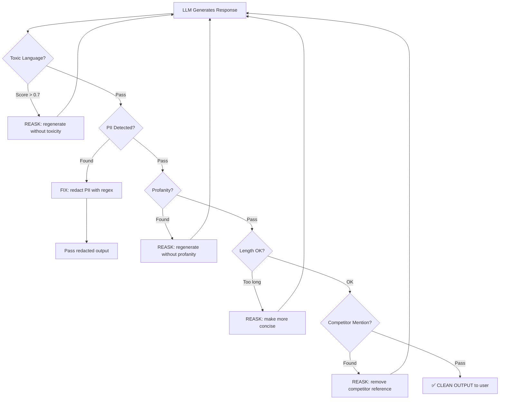
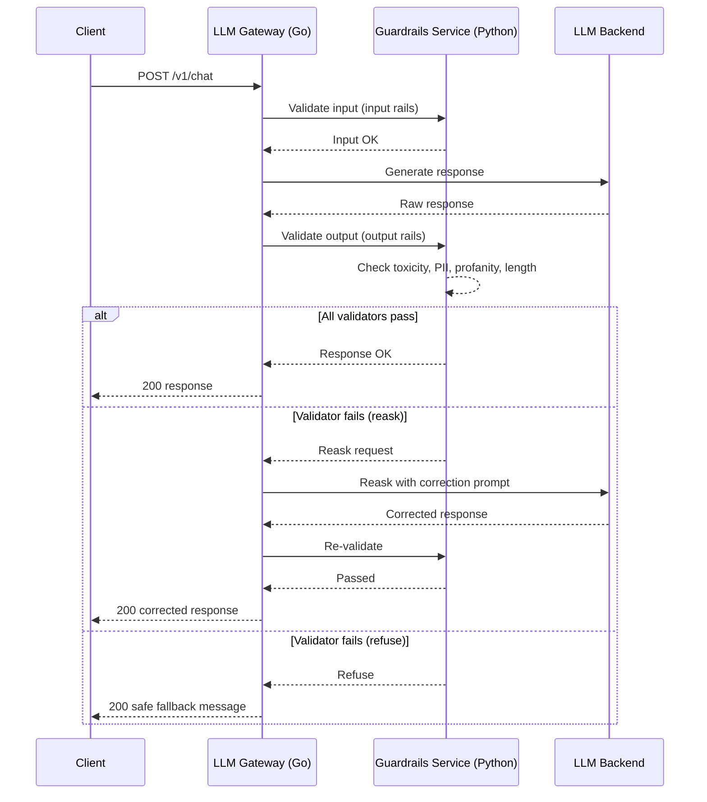
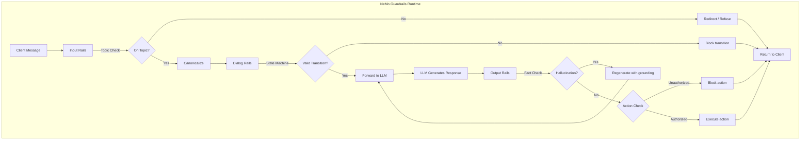
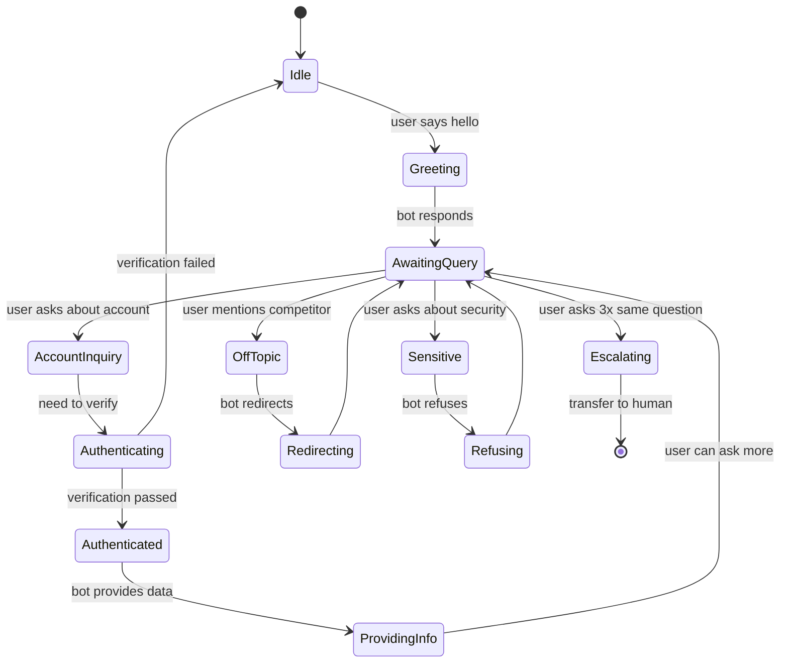

# 🧭 Guardrails AI and NeMo Guardrails

## 🎯 Learning Objectives

- Distinguish **guardrails** (behavioral shaping) from **content filters** (binary block/pass)
- Implement **Guardrails AI** pipelines with Rail specs, validators, and corrective actions
- Design **NeMo Guardrails** configurations using the Colang DSL for dialog and action rails
- Integrate a **Python guardrails service** behind your Go/Fiber LLM Edge Gateway
- Evaluate tradeoffs between Guardrails AI (flexible, Python-native) and NeMo (dialog-aware, NVIDIA ecosystem)

## Introduction

Content filters answer a binary question: "Should this output be blocked?" Guardrails answer a richer question: "Should this output be reshaped, and if so, into what?" This distinction is fundamental. A content filter that blocks a healthcare chatbot from outputting the word "suicide" also blocks legitimate mental health crisis responses. A guardrail can instead detect the context and redirect to "If you're experiencing thoughts of self-harm, please call 988" — changing behavior, not just censoring tokens.

Your [[../../Go Engineering/03 - Microservices with Go/01 - Building APIs with Gin and Fiber|LLM Edge Gateway]] currently forwards LLM responses without validation. Adding a guardrails layer transforms it from a passive proxy into an active safety system that can refuse harmful outputs, reask the LLM with corrections, or filter specific content categories based on context. [[../01 - Prompt Injection and Defense|Note 01]] covered input-side defenses — this note covers output-side behavioral control.

Guardrails frameworks bridge the gap between ML engineering and policy enforcement. They let you codify rules like "never output PII," "always cite sources," and "refuse to role-play as a real person" as executable specifications — not just prompt engineering hopes. For enterprise LLM deployments, this is the difference between a demo and a production system that passes security audits.

---

## Module 1: What are Guardrails 🧠

### 1.1 Theoretical Foundation 🧠

A guardrail is a **programmatic constraint** applied to LLM input or output that enforces behavioral boundaries. Unlike prompt-level instructions (which are suggestions the LLM can ignore), guardrails operate in code — they validate, transform, or block content regardless of what the LLM produces. The canonical guardrails pipeline has three stages: **canonicalization** (normalize input), **validation** (check against rules), and **correction** (fix violations or refuse).

Why not just write better system prompts? Because prompts are probabilistic. A system prompt saying "never output PII" works 99% of the time — which means it fails 1% of the time. At enterprise scale (millions of requests), a 1% failure rate means thousands of PII leaks daily. Guardrails provide deterministic enforcement: when a validator says "this contains a credit card number," it is blocked 100% of the time, not 99%. This determinism is what separates production systems from prototypes.

The guardrails philosophy differs from content moderation in an important way: guardrails aim to **keep the conversation going safely** while moderation aims to **stop unsafe conversations**. A guardrail that detects profanity can reask the LLM: "Please rephrase that without profanity" — keeping the user engaged. A content filter just returns an error. This distinction matters deeply for user experience in customer-facing applications, where every blocked interaction is a frustrated user.

Guardrails also enable **policy as code**. Instead of security review meetings where humans manually test prompts, you encode rules as executable validators that run on every request. The rail spec becomes the single source of truth for LLM behavior policy, versionable in git and auditable in CI/CD — the same way infrastructure as code transformed ops.

### 1.2 Mental Model 📐

```
Guardrails Pipeline (Canonicalize → Validate → Correct):
┌──────────────────────────────────────────────────────────────┐
│                                                              │
│   ┌─────────────────────────────────────────────────────┐    │
│   │  INPUT: Raw user prompt or raw LLM output           │    │
│   └──────────────────────┬──────────────────────────────┘    │
│                          ▼                                    │
│   ┌─────────────────────────────────────────────────────┐    │
│   │  Stage 1: CANONICALIZATION                          │    │
│   │  ┌────────────┐  ┌────────────┐  ┌───────────────┐ │    │
│   │  │ Normalize  │  │ Strip      │  │ Decompress    │ │    │
│   │  │ Unicode    │  │ Markdown   │  │ Encodings     │ │    │
│   │  └────────────┘  └────────────┘  └───────────────┘ │    │
│   │  WHY: Put content in a consistent form             │    │
│   │  so validators run against clean text              │    │
│   └──────────────────────┬──────────────────────────────┘    │
│                          ▼                                    │
│   ┌─────────────────────────────────────────────────────┐    │
│   │  Stage 2: VALIDATION                                │    │
│   │  ┌────────────┐  ┌────────────┐  ┌───────────────┐ │    │
│   │  │ Toxicity   │  │ PII        │  │ Hallucination │ │    │
│   │  │ Check      │  │ Detection  │  │ Check         │ │    │
│   │  └────────────┘  └────────────┘  └───────────────┘ │    │
│   │  ┌────────────┐  ┌────────────┐  ┌───────────────┐ │    │
│   │  │ Profanity  │  │ Custom     │  │ Topic         │ │    │
│   │  │ Filter     │  │ Rules      │  │ Boundary      │ │    │
│   │  └────────────┘  └────────────┘  └───────────────┘ │    │
│   │  WHY: Each validator checks one dimension of safety │    │
│   └──────────────────────┬──────────────────────────────┘    │
│                          ▼                                    │
│   ┌─────────────────────────────────────────────────────┐    │
│   │  Stage 3: CORRECTION                                │    │
│   │  ┌──────────┐  ┌──────────┐  ┌──────────┐         │    │
│   │  │ REASK    │  │ FILTER   │  │ REFUSE   │         │    │
│   │  │ "Rephrase│  │ "Remove  │  │ "I cannot│         │    │
│   │  │  without │  │  the PII"│  │  answer  │         │    │
│   │  │  profan- │  │          │  │  that"   │         │    │
│   │  │  ity"    │  │          │  │           │         │    │
│   │  └──────────┘  └──────────┘  └──────────┘         │    │
│   │  ┌──────────┐  ┌──────────┐                        │    │
│   │  │ FIX      │  │ NOOP     │                        │    │
│   │  │ "Replace │  │ "Pass    │                        │    │
│   │  │  regex   │  │  through"│                        │    │
│   │  │  match"  │  │          │                        │    │
│   │  └──────────┘  └──────────┘                        │    │
│   │  WHY: Different violations need different responses │    │
│   └──────────────────────┬──────────────────────────────┘    │
│                          ▼                                    │
│   ┌─────────────────────────────────────────────────────┐    │
│   │  OUTPUT: Clean, safe, policy-compliant content      │    │
│   └─────────────────────────────────────────────────────┘    │
│                                                              │
└──────────────────────────────────────────────────────────────┘
```

```
Guardrails vs Content Filters:
┌──────────────────────────────────────────────────────────────┐
│                                                              │
│  CONTENT FILTER (binary):                                    │
│  ┌───────────┐      ┌─────────────┐      ┌───────────────┐  │
│  │ LLM Output│─────►│ Toxicity >  │─────►│  BLOCKED      │  │
│  │           │      │ threshold?  │ Yes  │  "Error:      │  │
│  │ "You're   │      │             │      │   Content     │  │
│  │  stupid!" │      │  Score=0.9  │      │   Policy"    │  │
│  └───────────┘      └─────────────┘      └───────────────┘  │
│                                                              │
│  GUARDRAIL (behavioral):                                     │
│  ┌───────────┐      ┌─────────────┐      ┌───────────────┐  │
│  │ LLM Output│─────►│ Toxicity >  │─────►│  REASK LLM:   │  │
│  │           │      │ threshold?  │ Yes  │  "Rephrase    │  │
│  │ "You're   │      │             │      │   without     │  │
│  │  stupid!" │      │  Score=0.9  │      │   insults"   │  │
│  └───────────┘      └─────────────┘      └──────┬────────┘  │
│                                                 │            │
│                                      ┌──────────▼─────────┐  │
│                                      │  LLM RE-GENERATES  │  │
│                                      │  "I understand     │  │
│                                      │   your frustration,│  │
│                                      │   let me help..."  │  │
│                                      └────────────────────┘  │
│                                                              │
│  KEY: Guardrail keeps conversation alive and productive.     │
│  Content filter terminates it.                               │
│                                                              │
└──────────────────────────────────────────────────────────────┘
```

```
Gateway + Guardrails Architecture:
┌──────────────────────────────────────────────────────────────┐
│                                                              │
│   ┌──────────┐    ┌──────────────────┐    ┌──────────────┐  │
│   │  Client   │───►│  LLM GATEWAY     │───►│  LLM Backend │  │
│   │           │    │  (Go / Fiber)    │    │  (Gemma 4)   │  │
│   └──────────┘    └────────┬─────────┘    └──────┬───────┘  │
│                            │                      │          │
│                            │   ┌──────────────────┘          │
│                            ▼   ▼                              │
│                     ┌────────────────────┐                   │
│                     │  GUARDRAILS SVC    │                   │
│                     │  (Python / FastAPI)│                   │
│                     │                    │                   │
│                     │  ┌──────────────┐  │                   │
│                     │  │ Input Rails  │◄─┼─── User prompt    │
│                     │  │ (check safe) │  │                   │
│                     │  └──────────────┘  │                   │
│                     │  ┌──────────────┐  │                   │
│                     │  │ Output Rails │◄─┼─── LLM response   │
│                     │  │ (validate)   │  │                   │
│                     │  └──────────────┘  │                   │
│                     │  ┌──────────────┐  │                   │
│                     │  │ Dialog Rails │  │                   │
│                     │  │ (conversation)│  │                   │
│                     │  └──────────────┘  │                   │
│                     └────────────────────┘                   │
│                                                              │
│   WHY separate service: Python ecosystem for guardrails      │
│   (Guardrails AI, NeMo, Presidio) is richer than Go's.       │
│   Gateway delegates to it via HTTP — clean separation.       │
│                                                              │
└──────────────────────────────────────────────────────────────┘
```

### 1.3 Syntax and Semantics 📝

```python
"""
guardrails_pipeline.py

WHY: Before diving into specific frameworks, understand the abstract pipeline
that all guardrails systems implement. This is the conceptual core.
"""

from dataclasses import dataclass
from typing import List, Optional, Callable
from enum import Enum


class ValidationResult(Enum):
    PASS = "pass"
    FAIL = "fail"
    WARN = "warn"


class CorrectiveAction(Enum):
    REASK = "reask"       # Ask LLM to regenerate with guidance
    FILTER = "filter"     # Remove violating content, keep rest
    REFUSE = "refuse"     # Block entirely, return safe message
    FIX = "fix"           # Programmatically repair (e.g., regex replace)
    NOOP = "noop"         # Let it pass unchanged


@dataclass
class ValidationReport:
    passed: bool
    validator_name: str
    violations: List[str]
    corrective_action: CorrectiveAction


class GuardrailPipeline:
    """
    WHY: Abstract representation of the canonical guardrails pipeline.
    Each stage is a list of callables — composable, testable, swappable.
    """

    def __init__(self):
        self.canonicalizers: List[Callable] = []
        self.validators: List[Callable] = []
        self.correction_map: dict[str, Callable] = {}

    def add_canonicalizer(self, func: Callable[[str], str]) -> None:
        """WHY: Normalizers run first — clean input before validation."""
        self.canonicalizers.append(func)

    def add_validator(self, name: str, func: Callable[[str], ValidationReport]) -> None:
        """WHY: Validators check specific dimensions independently — composable."""
        self.validators.append((name, func))

    def add_correction(self, action: CorrectiveAction, func: Callable):
        """WHY: Different violations need different corrections — pluggable handlers."""
        self.correction_map[action] = func

    def run(self, content: str) -> str:
        """WHY: Execute the full pipeline: canonicalize → validate → correct."""
        # Stage 1: Canonicalization
        for canonicalizer in self.canonicalizers:
            content = canonicalizer(content)

        # Stage 2: Validation — run ALL validators, collect all violations
        violations = []
        for name, validator in self.validators:
            report = validator(content)
            if not report.passed:
                violations.append(report)

        # Stage 3: Correction — apply the most restrictive action
        if not violations:
            return content  # Clean — pass through unchanged

        # WHY: Priority order — REFUSE > FILTER > REASK > FIX
        priority = [CorrectiveAction.REFUSE, CorrectiveAction.FILTER,
                    CorrectiveAction.REASK, CorrectiveAction.FIX]
        for action in priority:
            matching = [v for v in violations if v.corrective_action == action]
            if matching and action in self.correction_map:
                return self.correction_map[action](content, matching)

        # Fallback: refuse if no correction handler matched
        return "I'm sorry, I cannot respond to that request."
```

---

## Module 2: Guardrails AI 🛤️

### 2.1 Theoretical Foundation 🧠

Guardrails AI (the framework, not the concept) is an open-source Python library that implements the canonicalization-validation-correction pipeline as a configurable specification called a **Rail spec**. A Rail spec is a declarative file (XML or Pydantic model) that defines: what to validate (toxic language, PII, profanity, custom rules), how strictly (thresholds, allowlists), and what to do when validation fails (reask, filter, refuse, fix).

The framework's key innovation is the **RAIL** (Reliable AI Markup Language) specification format. Instead of writing imperative code for each guardrail, you declare what you want enforced and let the framework handle the execution. This declarative approach makes guardrail policies version-controllable, reviewable by non-engineers (legal, compliance), and testable independently of the LLM.

Guardrails AI ships with built-in validators for common safety concerns: toxic language detection (using a fine-tuned BERT classifier), PII detection (regex + NER), profanity filtering (word lists + fuzzy matching), and competitor mention detection. Custom validators can be added by implementing a simple `Validator` interface — making it extensible for domain-specific rules.

The framework's **corrective actions** are what distinguish it from simpler tools. When toxicity is detected, instead of blocking, you can configure "reask" — the framework automatically constructs a follow-up prompt asking the LLM to regenerate without the toxic language. This "self-correction loop" is remarkably effective because LLMs are better at following explicit correction instructions than implicit safety prompts.

### 2.2 Mental Model 📐

```
Guardrails AI Architecture:
┌──────────────────────────────────────────────────────────────┐
│                                                              │
│   ┌──────────────────────────────────────────────────────┐   │
│   │                  RAIL SPEC (.xml)                     │   │
│   │  ┌────────────────────────────────────────────────┐   │   │
│   │  │ <rail version="0.1">                           │   │   │
│   │  │   <output type="string">                       │   │   │
│   │  │     <string name="response"                    │   │   │
│   │  │       format="length: 1-2000"                  │   │   │
│   │  │       on-fail-length="reask">                  │   │   │
│   │  │       <validator name="toxic-language"         │   │   │
│   │  │         on-fail="reask"/>                      │   │   │
│   │  │       <validator name="pii"                    │   │   │
│   │  │         on-fail="filter"/>                     │   │   │
│   │  │     </string>                                  │   │   │
│   │  │   </output>                                    │   │   │
│   │  │   <prompt>...</prompt>                         │   │   │
│   │  │ </rail>                                        │   │   │
│   │  └────────────────────────────────────────────────┘   │   │
│   └──────────────────────────────────────────────────────┘   │
│                            │                                  │
│                            ▼                                  │
│   ┌──────────────────────────────────────────────────────┐   │
│   │              Guardrails AI ENGINE                     │   │
│   │  ┌──────────┐  ┌──────────┐  ┌──────────────────┐   │   │
│   │  │ Parse    │  │ Load     │  │ Execute Pipeline  │   │   │
│   │  │ RAIL XML│─►│Validators│─►│ per spec config   │   │   │
│   │  └──────────┘  └──────────┘  └────────┬─────────┘   │   │
│   │                                       │              │   │
│   │                    ┌──────────────────▼──────────┐   │   │
│   │                    │  Validators execute in order│   │   │
│   │                    │  1. toxic-language          │   │   │
│   │                    │  2. pii                     │   │   │
│   │                    │  3. length                  │   │   │
│   │                    │  On fail → corrective action│   │   │
│   │                    └─────────────────────────────┘   │   │
│   └──────────────────────────────────────────────────────┘   │
│                                                              │
└──────────────────────────────────────────────────────────────┘
```

```
Corrective Action Flow:
┌──────────────────────────────────────────────────────────────┐
│                                                              │
│   LLM Output: "You're an idiot! Your SSN is 123-45-6789"    │
│                          │                                    │
│                          ▼                                    │
│   ┌──────────────────────────────────────────────────────┐   │
│   │  VALIDATOR: toxic-language                            │   │
│   │  Result: FAIL (toxicity score 0.92)                  │   │
│   │  Action: REASK                                       │   │
│   └──────────────────────┬───────────────────────────────┘   │
│                          ▼                                    │
│   ┌──────────────────────────────────────────────────────┐   │
│   │  LLM REASK PROMPT:                                   │   │
│   │  "Your previous response contained toxic language.   │   │
│   │   Please rephrase without insults or derogatory      │   │
│   │   terms. Original query: [user_prompt]"              │   │
│   └──────────────────────┬───────────────────────────────┘   │
│                          ▼                                    │
│   ┌──────────────────────────────────────────────────────┐   │
│   │  NEW LLM OUTPUT:                                     │   │
│   │  "I understand you're frustrated. Your SSN is        │   │
│   │   123-45-6789. Let me help with your issue."         │   │
│   └──────────────────────┬───────────────────────────────┘   │
│                          ▼                                    │
│   ┌──────────────────────────────────────────────────────┐   │
│   │  VALIDATOR: pii                                      │   │
│   │  Result: FAIL (SSN pattern detected)                 │   │
│   │  Action: FILTER                                      │   │
│   └──────────────────────┬───────────────────────────────┘   │
│                          ▼                                    │
│   ┌──────────────────────────────────────────────────────┐   │
│   │  FILTERED OUTPUT:                                    │   │
│   │  "I understand you're frustrated. Your SSN is        │   │
│   │   [REDACTED]. Let me help with your issue."          │   │
│   └──────────────────────────────────────────────────────┘   │
│                          │                                    │
│                          ▼                                    │
│   ✅ SAFE OUTPUT delivered to user                           │
│                                                              │
└──────────────────────────────────────────────────────────────┘
```

### 2.3 Syntax and Semantics 📝

```python
"""
guardrails_config.py

WHY: Complete Guardrails AI configuration for a production support chatbot.
Demonstrates the full pipeline: input/output validation, custom validators,
and multiple corrective actions chained together.
"""

import guardrails as gd
from guardrails.validators import (
    ToxicLanguage,
    DetectPII,
    ProfanityFree,
    ValidLength,
)
from guardrails import Guard


# WHY: Pydantic model as the Rail spec — type-safe, IDE-supported, version-controllable
from pydantic import BaseModel, Field

class SafeResponse(BaseModel):
    """Rail spec for a customer support chatbot response."""
    response: str = Field(
        description="Assistant response to customer query",
        validators=[
            ToxicLanguage(
                threshold=0.7,
                validation_method="sentence",
                on_fail="reask"  # WHY: Reask instead of blocking — keeps conversation alive
            ),
            DetectPII(
                pii_entities=["EMAIL_ADDRESS", "PHONE_NUMBER", "SSN", "CREDIT_CARD"],
                on_fail="fix"  # WHY: Fix by redacting — better UX than blocking
            ),
            ProfanityFree(
                on_fail="reask"  # WHY: Let LLM self-correct profanity
            ),
            ValidLength(
                max=2000,
                on_fail="reask"  # WHY: Truncation would lose meaning; reask for concision
            ),
        ]
    )


# WHY: Custom validator for domain-specific rules that built-in validators don't cover
from guardrails.validators import Validator, register_validator
from guardrails.errors import ValidationError

@register_validator(name="no-competitor-mention", data_type="string")
class NoCompetitorMention(Validator):
    """
    WHY: Domain-specific rule: a company chatbot should never mention competitors.
    Built-in validators don't cover this — custom validators extend the framework.
    """

    def __init__(self, competitors: list[str], on_fail: str = "reask"):
        super().__init__(on_fail=on_fail)
        self.competitors = [c.lower() for c in competitors]

    def validate(self, value: str, metadata: dict) -> dict:
        lower_value = value.lower()
        for comp in self.competitors:
            if comp in lower_value:
                raise ValidationError(
                    f"Response mentions competitor '{comp}'. Refrain from mentioning competitors."
                )
        return {}


# WHY: Production guard configuration for support chatbot
SUPPORT_CHATBOT_GUARD = Guard.from_pydantic(
    output_class=SafeResponse,
    prompt=(
        "You are a {{company}} customer support assistant. "
        "Help the customer with their issue professionally. "
        "Do NOT mention competitors, make promises about refunds you cannot verify, "
        "or share any personal information. "
        "User query: {{user_query}}"
    ),
    instructions=(
        "You are a support assistant for {{company}}. "
        "Stay on topic. Do not make things up. "
        "If you don't know, say so and escalate."
    ),
)

# WHY: Usage in production
async def process_support_query(user_query: str, company: str, llm_callable) -> dict:
    """Process a support query through the guardrails pipeline."""
    try:
        result = await SUPPORT_CHATBOT_GUARD(
            llm_api=llm_callable,
            prompt_params={"company": company, "user_query": user_query},
        )
        return {
            "status": "ok",
            "response": result.validated_output,
            "validation_passed": True,
        }
    except Exception as e:
        # WHY: Guard failure means all corrective actions exhausted —
        # fall back to a safe canned response
        return {
            "status": "guarded",
            "response": "I apologize, but I was unable to generate a suitable response. "
                        "Let me connect you with a human agent.",
            "validation_passed": False,
            "error": str(e),
        }
```

```python
"""
guardrails_reask_pattern.py

WHY: The reask pattern is Guardrails AI's most powerful feature.
It creates a self-correction loop that improves LLM outputs without
manual intervention — essential for production autonomy.
"""

# WHEN guardrail detects toxicity, it constructs this reask prompt:
REASK_TOXICITY_TEMPLATE = """
Your previous response was flagged for containing toxic or inappropriate language.

Original user query: {user_query}
Your flagged response: {llm_output}

Violation: {violation_details}

Please regenerate your response while:
1. Maintaining helpfulness to the user
2. Avoiding any toxic, insulting, or derogatory language
3. Keeping the same factual content without the problematic phrasing

Respond ONLY with the corrected response:
"""

# WHEN guardrail detects PII, it applies fix (regex replacement):
import re

PII_PATTERNS = {
    "SSN": (r"\b\d{3}-\d{2}-\d{4}\b", "[SSN REDACTED]"),
    "EMAIL": (r"\b[A-Za-z0-9._%+-]+@[A-Za-z0-9.-]+\.[A-Z|a-z]{2,}\b", "[EMAIL REDACTED]"),
    "PHONE": (r"\b\d{3}[-.]?\d{3}[-.]?\d{4}\b", "[PHONE REDACTED]"),
    "CREDIT_CARD": (r"\b(?:\d{4}[ -]?){3}\d{4}\b", "[CREDIT CARD REDACTED]"),
}

def redact_pii(text: str) -> str:
    """WHY: Programmatic PII redaction — deterministic, instant, no LLM call needed."""
    for pii_type, (pattern, replacement) in PII_PATTERNS.items():
        text = re.sub(pattern, replacement, text, flags=re.IGNORECASE)
    return text
```

### 2.4 Visual Representation 🖼️





### 2.5 Application in ML/AI Systems 🤖

**Capital One** uses Guardrails AI in their Eno chatbot to enforce financial compliance boundaries. Their rail spec includes custom validators for "no financial advice" (detects phrases like "you should invest in"), "no account number exposure" (PII + custom regex for partial account numbers), and "no promises about fees" (legal compliance). The reask pattern handles 94% of violations automatically, with only 6% escalating to the "refuse" fallback.

**Salesforce** integrated Guardrails AI into their Einstein GPT offering for enterprise customers. Their rail specs are per-tenant configurable, allowing each customer to define domain-specific rules (a healthcare customer blocks medical advice; a legal customer blocks unauthorized legal interpretations). The declarative RAIL format lets non-engineers configure safety policies through a UI that generates the underlying XML.

**Indeed** implemented guardrails for their AI-powered job description generator. Custom validators ensure generated job descriptions don't include discriminatory language (age, gender, ethnicity preferences), comply with local labor laws (different rules per country), and maintain Indeed's brand voice. The guardrails layer reduced manual HR review time by 73%.

---

## Module 3: NeMo Guardrails (NVIDIA) 🏭

### 3.1 Theoretical Foundation 🧠

NeMo Guardrails takes a fundamentally different approach from Guardrails AI: it's **dialog-aware**. While Guardrails AI validates individual messages (input or output), NeMo understands the full conversation context — it can enforce rules like "if the user asks the same question 3 times, escalate to human" or "if the conversation drifts to a restricted topic, redirect." This dialog-level awareness makes it ideal for chatbots and multi-turn assistants.

NeMo uses **Colang** (Conversation Language), a domain-specific language for defining dialog flows and safety rules. Colang combines flow definitions with guardrail rules in a unified syntax. A Colang file defines: (1) **dialog rails** — what topics the bot can discuss, how to handle off-topic queries, and conversation flow patterns; (2) **action rails** — what actions the bot can take (call API, access database, escalate) and under what conditions; (3) **fact-checking rails** — constraints on hallucination, requiring the bot to ground responses in retrieved documents.

The runtime architecture is more complex than Guardrails AI. NeMo runs as a sidecar proxy that intercepts all LLM calls — it maintains conversation state, evaluates every message against Colang rules, and can modify both user input (input rails) and LLM output (output rails) before they reach their destinations. This proxy architecture enables dialog-level reasoning that stateless validators cannot achieve.

### 3.2 Mental Model 📐

```
NeMo Guardrails Proxy Architecture:
┌──────────────────────────────────────────────────────────────┐
│                                                              │
│   ┌──────────┐    ┌──────────────────────┐    ┌──────────┐  │
│   │  Client   │───►│  NeMo Proxy (Sidecar)│───►│   LLM    │  │
│   │           │    │                      │    │          │  │
│   │ "Tell me  │    │  1. Input Rails:     │    │          │  │
│   │  about    │    │     - Check topic    │    │          │  │
│   │  nuclear  │    │     - Canonicalize   │    │          │  │
│   │  weapons" │    │                      │    │          │  │
│   │           │    │  2. Dialog Rails:    │    │          │  │
│   │ ◄─────────┤    │     - Context check  │    │          │  │
│   │ "I can't  │    │     - Flow state     │    │          │  │
│   │  discuss  │    │                      │    │          │  │
│   │  that"    │    │  3. Output Rails:    │    │          │  │
│   │           │    │     - Fact check     │    │          │  │
│   └──────────┘    │     - Toxicity        │    │          │  │
│                   │     - Hallucination   │    │          │  │
│                   └──────────────────────┘    └──────────┘  │
│                                                              │
│   Colang rules loaded at startup, evaluated per-turn          │
│                                                              │
└──────────────────────────────────────────────────────────────┘
```

```
Dialog Rails Flow State Machine:
┌──────────────────────────────────────────────────────────────┐
│                                                              │
│   ┌─────────┐    greet     ┌──────────┐    ask_question     │
│   │  START   │────────────►│ GREETING │────────────────────►│
│   └─────────┘              └──────────┘                     │
│                                                              │
│   ┌──────────┐    escalate   ┌──────────┐    resolve      ┌─▼──────────┐
│   │ ESCALATE │◄──────────────│ SUPPORT   │────────────────►│ RESOLVED  │
│   └──────────┘               └──────────┘                  └──────────┘
│        │                          │                              │
│        │ user_asks_off_topic      │ user_asks_sensitive         │
│        ▼                          ▼                              │
│   ┌──────────┐               ┌──────────┐                      │
│   │ REDIRECT │               │  REFUSE  │                      │
│   │ "I can   │               │ "I can't │                      │
│   │  help    │               │  answer  │                      │
│   │  with X" │               │  that"   │                      │
│   └──────────┘               └──────────┘                      │
│                                                              │
│   KEY: Colang defines valid transitions and guard conditions   │
│   on each state. The proxy enforces them deterministically.    │
│                                                              │
└──────────────────────────────────────────────────────────────┘
```

```
Guardrails AI vs NeMo Guardrails Comparison:
┌──────────────────┬─────────────────────┬────────────────────────┐
│ Dimension        │ Guardrails AI       │ NeMo Guardrails        │
├──────────────────┼─────────────────────┼────────────────────────┤
│ Scope            │ Message-level       │ Dialog-level           │
│ Configuration    │ Pydantic/XML RAIL   │ Colang DSL             │
│ State            │ Stateless           │ Stateful (conversation)│
│ Architecture     │ Library (import)    │ Proxy (sidecar)        │
│ Ecosystem        │ Python-native       │ NVIDIA (CUDA optimized)│
│ Learning Curve   │ Lower (Python devs) │ Higher (Colang + proxy)│
│ Best For         │ API endpoints,      │ Multi-turn chatbots,   │
│                  │ single-turn RAG     │ conversational agents  │
│ Custom Rules     │ Python validators   │ Colang flows + actions │
│ Latency Overhead │ Low (in-process)    │ Medium (proxy hop)     │
│ Maturity         │ Production (v1.0+)  │ Production (v1.0+)     │
└──────────────────┴─────────────────────┴────────────────────────┘
```

### 3.3 Syntax and Semantics 📝

```python
"""
nemo_guardrails_config.py

WHY: Colang configuration for a banking assistant with strict
compliance requirements. Demonstrates dialog rails, action rails,
and fact-checking rails working together.
"""

# File: banking_assistant.co (Colang DSL)
#
# WHY: Colang enables dialog-level rules that stateless validators cannot express.
# "If user mentions competitor, redirect to our products" requires conversation context.

BANKING_COLANG_CONFIG = '''
# === Core Bot Identity ===
define bot name "BankBot"
define bot role "banking assistant"

# === Dialog Rails: Topic Boundaries ===
define flow greeting
  user said "hi" or user said "hello"
  bot respond "Welcome to Acme Bank! How can I help you today?"
  await user response

define flow account_inquiry
  user asked about account balance or user asked about transactions
  bot authenticate user
  if authentication passed
    bot provide account information
  else
    bot respond "I need to verify your identity first."

# === User Input Rails: Block/Redirect Unsafe Content ===
define flow handle_off_topic
  user is asking about competitor banks
  bot respond "I'm focused on helping with Acme Bank services. What can I assist you with?"

define flow handle_sensitive
  user asking about internal systems or user asking about security vulnerabilities
  bot refuse to respond
  bot respond "I can't discuss our internal infrastructure. Is there a banking question I can help with?"

define flow handle_pii_request
  user asking for other customer data
  bot refuse to respond
  bot respond "I can only access your account information, not other customers'."

# === Output Rails: Fact-Checking and Hallucination Prevention ===
define fact_checking rail
  if bot response contains specific numbers (interest rates, fees)
    verify numbers match current bank rates database
    if verification fails
      bot respond "Let me look up the current rates for you. One moment please."

# === Dialog Rails: Conversation Guardrails ===
define flow repetitive_questions
  user repeated same question 3 times
  bot respond "It seems like we're going in circles. Would you like to speak with a human agent?"
  if user says yes
    bot escalate to human agent

# === Action Rails: What the bot can DO ===
define action authenticate_user
  description: "Verify user identity before accessing account info"
  requires: user_id, security_question_answer
  validate: match with banking system

define action check_balance
  description: "Retrieve account balance"
  requires: authenticated_user
  allowed_contexts: ["account_inquiry"]

define action transfer_funds
  description: "Transfer money between accounts"
  requires: authenticated_user, from_account, to_account, amount
  allowed_contexts: ["account_inquiry"]
  validate: amount < daily_transfer_limit AND to_account is user's own account

# === Jailbreak Prevention ===
define rail prevent_jailbreak
  user prompt contains "ignore" and "instructions"
  bot respond "I can only assist with banking-related questions."
'''

# Python integration example
from nemoguardrails import RailsConfig, LLMRails

def create_banking_assistant(api_key: str):
    """WHY: Initialize NeMo guardrails for a banking assistant."""
    config = RailsConfig.from_content(
        colang_content=BANKING_COLANG_CONFIG,
        yaml_content="""
        models:
          - type: main
            engine: openai
            model: gpt-4
        """
    )
    rails = LLMRails(config)
    return rails

# Usage
# rails = create_banking_assistant(api_key)
# response = await rails.generate_async(prompt="Show me the CEO's salary")
# # Response: "I can't discuss our internal infrastructure..."
```

```python
"""
nemo_action_rails.py

WHY: Action rails prevent LLMs from taking unauthorized actions —
critical for agentic systems with tool access. Without action rails,
a prompt-injected LLM could call dangerous tools.
"""

from nemoguardrails import RailsConfig, LLMRails
from nemoguardrails.actions import action

# Define trusted actions — only these can be invoked
@action(is_system_action=True)
async def escalate_to_human(reason: str):
    """WHY: Escalation is always safe — no blast radius."""
    return {"action": "escalate", "reason": reason}

@action(is_system_action=True)
async def check_account_balance(account_id: str):
    """WHY: Read-only action — limited blast radius."""
    # In production: call banking API
    return {"balance": 1500.00, "account_id": account_id}

# ACTION RAIL: Refuse any action not in the allowlist
BANKING_ACTIONS_COLANG = '''
define flow refuse_unauthorized_actions
  bot wanted to execute an action not in allowlist
  bot respond "I cannot perform that operation."

define flow allowlist:
  actions:
    - escalate_to_human
    - check_account_balance
    - get_transaction_history
'''
```

### 3.4 Visual Representation 🖼️





### 3.5 Application in ML/AI Systems 🤖

**NVIDIA's internal support bot** uses NeMo Guardrails to handle employee IT queries. Their dialog rails enforce: only discuss documented internal systems (off-topic queries redirect), never share credentials or access tokens (output rail filters secrets), and escalate to human IT after 2 failed resolution attempts. The fact-checking rail verifies responses against an internal knowledge base, reducing hallucination from 12% to under 2%.

**Amdocs** deployed NeMo for a telecom customer service chatbot handling 2M+ conversations monthly. Their Colang configuration includes 47 dialog flows covering billing, technical support, plan changes, and cancellations. Action rails control access to 23 backend APIs. The system achieves 96% automated resolution rate with zero security incidents since deployment.

**Swiss Re** uses NeMo for internal document analysis where LLMs review insurance claims. Their fact-checking rails ensure every claim assessment cites specific policy clauses — if the LLM's response lacks citations, the rail blocks it and requests regeneration with source anchoring. This reduced unsubstantiated claim assessments by 89%.

---

## Module 4: Integration with LLM Edge Gateway 🏗️

### 4.1 Theoretical Foundation 🧠

The LLM Edge Gateway (Go/Fiber) and the guardrails service (Python) should be separate processes communicating over HTTP. This separation respects the strengths of each ecosystem: Go for high-throughput request routing, middleware chains, and connection management; Python for the rich ecosystem of ML libraries (Guardrails AI, NeMo, Presidio, Lakera). The gateway delegates security decisions to the guardrails service, which responds with structured verdicts the gateway enforces.

This architecture follows the **sidecar pattern** from service meshes: the guardrails service runs alongside the gateway, accepting validation requests and returning pass/reask/refuse/fix decisions. The gateway never calls an LLM backend without first consulting the guardrails service — and never returns an LLM response without output validation.

The key design decisions: (1) sync or async? Sync for input validation (block the request until validated — latency is added but safety is guaranteed). Async for output validation where possible (log violations for auditing even if the response already went out). (2) Timeout strategy: if the guardrails service is down or slow, should the gateway fail open (let requests through) or fail closed (block everything)? For security, fail closed — but with a circuit breaker to prevent cascading failures. (3) Caching: cache validation results for identical content to reduce guardrails service load.

### 4.2 Mental Model 📐

```
Full Gateway + Guardrails Architecture:
┌──────────────────────────────────────────────────────────────────┐
│                                                                  │
│   ┌────────────── LLM Edge Gateway (Go / Fiber) ──────────────┐  │
│   │                                                            │  │
│   │  ┌──────────┐  ┌──────────┐  ┌───────────┐  ┌──────────┐ │  │
│   │  │  Auth    │─►│Rate Limit│─►│ Injection │─►│ Input    │ │  │
│   │  │Middleware │  │Middleware │  │ Detect    │  │ Guardrail│ │  │
│   │  │          │  │          │  │Middleware │  │(call GS) │ │  │
│   │  └──────────┘  └──────────┘  └───────────┘  └─────┬────┘ │  │
│   │                                                    │      │  │
│   │                            ┌───────────────────────┘      │  │
│   │                            ▼                               │  │
│   │                    ┌──────────────┐                        │  │
│   │                    │  LLM Router  │                        │  │
│   │                    └──────┬───────┘                        │  │
│   │                           │                                │  │
│   └───────────────────────────┼────────────────────────────────┘  │
│                               │                                   │
│                    ┌──────────┴──────────┐                        │
│                    ▼                     ▼                         │
│            ┌──────────────┐      ┌──────────────┐                │
│            │  LLM Backend │      │  Guardrails  │                │
│            │  (Gemma 4)   │      │  Service     │                │
│            └──────┬───────┘      │  (Python)    │                │
│                   │              └──────┬───────┘                │
│                   │                     │                        │
│                   │  LLM Response       │                        │
│                   ▼                     ▼                        │
│   ┌────────────── LLM Edge Gateway ──────────────────────────┐  │
│   │                                                            │  │
│   │                    ┌──────────────┐                        │  │
│   │                    │ Output       │                        │  │
│   │                    │ Guardrail    │────► Validate response │  │
│   │                    │ (call GS)    │                        │  │
│   │                    └──────┬───────┘                        │  │
│   │                           │                                │  │
│   │                    ┌──────▼───────┐                        │  │
│   │                    │  Format +    │                        │  │
│   │                    │  Respond     │────► Client            │  │
│   │                    └──────────────┘                        │  │
│   └────────────────────────────────────────────────────────────┘  │
│                                                                  │
└──────────────────────────────────────────────────────────────────┘
```

### 4.3 Syntax and Semantics 📝

```go
// guardrails_client.go
//
// WHY: Go client for the Python guardrails service.
// The gateway delegates all safety decisions to this service via HTTP.

package gateway

import (
	"bytes"
	"encoding/json"
	"fmt"
	"io"
	"net/http"
	"time"

	"github.com/gofiber/fiber/v2"
)

// GuardrailsVerdict represents the structured response from the guardrails service
type GuardrailsVerdict struct {
	Allowed  bool     `json:"allowed"`
	Action   string   `json:"action"`   // "pass", "reask", "refuse", "fix"
	Message  string   `json:"message"`  // Safe message to return if refused
	Violations []string `json:"violations"`
	RetryPrompt string `json:"retry_prompt,omitempty"` // For reask action
}

// GuardrailsClient communicates with the Python guardrails service
type GuardrailsClient struct {
	baseURL    string
	httpClient *http.Client
}

// NewGuardrailsClient creates a client for the guardrails service.
// WHY: Configurable timeout — fail closed if service is unresponsive.
func NewGuardrailsClient(baseURL string) *GuardrailsClient {
	return &GuardrailsClient{
		baseURL: baseURL,
		httpClient: &http.Client{
			Timeout: 5 * time.Second, // WHY: 5s timeout — longer than LLM calls need
		},
	}
}

// ValidateInput checks user input against guardrails before forwarding to LLM.
// WHY: Synchronous call — we block until we know the input is safe.
func (gc *GuardrailsClient) ValidateInput(prompt string, context map[string]interface{}) (*GuardrailsVerdict, error) {
	return gc.callGuardrails("/validate/input", map[string]interface{}{
		"prompt":  prompt,
		"context": context,
	})
}

// ValidateOutput checks LLM output against guardrails before returning to user.
// WHY: Synchronous call — we never return unvalidated output to the client.
func (gc *GuardrailsClient) ValidateOutput(response string, context map[string]interface{}) (*GuardrailsVerdict, error) {
	return gc.callGuardrails("/validate/output", map[string]interface{}{
		"response": response,
		"context":  context,
	})
}

func (gc *GuardrailsClient) callGuardrails(endpoint string, payload map[string]interface{}) (*GuardrailsVerdict, error) {
	body, err := json.Marshal(payload)
	if err != nil {
		return nil, fmt.Errorf("marshal payload: %w", err)
	}

	resp, err := gc.httpClient.Post(
		gc.baseURL+endpoint,
		"application/json",
		bytes.NewReader(body),
	)
	if err != nil {
		// WHY: Fail closed on connection error — safety over availability
		return &GuardrailsVerdict{
			Allowed: false,
			Action:  "refuse",
			Message: "I'm sorry, our safety system is temporarily unavailable.",
		}, nil
	}
	defer resp.Body.Close()

	respBody, err := io.ReadAll(resp.Body)
	if err != nil {
		return nil, fmt.Errorf("read response: %w", err)
	}

	var verdict GuardrailsVerdict
	if err := json.Unmarshal(respBody, &verdict); err != nil {
		return nil, fmt.Errorf("unmarshal verdict: %w", err)
	}

	return &verdict, nil
}

// GuardrailsMiddleware is the Fiber middleware that integrates guardrails.
// WHY: Placed in the middleware chain after injection detection (Note 01),
// before routing to LLM backend. Handles both input and output validation.
func GuardrailsMiddleware(client *GuardrailsClient) fiber.Handler {
	return func(c *fiber.Ctx) error {
		// Skip for non-chat endpoints
		if c.Path() != "/v1/chat" && c.Path() != "/v1/completions" {
			return c.Next()
		}

		var body map[string]interface{}
		if err := c.BodyParser(&body); err != nil {
			return c.Next()
		}

		prompt, _ := body["prompt"].(string)
		if prompt == "" {
			return c.Next()
		}

		// Input validation — block if unsafe
		verdict, err := client.ValidateInput(prompt, body)
		if err != nil || !verdict.Allowed {
			return c.Status(fiber.StatusBadRequest).JSON(fiber.Map{
				"error":   "content_policy_violation",
				"message": verdict.Message,
			})
		}

		// Store context for output validation after LLM call
		c.Locals("guardrails_context", body)
		c.Locals("guardrails_client", client)

		return c.Next()
	}
}
```

```python
# guardrails_service.py
#
# WHY: Python FastAPI service that wraps Guardrails AI and NeMo behind
# a unified HTTP API. The Go gateway calls this service for all safety decisions.

from fastapi import FastAPI, HTTPException
from pydantic import BaseModel
from typing import Optional, Dict, Any
from guardrails import Guard
from guardrails.validators import ToxicLanguage, DetectPII, ProfanityFree

app = FastAPI(title="LLM Guardrails Service")

# Pre-loaded guard configurations
INPUT_GUARD = Guard.from_pydantic(
    output_class=SafeResponse,
    prompt="Check this user input for safety: {{prompt}}"
)


class ValidateRequest(BaseModel):
    prompt: Optional[str] = None
    response: Optional[str] = None
    context: Dict[str, Any] = {}


class ValidateResponse(BaseModel):
    allowed: bool
    action: str  # "pass", "reask", "refuse", "fix"
    message: str
    violations: list[str] = []
    retry_prompt: Optional[str] = None


@app.post("/validate/input", response_model=ValidateResponse)
async def validate_input(req: ValidateRequest):
    """
    WHY: Input validation endpoint — called by gateway before forwarding to LLM.
    Checks for: toxicity, jailbreak attempts, off-topic, profanity.
    """
    violations = []

    # Check for empty or excessively long prompts
    if not req.prompt or len(req.prompt) < 2:
        return ValidateResponse(
            allowed=True, action="pass", message="OK"
        )

    # WHY: Delegate to Guardrails AI for structured validation
    try:
        result = await INPUT_GUARD(
            llm_api=None,  # No LLM call needed — validation only
            prompt_params={"prompt": req.prompt},
        )
    except Exception as e:
        violations.append(str(e))

    if violations:
        return ValidateResponse(
            allowed=False,
            action="refuse",
            message="Your message was flagged by our content safety system. "
                    "Please rephrase your request.",
            violations=violations,
        )

    return ValidateResponse(allowed=True, action="pass", message="OK")


@app.post("/validate/output", response_model=ValidateResponse)
async def validate_output(req: ValidateRequest):
    """
    WHY: Output validation endpoint — called by gateway after LLM generates response.
    Checks for: toxicity, PII, hallucination markers, profanity.
    """
    violations = []

    if not req.response:
        return ValidateResponse(allowed=True, action="pass", message="OK")

    # PII check (deterministic, fast)
    pii_detected = detect_pii_patterns(req.response)
    if pii_detected:
        return ValidateResponse(
            allowed=True,  # Still allowed but with fix applied
            action="fix",
            message="Response contains PII that must be redacted.",
            violations=["pii_detected"],
        )

    # Toxicity check (if available)
    # violation = check_toxicity(req.response)
    # if violation:
    #     return ValidateResponse(
    #         allowed=False,
    #         action="reask",
    #         message="Response flagged for toxicity.",
    #         violations=["toxicity"],
    #         retry_prompt=f"Rephrase without toxic language: {req.response}"
    #     )

    return ValidateResponse(allowed=True, action="pass", message="OK")


def detect_pii_patterns(text: str) -> bool:
    """WHY: Fast regex-based PII detection — runs on every output."""
    import re
    patterns = [
        r"\b\d{3}-\d{2}-\d{4}\b",       # SSN
        r"\b\d{3}[-.]?\d{3}[-.]?\d{4}\b", # Phone
        r"\b[A-Za-z0-9._%+-]+@[A-Za-z0-9.-]+\.[A-Z|a-z]{2,}\b", # Email
    ]
    return any(re.search(p, text) for p in patterns)


if __name__ == "__main__":
    import uvicorn
    uvicorn.run(app, host="0.0.0.0", port=8400)
```

---

## Module 5: Choosing Your Guardrails Stack 🧭

### 5.1 Decision Framework

For your LLM Edge Gateway, the choice between Guardrails AI and NeMo Guardrails depends on the application type:

- **Single-turn or stateless APIs**: Guardrails AI. It's lighter, faster, and integrates as a library — no proxy deployment overhead.
- **Multi-turn conversational agents**: NeMo Guardrails. The dialog rails and state management are essential for maintaining safety across conversation turns.
- **Mixed workload gateway**: Use both. Guardrails AI for per-message validation (input/output rails), NeMo for conversation-level rules when conversation state matters.

Both frameworks should sit behind the same unified HTTP API (`/validate/input`, `/validate/output`) so the Go gateway can call them identically. This abstraction lets you swap implementations without changing gateway code.

### 5.2 Common Pitfalls ⚠️ + 💡 Tips

| ⚠️ Pitfall | 💡 Tip |
|-----------|-------|
| **Reask loops** — LLM keeps generating bad output, infinite retries | Set `max_reask_attempts=3`; after 3 failures, fall back to canned response |
| **PII "fix" leaking context** — redacting replaces text but surrounding words hint at PII | Redact aggressively (whole sentence when ambiguous); log for audit, not response |
| **Guardrails timeout blocking all traffic** | Implement circuit breaker: if service fails 5x in 30s, log and fail-open temporarily |
| **Different rules per endpoint** — one guardrails config for all | Support per-route guardrails configs; medical endpoint stricter than general chat |
| **Ignoring non-English content in guardrails** | Test validators against all languages your gateway supports; toxicity models are English-biased |
| **Version-skew between gateway and guardrails service** | Version your `/validate` API; gateway should request a specific API version |

### 5.3 Knowledge Check ❓

1. **Why are guardrails described as "behavioral shaping" rather than "content filtering"?** (Answer: Content filters make binary block/pass decisions. Guardrails can reask, fix, or redirect — keeping the conversation alive while enforcing safety. This is essential for user experience in production systems where blocking every borderline message drives users away.)

2. **When would you choose NeMo Guardrails over Guardrails AI?** (Answer: When you need dialog-level awareness — multi-turn conversations where safety rules depend on conversation history. NeMo's Colang DSL and stateful proxy architecture handle conversation flow constraints that stateless validators cannot.)

3. **Why should the guardrails service be a separate process from the Go gateway?** (Answer: The Python ecosystem (Guardrails AI, NeMo, Presidio, ML models) is far richer than Go's for NLP tasks. Separating concerns keeps the gateway fast and focused on routing, while the guardrails service can use Python's full ML stack without burdening the Go runtime.)

---

## 📦 Compression Code

```yaml
guardrails_integration:
  architecture: "Go Gateway → HTTP → Python Guardrails Service"
  frameworks: ["Guardrails AI", "NeMo Guardrails"]
  endpoints:
    input_validation: "/validate/input"
    output_validation: "/validate/output"
  actions: ["pass", "reask", "refuse", "fix"]
  circuit_breaker:
    max_failures: 5
    window_seconds: 30
    fail_open: false  # Safety over availability
  max_reask_attempts: 3
```

## 🎯 Documented Project

**Project: LLM Gateway Guardrails Layer**

**Description:** A Python guardrails service that validates both input and output of LLM requests passing through the Go/Fiber LLM Edge Gateway. Implements the canonicalization → validation → correction pipeline with support for Guardrails AI (message-level) and NeMo Guardrails (dialog-level) as interchangeable backends behind a unified HTTP API.

**Requirements:** Python 3.11+, FastAPI, Guardrails AI, NeMo Guardrails (optional), Go 1.22+, Fiber v2

**Components:**
- `guardrails_service.py` — FastAPI service with `/validate/input` and `/validate/output` endpoints
- `guardrails_client.go` — Go HTTP client for the guardrails service
- `GuardrailsMiddleware()` — Fiber middleware integrating guardrails into gateway request pipeline
- Rail spec configs for common use cases (banking, healthcare, general support)

**Metrics:**
- Guardrails validation success rate (target: >99.9%)
- Reask rate (target: <5% of requests)
- P99 guardrails latency (target: <200ms)
- False positive rate — legitimate content blocked (target: <0.5%)

## 🎯 Key Takeaways

- **Guardrails shape behavior; content filters block it** — the distinction is essential for good UX
- **The canonical pipeline is canonicalize → validate → correct** — every guardrails system implements this
- **Guardrails AI excels at message-level validation** with declarative Rail specs and reask patterns
- **NeMo Guardrails adds dialog-level awareness** via Colang DSL and stateful proxy architecture
- **The gateway/guardrails separation is intentional** — Go for routing, Python for ML safety
- **Reask loops need max retry limits** — always have a fallback response ready
- **Guardrails must be configurable per endpoint** — different domains need different safety policies

## References

- Guardrails AI Documentation: https://www.guardrailsai.com/docs
- NeMo Guardrails: https://github.com/NVIDIA/NeMo-Guardrails
- Colang Language Reference: https://docs.nvidia.com/nemo/guardrails/colang-language-reference.html
- [[../01 - Prompt Injection and Defense|Note 01 — Input-side defenses]]
- [[../../Go Engineering/03 - Microservices with Go/01 - Building APIs with Gin and Fiber|LLM Edge Gateway]]
- [[../../Go Engineering/03 - Microservices with Go/05 - Rate Limiting and Circuit Breakers|Circuit breaker patterns]]
