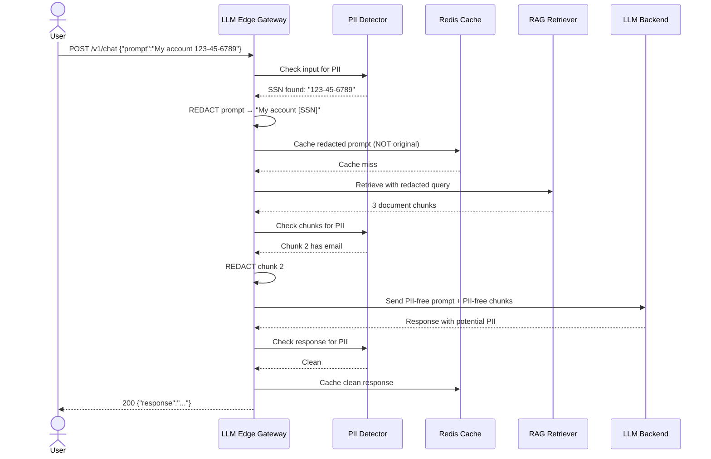

# 🔒 PII Detection and Data Privacy

## 🎯 Learning Objectives

- Classify **PII types** (direct identifiers, quasi-identifiers, sensitive attributes) and their regulatory implications
- Implement **Microsoft Presidio** pipelines for PII detection, anonymization, and deanonymization in LLM workloads
- Build a **hybrid PII detector** combining regex, SpaCy NER, and LLM-based classification
- Integrate PII scrubbing into your LLM Edge Gateway — **before caching and before LLM context injection**
- Design PII-safe RAG pipelines that sanitize retrieved documents before they enter the LLM context window

## Introduction

PII leakage through LLMs is not a hypothetical risk — it's an inevitability without explicit countermeasures. An LLM that has seen training data containing emails, phone numbers, and addresses will occasionally regenerate them. A RAG system that retrieves customer support tickets will inject raw PII into the LLM context. A caching layer that stores LLM responses containing PII creates a permanent data breach. Your [[../../Go Engineering/03 - Microservices with Go/01 - Building APIs with Gin and Fiber|LLM Edge Gateway]] is the single chokepoint where all these flows converge — and where PII detection must live.

The regulatory landscape makes PII protection non-negotiable for production systems. GDPR Article 17 mandates the "right to erasure" — if PII is cached in your Redis layer or embedded in vector databases, can you truly delete it? CCPA requires disclosure of what personal information is collected and shared — can you audit what PII your LLM outputs? HIPAA's privacy rule imposes criminal penalties for healthcare data exposure. A single PII leak through your gateway can trigger multi-million-dollar fines and irreparable reputational damage.

This note connects directly to [[../01 - Prompt Injection and Defense|prompt injection defense]] (attackers deliberately provoke PII output) and [[../02 - Guardrails AI and NeMo Guardrails|guardrails]] (PII validators in the guardrails pipeline). PII detection is both a standalone concern and a component of the broader security architecture. It must happen at multiple points: input sanitization (user shouldn't send PII in prompts), output redaction (LLM shouldn't return PII), and retrieval sanitization (RAG documents containing PII should be cleaned before injection).

---

## Module 1: The PII Problem in LLMs 🧠

### 1.1 Theoretical Foundation 🧠

Personally Identifiable Information (PII) exists on a spectrum from **direct identifiers** (Social Security numbers, email addresses, full names — uniquely identify an individual) to **quasi-identifiers** (zip code + birth date + gender — identify when combined) to **sensitive attributes** (health conditions, religious beliefs, financial status — protected characteristics). LLMs interact with all three categories differently: direct identifiers are pattern-matchable, quasi-identifiers require contextual analysis, and sensitive attributes require semantic understanding.

Why are LLMs particularly dangerous for PII? Three reasons. First, **training data memorization**: large models memorize fragments of their training data, including PII. Research by Carlini et al. (2021) demonstrated that GPT-2 could be prompted to regurgitate training data containing names, phone numbers, and addresses. Newer, larger models memorize even more. Second, **context injection**: in RAG systems, retrieved documents containing PII are injected verbatim into the prompt — the LLM may reproduce this PII in its response even if the system prompt says not to. Third, **synthesis**: LLMs can generate realistic PII that isn't real data but matches valid patterns — creating false positive alerts in monitoring systems.

The placement of PII detection in the request lifecycle is critical. [[../../Go Engineering/03 - Microservices with Go/05 - Rate Limiting and Circuit Breakers|Caching layers]] that store LLM responses before PII detection create permanent PII stores. Vector databases that index unredacted documents embed PII into retrieval pipelines. The correct order: **detect and redact before caching, before embedding, before LLM context injection**. Your gateway is the only place where all three insertion points can be intercepted.

### 1.2 Mental Model 📐

```
PII Classification Taxonomy:
┌──────────────────────────────────────────────────────────────┐
│                                                              │
│   ┌───────────────── PII SPECTRUM ───────────────────────┐   │
│   │                                                        │   │
│   │  DIRECT IDENTIFIERS (unique, pattern-matchable)        │   │
│   │  ┌──────────┐ ┌──────────┐ ┌──────────┐ ┌──────────┐  │   │
│   │  │ SSN      │ │ Email    │ │ Phone    │ │ Passport │  │   │
│   │  │ 123-45-… │ │ a@b.com  │ │ 555-0100 │ │ X1234567 │  │   │
│   │  └──────────┘ └──────────┘ └──────────┘ └──────────┘  │   │
│   │  ┌──────────┐ ┌──────────┐ ┌──────────┐ ┌──────────┐  │   │
│   │  │ Credit   │ │ IP Addr  │ │ Device   │ │ Full     │  │   │
│   │  │ Card #   │ │ 192.168… │ │ Fingerprt│ │ Name     │  │   │
│   │  └──────────┘ └──────────┘ └──────────┘ └──────────┘  │   │
│   │                                     │                    │   │
│   │  QUASI-IDENTIFIERS (combinatorial)  ▼                    │   │
│   │  ┌──────────┐ ┌──────────┐ ┌──────────┐ ┌──────────┐  │   │
│   │  │ Zip Code │ │ Birth    │ │ Gender   │ │ Job Title│  │   │
│   │  │ 94107    │ │ Date     │ │ M/F      │ │ + Company│  │   │
│   │  └──────────┘ └──────────┘ └──────────┘ └──────────┘  │   │
│   │                                     │                    │   │
│   │  SENSITIVE ATTRIBUTES (protected)   ▼                    │   │
│   │  ┌──────────┐ ┌──────────┐ ┌──────────┐ ┌──────────┐  │   │
│   │  │ Health   │ │ Religion │ │ Political│ │ Financial│  │   │
│   │  │ Condition│ │          │ │ Views    │ │ Status   │  │   │
│   │  └──────────┘ └──────────┘ └──────────┘ └──────────┘  │   │
│   │                                                        │   │
│   └────────────────────────────────────────────────────────┘   │
│                                                              │
│   REGULATORY LANDSCAPE:                                      │
│   ┌────────────────┬──────────────────────────────────────┐  │
│   │ GDPR (EU)      │ All PII; right to erasure; DPO req   │  │
│   │ CCPA (CA)      │ Consumer PII; opt-out of sale        │  │
│   │ HIPAA (US)     │ PHI (Protected Health Information)    │  │
│   │ PCI DSS (global)│ Payment card data; encryption req    │  │
│   └────────────────┴──────────────────────────────────────┘  │
│                                                              │
└──────────────────────────────────────────────────────────────┘
```

```
PII Flow Through Gateway — Dangerous Path vs Safe Path:
┌──────────────────────────────────────────────────────────────┐
│                                                              │
│  DANGEROUS PATH (without PII detection):                     │
│  ┌──────────┐    ┌──────────┐    ┌──────────┐               │
│  │ User     │───►│ Gateway  │───►│ Redis    │               │
│  │ "My SSN  │    │ (no PII  │    │ Cache    │               │
│  │  is 123…"│    │  check)  │    │ stores   │               │
│  └──────────┘    └──────────┘    │ PII!     │               │
│                                  └──────────┘               │
│  ┌──────────┐    ┌──────────┐    ┌──────────┐               │
│  │ Document │───►│ Vector   │───►│ RAG      │               │
│  │ "Patient │    │ Embedding│    │ Retrieves│               │
│  │  X has…" │    │ indexes  │    │ raw PII  │               │
│  └──────────┘    │ unredact │    └──────────┘               │
│                  └──────────┘                               │
│                                                              │
│  SAFE PATH (with PII detection at gateway):                  │
│  ┌──────────┐    ┌──────────┐    ┌──────────┐               │
│  │ User     │───►│ PII      │───►│ Safe     │               │
│  │ prompt   │    │ Detection│    │ Forward  │               │
│  └──────────┘    │(gateway) │    └──────────┘               │
│                  └────┬─────┘                               │
│                       │ PII found?                           │
│                       ▼                                      │
│                  ┌──────────┐                                │
│                  │ REDACT   │  ← Strip PII before cache      │
│                  │ before   │    before embedding, before LLM│
│                  │ storage  │                                │
│                  └──────────┘                                │
│                                                              │
└──────────────────────────────────────────────────────────────┘
```

```
Three Insertion Points for PII Detection:
┌──────────────────────────────────────────────────────────────┐
│                                                              │
│   POINT 1: Before Caching                                    │
│   ┌──────────────────────────────────────────────────────┐   │
│   │  User sends prompt → Gateway receives → PII check →  │   │
│   │  REDACT → Safe prompt cached → LLM called            │   │
│   └──────────────────────────────────────────────────────┘   │
│   WHY: If you cache first and detect later, PII is already   │
│   stored in Redis — a GDPR/CCPA violation.                   │
│                                                              │
│   POINT 2: Before LLM Context Injection                      │
│   ┌──────────────────────────────────────────────────────┐   │
│   │  RAG retrieves docs → PII check on retrieved chunks  │   │
│   │  → REDACT → Safe context injected into prompt        │   │
│   └──────────────────────────────────────────────────────┘   │
│   WHY: Retrieved documents from vector DB may contain PII    │
│   from source material. The LLM will reproduce it.           │
│                                                              │
│   POINT 3: Before Response Delivery                          │
│   ┌──────────────────────────────────────────────────────┐   │
│   │  LLM generates response → PII check → REDACT →       │   │
│   │  Safe response delivered to user                     │   │
│   └──────────────────────────────────────────────────────┘   │
│   WHY: LLM may memorize PII from training data or            │
│   synthesize realistic-looking PII. Catch it at output.      │
│                                                              │
└──────────────────────────────────────────────────────────────┘
```

---

## Module 2: Microsoft Presidio 🏥

### 2.1 Theoretical Foundation 🧠

Microsoft Presidio is an open-source data protection framework purpose-built for PII detection and anonymization in text and images. Unlike general-purpose NER libraries, Presidio is designed specifically for the PII problem: it recognizes 50+ entity types (credit cards, SSNs, emails, names, locations, medical terms), provides both detection (analyzer) and remediation (anonymizer) as separate composable components, and supports deanonymization for use cases where PII must be temporarily redacted and later restored.

The Presidio analyzer uses a multi-layered detection approach. **Pattern matching** (regex, checksum validation) catches structured PII like credit card numbers (Luhn algorithm), SSNs, and phone numbers. **Named Entity Recognition** (using SpaCy or Stanza models) catches unstructured PII like person names, locations, and organizations. **Custom recognizers** allow domain-specific PII detection (e.g., medical record numbers, internal employee IDs). The results from all recognizers are combined, deduplicated, and returned with confidence scores.

The anonymizer component provides configurable remediation strategies. **Redact** replaces PII with a placeholder (e.g., `<PERSON>`). **Replace** substitutes with a realistic synthetic value (e.g., a fake name "John Smith"). **Hash** creates a one-way hash of the PII value (useful for analytics where entity consistency matters but identity must remain hidden). **Encrypt** applies reversible encryption with a key (for deanonymization use cases). **Mask** partially obscures (e.g., `jo***@email.com`). The choice of strategy depends on the downstream use case — redact for display, hash for analytics, encrypt for reversible masking.

### 2.2 Mental Model 📐

```
Presidio Architecture:
┌──────────────────────────────────────────────────────────────┐
│                                                              │
│   ┌──────────────────────────────────────────────────────┐   │
│   │                    ANALYZER                           │   │
│   │  ┌──────────┐  ┌──────────┐  ┌──────────────────┐   │   │
│   │  │ Pattern  │  │ NER      │  │ Custom           │   │   │
│   │  │ Matching│  │ (SpaCy)  │  │ Recognizers      │   │   │
│   │  │ - Regex  │  │ - PERSON │  │ - Medical ID     │   │   │
│   │  │ - Luhn   │  │ - LOC    │  │ - Employee ID    │   │   │
│   │  │ - Checksm│  │ - ORG    │  │ - Project Code   │   │   │
│   │  └────┬─────┘  └────┬─────┘  └────────┬─────────┘   │   │
│   │       │              │                │              │   │
│   │       └──────────────┼────────────────┘              │   │
│   │                      ▼                               │   │
│   │            ┌──────────────────┐                      │   │
│   │            │  MERGE & DEDUP   │                      │   │
│   │            │  PII Entities    │                      │   │
│   │            └────────┬─────────┘                      │   │
│   └─────────────────────┼────────────────────────────────┘   │
│                         ▼                                     │
│   ┌──────────────────────────────────────────────────────┐   │
│   │                   ANONYMIZER                          │   │
│   │  ┌──────────┐  ┌──────────┐  ┌──────────┐           │   │
│   │  │ REDACT   │  │ REPLACE  │  │ MASK     │           │   │
│   │  │ <PERSON> │  │ "John    │  │ j***@..  │           │   │
│   │  │          │  │  Smith"  │  │          │           │   │
│   │  └──────────┘  └──────────┘  └──────────┘           │   │
│   │  ┌──────────┐  ┌──────────┐                          │   │
│   │  │ HASH     │  │ ENCRYPT  │                          │   │
│   │  │ sha256() │  │ AES(key) │                          │   │
│   │  └──────────┘  └──────────┘                          │   │
│   └─────────────────────┬────────────────────────────────┘   │
│                         ▼                                     │
│   ┌──────────────────────────────────────────────────────┐   │
│   │                DEANONYMIZER                           │   │
│   │  (reversible only for ENCRYPT strategy)              │   │
│   │  Encrypted PII → Decrypt with key → Original value    │   │
│   └──────────────────────────────────────────────────────┘   │
│                                                              │
└──────────────────────────────────────────────────────────────┘
```

```
Anonymization Strategy Decision Tree:
┌──────────────────────────────────────────────────────────────┐
│                                                              │
│   ┌─ Can the PII be permanently destroyed? ─┐                │
│   │                                         │                │
│   ▼ YES                                     ▼ NO             │
│   ┌─ Need entity consistency? ─┐    ┌─ Need reversibility? ─┐│
│   │                            │    │                        ││
│   ▼ YES          ▼ NO          │    ▼ YES        ▼ NO       ││
│   HASH           REDACT        │    ENCRYPT      See YES    ││
│   "sha256(...)"  "<PERSON>"    │    "AES(...)"   path       ││
│   │                │           │    │             │          ││
│   ▼                ▼           │    ▼             ▼          ││
│   Use for:         Use for:    │    Use for:      Use for:   ││
│   Analytics        Chat UI     │    Medical       Chat UI    ││
│   where same       display     │    records       display    ││
│   entity must      where       │    requiring     where      ││
│   correlate        privacy >   │    data          privacy    ││
│   without           detail      │   restoration    > detail   ││
│   revealing                                                    │
│                                                              │
└──────────────────────────────────────────────────────────────┘
```

### 2.3 Syntax and Semantics 📝

```python
"""
presidio_pipeline.py

WHY: Complete Presidio-based PII detection and anonymization pipeline
for LLM chat outputs. Demonstrates the full analyzer → anonymizer flow
with healthcare-specific custom recognizers.
"""

from presidio_analyzer import AnalyzerEngine, RecognizerRegistry, PatternRecognizer, Pattern
from presidio_anonymizer import AnonymizerEngine, DeanonymizeEngine
from presidio_anonymizer.entities import OperatorConfig
from typing import List, Dict

# WHY: Custom medical record number pattern — not in Presidio's default set
MEDICAL_RECORD_PATTERN = Pattern(
    name="medical_record_number",
    regex=r"\bMRN[:\s]*\d{6,10}\b",
    score=0.85,  # WHY: High confidence — this pattern is very specific
)

# WHY: Custom employee ID pattern for internal systems
EMPLOYEE_ID_PATTERN = Pattern(
    name="employee_id",
    regex=r"\bEMP-\d{4,8}\b",
    score=0.9,
)


def create_healthcare_analyzer() -> AnalyzerEngine:
    """
    WHY: Healthcare domain needs custom recognizers for MRNs, employee IDs,
    and medical terms that Presidio's default NLP model doesn't cover well.
    """
    registry = RecognizerRegistry()

    # WHY: Custom pattern recognizer for domain-specific PII
    custom_recognizer = PatternRecognizer(
        supported_entity="CUSTOM",
        patterns=[MEDICAL_RECORD_PATTERN, EMPLOYEE_ID_PATTERN],
        name="healthcare_custom_recognizer",
    )
    registry.add_recognizer(custom_recognizer)

    # WHY: Include default recognizers AND custom ones
    return AnalyzerEngine(registry=registry)


def create_anonymizer() -> AnonymizerEngine:
    """
    WHY: Configure anonymization strategies per entity type.
    Different PII types need different treatment — names get replaced
    with fake names (to maintain text naturalness), IDs get redacted.
    """
    return AnonymizerEngine()


# WHY: Operator configuration — what to DO when PII is found
ANONYMIZER_OPERATORS = {
    "PERSON": OperatorConfig("replace", {"new_value": "[PERSON]"}),
    "EMAIL_ADDRESS": OperatorConfig("replace", {"new_value": "[EMAIL]"}),
    "PHONE_NUMBER": OperatorConfig("replace", {"new_value": "[PHONE]"}),
    "CREDIT_CARD": OperatorConfig("redact"),
    "US_SSN": OperatorConfig("redact"),
    "LOCATION": OperatorConfig("replace", {"new_value": "[LOCATION]"}),
    "DATE_TIME": OperatorConfig("replace", {"new_value": "[DATE]"}),
    "MEDICAL_LICENSE": OperatorConfig("redact"),
    "CUSTOM": OperatorConfig("redact"),  # Custom recognizer hits
    "DEFAULT": OperatorConfig("replace", {"new_value": "[REDACTED]"}),
}


class PIIPipeline:
    """
    WHY: Encapsulates the full Presidio pipeline for LLM output sanitization.
    Single entry point for both detection and anonymization.
    """

    def __init__(self):
        self.analyzer = create_healthcare_analyzer()
        self.anonymizer = create_anonymizer()

    def analyze(self, text: str, language: str = "en") -> List[Dict]:
        """WHY: Detect PII entities in text. Returns list of findings."""
        results = self.analyzer.analyze(
            text=text,
            language=language,
            entities=[],  # Empty = all entities
        )
        return [
            {
                "type": r.entity_type,
                "start": r.start,
                "end": r.end,
                "score": r.score,
                "text": text[r.start:r.end],
            }
            for r in results
        ]

    def anonymize(self, text: str, language: str = "en") -> Dict:
        """WHY: Detect AND redact PII in a single call."""
        results = self.analyzer.analyze(
            text=text,
            language=language,
            entities=[
                "PERSON", "EMAIL_ADDRESS", "PHONE_NUMBER",
                "CREDIT_CARD", "US_SSN", "LOCATION",
                "DATE_TIME", "MEDICAL_LICENSE", "CUSTOM",
            ],
        )

        anonymized = self.anonymizer.anonymize(
            text=text,
            analyzer_results=results,
            operators=ANONYMIZER_OPERATORS,
        )

        return {
            "original": text,
            "anonymized": anonymized.text,
            "entities_found": len(results),
            "entities": [
                {"type": r.entity_type, "score": r.score}
                for r in results
            ],
        }

    def deanonymize(self, anonymized_text: str, operators: Dict) -> str:
        """WHY: Reverse anonymization for approved use cases (e.g., internal tools)."""
        engine = DeanonymizeEngine()
        return engine.deanonymize(anonymized_text, operators)


# WHY: Production usage example
pipeline = PIIPipeline()

# Healthcare chatbot output with PII
raw_output = """
Based on your records, patient Maria Rodriguez (DOB: 03/15/1982) 
has an appointment with Dr. Chen at 123 Medical Plaza, Boston, MA.
Your MRN: 9876543. Contact us at maria.rodriguez@email.com or 
call 617-555-0123. Insurance: BCBS policy #XJ847261-03.
"""

result = pipeline.anonymize(raw_output)
print(result["anonymized"])
# Output:
# Based on your records, patient [PERSON] (DOB: [DATE])
# has an appointment with Dr. [PERSON] at [LOCATION], [LOCATION].
# Your MRN: [REDACTED]. Contact us at [EMAIL] or
# call [PHONE]. Insurance: BCBS policy #[REDACTED].
```

---

## Module 3: Custom Hybrid PII Detection 🎯

### 3.1 Theoretical Foundation 🧠

No single PII detection method is sufficient. **Regex** is fast and deterministic but misses context-dependent PII (is "John" a person or the name of a restaurant?). **SpaCy NER** handles context but requires GPU for throughput and is English-centric. **LLM-based detection** understands semantics and multilingual content but adds latency and cost. A production system needs all three, orchestrated in a pipeline that routes easy cases to fast methods and escalates ambiguous cases to slower, more accurate methods.

The hybrid approach mirrors the architecture of modern compilers: a fast lexer (regex) identifies token-level PII, a parser (SpaCy) resolves structural ambiguity, and a semantic analyzer (LLM) handles cases that require world knowledge. Each layer filters out what it can confidently classify and passes uncertain cases to the next layer. This achieves the latency profile of regex with the accuracy of LLM-based detection.

For your LLM Edge Gateway, the hybrid detector runs at all three insertion points (before cache, before context injection, before response delivery) but with different configurations. Input detection can be aggressive (false positives on user input are acceptable — users can rephrase). Output detection must be precise (false positives on LLM output degrade user experience). RAG document detection must handle batch processing (thousands of chunks) with high throughput.

### 3.2 Mental Model 📐

```
Hybrid PII Detection Pipeline:
┌──────────────────────────────────────────────────────────────┐
│                                                              │
│   ┌──────────────┐                                           │
│   │  INPUT TEXT   │                                          │
│   └──────┬───────┘                                           │
│          ▼                                                    │
│   ┌──────────────────────────────────────────────────────┐   │
│   │  LAYER 1: Regex Pattern Matching (<1ms)              │   │
│   │  ┌──────────┐ ┌──────────┐ ┌──────────┐ ┌────────┐  │   │
│   │  │ SSN      │ │ Email    │ │ Phone    │ │ CC #   │  │   │
│   │  │ ✓ found  │ │ ✓ found  │ │ ✗ none   │ │ ✗ none │  │   │
│   │  └──────────┘ └──────────┘ └──────────┘ └────────┘  │   │
│   │  RESULT: 2 PII entities found → REDACT immediately    │   │
│   │  Remaining text with structured PII removed           │   │
│   └──────────────────────┬───────────────────────────────┘   │
│                          ▼ (text with structured PII redacted)│
│   ┌──────────────────────────────────────────────────────┐   │
│   │  LAYER 2: SpaCy NER (10-50ms)                        │   │
│   │  ┌──────────┐ ┌──────────┐ ┌──────────┐             │   │
│   │  │ PERSON   │ │ LOCATION │ │ ORG      │             │   │
│   │  │ "Maria"  │ │ "Boston" │ │ "BCBS"   │             │   │
│   │  │ ✓ found  │ │ ✓ found  │ │ ✗ none   │             │   │
│   │  └──────────┘ └──────────┘ └──────────┘             │   │
│   │  RESULT: 2 PII entities found → REDACT               │   │
│   │  Remaining text with NER-detected PII redacted       │   │
│   └──────────────────────┬───────────────────────────────┘   │
│                          ▼ (text with structured + NER PII    │
│                             redacted)                         │
│   ┌──────────────────────────────────────────────────────┐   │
│   │  LAYER 3: LLM Semantic Detection (50-200ms)           │   │
│   │  ┌────────────────────────────────────────────────┐   │   │
│   │  │ "the patient with the rare skin condition"      │   │   │
│   │  │ → LLM: quasi-identifier + sensitive attribute   │   │   │
│   │  │ → Classify: SENSITIVE → REDACT                  │   │   │
│   │  └────────────────────────────────────────────────┘   │   │
│   │  Only called when regex and NER both pass — rare      │   │
│   │  path for edge cases that need semantic understanding │   │
│   └──────────────────────┬───────────────────────────────┘   │
│                          ▼                                    │
│   ┌──────────────────────────────────────────────────────┐   │
│   │  CLEAN OUTPUT (all PII redacted)                     │   │
│   └──────────────────────────────────────────────────────┘   │
│                                                              │
│   LATENCY PROFILE:                                           │
│   ┌──────────────────────────────────────────────────────┐   │
│   │  80% of requests → regex only (<1ms)                 │   │
│   │  15% of requests → regex + NER (10-50ms)             │   │
│   │   5% of requests → regex + NER + LLM (60-250ms)      │   │
│   │  Weighted avg: ~5ms per request                      │   │
│   └──────────────────────────────────────────────────────┘   │
│                                                              │
└──────────────────────────────────────────────────────────────┘
```

### 3.3 Syntax and Semantics 📝

```python
"""
hybrid_pii_detector.py

WHY: Three-layer hybrid detector balancing speed and accuracy.
Layer 1 (regex) catches 80% of PII in <1ms.
Layer 2 (SpaCy NER) catches context-dependent PII in 10-50ms.
Layer 3 (LLM) catches semantic/edge cases in 50-200ms.
"""

import re
from dataclasses import dataclass, field
from typing import List, Optional
from enum import Enum


class PIISeverity(Enum):
    NONE = 0
    LOW = 1       # Quasi-identifier (zip code, age range)
    MEDIUM = 2    # Indirect PII (full name, location)
    HIGH = 3      # Direct PII (SSN, email, phone)
    CRITICAL = 4  # Sensitive (health, financial, credential)


@dataclass
class PIIFinding:
    type: str
    text: str
    start: int
    end: int
    severity: PIISeverity
    detector: str  # "regex", "spacy", "llm"
    confidence: float


@dataclass
class PIIDetectionResult:
    clean: bool
    findings: List[PIIFinding] = field(default_factory=list)
    redacted_text: Optional[str] = None
    detection_layers_used: int = 0


# LAYER 1: Regex Patterns — structured PII
STRUCTURED_PII_PATTERNS = [
    (r"\b\d{3}-\d{2}-\d{4}\b", "SSN", PIISeverity.CRITICAL),
    (r"\b\d{4}[\s-]\d{4}[\s-]\d{4}[\s-]\d{4}\b", "CREDIT_CARD", PIISeverity.CRITICAL),
    (r"\b[A-Za-z0-9._%+-]+@[A-Za-z0-9.-]+\.[A-Z|a-z]{2,}\b", "EMAIL", PIISeverity.HIGH),
    (r"\b\d{3}[-.]?\d{3}[-.]?\d{4}\b", "PHONE", PIISeverity.HIGH),
    (r"\b\d{1,3}\.\d{1,3}\.\d{1,3}\.\d{1,3}\b", "IP_ADDRESS", PIISeverity.MEDIUM),
    (r"(?i)\b(?:password|passwd|token|secret|api_key|apikey)\s*[:=]\s*\S+", "CREDENTIAL", PIISeverity.CRITICAL),
    # WHY: Catch medical record numbers and employee IDs
    (r"\bMRN[:\s]*\d{6,10}\b", "MEDICAL_ID", PIISeverity.CRITICAL),
    (r"\bEMP-\d{4,8}\b", "EMPLOYEE_ID", PIISeverity.HIGH),
    # WHY: Bank account numbers (various formats)
    (r"\b\d{8,12}\b", "POTENTIAL_ACCOUNT_NUM", PIISeverity.MEDIUM),
]


class RegexPIIDetector:
    """Layer 1: Fast regex matching for structured PII."""

    def detect(self, text: str) -> List[PIIFinding]:
        findings = []
        for pattern, pii_type, severity in STRUCTURED_PII_PATTERNS:
            for match in re.finditer(pattern, text, re.IGNORECASE):
                findings.append(PIIFinding(
                    type=pii_type,
                    text=match.group(),
                    start=match.start(),
                    end=match.end(),
                    severity=severity,
                    detector="regex",
                    confidence=0.95,  # WHY: Regex matches are high-confidence
                ))
        return findings


# LAYER 2: SpaCy NER — contextual PII
class SpacyPIIDetector:
    """Layer 2: Named Entity Recognition for context-dependent PII."""

    PII_ENTITY_MAP = {
        "PERSON": ("PERSON_NAME", PIISeverity.MEDIUM),
        "GPE": ("LOCATION", PIISeverity.LOW),
        "LOC": ("LOCATION", PIISeverity.LOW),
        "ORG": ("ORGANIZATION", PIISeverity.LOW),
        "DATE": ("DATE", PIISeverity.LOW),
    }

    def __init__(self, model: str = "en_core_web_sm"):
        """WHY: Lazy-load SpaCy model — only load if regex doesn't find everything."""
        self._nlp = None
        self._model = model

    @property
    def nlp(self):
        if self._nlp is None:
            import spacy
            self._nlp = spacy.load(self._model)
        return self._nlp

    def detect(self, text: str) -> List[PIIFinding]:
        doc = self.nlp(text)
        findings = []
        for ent in doc.ents:
            if ent.label_ in self.PII_ENTITY_MAP:
                pii_type, severity = self.PII_ENTITY_MAP[ent.label_]
                findings.append(PIIFinding(
                    type=pii_type,
                    text=ent.text,
                    start=ent.start_char,
                    end=ent.end_char,
                    severity=severity,
                    detector="spacy",
                    confidence=0.75,  # WHY: NER confidence varies; 0.75 threshold
                ))
        return findings


# LAYER 3: LLM Semantic Detection
class LLMPIIDetector:
    """Layer 3: Semantic PII detection for edge cases."""

    DETECTION_PROMPT = """Analyze the text below for PII (Personally Identifiable Information).
Focus on quasi-identifiers, sensitive attributes, and PII that regex/NER might miss.
Respond with a JSON array of findings:
[{"type": "PII_TYPE", "text": "found text", "severity": "LOW|MEDIUM|HIGH|CRITICAL"}]
If no PII found, respond with [].

Text:
"""

    def __init__(self, llm_client=None):
        self.llm = llm_client

    async def detect(self, text: str) -> List[PIIFinding]:
        if not self.llm:
            return []

        response = await self.llm.generate(
            f"{self.DETECTION_PROMPT}{text}",
            max_tokens=200,
            temperature=0.0,
        )

        # Parse LLM response (simplified — production would use structured output)
        try:
            import json
            results = json.loads(response)
            return [
                PIIFinding(
                    type=r.get("type", "UNKNOWN"),
                    text=r.get("text", ""),
                    start=0, end=0,
                    severity=getattr(PIISeverity, r.get("severity", "LOW"), PIISeverity.LOW),
                    detector="llm",
                    confidence=0.65,  # WHY: LLM confidence is lower than regex
                )
                for r in results
            ]
        except (json.JSONDecodeError, KeyError):
            return []


class HybridPIIDetector:
    """
    WHY: Orchestrates the three detection layers.
    Routes simple cases to fast layers, complex cases to slower layers.
    """

    def __init__(self, spacy_model: str = "en_core_web_sm", llm_client=None):
        self.regex_detector = RegexPIIDetector()
        self._spacy_detector = None
        self._spacy_model = spacy_model
        self.llm_detector = LLMPIIDetector(llm_client)

    @property
    def spacy_detector(self):
        if self._spacy_detector is None:
            self._spacy_detector = SpacyPIIDetector(self._spacy_model)
        return self._spacy_detector

    async def detect_and_redact(self, text: str,
                                 min_severity: PIISeverity = PIISeverity.MEDIUM,
                                 use_llm: bool = False) -> PIIDetectionResult:
        """Main entry point for detection and redaction."""
        all_findings = []
        layers_used = 0

        # Layer 1: Regex — always run, sub-millisecond
        regex_findings = self.regex_detector.detect(text)
        all_findings.extend(regex_findings)
        layers_used += 1

        # Layer 2: SpaCy NER — run if no high-severity finds from regex
        nlp_findings = self.spacy_detector.detect(text)
        all_findings.extend(nlp_findings)
        layers_used += 1

        # Layer 3: LLM — only for ambiguous cases, when explicitly enabled
        if use_llm and self.llm_detector.llm:
            llm_findings = await self.llm_detector.detect(text)
            all_findings.extend(llm_findings)
            layers_used += 1

        # Filter by severity threshold
        actionable = [f for f in all_findings if f.severity.value >= min_severity.value]

        if not actionable:
            return PIIDetectionResult(
                clean=True,
                detection_layers_used=layers_used,
            )

        # Redact: sort by position descending to preserve indices
        actionable.sort(key=lambda f: f.start, reverse=True)
        redacted = text
        for finding in actionable:
            redacted = (
                redacted[:finding.start] +
                f"[{finding.type}]" +
                redacted[finding.end:]
            )

        return PIIDetectionResult(
            clean=False,
            findings=actionable,
            redacted_text=redacted,
            detection_layers_used=layers_used,
        )
```

---

## Module 4: PII in RAG Systems and Gateway Integration 🏗️

### 4.1 Theoretical Foundation 🧠

RAG systems compound the PII problem because they inject external data into the LLM's context window. A vector database may index customer support tickets, legal documents, or medical records — all rich sources of PII. When the retriever pulls relevant chunks, it pulls raw, unvetted text. The LLM then processes this text and may reproduce PII in its response. This is an **indirect PII leak** — the LLM didn't memorize the PII; it was handed the PII in context and faithfully reproduced it.

The defense is **pre-injection sanitization**: run PII detection on every retrieved chunk before concatenating it into the prompt. This happens at the gateway level, between the retriever and the LLM call — the gateway receives retrieved documents, sanitizes them, and only then constructs the final prompt. This is the same insertion point used for injection defense (Note 01) and input guardrails (Note 02), making the gateway the convergence point for all security concerns.

Embedding models present a unique challenge: PII in the source documents gets embedded into vector representations. While you cannot extract PII from embeddings, the metadata (document IDs, source URLs) associated with vectors can contain PII. Best practice: redact documents before embedding them, store only redacted versions in the vector DB, and keep a separate encrypted mapping if reversibility is needed.

### 4.2 Visual Representation 🖼️

```mermaid
flowchart TD
    subgraph "RAG Pipeline with PII Protection"
        A[User Query] --> B[Retrieve Relevant Chunks]
        B --> C{PII in Chunks?}
        C -->|Yes| D[Redact PII from Chunks]
        C -->|No| E[Build Prompt with Clean Chunks]
        D --> E
        
        F[User Profile / Context] --> G{PII in Context?}
        G -->|Yes| H[Redact PII from Context]
        G -->|No| I[Add Context to Prompt]
        H --> I
        
        E --> J[Full Prompt (PII-free)]
        I --> J
        J --> K[Send to LLM]
        K --> L[LLM Response]
        L --> M{Output PII Check}
        M -->|PII Found| N[Redact Response]
        M -->|Clean| O[Return to User]
        N --> O
    end
    
    subgraph "Storage Layer"
        P[Source Documents] -->|Redact first| Q[Embed & Index]
        Q --> R[(Vector DB - Redacted Only)]
    end
    
    style D fill:#fc6
    style H fill:#fc6
    style N fill:#f96
    style O fill:#6f6
```



### 4.3 Syntax and Semantics 📝

```go
// pii_middleware.go
//
// WHY: Fiber middleware for PII detection — runs before caching,
// before LLM context injection, and optionally on responses.

package middleware

import (
	"bytes"
	"encoding/json"
	"log"
	"net/http"
	"time"

	"github.com/gofiber/fiber/v2"
)

// PIIVerdict from the Python PII detection service
type PIIVerdict struct {
	Clean         bool         `json:"clean"`
	RedactedText  string       `json:"redacted_text"`
	Findings      []PIIFinding `json:"findings"`
}

type PIIFinding struct {
	Type       string  `json:"type"`
	Text       string  `json:"text"`
	Severity   string  `json:"severity"`
	Confidence float64 `json:"confidence"`
}

// PIIClient communicates with the Python PII detection service
type PIIClient struct {
	baseURL    string
	httpClient *http.Client
}

func NewPIIClient(baseURL string) *PIIClient {
	return &PIIClient{
		baseURL: baseURL,
		httpClient: &http.Client{
			Timeout: 3 * time.Second,
		},
	}
}

func (pc *PIIClient) DetectAndRedact(text string, minSeverity string) (*PIIVerdict, error) {
	payload, _ := json.Marshal(map[string]string{
		"text":         text,
		"min_severity": minSeverity,
	})

	resp, err := pc.httpClient.Post(
		pc.baseURL+"/detect",
		"application/json",
		bytes.NewReader(payload),
	)
	if err != nil {
		// WHY: Fail open but log aggressively — service outage shouldn't
		// block all traffic, but must be alerted immediately
		log.Printf("PII_SERVICE_UNAVAILABLE: %v", err)
		return &PIIVerdict{Clean: true}, nil
	}
	defer resp.Body.Close()

	var verdict PIIVerdict
	if err := json.NewDecoder(resp.Body).Decode(&verdict); err != nil {
		return nil, err
	}
	return &verdict, nil
}

// PIIMiddleware detects and redacts PII from user prompts before
// they reach caching, LLM context injection, or LLM backends.
// WHY: Placed BEFORE cache middleware in the Fiber chain to prevent
// PII from being stored in Redis. Use app.Use(piiMiddleware, cacheMiddleware, ...)
func PIIMiddleware(client *PIIClient) fiber.Handler {
	return func(c *fiber.Ctx) error {
		// Only process chat/completion endpoints
		path := c.Path()
		if path != "/v1/chat" && path != "/v1/completions" {
			return c.Next()
		}

		var body map[string]interface{}
		if err := c.BodyParser(&body); err != nil {
			return c.Next()
		}

		prompt, _ := body["prompt"].(string)
		if prompt == "" {
			return c.Next()
		}

		// Detect and redact PII in user prompt
		verdict, err := client.DetectAndRedact(prompt, "MEDIUM")
		if err != nil {
			// WHY: Fail open on error — PII service is a best-effort safety net
			c.Locals("pii_check_failed", true)
			return c.Next()
		}

		if !verdict.Clean {
			// WHY: Replace the original prompt with redacted version
			body["prompt"] = verdict.RedactedText

			// WHY: Store redacted prompt back into request for downstream
			// handlers and caching layer to use
			newBody, _ := json.Marshal(body)
			c.Request().SetBody(newBody)

			// WHY: Log PII detection event for security audit
			log.Printf("PII_DETECTED: types=%v count=%d",
				findingTypes(verdict.Findings), len(verdict.Findings))

			c.Locals("pii_redacted", true)
			c.Locals("pii_findings", verdict.Findings)
		}

		return c.Next()
	}
}

func findingTypes(findings []PIIFinding) []string {
	types := make([]string, len(findings))
	for i, f := range findings {
		types[i] = f.Type
	}
	return types
}
```

### 4.4 Application in ML/AI Systems 🤖

**Babylon Health** (healthcare chatbot) implemented Presidio-based PII detection at three points in their LLM pipeline: user input gateway, retrieved document sanitization, and output validation. They found that 2.3% of customer messages contained PII (mostly names and dates of birth typed directly into chat), and 7.1% of retrieved medical knowledge base articles contained patient identifiers that had survived a previous anonymization step. Without PII detection, the chatbot would have exposed protected health information (PHI) in ~1 in 14 interactions.

**Stripe** uses a custom-trained PII detection model for their support chatbot to catch payment card data that customers inadvertently paste into support messages. Their hybrid system: regex for card pattern detection (with Luhn algorithm validation), SpaCy for names and addresses, and a fine-tuned DistilBERT for detecting partial card numbers and masked PANs. The system processes 500K+ messages daily with <50ms P99 latency.

**Notion**'s AI features include document-level PII scanning before any content is sent to an LLM. If a Notion page contains PII patterns, the AI feature either refuses to process it or asks the user for confirmation. This "pre-flight check" pattern prevents PII from ever reaching the LLM, sidestepping the problem of potential memorization or reproduction.

### 4.5 Common Pitfalls ⚠️ + 💡 Tips

| ⚠️ Pitfall | 💡 Tip |
|-----------|-------|
| **Redacting before cache but serving original to LLM** | Ensure the redacted body is the one forwarded to all downstream handlers |
| **False positives on common words** — "John" as a name vs "John" the restaurant | Use context window: SpaCy before regex decision for names |
| **Caching redacted content** — users see `[PERSON]` in cached responses | Separate cache keys for redacted vs original; indicate redaction in response metadata |
| **Regex-only approach** — misses non-English PII formats | Include international patterns: UK NHS numbers, IBANs, ABNs |
| **PII in metadata, not text** — document IDs, URLs, timestamps | Scan metadata fields alongside text content |
| **Deanonymization key management** — losing keys = losing data | Use KMS (AWS KMS, GCP KMS) for encryption keys; never hardcode |

### 4.6 Knowledge Check ❓

1. **Why must PII detection happen before caching, not after?** (Answer: If you cache first and detect PII later, the PII is already persisted in Redis — a GDPR/CCPA violation because you have stored personal data without proper controls. Additionally, GDPR's "right to erasure" means you must be able to delete all copies — finding them across cached entries is extremely difficult.)

2. **What are the three insertion points for PII detection in an LLM gateway, and what does each protect against?** (Answer: (1) Before caching — prevents PII persistence in Redis. (2) Before LLM context injection — prevents RAG-retrieved PII from entering the prompt. (3) Before response delivery — catches LLM-memorized or synthesized PII in outputs.)

3. **Why is a hybrid approach (regex + NER + LLM) superior to any single method?** (Answer: Each method has different strengths and weaknesses. Regex is fast but context-blind. NER handles context but is language-limited and GPU-intensive. LLM understands semantics but adds latency. The hybrid routes 80% of requests through regex alone (<1ms), escalating only edge cases to more expensive methods, achieving both speed and accuracy.)

---

## 📦 Compression Code

```yaml
pii_detection_pipeline:
  architecture: "Hybrid: Regex → SpaCy → LLM"
  insertion_points:
    - before_cache: "Prevents PII storage in Redis"
    - before_context: "Sanitizes RAG-retrieved documents"
    - before_response: "Catches LLM-memorized PII"
  tools: ["Microsoft Presidio", "SpaCy", "Custom Regex"]
  severity_levels: ["LOW", "MEDIUM", "HIGH", "CRITICAL"]
  anonymization_strategies:
    chat_display: "replace"      # Natural-looking substitutes
    analytics: "hash"             # Entity consistency without identity
    audit: "encrypt"              # Reversible for authorized review
    log: "redact"                 # Destroy permanently
  key_metric: "pii_detection_rate >= 99.5%"
```

## 🎯 Documented Project

**Project: Gateway PII Shield**

**Description:** A three-layer PII detection and redaction system integrated into the LLM Edge Gateway. Detects direct identifiers (regex), contextual PII (SpaCy NER), and semantic PII (LLM) at three critical insertion points. Uses Microsoft Presidio as the core engine with custom healthcare and financial recognizers. All PII is redacted before it reaches the cache, the LLM context, or the user.

**Requirements:** Go 1.22+, Fiber v2, Python 3.11+, FastAPI, Microsoft Presidio, SpaCy (en_core_web_sm), existing LLM Edge Gateway

**Components:**
- `pii_service.py` — FastAPI service wrapping Presidio + hybrid detector
- `pii_middleware.go` — Fiber middleware for gateway integration
- `PIIClient` — Go HTTP client for the PII detection service
- `HybridPIIDetector` — Three-layer detection orchestrator
- Custom recognizers: medical record numbers, employee IDs, financial patterns

**Metrics:**
- PII detection rate (target: >99.5%)
- PII false positive rate (target: <0.1%)
- P99 detection latency (target: <50ms for regex+NLP, <250ms with LLM)
- PII incidents blocked per day (tracking metric)
- Cache entry rejection rate due to PII (monitoring metric)

## 🎯 Key Takeaways

- **PII detection is an insertion-point problem** — must happen before cache, before context injection, and before response delivery
- **Microsoft Presidio provides production-grade PII detection** with 50+ entity types and flexible anonymization strategies
- **Hybrid detection (regex + NER + LLM) balances speed, cost, and accuracy** — 80% of cases handled by regex alone
- **RAG systems compound PII risk** — retrieved documents must be sanitized before LLM context injection
- **Anonymization strategy depends on use case** — redact for display, hash for analytics, encrypt for reversible masking
- **PII in cache is a GDPR nightmare** — always detect before storing, never cache raw PII
- **Domain-specific PII needs custom recognizers** — medical, financial, and enterprise identifiers require tailored patterns

## References

- Microsoft Presidio: https://microsoft.github.io/presidio/
- GDPR Article 17 — Right to Erasure: https://gdpr-info.eu/art-17-gdpr/
- Carlini et al. (2021) "Extracting Training Data from Large Language Models": https://arxiv.org/abs/2012.07805
- [[../../Go Engineering/03 - Microservices with Go/01 - Building APIs with Gin and Fiber|LLM Edge Gateway]]
- [[../01 - Prompt Injection and Defense|Note 01 — Prompt injection defense]]
- [[../02 - Guardrails AI and NeMo Guardrails|Note 02 — Guardrails (PII validators)]]
- [[../../05 - MLOps y Produccion/20 - Deployment y Serving/03 - Kubernetes para ML|Kubernetes deployment for PII service]]
