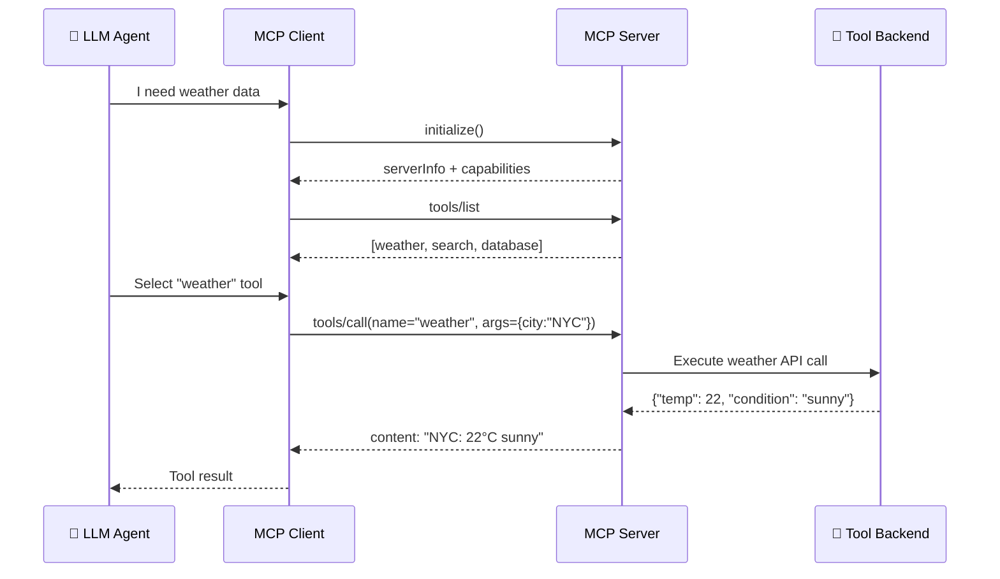
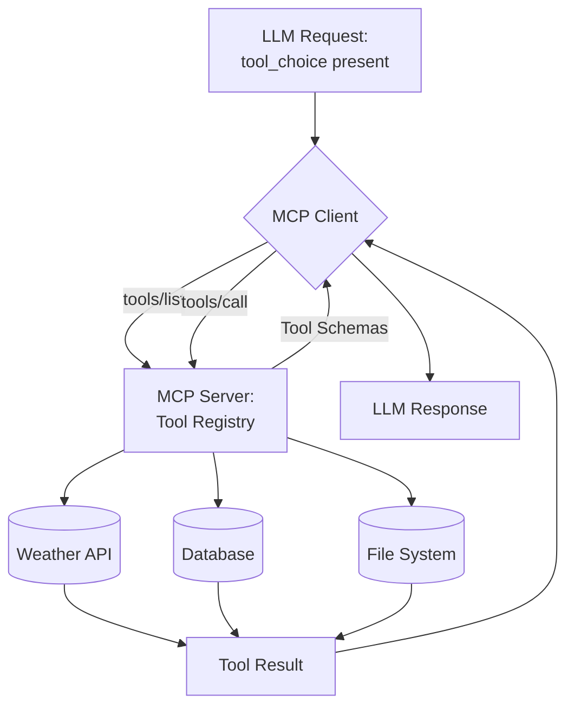
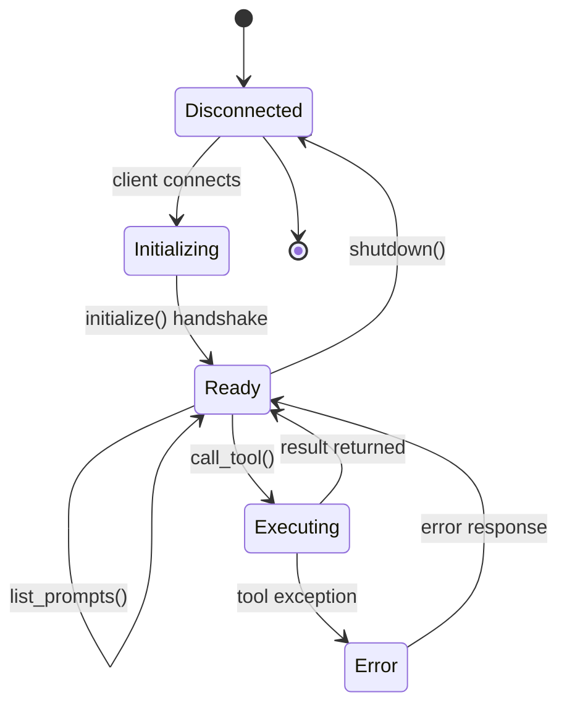

# 🔌 Model Context Protocol Deep Dive

## 🎯 Learning Objectives

- Diagnose why **REST APIs break agent tool ecosystems** and how MCP solves dynamic tool discovery
- Master the **MCP architecture**: client, server, transport layers, and initialization handshake
- Build **custom MCP tool servers** in Python with weather, database, and filesystem tools
- Understand **MCP Resources and Prompts** protocols for template-based interaction
- Connect MCP to your LangGraph Research Agent for runtime tool expansion

---

## Introduction

Every agent you have built — whether the Research → Fact-Audit → Synthesis pipeline in your [[../../03 - AI Agents y Agentic Systems/13 - Sistemas Multi-Agente/01 - Arquitecturas Multi-Agente.md|Multi-Agent Research System]] or the StayBot property management agent — relies on tools. Tools are how agents escape the text sandbox and affect the world. But the way tools are currently integrated is fundamentally broken: every framework hardcodes tool definitions, every LLM provider uses a different schema, and adding a new tool requires code changes and redeployment. This is the **agent-tool communication problem**.

The Model Context Protocol (MCP), introduced by Anthropic in late 2024, solves this by providing a universal client-server protocol for tool discovery and invocation. Think of MCP as what USB did for peripherals: instead of every device requiring a custom driver (every tool requiring framework-specific integration), you plug into a standard interface. An MCP-compatible agent can discover and invoke any MCP-compatible tool without knowing about it at development time. For your portfolio, this means your Research agent could discover new search APIs, your Fact-Audit agent could pick up new verification tools, and your Synthesis agent could access new formatting backends — all without touching the LangGraph graph definition.

Protocols are the missing layer between [[../../05 - MLOps y Produccion/20 - Deployment y Serving/02 - Model Serving Patterns.md|model serving patterns]] and agent orchestration. Just as gRPC standardized microservice communication and REST standardized web APIs, MCP standardizes LLM-tool interaction. Understanding this protocol layer is what separates framework users from AI infrastructure engineers.

---

## Module 1: The Agent-Tool Communication Problem

### 1.1 Theoretical Foundation 🧠

The dominant paradigm for tool-calling in 2023-2024 was **schema-injected function calling**: the developer defines a JSON schema for each tool, injects it into the system prompt or API call, and the LLM returns structured JSON indicating which tool to call and with what arguments. This works for a single agent with a handful of known tools but fails catastrophically at scale.

The core tension is the **static vs. dynamic tool binding problem**. When you build a LangGraph agent, you define tools as Python functions with decorators or explicit tool objects at graph construction time. Every tool is a compile-time dependency. If you want to add a new search API, a new database connector, or a new file parser, you must modify the graph code, add the tool definition, rebuild, and redeploy. In a multi-agent system like your Research System, this means every agent in the pipeline must be individually updated whenever a new capability is added.

MCP inverts this: tools are **discovered at runtime** through a standardized registry. The agent does not know what tools exist when it is deployed. It asks the MCP server "what can you do?" and the server responds with a list of tools, their schemas, and their descriptions. This is the same pattern that made service discovery work in microservices — Consul, etcd, and Kubernetes DNS all solved the "how do services find each other" problem. MCP solves the equivalent problem for agent tools.

### 1.2 Mental Model 📐

The problem MCP solves:

```
┌─────────────────────────────────────────────────────────────┐
│  WITHOUT MCP: Hardcoded Tool Binding                        │
│                                                             │
│  ┌──────────┐     ┌──────────────┐     ┌──────────────────┐ │
│  │ LangGraph│────▶│ Hardcoded    │────▶│ WeatherTool()    │ │
│  │  Agent   │     │ Tool Registry│     │ TavilySearch()   │ │
│  │          │     │ (in code)    │     │ DBTool()         │ │
│  └──────────┘     └──────────────┘     └──────────────────┘ │
│                                                             │
│  Problem: Adding a new tool = code change + redeploy        │
│  Problem: Each framework has its own tool schema            │
└─────────────────────────────────────────────────────────────┘

┌─────────────────────────────────────────────────────────────┐
│  WITH MCP: Dynamic Tool Discovery                           │
│                                                             │
│  ┌──────────┐     ┌──────────────┐     ┌──────────────────┐ │
│  │ LangGraph│     │   MCP Client │     │ MCP Server A     │ │
│  │  Agent   │────▶│ (discovery)  │────▶│ ├─ WeatherTool   │ │
│  │          │     │              │     │ ├─ SearchTool    │ │
│  └──────────┘     │              │     │ └─ DBQueryTool   │ │
│                   │ tools/list   │     └──────────────────┘ │
│                   │ tools/call   │                          │
│                   └──────────────┘     ┌──────────────────┐ │
│                                        │ MCP Server B     │ │
│                                        │ ├─ FileParser    │ │
│                                        │ └─ WebScraper    │ │
│                                        └──────────────────┘ │
│                                                             │
│  Benefit: Adding a new tool = start a new MCP server        │
│  Benefit: Any MCP-compatible client can use any server      │
└─────────────────────────────────────────────────────────────┘
```

### 1.3 Syntax and Semantics 📝

The existing brittle approach:

```python
# FRAGILE: Hardcoded tools in LangGraph
from langgraph.prebuilt import ToolNode

def weather(city: str) -> str:
    """Get weather for a city. Call this when user asks about weather."""
    return f"Weather in {city}: 22°C, sunny"

def search(query: str) -> str:
    """Search the web. Call this for research questions."""
    return f"Search results for: {query}"

# Tools embedded in graph — cannot change without redeploy
tool_node = ToolNode([weather, search])
```

The MCP approach replaces this with a client that queries a server:

```python
# ROBUST: MCP client discovers tools at runtime
async with stdio_client(server_params) as (read, write):
    async with ClientSession(read, write) as session:
        await session.initialize()
        tools = await session.list_tools()
        # tools.tools is a list[Tool] — discovered, not hardcoded
        result = await session.call_tool("weather", {"city": "Medellín"})
```

### 1.4 Visual Representation 🖼️





---

## Module 2: MCP Architecture

### 2.1 Theoretical Foundation 🧠

MCP follows a strict **client-host-server** architecture. The **host** is the application that wants to use AI capabilities (your LangGraph agent, a chat UI, an IDE). The **client** is a protocol client maintained by the host — it manages the connection lifecycle with MCP servers. The **server** exposes tools, resources, and prompts through a well-defined protocol.

This three-layer model is deliberate. The host owns the user experience and the LLM integration. The client handles protocol concerns: connection management, capability negotiation, and message routing. The server owns the tool implementations. Separation of concerns means you can swap the host (from LangGraph to CrewAI to a custom FastAPI app) without touching the servers, and you can add new servers without touching the host.

Transport is a critical design choice. MCP supports three transports:
- **stdio**: Server runs as a subprocess, communication via stdin/stdout. Ideal for local development and single-machine deployments.
- **HTTP with Server-Sent Events (SSE)**: Server exposes an HTTP endpoint; client connects via SSE stream. Ideal for remote tool servers and cloud deployments.
- **WebSocket (experimental)**: Full-duplex persistent connection. Ideal for long-running agent sessions with streaming tool results.

### 2.2 Mental Model 📐

```
┌─────────────────────────────────────────────────────────────────┐
│  MCP Protocol Stack                                              │
│                                                                  │
│  ┌───────────────────────────────────────────────────────────┐  │
│  │  Host Layer (LangGraph, Claude Desktop, VS Code)           │  │
│  │  ┌─────────────┐  ┌──────────────┐  ┌─────────────────┐   │  │
│  │  │ Tool Routing │  │ Prompt Mgmt  │  │ Resource Access │   │  │
│  │  └──────┬───────┘  └──────┬───────┘  └────────┬────────┘   │  │
│  └─────────┼─────────────────┼───────────────────┼────────────┘  │
│            │                 │                   │                │
│  ┌─────────▼─────────────────▼───────────────────▼────────────┐  │
│  │  MCP Client (Protocol Handler)                             │  │
│  │  └─ initialize → list_tools → call_tool → shutdown         │  │
│  │  └─ Transport: stdio | HTTP+SSE | WebSocket                │  │
│  └──────────────────────────┬─────────────────────────────────┘  │
│                             │ JSON-RPC 2.0                       │
│  ┌──────────────────────────▼─────────────────────────────────┐  │
│  │  MCP Server                                                │  │
│  │  ├─ tools/     → tool schemas + execution                  │  │
│  │  ├─ resources/ → URI-templated content access              │  │
│  │  └─ prompts/   → template-based prompt generation          │  │
│  └────────────────────────────────────────────────────────────┘  │
└─────────────────────────────────────────────────────────────────┘
```

### 2.3 Syntax and Semantics 📝

MCP uses **JSON-RPC 2.0** as its message format. Every interaction is a request-response or notification.

Server-side implementation pattern:

```python
from mcp.server import Server, stdio_server
from mcp.types import Tool, TextContent

app = Server("my-tool-server")

@app.list_tools()
async def list_tools() -> list[Tool]:
    return [
        Tool(
            name="get_weather",
            description="Get current weather for a city",
            inputSchema={
                "type": "object",
                "properties": {
                    "city": {
                        "type": "string",
                        "description": "City name"
                    }
                },
                "required": ["city"]
            }
        )
    ]

@app.call_tool()
async def call_tool(name: str, arguments: dict) -> list[TextContent]:
    if name == "get_weather":
        city = arguments["city"]
        return [TextContent(type="text", text=f"Weather in {city}: 22°C")]
```

### 2.4 Visual Representation 🖼️



---

## Module 3: MCP Tool Servers

### 3.1 Theoretical Foundation 🧠

An MCP tool server is a standalone process that exposes a set of tools through the MCP protocol. The server defines its own lifecycle — initialization, tool listing, and tool execution — independently of any client. This decoupling is the key insight: tool servers are **deployable artifacts** that can be versioned, scaled, and monitored independently of the agents that use them.

The tool schema follows JSON Schema specification, making it compatible with OpenAI function calling, Anthropic tool use, and Google's function declaration. This is not accidental — MCP was designed to be the **lingua franca** that all LLM providers can consume. A single MCP tool definition works with Claude, GPT-4, Gemini, and open-source models through any framework.

### 3.2 Mental Model 📐

```
┌──────────────────────────────────────────────────────────┐
│  MCP Server Deployment Patterns                           │
│                                                           │
│  Pattern 1: stdio (Local Development)                     │
│  ┌──────────┐     stdin/stdout     ┌─────────────────┐   │
│  │  Agent   │◀────────────────────▶│ MCP Server      │   │
│  │  Process │                      │ (child process) │   │
│  └──────────┘                      └─────────────────┘   │
│                                                           │
│  Pattern 2: HTTP+SSE (Cloud Deployment)                   │
│  ┌──────────┐     HTTP POST        ┌─────────────────┐   │
│  │  Agent   │─────────────────────▶│ MCP Server      │   │
│  │  (Client)│◀──── SSE Stream ────│ (Docker/K8s)    │   │
│  └──────────┘                      └─────────────────┘   │
│                                                           │
│  Pattern 3: Multi-Server Gateway                          │
│  ┌──────────┐     ┌─────────┐     ┌─────────────────┐   │
│  │  Agent   │────▶│  MCP    │────▶│ Weather Server  │   │
│  │          │     │ Gateway │────▶│ Search Server   │   │
│  └──────────┘     │         │────▶│ Database Server │   │
│                   └─────────┘     └─────────────────┘   │
└──────────────────────────────────────────────────────────┘
```

### 3.3 Syntax and Semantics 📝

Complete weather MCP server:

```python
import httpx
from mcp.server import Server, NotificationOptions
from mcp.server.models import InitializationCapabilities
from mcp.server.stdio import stdio_server
from mcp.types import Tool, TextContent, ImageContent
import mcp.types as types

weather_server = Server("weather-server")

@weather_server.list_tools()
async def list_tools() -> list[Tool]:
    return [
        Tool(
            name="get_current_weather",
            description="Get real-time weather conditions for a city using OpenWeatherMap API",
            inputSchema={
                "type": "object",
                "properties": {
                    "city": {"type": "string", "description": "City name, e.g. 'London'"},
                    "units": {
                        "type": "string",
                        "enum": ["metric", "imperial"],
                        "default": "metric"
                    }
                },
                "required": ["city"]
            }
        ),
        Tool(
            name="get_forecast",
            description="Get 5-day weather forecast for a city",
            inputSchema={
                "type": "object",
                "properties": {
                    "city": {"type": "string"},
                    "days": {"type": "integer", "minimum": 1, "maximum": 5, "default": 3}
                },
                "required": ["city"]
            }
        )
    ]

@weather_server.call_tool()
async def call_tool(name: str, arguments: dict) -> list[TextContent]:
    if name == "get_current_weather":
        city = arguments["city"]
        units = arguments.get("units", "metric")
        async with httpx.AsyncClient() as client:
            response = await client.get(
                "https://api.openweathermap.org/data/2.5/weather",
                params={"q": city, "units": units, "appid": "YOUR_API_KEY"}
            )
            data = response.json()
            result = (
                f"🌍 {data['name']}, {data['sys']['country']}\n"
                f"🌡️ {data['main']['temp']}°{'C' if units == 'metric' else 'F'}\n"
                f"💧 Humidity: {data['main']['humidity']}%\n"
                f"🌬️ Wind: {data['wind']['speed']} m/s\n"
                f"☁️ {data['weather'][0]['description'].title()}"
            )
            return [TextContent(type="text", text=result)]
    elif name == "get_forecast":
        city = arguments["city"]
        days = arguments.get("days", 3)
        return [TextContent(type="text", text=f"Forecast for {city}: {days} days of data")]

async def main():
    async with stdio_server() as (read_stream, write_stream):
        await weather_server.run(
            read_stream,
            write_stream,
            InitializationCapabilities(
                sampling={},
                experimental={},
                prompts={},
                resources={}
            )
        )
```

Database query MCP server:

```python
import sqlite3
from mcp.server import Server
from mcp.types import Tool, TextContent

db_server = Server("database-server")

@db_server.list_tools()
async def list_tools() -> list[Tool]:
    return [
        Tool(
            name="query_database",
            description="Execute a read-only SQL query against the application database",
            inputSchema={
                "type": "object",
                "properties": {
                    "query": {
                        "type": "string",
                        "description": "SQL SELECT query (read-only)"
                    }
                },
                "required": ["query"]
            }
        )
    ]

@db_server.call_tool()
async def call_tool(name: str, arguments: dict) -> list[TextContent]:
    if name == "query_database":
        query = arguments["query"].strip().upper()
        if not query.startswith("SELECT"):
            return [TextContent(type="text", text="Error: Only SELECT queries allowed")]
        conn = sqlite3.connect("app.db")
        cursor = conn.execute(arguments["query"])
        columns = [desc[0] for desc in cursor.description]
        rows = cursor.fetchall()
        result = " | ".join(columns) + "\n" + "-" * 40 + "\n"
        for row in rows:
            result += " | ".join(str(v) for v in row) + "\n"
        conn.close()
        return [TextContent(type="text", text=result)]
```

### 3.4 Application in ML/AI Systems 🤖

For your **Multi-Agent Research System** (LangGraph/Gemma 4/Tavily API), an MCP server would expose the Tavily search, fact-audit verification, and synthesis formatting as tools. Instead of binding these in the LangGraph state, each agent node queries the MCP client for available tools:

```
Research Agent → MCP Client → list_tools() → [tavily_search, arxiv_search, news_search]
Fact-Audit Agent → MCP Client → list_tools() → [cross_reference, fact_check, source_verify]
Synthesis Agent → MCP Client → list_tools() → [markdown_format, citation_generator]
```

Adding a new search backend (e.g., Perplexity API) means starting a new MCP server — zero changes to the LangGraph graph. This is the same pattern that makes Anthropic Claude's MCP integration work: Claude Desktop connects to MCP servers for filesystem access, database queries, and web search, all discovered at runtime.

---

## Module 4: MCP Resources and Prompts

### 4.1 Theoretical Foundation 🧠

Beyond tools, MCP defines two additional primitives: **Resources** and **Prompts**.

**Resources** expose structured data through URI templates. Think of them as a read-oriented complement to tools. While a tool performs an action (search, compute, send), a resource provides access to data (file contents, database records, API responses). Resources use URI templates for parameterization — `file:///logs/{date}` or `db://users/{id}` — making them self-describing and cacheable.

**Prompts** are parameterized prompt templates that the server can provide to the client. They enable server-side prompt management: a server can define "analyze_codebase" with parameters for language and focus area, and the client fills in the template. This is particularly powerful for domain-specific agents that need consistent prompting patterns.

### 4.2 Syntax and Semantics 📝

```python
@weather_server.list_resources()
async def list_resources() -> list[types.Resource]:
    return [
        types.Resource(
            uri="weather://forecast/{city}",
            name="City Forecast",
            description="5-day forecast data for a city",
            mimeType="application/json"
        )
    ]

@weather_server.read_resource()
async def read_resource(uri: str) -> list[types.TextResourceContents]:
    city = uri.split("/")[-1]
    return [types.TextResourceContents(
        uri=uri,
        mimeType="application/json",
        text=f'{{"city": "{city}", "forecast": []}}'
    )]
```

### 4.3 Common Pitfalls ⚠️ + Tips

| Pitfall | Consequence | Solution |
|---------|-------------|----------|
| Tool schema too vague | LLM calls wrong tool or passes malformed args | Write precise descriptions; include examples in schema |
| Blocking IO in async server | Server hangs, timeouts cascade | Use `httpx.AsyncClient`, async DB drivers |
| No tool timeout | Agent waits forever on hung tool | Set per-tool timeout; return partial results |
| Missing error context | Agent cannot recover from failure | Return structured errors with recovery hints |
| Transport mismatch | Production uses stdio, crashes on load | Use HTTP+SSE for multi-client, stdio for dev |

> 💡 **Tip**: Test MCP servers with the MCP Inspector (`npx @modelcontextprotocol/inspector`) before connecting them to your agent. It provides a UI for `list_tools`, `call_tool`, and `list_resources` like Postman for APIs.

---

## 📦 Compression Code

```python
# MCP_CORE: Model Context Protocol
# Architecture: Host → Client → Server (JSON-RPC 2.0 over stdio/SSE/WS)
# Primitives: tools (actions), resources (data access), prompts (templates)
# Flow: initialize → tools/list → tools/call → result → shutdown
# Key: dynamic tool discovery replaces hardcoded tool bindings

from mcp import ClientSession, StdioServerParameters
from mcp.client.stdio import stdio_client

async def discover_and_call():
    server_params = StdioServerParameters(command="python", args=["weather_server.py"])
    async with stdio_client(server_params) as (read, write):
        async with ClientSession(read, write) as session:
            await session.initialize()
            tools = await session.list_tools()
            result = await session.call_tool("get_weather", {"city": "Medellín"})
```

## 🎯 Documented Project: MCP Tool Registry for Research Agent

This project creates an MCP server ecosystem for your Multi-Agent Research System:

1. **Weather MCP Server** — exposes `get_current_weather` and `get_forecast` tools. Runs as a stdio subprocess.
2. **Database MCP Server** — exposes `query_database` for read-only SQL access. Runs as an HTTP+SSE server in Docker.
3. **Search MCP Server** — wraps Tavily API as MCP tools. Extensible: add Perplexity, Brave, or ArXiv search without agent changes.
4. **MCP Gateway** — single entry point that routes to all servers. Agent connects to one endpoint, discovers all tools.

```
research-mcp/
├── servers/
│   ├── weather_server.py        # Weather tool MCP server
│   ├── database_server.py       # SQL query MCP server
│   └── search_server.py         # Tavily search MCP server
├── gateway/
│   ├── gateway.py               # Multi-server MCP router
│   └── Dockerfile
└── tests/
    └── test_tools.py            # Integration tests
```

## 🎯 Key Takeaways

- MCP replaces hardcoded tool bindings with runtime tool discovery via JSON-RPC 2.0
- The three-transport design (stdio, HTTP+SSE, WebSocket) covers local dev through cloud deployment
- MCP servers are independently deployable, versionable, and monitorable artifacts
- Resources expose data (URI templates), Prompts expose prompt templates — both first-class MCP primitives

## References

- MCP Specification: https://spec.modelcontextprotocol.io
- MCP Python SDK: https://github.com/modelcontextprotocol/python-sdk
- Anthropic MCP Blog: https://www.anthropic.com/news/model-context-protocol
- MCP Inspector: `npx @modelcontextprotocol/inspector`
- [[../../03 - AI Agents y Agentic Systems/12 - Frameworks y Orquestacion/04 - Despliegue y Observabilidad de Agentes.md|Agent Deployment & Observability]]
