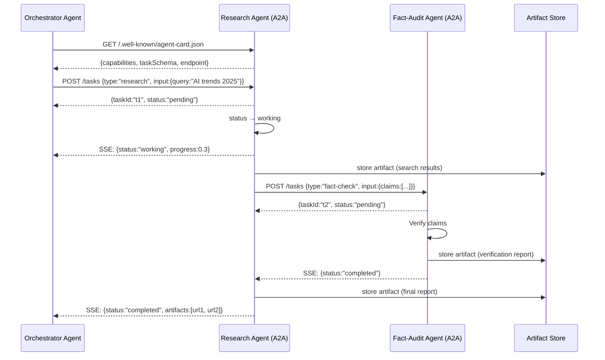
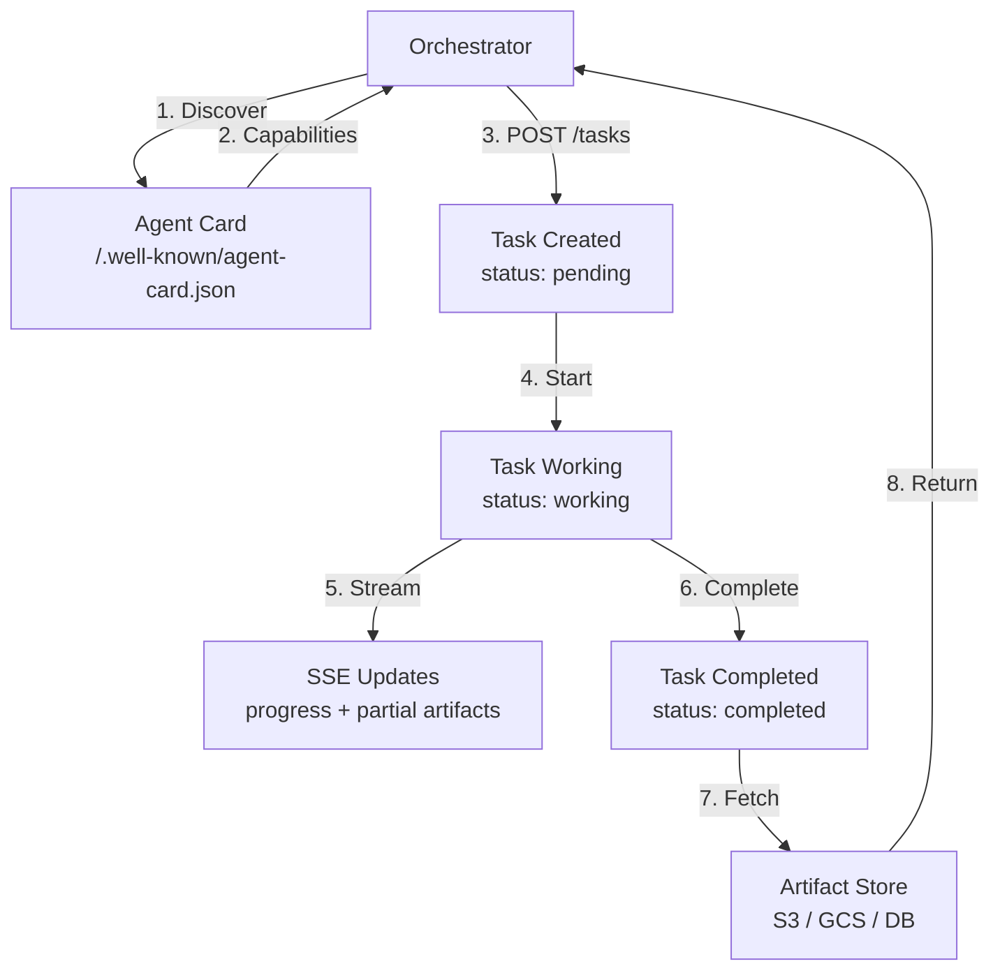

# 🤝 A2A Agent-to-Agent Protocol

## 🎯 Learning Objectives

- Diagnose the **multi-agent communication fragmentation** problem across frameworks
- Master **A2A architecture**: agent cards, task lifecycle, artifacts, and streaming updates
- Compare **MCP vs A2A** — when to use each protocol and how they complement each other
- Build an **A2A-compliant research agent** with agent card, task handler, and artifact storage
- Connect A2A to your StayBot Airbnb Agent for standardized subagent delegation

---

## Introduction

Your **Multi-Agent Research System** uses LangGraph's state graph to coordinate Research, Fact-Audit, and Synthesis agents. Your **StayBot Airbnb Agent** uses CrewAI for crew-based task delegation. Both systems work — but what happens when you need a Research agent built in LangGraph to delegate a verification subtask to an agent built in CrewAI? Or when a third-party booking agent needs to query your calendar agent? Today, the answer is: you write custom glue code, with ad-hoc APIs and fragile serialization, for every pair of agents.

The Agent-to-Agent (A2A) protocol, announced by Google in early 2025, solves this by providing a standard for how agents discover each other, delegate tasks, track progress, and exchange artifacts. Where MCP standardizes LLM ↔ tool communication, A2A standardizes agent ↔ agent communication. Together, they form the two axes of agent interoperability.

For your portfolio, A2A would transform StayBot from a monolithic CrewAI workflow into a network of specialized subagents — a calendar agent, a pricing agent, a messaging agent — each independently developed and deployed, all communicating through a standard protocol. Your Research System could accept task delegations from external agents, making it not just a pipeline but a service.

The mindset shift is from [[../../03 - AI Agents y Agentic Systems/13 - Sistemas Multi-Agente/02 - Comunicacion entre Agentes.md|ad-hoc agent communication]] patterns to a protocol that any framework can implement. Just as HTTP let any web server talk to any browser, A2A lets any agent talk to any other agent.

---

## Module 1: The Multi-Agent Communication Problem

### 1.1 Theoretical Foundation 🧠

Multi-agent systems face a communication challenge that single-agent systems never encounter: **heterogeneous agent contracts**. When you build a single LangGraph agent, the communication is between the LLM and tools — and MCP solves that. But when Agent A (built in LangGraph) needs to delegate work to Agent B (built in CrewAI), Agent B's interface is whatever the developer decided it should be. There is no standard way to say "here is a task, tell me when you are done, and return these artifacts."

The A2A protocol defines four concepts that make this possible:
- **Agent Card**: A self-describing manifest (like an OpenAPI spec for agents) that lists capabilities, input/output schemas, endpoint, and authentication requirements.
- **Task**: A unit of work with a lifecycle (pending → working → completed/failed/cancelled), unique ID, and associated artifacts.
- **Artifact**: Any output produced during task execution — text, files, structured data, streaming updates.
- **Streaming**: Tasks can emit partial results as they progress, enabling real-time multi-agent collaboration.

### 1.2 Mental Model 📐

```
┌────────────────────────────────────────────────────────────────┐
│  WITHOUT A2A: Fragmented Agent Communication                   │
│                                                                 │
│  ┌──────────┐  custom JSON   ┌──────────┐  protobuf  ┌───────┐ │
│  │ Research │───────────────▶│ FactAudit│──────────▶│Synth  │ │
│  │ (LangGr) │                │ (CrewAI) │            │(AutoG)│ │
│  └──────────┘                └──────────┘            └───────┘ │
│       │                           │                      │      │
│       │ REST API                  │ WebSocket            │ Redis│
│       ▼                           ▼                      ▼      │
│  3 different protocols, 3 different serialization formats       │
│  Adding a 4th agent = new integration + new glue code           │
└────────────────────────────────────────────────────────────────┘

┌────────────────────────────────────────────────────────────────┐
│  WITH A2A: Standardized Agent Communication                     │
│                                                                 │
│  ┌──────────┐  A2A Task   ┌──────────┐  A2A Task   ┌───────┐  │
│  │ Research │────────────▶│ FactAudit│────────────▶│Synth  │  │
│  │ (A2A)    │             │ (A2A)    │             │(A2A)  │  │
│  └──────────┘             └──────────┘             └───────┘  │
│       │                        │                        │       │
│       └────────────────────────┼────────────────────────┘       │
│                                │                                │
│                    ┌───────────▼───────────┐                    │
│                    │  A2A Protocol Layer   │                    │
│                    │  ├─ Agent Card        │                    │
│                    │  ├─ Task Lifecycle    │                    │
│                    │  ├─ Artifact Store    │                    │
│                    │  └─ Streaming Updates │                    │
│                    └───────────────────────┘                    │
└────────────────────────────────────────────────────────────────┘
```

### 1.3 Visual Representation 🖼️



---

## Module 2: A2A Architecture (Google)

### 2.1 Theoretical Foundation 🧠

Google's A2A specification defines a REST-based protocol with optional streaming. The design philosophy emphasizes **discoverability** and **observability** — two properties that ad-hoc agent communication lacks.

**Agent Card** is the discovery mechanism. Every A2A agent exposes a standardized endpoint (`GET /.well-known/agent-card.json`) that returns a JSON document describing the agent's identity, capabilities, task schema, and connection details. This is directly inspired by the `/.well-known/` pattern from web standards (e.g., `security.txt`, `openid-configuration`). An orchestrator agent can query this endpoint and dynamically decide which subagents to delegate to — no prior knowledge required.

**Task Lifecycle** is the execution model. A task moves through states: `pending` (created but not started), `working` (in progress, with optional progress percentage), `completed` (success with artifacts), `failed` (error with reason), and `cancelled` (stopped by requestor). This lifecycle is tracked server-side, so the orchestrator can poll or receive streaming updates. The key insight: tasks are **addressable resources** — `GET /tasks/{taskId}` returns the current state and artifacts, making tasks observable at any point.

**Artifacts** decouple data from task state. Rather than embedding large results in status responses, A2A agents store artifacts separately (in object storage, a database, or the agent's own filesystem) and return URIs. This keeps the task protocol lightweight and allows artifacts to be shared across multiple consumers.

### 2.2 Mental Model 📐

```
┌──────────────────────────────────────────────────────────────┐
│  A2A Task Lifecycle State Machine                             │
│                                                               │
│              ┌─────────┐                                      │
│              │ pending │◀──────── cancel() ──────┐            │
│              └────┬────┘                         │            │
│                   │ start()                      │            │
│              ┌────▼────┐                         │            │
│    ┌────────│ working │────────┐                 │            │
│    │        └────┬────┘        │                 │            │
│    │ cancel()   │  complete()  │  fail()         │            │
│    │        ┌───▼──────┐  ┌───▼──────┐          │            │
│    └───────▶│ cancelled│  │ completed│          │            │
│             └──────────┘  └──────────┘          │            │
│                                ▲                 │            │
│                                │ cancel()        │            │
│                         ┌──────┴──────┐          │            │
│                         │   failed    │◀─────────┘            │
│                         └─────────────┘                       │
│                                                               │
│  Artifacts at each state:                                     │
│  pending   → empty                                            │
│  working   → partial results (progress artifacts)             │
│  completed → final output artifacts (URIs to files/data)      │
│  failed    → error artifacts (stack trace, context)           │
└──────────────────────────────────────────────────────────────┘
```

### 2.3 Syntax and Semantics 📝

Agent card schema:

```json
{
  "agentCard": {
    "name": "Research Agent",
    "description": "Performs multi-source web research with citation tracking",
    "url": "https://research-agent.example.com",
    "version": "1.0.0",
    "capabilities": {
      "streaming": true,
      "pushNotifications": false,
      "stateTransitionHistory": true
    },
    "taskSchema": {
      "type": "object",
      "properties": {
        "query": {"type": "string", "description": "Research question or topic"},
        "depth": {"type": "integer", "minimum": 1, "maximum": 5, "default": 3},
        "sources": {"type": "array", "items": {"type": "string"}}
      },
      "required": ["query"]
    }
  }
}
```

### 2.4 Visual Representation 🖼️



---

## Module 3: MCP vs A2A — Complete Comparison

### 3.1 Theoretical Foundation 🧠

MCP and A2A solve different problems in the agentic stack. Understanding the distinction is critical for system design decisions.

MCP operates at the **LLM ↔ Tool** boundary. When an LLM needs to call a function, MCP provides the discovery and invocation protocol. A2A operates at the **Agent ↔ Agent** boundary. When one autonomous agent needs to delegate work to another autonomous agent, A2A provides the task lifecycle and artifact exchange protocol.

They are complementary, not competitive. A single agent can be both an MCP client (to call tools) and an A2A agent (to receive task delegations). In fact, the most powerful systems use both: agents discover tools via MCP and delegate subtasks to other agents via A2A.

### 3.2 Comparison Table

| Feature | MCP | A2A |
|---------|-----|-----|
| **Communication type** | LLM ↔ Tool | Agent ↔ Agent |
| **Protocol style** | JSON-RPC 2.0 (RPC pattern) | REST + SSE (resource pattern) |
| **Discovery** | `tools/list` returns tool schemas | `GET /.well-known/agent-card.json` |
| **Task tracking** | No (stateless per call) | Yes (task lifecycle with states) |
| **Streaming** | Partial (response streaming) | Full (SSE progress updates) |
| **Artifact model** | `TextContent` / `ImageContent` in response | Separate artifact store with URIs |
| **Authentication** | Transport-level (stdio trust, HTTP auth) | Agent card declares auth scheme |
| **Cancellation** | No built-in mechanism | Explicit `cancel()` transition |
| **State observability** | Client-side only | Server-side task state queryable |
| **Created by** | Anthropic (Nov 2024) | Google (Feb 2025) |
| **Best for** | Tool ecosystem, dynamic tool binding | Multi-agent orchestration, task delegation |
| **Python SDK** | `mcp` package | Reference implementation in `google/a2a` |

### 3.3 When to Use Which

```
┌─────────────────────────────────────────────────────────────────┐
│  Decision Tree: MCP vs A2A                                      │
│                                                                  │
│  Is this about tools or agents?                                  │
│       │                                                          │
│       ├── Tools (LLM calls functions)                            │
│       │   └── Use MCP                                            │
│       │       ├── Tool discovery at runtime                      │
│       │       ├── Tool schema standardization                    │
│       │       └── Cross-framework tool sharing                   │
│       │                                                          │
│       └── Agents (autonomous delegation)                         │
│           └── Use A2A                                            │
│               ├── Task lifecycle tracking                        │
│               ├── Multi-step collaboration                       │
│               └── Streaming progress updates                     │
│                                                                  │
│  Both? Use both. Agent uses MCP for tools, A2A for delegation.   │
└─────────────────────────────────────────────────────────────────┘
```

---

## Module 4: Building an A2A Agent

### 4.1 Theoretical Foundation 🧠

An A2A agent is a web service that exposes three endpoints: the agent card endpoint, the task creation endpoint, and the task status endpoint. The minimal implementation requires a web framework (FastAPI, Flask) and a task state store (in-memory for prototyping, Redis or PostgreSQL for production).

The key design decision is the **task execution model**. Tasks can be executed synchronously (blocking until complete — simple but limits concurrency), asynchronously with polling (the orchestrator checks status periodically), or with server-sent events (the agent pushes progress updates). A2A's streaming support makes SSE the recommended approach for production.

### 4.2 Syntax and Semantics 📝

Complete A2A research agent:

```python
from fastapi import FastAPI, HTTPException
from fastapi.responses import StreamingResponse
from pydantic import BaseModel
import uuid
import json
import asyncio
from datetime import datetime
from typing import Optional

app = FastAPI(title="A2A Research Agent")

class TaskCreate(BaseModel):
    query: str
    depth: int = 3
    sources: Optional[list[str]] = None

class TaskState:
    def __init__(self, task_id: str, input_data: dict):
        self.task_id = task_id
        self.status = "pending"
        self.progress = 0.0
        self.artifacts = []
        self.error = None
        self.created = datetime.utcnow()
        self.input = input_data

tasks: dict[str, TaskState] = {}

AGENT_CARD = {
    "name": "Research Agent",
    "description": "Multi-source research with citation tracking",
    "url": "http://localhost:8000",
    "version": "1.0.0",
    "capabilities": {
        "streaming": True,
        "pushNotifications": False,
        "stateTransitionHistory": True
    },
    "taskSchema": {
        "type": "object",
        "properties": {
            "query": {"type": "string"},
            "depth": {"type": "integer", "minimum": 1, "maximum": 5, "default": 3},
            "sources": {"type": "array", "items": {"type": "string"}}
        },
        "required": ["query"]
    }
}

@app.get("/.well-known/agent-card.json")
async def get_agent_card():
    return AGENT_CARD

@app.post("/tasks")
async def create_task(task: TaskCreate):
    task_id = str(uuid.uuid4())
    tasks[task_id] = TaskState(task_id, task.dict())
    asyncio.create_task(execute_research(task_id))
    return {
        "taskId": task_id,
        "status": "pending",
        "createdAt": tasks[task_id].created.isoformat()
    }

@app.get("/tasks/{task_id}")
async def get_task(task_id: str):
    if task_id not in tasks:
        raise HTTPException(status_code=404, detail="Task not found")
    t = tasks[task_id]
    return {
        "taskId": t.task_id,
        "status": t.status,
        "progress": t.progress,
        "artifacts": t.artifacts,
        "error": t.error
    }

@app.get("/tasks/{task_id}/stream")
async def stream_task(task_id: str):
    if task_id not in tasks:
        raise HTTPException(status_code=404)
    async def event_generator():
        t = tasks[task_id]
        while t.status in ("pending", "working"):
            yield f"data: {json.dumps({'status': t.status, 'progress': t.progress})}\n\n"
            await asyncio.sleep(1)
        yield f"data: {json.dumps({'status': t.status, 'artifacts': t.artifacts})}\n\n"
    return StreamingResponse(event_generator(), media_type="text/event-stream")

async def execute_research(task_id: str):
    t = tasks[task_id]
    t.status = "working"
    for i in range(1, 6):
        await asyncio.sleep(1)
        t.progress = i / 5
    t.status = "completed"
    t.artifacts = [
        {
            "name": "research_report.md",
            "uri": f"s3://artifacts/{task_id}/report.md",
            "mimeType": "text/markdown"
        }
    ]
```

### 4.3 Application in ML/AI Systems 🤖

For your **StayBot Airbnb Agent**, A2A transforms the monolithic workflow:

```
StayBot Orchestrator (A2A)
├── Calendar Agent (A2A)     ← checks availability
├── Pricing Agent (A2A)      ← dynamic pricing engine
├── Messaging Agent (A2A)    ← guest communication
└── Review Agent (A2A)       ← sentiment analysis on reviews
```

Each subagent is independently developed (one could be in LangGraph, another in CrewAI, a third in raw FastAPI), independently deployed, and communicates through A2A. Adding a new capability (e.g., a Maintenance Agent that coordinates repairs) means deploying a new A2A agent and registering it with the orchestrator — zero changes to existing agents.

### 4.4 Common Pitfalls ⚠️ + Tips

| Pitfall | Consequence | Solution |
|---------|-------------|----------|
| Synchronous task execution | Orchestrator blocks, no concurrency | `asyncio.create_task()` for fire-and-forget |
| In-memory task store | Tasks lost on restart | Persist to Redis or PostgreSQL |
| No artifact TTL | Storage grows unbounded | Set expiry on artifacts; use S3 lifecycle policies |
| Missing authentication | Anyone can submit tasks | Require API keys; validate on agent card |
| SSE without reconnection | Client misses updates on disconnect | Implement Last-Event-ID for resumption |

### 4.5 Knowledge Check ❓

1. What endpoint must every A2A agent expose for discovery?
2. How does the A2A task lifecycle differ from MCP's stateless tool calls?
3. Why are artifacts stored separately from task state in A2A?

---

## 📦 Compression Code

```python
# A2A_CORE: Agent-to-Agent Protocol (Google, 2025)
# Discovery: GET /.well-known/agent-card.json → capabilities + schema
# Tasks: POST /tasks → {taskId, status} → GET /tasks/{id} → {status, artifacts}
# Lifecycle: pending → working → completed | failed | cancelled
# Streaming: GET /tasks/{id}/stream → SSE with progress updates
# Key: standardized task delegation replaces ad-hoc agent communication

AGENT_CARD_ENDPOINT = "/.well-known/agent-card.json"
TASK_STATES = ["pending", "working", "completed", "failed", "cancelled"]
```

## 🎯 Documented Project: StayBot A2A Subagent Network

This project refactors the StayBot Airbnb Agent into an A2A-compatible multi-agent network:

```
staybot-a2a/
├── orchestrator/
│   ├── main.py                 # FastAPI orchestrator with A2A client
│   └── agent_card.json         # StayBot's own agent card
├── agents/
│   ├── calendar_agent.py       # Availability checking subagent
│   ├── pricing_agent.py        # Dynamic pricing subagent
│   └── messaging_agent.py      # Guest communication subagent
├── artifacts/
│   └── store.py                # S3/GCS artifact storage adapter
└── docker-compose.yml          # Multi-agent deployment
```

## 🎯 Key Takeaways

- A2A standardizes agent-to-agent communication with agent cards, task lifecycles, and artifact exchange
- MCP is for LLM ↔ tool; A2A is for agent ↔ agent — they are complementary, not competitive
- Task lifecycle (pending → working → completed/failed/cancelled) enables observable multi-agent systems
- Agent cards provide OpenAPI-style discovery — agents can find and delegate to each other at runtime

## References

- Google A2A Specification: https://github.com/google/A2A
- A2A Announcement: https://developers.googleblog.com/en/a2a-a-new-era-of-agent-interoperability/
- [[../../03 - AI Agents y Agentic Systems/13 - Sistemas Multi-Agente/02 - Comunicacion entre Agentes.md|Agent Communication]]
- [[../../03 - AI Agents y Agentic Systems/12 - Frameworks y Orquestacion/03 - CrewAI y AutoGen.md|CrewAI & AutoGen]]
