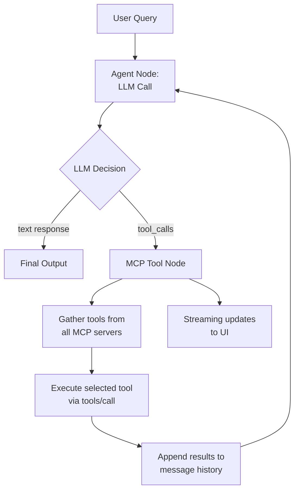
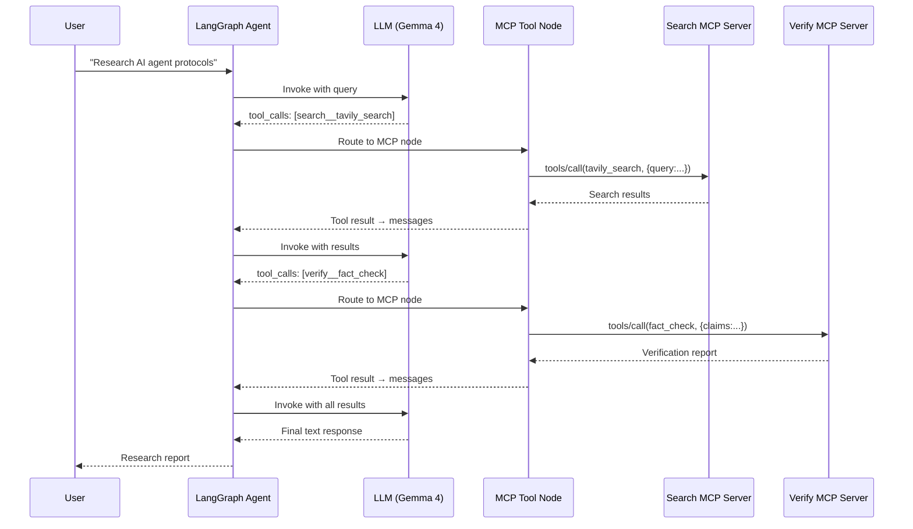

# 🔗 LangGraph + MCP Integration

## 🎯 Learning Objectives

- Design a **LangGraph node that uses MCP for dynamic tool discovery** instead of hardcoded tool bindings
- Build a complete **LangGraph + MCP agent** with runtime tool selection, streaming results, and state management
- Implement **dynamic tool selection** where agents discover tools at runtime based on context
- Master **error handling and resilience patterns** for MCP tool calls in production agents
- Extend your **Multi-Agent Research System** with MCP-powered tool nodes

---

## Introduction

Your **Multi-Agent Research System** (LangGraph/Gemma 4/Tavily API) uses a cyclic graph: Research → Fact-Audit → Synthesis → Research. Each agent node calls tools — Tavily for search, a custom function for fact verification, another for markdown formatting. Today, those tools are Python functions imported at graph construction time. If you want to switch from Tavily to Perplexity, or add a news API, or connect to a database, you modify the graph code and redeploy.

Connecting LangGraph to MCP changes this. Instead of `ToolNode([search, fact_check, format])` at graph definition time, the agent node uses an MCP client that queries `tools/list` at runtime. The LLM sees the list of available tools — discovered, not hardcoded — and selects which to call. Adding a new search backend means deploying a new MCP server. The graph never changes.

This is the step beyond framework-level agent building. You already know [[../../03 - AI Agents y Agentic Systems/12 - Frameworks y Orquestacion/01 - LangChain en Profundidad.md|LangChain and LangGraph fundamentals]]. You have built [[../../03 - AI Agents y Agentic Systems/13 - Sistemas Multi-Agente/04 - Caso Practico - Equipo de Agentes para Analisis de Mercado.md|multi-agent systems]]. Now you are architecting the protocol layer that makes those systems interoperable and extensible. This is what distinguishes an agent framework user from an AI infrastructure engineer.

---

## Module 1: Why Connect LangGraph to MCP

### 1.1 Theoretical Foundation 🧠

LangGraph's `ToolNode` class provides a clean abstraction for tool execution within a state graph. The problem is that `ToolNode` requires tools to be passed at construction time — they are a compile-time dependency of the graph. In a production system where tools may come from multiple teams, vendors, or dynamic registries, this is a fundamental limitation.

The solution is to replace `ToolNode` with a custom **MCP Tool Node** — a LangGraph node that:
1. Connects to one or more MCP servers at initialization (or lazily)
2. Calls `tools/list` to discover available tools
3. Formats the tool schemas for the LLM (OpenAI function calling format, Anthropic tool use format, etc.)
4. Routes the LLM's tool call selections to the appropriate MCP server via `tools/call`
5. Returns results to the LLM for integration into the final response

This architecture has a profound implication: the agent's tool surface is now defined by which MCP servers are running, not by which Python functions are imported. This is the same principle that made microservices scalable — decoupling service discovery from service implementation.

### 1.2 Mental Model 📐

```
┌──────────────────────────────────────────────────────────────────────┐
│  LangGraph Agent with Hardcoded Tools (Current Architecture)          │
│                                                                       │
│  ┌──────────────────────┐                                             │
│  │  StateGraph          │                                             │
│  │  ┌────────┐ ┌──────┐ │   ┌──────────────────────────┐             │
│  │  │Research│→│Fact  │ │   │  ToolNode([              │             │
│  │  │ Node   │ │Audit │ │──▶│    tavily_search,        │             │
│  │  └────────┘ │Node  │ │   │    fact_check,           │             │
│  │      ↑      └──┬───┘ │   │    markdown_format       │             │
│  │      │         │     │   │  ])                       │             │
│  │      │    ┌────▼───┐ │   └──────────────────────────┘             │
│  │      └────│Synth   │ │                                             │
│  │           │Node    │ │   All tools imported at graph definition    │
│  │           └────────┘ │   Adding a tool = code change + redeploy     │
│  └──────────────────────┘                                             │
└──────────────────────────────────────────────────────────────────────┘

┌──────────────────────────────────────────────────────────────────────┐
│  LangGraph Agent with MCP Integration (Proposed Architecture)         │
│                                                                       │
│  ┌──────────────────────┐                                             │
│  │  StateGraph          │                                             │
│  │  ┌────────┐ ┌──────┐ │   ┌──────────────────────────────────┐    │
│  │  │Research│→│Fact  │ │   │  MCP Tool Node                   │    │
│  │  │ Node   │ │Audit │ │──▶│  ┌────────────────────────────┐ │    │
│  │  └────────┘ │Node  │ │   │  │ MCP Client (Multi-Server)  │ │    │
│  │      ↑      └──┬───┘ │   │  │ ├─ Search Server (Tavily)  │ │    │
│  │      │         │     │   │  │ ├─ Verify Server (Fact)    │ │    │
│  │      │    ┌────▼───┐ │   │  │ ├─ Format Server (MD)      │ │    │
│  │      └────│Synth   │ │   │  │ └─ News Server (NEW)       │ │    │
│  │           │Node    │ │   │  └────────────────────────────┘ │    │
│  │           └────────┘ │   └──────────────────────────────────┘    │
│  │                      │                                             │
│  │  Tools discovered at runtime via tools/list                       │
│  │  Adding a tool = deploy a new MCP server                          │
│  │  Graph code NEVER changes for new tools                           │
│  └──────────────────────┘                                             │
└──────────────────────────────────────────────────────────────────────┘
```

### 1.3 Visual Representation 🖼️



---

## Module 2: Building a LangGraph MCP Node

### 2.1 Theoretical Foundation 🧠

The MCP Tool Node replaces LangGraph's built-in `ToolNode` with a custom implementation that maintains MCP client sessions and handles the protocol lifecycle. The key architectural decisions are:

**Session management**: MCP connections are stateful (initialize → use → shutdown). In a LangGraph graph that may execute for minutes, the MCP session must persist across node invocations. The solution is to store the MCP session in the graph state (for simple cases) or in a connection pool (for production).

**Schema conversion**: MCP returns tool schemas in JSON Schema format. The LLM expects OpenAI-style function definitions. The MCP node must convert between these formats transparently.

**Multi-server routing**: When an LLM selects a tool, the MCP node must know which server hosts that tool. The solution is to maintain a `{tool_name: server_id}` mapping from the `tools/list` responses.

### 2.2 Syntax and Semantics 📝

Complete LangGraph + MCP agent implementation:

```python
from typing import Annotated, Any, TypedDict
import operator
from langgraph.graph import StateGraph, END
from langgraph.prebuilt import ToolMessage
from langchain_core.messages import BaseMessage, HumanMessage, AIMessage
from langchain_google_genai import ChatGoogleGenerativeAI
from mcp import ClientSession, StdioServerParameters
from mcp.client.stdio import stdio_client
import asyncio
import json

class AgentState(TypedDict):
    messages: Annotated[list[BaseMessage], operator.add]
    mcp_tools: list[dict]
    tool_to_server: dict[str, str]

class MCPToolNode:
    def __init__(self):
        self.sessions: dict[str, ClientSession] = {}
        self.tool_registry: dict[str, Any] = {}

    async def connect_servers(self, server_configs: list[dict]) -> list[dict]:
        all_tools = []
        tool_to_server = {}
        for config in server_configs:
            server_params = StdioServerParameters(
                command=config["command"],
                args=config.get("args", [])
            )
            transport = await stdio_client(server_params).__aenter__()
            read, write = transport
            session = ClientSession(read, write)
            await session.__aenter__()
            await session.initialize()
            tools_result = await session.list_tools()
            self.sessions[config["name"]] = session
            for tool in tools_result.tools:
                tool_name = f"{config['name']}__{tool.name}"
                tool_to_server[tool_name] = config["name"]
                all_tools.append({
                    "type": "function",
                    "function": {
                        "name": tool_name,
                        "description": tool.description,
                        "parameters": tool.inputSchema
                    }
                })
        return all_tools, tool_to_server

    async def call_tool(self, tool_name: str, arguments: dict) -> str:
        server_name, original_name = tool_name.split("__", 1)
        session = self.sessions[server_name]
        result = await session.call_tool(original_name, arguments)
        return result.content[0].text

    async def shutdown(self):
        for session in self.sessions.values():
            await session.__aexit__(None, None, None)

mcp_node = MCPToolNode()

async def agent(state: AgentState) -> AgentState:
    llm = ChatGoogleGenerativeAI(model="gemma-4", temperature=0)
    messages = state["messages"]
    response = await llm.ainvoke(messages)
    return {"messages": [response]}

async def mcp_tool_node(state: AgentState) -> AgentState:
    last_message = state["messages"][-1]
    tool_calls = last_message.tool_calls
    messages = []
    for tc in tool_calls:
        result = await mcp_node.call_tool(tc["name"], tc["args"])
        messages.append(ToolMessage(content=result, tool_call_id=tc["id"]))
    return {"messages": messages}

def should_continue(state: AgentState) -> str:
    last_message = state["messages"][-1]
    if hasattr(last_message, "tool_calls") and last_message.tool_calls:
        return "mcp_tools"
    return END

async def build_graph(server_configs: list[dict]):
    tools, tool_map = await mcp_node.connect_servers(server_configs)
    graph = StateGraph(AgentState)
    graph.add_node("agent", agent)
    graph.add_node("mcp_tools", mcp_tool_node)
    graph.set_entry_point("agent")
    graph.add_conditional_edges("agent", should_continue, {"mcp_tools": "mcp_tools", END: END})
    graph.add_edge("mcp_tools", "agent")
    return graph.compile(), tools, tool_map
```

Usage with the Research System:

```python
server_configs = [
    {"name": "search", "command": "python", "args": ["servers/search_server.py"]},
    {"name": "verify", "command": "python", "args": ["servers/verify_server.py"]},
    {"name": "format", "command": "python", "args": ["servers/format_server.py"]}
]

app, tools, tool_map = await build_graph(server_configs)

result = await app.ainvoke({
    "messages": [HumanMessage(content="Research: impact of MCP on AI agents")],
    "mcp_tools": tools,
    "tool_to_server": tool_map
})
```

### 2.3 Visual Representation 🖼️



---

## Module 3: Dynamic Tool Selection

### 3.1 Theoretical Foundation 🧠

The real power of MCP + LangGraph is **context-aware tool selection**. Because `tools/list` returns all available tools at runtime, the agent can filter or prioritize tools based on the current state. This goes beyond simple LLM tool selection — it allows the graph itself to decide which tools to present to the LLM.

Consider your Research System's three-agent pipeline:

- **Research Node**: Needs search tools (Tavily, ArXiv, News API). Should not see formatting or database tools — reduces LLM confusion.
- **Fact-Audit Node**: Needs verification tools (cross-reference, source check). Should not see search tools — keeps the LLM focused.
- **Synthesis Node**: Needs formatting tools (Markdown, Citation, Diagram). Should not see raw search tools.

With MCP, each node can ask the MCP client for a filtered tool list. The same MCP servers are running, but each agent node sees only the relevant subset. This is impossible with hardcoded `ToolNode` — all tools are always visible to every node.

### 3.2 Syntax and Semantics 📝

```python
async def research_node(state: AgentState) -> AgentState:
    search_tools = [t for t in state["mcp_tools"] if "search" in t["function"]["name"]]
    llm = ChatGoogleGenerativeAI(model="gemma-4", temperature=0).bind_tools(search_tools)
    response = await llm.ainvoke(state["messages"])
    return {"messages": [response]}

async def fact_audit_node(state: AgentState) -> AgentState:
    verify_tools = [t for t in state["mcp_tools"] if "verify" in t["function"]["name"]]
    llm = ChatGoogleGenerativeAI(model="gemma-4", temperature=0).bind_tools(verify_tools)
    response = await llm.ainvoke(state["messages"])
    return {"messages": [response]}

async def synthesis_node(state: AgentState) -> AgentState:
    format_tools = [t for t in state["mcp_tools"] if "format" in t["function"]["name"]]
    llm = ChatGoogleGenerativeAI(model="gemma-4", temperature=0).bind_tools(format_tools)
    response = await llm.ainvoke(state["messages"])
    return {"messages": [response]}
```

### 3.3 Application in ML/AI Systems 🤖

For your Research System, each agent gets only the tools it needs:

```
┌────────────────────────────────────────────────────────────┐
│  Tool Visibility Per Agent Node (Context-Aware)             │
│                                                             │
│  Research Node          Fact-Audit Node     Synthesis Node  │
│  ┌──────────────┐      ┌──────────────┐    ┌────────────┐  │
│  │ tavily_search│      │ cross_ref    │    │ md_format  │  │
│  │ arxiv_search │      │ source_verify│    │ citations  │  │
│  │ news_search  │      │ fact_check   │    │ diagram    │  │
│  └──────────────┘      └──────────────┘    └────────────┘  │
│                                                             │
│  All from same MCP servers — filtered per node at runtime   │
└────────────────────────────────────────────────────────────┘
```

---

## Module 4: Error Handling and Resilience

### 4.1 Theoretical Foundation 🧠

MCP tool calls can fail for many reasons: the server process crashes, the network times out, the API rate limits, the input validation fails. In a hardcoded tool setup, errors are handled by Python try/except. In an MCP-integrated agent, errors span the protocol boundary — the client must handle transport errors, server errors, and tool execution errors differently.

Production resilience requires:
- **Per-tool timeouts**: No single tool call should block the agent indefinitely
- **Retry with backoff**: Transient failures (network, rate limits) should retry
- **Graceful degradation**: If a tool server is unavailable, the agent should continue with partial results
- **Error feedback to LLM**: The LLM should know why a tool failed so it can adjust its strategy

### 4.2 Syntax and Semantics 📝

```python
import asyncio
from contextlib import asynccontextmanager

class ResilientMCPClient:
    def __init__(self, max_retries: int = 3, timeout: float = 30.0):
        self.max_retries = max_retries
        self.timeout = timeout

    async def call_tool_with_retry(self, tool_name: str, arguments: dict) -> str:
        for attempt in range(self.max_retries):
            try:
                result = await asyncio.wait_for(
                    self._execute_tool(tool_name, arguments),
                    timeout=self.timeout
                )
                return result
            except asyncio.TimeoutError:
                if attempt == self.max_retries - 1:
                    return f"Error: Tool '{tool_name}' timed out after {self.timeout}s"
                await asyncio.sleep(2 ** attempt)
            except ConnectionError as e:
                if attempt == self.max_retries - 1:
                    return f"Error: MCP server unavailable — {str(e)}"
                await asyncio.sleep(2 ** attempt)
            except Exception as e:
                return f"Error: Tool '{tool_name}' failed — {str(e)}"

    async def _execute_tool(self, tool_name: str, arguments: dict) -> str:
        server_name, original_name = tool_name.split("__", 1)
        session = mcp_node.sessions[server_name]
        result = await session.call_tool(original_name, arguments)
        return result.content[0].text

resilient_client = ResilientMCPClient(max_retries=3, timeout=30)

async def mcp_tool_node_resilient(state: AgentState) -> AgentState:
    last_message = state["messages"][-1]
    tool_calls = last_message.tool_calls
    messages = []
    for tc in tool_calls:
        result = await resilient_client.call_tool_with_retry(tc["name"], tc["args"])
        messages.append(ToolMessage(content=result, tool_call_id=tc["id"]))
    return {"messages": messages}
```

### 4.3 Common Pitfalls ⚠️ + Tips

| Pitfall | Consequence | Solution |
|---------|-------------|----------|
| MCP session not reconnecting | All tool calls fail after network hiccup | Implement health check + auto-reconnect |
| LLM sees too many tools | Tool selection accuracy drops | Filter tools per node (dynamic selection) |
| Blocking stdio transport in async | Event loop blocked, agent hangs | Use HTTP+SSE transport for production |
| Tool results exceed context window | LLM loses earlier conversation | Summarize tool results before appending |
| No schema validation on tool args | LLM hallucinates parameters | Validate arguments against MCP inputSchema before calling |

### 4.4 Knowledge Check ❓

1. Why does LangGraph's `ToolNode` need to be replaced for MCP integration?
2. How does context-aware tool filtering reduce LLM errors in multi-node graphs?
3. What three error categories must an MCP client handle differently?

---

## 📦 Compression Code

```python
# LANGGRAPH_MCP: LangGraph + Model Context Protocol Integration
# Pattern: Replace ToolNode() with MCPToolNode() for dynamic tool discovery
# Key: tools/list at runtime → bind to LLM → tools/call via MCP → results → graph
# Resilience: per-tool timeout, retry with backoff, graceful degradation

class MCPToolNode:
    async def connect_servers(configs): ...
    async def call_tool(tool, args): ...

def build_mcp_graph(server_configs):
    graph = StateGraph(AgentState)
    graph.add_node("agent", call_llm)
    graph.add_node("mcp_tools", execute_mcp_tools)
    # Conditional routing: tool_calls → mcp_tools, else → END
```

## 🎯 Documented Project: MCP-Integrated Research Agent

This project extends your Multi-Agent Research System with MCP-powered dynamic tool nodes:

```
langgraph-mcp-research/
├── graph.py                    # LangGraph with MCP tool nodes
├── mcp_client.py               # Resilient MCP client with retry
├── tool_filter.py              # Context-aware tool selection per node
├── servers/
│   ├── search_server.py        # Tavily + ArXiv + News MCP server
│   ├── verify_server.py        # Fact verification MCP server
│   └── format_server.py        # Output formatting MCP server
├── tests/
│   ├── test_tool_discovery.py  # Verify tools/list returns expected
│   └── test_resilience.py      # Timeout and retry behavior
└── docker-compose.yml          # Multi-server + agent deployment
```

## 🎯 Key Takeaways

- MCP replaces compile-time tool binding with runtime tool discovery in LangGraph
- Each agent node can filter tools based on context — Research node sees search tools, Fact-Audit sees verify tools
- Production MCP clients need timeouts, retries, and graceful degradation for protocol-boundary failures
- The architecture separates tool availability (which servers run) from tool usage (which node calls what)

## References

- LangGraph MCP Adapter: https://github.com/langchain-ai/langgraph-mcp
- LangGraph ToolNode docs: https://langchain-ai.github.io/langgraph/how-tos/tool-calling/
- [[01 - Model Context Protocol Deep Dive.md|MCP Deep Dive (this course)]]
- [[../../03 - AI Agents y Agentic Systems/12 - Frameworks y Orquestacion/01 - LangChain en Profundidad.md|LangChain Deep Dive]]
