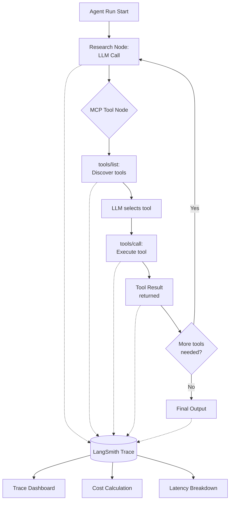
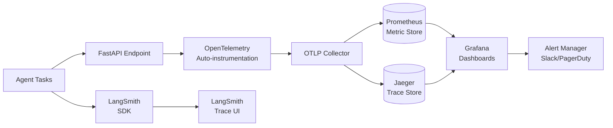

# 📊 Agent Evaluation and Observability

## 🎯 Learning Objectives

- Understand why **agent evaluation** is fundamentally different from text-output evaluation
- Master **LangSmith tracing** for debugging multi-agent LangGraph + MCP pipelines
- Implement **Braintrust evaluation suites** with human annotation integration for agent tasks
- Design an **observability stack** with OpenTelemetry, Prometheus, and Grafana for agent systems
- Connect evaluation to your **Automated LLM Evaluation Suite** portfolio project

---

## Introduction

Evaluating an LLM is straightforward: compare generated text to a reference, compute BLEU/ROUGE, or use an LLM-as-Judge. Evaluating an agent is an entirely different problem. Your Research System does not produce a single text output — it executes a multi-step workflow: calling search tools, verifying facts, synthesizing findings, potentially looping back for more research. The quality of the final report depends not just on the LLM's generation quality but on whether the right tools were called, in the right order, with the right arguments, and whether the agent recovered gracefully from failures along the way.

This is the **agent evaluation gap**. Traditional NLP metrics measure output quality. Agent evaluation must also measure **process quality**: tool call accuracy, task completion rate, latency budgets, cost per task, and failure recovery patterns. For the MCP and A2A protocols you have studied in this course, evaluation becomes even more critical — when tools are discovered at runtime (MCP) and tasks are delegated to unknown subagents (A2A), you need observability to understand what actually happened.

Your **Automated LLM Evaluation Suite** portfolio project already handles text-output evaluation with Gemma 4 as Golden Judge. This note extends that foundation into agent evaluation territory — tracing multi-step agent runs, measuring end-to-end task success, and building dashboards that make agent behavior visible. This connects to [[../../05 - MLOps y Produccion/21 - Monitoreo y Mantenimiento/02 - Monitoreo de Modelos en Produccion.md|model monitoring practices]] but adds agent-specific dimensions like tool call accuracy and workflow path analysis.

---

## Module 1: Why Agent Evaluation Is Different

### 1.1 Theoretical Foundation 🧠

Text evaluation (traditional LLM eval) operates on a single output: given input X, did the model produce output Y that matches reference Z? Agent evaluation operates on a **trajectory**: given input X, did the agent follow path P (sequence of tool calls, decisions, branches) and produce outcome O that satisfies criteria C?

This introduces new evaluation dimensions:

- **Tool call accuracy**: Did the agent call the right tool? With the right arguments? At the right time in the workflow?
- **Task completion rate**: What percentage of tasks does the agent complete successfully? (Not just "good output" — did it actually finish the job?)
- **Recovery behavior**: When a tool fails, does the agent retry intelligently? Does it fall back to an alternative? Or does it get stuck?
- **Latency and cost**: Multi-step agents can be expensive. A task that takes 15 tool calls costs 15x more than a task that takes 3. Evaluation must include efficiency metrics.
- **Safety compliance**: Did the agent refuse unsafe actions? Did it follow guardrails? Especially critical for Computer Use agents.

### 1.2 Mental Model 📐

```
┌──────────────────────────────────────────────────────────────────────┐
│  Agent Evaluation Dimensions (Multi-Dimensional Assessment)           │
│                                                                       │
│  ┌─────────────────────┐  ┌─────────────────────┐                    │
│  │  OUTPUT QUALITY     │  │  PROCESS QUALITY    │                    │
│  │                     │  │                     │                    │
│  │ ├─ Factual accuracy │  │ ├─ Tool call accuracy│                   │
│  │ ├─ Relevance        │  │ ├─ Workflow optimality│                  │
│  │ ├─ Completeness     │  │ ├─ Failure recovery  │                   │
│  │ └─ Citation quality │  │ └─ Hallucination rate│                   │
│  └─────────┬───────────┘  └──────────┬──────────┘                    │
│            │                         │                                │
│            │    ┌────────────────────┘                                │
│            │    │                                                     │
│  ┌─────────▼────▼───────────┐  ┌─────────────────────┐              │
│  │  EFFICIENCY              │  │  SAFETY             │              │
│  │                          │  │                     │              │
│  │ ├─ Tokens per task       │  │ ├─ Guardrail compliance│           │
│  │ ├─ Tool calls per task   │  │ ├─ Refusal accuracy    │           │
│  │ ├─ Time to completion    │  │ └─ PII leakage check   │           │
│  │ └─ Cost per task         │  │                     │              │
│  └──────────────────────────┘  └─────────────────────┘              │
│                                                                       │
│  Traditional LLM eval covers OUTPUT QUALITY only                     │
│  Agent eval must cover ALL FOUR dimensions                           │
└──────────────────────────────────────────────────────────────────────┘
```

### 1.3 Comparison: LLM Evaluation vs Agent Evaluation

| Dimension | LLM Evaluation | Agent Evaluation |
|-----------|---------------|------------------|
| **What is evaluated** | Single text output | Multi-step trajectory |
| **Primary metric** | Accuracy, BLEU, ROUGE | Task success rate |
| **Tool interaction** | Not applicable | Tool call accuracy, argument correctness |
| **Workflow path** | Not applicable | Optimal vs actual path taken |
| **Failure modes** | Hallucination, irrelevance | Wrong tool, infinite loop, timeout |
| **Cost dimension** | Tokens for one call | Tokens across all calls + tool costs |
| **Evaluation method** | Reference comparison, LLM-as-Judge | Trajectory analysis, human review |
| **Tools** | RAGAS, DeepEval, lm-eval | LangSmith, Braintrust, AgentOps |

---

## Module 2: LangSmith and AgentOps

### 2.1 Theoretical Foundation 🧠

LangSmith (by LangChain) and AgentOps are the two leading observability platforms purpose-built for agent systems. They share a core concept: **tracing every step of an agent run and making the trace queryable**.

A trace is a tree of spans. Each span represents an operation: an LLM call, a tool invocation, a state update, a conditional edge traversal. For a LangGraph + MCP agent, a typical trace includes:
- Root span: the overall agent invocation
- Agent node span: the LLM reasoning step
- MCP client span: `tools/list` call to discover tools
- Tool call span: `tools/call` invocation with arguments and result
- Conditional edge span: which branch the agent chose

The critical insight: traces make **agent behavior debuggable**. When your Research agent produces a poor report, you can look at the trace and see exactly which tool calls it made, what results they returned, and where the reasoning went wrong. This is impossible with plain logging.

### 2.2 Syntax and Semantics 📝

LangSmith integration with LangGraph + MCP agent:

```python
import os
from langsmith import Client, traceable
from langsmith.wrappers import wrap_openai
from openai import AsyncOpenAI

os.environ["LANGCHAIN_TRACING_V2"] = "true"
os.environ["LANGCHAIN_API_KEY"] = "ls_..."
os.environ["LANGCHAIN_PROJECT"] = "mcp-research-agent"

langsmith_client = Client()

@traceable(run_type="chain", name="MCP Research Agent")
async def research_agent(query: str) -> dict:
    tools = await mcp_node.connect_servers(server_configs)
    result = await app.ainvoke({
        "messages": [HumanMessage(content=query)],
        "mcp_tools": tools[0],
        "tool_to_server": tools[1]
    })
    langsmith_client.create_feedback(
        run_id=result["run_id"],
        key="task_success",
        score=1.0 if result.get("completed") else 0.0
    )
    return result

@traceable(run_type="tool", name="MCP Tool Call")
async def traced_tool_call(server: str, tool: str, args: dict) -> str:
    result = await resilient_client.call_tool_with_retry(
        f"{server}__{tool}", args
    )
    return result
```

Cost tracking per agent run:

```python
from langsmith import Client

def track_agent_cost(run_id: str, token_usage: dict, tool_calls: int):
    client = Client()
    total_tokens = token_usage.get("total_tokens", 0)
    cost_per_1k = 0.000125  # Gemma 4 pricing estimate
    llm_cost = (total_tokens / 1000) * cost_per_1k
    tool_cost = tool_calls * 0.001  # Estimate per tool call

    client.create_feedback(run_id=run_id, key="llm_cost", score=llm_cost)
    client.create_feedback(run_id=run_id, key="tool_cost", score=tool_cost)
    client.create_feedback(run_id=run_id, key="total_cost", score=llm_cost + tool_cost)
    client.create_feedback(run_id=run_id, key="tool_calls_count", score=tool_calls)
```

### 2.3 Mental Model 📐

```
┌──────────────────────────────────────────────────────────────────────┐
│  Agent Trace Structure (LangSmith / AgentOps)                        │
│                                                                       │
│  ┌─────────────────────── ROOT SPAN ──────────────────────────────┐ │
│  │  Trace: research_agent("AI agent protocols 2025")              │ │
│  │  Duration: 12.3s  │  Cost: $0.032  │  Status: completed         │ │
│  │                                                                  │ │
│  │  ┌─── LLM Call Span ─────────────────────────────────────────┐ │ │
│  │  │  Node: research_node                                       │ │ │
│  │  │  Model: gemma-4  │  Tokens: 450/230  │  Latency: 1.2s     │ │ │
│  │  │  Decision: tool_calls → [search__tavily_search]            │ │ │
│  │  └───────────────────────────────────────────────────────────┘ │ │
│  │                                                                  │ │
│  │  ┌─── Tool Call Span ────────────────────────────────────────┐ │ │
│  │  │  Tool: search__tavily_search                               │ │ │
│  │  │  Server: search  │  Args: {query: "AI agent protocols"}    │ │ │
│  │  │  Result: 5 search results returned  │  Latency: 2.1s      │ │ │
│  │  └───────────────────────────────────────────────────────────┘ │ │
│  │                                                                  │ │
│  │  ┌─── LLM Call Span ─────────────────────────────────────────┐ │ │
│  │  │  Node: research_node (second pass)                         │ │ │
│  │  │  Input: original query + search results                    │ │ │
│  │  │  Decision: text_response (no more tools needed)            │ │ │
│  │  └───────────────────────────────────────────────────────────┘ │ │
│  │                                                                  │ │
│  │  ┌─── Feedback ──────────────────────────────────────────────┐ │ │
│  │  │  task_success: 1.0  │  total_cost: 0.032  │  steps: 3    │ │ │
│  │  └───────────────────────────────────────────────────────────┘ │ │
│  └──────────────────────────────────────────────────────────────────┘ │
└──────────────────────────────────────────────────────────────────────┘
```

### 2.4 Visual Representation 🖼️



---

## Module 3: Braintrust and Evaluation Suites

### 3.1 Theoretical Foundation 🧠

Braintrust takes a different approach from LangSmith: it focuses on **evaluation-driven development** rather than trace-based debugging. The workflow is:

1. **Define an eval dataset**: A set of tasks with expected outcomes, tool call sequences, and quality rubrics
2. **Run the agent against the dataset**: Execute each task and collect full traces
3. **Score with evaluators**: Apply automated scoring functions (LLM-as-Judge, exact match, tool call comparison) plus optional human review
4. **Compare experiments**: When you change the agent (new MCP server, different model, new prompt), re-run the eval and see if scores improved

Braintrust is particularly well-suited for agent evaluation because it supports **custom scoring functions** that can inspect the full agent trajectory, not just the final output. You can write a scorer that checks "did the agent call the Tavily search tool with a query that contains the user's original question?" — something impossible with text-only evaluation.

### 3.2 Syntax and Semantics 📝

```python
from braintrust import Eval, traced
import asyncio

async def agent_task(input_data: str) -> str:
    result = await app.ainvoke({
        "messages": [HumanMessage(content=input_data)]
    })
    return result["messages"][-1].content

def task_success_scorer(output: str, expected: dict) -> float:
    required_keywords = expected.get("required_keywords", [])
    found = sum(1 for kw in required_keywords if kw.lower() in output.lower())
    return found / len(required_keywords) if required_keywords else 1.0

def tool_call_accuracy_scorer(metadata: dict, expected: dict) -> float:
    expected_tools = expected.get("expected_tools", [])
    actual_tools = metadata.get("tool_calls", [])
    if not expected_tools:
        return 1.0
    matches = sum(1 for t in expected_tools if t in actual_tools)
    return matches / len(expected_tools)

dataset = [
    {
        "input": "What are the latest developments in AI agent protocols?",
        "expected": {
            "required_keywords": ["MCP", "A2A", "agent", "protocol"],
            "expected_tools": ["search__tavily_search"],
            "min_sources": 3
        }
    },
    {
        "input": "Compare weather in Medellín vs Bogotá",
        "expected": {
            "required_keywords": ["temperature", "Medellín", "Bogotá"],
            "expected_tools": ["weather__get_current_weather"]
        }
    }
]

await Eval(
    "mcp-research-agent-v1",
    data=lambda: [{"input": d["input"], "expected": d["expected"]} for d in dataset],
    task=agent_task,
    scores=[task_success_scorer, tool_call_accuracy_scorer],
    experiment_name="baseline-gemma4",
    metadata={"model": "gemma-4", "framework": "langgraph+mcp"}
)
```

### 3.3 Application in ML/AI Systems 🤖

This directly extends your **Automated LLM Evaluation Suite**:

```
Existing:    LLM Evaluation Suite → text output + semantic drift detection
Extension:   Agent Evaluation Suite → trajectory analysis + tool call accuracy

Integration:
  ┌──────────────────────────────────────┐
  │  Automated LLM Evaluation Suite      │
  │                                      │
  │  ┌────────────┐    ┌───────────────┐ │
  │  │ Text Eval  │    │ Agent Eval    │ │  ← NEW
  │  │ ─ Gemma 4  │    │ ─ LangSmith   │ │
  │  │   Judge    │    │ ─ Braintrust  │ │
  │  │ ─ RAGAS    │    │ ─ Tool Call   │ │
  │  │ ─ DeepEval │    │   Scoring     │ │
  │  └────────────┘    └───────────────┘ │
  │                                      │
  │  ─ AWS SageMaker + GCP Vertex AI    │
  │  ─ Real-time semantic drift detection│
  └──────────────────────────────────────┘
```

---

## Module 4: Observability Stack

### 4.1 Theoretical Foundation 🧠

LangSmith and Braintrust are application-level observability for agents. For production infrastructure, you need system-level observability: OpenTelemetry for distributed tracing, Prometheus for metrics collection, and Grafana for visualization.

The three pillars of agent observability are:
- **Traces**: Individual agent runs, step-by-step (LangSmith/OpenTelemetry spans)
- **Metrics**: Aggregated statistics over time — success rate, p50/p95/p99 latency, cost per task, tool calls per task (Prometheus)
- **Logs**: Structured logs with trace correlation IDs for debugging specific failures

### 4.2 Mental Model 📐

```
┌──────────────────────────────────────────────────────────────────────┐
│  Agent Observability Architecture                                     │
│                                                                       │
│  ┌──────────────────────────────────────────────────────────────────┐│
│  │  Agent Application Layer                                          ││
│  │  ┌──────────┐  ┌──────────┐  ┌──────────┐                       ││
│  │  │Research  │  │Fact-Audit│  │Synthesis │                       ││
│  │  │ Node     │  │ Node     │  │ Node     │                       ││
│  │  └────┬─────┘  └────┬─────┘  └────┬─────┘                       ││
│  │       │             │             │                              ││
│  │       └─────────────┼─────────────┘                              ││
│  │                     │                                            ││
│  │            ┌────────▼────────┐                                    ││
│  │            │ OpenTelemetry   │  Spans + Trace IDs                ││
│  │            │ SDK             │                                    ││
│  │            └────────┬────────┘                                    ││
│  └─────────────────────┼────────────────────────────────────────────┘│
│                        │                                              │
│  ┌─────────────────────▼────────────────────────────────────────────┐│
│  │  Observability Backend                                            ││
│  │                                                                    ││
│  │  ┌──────────────┐  ┌──────────────┐  ┌──────────────┐           ││
│  │  │  LangSmith   │  │  Prometheus  │  │  Grafana     │           ││
│  │  │  (traces)    │  │  (metrics)   │  │  (dashboards)│           ││
│  │  │              │  │              │  │              │           ││
│  │  │ Per-run      │  │ Aggregate    │  │ Visualize    │           ││
│  │  │ debugging    │  │ statistics   │  │ trends       │           ││
│  │  └──────────────┘  └──────────────┘  └──────────────┘           ││
│  └──────────────────────────────────────────────────────────────────┘│
└──────────────────────────────────────────────────────────────────────┘
```

### 4.3 Syntax and Semantics 📝

```python
from opentelemetry import trace
from opentelemetry.sdk.trace import TracerProvider
from opentelemetry.sdk.trace.export import BatchSpanProcessor
from opentelemetry.exporter.otlp.proto.grpc.trace_exporter import OTLPSpanExporter
from opentelemetry.instrumentation.fastapi import FastAPIInstrumentor
from prometheus_client import Counter, Histogram, generate_latest
import time

trace.set_tracer_provider(TracerProvider())
otlp_exporter = OTLPSpanExporter(endpoint="http://localhost:4317")
trace.get_tracer_provider().add_span_processor(BatchSpanProcessor(otlp_exporter))
tracer = trace.get_tracer(__name__)

agent_task_counter = Counter(
    "agent_tasks_total",
    "Total agent tasks executed",
    ["agent_name", "status"]
)
agent_latency = Histogram(
    "agent_task_duration_seconds",
    "Agent task duration in seconds",
    ["agent_name"]
)
tool_call_counter = Counter(
    "mcp_tool_calls_total",
    "Total MCP tool calls",
    ["server", "tool", "status"]
)

@tracer.start_as_current_span("research_agent_task")
async def research_agent_with_metrics(query: str) -> dict:
    start = time.time()
    try:
        result = await app.ainvoke({"messages": [HumanMessage(content=query)]})
        agent_task_counter.labels(agent_name="research", status="success").inc()
        agent_latency.labels(agent_name="research").observe(time.time() - start)
        return result
    except Exception as e:
        agent_task_counter.labels(agent_name="research", status="error").inc()
        agent_latency.labels(agent_name="research").observe(time.time() - start)
        raise
```

Grafana dashboard JSON (condensed):

```json
{
  "dashboard": {
    "title": "MCP Agent Observatory",
    "panels": [
      {
        "title": "Task Success Rate",
        "targets": [{
          "expr": "sum(rate(agent_tasks_total{status='success'}[5m])) / sum(rate(agent_tasks_total[5m]))"
        }]
      },
      {
        "title": "P95 Latency",
        "targets": [{
          "expr": "histogram_quantile(0.95, rate(agent_task_duration_seconds_bucket[5m]))"
        }]
      },
      {
        "title": "Tool Calls per Task",
        "targets": [{
          "expr": "sum(rate(mcp_tool_calls_total[5m])) / sum(rate(agent_tasks_total[5m]))"
        }]
      },
      {
        "title": "Cost per Task (USD)",
        "targets": [{
          "expr": "avg(agent_task_cost_dollars)"
        }]
      }
    ]
  }
}
```

### 4.4 Visual Representation 🖼️



### 4.5 Common Pitfalls ⚠️ + Tips

| Pitfall | Consequence | Solution |
|---------|-------------|----------|
| No trace correlation ID | Cannot link logs to traces | Propagate `trace_id` through all agent nodes and MCP calls |
| Too many spans | Trace query becomes slow, storage explodes | Sample low-value spans (e.g., debug-level) |
| Only measuring success rate | Misses near-misses and partial failures | Add partial completion scoring (e.g., 3/5 tools called correctly) |
| No baseline comparison | Cannot tell if agent is improving | Store eval results per experiment; compare to baseline |
| Ignoring cost metrics | Agent gets better but 10x more expensive | Track cost per task as primary metric alongside accuracy |

### 4.6 Knowledge Check ❓

1. What are the four dimensions of agent evaluation (vs. the single dimension of text evaluation)?
2. How does Braintrust's eval-dataset approach differ from LangSmith's trace-based approach?
3. What three observability pillars should a production agent system cover?

---

## 📦 Compression Code

```python
# AGENT_EVAL: Agent Evaluation and Observability
# Dimensions: output quality + process quality + efficiency + safety
# Tools: LangSmith (traces), Braintrust (eval suites), OpenTelemetry (distributed tracing)
# Metrics: task_success_rate, p95_latency, tool_call_accuracy, cost_per_task
# Stack: OpenTelemetry SDK → OTLP Collector → Prometheus + Jaeger → Grafana

from langsmith import traceable
from braintrust import Eval
from opentelemetry import trace

@traceable(name="agent_task")
async def agent(input): ...

await Eval("agent-eval", data=dataset, task=agent, scores=[scorer])
```

## 🎯 Documented Project: Agent Evaluation Suite Extension

This project extends your Automated LLM Evaluation Suite with agent-specific evaluation:

```
agent-eval-suite/
├── evaluators/
│   ├── task_success.py          # End-to-end task completion scoring
│   ├── tool_call_accuracy.py    # Tool selection + argument accuracy
│   ├── trajectory_analyzer.py   # Workflow path analysis
│   └── cost_efficiency.py       # Cost and latency scoring
├── datasets/
│   ├── research_tasks.json      # Research agent eval dataset
│   ├── staybot_tasks.json       # StayBot agent eval dataset
│   └── browser_tasks.json       # Browser agent eval dataset
├── observability/
│   ├── otel_config.py           # OpenTelemetry setup
│   ├── prometheus_metrics.py    # Custom Prometheus metrics
│   └── grafana_dashboard.json   # Agent observability dashboard
├── integration/
│   ├── langsmith_adapter.py     # LangSmith tracing integration
│   └── braintrust_eval.py       # Braintrust eval pipeline
└── docker-compose.yml           # OTel Collector + Prometheus + Grafana
```

## 🎯 Key Takeaways

- Agent evaluation requires measuring process quality (tool calls, workflow paths) not just output quality
- LangSmith provides per-run trace debugging; Braintrust provides eval-dataset-driven experimentation
- OpenTelemetry + Prometheus + Grafana form the production observability stack for agents
- Cost per task becomes a first-class metric — a more accurate agent that costs 10x is not a win

## References

- LangSmith Docs: https://docs.smith.langchain.com
- Braintrust Docs: https://www.braintrust.dev/docs
- OpenTelemetry Python: https://opentelemetry.io/docs/languages/python/
- [[../../05 - MLOps y Produccion/21 - Monitoreo y Mantenimiento/02 - Monitoreo de Modelos en Produccion.md|Model Monitoring in Production]]
- [[../../05 - MLOps y Produccion/18 - Experiment Tracking y Model Registry/04 - Testing de ML.md|ML Testing]]
