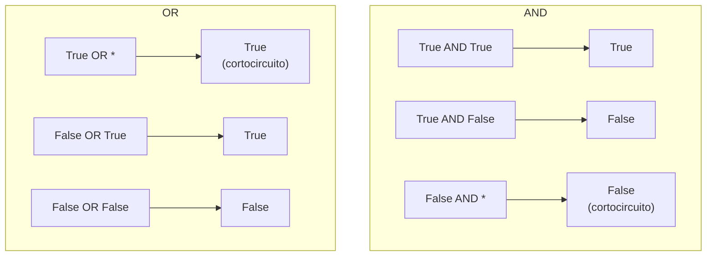

# ⚖️ 04 - Operadores Relacionales y Lógicos

Las decisiones en código dependen de comparaciones y combinaciones lógicas. En ML/AI, los operadores relacionales filtran datasets y los lógicos combinan condiciones de features. En Backend, validan permisos, estados de transacciones y condiciones de negocio complejas. Entender la diferencia entre `==` e `is`, y dominar el cortocircuito lógico, te convertirá en un programador más preciso.


## 1. Operadores Relacionales

| Operador | Significado | Ejemplo | Resultado |
|----------|-------------|---------|-----------|
| `==` | Igualdad de valor | `5 == 5.0` | `True` |
| `!=` | Desigualdad | `5 != 3` | `True` |
| `<` | Menor que | `3 < 5` | `True` |
| `>` | Mayor que | `5 > 3` | `True` |
| `<=` | Menor o igual | `5 <= 5` | `True` |
| `>=` | Mayor o igual | `5 >= 6` | `False` |

💡 **Tip:** Los operadores relacionales pueden aplicarse a strings comparando orden lexicográfico basado en Unicode code points: `"Apple" < "Banana"` es `True`.


## 2. `is` vs `==`: Identidad vs Igualdad

- `==` compara **valores** (llama a `__eq__`).
- `is` compara **identidad** (misma dirección de memoria, `id(a) == id(b)`).

```python
a = [1, 2, 3]
b = [1, 2, 3]
print(a == b)  # True — mismo contenido
print(a is b)  # False — objetos distintos en memoria

c = None
print(c is None)  # True — siempre compara None con 'is'
```

⚠️ **Advertencia:** Usar `is` para comparar valores literales (como `a is 5`) funciona a veces por interning, pero es un error semántico. Solo usa `is` para singletons como `None`, `True`, `False`.

Caso real: En un pipeline de ML, verificar si un parámetro opcional no fue proporcionado debe hacerse con `if param is None`, porque `0` o `[]` son valores válidos que `== None` confundiría.


## 3. Operadores Lógicos y Cortocircuito

Python tiene tres operadores lógicos: `and`, `or`, `not`.

| A | B | A and B | A or B | not A |
|---|---|---------|--------|-------|
| True | True | True | True | False |
| True | False | False | True | False |
| False | True | False | True | True |
| False | False | False | False | True |

**Cortocircuito (short-circuit):**

- `and` devuelve el primer operando falsy o el último operando truthy.
- `or` devuelve el primer operando truthy o el último operando falsy.

```python
# and cortocircuita en el primer False
print(0 and "hola")   # 0 (falsy, no evalúa "hola")
print(5 and "hola")   # "hola" (truthy, devuelve último)

# or cortocircuita en el primer True
print("hola" or 0)    # "hola"
print(0 or 42)        # 42
```

💡 **Tip:** El cortocircuito permite patrones como `valor = opcion or default`, pero cuidado si `0` o `[]` son valores válidos para `opcion`.


## 4. Tabla de Verdad Completa en Mermaid




## 5. Truthiness y Falsiness en Python

Python evalúa objetos en contextos booleanos sin necesidad de `== True`. Los siguientes evalúan a `False`:

| Falsy | Truthy (ejemplos) |
|-------|-------------------|
| `None` | Cualquier objeto no listado en Falsy |
| `False` | `True` |
| `0` (int), `0.0` (float) | `1`, `-5`, `3.14` |
| `""` (str vacía) | `" "`, `"hola"` |
| `[]` (lista vacía) | `[0]`, `[None]` |
| `{}` (dict vacío) | `{"a": 1}` |
| `set()` (conjunto vacío) | `{0}` |
| `()` (tupla vacía) | `(None,)` |

```python
usuarios = []
if not usuarios:
    print("No hay usuarios registrados")
```

⚠️ **Advertencia:** `if usuarios is not None` no es lo mismo que `if usuarios`. El primero solo rechaza `None`; el segundo rechaza `None`, `[]`, `0`, etc.

Caso real: En un endpoint Backend, validar `if not request_body:` detecta tanto `None` como cuerpos JSON vacíos `{}`, lo cual suele ser una solicitud malformada.


## 6. Operador Walrus `:=` (Python 3.8+)

El operador de asignación expresiva (walrus) permite asignar valores dentro de expresiones.

```python
# Sin walrus
linea = input("Texto: ")
while linea != "fin":
    print(f"Recibido: {linea}")
    linea = input("Texto: ")

# Con walrus
while (linea := input("Texto: ")) != "fin":
    print(f"Recibido: {linea}")
```

💡 **Tip:** Úsalo para evitar llamadas duplicadas costosas o para simplificar bucles. No lo abuses; la legibilidad prima.

Caso real: Al leer un archivo de configuración línea por línea, `while (linea := f.readline().strip()):` permite procesar y verificar en una sola expresión concisa.


## 7. Chaining de Comparaciones

Python permite encadenar comparaciones de forma matemática, evaluando con `and` implícito.

```python
x = 5
print(1 < x < 10)       # True  — equivalente a (1 < x) and (x < 10)
print(10 < x < 20)      # False
```

⚠️ **Advertencia:** En otros lenguajes como C, `1 < x < 10` se evalúa como `(1 < x) < 10`, lo cual es semánticamente distinto y puede dar resultados inesperados. Python lo maneja correctamente.


## 8. Resumen en Código

```python
# 📦 Código de compresión: Operadores Relacionales y Lógicos
import math

# 1. Relacionales
print("5 == 5.0:", 5 == 5.0)
print("5 is 5.0:", 5 is 5.0)
print("'abc' < 'def':", "abc" < "def")

# 2. is vs == con None
config = None
print("config is None:", config is None)

# 3. Cortocircuito
opcion = 0
default = 100
valor = opcion or default
print(f"or con 0: {valor}")  # 100 (0 es falsy)

nombre = "Ana"
esultado = nombre and len(nombre)
print(f"and con str: {resultado}")  # 3

# 4. Truthiness
colecciones = [[], [1], {}, {"a": 1}, "", "x", 0, 5]
for c in colecciones:
    print(f"bool({c!r}) = {bool(c)}")

# 5. Walrus
valores = [3, 1, 4, 1, 5]
if (n := len(valores)) > 3:
    print(f"Hay {n} valores")

# 6. Chaining
temp = 22.5
print(f"Rango agradable? {18 < temp < 25}")

# 7. Comparación de floats segura
a = 0.1 + 0.2
print(f"a == 0.3? {a == 0.3}, isclose? {math.isclose(a, 0.3)}")
```
