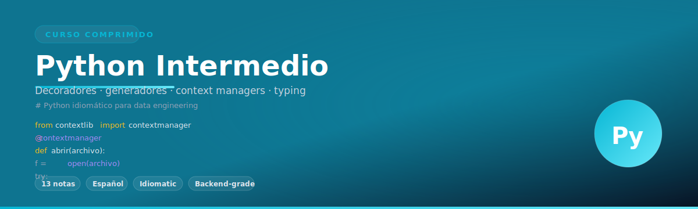
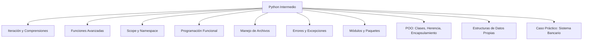

# 🐍 Bienvenida a Python Intermedio

Bienvenido al segundo módulo del curso completo de Python. En esta etapa dejamos atrás la sintaxis elemental para adentrarnos en mecanismos que hacen que el código sea modular, eficiente y profesional. Para un **ML/AI Engineer**, dominar iteraciones avanzadas y comprensiones acelera la preparación de datasets y la construcción de pipelines de transformación. Para un **Backend Developer**, el manejo de excepciones, módulos y programación orientada a objetos es la base para construir APIs robustas y escalables.

---

## 1. Propósito de este módulo

Este módulo está diseñado para transformar a un programador principiante en un desarrollador con capacidad de leer y escribir código Python idiomático. No se trata solo de "hacer que funcione", sino de hacerlo de forma elegante, mantenible y eficiente.

Caso real: en un pipeline de procesamiento de datos para un modelo de NLP, las comprensiones de lista y las expresiones generadoras permiten reducir el consumo de memoria de millones de tokens en un 40% comparado con bucles tradicionales.

---

## 2. Índice de contenidos

| # | Nota | Enlace interno |
|---|------|----------------|
| 01 | Iteración Avanzada y Comprensiones | [[01 - Iteracion Avanzada y Comprensiones]] |
| 02 | Funciones Avanzadas | [[02 - Funciones Avanzadas]] |
| 03 | Scope y Namespace | [[03 - Scope y Namespace]] |
| 04 | Programación Funcional | [[04 - Programacion Funcional]] |
| 05 | Manejo de Archivos | [[05 - Manejo de Archivos]] |
| 06 | Manejo de Errores y Excepciones | [[06 - Manejo de Errores y Excepciones]] |
| 07 | Módulos y Paquetes | [[07 - Modulos y Paquetes]] |
| 08 | POO - Clases y Objetos | [[08 - POO - Clases y Objetos]] |
| 09 | POO - Herencia y Polimorfismo | [[09 - POO - Herencia y Polimorfismo]] |
| 10 | POO - Encapsulamiento y Métodos Especiales | [[10 - POO - Encapsulamiento y Metodos Especiales]] |
| 11 | Estructuras de Datos Propias - Pilas y Colas | [[11 - Estructuras de Datos Propias - Pilas y Colas]] |
| 12 | Caso Práctico - Sistema Bancario | [[12 - Caso Practico - Sistema Bancario]] |

---

## 3. Glosario esencial

A continuación se definen los términos que dominarán tu vocabulario técnico durante este módulo:

| Término | Definición |
|---------|------------|
| **Scope** | Ámbito o contexto en el que una variable es visible y puede ser referenciada. |
| **Namespace** | Mapeo de nombres a objetos; un sistema de diccionarios que Python utiliza para evitar colisiones de nombres. |
| **Closure** | Función que recuerda el entorno léxico en el que fue definida, incluso cuando se ejecuta fuera de dicho entorno. |
| **Lambda** | Función anónima de una sola expresión, útil para operaciones de corta duración. |
| **Comprehension** | Sintaxis concisa para crear listas, diccionarios o conjuntos a partir de iterables. |
| **Exception** | Evento que interrumpe el flujo normal de ejecución cuando ocurre un error. |
| **Module** | Archivo de Python (.py) que contiene definiciones y declaraciones. |
| **Package** | Directorio que agrupa módulos relacionados mediante un archivo `__init__.py`. |
| **POO** | Paradigma de Programación Orientada a Objetos. |
| **Clase** | Blueprint o plantilla para crear objetos con atributos y comportamientos definidos. |
| **Objeto** | Instancia concreta de una clase. |
| **Herencia** | Mecanismo para crear nuevas clases basadas en clases existentes, reutilizando código. |
| **Polimorfismo** | Capacidad de diferentes clases para ser tratadas como instancias de una misma clase padre. |
| **Encapsulamiento** | Ocultamiento del estado interno de un objeto, exponiendo solo una interfaz controlada. |
| **Pila (Stack)** | Estructura de datos LIFO (Last In, First Out). |
| **Cola (Queue)** | Estructura de datos FIFO (First In, First Out). |
| **LIFO** | Último en entrar, primero en salir. |
| **FIFO** | Primero en entrar, primero en salir. |

---

## 4. Objetivos de aprendizaje

Al finalizar este módulo serás capaz de:

1. Escribir comprensiones complejas y expresiones generadoras para manipular datos de forma eficiente.
2. Diseñar funciones con firmas flexibles usando `*args`, `**kwargs` y argumentos exclusivos.
3. Predecir el comportamiento del scope y namespaces en código anidado.
4. Aplicar técnicas de programación funcional para construir pipelines de datos.
5. Persistir información en archivos CSV, JSON y binarios de forma segura.
6. Implementar estrategias de manejo de errores que no oculten fallos silenciosamente.
7. Organizar proyectos en módulos y paquetes con imports profesionales.
8. Modelar dominios reales mediante clases, herencia, polimorfismo y encapsulamiento.
9. Construir estructuras de datos propias como pilas y colas con rendimiento garantizado.
10. Desarrollar una aplicación completa de consola que integre todos los conceptos del módulo.

---

## 5. Mapa mental del módulo



---

## 6. Requisitos previos

Se asume que dominas:

- Variables, tipos de datos y operadores básicos.
- Estructuras de control: `if`, `for`, `while`.
- Funciones simples con `def` y `return`.
- Listas, diccionarios, tuplas y conjuntos básicos.

⚠️ **Advertencia**: si no te sientes cómodo con los requisitos previos, repasa el módulo de fundamentos antes de continuar. Este módulo construye sobre esas bases a un ritmo acelerado.

---

💡 **Tip**: mantén un notebook de Jupyter o un archivo `.py` aparte para experimentar con cada fragmento de código antes de leer la explicación completa. La experimentación activa multiplica la retención.

---


---

## 7. Código de compresión

El siguiente bloque resume la esencia de este módulo en menos de 15 líneas. Úsalo como tarjeta de referencia rápida:

```python
# Python Intermedio - Esencia
from functools import reduce, partial
from collections import deque

# Comprensión + funciones + funcional en una línea
palabras = ["Python", "es", "poderoso"]
longitudes = {p: len(p) for p in palabras if len(p) > 2}

# Pipeline funcional
nums = range(10)
resultado = reduce(lambda x, y: x + y, filter(lambda n: n % 2 == 0, map(lambda n: n ** 2, nums)))

# Cola eficiente
q = deque([1, 2, 3])
q.append(4)
primero = q.popleft()

print(longitudes, resultado, primero)
```
