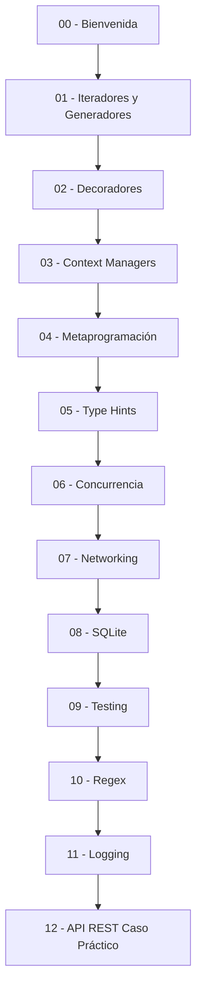

# 🚀 00 - Bienvenida a Python Avanzado

¡Bienvenido al módulo **03 - Python Avanzado**! En esta etapa del curso dejamos atrás lo básico para adentrarnos en las herramientas que diferencian a un programador competente de un **ML/AI Engineer** o **Backend Developer** sólido. Dominar estos conceptos es clave para construir pipelines de datos eficientes, servicios escalables y sistemas de inferencia robustos.


---

## 1. Mapa de Ruta del Módulo

A continuación se presenta el índice completo de las notas que conforman este curso. Cada lección está diseñada para construir sobre la anterior, formando una base robusta de conocimiento avanzado.

| # | Nota | Enlace Interno | Foco Principal |
|---|------|----------------|----------------|
| 00 | Bienvenida | [[01 - Advanced Python/03 - Python Avanzado/00 - Bienvenida]] | Contexto y objetivos |
| 01 | Iteradores y Generadores | [[01 - Iteradores y Generadores]] | Memoria y lazy evaluation |
| 02 | Decoradores | [[02 - Decoradores]] | Reutilización y metaprogramación |
| 03 | Context Managers | [[03 - Context Managers]] | Gestión de recursos |
| 04 | Metaprogramación y Metaclases | [[04 - Metaprogramacion y Metaclases]] | Introspección y magia |
| 05 | Type Hints y Anotaciones | [[05 - Type Hints y Anotaciones]] | Calidad y mantenibilidad |
| 06 | Concurrencia | [[06 - Concurrencia - Threading y Asyncio]] | Paralelismo y async |
| 07 | Networking y Sockets | [[07 - Networking y Sockets]] | Comunicación en red |
| 08 | Bases de Datos con SQLite | [[08 - Bases de Datos con SQLite]] | Persistencia de datos |
| 09 | Testing | [[09 - Testing con unittest y pytest]] | Calidad de software |
| 10 | Regex y Procesamiento de Texto | [[10 - Regex y Procesamiento de Texto]] | Parsing de datos |
| 11 | Logging y Configuración | [[11 - Logging y Configuracion de Proyectos]] | Observabilidad |
| 12 | Caso Práctico API REST | [[12 - Caso Practico - API REST con Solo Python]] | Integración total |



---

## 2. Glosario de Términos Clave

Antes de comenzar, familiarízate con estos conceptos. Aparecerán constantemente a lo largo del módulo.

| Término | Definición | Relevancia para ML/Backend |
|---------|------------|----------------------------|
| **Iterator** | Objeto que implementa `__iter__` y `__next__`, permitiendo recorrer colecciones elemento a elemento. | Procesamiento de datasets grandes sin cargar todo en memoria. |
| **Generator** | Función que usa `yield` para producir una secuencia de resultados de forma perezosa (lazy). | Pipelines de datos y streams de inferencia. |
| **Decorator** | Patrón de diseño que permite modificar el comportamiento de una función o clase sin alterar su código. | Logging, autenticación y caching en APIs. |
| **Context Manager** | Protocolo (`__enter__`, `__exit__`) para gestionar recursos (archivos, conexiones) de forma segura. | Manejo de sesiones de bases de datos y locks. |
| **Metaclass** | La "clase de una clase"; define cómo se crean y comportan las clases. | ORMs y frameworks que generan clases dinámicamente. |
| **Type Hint** | Anotación de tipos en el código para mejorar la legibilidad y permitir verificación estática. | Escalabilidad en proyectos grandes y reducción de bugs. |
| **GIL** | Global Interpreter Lock; mutex que permite solo un hilo de Python ejecutándose a la vez. | Limita el paralelismo real en CPU-bound tasks. |
| **Threading** | Ejecución concurrente dentro de un mismo proceso usando hilos del SO. | I/O bound tasks: requests HTTP, escritura de logs. |
| **Asyncio** | Biblioteca para escribir código concurrente usando la sintaxis `async`/`await`. | Servidores web de alto rendimiento (ASGI). |
| **Socket** | Extremo de un canal de comunicación bidireccional entre dos procesos. | Comunicación entre microservicios y servidores custom. |
| **SQLite** | Motor de base de datos SQL autocontenido, sin servidor. | Prototipado rápido y bases de datos locales en edge devices. |
| **Unittest** | Framework de pruebas unitarias incluido en la stdlib. | Verificación de modelos y utilidades. |
| **Pytest** | Framework de testing de terceros, más flexible y potente que unittest. | Suites de pruebas complejas en proyectos de ML. |
| **Regex** | Expresiones regulares; lenguaje para describir patrones de búsqueda en texto. | Preprocesamiento de texto (NLP) y parsing de logs. |
| **Logging** | Sistema de registro de eventos de una aplicación. | Observabilidad en modelos productivos y backends. |
| **pyproject.toml** | Archivo estándar de configuración de proyectos Python (PEP 518, 621). | Empaquetado moderno y gestión de dependencias. |


---

## 3. Objetivos de Aprendizaje

Al finalizar este módulo, serás capaz de:

1.  Diseñar **generadores y pipelines de datos** eficientes para manejar volúmenes masivos de información en tareas de ML.
2.  Implementar **decoradores y context managers** para añadir comportamiento transversal (cross-cutting concerns) en aplicaciones backend.
3.  Comprender la **metaprogramación** para construir frameworks y herramientas de introspección.
4.  Aplicar **type hints** de forma rigurosa para mejorar la calidad del código en equipos grandes.
5.  Elegir correctamente entre **threading, multiprocessing y asyncio** según el perfil de la carga de trabajo (CPU-bound vs I/O-bound).
6.  Construir aplicaciones de **red y APIs REST** utilizando únicamente la biblioteca estándar de Python.
7.  Garantizar la calidad del software mediante **testing unitario y de integración** con `unittest` y `pytest`.
8.  Configurar correctamente **logging, entornos y empaquetado** en proyectos profesionales.

---

## 4. Prerrequisitos

Este módulo asume que ya dominas:

- Sintaxis básica de Python (variables, funciones, clases, herencia).
- Manejo de estructuras de datos (listas, diccionarios, sets, tuplas).
- Comprensión de listas y manejo básico de excepciones.

⚠️ **Advertencia:** Si no te sientes cómodo con los conceptos anteriores, te recomendamos repasar el módulo 02 antes de continuar.

---

## 5. Filosofía del Módulo

En ML/AI Engineering y Backend, el código no solo debe "funcionar", sino ser **mantenible, escalable y observable**. Python Avanzado no se trata de usar "trucos", sino de aplicar los mecanismos correctos del lenguaje para resolver problemas complejos de forma elegante.

> 💡 **Tip:** No memorices la sintaxis; enfócate en *cuándo* y *por qué* usar cada herramienta.

```python
# 📦 Código de compresión: Filosofía del módulo en una clase
from typing import List

class ModuloAvanzado:
    """Representa la mentalidad de un desarrollador Python senior."""

    def __init__(self) -> None:
        self.herramientas: List[str] = [
            "iteradores", "decoradores", "context_managers",
            "metaclases", "type_hints", "asyncio"
        ]

    def resolver(self, problema: str) -> str:
        return f"Usar la herramienta adecuada para {problema}"

if __name__ == "__main__":
    curso = ModuloAvanzado()
    print(curso.resolver("procesar 10GB de datos"))
```
