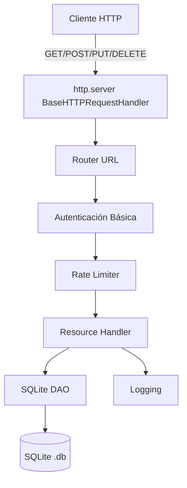

# 🎯 12 - Caso Práctico: API REST con Solo Python

Este proyecto integra todo lo aprendido en el módulo. Construiremos una API REST completa utilizando únicamente la biblioteca estándar de Python. En entornos de ML/Backend, entender cómo funciona HTTP a bajo nivel es invaluable para debuggear proxies, construir microservicios ligeros o desplegar modelos en dispositivos con recursos limitados donde instalar Flask o FastAPI no es viable.


---

## 1. Arquitectura del Proyecto

Nuestra aplicación seguirá una arquitectura por capas simple pero robusta. El servidor HTTP atenderá peticiones, un router despachará a los handlers, y una capa de acceso a datos gestionará el CRUD en SQLite.



---

## 2. Requisitos Funcionales

| ID | Requisito | Método | Endpoint |
|----|-----------|--------|----------|
| RF-01 | Listar todos los modelos ML. | GET | `/api/v1/models` |
| RF-02 | Obtener un modelo por ID. | GET | `/api/v1/models/{id}` |
| RF-03 | Crear un nuevo modelo. | POST | `/api/v1/models` |
| RF-04 | Actualizar un modelo existente. | PUT | `/api/v1/models/{id}` |
| RF-05 | Eliminar un modelo. | DELETE | `/api/v1/models/{id}` |
| RF-06 | Autenticación básica (Bearer-like con API Key). | Headers | `X-API-Key` |
| RF-07 | Rate limiting por IP. | Middleware | Todos los endpoints |
| RF-08 | Logging estructurado de requests. | Middleware | Todos los endpoints |

---

## 3. Stack Tecnológico

| Componente | Módulo de stdlib | Propósito |
|------------|------------------|-----------|
| Servidor HTTP | `http.server`, `socketserver` | Escucha y respuesta de peticiones. |
| Base de datos | `sqlite3` | Persistencia de los recursos. |
| Serialización | `json` | Parsing y generación de payloads. |
| Autenticación | `secrets` (comparación segura) | Validación de API Keys. |
| Logging | `logging` | Observabilidad. |
| Testing | `unittest`, `urllib.request` | Tests de integración. |

---

## 4. Implementación Paso a Paso

### 4.1 Modelo de Datos y DAO

```python
import sqlite3
import json
from typing import List, Optional, Dict, Any

class ModeloDAO:
    def __init__(self, db_path: str = "ml_api.db"):
        self.db_path = db_path
        self._init_db()

    def _init_db(self):
        with sqlite3.connect(self.db_path) as conn:
            conn.execute("""
                CREATE TABLE IF NOT EXISTS models (
                    id INTEGER PRIMARY KEY AUTOINCREMENT,
                    name TEXT NOT NULL,
                    version TEXT NOT NULL,
                    accuracy REAL CHECK(accuracy >= 0 AND accuracy <= 1),
                    created_at TIMESTAMP DEFAULT CURRENT_TIMESTAMP
                )
            """)

    def listar(self) -> List[Dict[str, Any]]:
        with sqlite3.connect(self.db_path) as conn:
            conn.row_factory = sqlite3.Row
            rows = conn.execute("SELECT * FROM models").fetchall()
            return [dict(r) for r in rows]

    def obtener(self, model_id: int) -> Optional[Dict[str, Any]]:
        with sqlite3.connect(self.db_path) as conn:
            conn.row_factory = sqlite3.Row
            row = conn.execute("SELECT * FROM models WHERE id = ?", (model_id,)).fetchone()
            return dict(row) if row else None

    def crear(self, data: Dict[str, Any]) -> int:
        with sqlite3.connect(self.db_path) as conn:
            cur = conn.execute(
                "INSERT INTO models (name, version, accuracy) VALUES (?, ?, ?)",
                (data["name"], data["version"], data.get("accuracy", 0.0))
            )
            return cur.lastrowid

    def actualizar(self, model_id: int, data: Dict[str, Any]) -> bool:
        with sqlite3.connect(self.db_path) as conn:
            cur = conn.execute(
                "UPDATE models SET name = ?, version = ?, accuracy = ? WHERE id = ?",
                (data["name"], data["version"], data.get("accuracy", 0.0), model_id)
            )
            return cur.rowcount > 0

    def eliminar(self, model_id: int) -> bool:
        with sqlite3.connect(self.db_path) as conn:
            cur = conn.execute("DELETE FROM models WHERE id = ?", (model_id,))
            return cur.rowcount > 0
```

### 4.2 Servidor y Router

```python
import http.server
import socketserver
import json
import logging
import time
from urllib.parse import urlparse
import secrets

logging.basicConfig(level=logging.INFO, format="%(asctime)s [%(levelname)s] %(message)s")
logger = logging.getLogger("ml_api")

# Simulación de base de datos de API Keys
API_KEYS = {"dev-key-123", "prod-key-456"}

# Rate limiting simple en memoria
rate_store = {}
RATE_LIMIT = 10  # requests
RATE_WINDOW = 60  # segundos

class MLAPIHandler(http.server.BaseHTTPRequestHandler):
    dao = ModeloDAO()

    def log_message(self, format, *args):
        """Sobrescribe para usar nuestro logger."""
        logger.info("%s - %s", self.address_string(), format % args)

    def _send_json(self, status: int, data: Any):
        self.send_response(status)
        self.send_header("Content-Type", "application/json")
        self.end_headers()
        self.wfile.write(json.dumps(data).encode())

    def _check_auth(self) -> bool:
        key = self.headers.get("X-API-Key", "")
        if not any(secrets.compare_digest(key, valid) for valid in API_KEYS):
            self._send_json(401, {"error": "Unauthorized"})
            return False
        return True

    def _check_rate_limit(self) -> bool:
        ip = self.client_address[0]
        ahora = time.time()
        ventana = rate_store.get(ip, [])
        ventana = [t for t in ventana if ahora - t < RATE_WINDOW]
        if len(ventana) >= RATE_LIMIT:
            self._send_json(429, {"error": "Rate limit exceeded"})
            return False
        ventana.append(ahora)
        rate_store[ip] = ventana
        return True

    def do_GET(self):
        if not self._check_auth() or not self._check_rate_limit():
            return
        parsed = urlparse(self.path)
        path = parsed.path

        if path == "/api/v1/models":
            self._send_json(200, {"data": self.dao.listar()})
        elif path.startswith("/api/v1/models/"):
            try:
                model_id = int(path.split("/")[-1])
                modelo = self.dao.obtener(model_id)
                if modelo:
                    self._send_json(200, {"data": modelo})
                else:
                    self._send_json(404, {"error": "Not found"})
            except ValueError:
                self._send_json(400, {"error": "Invalid ID"})
        else:
            self._send_json(404, {"error": "Endpoint not found"})

    def do_POST(self):
        if not self._check_auth() or not self._check_rate_limit():
            return
        if self.path != "/api/v1/models":
            self._send_json(404, {"error": "Endpoint not found"})
            return
        content_length = int(self.headers.get("Content-Length", 0))
        body = self.rfile.read(content_length)
        try:
            data = json.loads(body)
            new_id = self.dao.crear(data)
            self._send_json(201, {"id": new_id, "message": "Created"})
        except (json.JSONDecodeError, KeyError) as e:
            self._send_json(400, {"error": str(e)})

    def do_PUT(self):
        if not self._check_auth() or not self._check_rate_limit():
            return
        if not self.path.startswith("/api/v1/models/"):
            self._send_json(404, {"error": "Endpoint not found"})
            return
        try:
            model_id = int(self.path.split("/")[-1])
            content_length = int(self.headers.get("Content-Length", 0))
            data = json.loads(self.rfile.read(content_length))
            if self.dao.actualizar(model_id, data):
                self._send_json(200, {"message": "Updated"})
            else:
                self._send_json(404, {"error": "Not found"})
        except Exception as e:
            self._send_json(400, {"error": str(e)})

    def do_DELETE(self):
        if not self._check_auth() or not self._check_rate_limit():
            return
        if not self.path.startswith("/api/v1/models/"):
            self._send_json(404, {"error": "Endpoint not found"})
            return
        try:
            model_id = int(self.path.split("/")[-1])
            if self.dao.eliminar(model_id):
                self._send_json(204, None)
            else:
                self._send_json(404, {"error": "Not found"})
        except ValueError:
            self._send_json(400, {"error": "Invalid ID"})

def run_server(host="0.0.0.0", port=8000):
    with socketserver.TCPServer((host, port), MLAPIHandler) as httpd:
        logger.info(f"Servidor ML API corriendo en http://{host}:{port}")
        httpd.serve_forever()
```

---

## 5. Métricas de Rendimiento

| Métrica | Definición | Cómo medirla en nuestro servidor |
|---------|------------|----------------------------------|
| **Throughput** | Peticiones procesadas por segundo (RPS). | Contador de requests exitosos / tiempo transcurrido. |
| **Latency** | Tiempo desde que llega la request hasta que se envía la response. | `time.perf_counter()` al inicio de `do_*` y al final. |

```python
# Fragmento para medir latencia
inicio = time.perf_counter()
# ... lógica del endpoint ...
latency = time.perf_counter() - inicio
logger.info("Request %s %s completada en %.4fs", method, path, latency)
```

⚠️ **Advertencia:** El servidor `http.server` de la stdlib **no está diseñado para producción**. Es bloqueante y monohilo. Úsalo para prototipos, herramientas internas o dispositivos edge. Para producción, migra a un ASGI server (Uvicorn) con un framework como FastAPI.

---

## 6. Testing de Integración con `unittest`

```python
import unittest
import threading
import time
import json
import urllib.request
import urllib.error

class TestMLAPI(unittest.TestCase):
    @classmethod
    def setUpClass(cls):
        cls.server_thread = threading.Thread(target=run_server, kwargs={"port": 8999}, daemon=True)
        cls.server_thread.start()
        time.sleep(0.5)  # Esperar a que el servidor levante
        cls.base = "http://127.0.0.1:8999"
        cls.headers = {"X-API-Key": "dev-key-123", "Content-Type": "application/json"}

    def test_post_and_get(self):
        data = json.dumps({"name": "ResNet", "version": "1.0", "accuracy": 0.95}).encode()
        req = urllib.request.Request(f"{self.base}/api/v1/models", data=data, headers=self.headers, method="POST")
        resp = urllib.request.urlopen(req)
        self.assertEqual(resp.status, 201)
        created = json.loads(resp.read())
        model_id = created["id"]

        req_get = urllib.request.Request(f"{self.base}/api/v1/models/{model_id}", headers=self.headers)
        resp_get = urllib.request.urlopen(req_get)
        self.assertEqual(resp_get.status, 200)
        body = json.loads(resp_get.read())
        self.assertEqual(body["data"]["name"], "ResNet")

    def test_unauthorized(self):
        try:
            urllib.request.urlopen(f"{self.base}/api/v1/models")
        except urllib.error.HTTPError as e:
            self.assertEqual(e.code, 401)

    def test_not_found(self):
        req = urllib.request.Request(f"{self.base}/api/v1/models/99999", headers=self.headers)
        try:
            urllib.request.urlopen(req)
        except urllib.error.HTTPError as e:
            self.assertEqual(e.code, 404)

if __name__ == "__main__":
    unittest.main()
```

Caso real: Este patrón se usa en laboratorios de investigación de ML para exponer modelos entrenados desde estaciones de trabajo sin instalar dependencias pesadas, permitiendo que otros equipos consuman predicciones vía HTTP mientras el modelo se carga en memoria.

---

## 7. Seguridad y Buenas Prácticas

1.  **Autenticación:** Nunca transmitas API Keys en URLs; usa headers (`X-API-Key`).
2.  **Validación:** Sanitiza siempre los inputs antes de tocar la base de datos (ya usamos parámetros `?` en SQLite, lo cual previene SQL injection).
3.  **Rate Limiting:** Protege contra abuso y DoS accidentales.
4.  **CORS:** Si consumes la API desde un navegador, deberías añadir headers `Access-Control-Allow-Origin`.

💡 **Tip:** Para desplegar un modelo de ML real en este servidor, carga el modelo en una variable de clase dentro de `MLAPIHandler` durante el arranque, evitando recargarlo en cada petición.

---

```python
# 📦 Código de compresión: Servidor REST completo en un solo bloque
import http.server, socketserver, sqlite3, json, logging, time, secrets
from urllib.parse import urlparse
from typing import List, Optional, Dict, Any

logging.basicConfig(level=logging.INFO, format="%(asctime)s [%(levelname)s] %(message)s")
logger = logging.getLogger("ml_api")

API_KEYS = {"dev-key-123"}
rate_store = {}

class ModeloDAO:
    def __init__(self, db_path="ml_api.db"):
        self.db_path = db_path
        with sqlite3.connect(db_path) as conn:
            conn.execute("""CREATE TABLE IF NOT EXISTS models (
                id INTEGER PRIMARY KEY AUTOINCREMENT,
                name TEXT NOT NULL, version TEXT NOT NULL,
                accuracy REAL, created_at TIMESTAMP DEFAULT CURRENT_TIMESTAMP)""")

    def listar(self): 
        with sqlite3.connect(self.db_path) as conn:
            conn.row_factory = sqlite3.Row
            return [dict(r) for r in conn.execute("SELECT * FROM models").fetchall()]

    def obtener(self, mid): 
        with sqlite3.connect(self.db_path) as conn:
            conn.row_factory = sqlite3.Row
            r = conn.execute("SELECT * FROM models WHERE id=?", (mid,)).fetchone()
            return dict(r) if r else None

    def crear(self, d): 
        with sqlite3.connect(self.db_path) as conn:
            return conn.execute("INSERT INTO models (name,version,accuracy) VALUES (?,?,?)",
                (d["name"], d["version"], d.get("accuracy",0.0))).lastrowid

    def actualizar(self, mid, d): 
        with sqlite3.connect(self.db_path) as conn:
            return conn.execute("UPDATE models SET name=?,version=?,accuracy=? WHERE id=?",
                (d["name"],d["version"],d.get("accuracy",0.0),mid)).rowcount > 0

    def eliminar(self, mid): 
        with sqlite3.connect(self.db_path) as conn:
            return conn.execute("DELETE FROM models WHERE id=?", (mid,)).rowcount > 0

class MLAPIHandler(http.server.BaseHTTPRequestHandler):
    dao = ModeloDAO()

    def log_message(self, fmt, *args): logger.info("%s - "+fmt, self.address_string(), *args)

    def _json(self, s, d):
        self.send_response(s); self.send_header("Content-Type","application/json"); self.end_headers()
        self.wfile.write(json.dumps(d).encode())

    def _auth(self):
        k=self.headers.get("X-API-Key","")
        if not any(secrets.compare_digest(k,v) for v in API_KEYS): self._json(401,{"error":"Unauthorized"}); return False
        return True

    def _rate(self):
        ip=self.client_address[0]; now=time.time()
        hist=[t for t in rate_store.get(ip,[]) if now-t<60]
        if len(hist)>=10: self._json(429,{"error":"Rate limit"}); return False
        hist.append(now); rate_store[ip]=hist; return True

    def do_GET(self):
        if not (self._auth() and self._rate()): return
        p=urlparse(self.path).path
        if p=="/api/v1/models": self._json(200,{"data":self.dao.listar()})
        elif p.startswith("/api/v1/models/"):
            try:
                m=self.dao.obtener(int(p.split("/")[-1]))
                self._json(200 if m else 404, {"data":m} if m else {"error":"Not found"})
            except ValueError: self._json(400,{"error":"Invalid ID"})
        else: self._json(404,{"error":"Not found"})

    def do_POST(self):
        if not (self._auth() and self._rate()): return
        if self.path!="/api/v1/models": self._json(404,{"error":"Not found"}); return
        try:
            d=json.loads(self.rfile.read(int(self.headers.get("Content-Length",0))))
            self._json(201,{"id":self.dao.crear(d)})
        except Exception as e: self._json(400,{"error":str(e)})

    def do_PUT(self):
        if not (self._auth() and self._rate()): return
        try:
            mid=int(urlparse(self.path).path.split("/")[-1])
            d=json.loads(self.rfile.read(int(self.headers.get("Content-Length",0))))
            self._json(200 if self.dao.actualizar(mid,d) else 404, {"message":"Updated"} if self.dao.actualizar(mid,d) else {"error":"Not found"})
        except Exception as e: self._json(400,{"error":str(e)})

    def do_DELETE(self):
        if not (self._auth() and self._rate()): return
        try:
            mid=int(urlparse(self.path).path.split("/")[-1])
            self._json(204 if self.dao.eliminar(mid) else 404, None if self.dao.eliminar(mid) else {"error":"Not found"})
        except ValueError: self._json(400,{"error":"Invalid ID"})

def run(port=8000):
    with socketserver.TCPServer(("",port), MLAPIHandler) as httpd:
        logger.info(f"API REST en http://0.0.0.0:{port}")
        httpd.serve_forever()

if __name__ == "__main__":
    run()
```

---

## 🎯 Proyecto Documentado: ML Model Registry API

### Descripción

Desarrolla un registro de modelos de Machine Learning accesible vía API REST, implementado exclusivamente con la biblioteca estándar de Python. Este proyecto sirve como base para sistemas de MLOps ligeros, donde los científicos de datos pueden registrar, versionar y consultar modelos entrenados desde cualquier herramienta que soporte HTTP.

### Estructura de Archivos Recomendada

```
ml_model_registry/
├── server.py          # Punto de entrada y handler HTTP
├── dao.py             # Capa de acceso a datos (SQLite)
├── auth.py            # Módulo de autenticación y rate limiting
├── config.py          # Variables de entorno y logging setup
├── test_api.py        # Tests de integración con unittest
└── README.md          # Documentación del proyecto
```

### Endpoints Detallados

- `GET /api/v1/models` — Lista todos los modelos registrados. Soporta filtros futuros por `name` o `version`.
- `GET /api/v1/models/{id}` — Obtiene detalles de un modelo específico.
- `POST /api/v1/models` — Registra un nuevo modelo. Body JSON: `{name, version, accuracy}`.
- `PUT /api/v1/models/{id}` — Actualiza información de un modelo existente.
- `DELETE /api/v1/models/{id}` — Elimina un modelo del registro.

### Seguridad Implementada

- **API Key Header:** Requiere `X-API-Key` en todas las peticiones. La comparación usa `secrets.compare_digest` para evitar timing attacks.
- **Rate Limiting:** 10 peticiones por minuto por IP, con ventana deslizante de 60 segundos.
- **SQL Injection Prevention:** Todas las queries usan parámetros `?`.

### Métricas Objetivo

| Escenario | Objetivo |
|-----------|----------|
| Latencia p50 | < 50ms para queries simples. |
| Latencia p99 | < 200ms bajo carga moderada. |
| Throughput | > 100 RPS en hardware moderno (limitado por GIL y servidor monohilo). |

### Próximos Pasos

1.  Añadir paginación (`?page=1&limit=20`) al endpoint de listado.
2.  Implementar ordenamiento dinámico (`?sort=accuracy&order=desc`).
3.  Migrar el servidor a `asyncio` + `aiohttp` (si se permiten dependencias externas) para manejar verdadera concurrencia.
4.  Conectar el registro a un bucket S3 para almacenar artefactos de modelos (`.pkl`, `.onnx`).

---

**Enlaces internos de referencia:** [[01 - Advanced Python/03 - Python Avanzado/00 - Bienvenida]], [[03 - Context Managers]], [[08 - Bases de Datos con SQLite]], [[09 - Testing con unittest y pytest]], [[11 - Logging y Configuracion de Proyectos]]
