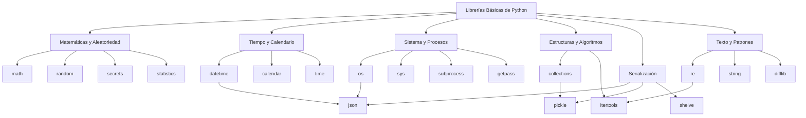

# 🏗️ Bienvenida a Librerías Básicas de Python

Las librerías estándar de Python conforman el núcleo operativo del lenguaje. Para un **ML/AI Engineer**, dominarlas implica construir pipelines robustos, manejar configuraciones, serializar modelos y preprocesar datos sin depender de dependencias externas. Para un **Backend Developer**, representan el piso de concreto sobre el cual se construyen servicios, APIs, utilidades de sistema y orquestación de procesos. Este módulo profundiza en las bibliotecas fundamentales que todo profesional debe dominar antes de saltar a frameworks de alto nivel.


## 1. Índice del Módulo

A continuación se presenta el mapa de ruta de este curso. Cada nota está diseñada para ser autónoma, aunque se recomienda seguir el orden numérico para maximizar la retención conceptual.

| # | Nota | Enlace Interno | Enfoque Principal |
|---|------|----------------|-------------------|
| 00 | Bienvenida | [[01 - Advanced Python/04 - Librerias Basicas de Python/00 - Bienvenida]] | Contexto, glosario y objetivos |
| 01 | Math y Random | [[01 - Math y Random]] | Cálculo numérico, estadística y aleatoriedad |
| 02 | Datetime y Calendar | [[02 - Datetime y Calendar]] | Manejo temporal y zonas horarias |
| 03 | Os y Sys | [[03 - Os y Sys]] | Interacción con el sistema operativo |
| 04 | Collections e Itertools | [[04 - Collections e Itertools]] | Estructuras de datos y algoritmos iterativos |
| 05 | Json y Pickle | [[05 - Json y Pickle]] | Serialización y persistencia de objetos |
| 06 | Re y String | [[06 - Re y String]] | Procesamiento de texto con expresiones regulares |
| 07 | Caso Práctico | [[07 - Caso Practico - Utilidades de Sistema]] | Integración en un proyecto CLI real |
| 08 | NumPy para Análisis de Datos | [[08 - NumPy para Analisis de Datos]] | Arrays, shape, axis, broadcasting, vectorización, random |
| 09 | Pandas para Análisis de Datos | [[09 - Pandas para Analisis de Datos]] | DataFrames, read_csv, groupby, merge, fillna, value_counts |


## 2. Glosario de Librerías del Módulo

El siguiente glosario resume la función de cada biblioteca cubierta. Es común que en proyectos reales se combinen múltiples módulos para resolver una sola tarea.

| Librería | Categoría | Descripción Breve | Uso Típico en ML/AI | Uso Típico en Backend |
|----------|-----------|-------------------|---------------------|-----------------------|
| `math` | Matemáticas | Funciones matemáticas de precisión flotante | Inicialización de pesos, métricas | Cálculos de coordenadas, geometría |
| `random` | Aleatoriedad | Generación de números pseudoaleatorios | Data augmentation, splitting | Sorteos, IDs temporales |
| `secrets` | Seguridad | Generación criptográficamente segura | Tokens de API, claves de cifrado | Gestión de sesiones, passwords |
| `statistics` | Estadística | Estadísticas descriptivas básicas | Análisis exploratorio rápido | Reportes de métricas simples |
| `datetime` | Tiempo | Tipos y operaciones de fecha/hora | Timestamping de eventos, series temporales | Rate limiting, logging, TTL |
| `calendar` | Tiempo | Utilidades de calendario gregoriano | Generación de ventanas de entrenamiento | Scheduling, reportes mensuales |
| `os` | Sistema | Interfaz con el sistema operativo | Rutas a datasets, variables de entorno | Manejo de archivos, despliegue |
| `sys` | Intérprete | Parámetros y funciones del intérprete | Configuración de paths, recursos | Argumentos CLI, manejo de excepciones |
| `collections` | Estructuras | Contenedores de datos especializados | Conteo de clases, agrupación de features | Caché, configuraciones anidadas |
| `itertools` | Iteradores | Constructores de iteradores eficientes | Generación de hiperparámetros | Paginación, streaming de datos |
| `json` | Serialización | Codificación/decodificación JSON | Configs, logs estructurados, APIs | Payloads REST, mensajería |
| `pickle` | Serialización | Serialización binaria de objetos Python | Checkpointing de modelos (cuidado) | Caché de objetos en memoria/disco |
| `shelve` | Persistencia | Diccionarios persistentes en disco | Almacenamiento de metadata | Caché simple entre procesos |
| `re` | Texto | Expresiones regulares | Limpieza de texto, extracción de features | Validación de inputs, parsing de logs |
| `string` | Texto | Constantes y plantillas de cadenas | Generación de textos de prueba | Formateo de mensajes, emails |
| `difflib` | Texto | Comparación de secuencias de texto | Detección de drift en datos textuales | Diff de configuraciones, logs |
| `getpass` | Seguridad | Lectura segura de contraseñas | - | Autenticación CLI, scripts de despliegue |
| `subprocess` | Sistema | Ejecución de procesos externos | Llamadas a scripts de entrenamiento | Comandos del sistema, pipelines |
| `numpy` | Cómputo numérico | Arrays multidimensionales, vectorización | Pre/post-procesamiento de features, álgebra lineal | Aceleración numérica en pipelines |
| `pandas` | Datos tabulares | DataFrames, lectura/escritura CSV, groupby, merge | ETL, EDA, feature engineering | Reportes, agregaciones SQL-like |


## 3. Diagrama Conceptual del Módulo

El siguiente diagrama ilustra cómo las librerías se agrupan por dominio y cómo fluye la información entre ellas en un proyecto típico.




## 4. Objetivos de Aprendizaje

Al finalizar este módulo, serás capaz de:

1. Aplicar funciones matemáticas y generadores aleatorios para simulaciones y análisis estadístico sin dependencias externas.
2. Manipular fechas, horas y zonas horarias con precisión, evitando errores comunes en sistemas distribuidos.
3. Interactuar con el sistema operativo de forma portable, gestionando rutas, variables de entorno y procesos.
4. Seleccionar estructuras de datos especializadas y algoritmos iterativos para optimizar memoria y CPU.
5. Serializar y deserializar objetos complejos evaluando las implicaciones de seguridad y rendimiento de cada formato.
6. Procesar y validar texto utilizando expresiones regulares de alto rendimiento.
7. Integrar todos los conocimientos en una suite CLI de utilidades de sistema lista para producción.


## 5. Caso Real: El Stack de una Startup de Datos

Caso real: En una startup de analítica de datos, el pipeline de entrenamiento nocturno utiliza `datetime` para versionar artefactos, `os` para navegar entre buckets de datos locales, `json` para leer archivos de configuración dinámicos, `collections.Counter` para reportar la distribución de clases al finalizar el entrenamiento, y `subprocess` para ejecutar un script de shell que comprime los resultados antes de subirlos a la nube. Ninguna de estas operaciones requirió instalar una sola librería de terceros.


⚠️ **Advertencia:** No subestimes el poder de la biblioteca estándar. Muchos desarrolladores instalan `numpy` o `pandas` para tareas que `math`, `statistics` o `collections` resuelven en microsegundos con cero dependencias. Evalúa siempre si tu problema realmente requiere un elefante o si basta con un bisturí.


💡 **Tip:** Mantén un "cheatsheet" personal de la stdlib. La productividad en Python no se mide por cuántas librerías instalas, sino por cuántas evitas instalar gracias a tu conocimiento de las incluidas por defecto.


## 6. Mapa de Conocimientos Previos

Este módulo asume que ya dominas los conceptos de [[02 - Python Intermedio]] y [[03 - Python Avanzado]]. En particular, se espera familiaridad con comprensiones de listas, manejo de excepciones, funciones de orden superior y clases. Si encuentras dificultades con los ejemplos orientados a objetos, revisa las notas de fundamentos avanzados antes de continuar.


📦 **Código de Compresión**

El siguiente script genera un índice dinámico de todas las librerías que estudiaremos. Ejecútalo para verificar que tu entorno tiene acceso a todos los módulos de la stdlib mencionados.

```python
import importlib
import sys

modulos = [
    'math', 'random', 'secrets', 'statistics',
    'datetime', 'calendar', 'time',
    'os', 'sys', 'subprocess', 'getpass',
    'collections', 'itertools',
    'json', 'pickle', 'shelve',
    're', 'string', 'difflib'
]

print(f"Python {sys.version}\n")
print(f"{'Módulo':<15} {'Disponible':<10} {'Versión/Ruta'}")
print("-" * 50)

for mod in modulos:
    try:
        m = importlib.import_module(mod)
        version = getattr(m, '__version__', 'built-in')
        print(f"{mod:<15} {'✅':<10} {version}")
    except ImportError:
        print(f"{mod:<15} {'❌':<10} No disponible")

print("\n✅ Todos los módulos listados pertenecen a la biblioteca estándar de Python.")
```
