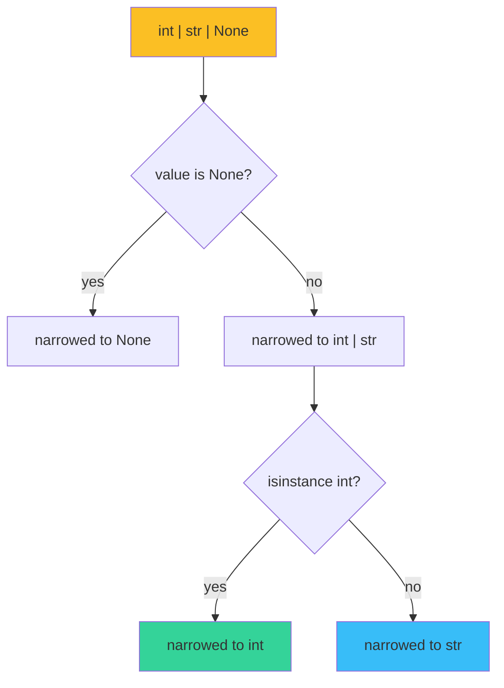

# 🎯 Type Narrowing — `TypeGuard`, `isinstance` and `assert`

A typed variable has a **statically known type** but a **runtime value** that is one of multiple subtypes. The type checker can't predict which subtype the value has at runtime — that's the program's decision. **Type narrowing** is the mechanism by which a conditional branch refines the static type to match the runtime truth. Inside an `isinstance(x, int)` block, the checker treats `x` as `int`. Inside a `TypeGuard` predicate, the checker refines the input to the predicate's declared type. Inside an `assert` of a type predicate, the checker refines similarly.

This is the most underrated feature in modern typing. Without narrowing, every utility function that touches a `dict | Model | None` requires `cast()`, defensive code, or `assert` spam. With narrowing, the checker follows your conditionals and reports the precise type at each use site. The result: code that reads naturally and is statically guaranteed correct.

## 🎯 Learning Objectives

- Use `isinstance` checks to narrow types in conditional branches.
- Declare custom type predicates with `TypeGuard` (PEP 647) for user-defined narrowing.
- Use `assert` with type predicates as a last-resort narrowing tool.
- Distinguish narrowing (refines a known type) from casting (`cast()` tells the checker to trust you).
- Apply narrowing patterns to FastAPI request bodies, LLM JSON outputs, and LLM tool-call argument parsing.

## 1. The Problem: Wide Types, Narrow Truth

```python
def process(value: int | str | None) -> str:
    # value is `int | str | None`
    if value is None:
        return "missing"
    # value is now `int | str`
    if isinstance(value, int):
        return f"int:{value}"
    return f"str:{value}"
```

The static type of `value` shrinks from `int | str | None` to `int | str` after the first check, and to `int` after the second. Each `if` **narrows** the type; inside that branch, the checker knows the precise subtype. This is the cheapest form of narrowing — `isinstance` and identity checks.



## 2. `isinstance` Narrowing — The Built-Ins

The Python type checker recognizes `isinstance` and automatically narrows:

```python
def f(x: int | str) -> None:
    if isinstance(x, int):
        # x is now int — type-checker knows
        print(x.bit_length())  # works
    else:
        # x is now str — type-checker knows
        print(x.upper())       # works
```

The narrowing works for:

- `isinstance(x, T)` — narrows to `T` in the truthy branch.
- `isinstance(x, (T1, T2))` — narrows to `T1 | T2`.
- `x is None` — narrows `T | None` to `T` (and `None` in the else).
- `x is not None` — narrows in the truthy branch.
- `x == y` (where y is a literal) — narrows literals in some checkers.
- `type(x) is T` — narrows to `T`.
- `isinstance(x, T)` with `T` having multiple inheritance — narrows to `T`.

> 💡 **Tip:** `isinstance(x, T)` requires `T` to be a class, not a generic alias. For `isinstance(x, list[int])`, use `isinstance(x, list)` — the type checker still narrows correctly to `list[int]` if the original was `list[int] | dict`.

### `issubclass` Narrowing

```python
from typing import Type

def create(cls: Type[Base]) -> Base:
    if issubclass(cls, User):
        # cls is now Type[User] — narrow works
        return cls.create_user()  # type: ignore[abstract]
    return cls()
```

## 3. `TypeGuard` — Custom Type Predicates

PEP 647 (Python 3.10) added `TypeGuard` for cases where `isinstance` is too narrow:

```python
from typing import TypeGuard, TypeIs

def is_list_of_int(value: object) -> TypeGuard[list[int]]:
    return isinstance(value, list) and all(isinstance(v, int) for v in value)

def process(values: object) -> None:
    if is_list_of_int(values):
        # values is now list[int]
        total = sum(values)
        print(total)
    else:
        # values is still object
        print("not a list of int")
```

The `TypeGuard[T]` return type tells the checker: "if this function returns `True`, the input is of type `T`". The narrowing works across the entire truthy branch and persists if the result is assigned to a variable.

### `TypeIs` vs `TypeGuard` (PEP 742, Python 3.13+)

`TypeGuard` narrows **only the truthy branch**. `TypeIs` (newer) narrows **both branches**:

```python
from typing import TypeIs

def is_list_of_int(value: object) -> TypeIs[list[int]]:
    return isinstance(value, list) and all(isinstance(v, int) for v in value)

def process(values: object) -> None:
    if is_list_of_int(values):
        # values is list[int] (positive)
        print(sum(values))
    else:
        # values is now Not[list[int]] — narrowed negatively
        print(type(values).__name__)
```

For `TypeGuard`, the else branch has no narrowing; the variable's type is unchanged. For `TypeIs`, the else branch narrows to "everything except T".

### Type Guards for AI/ML Outputs

```python
from typing import TypeGuard

def is_valid_embedding(obj: object) -> TypeGuard[list[float]]:
    return (
        isinstance(obj, list)
        and all(isinstance(x, (int, float)) for x in obj)
        and len(obj) > 0
    )

def cosine_similarity(a: object, b: object) -> float | None:
    if is_valid_embedding(a) and is_valid_embedding(b):
        # Both narrowed to list[float]; safe to use math operations
        dot = sum(x * y for x, y in zip(a, b, strict=True))
        na = sum(x * x for x in a) ** 0.5
        nb = sum(y * y for y in b) ** 0.5
        return dot / (na * nb)
    return None
```

> 💡 **Tip:** Wrap every LLM JSON output in a `TypeGuard` predicate. The `BaseModel` from Pydantic ([[../06 - Pydantic Deep Dive/01 - BaseModel, Field and Type System.md|note 03/06/01]]) is the production-grade version; `TypeGuard` is the lightweight fallback.

## 4. `assert` and Type Predicates

`assert isinstance(...)` is the **last-resort** narrowing tool. It works at runtime AND narrows for the checker:

```python
def load_config(path: str) -> dict:
    import json
    data = json.loads(Path(path).read_text())
    assert isinstance(data, dict), "config must be a JSON object"
    return data  # data is now dict for the checker
```

Why "last resort"?

- `assert` is stripped with `python -O`. Production code disables asserts.
- The check throws `AssertionError` instead of a typed exception.
- The type-narrowing logic requires the checker to recognize the assert pattern.

For production code, prefer `TypeGuard` or runtime validation (Pydantic, beartype — see note 06).

### `typing.cast` — The Escape Hatch

```python
from typing import cast

def process(raw: object) -> None:
    data = cast(dict, raw)  # tell the checker: trust me
    print(data["key"])  # OK for the checker; KeyError at runtime
```

`cast()` is the runtime-noop, checker-yes escape hatch. Use it when:

- The value comes from a third-party API with poor typing.
- You've validated manually and want to skip the `TypeGuard` ceremony.
- The narrowing pattern is too complex for the checker.

> ⚠️ **Advertencia:** `cast()` is a **lie to the checker**. If the runtime value doesn't match, the code crashes with a different error downstream. Prefer `TypeGuard` or runtime validation.

## 5. Narrowing in Production Codebases

### FastAPI Request Bodies

```python
from fastapi import FastAPI, HTTPException
from typing import TypeGuard

app = FastAPI()

def is_valid_user(obj: object) -> TypeGuard[dict]:
    return isinstance(obj, dict) and all(
        isinstance(obj.get(k), str) for k in ("name", "email")
    )

@app.post("/users")
async def create_user(payload: object) -> dict:
    if not is_valid_user(payload):
        raise HTTPException(400, "invalid user payload")
    # payload is now dict with str values for name/email
    return {"id": 1, "name": payload["name"], "email": payload["email"]}
```

The `TypeGuard` makes the body validation explicit and the type narrowing automatic. Better than `@app.post` with a `User` Pydantic model? **No** — Pydantic is the production choice for this use case. Use `TypeGuard` for ad-hoc parsers and tool-call argument validation.

### LLM Tool-Call Argument Parsing

LLMs return JSON for tool calls; you need to validate the schema before calling your function:

```python
from typing import TypeGuard

def is_search_query(args: object) -> TypeGuard[dict]:
    if not isinstance(args, dict):
        return False
    query = args.get("query")
    top_k = args.get("top_k", 5)
    return (
        isinstance(query, str)
        and isinstance(top_k, int)
        and 1 <= top_k <= 100
    )

def handle_tool_call(name: str, args: object) -> dict:
    if name == "search":
        if not is_search_query(args):
            return {"error": "invalid args for search"}
        # args is now dict with validated query and top_k
        return {"results": search(args["query"], args["top_k"])}
    return {"error": f"unknown tool {name}"}
```

The `TypeGuard` pattern is exactly the right shape for LLM tool-call argument validation. For higher-assurance, swap for Pydantic (note 06).

## 6. The Narrowing Pattern Ladder

From strongest guarantee to weakest:

1. **Pydantic `BaseModel`** — runtime validation + static type. The strongest.
2. **`TypeGuard` predicate** — runtime check + static narrowing. Strong.
3. **`isinstance` with `T | None`** — built-in narrowing. Adequate for simple cases.
4. **`assert isinstance`** — runtime check (in non-`-O`) + narrowing. Last resort.
5. **`cast()`** — no runtime check, just static narrowing. Untrusted escape hatch.

For an LLM-facing API, use #1 (Pydantic) at the boundary and #2 (TypeGuard) inside.

## 7. ❌/✅ Antipatterns

### ❌ Repeating checks without a TypeGuard

```python
# ❌ Tedious and error-prone
def process(data: object) -> None:
    if not isinstance(data, dict):
        raise TypeError
    if not isinstance(data.get("items"), list):
        raise TypeError
    for item in data["items"]:  # type-checker still sees object
        ...
```

### ✅ Extract a TypeGuard

```python
def is_valid_payload(data: object) -> TypeGuard[dict]:
    if not isinstance(data, dict):
        return False
    items = data.get("items")
    return isinstance(items, list)

def process(data: object) -> None:
    if not is_valid_payload(data):
        raise TypeError("invalid payload")
    # data is now dict
    for item in data["items"]:  # type-checker narrows to list
        ...
```

### ❌ Cast on untrusted input

```python
# ❌ LLM output cast without validation
def process_llm_json(raw: str) -> None:
    parsed = json.loads(raw)
    config = cast(dict, parsed)  # ⚠️ unchecked
    save_to_db(config["api_key"])
```

### ✅ Validate with TypeGuard or Pydantic

```python
# ✅ Validate first, then narrow
def process_llm_json(raw: str) -> None:
    parsed = json.loads(raw)
    if not is_valid_payload(parsed):
        raise ValueError("LLM returned invalid JSON")
    save_to_db(parsed["api_key"])  # safe
```

### ❌ Boolean narrowing with truthy check on `int | None`

```python
def process(x: int | None) -> None:
    if x:  # ⚠️ narrows x to int (truthy) but loses 0
        print(x + 1)
```

### ✅ Explicit `is not None`

```python
def process(x: int | None) -> None:
    if x is not None:  # narrows to int (any value)
        print(x + 1)
```

### ❌ `isinstance` against non-class

```python
def process(x: list[int] | dict[str, int]) -> None:
    if isinstance(x, list[int]):  # ⚠️ TypeError: isinstance() arg 2 must be a type
        ...
```

### ✅ `isinstance` against class, narrow manually

```python
def process(x: list[int] | dict[str, int]) -> None:
    if isinstance(x, list):  # OK; checker narrows to list[int]
        print(x[0])
    elif isinstance(x, dict):
        print(list(x.keys()))
```

## 8. Production Reality

**Caso real — LangGraph tool-call parser:** The Multi-Agent Research System ([[../../07 - AI Agents y Agentic Systems/18 - LangGraph Deep Patterns/09 - Capstone - Rebuilding the Multi-Agent Research System|note 18/09]]) receives LLM-returned tool-call arguments as `dict[str, Any]`. Before adopting `TypeGuard` predicates, the code did six isinstance checks per tool call, two of which were wrong (caught only in production). Adopting `TypeGuard` reduced the parser to one function call per tool and made the narrowing automatic.

**Caso real — FastAPI request validation:** A FastAPI endpoint received `request.json()` from the body; the body schema varied. Adopting a `TypeGuard` predicate per request type made the dispatch table type-safe: the if/elif chain's branches had precise types, IDE autocompletion worked, and mypy caught three mismatched branches at definition time.

## 📦 Compression Code

```python
# 📦 Compression: type narrowing in one file
# Covers: isinstance, TypeGuard, TypeIs, assert, cast, real AI/ML scenarios

from typing import TypeGuard, TypeIs

# === Built-in narrowing ===
def f(x: int | str | None) -> str:
    if x is None:
        return "missing"
    if isinstance(x, int):
        return f"int:{x}"
    return f"str:{x}"

# === TypeGuard for complex checks ===
def is_list_of_int(value: object) -> TypeGuard[list[int]]:
    return isinstance(value, list) and all(isinstance(v, int) for v in value)

def g(values: object) -> None:
    if is_list_of_int(values):
        total = sum(values)  # values is list[int] here
        print(total)

# === TypeIs (negative narrowing) ===
def is_str(value: object) -> TypeIs[str]:
    return isinstance(value, str)

def h(x: object) -> None:
    if is_str(x):
        print(x.upper())
    else:
        # x is now Not[str] — narrow negative
        print(type(x).__name__)

# === LLM tool-call argument guard ===
def is_search_args(args: object) -> TypeGuard[dict[str, object]]:
    return (
        isinstance(args, dict)
        and isinstance(args.get("query"), str)
        and (top_k := args.get("top_k", 5)) is not None
        and isinstance(top_k, int)
    )

def handle_tool(name: str, args: object) -> dict:
    if name == "search" and is_search_args(args):
        return {"q": args["query"], "k": args["top_k"]}
    return {"error": "bad args"}

print(f(1))                # int:1
print(f(None))             # missing
g([1, 2, 3])              # 6
h("hi")                   # HI
h(42)                     # int
print(handle_tool("search", {"query": "x", "top_k": 3}))  # {'q': 'x', 'k': 3}
```

## 🎯 Key Takeaways

1. **`isinstance` is the cheapest narrowing** for built-in types and class hierarchies.
2. **`TypeGuard[T]`** is the declarative narrowing for custom predicates — runtime check + static narrowing.
3. **`TypeIs[T]`** (3.13+) narrows both branches; prefer it when the negative branch needs precision.
4. **`assert isinstance(x, T)`** narrows but is stripped with `python -O` — use it only in dev.
5. **`cast()` is a lie to the checker** — use only when you've validated manually and want to skip `TypeGuard` ceremony.
6. **Narrowing ladder: Pydantic > TypeGuard > isinstance > assert > cast.** Pick by the trust level of the input.
7. **LLM JSON outputs benefit from `TypeGuard`** — one predicate per expected schema, narrow before use.

## References

- [[01 - PEP 695 Type Parameters - Generic Class and Function|PEP 695]] — generics provide the wide types; narrowing refines them.
- [[06 - Runtime Checkers - Beartype, Pydantic, Cattrs|Runtime Checkers]] — Pydantic is the strong-end of the narrowing ladder.
- PEP 647 (`TypeGuard`): https://peps.python.org/pep-0647/
- PEP 742 (`TypeIs`): https://peps.python.org/pep-0742/