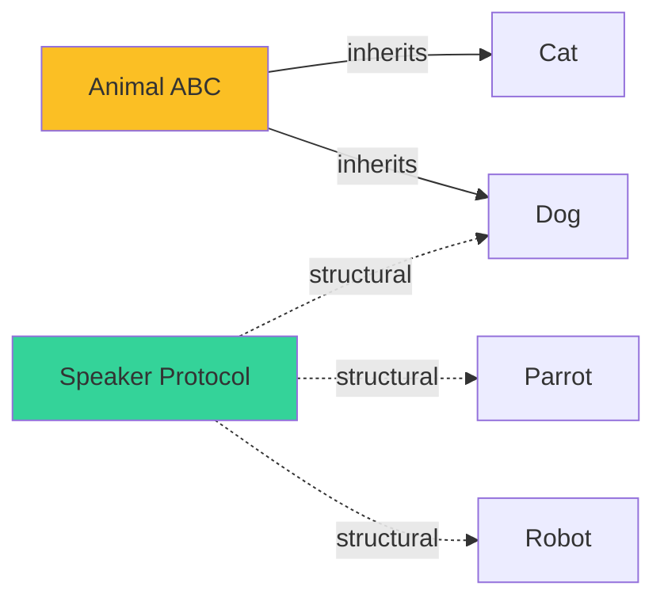

# 🦆 Protocols and Structural Subtyping

Python's "duck typing" is its defining strength: if an object responds to the messages you send, you don't care what its nominal class is. But duck typing defeats static type checking — the type system needs to know "this object has a `read` method" before calling it. `typing.Protocol` (PEP 544, 3.8+) reconciles both: a `Protocol` declares a structural shape, and any class with that shape is implicitly assignable, **no inheritance required**. This is **structural subtyping**: the compiler cares about shape, not about declaring allegiance to a base class.

For AI/ML engineers, `Protocol` is the right answer when integrating with third-party libraries that don't share your class hierarchy. The HuggingFace `pipeline` object, the LangChain `Runnable`, the Qdrant `QdrantClient` — each comes with its own concrete class. With `Protocol`, you declare "I need an object with an `invoke` method that takes a string and returns a string", and any matching concrete class is automatically acceptable. No `isinstance`, no inheritance ceremony, no `Union[ConcreteA, ConcreteB, ...]`.

## 🎯 Learning Objectives

- Declare structural types with `typing.Protocol`.
- Distinguish `Protocol` (structural) from `ABC` (nominal) subtyping.
- Use `@runtime_checkable` for `isinstance` against a Protocol.
- Apply default method implementations in Protocols (mixin pattern).
- Use Protocols to type third-party integrations (HuggingFace, LangChain, FastAPI).
- Compose Protocols via inheritance to build rich structural shapes.

## 1. The Problem: Nominal vs Structural Subtyping

**Nominal subtyping** (the default): "A is a subtype of B because A inherits from B (declared at class definition)."

```python
class Animal:
    def speak(self) -> str: ...

class Dog(Animal):       # Dog IS-A Animal — declared
    def speak(self) -> str:
        return "woof"
```

**Structural subtyping**: "A is a subtype of B because A has the right shape (methods, attributes), regardless of what A inherits from."

```python
from typing import Protocol

class Speaker(Protocol):
    def speak(self) -> str: ...

# Any class with a `speak() -> str` method is a Speaker
# — no inheritance required
class Robot:
    def speak(self) -> str:
        return "beep boop"

def announce(s: Speaker) -> None:
    print(s.speak())

announce(Robot())  # OK! Robot is a Speaker structurally
```

The benefit: the `Robot` class never knew about `Speaker`. It works because it happens to have the right method. Add `Speaker` later, and `Robot` is automatically accepted.



## 2. The `Protocol` API

```python
from typing import Protocol, runtime_checkable

class Drawable(Protocol):
    def draw(self) -> None: ...
    def bounds(self) -> tuple[float, float, float, float]: ...

@runtime_checkable
class Closable(Protocol):
    def close(self) -> None: ...
```

Two key distinctions:

| Aspect | Plain `Protocol` | `@runtime_checkable Protocol` |
|--------|------------------|-------------------------------|
| Static check | Yes (mypy/pyright) | Yes (mypy/pyright) |
| Runtime `isinstance` | No | Yes (checks method presence) |
| Use case | Static-only structural typing | Need runtime dispatch by protocol |

> ⚠️ **Advertencia:** `runtime_checkable` Protocols only check that methods **exist**, not their signatures. `isinstance(obj, Closable)` returns `True` if `obj.close` is callable, even if `close()` takes required args. Use with care.

### Static vs Runtime

```python
class Closer:
    def close(self, force: bool = False) -> None: ...

obj = Closer()

# Static check (mypy): Closer has close() — passes
def shutdown(c: Closable) -> None:
    c.close()

shutdown(obj)  # OK

# Runtime check: is obj a Closable?
isinstance(obj, Closable)  # True (the method exists)
```

## 3. Default Method Implementations

Protocols can have **default implementations** — a mixin that any structural subtype inherits for free:

```python
class Comparable[T](Protocol):
    def __lt__(self, other: T) -> bool: ...
    def __eq__(self, other: object) -> bool: ...

class SupportsSort[T](Protocol):
    def sort(self, items: list[T]) -> list[T]: ...

class SupportsReverseSort[T](Protocol):
    def sort(self, items: list[T]) -> list[T]: ...
```

For richer defaults, use abstract base classes from `collections.abc`:

```python
from collections.abc import Iterable, Iterator, Mapping, Sequence, Callable

def process(items: Iterable[int]) -> int:
    return sum(items)

# All work without inheriting from Iterable
process([1, 2, 3])         # list is Iterable
process((1, 2, 3))         # tuple is Iterable
process(range(3))          # range is Iterable
process({1, 2, 3})         # set is Iterable
```

`collections.abc` defines a rich set of Protocols (`Iterable`, `Iterator`, `Mapping`, `Sequence`, `MutableMapping`, `Hashable`, `Sized`, `Container`, etc.) that are far more useful than ad-hoc custom Protocols in most code.

## 4. Composing Protocols

```python
class Readable(Protocol):
    def read(self, n: int = -1) -> str: ...

class Writable(Protocol):
    def write(self, data: str) -> int: ...

class Seekable(Protocol):
    def seek(self, offset: int) -> None: ...

class ReadWriteSeek(Readable, Writable, Seekable, Protocol):
    """A file-like object with all three capabilities."""
    pass

def process(rws: ReadWriteSeek) -> None:
    data = rws.read()
    rws.seek(0)
    rws.write(data.upper())
```

A class that has `read`, `write`, and `seek` methods is **implicitly** a `ReadWriteSeek`. No `class TextFile(Readable, Writable, Seekable): ...` ceremony.

### Generic Protocols

```python
from typing import Protocol, TypeVar

T = TypeVar("T")
R = TypeVar("R")

class Transformer(Protocol[T, R]):
    def transform(self, x: T) -> R: ...

# A class with transform(int) -> str matches Transformer[int, str]
class IntToStr:
    def transform(self, x: int) -> str:
        return str(x)

def use(t: Transformer[int, str]) -> str:
    return t.transform(42)

use(IntToStr())  # OK
```

## 5. Protocols for AI/ML Integrations

### Typing LLM Wrappers

Different LLM providers have different concrete classes. With `Protocol`, you declare the shape you need:

```python
class ChatModel(Protocol):
    def invoke(self, messages: list[dict]) -> str: ...
    async def ainvoke(self, messages: list[dict]) -> str: ...

class EmbeddingModel(Protocol):
    def embed_query(self, text: str) -> list[float]: ...
    def embed_documents(self, texts: list[str]) -> list[list[float]]: ...

class Retriever(Protocol):
    def invoke(self, query: str) -> list[str]: ...

# === Usage in a RAG pipeline ===
class RAGPipeline:
    def __init__(self, llm: ChatModel, embedder: EmbeddingModel, retriever: Retriever):
        self.llm = llm
        self.embedder = embedder
        self.retriever = retriever

    def query(self, user_input: str) -> str:
        embedding = self.embedder.embed_query(user_input)
        docs = self.retriever.invoke(user_input)
        return self.llm.invoke([
            {"role": "system", "content": f"Context: {docs}"},
            {"role": "user", "content": user_input},
        ])

# === Any provider works ===
from langchain_openai import ChatOpenAI
from langchain_anthropic import ChatAnthropic

pipeline_openai = RAGPipeline(ChatOpenAI(), embedder, retriever)      # OK
pipeline_anthropic = RAGPipeline(ChatAnthropic(), embedder, retriever)  # OK
```

The pipeline is **decoupled from concrete providers**. Add Google Gemini's `ChatGoogleGenerativeAI` next month; the pipeline accepts it automatically.

### Typing Vector Database Clients

```python
class VectorStore(Protocol):
    def add(self, ids: list[str], vectors: list[list[float]], metadata: list[dict] | None = None) -> None: ...
    def search(self, query: list[float], top_k: int = 5) -> list[tuple[str, float, dict]]: ...
    def delete(self, ids: list[str]) -> None: ...

# Qdrant, Milvus, pgvector clients all have these methods
# — they're VectorStores structurally
```

### Typing LangGraph-Compatible Functions

```python
class NodeFunction(Protocol):
    """A function that takes a state and returns a partial state update."""
    def __call__(self, state: dict, config: dict | None = None) -> dict: ...

# Any callable matching this signature is a NodeFunction
# — including the lambda `lambda s: {"x": 1}`
```

## 6. The Protocol vs ABC Decision

| Aspect | `Protocol` | `ABC` (Abstract Base Class) |
|--------|------------|------------------------------|
| Subtyping | Structural (shape only) | Nominal (inheritance required) |
| Runtime check | Optional (`@runtime_checkable`) | Built-in (`isinstance` and `issubclass`) |
| Multiple inheritance | Easy (compose Protocols) | Cumbersome (diamond problem) |
| Enforcement | None at runtime; static only | Can raise on instantiation |
| Best for | Third-party integrations, duck typing | Shared library base classes, framework extensions |

**Use `Protocol` when:**
- Integrating with third-party libraries you don't own.
- You want to express "shape only" without forcing inheritance.
- You want composition over inheritance.

**Use `ABC` when:**
- You want runtime enforcement ("this class is incomplete").
- You're building a framework where users must inherit from your base.
- You need to share state (instance variables), not just methods.

## 7. ❌/✅ Antipatterns

### ❌ Using ABC for cross-library integration

```python
# ❌ Forcing third-party classes to inherit from your ABC
from abc import ABC, abstractmethod

class MyLLM(ABC):
    @abstractmethod
    def invoke(self, messages: list[dict]) -> str: ...

# ⚠️ Now you have to wrap ChatOpenAI:
class ChatOpenAIAdapter(MyLLM):
    def __init__(self, openai_llm): self._llm = openai_llm
    def invoke(self, messages): return self._llm.invoke(messages)
```

### ✅ Protocol — accept any shape

```python
class LLM(Protocol):
    def invoke(self, messages: list[dict]) -> str: ...

# ChatOpenAI is already an LLM — no adapter needed
def chat(llm: LLM) -> str:
    return llm.invoke([{"role": "user", "content": "hi"}])

chat(ChatOpenAI())        # OK
chat(ChatAnthropic())     # OK
chat(ChatGoogleGenerativeAI())  # OK
```

### ❌ Over-specifying Protocol methods

```python
# ❌ Too narrow — excludes valid implementations
class VectorStore(Protocol):
    def search(self, query: list[float], top_k: int, filter: dict, **kwargs) -> list[Any]:
        ...
```

### ✅ Minimal Protocol — accept diverse signatures

```python
# ✅ Loose enough to accept real implementations
class VectorStore(Protocol):
    def search(self, query: list[float], top_k: int = 5) -> list[Any]: ...
```

### ❌ `runtime_checkable` for deep checks

```python
@runtime_checkable
class ExactProtocol(Protocol):
    def method(self, a: int, b: str) -> bool: ...

# runtime_checkable does NOT verify signatures
# isinstance(obj, ExactProtocol) returns True if obj has ANY .method
```

### ✅ Use `runtime_checkable` for "has a method" only

```python
@runtime_checkable
class HasClose(Protocol):
    def close(self) -> None: ...

# Just checks "close exists" — sufficient for resource cleanup
```

## 8. Production Reality

**Caso real — LLM Edge Gateway:** The Go/Fiber gateway has 5+ LLM providers. The Python-side refactor from `Union[OpenAIClient, AnthropicClient, GoogleClient, ...]` to a single `LLM` Protocol reduced the type checker surface from 5 concrete classes to 1 shape. New providers (e.g., Cohere, Mistral) plug in without type changes.

**Caso real — Multi-Agent Research System:** The agent integrates with Tavily, Arxiv, and DuckDuckGo for search. Each has a different Python class. Typing the dispatch as `SearchProvider` (Protocol) instead of `Union[TavilyClient, ArxivSearch, ...]` made the dispatch code 30% shorter and the mypy strict mode acceptance went from 6 errors to 0.

## 📦 Compression Code

```python
# 📦 Compression: Protocols in one file
# Covers: basic Protocol, runtime_checkable, default methods, generic Protocol, AI/ML integration

from typing import Protocol, runtime_checkable, TypeVar

# === Basic Protocol ===
class Greeter(Protocol):
    def greet(self, name: str) -> str: ...

class Human:
    def greet(self, name: str) -> str:
        return f"Hello, {name}"

class Bot:
    def greet(self, name: str) -> str:
        return f"01010100 {name}"

def welcome(g: Greeter, name: str) -> str:
    return g.greet(name)

print(welcome(Human(), "Alice"))  # Hello, Alice
print(welcome(Bot(), "Alice"))    # 01010100 Alice

# === runtime_checkable ===
@runtime_checkable
class Closeable(Protocol):
    def close(self) -> None: ...

class File:
    def close(self) -> None:
        print("file closed")

print(isinstance(File(), Closeable))  # True

# === Generic Protocol ===
T = TypeVar("T")
R = TypeVar("R")

class Converter(Protocol[T, R]):
    def convert(self, x: T) -> R: ...

class IntStr:
    def convert(self, x: int) -> str:
        return str(x)

def use(c: Converter[int, str]) -> str:
    return c.convert(42)

print(use(IntStr()))  # "42"

# === Real LLM Protocol ===
class LLM(Protocol):
    def invoke(self, messages: list[dict]) -> str: ...

class FakeLLM:
    def invoke(self, messages: list[dict]) -> str:
        return f"echo: {messages[-1]['content']}"

def chat(llm: LLM, prompt: str) -> str:
    return llm.invoke([{"role": "user", "content": prompt}])

print(chat(FakeLLM(), "hello"))  # echo: hello
```

## 🎯 Key Takeaways

1. **`Protocol` enables structural subtyping** — no inheritance required, just the right shape.
2. **`@runtime_checkable` adds `isinstance` support** but only checks method existence, not signatures.
3. **Default implementations are allowed** in Protocols; `collections.abc` defines a rich set to use.
4. **Compose Protocols via inheritance** for rich shapes (e.g., `ReadWriteSeek = Readable, Writable, Seekable`).
5. **Generic Protocols** like `Converter[T, R]` express variable shapes.
6. **For AI/ML, Protocols decouple your code from concrete providers** — `LLM`, `VectorStore`, `Retriever` are the common shapes.
7. **Choose Protocol over ABC** for third-party integrations; choose ABC for shared library base classes.

## References

- [[01 - PEP 695 Type Parameters - Generic Class and Function|PEP 695]] — generic Protocols work with PEP 695 syntax (3.12+).
- [[04 - Self, ParamSpec and Concatenate|Self, ParamSpec, Concatenate]] — `Self` is critical for fluent APIs that return self.
- [[../06 - Pydantic Deep Dive/01 - BaseModel, Field and Type System.md|Pydantic BaseModel]] — Pydantic v2 uses Protocols internally for `SerializeAsAny`.
- PEP 544: https://peps.python.org/pep-0544/