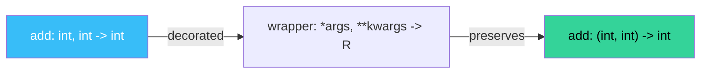

# 🔄 `Self`, `ParamSpec` and `Concatenate` — Fluent APIs and Decorators

Three Python typing additions from PEPs 673, 612 and 646 (Python 3.10-3.11) close the most common gaps in the 2018 typing system. **`Self`** (PEP 673) lets a method declare it returns the same type as the receiver — essential for fluent builder patterns and `clone()`-style APIs. **`ParamSpec`** (PEP 612) preserves the parameter signature of a wrapped function so decorators can forward arguments type-safely. **`Concatenate`** lets decorators prepend or remove parameters from the wrapped signature. Together they turn awkward `TypeVar("Self", bound=...)` and `ParamSpec("P")` patterns into first-class syntax.

For AI/ML engineers, these three are most useful in three places: (1) builder patterns in agent construction (LangGraph state builders, FastAPI dependency injection), (2) decorators that wrap LLM calls (logging, retry, telemetry), and (3) `clone()` / `copy()` methods on dataclass-style models (Pydantic, dataclasses). Without `Self`, `ParamSpec`, and `Concatenate`, the alternatives are `cast()`, the loss of static signature inspection, or hand-rolled `TypeVar` patterns that fail in subtle ways.

## 🎯 Learning Objectives

- Use `Self` (PEP 673, 3.11+) for fluent APIs and class methods.
- Apply `ParamSpec` (PEP 612, 3.10+) to type-preserving decorators.
- Use `Concatenate` to add or remove parameters from a wrapped signature.
- Build decorator factories that preserve signatures and add typed parameters.
- Distinguish `Self` from the legacy `TypeVar("Self", bound=...)` pattern.

## 1. The Problem: Method Return Types

```python
class Builder:
    def with_name(self, name: str) -> "Builder":  # legacy: explicit string
        self.name = name
        return self

    def with_age(self, age: int) -> "Builder":  # repeat "Builder" everywhere
        self.age = age
        return self
```

Three issues:

1. **String forward reference.** If `Builder` is renamed, all the strings break silently.
2. **Doesn't work with subclasses.** If `BetterBuilder(Builder)` overrides `with_name`, the return type stays `Builder`, losing the subclass type.
3. **Verbose.** Long class names = long string repetitions.

`Self` (PEP 673) fixes all three.

## 2. `Self` — Type of the Receiver

```python
from typing import Self

class Builder:
    def with_name(self, name: str) -> Self:
        self.name = name
        return self

    def with_age(self, age: int) -> Self:
        self.age = age
        return self

# Subclass automatically works
class BetterBuilder(Builder):
    def with_email(self, email: str) -> Self:
        self.email = email
        return self

# builder is inferred as BetterBuilder
builder = BetterBuilder().with_name("Alice").with_age(30).with_email("a@b.c")
# IDE/mypy see `builder` as BetterBuilder
```

The `Self` keyword resolves at type-check time to "the type of the receiver". When the receiver is a subclass, `Self` resolves to the subclass.

### `Self` in Class Methods

```python
class Config:
    def __init__(self, name: str) -> None:
        self.name = name

    @classmethod
    def from_dict(cls, data: dict) -> Self:
        return cls(data["name"])

class StrictConfig(Config):
    def validate(self) -> bool: ...

# Returns StrictConfig, not Config
sc = StrictConfig.from_dict({"name": "prod"})
sc.validate()  # type-checker sees sc as StrictConfig
```

### `Self` for `clone()`

```python
class State:
    def clone(self) -> Self:
        new = self.__class__(**self.__dict__)
        return new

class ResearchState(State):
    findings: list[str] = []

rs = ResearchState()
rs.findings.append("a")
rs2 = rs.clone()
# rs2 is ResearchState, not State
print(type(rs2).__name__)  # ResearchState
```

### `Self` for `__enter__` in Context Managers

```python
class Database:
    def __enter__(self) -> Self:
        self._connect()
        return self

    def __exit__(self, *exc) -> None:
        self._disconnect()

with Database() as db:
    db.execute("SELECT 1")
    # db is Database (or subclass)
```

## 3. The Legacy `Self` Pattern (for 3.10 and earlier)

```python
from typing import TypeVar
Self = TypeVar("Self", bound="Builder")  # old way

class Builder:
    def with_name(self, name: str) -> Self:
        ...
```

The legacy pattern works but is verbose and tied to the specific class name. PEP 673's `Self` is built-in and class-agnostic.

## 4. `ParamSpec` — Type-Preserving Decorators

The classic decorator loses the wrapped function's signature:

```python
# ❌ Without ParamSpec — the wrapped function's types are erased
from functools import wraps
import time

def timed(func):
    @wraps(func)
    def wrapper(*args, **kwargs):
        start = time.time()
        result = func(*args, **kwargs)
        print(f"{func.__name__} took {time.time() - start:.2f}s")
        return result
    return wrapper

@timed
def add(a: int, b: int) -> int:
    return a + b

# mypy/pyright sees `add` as `Any -> Any` — types lost
result: int = add(1, 2)  # type-checker warns
```

`ParamSpec` preserves the signature:

```python
from typing import ParamSpec, Callable, TypeVar
from functools import wraps
import time

P = ParamSpec("P")
R = TypeVar("R")

def timed(func: Callable[P, R]) -> Callable[P, R]:
    @wraps(func)
    def wrapper(*args: P.args, **kwargs: P.kwargs) -> R:
        start = time.time()
        result = func(*args, **kwargs)
        print(f"{func.__name__} took {time.time() - start:.2f}s")
        return result
    return wrapper

@timed
def add(a: int, b: int) -> int:
    return a + b

# ✅ mypy/pyright see `add` as `(int, int) -> int`
result: int = add(1, 2)  # OK

@timed
async def fetch(url: str, timeout: float = 5.0) -> bytes:
    ...

# ✅ Even async functions work — the type propagates
```



## 5. `Concatenate` — Adding/Removing Parameters

`Concatenate` lets a decorator **prepend** arguments to the wrapped function's signature:

```python
from typing import ParamSpec, Concatenate, Callable, TypeVar

P = ParamSpec("P")
R = TypeVar("R")

# Decorator that adds a `user: User` argument
def with_user(func: Callable[Concatenate[User, P], R]) -> Callable[P, R]:
    def wrapper(*args: P.args, **kwargs: P.kwargs) -> R:
        user = get_current_user()  # from context
        return func(user, *args, **kwargs)
    return wrapper

# Usage: the wrapped function takes User first, the decorator hides it
@with_user
def save(user: User, record: Record) -> None:
    user.require_permission("write")
    record.save()

save(Record())  # type-checker sees: save(Record) -> None
# The User is injected from context
```

### Removing Parameters (Inverse)

```python
# Decorator that takes the first argument out of the call
def cached(func: Callable[Concatenate[str, P], R]) -> Callable[P, R]:
    cache: dict[str, R] = {}
    def wrapper(*args: P.args, **kwargs: P.kwargs) -> R:
        key = ...  # compute key from first arg, but ParamSpec can't access it
        # Workaround: re-decorate
        ...
```

The inverse pattern (removing params) is harder; usually it means restructuring the wrapped function. Use `Concatenate` to add params, not remove them.

## 6. `Self` + `ParamSpec` in Real Code

### Builder Pattern for LangGraph State

```python
from typing import Self, ParamSpec, Callable, TypeVar

P = ParamSpec("P")
R = TypeVar("R")

class StateBuilder:
    def __init__(self) -> None:
        self._state: dict = {}

    def with(self, **kwargs) -> Self:
        self._state.update(kwargs)
        return self

    def with_query(self, query: str) -> Self:
        self._state["query"] = query
        return self

    def with_thread(self, thread_id: str) -> Self:
        self._state["thread_id"] = thread_id
        return self

    def build(self) -> dict:
        return dict(self._state)

# Fluent API, type-safe
state = (
    StateBuilder()
    .with_query("LangGraph patterns")
    .with_thread("user-42")
    .build()
)
```

### LLM Call Decorator with Retry

```python
from typing import ParamSpec, Callable, TypeVar
import asyncio

P = ParamSpec("P")
R = TypeVar("R")

def with_retry(max_attempts: int = 3):
    def decorator(func: Callable[P, R]) -> Callable[P, R]:
        @wraps(func)
        def wrapper(*args: P.args, **kwargs: P.kwargs) -> R:
            for attempt in range(max_attempts):
                try:
                    return func(*args, **kwargs)
                except (ConnectionError, TimeoutError) as e:
                    if attempt == max_attempts - 1:
                        raise
                    time.sleep(0.5 * (2 ** attempt))
            return None  # unreachable
        return wrapper
    return decorator

@with_retry(max_attempts=3)
def call_llm(prompt: str, model: str = "gpt-4o-mini") -> str:
    return openai_client.chat(prompt, model)

# Type preserved: call_llm(prompt: str, model: str = ...) -> str
```

### Telemetry Decorator

```python
import time
from typing import ParamSpec, Callable, TypeVar

P = ParamSpec("P")
R = TypeVar("R")

def traced(name: str):
    def decorator(func: Callable[P, R]) -> Callable[P, R]:
        @wraps(func)
        def wrapper(*args: P.args, **kwargs: P.kwargs) -> R:
            span_id = start_span(name)
            try:
                result = func(*args, **kwargs)
                end_span(span_id, status="ok")
                return result
            except Exception as e:
                end_span(span_id, status="error", error=str(e))
                raise
        return wrapper
    return decorator

@traced("llm_call")
def call_llm(prompt: str) -> str:
    return openai_client.chat(prompt)
```

## 7. ❌/✅ Antipatterns

### ❌ Returning `Self` for a class that should return a different subclass

```python
class Base:
    def make_copy(self) -> Self:  # ⚠️ if subclass is not same class, return type is wrong
        return self.__class__()

class StrictBase(Base):
    extra: int = 0
    def make_strict(self) -> "StrictBase":
        return self
```

### ✅ Use `Self` only for true self-returning methods

```python
class Base:
    def make_copy(self) -> Self:  # OK — same class returned
        return self.__class__()

    def make_strict(self) -> "StrictBase":  # OK — explicit subclass return
        return type(self)(strict=True)  # type: ignore[call-arg]
```

### ❌ Decorator that erases the signature

```python
def log(func):  # no ParamSpec — types lost
    @wraps(func)
    def wrapper(*args, **kwargs):
        print(func.__name__)
        return func(*args, **kwargs)
    return wrapper
```

### ✅ Use ParamSpec

```python
def log(func: Callable[P, R]) -> Callable[P, R]:
    @wraps(func)
    def wrapper(*args: P.args, **kwargs: P.kwargs) -> R:
        print(func.__name__)
        return func(*args, **kwargs)
    return wrapper
```

### ❌ `Self` in 3.10 (doesn't exist)

```python
# Python 3.10 doesn't have Self
from typing import Self  # ⚠️ ImportError on 3.10
```

### ✅ Use TypeVar-bound for 3.10

```python
# Python 3.10 fallback
from typing import TypeVar
Self = TypeVar("Self", bound="MyClass")
```

## 8. Production Reality

**Caso real — LangGraph node factory:** A factory function that creates LangGraph nodes from arbitrary callables (for dynamic agent construction) was losing the node's signature until ParamSpec was added. With ParamSpec, the factory's output preserves the input callable's signature, and downstream type-checking works correctly.

**Caso real — Pydantic v2 model_copy():** Pydantic's `model_copy(update=...)` returns `Self`, so subclasses like `UserModel(UserBase)` correctly get `UserModel` back. Without `Self`, the return type was `UserBase`, breaking fluent pattern code that called subclass-specific methods.

## 📦 Compression Code

```python
# 📦 Compression: Self, ParamSpec, Concatenate in one file
# Covers: Self for fluent APIs, ParamSpec for decorators, Concatenate for arg injection

from typing import Self, ParamSpec, Concatenate, Callable, TypeVar
from functools import wraps

# === Self for fluent API ===
class Builder:
    def __init__(self) -> None:
        self._data: dict = {}
    def with_name(self, name: str) -> Self:
        self._data["name"] = name
        return self
    def with_age(self, age: int) -> Self:
        self._data["age"] = age
        return self
    def build(self) -> dict:
        return dict(self._data)

# === ParamSpec for type-preserving decorator ===
P = ParamSpec("P")
R = TypeVar("R")

def timed(func: Callable[P, R]) -> Callable[P, R]:
    @wraps(func)
    def wrapper(*args: P.args, **kwargs: P.kwargs) -> R:
        import time
        start = time.time()
        result = func(*args, **kwargs)
        print(f"{func.__name__} took {time.time() - start:.4f}s")
        return result
    return wrapper

@timed
def add(a: int, b: int) -> int:
    return a + b

print(add(1, 2))  # 3, with timing log

# === Concatenate for arg injection ===
class User:
    def __init__(self, name: str) -> None:
        self.name = name

def with_user(func: Callable[Concatenate[User, P], R]) -> Callable[P, R]:
    def wrapper(*args: P.args, **kwargs: P.kwargs) -> R:
        current = User("alice")  # from context
        return func(current, *args, **kwargs)
    return wrapper

@with_user
def save_record(user: User, record: str) -> None:
    print(f"{user.name} saved {record}")

save_record("data-1")  # type-checker sees: save_record(record: str) -> None

# === Demonstration ===
b = Builder().with_name("Alice").with_age(30).build()
print(b)  # {'name': 'Alice', 'age': 30}
```

## 🎯 Key Takeaways

1. **`Self` (3.11+) replaces the `TypeVar("Self", bound=...)` pattern** for fluent APIs, `clone()`, `__enter__`, and `from_dict` class methods.
2. **`ParamSpec` preserves the wrapped function's signature** in decorators. Without it, decorators erase types.
3. **`Concatenate` adds parameters to a wrapped function's signature** for arg-injecting decorators.
4. **`Self` resolves to the runtime class**, not the declared class — subclass behavior is correct.
5. **`Self` requires Python 3.11+.** For 3.10, fall back to `TypeVar("Self", bound="X")`.
6. **Combine `Self` and `ParamSpec`** for builder patterns and decorator factories that compose.

## References

- [[03 - Protocols and Structural Subtyping|Protocols]] — `Self` is essential for `Protocol` methods.
- [[../06 - Pydantic Deep Dive/05 - Advanced Model Patterns.md|Pydantic Advanced Patterns]] — `model_copy()` and `model_dump()` use `Self`.
- PEP 673: https://peps.python.org/pep-0673/
- PEP 612: https://peps.python.org/pep-0612/