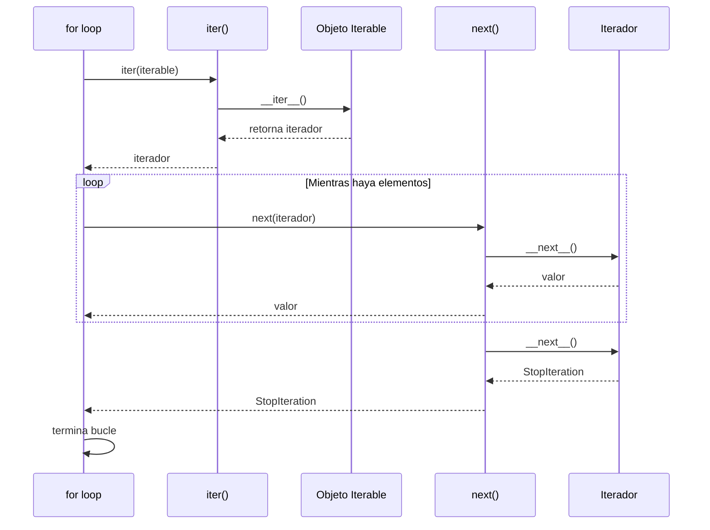
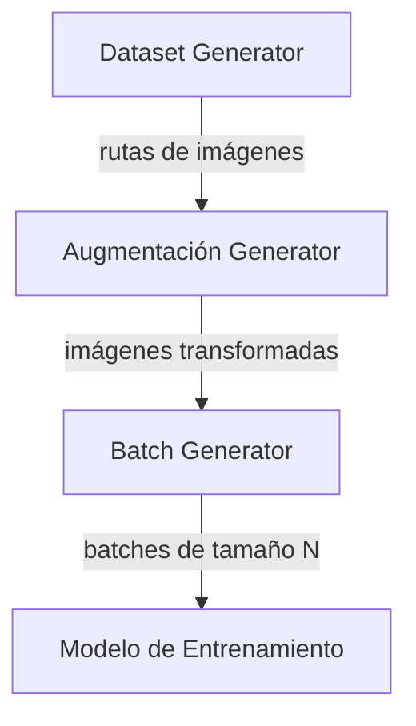

# 01 - Iteradores y Generadores

En ML, los datasets a menudo son enormes. Cargar 10 millones de registros en memoria es inviable. Los iteradores y generadores resuelven esto procesando datos **bajo demanda**, uno a uno.

---

## 1. Protocolo del Iterador

Un iterador en Python es cualquier objeto que implemente dos métodos:

- `__iter__()`: devuelve el propio iterador.
- `__next__()`: devuelve el siguiente valor o lanza `StopIteration`.

### Cómo funciona internamente

Cuando escribes `for x in iterable:`, Python hace esto:

1. Llama `iter(iterable)` → obtiene el iterador (método `__iter__`).
2. Llama repetidamente `next(iterador)` → obtiene valores (método `__next__`).
3. Cuando `__next__` lanza `StopIteration`, el bucle termina.



### Ejemplo: iterador manual

```python
class Contador:
    def __init__(self, limite):
        self.limite = limite
        self.actual = 0

    def __iter__(self):
        return self

    def __next__(self):
        if self.actual >= self.limite:
            raise StopIteration
        valor = self.actual
        self.actual += 1
        return valor

# Uso
for numero in Contador(5):
    print(numero)  # 0, 1, 2, 3, 4
```

> 💡 **Caso real:** PyTorch usa iteradores en `DataLoader`. Cada llamada a `next()` carga un nuevo batch del disco a RAM.

### Iterables vs Iteradores

Es crucial distinguir ambos conceptos:

- **Iterable**: Cualquier objeto que puedes recorrer con `for`. Implementa `__iter__()` y devuelve un iterador. Ejemplos: `list`, `str`, `dict`, `range`.
- **Iterator**: El objeto que *realmente* realiza el recorrido. Implementa `__iter__()` (devolviendo `self`) y `__next__()`.

```python
lista = [1, 2, 3]
print(hasattr(lista, '__iter__'))  # True → es iterable
print(hasattr(lista, '__next__'))  # False → no es iterador

iterador = iter(lista)
print(hasattr(iterador, '__next__'))  # True → es iterador
```

> 💡 **Regla mnemotécnica:** Todos los iteradores son iterables, pero no todos los iterables son iteradores. Un iterador se "agota" después de un solo recorrido.

### Patrones de diseño: Iterator Pattern

El patrón Iterator es uno de los 23 patrones GoF (Gang of Four). Permite recorrer una colección sin exponer su representación interna. En Python, está tan integrado que raramente necesitas implementarlo manualmente, pero entenderlo te ayuda a diseñar colecciones complejas (como árboles de decisión o grafos de computación).

**Beneficios:**
- **Single Responsibility**: la lógica de recorrido vive en el iterador, no en la colección.
- **Open/Closed**: puedes añadir nuevos tipos de recorrido (pre-order, post-order, level-order) sin modificar la colección.

---

## 2. Generadores con `yield`

Un generador es una función que usa `yield` en lugar de `return`. Cada vez que se llama, retoma desde donde se quedó.

### Ventajas clave

| Aspecto | Función normal | Generador |
|---------|----------------|-----------|
| Memoria | Crea toda la lista | Genera valores bajo demanda |
| Estado | Pierde estado entre llamadas | Mantiene estado pausado |
| Lazy evaluation | No | Sí |

### Ejemplo básico

```python
def contador_generador(limite):
    actual = 0
    while actual < limite:
        yield actual
        actual += 1

# Uso
for numero in contador_generador(5):
    print(numero)  # 0, 1, 2, 3, 4
```

### Ejemplo: leer archivo línea por línea

```python
def leer_log(ruta):
    """Lee un archivo de log sin cargarlo completo en memoria."""
    with open(ruta, 'r') as archivo:
        for linea in archivo:
            yield linea.strip()

# Procesar millones de líneas con RAM constante
for linea in leer_log('servidor.log'):
    if 'ERROR' in linea:
        print(linea)
```

---

## 3. Expresiones generadoras

Sintaxis compacta similar a list comprehensions pero con `()` en lugar de `[]`.

```python
# List comprehension (crea lista completa en memoria)
cuadrados_lista = [x**2 for x in range(1_000_000)]

# Generator expression (genera valores bajo demanda)
cuadrados_gen = (x**2 for x in range(1_000_000))

# Uso
print(next(cuadrados_gen))  # 0
print(next(cuadrados_gen))  # 1
```

> 💡 **Regla práctica:** Si solo vas a iterar una vez, usa expresiones generadoras. Si necesitas indexar o recorrer múltiples veces, usa listas.

---

## 4. Generadores infinitos

Útiles para entrenamiento de modelos con epochs infinitos o data augmentation en tiempo real.

```python
def ciclo_infinito(datos):
    """Cicla sobre datos para siempre (útil para epochs infinitos)."""
    while True:
        for item in datos:
            yield item

# Uso en entrenamiento
dataset = [1, 2, 3]
loader = ciclo_infinito(dataset)

for _ in range(10):
    print(next(loader))  # 1, 2, 3, 1, 2, 3, 1, 2, 3, 1
```

---

## 5. `yield from` — Delegación

Delega a otro generador sin escribir un bucle manual.

```python
def generador_a():
    yield 1
    yield 2

def generador_b():
    yield from generador_a()
    yield 3

print(list(generador_b()))  # [1, 2, 3]
```

> 💡 En pipelines de datos, `yield from` permite componer transformaciones como si fueran tuberías Unix.

## 6. Métodos avanzados de generadores: `send`, `throw`, `close`

Los generadores en Python son más potentes de lo que parecen. Además de producir valores, pueden **recibir** valores y manejar excepciones.

### `send()` — Comunicación bidireccional

```python
def acumulador():
    total = 0
    while True:
        valor = yield total  # Produce total, recibe valor
        if valor is None:
            break
        total += valor

acc = acumulador()
next(acc)  # Inicializa el generador (hasta el primer yield)

print(acc.send(10))   # 10
print(acc.send(20))   # 30
print(acc.send(5))    # 35
acc.close()
```

> 💡 **Caso real:** `send()` es la base de los **async/await** de Python. Una corrutina async no es más que un generador que recibe valores vía `send()`.

### `throw()` — Inyectar excepciones

```python
def procesador():
    try:
        while True:
            dato = yield
            print(f"Procesando: {dato}")
    except ValueError:
        print("Error manejado, reiniciando...")

p = procesador()
next(p)
p.send("A")
p.throw(ValueError, "dato inválido")  # Inyecta excepción
p.send("B")
```

### `close()` — Terminar graceful

Lanza `GeneratorExit` dentro del generador, permitiendo liberar recursos (cerrar archivos, conexiones).

---

## 📦 Código de compresión: Pipeline de DataLoader desde cero



```python
"""
Mini DataLoader usando generadores.
Demuestra cómo PyTorch carga datos sin saturar la memoria.
"""
import random

def dataset_generator(rutas_imagenes):
    """Generador base: produce rutas de imágenes."""
    for ruta in rutas_imagenes:
        yield ruta

def augmentacion_generator(generator):
    """Transformación intermedia: aplica augmentación."""
    for ruta in generator:
        # Simulamos augmentación aleatoria
        flip = random.choice([True, False])
        yield {"ruta": ruta, "flip": flip}

def batch_generator(generator, batch_size=4):
    """Agrupa elementos en batches."""
    batch = []
    for item in generator:
        batch.append(item)
        if len(batch) == batch_size:
            yield batch
            batch = []
    if batch:
        yield batch  # Último batch incompleto

# --- Flujo completo ---
imagenes = [f"img_{i}.jpg" for i in range(10)]

pipeline = batch_generator(
    augmentacion_generator(
        dataset_generator(imagenes)
    ),
    batch_size=3
)

for batch in pipeline:
    print(f"Batch con {len(batch)} elementos: {batch}")

# Salida:
# Batch con 3 elementos: [{'ruta': 'img_0.jpg', 'flip': False}, ...]
# Batch con 3 elementos: [...]
# Batch con 3 elementos: [...]
# Batch con 1 elementos: [...]
```

---


