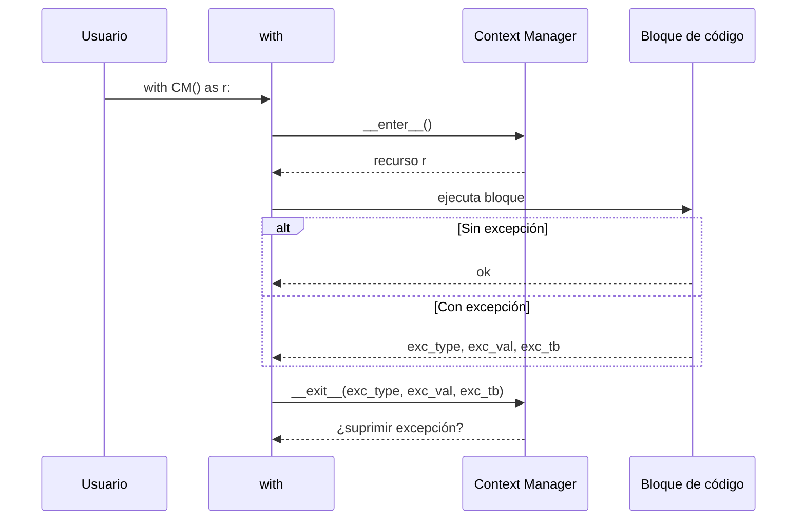
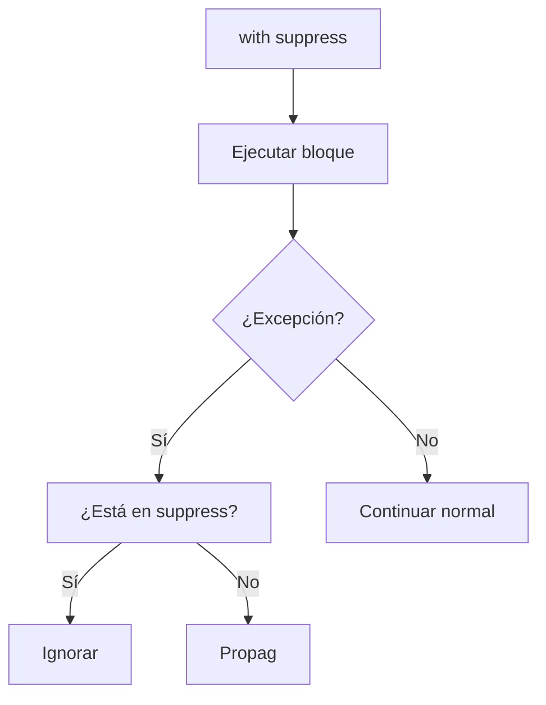

# 03 - Context Managers

Los context managers garantizan que los recursos se inicialicen y liberen correctamente, sin importar si ocurre una excepción. Son esenciales para manejar archivos, conexiones a bases de datos, sesiones de GPU y locks de concurrencia.

---

## 1. El problema: recursos sin liberar

```python
# ❌ MAL: si ocurre un error, el archivo no se cierra
archivo = open("datos.txt", "r")
datos = archivo.read()  # Error aquí → archivo queda abierto
archivo.close()
```

```python
# ✅ BIEN: el archivo se cierra siempre
with open("datos.txt", "r") as archivo:
    datos = archivo.read()
# archivo.close() se llama automáticamente
```

---

## 2. Protocolo del Context Manager

Un objeto es un context manager si implementa:

- `__enter__(self)`: código que se ejecuta al entrar al bloque `with`. Devuelve el recurso.
- `__exit__(self, exc_type, exc_val, exc_tb)`: código que se ejecuta al salir, incluso si hubo excepción.



### Ejemplo: medir tiempo de un bloque

```python
import time

class Timer:
    def __enter__(self):
        self.inicio = time.perf_counter()
        return self

    def __exit__(self, exc_type, exc_val, exc_tb):
        self.duracion = time.perf_counter() - self.inicio
        print(f"Bloque tomó {self.duracion:.4f} segundos")
        # Retornar False propaga la excepción si ocurrió
        return False

# Uso
with Timer() as t:
    time.sleep(0.1)
    print("Procesando...")
# Al salir: "Bloque tomó 0.1001 segundos"
```

---

## 3. `contextlib` — Forma funcional

Para context managers simples, no necesitas una clase. Usa `@contextmanager`.

```python
from contextlib import contextmanager

@contextmanager
def timer(nombre_bloque):
    inicio = time.perf_counter()
    yield  # Aquí se ejecuta el bloque `with`
    duracion = time.perf_counter() - inicio
    print(f"[{nombre_bloque}] {duracion:.4f}s")

with timer("entrenamiento"):
    time.sleep(0.05)
# [entrenamiento] 0.0501s
```

> 💡 `yield` divide el código: antes es `__enter__`, después es `__exit__`.

### El patrón RAII (Resource Acquisition Is Initialization)

Los context managers implementan RAII, un patrón de C++ adoptado por Python. La idea es simple: **el ciclo de vida de un recurso está ligado al de un objeto**. Cuando el objeto se destruye (o sale del bloque `with`), el recurso se libera automáticamente.

**Recursos comunes en ML:**
- Archivos de datos (CSV, Parquet, TFRecord).
- Conexiones a bases de datos (PostgreSQL, Redis, MongoDB).
- Sesiones de GPU (CUDA context).
- Locks para sincronización entre threads.
- Sesiones HTTP (pools de conexiones).

> 💡 **Sin RAII:** Cada vez que abres un recurso, necesitas `try...finally` manual. Con RAII, `with` lo hace por ti.

### `__exit__` y supresión de excepciones

El valor de retorno de `__exit__` controla si la excepción se propaga:

```python
class SuprimirErrores:
    def __enter__(self):
        return self

    def __exit__(self, exc_type, exc_val, exc_tb):
        if exc_type is not None:
            print(f"Capturado: {exc_val}")
            return True  # True = suprimir excepción
        return False     # False = propagar normalmente

with SuprimirErrores():
    raise ValueError("Esto no se propagará")
print("Continuamos")  # Se ejecuta
```

> ⚠️ **Usar con extrema cautela.** Suprimir excepciones sin loggearlas es un anti-patrón peligroso.

---

## 4. Suprimir excepciones

```python
from contextlib import suppress

# En lugar de try/except/pass
with suppress(FileNotFoundError):
    os.remove("archivo_temporal.txt")
# Si el archivo no existe, no pasa nada
```



---

## 5. Redireccionar salida

```python
from contextlib import redirect_stdout
import io

buffer = io.StringIO()
with redirect_stdout(buffer):
    print("Este texto va al buffer, no a la consola")

output = buffer.getvalue()
```

---

## 6. Context managers anidados y múltiples

```python
from contextlib import ExitStack

with ExitStack() as stack:
    archivo1 = stack.enter_context(open("a.txt"))
    archivo2 = stack.enter_context(open("b.txt"))
    archivo3 = stack.enter_context(open("c.txt"))
    # Los 3 archivos se cierran automáticamente al salir
```

---

## 7. Casos reales en ML

### Gestión de sesión GPU en PyTorch

```python
import torch

@contextmanager
def gpu_session(device_id=0):
    """Asegura que la memoria GPU se limpie incluso si hay error."""
    device = torch.device(f"cuda:{device_id}" if torch.cuda.is_available() else "cpu")
    print(f"Usando {device}")
    try:
        yield device
    finally:
        if torch.cuda.is_available():
            torch.cuda.empty_cache()
            print("Cache GPU liberada")

with gpu_session(device_id=0) as dev:
    tensor = torch.randn(1000, 1000, device=dev)
    resultado = tensor @ tensor
# Al salir: "Cache GPU liberada"
```

### Transacción de base de datos

```python
@contextmanager
def transaction(conexion):
    """Commit si todo va bien, rollback si hay error."""
    cursor = conexion.cursor()
    try:
        yield cursor
        conexion.commit()
        print("Transacción confirmada")
    except Exception as e:
        conexion.rollback()
        print(f"Transacción revertida: {e}")
        raise
    finally:
        cursor.close()

# Uso
# with transaction(conn) as cur:
#     cur.execute("INSERT INTO ...")
```

---

## 📦 Código de compresión: Pipeline de ML con context managers

```python
"""
Pipeline de preprocesamiento que garantiza liberación de recursos.
Similar a cómo funciona MLflow o Weights & Biases internamente.
"""
from contextlib import contextmanager
import time

@contextmanager
def fase_pipeline(nombre_fase):
    print(f"\n{'='*40}")
    print(f"INICIANDO: {nombre_fase}")
    inicio = time.perf_counter()
    try:
        yield
    except Exception as e:
        print(f"ERROR en {nombre_fase}: {e}")
        raise
    finally:
        duracion = time.perf_counter() - inicio
        print(f"COMPLETADO: {nombre_fase} ({duracion:.3f}s)")
        print(f"{'='*40}")

class DataPipeline:
    def __init__(self, datos):
        self.datos = datos

    def cargar(self):
        with fase_pipeline("Carga de datos"):
            time.sleep(0.05)
            return self.datos

    def limpiar(self, datos):
        with fase_pipeline("Limpieza"):
            time.sleep(0.03)
            return [d for d in datos if d is not None]

    def transformar(self, datos):
        with fase_pipeline("Transformación"):
            time.sleep(0.04)
            return [d * 2 for d in datos]

    def ejecutar(self):
        with fase_pipeline("PIPELINE COMPLETO"):
            datos = self.cargar()
            datos = self.limpiar(datos)
            datos = self.transformar(datos)
            return datos

# --- Ejecución ---
pipeline = DataPipeline([1, None, 3, None, 5])
resultado = pipeline.ejecutar()
print(f"Resultado final: {resultado}")
```

---


