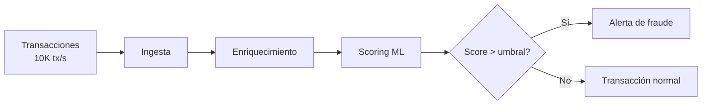
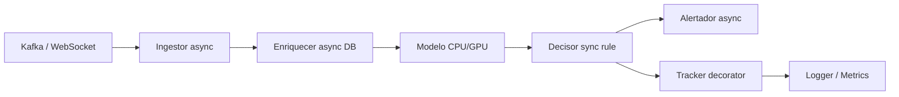
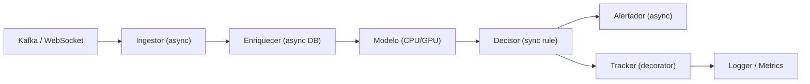

# 07 - Caso Práctico: Pipeline de Datos en Streaming

Este caso práctico integra todos los conceptos del curso: generadores, decoradores, context managers, async/await, type hints y metaclases. No desarrollaremos el código completo (eso es tu ejercicio), pero documentamos el diseño, la arquitectura y los fragmentos clave.

---

## 🎯 Contexto del negocio

Eres ML Engineer en una fintech. Recibes transacciones bancarias en tiempo real (10,000 tx/segundo). Necesitas:



1. Ingerir el stream sin perder eventos.
2. Enriquecer cada transacción con features históricas (DB lookup).
3. Validar el schema de cada evento.
4. Ejecutar un modelo de detección de fraude.
5. Emitir alertas si el score supera un umbral.
6. Loggear métricas y estado del pipeline.

Todo debe ser tolerante a fallos, monitoreable y reproducible.

### Arquitecturas de stream processing

Existen tres paradigmas principales para procesar datos en tiempo real:

1. **Native Streaming (True Streaming):** Cada evento se procesa individualmente en cuanto llega. Latencia muy baja (< 100ms). Ejemplos: Apache Flink, Kafka Streams, Ray.
2. **Micro-batching:** Los eventos se acumulan en pequeños batches (ej. 100ms) y se procesan como batch. Latencia media. Ejemplo: Apache Spark Streaming.
3. **Batch sobre ventanas:** Se definen ventanas temporales (tumbling, sliding, session) y se procesan todos los eventos de la ventana juntos. Ejemplo: Apache Beam.

**Nuestro pipeline usa Native Streaming** porque la detección de fraude requiere latencia mínima.

### Backpressure y control de flujo

Cuando el productor de eventos (Kafka) es más rápido que el consumidor (nuestro pipeline), ocurre **backpressure**. Sin manejarlo, la memoria se satura y el sistema colapsa.

**Estrategias de backpressure:**
- **Buffer bounded:** `asyncio.Queue(maxsize=1000)` bloquea al productor cuando está lleno.
- **Shedding:** descartar eventos de baja prioridad cuando el sistema está saturado.
- **Rate limiting:** limitar la tasa de consumo de Kafka.
- **Escalado horizontal:** añadir más instancias del consumidor (particiones de Kafka).

### Exactly-once vs At-least-once vs At-most-once

| Garantía | Significado | Costo | Uso en ML |
|----------|-------------|-------|-----------|
| **At-most-once** | Cada evento se procesa 0 o 1 veces | Bajo | Métricas, logs no críticos |
| **At-least-once** | Cada evento se procesa 1 o más veces | Medio | La mayoría de pipelines ML (idempotencia necesaria) |
| **Exactly-once** | Cada evento se procesa exactamente 1 vez | Alto | Pagos, transacciones financieras |

> 💡 **En nuestro pipeline:** usamos **at-least-once** con idempotencia en el modelo de fraude (misma entrada → mismo score). El costo de exactly-once en una fintech es justificado.

---

## 🏗️ Arquitectura del sistema






---

## 📐 Diseño por componentes

### 1. Ingestor async con generadores

**Rol:** Recibir eventos del stream y producirlos como un generador async.

**Conceptos aplicados:** `async for`, `async with`, generators.

```python
from typing import AsyncIterator
import asyncio

class StreamIngestor:
    """Ingestor que consume de Kafka/WebSocket de forma lazy."""

    async def __aenter__(self):
        await self.conectar()
        return self

    async def __aexit__(self, exc_type, exc, tb):
        await self.desconectar()

    async def eventos(self) -> AsyncIterator[dict]:
        """Generador async: produce eventos bajo demanda."""
        while True:
            evento = await self.recibir()
            if evento is None:
                break
            yield evento
```

> 💡 El generador async permite que el consumidor controle la velocidad (backpressure).

---

### 2. Decorador de tracing y métricas

**Rol:** Medir latencia, contar eventos y loggear sin modificar la lógica de negocio.

**Conceptos aplicados:** Decoradores, `functools.wraps`, context managers.

```python
from functools import wraps
import time
from typing import Callable

def traced(nombre_pipeline: str):
    """Decorador que tracea cada etapa del pipeline."""
    def decorador(func: Callable) -> Callable:
        @wraps(func)
        async def wrapper(*args, **kwargs):
            inicio = time.perf_counter()
            try:
                resultado = await func(*args, **kwargs)
                estado = "OK"
                return resultado
            except Exception as e:
                estado = f"ERROR: {e}"
                raise
            finally:
                latencia = time.perf_counter() - inicio
                MetricsCollector.record(
                    pipeline=nombre_pipeline,
                    etapa=func.__name__,
                    latencia_ms=latencia * 1000,
                    estado=estado
                )
        return wrapper
    return decorador
```

---

### 3. Validación de schema con type hints

**Rol:** Garantizar que cada evento tiene los campos correctos antes de procesarlo.

**Conceptos aplicados:** `TypedDict`, `Protocol`, validación runtime.

```python
from typing import TypedDict, Optional

class TransactionEvent(TypedDict):
    tx_id: str
    monto: float
    moneda: str
    cuenta_origen: str
    cuenta_destino: str
    timestamp: str
    pais: Optional[str]

def validar_evento(raw: dict) -> TransactionEvent:
    # En producción: usar pydantic para validación automática
    campos_requeridos = TransactionEvent.__required_keys__
    for campo in campos_requeridos:
        if campo not in raw:
            raise ValueError(f"Campo faltante: {campo}")
    return raw  # type: ignore
```

---

### 4. Enriquecedor async con context manager

**Rol:** Buscar features históricas en PostgreSQL/Redis sin bloquear el pipeline.

**Conceptos aplicados:** `async with`, manejo de conexiones, `asyncio.gather`.

```python
class FeatureStoreClient:
    async def __aenter__(self):
        self.db = await asyncpg.connect(DATABASE_URL)
        return self

    async def __aexit__(self, exc_type, exc, tb):
        await self.db.close()

    @traced("feature_lookup")
    async def lookup(self, cuenta_id: str) -> dict:
        row = await self.db.fetchrow(
            "SELECT avg_monto, num_tx_24h FROM features WHERE cuenta = $1",
            cuenta_id
        )
        return dict(row) if row else {}
```

---

### 5. Ejecución de modelo con procesamiento en paralelo

**Rol:** Ejecutar inferencia del modelo. Como es CPU/GPU-bound, se delega a un thread/process pool.

**Conceptos aplicados:** `asyncio.get_event_loop().run_in_executor`, `asyncio.Semaphore`.

```python
class FraudModel:
    def __init__(self):
        self.model = cargar_modelo("fraud_v3.onnx")
        self.semaphore = asyncio.Semaphore(100)  # Máximo 100 inferencias concurrentes

    async def predict(self, features: dict) -> float:
        async with self.semaphore:
            loop = asyncio.get_event_loop()
            score = await loop.run_in_executor(
                None,  # Thread pool por defecto
                self._sync_predict,
                features
            )
            return score

    def _sync_predict(self, features: dict) -> float:
        # Inferencia bloqueante (numpy, onnxruntime)
        return self.model.infer(features)
```

---

### 6. Orquestador principal con metaclase

**Rol:** Definir pipelines declarativamente, similar a cómo PyTorch define redes.

**Conceptos aplicados:** Metaclases, registro automático, validación de etapas.

```python
class PipelineMeta(type):
    """Metaclase que registra etapas y valida conectividad."""
    def __new__(mcs, name, bases, namespace):
        etapas = []
        for attr_name, attr_value in namespace.items():
            if hasattr(attr_value, '_es_etapa'):
                etapas.append((attr_name, attr_value))

        cls = super().__new__(mcs, name, bases, namespace)
        cls._etapas = etapas
        return cls

def etapa(func):
    """Decorador que marca una función como etapa del pipeline."""
    func._es_etapa = True
    return func

class FraudPipeline(metaclass=PipelineMeta):
    @etapa
    async def ingestar(self, source):
        async with StreamIngestor(source) as ingestor:
            async for evento in ingestor.eventos():
                yield evento

    @etapa
    async def enriquecer(self, evento):
        async with FeatureStoreClient() as fs:
            features = await fs.lookup(evento["cuenta_origen"])
            evento["features"] = features
            return evento

    @etapa
    async def decidir(self, evento):
        score = await FraudModel().predict(evento["features"])
        evento["fraud_score"] = score
        return evento

    async def ejecutar(self, source):
        async for evento in self.ingestar(source):
            evento = await self.enriquecer(evento)
            evento = await self.decidir(evento)
            if evento["fraud_score"] > 0.8:
                await Alertador.emitir(evento)
```

---

## 📊 Métricas y monitoreo

| Métrica | Instrumento | Objetivo |
|---------|-------------|----------|
| Throughput | Contador en decorador `traced` | > 5000 tx/seg |
| Latencia p95 | Histograma en `traced` | < 50ms por etapa |
| Error rate | Contador de excepciones | < 0.1% |
| Backpressure | Tamaño de `asyncio.Queue` | Nunca > 1000 |
| GPU utilization | `nvidia-smi` polling | > 70% |

---

## 🧪 Plan de pruebas

1. **Unit tests:** cada etapa por separado con mocks.
2. **Integration tests:** pipeline completo con Kafka en Docker.
3. **Load tests:** `locust` o `k6` simulando 10k tx/seg.
4. **Chaos tests:** matar contenedores de DB/Redis y verificar recovery.

---

## 🚀 Despliegue sugerido

```yaml
# docker-compose.yml simplificado
version: '3.8'
services:
  pipeline:
    build: .
    environment:
      - KAFKA_BROKER=kafka:9092
      - DB_URL=postgresql://...
    depends_on:
      - kafka
      - postgres
      - redis
  
  kafka:
    image: confluentinc/cp-kafka:latest
    
  postgres:
    image: postgres:15
    
  redis:
    image: redis:alpine
```

---

## 📚 Referencias para la implementación

- Faust (stream processing en Python con Kafka)
- Bytewax (stream processing similar a Flink)
- Ray Serve (serving de modelos con async)
- FastAPI + `BackgroundTasks`
- Prometheus + Grafana para métricas
