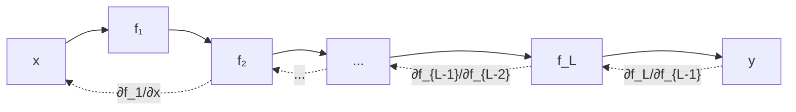

# 02 - Cálculo y Gradientes

El cálculo diferencial es el motor del entrenamiento de redes neuronales. El **gradient descent** no es más que usar derivadas para encontrar el mínimo de una función. Entender esto te permite depurar por qué tu modelo no converge.

---

## 1. Límites y continuidad

### Concepto de límite

El límite describe el valor al que se acerca una función cuando su entrada se acerca a un punto:

$$\lim_{x \to a} f(x) = L$$

Una función es **continua** en `a` si:
1. `f(a)` existe.
2. El límite existe.
3. `lim f(x) = f(a)`.

> 💡 **En ML:** Las funciones de activación como ReLU son continuas pero no derivables en todos los puntos (en `x=0`, ReLU tiene una esquina). Esto afecta la backpropagation.

---

## 2. Derivadas

### Definición

La derivada mide la **tasa de cambio instantánea** de una función en un punto. Geométricamente, es la pendiente de la recta tangente.

$$f'(x) = \lim_{h \to 0} \frac{f(x+h) - f(x)}{h}$$

### Reglas de derivación

| Regla | Fórmula | Ejemplo |
|-------|---------|---------|
| Constante | $\frac{d}{dx}c = 0$ | $f(x)=5 \to f'(x)=0$ |
| Potencia | $\frac{d}{dx}x^n = n x^{n-1}$ | $f(x)=x^3 \to f'(x)=3x^2$ |
| Suma | $(f+g)' = f' + g'$ | $(x^2 + 3x)' = 2x + 3$ |
| Producto | $(fg)' = f'g + fg'$ | $(x^2 \cdot e^x)' = 2xe^x + x^2e^x$ |
| Cociente | $(\frac{f}{g})' = \frac{f'g - fg'}{g^2}$ | $\frac{d}{dx}\frac{x}{e^x} = \frac{e^x - xe^x}{e^{2x}}$ |
| Cadena | $(f(g(x)))' = f'(g(x)) \cdot g'(x)$ | $(e^{x^2})' = e^{x^2} \cdot 2x$ |

```python
import sympy as sp

x = sp.Symbol('x')
f = x**3 + 2*x**2 - 5*x + 1
f_prime = sp.diff(f, x)
print(f"f'(x) = {f_prime}")  # 3*x**2 + 4*x - 5
```

---

## 3. Derivadas parciales

Cuando una función depende de múltiples variables, calculamos la derivada respecto a cada una manteniendo las demás constantes.

$$\frac{\partial f}{\partial x_i}(x_1, ..., x_n) = \lim_{h \to 0} \frac{f(x_1, ..., x_i+h, ..., x_n) - f(x_1, ..., x_n)}{h}$$

```python
x, y = sp.symbols('x y')
f = x**2 * y + sp.sin(y)

df_dx = sp.diff(f, x)  # 2*x*y
df_dy = sp.diff(f, y)  # x**2 + cos(y)

print(f"∂f/∂x = {df_dx}")
print(f"∂f/∂y = {df_dy}")
```

> 💡 **Caso real:** En una red neuronal con pesos `w₁, w₂, ..., wₙ`, la derivada parcial `∂L/∂wᵢ` dice cuánto cambia la pérdida `L` si modificamos solo `wᵢ`.

---

## 4. Gradiente

El **gradiente** es el vector de todas las derivadas parciales:

$$\nabla f = \left[ \frac{\partial f}{\partial x_1}, \frac{\partial f}{\partial x_2}, ..., \frac{\partial f}{\partial x_n} \right]$$

**Propiedades fundamentales:**
- El gradiente apunta en la **dirección de máximo crecimiento** de la función.
- La magnitud del gradiente indica qué tan empinada es la función.
- En un mínimo local, el gradiente es cero (`∇f = 0`).

```python
def gradiente_numerico(f, x, h=1e-5):
    """Aproximación numérica del gradiente."""
    grad = np.zeros_like(x)
    for i in range(len(x)):
        x_plus = x.copy()
        x_minus = x.copy()
        x_plus[i] += h
        x_minus[i] -= h
        grad[i] = (f(x_plus) - f(x_minus)) / (2 * h)
    return grad

# Ejemplo: f(x, y) = x^2 + y^2
f = lambda v: v[0]**2 + v[1]**2
punto = np.array([3.0, 4.0])
print(f"Gradiente en (3, 4): {gradiente_numerico(f, punto)}")
# [6. 8.] → apunta hacia afuera desde el origen
```

---

## 5. Regla de la cadena (Chain Rule)

La regla de la cadena es el fundamento de la **backpropagation**. Si `y = f(g(x))`, entonces:

$$\frac{dy}{dx} = \frac{dy}{dg} \cdot \frac{dg}{dx}$$

En redes neuronales profundas, encadenamos muchas funciones:

$$y = f_L(f_{L-1}(...f_1(x)...))$$

$$\frac{\partial y}{\partial x} = \frac{\partial f_L}{\partial f_{L-1}} \cdot \frac{\partial f_{L-1}}{\partial f_{L-2}} \cdot ... \cdot \frac{\partial f_1}{\partial x}$$



```python
# Ejemplo ilustrativo: red de 3 capas
def capa1(x, w1):
    return x * w1

def capa2(z1, w2):
    return z1 * w2

def capa3(z2, w3):
    return z2 * w3

# Forward
x, w1, w2, w3 = 2.0, 3.0, 4.0, 5.0
z1 = capa1(x, w1)
z2 = capa2(z1, w2)
y = capa3(z2, w3)

# Backpropagation manual
# dy/dw3 = z2
# dy/dw2 = dy/dz2 * dz2/dw2 = w3 * z1
# dy/dw1 = dy/dz2 * dz2/dz1 * dz1/dw1 = w3 * w2 * x

dy_dw3 = z2
dy_dw2 = w3 * z1
dy_dw1 = w3 * w2 * x

print(f"dy/dw3 = {dy_dw3}")  # 120.0
print(f"dy/dw2 = {dy_dw2}")  # 30.0
print(f"dy/dw1 = {dy_dw1}")  # 40.0
```

> 💡 **Caso real:** PyTorch y TensorFlow hacen esto automáticamente con autograd, pero entender la regla de la cadena te ayuda a depurar gradientes que explotan o desaparecen.

---

## 6. Derivadas de funciones de activación

| Función | Fórmula | Derivada | Problema |
|---------|---------|----------|----------|
| Sigmoid | $\sigma(x) = \frac{1}{1+e^{-x}}$ | $\sigma(x)(1-\sigma(x))$ | Vanishing gradient |
| Tanh | $\tanh(x)$ | $1 - \tanh^2(x)$ | Vanishing gradient |
| ReLU | $\max(0, x)$ | $1$ si $x>0$, $0$ si $x<0$ | Dying ReLU |
| Leaky ReLU | $\max(\alpha x, x)$ | $1$ si $x>0$, $\alpha$ si $x<0$ | Mitiga dying ReLU |
| Softmax | $\frac{e^{x_i}}{\sum e^{x_j}}$ | Compleja (matriz Jacobiana) | Usada en output layer |


### El problema del vanishing gradient

Cuando usas sigmoid o tanh en redes profundas, las derivadas son siempre < 1. Al multiplicar muchas derivadas pequeñas en la cadena, el gradiente se **desvanece** (tiende a cero). Las capas iniciales no se actualizan.

**Soluciones:**
- Usar ReLU (derivada = 1 para valores positivos).
- Batch normalization.
- Skip connections (ResNet).
- Inicialización adecuada de pesos (He, Glorot).

---

## 7. Jacobiana y Hessiana

### Jacobiana

La matriz Jacobiana contiene todas las derivadas parciales de un vector de salida respecto a un vector de entrada:

$$J_{ij} = \frac{\partial f_i}{\partial x_j}$$

```python
def jacobiana_numerica(f, x, h=1e-5):
    """Matriz Jacobiana numérica."""
    n = len(x)
    m = len(f(x))
    J = np.zeros((m, n))
    for j in range(n):
        x_plus = x.copy()
        x_minus = x.copy()
        x_plus[j] += h
        x_minus[j] -= h
        J[:, j] = (f(x_plus) - f(x_minus)) / (2 * h)
    return J
```

### Hessiana

La matriz Hessiana contiene las segundas derivadas parciales:

$$H_{ij} = \frac{\partial^2 f}{\partial x_i \partial x_j}$$

La Hessiana describe la **curvatura** de la función. Es usada en métodos de optimización de segundo orden (Newton, L-BFGS).

---

## 📦 Código de compresión: Gradiente Descendente desde cero


```python
"""
Gradient Descent implementado desde cero para regresión lineal.
Demuestra derivadas, actualización de pesos y convergencia.
"""
import numpy as np
import matplotlib.pyplot as plt

# Datos sintéticos: y = 2x + 1 + ruido
np.random.seed(42)
X = np.linspace(0, 10, 100)
y = 2 * X + 1 + np.random.normal(0, 1, 100)

# Inicializar parámetros
w = 0.0  # pendiente
b = 0.0  # intercepto

lr = 0.01      # Learning rate
epochs = 1000  # Iteraciones
n = len(X)

# Entrenamiento
losses = []
for epoch in range(epochs):
    # Forward: predicción
    y_pred = w * X + b

    # Calcular pérdida (MSE)
    loss = np.mean((y_pred - y)**2)
    losses.append(loss)

    # Backward: gradientes
    # dL/dw = (2/n) * sum((y_pred - y) * X)
    # dL/db = (2/n) * sum(y_pred - y)
    dw = (2/n) * np.sum((y_pred - y) * X)
    db = (2/n) * np.sum(y_pred - y)

    # Actualizar parámetros
    w -= lr * dw
    b -= lr * db

print(f"w = {w:.4f} (esperado: 2.0)")
print(f"b = {b:.4f} (esperado: 1.0)")
print(f"Pérdida final: {losses[-1]:.4f}")

# Visualización
plt.figure(figsize=(12, 4))
plt.subplot(1, 2, 1)
plt.scatter(X, y, alpha=0.5, label='Datos')
plt.plot(X, w*X + b, 'r-', label=f'y = {w:.2f}x + {b:.2f}')
plt.legend()

plt.subplot(1, 2, 2)
plt.plot(losses)
plt.xlabel('Epoch')
plt.ylabel('MSE Loss')
plt.title('Convergencia')
plt.tight_layout()
plt.show()
```


