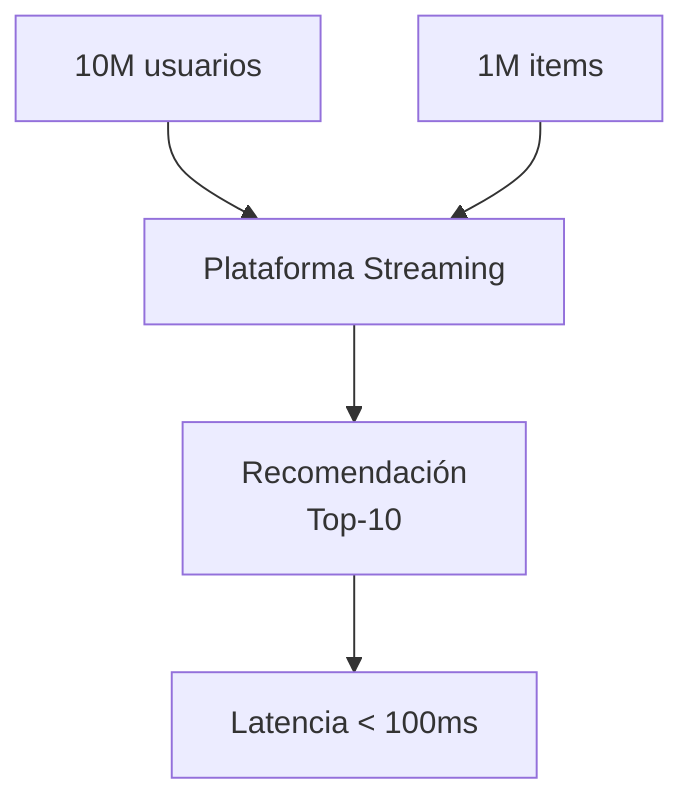
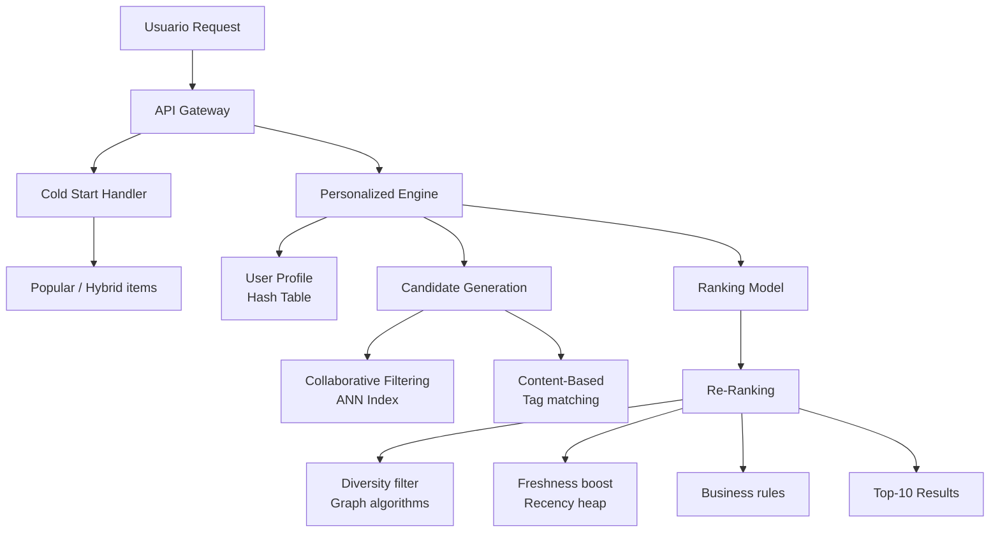

# 07 - Caso Práctico: Sistema de Recomendación en Tiempo Real

Este caso práctico integra todas las estructuras de datos y algoritmos del curso para construir un sistema de recomendación que sirva sugerencias personalizadas a millones de usuarios con latencia < 100ms.

---

## 🎯 Contexto del negocio

Eres ML Engineer en una plataforma de streaming (tipo Netflix/Spotify). Tienes:



- 10 millones de usuarios activos.
- 1 millón de items (películas/canciones) con metadata.
- Ratings implícitos (vistas, tiempo de reproducción, skips).
- El sistema debe recomendar top-10 items en < 100ms por request.

---

## 🏗️ Arquitectura del sistema


- Usuario Request
  - API GW
    - Cold Start Handler → Popular / Hybrid items
    - Personalized Engine
      - User Profile (Hash Table)
        - Recent interactions, preferences
      - Candidate Generation
        - Collaborative Filtering (ANN Index)
        - Content-Based (Tag matching)
      - Ranking Model
        - Score candidates with ML model
      - Re-Ranking
        - Diversity filter (Graph algorithms)
        - Freshness boost (Recency heap)
        - Business rules
    - Top-10 Results

---

## 📐 Diseño por componentes

### 1. User Profile Store (Hash Table)

Almacena perfiles de usuario con acceso `O(1)`.

```python
class UserProfileStore:
    """Hash table con TTL para perfiles de usuario."""
    def __init__(self):
        self.profiles = {}  # user_id → UserProfile

    def get(self, user_id):
        return self.profiles.get(user_id)

    def update_interaction(self, user_id, item_id, interaction_type):
        """Actualiza perfil con nueva interacción."""
        profile = self.profiles.setdefault(user_id, {
            'recent_items': [],
            'category_prefs': {},
            'embedding': None
        })
        profile['recent_items'].append(item_id)
        # Actualizar preferencias por categoría...
```

### 2. ANN Index para Collaborative Filtering

Usa un Ball Tree o HNSW para encontrar usuarios/items similares en `O(log n)`.

```python
from sklearn.neighbors import BallTree

class CollaborativeFilter:
    def __init__(self, user_embeddings):
        self.tree = BallTree(user_embeddings, metric='euclidean')

    def similar_users(self, user_embedding, k=50):
        distances, indices = self.tree.query(
            [user_embedding], k=k
        )
        return indices[0]
```

### 3. Candidate Generation con Heap

Genera cientos de candidatos de múltiples fuentes y usa un heap para mantener los mejores.

```python
import heapq

def generate_candidates(user_id, sources, top_n=200):
    """
    sources: lista de generadores (collab_filter, content_based, popular)
    """
    min_heap = []  # Mantiene top-N con heap de tamaño fijo

    for source in sources:
        for item_id, score in source.get_candidates(user_id):
            heapq.heappush(min_heap, (score, item_id))
            if len(min_heap) > top_n:
                heapq.heappop(min_heap)

    # Retornar ordenados de mayor a menor
    return sorted(min_heap, reverse=True)
```

### 4. Ranking Model

Un modelo ligero (ej. logistic regression o small neural net) que re-rankea candidatos.

```python
class LightRanker:
    def __init__(self, model_path):
        self.model = load_model(model_path)  # ONNX para velocidad

    def rank(self, user_id, candidates):
        features = []
        for item_id, _ in candidates:
            f = extract_features(user_id, item_id)
            features.append(f)

        scores = self.model.predict(np.array(features))
        return sorted(zip(candidates, scores),
                     key=lambda x: x[1], reverse=True)
```

### 5. Re-Ranking con Grafos (Diversity)

Para evitar recomendar 10 películas idénticas, modela la similitud entre items como un grafo y aplica diversificación.

```python
def diversify_recommendations(items, similarity_graph, k=10):
    """
    Greedy selection: en cada paso, elige el item con mayor score
    que sea lo suficientemente diferente de los ya seleccionados.
    """
    selected = []
    candidates = set(items)

    while len(selected) < k and candidates:
        best_item = None
        best_score = -float('inf')

        for item in candidates:
            score = item.score
            # Penalizar similitud con items ya seleccionados
            for sel in selected:
                sim = similarity_graph.get_similarity(item.id, sel.id)
                score -= 0.3 * sim  # Penalización por similitud

            if score > best_score:
                best_score = score
                best_item = item

        selected.append(best_item)
        candidates.remove(best_item)

    return selected
```

---

## 📊 Métricas del sistema

| Métrica | Objetivo | Cómo medir |
|---------|----------|------------|
| Latencia p99 | < 100ms | Logging de tiempo por request |
| Throughput | > 10k req/s | Load testing con k6/locust |
| Recall@10 | > 15% | Offline evaluation vs ground truth |
| CTR (Click-Through Rate) | > 5% | A/B testing en producción |
| Coverage | > 30% catálogo | % de items recomendados al menos una vez |
| Diversity | > 0.7 | Índice de Gini en categorías recomendadas |

---

## 🧪 Plan de pruebas

1. **Unit tests:** cada componente por separado (ANN, ranker, diversity).
2. **Integration tests:** flujo completo con datos sintéticos.
3. **Load tests:** 10k requests/segundo, medir latencia p50/p95/p99.
4. **A/B tests:** comparar vs sistema baseline en tráfico real.

---

## 🚀 Despliegue sugerido

```yaml
# docker-compose para desarrollo
version: '3.8'
services:
  api:
    build: ./api
    ports:
      - "8080:8080"
    depends_on:
      - redis
      - ann_index

  ann_index:
    build: ./ann
    volumes:
      - ./models:/models

  redis:
    image: redis:alpine
    # Cache de perfiles de usuario y resultados populares
```

---

## 📚 Referencias

- Two-Tower models (Google) para candidate generation
- Learning to Rank (LTR): LambdaMART, LambdaLoss
- FAISS para ANN a escala
- Redis para caching en tiempo real
- Netflix recommendation system architecture papers
