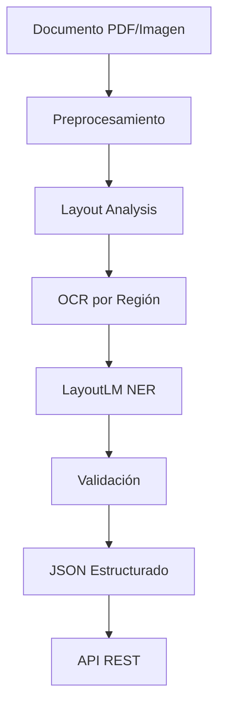
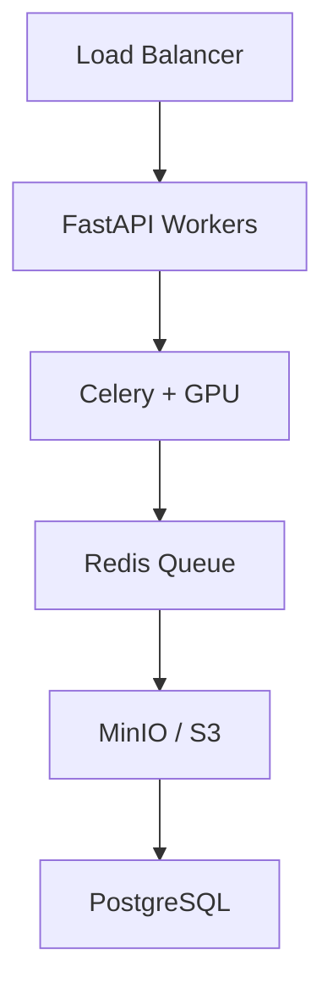

# 📂 Caso Practico: Sistema de Document Intelligence

Este proyecto integra todos los temas del curso —detección de objetos, segmentación semántica, transformers y OCR— en un sistema completo de **Document Intelligence**. El objetivo es transformar documentos no estructurados (facturas, contratos, recibos, formularios escaneados) en datos estructurados, accionables y verificables, reduciendo la intervención manual en procesos de back-office.

---

## 1. Visión general del problema

Las organizaciones procesan millones de documentos físicos y digitales diariamente. El costo de la entrada manual de datos representa hasta un 2-3 % del ingreso en sectores como logística, salud y finanzas. Un sistema de Document Intelligence automatiza:

- **Ingesta y preprocesamiento** de documentos de cualquier formato.
- **Comprensión del layout**: qué regiones contienen texto, tablas, sellos, firmas.
- **Extracción de texto**: OCR robusto en múltiples idiomas y calidades.
- **Extracción de entidades**: pares key-value, líneas de ítem, totales.
- **Validación y exportación**: verificación de reglas de negocio y entrega a sistemas ERP/CRM.

Caso real: **SAP Document Information Extraction** y **UiPath Document Understanding** son plataformas enterprise que implementan pipelines similares, reduciendo el procesamiento manual de facturas en un 80 %.


---

## 2. Arquitectura del sistema

### 2.1 Pipeline de inferencia



### 2.2 Decisiones arquitectónicas clave

| Componente | Opción recomendada | Justificación |
|------------|-------------------|---------------|
| Detección de layout | LayoutLMv3 + Detectron2 | Unifica visión y lenguaje; soporta regiones complejas. |
| OCR impreso | TrOCR / PaddleOCR | Alto accuracy sin dependencia de motores tradicionales. |
| OCR manuscrito | TrOCR fine-tuned | Los transformers generalizan mejor en escritura irregular. |
| Extracción estructurada | LayoutLMv3 NER + reglas | NER para campos libres; regex para campos rígidos (fechas, montos). |
| Escalabilidad | Celery + Redis + GPU cluster | La inferencia de transformers es costosa; se paraleliza por página. |

---

## 3. Requisitos funcionales

1. **RF-01 Ingesta multimodal**: El sistema debe aceptar imágenes (PNG, JPG, TIFF) y PDFs, incluyendo PDFs multipágina.
2. **RF-02 Preprocesamiento adaptativo**: Debe detectar y corregir orientación, skew, ruido y contraste bajo automáticamente.
3. **RF-03 Análisis de layout**: Debe identificar regiones semánticas (encabezado, cuerpo, tabla, pie, firma, sello) con bounding boxes.
4. **RF-04 OCR multilingüe**: Debe extraer texto en español, inglés y portugués con soporte para caracteres especiales (ñ, acentos, €, $).
5. **RF-05 Clasificación de documento**: Debe clasificar el documento en categorías: factura, recibo, contrato, formulario, carta.
6. **RF-06 Extracción de entidades**: Debe extraer campos clave (emisor, receptor, fecha, número de documento, líneas de ítem, subtotal, impuestos, total).
7. **RF-07 Extracción de tablas**: Debe reconstruir tablas en formato HTML/JSON preservando filas, columnas y celdas combinadas.
8. **RF-08 Validación de negocio**: Debe validar que totales coinciden con suma de ítems, que fechas son válidas, y que RUC/CUIT/CNPJ cumplen checksum.
9. **RF-09 Corrección humana asistida**: Debe permitir que operadores revisen y corrijan extracciones con una UI que muestra el documento original superpuesto con los campos detectados.
10. **RF-10 Exportación e integración**: Debe exponer API REST con autenticación JWT y soportar webhooks para notificación síncrona/asíncrona.

---

## 4. Componentes principales

### 4.1 Preprocesamiento

El preprocesamiento determina la calidad del OCR. Documentos escaneados en ángulo o con bajo contraste reducen el CER (Character Error Rate) drásticamente.

Técnicas clave:
- **Deskewing**: transformada de Hough para detectar ángulo de texto.
- **Binarización adaptativa**: método de Sauvola para manejar iluminación no uniforme.
- **Denoising**: filtros bilaterales o modelos de ruido entrenados (Noise2Noise).

### 4.2 Layout Analysis

Utilizamos un modelo de detección de objetos fine-tuned para detectar regiones de documento. Las clases incluyen:
- `header`, `paragraph`, `table`, `figure`, `footer`, `stamp`, `signature`, `line_item`

El output es un conjunto de ROIs que se pasan al OCR de forma independiente o agrupada.

### 4.3 OCR y Comprensión Documental

Para cada región de texto, aplicamos OCR. Luego, el texto + las coordenadas de layout se alimentan a LayoutLMv3 para:
- **Token classification**: etiquetar cada palabra como parte de un campo (B-EMISOR, I-EMISOR, B-TOTAL, etc.).
- **Relation extraction**: predecir relaciones entre tokens (por ejemplo, "Total" → "$1,250.00").

### 4.4 Postprocesamiento y validación

- **Normalización de montos**: eliminar símbolos de moneda, convertir a formato numérico.
- **Validación de checksum**: RUC ecuatoriano, CUIT argentino, CNPJ brasileño.
- **Consistencia matemática**: verificar que `subtotal + impuestos = total`.

⚠️ **Advertencia**: nunca confíes ciegamente en la extracción de modelos. Un error de OCR en el campo "total" puede generar discrepancias contables. Siempre implementa validaciones de dominio.

---

## 5. Modelos necesarios

| Modelo | Propósito | Dataset de entrenamiento |
|--------|-----------|--------------------------|
| LayoutLMv3-base | Embeddings multimodales (texto + layout + imagen) | IIT-CDIP, DocBank, PubLayNet |
| LayoutLMv3 fine-tuned | NER de entidades en facturas | Dataset propio anotado (500+ facturas) |
| TrOCR | OCR de texto impreso y manuscrito | Synthesized + datos reales de dominio |
| Detectron2 / YOLOv8 | Detección de regiones de layout | PubLayNet, dataset propio |
| Clasificador de documentos | Clasificación de tipo de documento | RVL-CDIP + datos propios |

💡 **Tip**: si no tienes datos anotados, usa **synthetic data generation**. Herramientas como SynthTIGER o generación con HTML+selenium producen millones de facturas sintéticas con anotaciones perfectas.

---

## 6. Métricas de extracción

### 6.1 Field-level F1

Para cada campo (ej: "total", "fecha"), calculamos:

$$
\text{Precision}_f = \frac{\text{extracciones correctas}_f}{\text{total extracciones}_f}, \quad
\text{Recall}_f = \frac{\text{extracciones correctas}_f}{\text{total ground truth}_f}
$$

$$
F1_f = 2 \cdot \frac{\text{Precision}_f \cdot \text{Recall}_f}{\text{Precision}_f + \text{Recall}_f}
$$

Una extracción se considera correcta si coincide exactamente con el texto (o con tolerancia de edición para OCR imperfecto).

### 6.2 Tree-Edit Distance (TED)

Para tablas y estructuras jerárquicas, comparamos el árbol predicho vs el árbol real usando la distancia de edición entre árboles.

### 6.3 Métricas de negocio

- **Straight-Through Processing (STP)**: porcentaje de documentos procesados sin intervención humana.
- **Tiempo medio de procesamiento (TTP)**: desde ingesta hasta JSON estructurado.
- **Costo por documento**: infraestructura + revisión manual.

---

## 7. Despliegue

### 7.1 Infraestructura recomendada



### 7.2 Optimizaciones

- **Batching**: agrupar páginas de múltiples documentos para inferencia en GPU.
- **ONNX Runtime / TensorRT**: convertir modelos de PyTorch a formatos optimizados.
- **Caching**: documentos duplicados (hash MD5) se responden sin re-procesar.
- **Escalado horizontal**: workers de Celery se escalan con Kubernetes según longitud de cola.

---

## 📦 Código de compresión

```python
"""
Sistema de Document Intelligence completo.
Resume layout detection, OCR con TrOCR, NER con LayoutLMv3 y exportación JSON.
"""

import json
import torch
from transformers import (
    LayoutLMv3Processor, LayoutLMv3ForTokenClassification,
    TrOCRProcessor, VisionEncoderDecoderModel
)
from PIL import Image
from typing import List, Dict

class DocumentIntelligenceSystem:
    def __init__(self):
        self.trocr_processor = TrOCRProcessor.from_pretrained("microsoft/trocr-base-printed")
        self.trocr_model = VisionEncoderDecoderModel.from_pretrained("microsoft/trocr-base-printed")
        self.layout_processor = LayoutLMv3Processor.from_pretrained("microsoft/layoutlmv3-base", apply_ocr=False)
        self.layout_model = LayoutLMv3ForTokenClassification.from_pretrained("microsoft/layoutlmv3-base")
        self.layout_model.eval()
        self.id2label = {i: label for i, label in enumerate([
            "O", "B-HEADER", "I-HEADER", "B-PARAGRAPH", "I-PARAGRAPH",
            "B-TABLE", "I-TABLE", "B-ITEM", "I-ITEM", "B-TOTAL", "I-TOTAL"
        ])}

    def preprocess(self, image_path: str) -> Image.Image:
        image = Image.open(image_path).convert("RGB")
        # Aquí iría deskewing, denoising, etc.
        return image

    def ocr(self, image: Image.Image) -> (List[str], List[List[int]]):
        """Mock OCR: en producción usar TrOCR por región o PaddleOCR para obtener words+boxes."""
        # Ejemplo simplificado:
        pixel_values = self.trocr_processor(image, return_tensors="pt").pixel_values
        generated_ids = self.trocr_model.generate(pixel_values)
        text = self.trocr_processor.batch_decode(generated_ids, skip_special_tokens=True)[0]
        words = text.split()
        boxes = [[100, 100, 200, 120]] * len(words)  # Placeholder
        return words, boxes

    def extract_entities(self, image_path: str, words: List[str], boxes: List[List[int]]) -> List[Dict]:
        encoding = self.layout_processor(image_path, words, boxes=boxes, return_tensors="pt",
                                          truncation=True, padding="max_length", max_length=512)
        with torch.no_grad():
            outputs = self.layout_model(**encoding)
        predictions = outputs.logits.argmax(-1).squeeze().tolist()
        tokens = self.layout_processor.tokenizer.convert_ids_to_tokens(encoding.input_ids.squeeze())
        entities = []
        for token, pred_id in zip(tokens, predictions):
            if token in ("<s>", "</s>", "<pad>", "<cls>", "<sep>"):
                continue
            label = self.id2label.get(pred_id, "O")
            entities.append({"token": token, "label": label})
        return entities

    def postprocess(self, entities: List[Dict]) -> Dict:
        """Agrupa tokens BIO en campos estructurados."""
        result = {}
        current_field = None
        current_value = []
        for ent in entities:
            label = ent["label"]
            token = ent["token"].replace("##", "")
            if label.startswith("B-"):
                if current_field:
                    result[current_field] = " ".join(current_value)
                current_field = label[2:]
                current_value = [token]
            elif label.startswith("I-") and current_field == label[2:]:
                current_value.append(token)
            else:
                if current_field:
                    result[current_field] = " ".join(current_value)
                    current_field = None
                    current_value = []
        if current_field:
            result[current_field] = " ".join(current_value)
        return result

    def process(self, image_path: str) -> Dict:
        image = self.preprocess(image_path)
        words, boxes = self.ocr(image)
        entities = self.extract_entities(image_path, words, boxes)
        structured = self.postprocess(entities)
        return {
            "document": image_path,
            "raw_entities": entities[:20],  # truncado para debug
            "structured": structured
        }

if __name__ == "__main__":
    system = DocumentIntelligenceSystem()
    # output = system.process("factura.png")
    # print(json.dumps(output, indent=2, ensure_ascii=False))
    print("Sistema de Document Intelligence listo para inferencia.")
```


