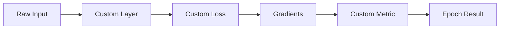
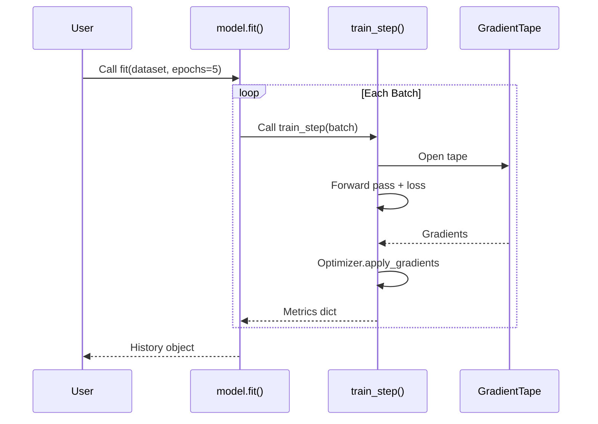
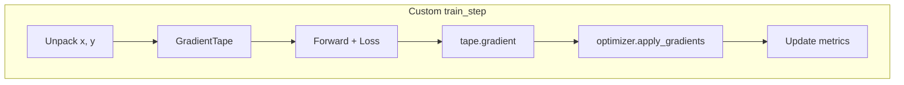
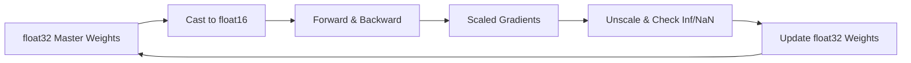

# 🏗️ tf.keras Architectures

## 🎯 Learning Objectives

- Build models using Sequential, Functional, and Model Subclassing APIs
- Implement custom Layers, Losses, and Metrics for domain-specific problems
- Override `train_step`/`test_step` to implement custom training logic (GANs, meta-learning)
- Master `Model.compile()` semantics and the training lifecycle
- Apply mixed precision training and proper weight initialization strategies
- Understand when to choose each API based on project complexity

## Introduction

Keras was originally an independent high-level deep learning API. In 2019, TensorFlow 2.0 adopted Keras as its official interface, merging user-friendly design with production infrastructure. This note covers model construction APIs, custom components, and training loop control.

Understanding these patterns is essential before input pipelines ([[02 - tf.data and TFRecord Pipelines]]) and distributed training ([[03 - Training at Scale]]). If you are coming from PyTorch, the Functional API resembles manual graph construction, while Model Subclassing is similar to `nn.Module` but with TensorFlow's object lifecycle conventions.

---

## Module 1: The Three APIs for Model Building

### 1.1 Theoretical Foundation 🧠

tf.keras offers three APIs trading simplicity for expressiveness:

1. **Sequential API**: A linear stack of layers with one input and one output. Best for feedforward baselines.
2. **Functional API**: Layers are functions mapping tensors to tensors, enabling DAGs with shared layers and multiple inputs/outputs. Recommended for most use cases.
3. **Model Subclassing**: Imperative `call()` method for loops and dynamic control flow, but complicates serialization and visualization.

The design motivation is **progressive disclosure of complexity**: beginners start with Sequential, practitioners standardize on Functional, and researchers drop down to Subclassing when needed.

### 1.2 Mental Model 📐

```
Sequential: Linear Stack
┌────────┐   ┌────────┐   ┌────────┐
│ Input  │──▶│ Dense  │──▶│ Output │
└────────┘   └────────┘   └────────┘

Functional: DAG
         ┌─────────┐
   ┌────▶│ Dense A │────┐
   │     └─────────┘    │    ┌────────┐
┌──┴──┐                └───▶│ Concat │──▶ Output
│Input│                     └────────┘
└──┬──┘                ┌───▶
   │    ┌─────────┐    │
   └───▶│ Dense B │────┘
        └─────────┘

Subclassing: Imperative Control
┌─────────────────────────────┐
│ class MyModel(Model):       │
│   def call(self, x):        │
│     for b in self.blocks:   │
│       x = b(x)              │
│     return x                │
└─────────────────────────────┘
```

### 1.3 Syntax and Semantics 📝

```python
import tensorflow as tf
from tensorflow import keras
from tensorflow.keras import layers

# ── Sequential API ──
# WHY: Fastest way to build a stack. Keras infers input shape on first use.
seq_model = keras.Sequential([
    layers.Dense(64, activation="relu", input_shape=(784,)),  # flatten 28x28
    layers.Dropout(0.3),                                      # regularization
    layers.Dense(10, activation="softmax")                    # multi-class logits
], name="sequential_classifier")

# ── Functional API ──
# WHY: You define the graph explicitly by calling layers on tensors.
# This enables multi-input, multi-output, and shared-layer architectures.
inputs = keras.Input(shape=(784,), name="digits")
x = layers.Dense(64, activation="relu", name="hidden_1")(inputs)
x = layers.Dropout(0.3, name="dropout")(x)
outputs = layers.Dense(10, activation="softmax", name="predictions")(x)
func_model = keras.Model(inputs=inputs, outputs=outputs, name="functional_classifier")

# ── Model Subclassing ──
# WHY: Use when the forward pass has dynamic control flow (loops, conditionals)
# or when you need to inject non-layer logic into the graph.
class SubclassedModel(keras.Model):
    def __init__(self, hidden_units=64, num_classes=10, **kwargs):
        super().__init__(**kwargs)
        # Layers are created once during __init__ so weights are tracked.
        self.dense_1 = layers.Dense(hidden_units, activation="relu")
        self.dropout = layers.Dropout(0.3)
        self.dense_2 = layers.Dense(num_classes, activation="softmax")

    def call(self, inputs, training=False):
        # training flag lets Dropout/BatchNorm behave differently at eval time.
        x = self.dense_1(inputs)
        x = self.dropout(x, training=training)
        return self.dense_2(x)

sub_model = SubclassedModel(name="subclassed_classifier")
```

### 1.4 Visual Representation 🖼️

```mermaid
graph TD
    A[Input Tensor<br/>shape=(None,784)] --> B[Dense 64 + ReLU]
    B --> C[Dropout 0.3]
    C --> D[Dense 10 + Softmax]
    D --> E[Output Tensor<br/>shape=(None,10)]

    style A fill:#e1f5fe
    style E fill:#e8f5e9
```


### 1.5 Application in ML/AI Systems 🤖

| ML Use Case | This Concept | Impact |
|-------------|-------------|--------|
| Tabular classification | Sequential API with Dense layers | Rapid baseline without over-engineering |
| Multi-modal recommender | Functional API with two input towers | Shared embeddings + separate dense towers in one model |
| Neural architecture search | Model Subclassing + dynamic loops | Enables conditional depth and width at runtime |

Real case: **Spotify** uses the Functional API for multi-task recommender models that predict both click-through rate and expected listening time from separate input branches.

### 1.6 Common Pitfalls ⚠️

⚠️ **Subclassed models cannot be plotted with `plot_model()` or cloned with `clone_model()` until they are built.** Keras does not know the graph topology until it sees an input tensor. Call `model.build(input_shape)` or run a forward pass before serializing.

💡 **Mnemonic**: "Subclass for control, Functional for graphs, Sequential for stacks." If you need `model.summary()` to work out of the box, prefer Functional.

### 1.7 Knowledge Check ❓

1. Convert the following Sequential model into the Functional API:
   ```python
   keras.Sequential([layers.Dense(32, activation="relu"), layers.Dense(1)])
   ```
2. Why does `call(self, inputs, training=False)` include a `training` argument? What happens if you ignore it during evaluation?
3. Name one operation that is easy in Subclassing but impossible in Sequential.

---

## Module 2: Custom Layers, Losses, and Metrics

### 2.1 Theoretical Foundation 🧠

Keras exposes class-based extension points for custom components: `keras.layers.Layer`, `keras.losses.Loss`, and `keras.metrics.Metric`. The design philosophy is **state management**: layers track weights for backpropagation and checkpointing; losses are typically stateless pure functions; metrics accumulate state across batches for correct epoch-level values.

### 2.2 Mental Model 📐

```
Custom Layer Lifecycle
┌────────────┐   ┌────────────┐   ┌────────────┐
│ __init__   │──▶│ build      │──▶│ call       │
│ hparams    │   │ vars       │   │ forward    │
└────────────┘   └────────────┘   └────────────┘

Custom Metric Lifecycle
┌────────────┐   ┌────────────┐   ┌────────────┐
│ update_state│──▶│ result    │──▶│ reset_state │
│ per batch  │   │ aggregate  │   │ per epoch  │
└────────────┘   └────────────┘   └────────────┘

State Ownership
┌────────────────────────────┐
│ Layer / Metric             │
│ ├── self.add_weight(...)   │
│ └── tracked by Keras       │
└────────────────────────────┘
```

### 2.3 Syntax and Semantics 📝

```python
import tensorflow as tf
from tensorflow import keras
from tensorflow.keras import layers

class ResidualBlock(layers.Layer):
    def __init__(self, units, **kwargs):
        super().__init__(**kwargs)
        self.units = units
    def build(self, input_shape):
        self.dense = layers.Dense(self.units, activation="relu")
        self.proj = layers.Dense(input_shape[-1])
        self.built = True
    def call(self, inputs):
        return inputs + self.proj(self.dense(inputs))

class ContrastiveLoss(keras.losses.Loss):
    def __init__(self, margin=1.0, **kwargs):
        super().__init__(**kwargs)
        self.margin = margin
    def call(self, y_true, y_pred):
        positive = y_true * y_pred
        negative = (1 - y_true) * tf.maximum(0.0, self.margin - y_pred)
        return tf.reduce_mean(positive + negative)

class F1Score(keras.metrics.Metric):
    def __init__(self, num_classes, **kwargs):
        super().__init__(**kwargs)
        self.num_classes = num_classes
        self.tp = self.add_weight(name="tp", shape=(num_classes,), initializer="zeros")
        self.fp = self.add_weight(name="fp", shape=(num_classes,), initializer="zeros")
        self.fn = self.add_weight(name="fn", shape=(num_classes,), initializer="zeros")

    def update_state(self, y_true, y_pred, sample_weight=None):
        y_pred = tf.one_hot(tf.argmax(y_pred, axis=1), depth=self.num_classes)
        y_true = tf.cast(y_true, tf.float32)
        self.tp.assign_add(tf.reduce_sum(y_true * y_pred, axis=0))
        self.fp.assign_add(tf.reduce_sum((1 - y_true) * y_pred, axis=0))
        self.fn.assign_add(tf.reduce_sum(y_true * (1 - y_pred), axis=0))

    def result(self):
        precision = self.tp / (self.tp + self.fp + 1e-7)
        recall = self.tp / (self.tp + self.fn + 1e-7)
        return tf.reduce_mean(2 * precision * recall / (precision + recall + 1e-7))

    def reset_state(self):
        for v in self.variables:
            v.assign(tf.zeros_like(v))
```

### 2.4 Visual Representation 🖼️



### 2.5 Application in ML/AI Systems 🤖

| ML Use Case | This Concept | Impact |
|-------------|-------------|--------|
| Metric learning (face recognition) | Custom contrastive/triplet loss | Embeddings cluster by identity instead of class logits |
| Class-imbalanced medical imaging | Custom F1 metric per class | Tracks rare disease detection that accuracy hides |
| ResNet-style CV models | Custom residual layer | Clean encapsulation of skip connections for readability |

Real case: **Airbnb** uses custom ranking losses inside Keras to optimize search result ordering, combining booking probability with host preference constraints.

### 2.6 Common Pitfalls ⚠️

⚠️ **Forgetting `self.add_weight()` in a custom metric means the state will not be saved with `model.save_weights()` or restored during distributed training.** Always register stateful variables through Keras APIs.

💡 **Mnemonic**: "Build creates weights, call uses them, add_weight tracks them."

### 2.7 Knowledge Check ❓

1. Why is `build()` separate from `__init__()` in a custom layer? What would break if you created weights in `__init__()` without knowing the input shape?
2. Implement a custom metric that tracks the running mean of positive predictions per batch.
3. Explain why `reset_state()` is called automatically at the start of each epoch.

---

## Module 3: Training Loop Control

### 3.1 Theoretical Foundation 🧠

Keras hides the standard loop inside `model.fit()`, but GANs, meta-learning, and gradient accumulation require custom logic. Keras solves this by exposing `train_step()` and `test_step()` as overridable methods on `keras.Model`. Overriding them retains callbacks, validation, and logging while controlling the inner mechanics.

### 3.2 Mental Model 📐

```
Standard fit() Flow
┌─────────┐    ┌─────────┐    ┌─────────┐    ┌─────────┐
│  Epoch  │───▶│  Batch  │───▶│train_step│───▶│ Callbacks│
└─────────┘    └─────────┘    └─────────┘    └─────────┘

Overridden train_step Flow (GAN)
┌─────────────────────────────────────────┐
│ for batch in dataset:                   │
│   real = batch                          │
│   fake = generator(noise)               │
│   train discriminator on [real, fake]   │
│   train generator to fool discriminator │
│   log losses                            │
└─────────────────────────────────────────┘

Gradient Tape Lifecycle
┌─────────┐    ┌─────────┐    ┌─────────┐
│  Tape   │───▶│ Forward │───▶│  Loss   │
│  Open   │    │  Pass   │    │  Scalar │
└─────────┘    └─────────┘    └────┬────┘
                                   │
                              ┌────┴────┐
                              │ Gradient│
                              │  Apply  │
                              └─────────┘
```

### 3.3 Syntax and Semantics 📝

```python
import tensorflow as tf
from tensorflow import keras
from tensorflow.keras import layers

class CustomTrainingModel(keras.Model):
    def __init__(self, model, **kwargs):
        super().__init__(**kwargs)
        self.model = model
        self.optimizer = keras.optimizers.Adam(1e-3)
        self.loss_fn = keras.losses.SparseCategoricalCrossentropy()

    @tf.function
    def train_step(self, data):
        x, y = data
        with tf.GradientTape() as tape:
            y_pred = self.model(x, training=True)
            loss = self.loss_fn(y, y_pred) + sum(self.model.losses)
        gradients = tape.gradient(loss, self.model.trainable_variables)
        self.optimizer.apply_gradients(zip(gradients, self.model.trainable_variables))
        self.compiled_metrics.update_state(y, y_pred)
        return {m.name: m.result() for m in self.metrics}

    @tf.function
    def test_step(self, data):
        x, y = data
        y_pred = self.model(x, training=False)
        self.compiled_metrics.update_state(y, y_pred)
        return {m.name: m.result() for m in self.metrics}

base = keras.Sequential([layers.Dense(64, activation="relu"), layers.Dense(10)])
model = CustomTrainingModel(base)
model.compile()
```

### 3.4 Visual Representation 🖼️





### 3.5 Application in ML/AI Systems 🤖

| ML Use Case | This Concept | Impact |
|-------------|-------------|--------|
| GANs | Two optimizers in one `train_step` | Discriminator and generator trained alternately without leaving `fit()` |
| Gradient penalty (WGAN-GP) | Manual second-order gradients inside `train_step` | Enforces Lipschitz constraint for stable GAN training |
| Meta-learning (MAML) | Inner loop + outer loop inside `train_step` | Few-shot adaptation without rewriting the training harness |

Real case: **DeepMind** uses overridden training steps extensively for reinforcement learning agents in tf.keras, where the loss depends on bootstrapped returns rather than fixed labels.

### 3.6 Common Pitfalls ⚠️

⚠️ **If you override `train_step` but forget `@tf.function`, training will run in eager mode and be significantly slower on large models.** The decorator traces the Python code into a static graph once per unique input signature.

💡 **Mnemonic**: "Tape watches forward, gradient flows backward, optimizer steps forward."

### 3.7 Knowledge Check ❓

1. Why must `self.model(x, training=True)` be called inside the `GradientTape` context rather than outside it?
2. Write a `train_step` that accumulates gradients over 4 batches before applying them.
3. What happens if you call `model.fit()` on a subclassed model without calling `compile()` first?

---

## Module 4: Compilation, Mixed Precision, and Regularization

### 4.1 Theoretical Foundation 🧠

`Model.compile()` binds an optimizer, loss, and metrics. Modern GPUs and TPUs achieve higher throughput with `float16`, but its narrower dynamic range can cause gradient underflow. Mixed precision keeps a `float32` master copy while computing in `float16`, using **loss scaling** to preserve small gradients. Regularization and initialization add inductive bias and set proper starting points for optimization.

### 4.2 Mental Model 📐

```
Compile() Contract
┌─────────────┐    ┌─────────────┐    ┌─────────────┐
│  Optimizer  │    │    Loss     │    │   Metrics   │
│   (how)     │ +  │   (what)    │ +  │  (watch)    │
└─────────────┘    └─────────────┘    └─────────────┘
              │           │                  │
              └───────────┴──────────────────┘
                          ▼
                   ┌─────────────┐
                   │  Training   │
                   │    Loop     │
                   └─────────────┘

Mixed Precision Flow
┌─────────┐    ┌─────────┐    ┌─────────┐    ┌─────────┐
│ float32 │───▶│ float16 │───▶│  Loss   │───▶│ Scale   │
│ weights │    │  forward│    │  scalar │    │  grads  │
└─────────┘    └─────────┘    └─────────┘    └────┬────┘
                                                   │
                                              ┌────┴────┐
                                              │ float32 │
                                              │ update  │
                                              └─────────┘
```

```
Regularization Sandwich
┌─────────┐    ┌─────────┐    ┌─────────┐    ┌─────────┐
│ Init    │───▶│ Dense   │───▶│ Dropout │───▶│ L2 Loss │
│ Strategy│    │  Layer  │    │  Noise  │    │ Penalty │
└─────────┘    └─────────┘    └─────────┘    └─────────┘
```

### 4.3 Syntax and Semantics 📝

```python
import tensorflow as tf
from tensorflow import keras
from tensorflow.keras import layers, regularizers, initializers

tf.keras.mixed_precision.set_global_policy("mixed_float16")

inputs = keras.Input(shape=(784,))
x = layers.Dense(256, activation="relu")(inputs)
x = layers.Dropout(0.4)(x)
outputs = layers.Dense(10, activation="softmax", dtype="float32")(x)
model = keras.Model(inputs, outputs)

optimizer = keras.mixed_precision.LossScaleOptimizer(keras.optimizers.Adam(1e-3))

model.compile(
    optimizer=optimizer,
    loss="sparse_categorical_crossentropy",
    metrics=["accuracy", keras.metrics.SparseTopKCategoricalAccuracy(k=3)],
    run_eagerly=False
)

reg_layer = layers.Dense(128, kernel_regularizer=regularizers.l2(1e-4),
                         kernel_initializer=initializers.HeNormal(), activation="relu")
```

### 4.4 Visual Representation 🖼️



### 4.5 Application in ML/AI Systems 🤖

| ML Use Case | This Concept | Impact |
|-------------|-------------|--------|
| Large vision models (ResNet-152) | Mixed precision + L2 | ~2x speedup on A100 without accuracy loss |
| Recommendation systems | `kernel_regularizer=l2(1e-5)` | Prevents embedding tables from overfitting to power users |
| Production debugging | `run_eagerly=True` | Catch shape mismatches and NaNs with Python tracebacks |

Real case: **NVIDIA** trains almost all production vision and language models with automatic mixed precision (AMP) to saturate Tensor Core throughput in data centers.

### 4.6 Common Pitfalls ⚠️

⚠️ **Using `mixed_float16` without wrapping the optimizer in `LossScaleOptimizer`** will silently underflow gradients in many architectures, causing training to plateau or diverge.

💡 **Mnemonic**: "Mixed precision: fast math, slow weights. Loss scale protects the small."

### 4.7 Knowledge Check ❓

1. Why should the final softmax layer use `dtype="float32"` even when the rest of the model is `float16`?
2. Add `HeNormal()` initialization and `l2(1e-4)` regularization to a `Conv2D` layer.
3. What is the trade-off of setting `run_eagerly=True` in `compile()`?

---

## 📦 Compression Code

```python
"""
Production-ready tf.keras script summarizing Functional API,
custom layer/loss, overridden train_step, and mixed precision.
"""
import tensorflow as tf
from tensorflow import keras
from tensorflow.keras import layers, regularizers, initializers

tf.keras.mixed_precision.set_global_policy("mixed_float16")

class ResidualBlock(layers.Layer):
    def __init__(self, units, **kwargs):
        super().__init__(**kwargs)
        self.units = units
    def build(self, input_shape):
        self.dense = layers.Dense(self.units, activation="relu",
                                  kernel_initializer=initializers.HeNormal())
        self.proj = layers.Dense(input_shape[-1])
        self.built = True
    def call(self, inputs):
        return inputs + self.proj(self.dense(inputs))

class ContrastiveLoss(keras.losses.Loss):
    def __init__(self, margin=1.0, **kwargs):
        super().__init__(**kwargs)
        self.margin = margin
    def call(self, y_true, y_pred):
        pos = y_true * y_pred
        neg = (1 - y_true) * tf.maximum(0.0, self.margin - y_pred)
        return tf.reduce_mean(pos + neg)

inputs = keras.Input(shape=(784,), name="input")
x = layers.Dense(256, activation="relu", kernel_regularizer=regularizers.l2(1e-4))(inputs)
x = ResidualBlock(256, name="residual_1")(x)
x = layers.Dropout(0.3)(x)
outputs = layers.Dense(10, activation="softmax", dtype="float32", name="output")(x)
model = keras.Model(inputs, outputs, name="compressed_classifier")

class TrainingModel(keras.Model):
    def __init__(self, base_model, **kwargs):
        super().__init__(**kwargs)
        self.base_model = base_model
        self.optimizer = keras.mixed_precision.LossScaleOptimizer(keras.optimizers.Adam(1e-3))
        self.loss_fn = keras.losses.SparseCategoricalCrossentropy()
    @tf.function
    def train_step(self, data):
        x, y = data
        with tf.GradientTape() as tape:
            y_pred = self.base_model(x, training=True)
            loss = self.loss_fn(y, y_pred) + sum(self.base_model.losses)
            scaled_loss = self.optimizer.get_scaled_loss(loss)
        scaled_grads = tape.gradient(scaled_loss, self.base_model.trainable_variables)
        grads = self.optimizer.get_unscaled_gradients(scaled_grads)
        self.optimizer.apply_gradients(zip(grads, self.base_model.trainable_variables))
        self.compiled_metrics.update_state(y, y_pred)
        return {m.name: m.result() for m in self.metrics}

trainer = TrainingModel(model)
trainer.compile(metrics=["accuracy"], run_eagerly=False)
```

## 🎯 Documented Project

### Description
Build a **Multi-Task Recommender System** using the Functional API that predicts click probability and watch time.

### Functional Requirements
- Two input branches with a shared dense layer
- Two heads: `click` (sigmoid) and `watch_time` (regression)
- Custom `WeightedMultiTaskLoss` and `NDCGMetric`

### Main Components
| Component | Technology |
|-----------|------------|
| Architecture | Functional API with shared layer |
| Custom loss | `WeightedMultiTaskLoss` |
| Custom metric | `NDCGMetric` |
| Regularization | L2 + dropout |
| Training loop | Standard `fit()` or overridden `train_step` |

### Success Metrics
- Click AUC > 0.75
- Watch-time MAE < 45 seconds
- Throughput > 5000 samples/sec on single GPU with mixed precision

## 🎯 Key Takeaways

- **Sequential** is for stacks, **Functional** for DAGs, **Subclassing** for dynamic control flow.
- Custom layers create weights in `build()`; metrics use `self.add_weight()` for state.
- Override `train_step` for GANs, meta-learning, or gradient surgery without leaving `fit()`.
- Always decorate overridden steps with `@tf.function` to recover graph-mode performance.
- Use `mixed_float16` with `LossScaleOptimizer` for ~2x GPU speedup; keep outputs in `float32`.
- `Model.compile()` resolves the training contract; `run_eagerly=True` trades speed for debuggability.

## References

- Chollet, F. (2021). *Deep Learning with Python* (2nd ed.). Manning.
- TensorFlow Core documentation: https://www.tensorflow.org/guide/keras
- TensorFlow Mixed Precision guide: https://www.tensorflow.org/guide/mixed_precision
- PyTorch comparison: see [[05 - Deep Learning y Computer Vision/03 - Deep Learning con PyTorch/00 - Bienvenida]]
- Deployment context: see [[09 - MLOps y Produccion]]
