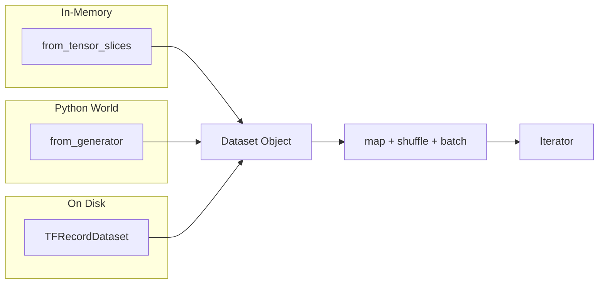
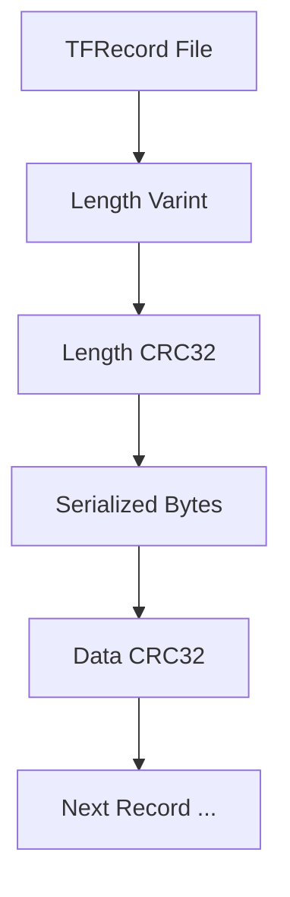
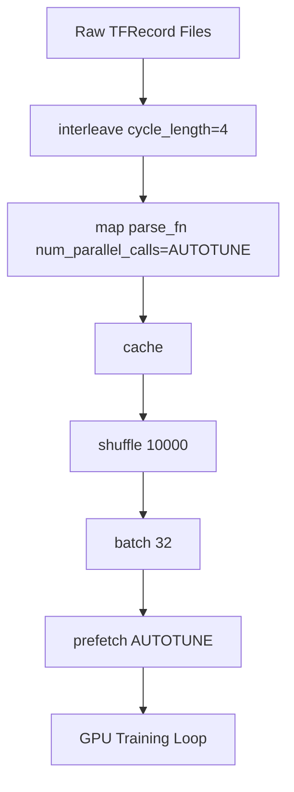
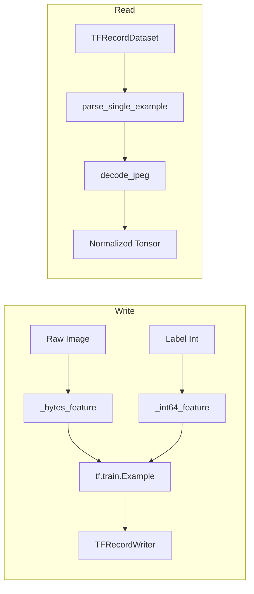
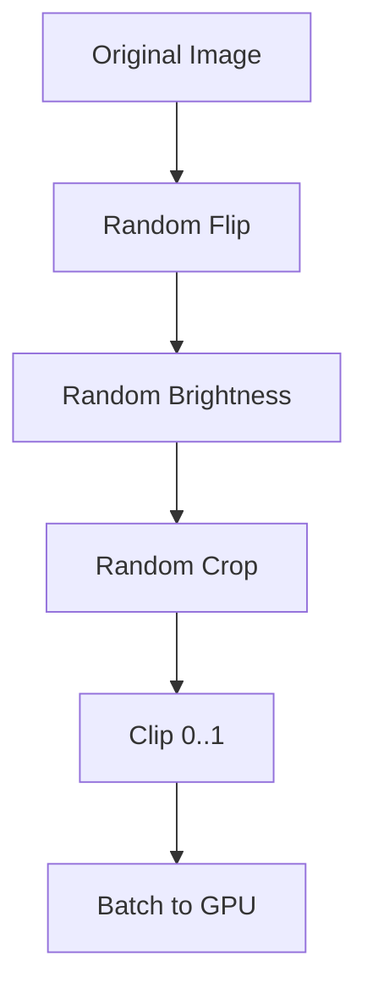
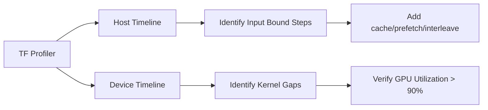

# 🔄 tf.data and TFRecord Pipelines

## 🎯 Learning Objectives

- Construct robust input pipelines using `tf.data.Dataset` from tensors, generators, and TFRecord files
- Apply performance optimizations: `cache()`, `prefetch()`, `interleave()`, and parallel `map()`
- Serialize structured data into TFRecord format using protobuf schemas
- Implement data augmentation inside the graph with `tf.image` operations
- Profile pipelines to identify and eliminate I/O bottlenecks
- Compare `tf.data` semantics with PyTorch `DataLoader` for cross-framework literacy

## Introduction

The input pipeline is often the biggest training bottleneck. TensorFlow addresses this with `tf.data`: a declarative, graph-optimizable API for building complex input pipelines that the runtime can fuse and parallelize while the GPU trains.

TFRecord is TensorFlow's native binary serialization format, storing `tf.train.Example` protocol buffers that compress efficiently and integrate natively with `tf.data.TFRecordDataset`. After mastering these patterns, you will be ready to scale them in [[03 - Training at Scale]]. For PyTorch users, `tf.data` is similar to `DataLoader` plus `IterableDataset`, but with stronger graph-mode guarantees.

---

## Module 1: Building Datasets from Sources

### 1.1 Theoretical Foundation 🧠

Production datasets often exceed hundreds of gigabytes, making full RAM materialization impossible. The solution is **lazy loading**: define *how* to transform data without loading it all at once.

`tf.data.Dataset` provides three primary constructors:
1. **`from_tensor_slices`**: Splits tensors along axis 0. Ideal for in-memory data.
2. **`from_generator`**: Wraps Python generators for external libraries or complex logic.
3. **`TFRecordDataset`**: Reads binary TFRecord files for out-of-core training on disk or cloud storage.

The design motivation is **separation of concerns**: describe the dataset declaratively, then let the runtime optimize execution.

### 1.2 Mental Model 📐

```
Dataset as a Lazy Stream
┌─────────┐    ┌─────────┐    ┌─────────┐    ┌─────────┐
│ Source  │───▶│  Map    │───▶│ Shuffle │───▶│  Batch  │
│ (Tensor │    │(Parse/  │    │ Buffer  │    │  Size   │
│/File/   │    │ Decode) │    │         │    │         │
│Generator)│   │         │    │         │    │         │
└─────────┘    └─────────┘    └─────────┘    └─────────┘

from_tensor_slices Splits Along Axis 0
┌─────────────────────────────┐
│  Tensor shape (10000, 28, 28)│
└─────────────┬───────────────┘
              │ slices into 10,000 elements of shape (28,28)
              ▼
┌────┐ ┌────┐ ┌────┐     ┌────┐
│ x0 │ │ x1 │ │ x2 │ ... │x9999│
└────┘ └────┘ └────┘     └────┘

TFRecord File Structure
┌─────────────────────────────────────┐
│  Record 0: length + CRC + protobuf  │
│  Record 1: length + CRC + protobuf  │
│  Record N: length + CRC + protobuf  │
└─────────────────────────────────────┘
```

### 1.3 Syntax and Semantics 📝

```python
import tensorflow as tf
import numpy as np

# ── from_tensor_slices ──
# WHY: Converts in-memory tensors into a Dataset of slices.
# Perfect for MNIST-like data that fits in RAM.
images = np.random.rand(1000, 28, 28).astype("float32")
labels = np.random.randint(0, 10, size=(1000,))
ds_tensors = tf.data.Dataset.from_tensor_slices((images, labels))
ds_tensors = ds_tensors.shuffle(buffer_size=1000).batch(32)

# ── from_generator ──
# WHY: Lets Python logic drive data emission.
# output_signature is REQUIRED so TF can build a static graph.
def data_generator():
    for i in range(1000):
        # Simulate loading from a non-TF source (e.g., PIL, OpenCV).
        yield (np.random.rand(28, 28).astype("float32"),
               np.random.randint(0, 10))

ds_gen = tf.data.Dataset.from_generator(
    data_generator,
    output_signature=(
        tf.TensorSpec(shape=(28, 28), dtype=tf.float32),
        tf.TensorSpec(shape=(), dtype=tf.int64)
    )
).batch(32)

# ── TFRecordDataset ──
# WHY: Reads binary records efficiently from disk.
# num_parallel_reads interleaves multiple files automatically.
filenames = [f"data/part-{i:03d}.tfrecord" for i in range(8)]
ds_tfrecord = tf.data.TFRecordDataset(
    filenames,
    num_parallel_reads=tf.data.AUTOTUNE  # Let TF pick concurrency.
)
```

### 1.4 Visual Representation 🖼️





### 1.5 Application in ML/AI Systems 🤖

| ML Use Case | This Concept | Impact |
|-------------|-------------|--------|
| Small tabular datasets | `from_tensor_slices` | Zero I/O overhead; instant prototyping |
| Medical imaging (DICOM) | `from_generator` | Bridge Python libraries (pydicom) into TF graphs |
| Large-scale vision (ImageNet) | `TFRecordDataset` | Single sharded format for GCS + local training |

Real case: **Google Research** distributes JFT-4B and other massive datasets exclusively as sharded TFRecord files on GCS, read via `TFRecordDataset` with thousands of parallel streams.

### 1.6 Common Pitfalls ⚠️

⚠️ **Forgetting `output_signature` in `from_generator`** causes cryptic tracing errors because TensorFlow cannot infer tensor shapes from a Python generator.

💡 **Mnemonic**: "Slices for RAM, generators for Python bridges, TFRecords for planet-scale."

### 1.7 Knowledge Check ❓

1. Why is `shuffle(buffer_size)` required *before* `batch()` rather than after?
2. Write a generator that yields variable-length sequences and define the correct `output_signature`.
3. What advantage does `num_parallel_reads` provide when opening 100 TFRecord shards?

---

## Module 2: Performance Optimization

### 2.1 Theoretical Foundation 🧠

A naive pipeline leaves the GPU idle while the CPU decodes one sample at a time. The goal is to **overlap work**: while the GPU trains on batch N, the CPU prepares batch N+1.

Four optimizations achieve this:
1. **`map(num_parallel_calls)`**: Dispatches transformations across a thread pool for expensive decodes.
2. **`cache()`**: Stores post-processed data in memory after the first epoch, eliminating redundant reads.
3. **`prefetch(buffer_size)`**: Decouples production from consumption; `AUTOTUNE` tunes the buffer dynamically.
4. **`interleave()`**: Cycles through multiple files concurrently to mask I/O latency.

The design philosophy is **backpressure and parallelism**: treat the pipeline as an asynchronous dataflow system.

### 2.2 Mental Model 📐

```
Without Prefetch (GPU Starved)
CPU: [Read][Decode][Augment][Batch]          [Read][Decode]...
GPU:           [Train]              [Idle]              [Train]

With Prefetch (Overlapped)
CPU: [Read][Decode][Augment][Batch][Read][Decode][Augment][Batch]
GPU:           [Train]              [Train]              [Train]

Interleave Across Files
┌────────┐  ┌────────┐  ┌────────┐
│ File 0 │  │ File 1 │  │ File 2 │
└───┬────┘  └───┬────┘  └───┬────┘
    │           │           │
    └───────────┼───────────┘
                ▼
         ┌─────────────┐
         │ Fused Stream│
         └─────────────┘

Cache Eliminates Epoch 1+ Decode
Epoch 0: Disk ──▶ Decode ──▶ Cache ──▶ Train
Epoch 1:        Cache ──▶ Train  (no disk I/O)
```

### 2.3 Syntax and Semantics 📝

```python
import tensorflow as tf

AUTOTUNE = tf.data.AUTOTUNE

def parse_fn(example_proto):
    # WHY: Parse a single TFRecord example. This is called per element.
    feature_description = {
        "image": tf.io.FixedLenFeature([], tf.string),
        "label": tf.io.FixedLenFeature([], tf.int64),
    }
    parsed = tf.io.parse_single_example(example_proto, feature_description)
    image = tf.io.decode_jpeg(parsed["image"], channels=3)
    image = tf.image.resize(image, [224, 224]) / 255.0
    return image, parsed["label"]

# ── Optimized Pipeline ──
filenames = tf.data.Dataset.list_files("data/*.tfrecord", shuffle=True)

ds = filenames.interleave(
    tf.data.TFRecordDataset,
    cycle_length=4,          # Read 4 files concurrently.
    num_parallel_calls=AUTOTUNE
)

ds = ds.map(parse_fn, num_parallel_calls=AUTOTUNE)
ds = ds.cache()              # Cache after heavy parse; avoid caching raw bytes.
ds = ds.shuffle(buffer_size=10000)
ds = ds.batch(32)
ds = ds.prefetch(AUTOTUNE)   # Overlap preprocessing and training.

# ── Deterministic vs Performance ──
# WHY: If exact reproducibility is required, disable some optimizations.
options = tf.data.Options()
options.deterministic = False  # Allows out-of-order map for speed.
ds = ds.with_options(options)
```

### 2.4 Visual Representation 🖼️



### 2.5 Application in ML/AI Systems 🤖

| ML Use Case | This Concept | Impact |
|-------------|-------------|--------|
| ImageNet training | `interleave` + `map(parallel)` | Saturates NVMe read bandwidth; 2-3x throughput vs sequential |
| Small tabular retraining | `cache()` after normalization | Second epoch starts instantly; no CSV re-parsing |
| Real-time video inference | `prefetch(AUTOTUNE)` | Eliminates frame drops by keeping decode ahead of model |

Real case: **Waymo** uses `tf.data` pipelines with `interleave` and `prefetch` to feed LiDAR point-cloud tensors into 3D detection models during autonomous-vehicle training.

### 2.6 Common Pitfalls ⚠️

⚠️ **Caching before shuffling duplicates the same mini-batch order every epoch.** Always `cache()` after `shuffle()` if you want varied epochs, or shuffle the source filenames instead.

💡 **Mnemonic**: "Interleave files, parallel maps, cache after shuffle, prefetch always."

### 2.7 Knowledge Check ❓

1. Why is `cache()` placed after `map(parse_fn)` but before `shuffle()` in the example pipeline?
2. If `interleave` sets `cycle_length=100` on a machine with 4 CPU cores, what likely happens?
3. Measure the time difference between `prefetch(1)` and `prefetch(AUTOTUNE)` on a simple dataset.

---

## Module 3: TFRecord Serialization and Parsing

### 3.1 Theoretical Foundation 🧠

TFRecord is not a data format like Parquet or HDF5; it is a **container format**. Each TFRecord file stores a sequence of length-prefixed records, where each record is an arbitrary byte string. The standard convention is to store serialized `tf.train.Example` protocol buffers inside these records.

`tf.train.Example` is a flexible key-value message where keys are strings and values are one of `BytesList`, `FloatList`, or `Int64List`. This schema-agnostic design means you can represent images, text, audio, and structured tabular data in the same wrapper without inventing new file formats.

Serialization converts native Python or TensorFlow types into `tf.train.Feature` objects, aggregates them into an `Example`, serializes the protobuf to bytes, and writes it via `tf.io.TFRecordWriter`. Parsing reverses this: read bytes, parse the Example, and extract tensors. The entire workflow is graph-compatible, so TFRecord parsing can live inside `tf.data` and be fused into a static computation graph.

### 3.2 Mental Model 📐

```
Serialization Flow
┌──────────┐    ┌──────────┐    ┌──────────┐    ┌──────────┐
│  Image   │───▶│  Bytes   │───▶│  Feature │───▶│ Example  │
│  Tensor  │    │  List    │    │  (proto) │    │  (proto) │
└──────────┘    └──────────┘    └──────────┘    └────┬─────┘
                                                      │
                                               ┌──────┴──────┐
                                               │ TFRecordWriter│
                                               └─────────────┘

Parsing Flow
┌──────────┐    ┌──────────┐    ┌──────────┐    ┌──────────┐
│ TFRecord │───▶│  Parse   │───▶│ Extract  │───▶│  Tensor  │
│  Bytes   │    │  Example │    │  Fields  │    │  Object  │
└──────────┘    └──────────┘    └──────────┘    └──────────┘

Feature Types
┌─────────────┐
│ BytesList   │  images, text, serialized tensors
│ FloatList   │  labels, embeddings, regression targets
│ Int64List   │  class indices, timestamps, counts
└─────────────┘
```

### 3.3 Syntax and Semantics 📝

```python
import tensorflow as tf

def _bytes_feature(value):
    if isinstance(value, type(tf.constant(0))):
        value = value.numpy()
    return tf.train.Feature(bytes_list=tf.train.BytesList(value=[value]))

def _int64_feature(value):
    return tf.train.Feature(int64_list=tf.train.Int64List(value=[value]))

with tf.io.TFRecordWriter("data/images.tfrecord") as writer:
    for path, label in [("img1.jpg", 0), ("img2.jpg", 1)]:
        image_string = open(path, "rb").read()
        feature = {
            "image_raw": _bytes_feature(image_string),
            "label": _int64_feature(label),
        }
        example = tf.train.Example(features=tf.train.Features(feature=feature))
        writer.write(example.SerializeToString())

feature_description = {
    "image_raw": tf.io.FixedLenFeature([], tf.string),
    "label": tf.io.FixedLenFeature([], tf.int64),
}

def parse_example(example_proto):
    parsed = tf.io.parse_single_example(example_proto, feature_description)
    image = tf.io.decode_jpeg(parsed["image_raw"], channels=3)
    image = tf.image.convert_image_dtype(image, tf.float32)
    return image, parsed["label"]

ds = tf.data.TFRecordDataset("data/images.tfrecord")
ds = ds.map(parse_example, num_parallel_calls=tf.data.AUTOTUNE)
```

### 3.4 Visual Representation 🖼️



### 3.5 Application in ML/AI Systems 🤖

| ML Use Case | This Concept | Impact |
|-------------|-------------|--------|
| Large-scale image classification | TFRecord + JPEG bytes | Single format from data prep to TPU training; no filename lists |
| Text datasets (Wikipedia dumps) | TFRecord + varlen features | Store tokenized sequences of varying length in one schema |
| Reproducible experimentation | Checksum-verified TFRecord shards | Bit-exact training across restarts and environments |

Real case: **TensorFlow Datasets (TFDS)** standardizes hundreds of public datasets as TFRecord shards with versioned schemas, enabling one-line reproducible loading.

### 3.6 Common Pitfalls ⚠️

⚠️ **Storing decoded tensors as `FloatList` instead of raw bytes** bloats TFRecord files by 10-100x because uncompressed floats are larger than JPEG/PNG. Store raw bytes and decode inside the pipeline.

💡 **Mnemonic**: "Bytes for storage, tensors for compute. Decode late, prefetch early."

### 3.7 Knowledge Check ❓

1. Why does `tf.io.decode_jpeg` belong inside the `map()` function rather than during TFRecord creation?
2. Serialize a 2D bounding box array `[xmin, ymin, xmax, ymax]` into a TFRecord using the correct feature type.
3. What is the trade-off of using `VarLenFeature` versus padding and using `FixedLenFeature`?

---

## Module 4: Graph-Mode Augmentation and Profiling

### 4.1 Theoretical Foundation 🧠

Data augmentation increases effective dataset size by applying random transformations during training. In pure Python frameworks, this is trivial: call PIL or OpenCV inside the collate function. In TensorFlow, augmentation can run inside the graph via `tf.image` and `tf.raw_ops`, which unlocks two advantages: (1) the operation can be fused with parsing and prefetching, and (2) it runs on CPU threads in parallel with GPU training without Python's Global Interpreter Lock.

However, graph-mode augmentation requires all operations to be TensorFlow-native. You cannot call arbitrary Python libraries unless you use `tf.py_function`, which breaks graph compilation and often becomes a bottleneck. Therefore, production pipelines standardize on `tf.image` for vision and `tf.strings`/`tf.sparse` for text.

Profiling a `tf.data` pipeline is equally important. TensorFlow provides the **TF Profiler** (accessible via TensorBoard) which shows how much time is spent in data loading versus model execution. A pipeline is healthy when the device step time dominates; if the input pipeline time is significant, you need more parallelism, caching, or faster storage.

### 4.2 Mental Model 📐

```
Augmentation in Graph Mode
┌─────────┐    ┌─────────────┐    ┌─────────────┐    ┌─────────┐
│ Decoded │───▶│ RandomFlip  │───▶│ RandomCrop  │───▶│ Normalize│
│  Image  │    │  (graph)    │    │  (graph)    │    │ (graph) │
└─────────┘    └─────────────┘    └─────────────┘    └─────────┘

Python vs Graph Augmentation
Python:  [PIL open] → [numpy array] → [cv2.flip] → [tf.convert_to_tensor]
Graph:   [decode_jpeg] → [tf.image.flip] → [tf.image.crop] → [train]

Pipeline Bottleneck Diagnosis
┌─────────────────────────────────────────────┐
│  Profiler shows:                              │
│  Device time:  120 ms/step  ▓▓▓▓▓▓▓▓▓▓▓▓▓▓▓▓ │
│  Input time:    80 ms/step  ▓▓▓▓▓▓▓▓▓▓       │
│  → Bottleneck! Increase parallel_calls or cache│
└─────────────────────────────────────────────┘
```

### 4.3 Syntax and Semantics 📝

```python
import tensorflow as tf

AUTOTUNE = tf.data.AUTOTUNE

def augment(image, label):
    # WHY: Random ops use a graph seed so they are deterministic
    # when a global seed is set, yet vary per step.
    image = tf.image.random_flip_left_right(image)
    image = tf.image.random_brightness(image, max_delta=0.2)
    image = tf.image.random_contrast(image, lower=0.8, upper=1.2)
    # Crop after resize to simulate random translation.
    image = tf.image.resize(image, [256, 256])
    image = tf.image.random_crop(image, size=[224, 224, 3])
    # Ensure values remain in valid range after augmentations.
    image = tf.clip_by_value(image, 0.0, 1.0)
    return image, label

def make_pipeline(filenames):
    ds = tf.data.TFRecordDataset(filenames, num_parallel_reads=AUTOTUNE)
    ds = ds.map(parse_example, num_parallel_calls=AUTOTUNE)  # from Module 3
    ds = ds.map(augment, num_parallel_calls=AUTOTUNE)
    ds = ds.shuffle(10000)
    ds = ds.batch(32)
    ds = ds.prefetch(AUTOTUNE)
    return ds

# ── Profiling with TF Profiler ──
# WHY: tf.profiler captures host (CPU) and device (GPU/TPU) timelines.
# Launch TensorBoard and open the Profile tab to inspect.
import datetime
log_dir = "logs/" + datetime.datetime.now().strftime("%Y%m%d-%H%M%S")
tf.profiler.experimental.start(log_dir)
# ... run one epoch ...
tf.profiler.experimental.stop()
```

### 4.4 Visual Representation 🖼️





### 4.5 Application in ML/AI Systems 🤖

| ML Use Case | This Concept | Impact |
|-------------|-------------|--------|
| Vision model robustness | `tf.image` augmentations inside `tf.data` | Models generalize better to orientation/lighting changes |
| On-device training (TFLite) | Identical `tf.image` ops in TF and TFLite | Training and inference augmentation logic stay in sync |
| Throughput debugging | TF Profiler input pipeline analysis | Pinpoints whether SSD, CPU, or network is the bottleneck |

Real case: **DeepMind's AlphaFold** training pipelines use heavily optimized `tf.data` graphs with fused augmentation and deterministic shuffling to ensure reproducible protein-structure model training across TPU pods.

### 4.6 Common Pitfalls ⚠️

⚠️ **Using `tf.py_function` for augmentation** forces the pipeline to leave the graph, serialize tensors back to Python, and block the GIL. This often negates all `prefetch()` gains.

💡 **Mnemonic**: "Augment in the graph, profile with the tool, cache what you can."

### 4.7 Knowledge Check ❓

1. Why must `tf.image.random_crop` come after `tf.image.resize` if the original images are larger than the crop size?
2. Open TensorBoard profiler and identify whether your pipeline is input-bound or compute-bound.
3. What happens if you apply `tf.image.random_flip_left_right` during evaluation?

---

## 📦 Compression Code

```python
"""End-to-end tf.data + TFRecord pipeline."""
import tensorflow as tf
from tensorflow import keras
from tensorflow.keras import layers

AUTOTUNE = tf.data.AUTOTUNE

def _bytes_feature(value):
    return tf.train.Feature(bytes_list=tf.train.BytesList(value=[value]))

def _int64_feature(value):
    return tf.train.Feature(int64_list=tf.train.Int64List(value=[value]))

with tf.io.TFRecordWriter("data/sample.tfrecord") as w:
    for i in range(100):
        raw = tf.random.normal([64, 64, 3]).numpy().tobytes()
        ex = tf.train.Example(features=tf.train.Features(feature={
            "image_raw": _bytes_feature(raw),
            "label": _int64_feature(i % 10),
        }))
        w.write(ex.SerializeToString())

def parse_and_augment(example_proto):
    desc = {
        "image_raw": tf.io.FixedLenFeature([], tf.string),
        "label": tf.io.FixedLenFeature([], tf.int64),
    }
    p = tf.io.parse_single_example(example_proto, desc)
    img = tf.io.decode_raw(p["image_raw"], tf.float32)
    img = tf.reshape(img, [64, 64, 3])
    img = tf.image.random_flip_left_right(img)
    img = tf.clip_by_value(img, -1.0, 1.0)
    return img, p["label"]

ds = tf.data.TFRecordDataset("data/sample.tfrecord")
ds = ds.map(parse_and_augment, num_parallel_calls=AUTOTUNE)
ds = ds.cache().shuffle(1000).batch(32).prefetch(AUTOTUNE)

model = keras.Sequential([
    layers.Conv2D(32, 3, activation="relu", input_shape=(64, 64, 3)),
    layers.GlobalAveragePooling2D(),
    layers.Dense(10, activation="softmax"),
])
model.compile(optimizer="adam", loss="sparse_categorical_crossentropy", metrics=["accuracy"])
```

## 🎯 Documented Project

### Description
Build a **High-Throughput Image Classification Pipeline** that reads sharded TFRecords, applies graph-mode augmentation, and feeds a ResNet-style model with zero GPU idle time.

### Functional Requirements
- Accept `data/train-*.tfrecord` shards
- Parse JPEG images and labels; apply random flip, crop, and normalization
- Cache after decode; shuffle 10,000; batch 64
- Profile and report input-bound vs compute-bound ratio

### Main Components
| Component | Implementation |
|-----------|----------------|
| Storage | TFRecord shards |
| Parsing | `parse_single_example` + `decode_jpeg` |
| Augmentation | `tf.image` ops |
| Performance | `interleave`, `map(parallel)`, `cache`, `prefetch(AUTOTUNE)` |
| Profiling | TF Profiler + TensorBoard |

### Success Metrics
- Throughput >= 2,000 images/sec on CPU
- GPU utilization > 85%
- Step time < 50 ms on single-GPU ResNet-50

## 🎯 Key Takeaways

- `tf.data.Dataset` is a lazy, graph-optimizable stream: define transformations, then iterate.
- Use `from_tensor_slices` for in-memory data, `from_generator` for Python bridges, and `TFRecordDataset` for planet-scale storage.
- `cache()` after expensive decoding but before `shuffle()` to vary epochs; always end with `prefetch(AUTOTUNE)`.
- Store raw bytes in TFRecords, not decoded tensors, to keep file sizes small and decode logic versioned.
- Graph-mode augmentation via `tf.image` avoids Python GIL contention and fuses with the input pipeline.
- Profile with TF Profiler to distinguish input bottlenecks from model compute bottlenecks.

## References

- TensorFlow tf.data guide: https://www.tensorflow.org/guide/data
- TFRecord and tf.train.Example: https://www.tensorflow.org/tutorials/load_data/tfrecord
- TF Profiler: https://www.tensorflow.org/tensorboard/tensorboard_profiling_keras
- PyTorch DataLoader comparison: see [[05 - Deep Learning y Computer Vision/03 - Deep Learning con PyTorch/00 - Bienvenida]]
- Scaling pipelines: see [[03 - Training at Scale]]
