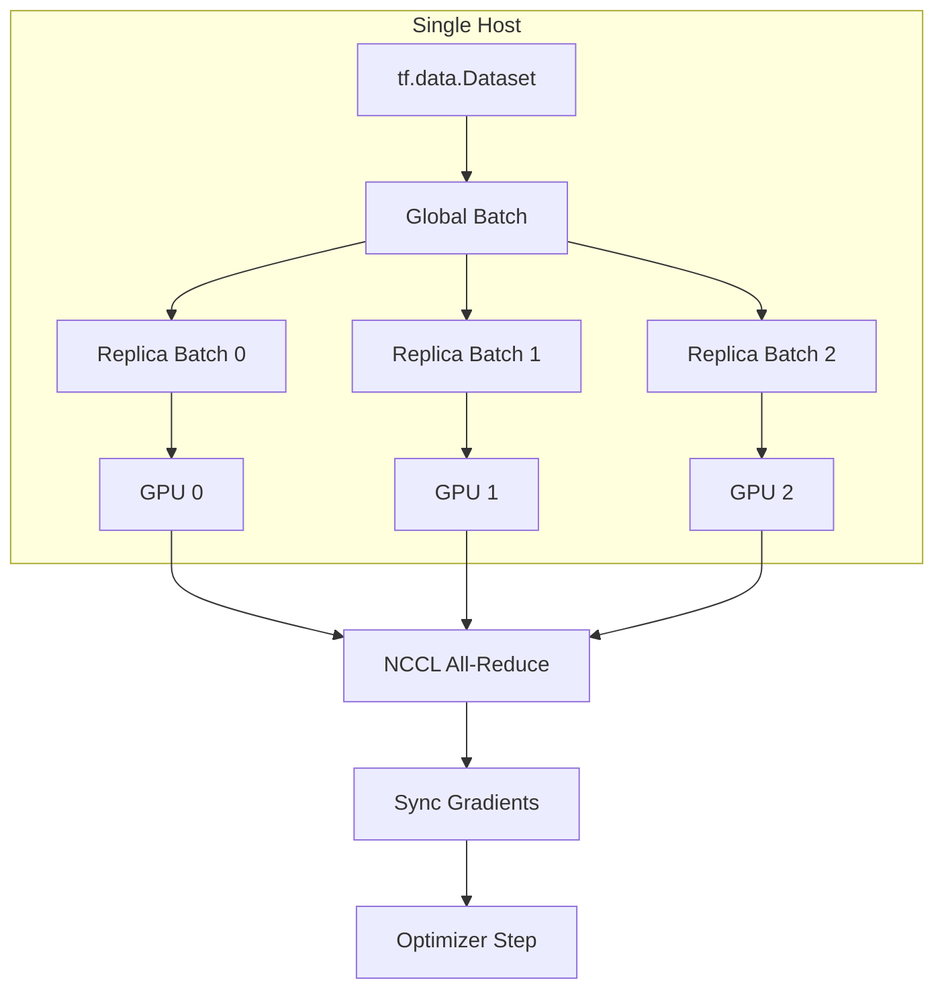
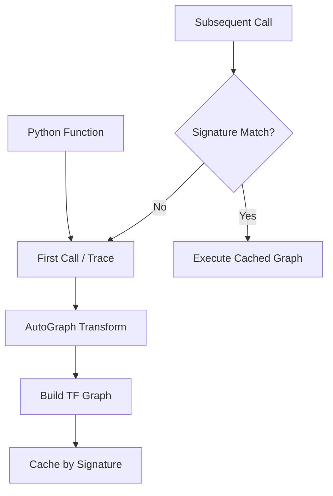
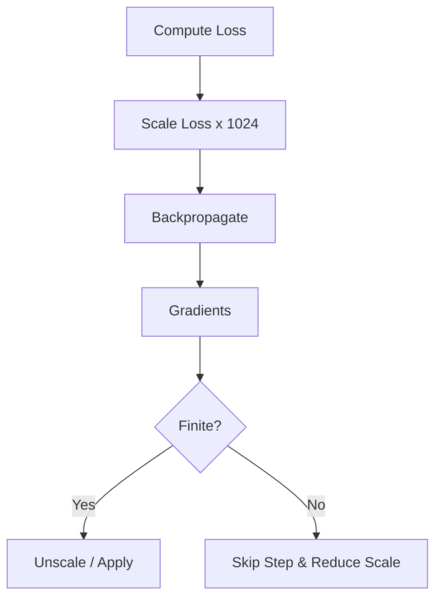
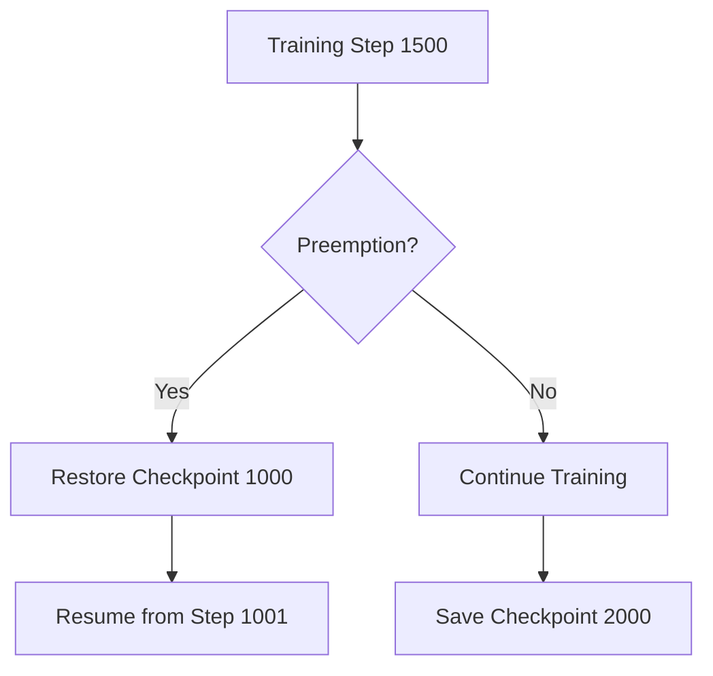

# 🚀 Training at Scale

## 🎯 Learning Objectives

- Distribute training across GPUs, TPUs, and multiple hosts using `tf.distribute` strategies
- Understand the mechanics of `tf.function`, AutoGraph, tracing, and retracing
- Accelerate kernels with XLA compilation and mixed precision at scale
- Save and restore distributed training state with `tf.train.Checkpoint`
- Compare TensorFlow distribution semantics with PyTorch DistributedDataParallel

## Introduction

Training modern models with billions of parameters requires computation beyond any single device. TensorFlow addresses this through `tf.distribute`, which abstracts all-reduce communication, variable placement, and gradient synchronization behind a strategy object.

Distribution alone is insufficient: Python-level loops are too slow. TensorFlow solves this with `tf.function`, which traces Python into optimizable graphs, and XLA, which compiles them into fused device code. This note connects to [[01 - tf.keras Architectures]] and [[02 - tf.data and TFRecord Pipelines]], and bridges to [[09 - MLOps y Produccion]] and [[10 - Cloud, Infra y Backend/29 - Distributed ML Infrastructure/00 - Welcome]]. For PyTorch users, strategy scope replaces `DistributedDataParallel` wrapping, and `tf.function` replaces `torch.compile`.

---

## Module 1: Distribution Strategies

### 1.1 Theoretical Foundation 🧠

Data parallelism replicates the model across devices, splits the global batch into local micro-batches, computes gradients independently, then synchronizes them before updating weights.

- **`MirroredStrategy`**: Single-host, multi-GPU. Gradients are all-reduced via NCCL; optimizer steps are identical on all replicas.
- **`MultiWorkerMirroredStrategy`**: Multi-machine with gRPC inter-machine communication; requires `TF_CONFIG`.
- **`TPUStrategy`**: Targets Cloud TPU and TPU Pods with high-bandwidth ICI; expects `tf.data.Dataset` inputs.
- **`ParameterServerStrategy`**: For models too large for one worker, sharding variables across parameter servers (common in large recommender systems).

### 1.2 Mental Model 📐

```
MirroredStrategy (Single Host)
┌─────────┐    ┌─────────┐    ┌─────────┐    ┌─────────┐
│ GPU 0   │    │ GPU 1   │    │ GPU 2   │    │ GPU 3   │
│ Forward │    │ Forward │    │ Forward │    │ Forward │
│ Grad    │    │ Grad    │    │ Grad    │    │ Grad    │
└────┬────┘    └────┬────┘    └────┬────┘    └────┬────┘
     └──────────────┴──────────────┴──────────────┘
                          │
                    ┌─────┴─────┐
                    │ NCCL All  │
                    │  Reduce   │
                    └─────┬─────┘
                          │
     ┌──────────────┬─────┴─────┬──────────────┐
┌────┴────┐    ┌────┴────┐    ┌┴────────┐    ┌┴────────┐
│ GPU 0   │    │ GPU 1   │    │ GPU 2   │    │ GPU 3   │
│ Update  │    │ Update  │    │ Update  │    │ Update  │
└─────────┘    └─────────┘    └─────────┘    └─────────┘

ParameterServerStrategy
┌─────────┐    ┌─────────┐    ┌─────────┐
│Worker 0 │    │Worker 1 │    │Worker 2 │
│ Forward │    │ Forward │    │ Forward │
│ Fetch   │    │ Fetch   │    │ Fetch   │
└────┬────┘    └────┬────┘    └────┬────┘
     └──────────────┼──────────────┘
                    │
            ┌───────┴───────┐
            │ Parameter     │
            │ Servers 0..N  │
            │ (sharded vars)│
            └───────────────┘

TPU Pod Topology
┌─────────┐ ┌─────────┐ ┌─────────┐
│ TPU Chip│ │ TPU Chip│ │ TPU Chip│
│ 2 cores │ │ 2 cores │ │ 2 cores │
└────┬────┘ └────┬────┘ └────┬────┘
     └───────────┴───────────┘
                 │ ICI
            ┌────┴────┐
            │  Host   │
            │  (CPU)  │
            └─────────┘
```

### 1.3 Syntax and Semantics 📝

```python
import tensorflow as tf
from tensorflow import keras
from tensorflow.keras import layers

# ── MirroredStrategy ──
# WHY: Automatic replication on all visible GPUs.
# strategy.scope() ensures variables and layers are created once per replica.
strategy = tf.distribute.MirroredStrategy()
print(f"Number of devices: {strategy.num_replicas_in_sync}")

with strategy.scope():
    model = keras.Sequential([
        layers.Dense(256, activation="relu"),
        layers.Dense(10)
    ])
    model.compile(
        optimizer=keras.optimizers.Adam(1e-3),
        loss=keras.losses.SparseCategoricalCrossentropy(from_logits=True),
        metrics=["accuracy"]
    )

# Global batch size must scale with replica count.
# WHY: Each replica processes batch_size / num_replicas examples.
GLOBAL_BATCH_SIZE = 64 * strategy.num_replicas_in_sync

# ── MultiWorkerMirroredStrategy ──
# WHY: Requires TF_CONFIG set in the environment for each process.
# Typical TF_CONFIG: {"cluster": {"worker": ["host1:port", "host2:port"]}, "task": {"type": "worker", "index": 0}}
strategy = tf.distribute.MultiWorkerMirroredStrategy()

# ── TPUStrategy ──
# WHY: Connects to a Cloud TPU via a gRPC resolver.
resolver = tf.distribute.cluster_resolver.TPUClusterResolver(tpu="grpc://...")
tf.config.experimental_connect_to_cluster(resolver)
tf.tpu.experimental.initialize_tpu_system(resolver)
strategy = tf.distribute.TPUStrategy(resolver)

with strategy.scope():
    tpu_model = keras.Sequential([...])
    tpu_model.compile(...)

# ── ParameterServerStrategy ──
# WHY: Use tf.distribute.experimental.ParameterServerStrategy for embeddings.
# Requires a coordinator task that drives training steps.
```

### 1.4 Visual Representation 🖼️



### 1.5 Application in ML/AI Systems 🤖

| ML Use Case | This Concept | Impact |
|-------------|-------------|--------|
| Large-batch ResNet training | `MirroredStrategy` | Linear speedup to 8 GPUs on a single DGX node |
| LLM pre-training (PaLM-style) | `TPUStrategy` on TPU pods | Thousands of TPU cores with pod-scale all-reduce |
| Ads/recommendation models | `ParameterServerStrategy` | Sharded embedding tables exceed single-device memory |

Real case: **Google Search** trains ranking models on TPUs using `TPUStrategy`, where the global batch size reaches millions of examples to stabilize sparse feature gradients.

### 1.6 Common Pitfalls ⚠️

⚠️ **Creating model variables outside `strategy.scope()`** places them on the CPU, causing expensive cross-device copies during every forward pass and often triggering OOM on the host.

💡 **Mnemonic**: "Scope your variables, scale your batch, reduce your gradients."

### 1.7 Knowledge Check ❓

1. Why must the global batch size increase proportionally with the number of replicas when using data parallelism?
2. Write the `TF_CONFIG` for a two-worker cluster where worker 1 is the chief.
3. Which strategy is appropriate for a model with 500 GB of embedding tables but only 10 GB of dense parameters?

---

## Module 2: Graph Compilation with tf.function

### 2.1 Theoretical Foundation 🧠

Eager execution is great for debugging but suffers from Python dispatch latency, inability to fuse kernels, and lack of whole-program optimization.

`tf.function` converts Python into a callable TensorFlow graph. On first invocation, TensorFlow **traces** the function in eager mode, caches the graph, and reuses it for identical input signatures. **AutoGraph** converts Python control flow (`if`, `for`, `while`) into graph-compatible ops. Retracing happens on signature changes and is expensive; in distributed training, it can stall all replicas.

### 2.2 Mental Model 📐

```
Eager vs Graph Execution
Eager:  Python ──▶ Op 1 ──▶ Op 2 ──▶ Op 3 (host-driven, slow)
Graph:  Python ──▶ Trace ──▶ Graph ──▶ Execute (device-driven, fast)

Tracing and Retracing
Call 1 (shape 32):   Python traced ──▶ Graph cached for (None, 128)
Call 2 (shape 64):   Python traced ──▶ Graph cached for (None, 128)
Call 3 (shape 32):   Reuse cached graph (fast)

AutoGraph Conversion
Python:   for x in dataset:  y = y + x
Graph:    tf.while_loop(..., body=lambda: y.assign_add(x))
```

### 2.3 Syntax and Semantics 📝

```python
import tensorflow as tf

@tf.function
def dense_layer_sum(x, w, b):
    # AutoGraph converts this Python if into a tf.cond.
    if tf.reduce_mean(x) > 0.0:
        x = x * 2.0
    return tf.matmul(x, w) + b

@tf.function(input_signature=[
    tf.TensorSpec(shape=[None, 128], dtype=tf.float32),
    tf.TensorSpec(shape=[128, 64], dtype=tf.float32),
    tf.TensorSpec(shape=[64], dtype=tf.float32),
])
def stable_dense(x, w, b):
    return tf.nn.relu(tf.matmul(x, w) + b)

# Python side effects run only at trace time; use tf.print in graph.
@tf.function
def side_effect_demo(x):
    tf.print("Graph print:", x)
    return x + 1
```

### 2.4 Visual Representation 🖼️



### 2.5 Application in ML/AI Systems 🤖

| ML Use Case | This Concept | Impact |
|-------------|-------------|--------|
| Custom training step | `@tf.function` on `train_step` | 3-5x speedup vs eager on GPU/TPU |
| Export to SavedModel | Traced graph is portable | Serve in TF Serving without Python runtime |
| Dynamic sequence models | `input_signature=[None, None]` | Single trace handles variable lengths |

Real case: **Uber's Michelangelo** platform exports all production models via `tf.function` tracing into SavedModel, ensuring inference graphs run identically in training and serving environments.

### 2.6 Common Pitfalls ⚠️

⚠️ **Retracing on every batch due to varying sequence lengths** destroys throughput. Use `None` dimensions in `input_signature` to accept variable sizes without triggering a new trace.

💡 **Mnemonic**: "Trace once, run many. Pin your signatures, watch your shapes."

### 2.7 Knowledge Check ❓

1. Why does `print()` inside `@tf.function` only execute once, while `tf.print()` executes every call?
2. Add an `input_signature` to a function that accepts a 3D image batch `(None, 224, 224, 3)`.
3. What is the performance cost of calling a `@tf.function` with a Python list of varying length?

---

## Module 3: XLA and Mixed Precision at Scale

### 3.1 Theoretical Foundation 🧠

TensorFlow normally executes operations through individual kernels, each reading and writing memory. XLA (Accelerated Linear Algebra) compiles clusters of ops into a single optimized kernel, fusing convolutions with biases and activations while eliminating intermediate buffers.

Mixed precision is required to saturate modern accelerators. Tensor Cores and TPUs perform `bfloat16`/`float16` matmul up to 16x faster than `float32`, but small gradients can underflow. `LossScaleOptimizer` multiplies loss before backprop, divides gradients after, and skips steps with Inf/NaN while adjusting scale dynamically.

### 3.2 Mental Model 📐

```
Without XLA
Op 1 ──▶ mem ──▶ Op 2 ──▶ mem ──▶ Op 3 ──▶ mem
   kernel            kernel            kernel

With XLA
Op 1 + Op 2 + Op 3 ──▶ mem
   fused kernel

Loss Scaling Mechanics
Forward:  loss_fp16 = compute_loss()        (small values)
          scaled_loss = loss_fp16 * 1024.0   (prevent underflow)
Backward: grads = gradient(scaled_loss)
          grads = grads / 1024.0             (restore magnitude)
          if grads have NaN: skip step, decrease scale
```

```
Scale at Scale
Single GPU:   MirroredStrategy + mixed_float16 + LossScaleOptimizer
Multi-GPU:    NCCL all-reduce on scaled gradients (identical)
TPU Pod:      bfloat16 by default; XLA required for pod compilation
```

### 3.3 Syntax and Semantics 📝

```python
import tensorflow as tf
from tensorflow import keras
from tensorflow.keras import layers

# ── XLA Compilation ──
# WHY: jit_compile=True passes the graph through XLA for kernel fusion.
# This often yields 10-30% speedup on compute-bound models.
@tf.function(jit_compile=True)
def xla_train_step(x, y, model, optimizer, loss_fn):
    with tf.GradientTape() as tape:
        y_pred = model(x, training=True)
        loss = loss_fn(y, y_pred)
    grads = tape.gradient(loss, model.trainable_variables)
    optimizer.apply_gradients(zip(grads, model.trainable_variables))
    return loss

# ── Mixed Precision with Distribution ──
# WHY: Set policy once; layers automatically use float16 compute and float32 vars.
policy = tf.keras.mixed_precision.Policy("mixed_float16")
tf.keras.mixed_precision.set_global_policy(policy)

strategy = tf.distribute.MirroredStrategy()
with strategy.scope():
    model = keras.Sequential([
        layers.Dense(512, activation="relu"),
        layers.Dense(10, dtype="float32")  # Keep outputs float32.
    ])
    # LossScaleOptimizer wraps the base optimizer.
    base_opt = keras.optimizers.Adam(1e-3)
    optimizer = keras.mixed_precision.LossScaleOptimizer(base_opt)
    model.compile(
        optimizer=optimizer,
        loss="sparse_categorical_crossentropy",
        metrics=["accuracy"],
        jit_compile=True  # Enable XLA for the entire training graph.
    )

# ── Dynamic loss scale internals ──
# WHY: The scale doubles when steps are clean; halves on NaN/Inf.
print(optimizer.dynamic_scale)  # True for default dynamic scaling
```

### 3.4 Visual Representation 🖼️



### 3.5 Application in ML/AI Systems 🤖

| ML Use Case | This Concept | Impact |
|-------------|-------------|--------|
| Transformer training on A100 | `jit_compile=True` + `mixed_float16` | ~1.5-2x end-to-end throughput vs FP32 baseline |
| ConvNet inference at edge | XLA AOT compilation | Reduced binary size and deterministic latency |
| TPU pod training | `bfloat16` + XLA by design | Required to achieve advertised petaflop rates |

Real case: **OpenAI** trains GPT-class models with mixed precision on NVIDIA clusters; loss scaling prevents divergence during the early phase when activation gradients are small.

### 3.6 Common Pitfalls ⚠️

⚠️ **Enabling XLA on CPU** rarely helps and can hurt performance because CPU kernels are already heavily optimized in Eigen. XLA shines on GPU and TPU.

💡 **Mnemonic**: "XLA fuses ops, mixed precision doubles speed, loss scale guards the small."

### 3.7 Knowledge Check ❓

1. Why must the loss be scaled *before* backpropagation rather than scaling gradients afterward?
2. Benchmark a small ConvNet with and without `jit_compile=True`. Is the gain larger on CPU or GPU?
3. Explain why `bfloat16` does not require loss scaling on TPUs but `float16` often does on GPUs.

---

## Module 4: Checkpointing and Advanced Distribution

### 4.1 Theoretical Foundation 🧠

Distributed training can run for days or weeks; hardware failures and preemptions are inevitable. Checkpointing persists model weights, optimizer state, and global step to resume exactly where training left off.

`tf.train.Checkpoint` uses **deferred restoration**: register objects by name, save values to disk, and restore lazily by matching names and shapes. This lets you change the Python object graph and still restore compatible weights.

For massive models, `tf.experimental.dtensor` introduces a **device mesh** abstraction where tensors are sharded across a multi-dimensional grid of devices—TensorFlow's answer to FSDP for models with hundreds of billions of parameters.

### 4.2 Mental Model 📐

```
Checkpoint Object Graph
┌─────────────────────────────┐
│  tf.train.Checkpoint        │
│  ├── model = my_model       │
│  ├── optimizer = my_opt     │
│  └── step = tf.Variable(0)  │
└─────────────┬───────────────┘
              │ save()
              ▼
        ┌─────────────┐
        │ ckpt-1000   │
        │ ckpt-2000   │
        │ ckpt-3000   │
        └─────────────┘

Device Mesh (2x4)
┌────────┬────────┬────────┬────────┐
│ (0,0)  │ (0,1)  │ (0,2)  │ (0,3)  │
├────────┼────────┼────────┼────────┤
│ (1,0)  │ (1,1)  │ (1,2)  │ (1,3)  │
└────────┴────────┴────────┴────────┘
Row axis = data parallel shards
Col axis = model parallel shards
```

```
CheckpointManager Cleanup
┌─────────┐ ┌─────────┐ ┌─────────┐ ┌─────────┐
│ckpt-1000│ │ckpt-2000│ │ckpt-3000│ │ckpt-4000│
└─────────┘ └─────────┘ └─────────┘ └─────────┘
    X           X          Keep        Keep
```

### 4.3 Syntax and Semantics 📝

```python
import tensorflow as tf
from tensorflow import keras

model = keras.Sequential([keras.layers.Dense(10)])
optimizer = keras.optimizers.Adam()
step = tf.Variable(0, dtype=tf.int64)

checkpoint = tf.train.Checkpoint(model=model, optimizer=optimizer, step=step)
manager = tf.train.CheckpointManager(checkpoint, directory="./checkpoints", max_to_keep=3)

if int(step) % 1000 == 0:
    save_path = manager.save()
    print(f"Saved checkpoint at {save_path}")

if manager.latest_checkpoint:
    checkpoint.restore(manager.latest_checkpoint)
    print("Restored.")

# DTensor conceptual snippet
from tensorflow.experimental import dtensor
mesh = dtensor.create_mesh([("x", 2), ("y", 4)], devices=dtensor.local_devices())
layout = dtensor.Layout([dtensor.UNSHARDED, "x"], mesh)
```

### 4.4 Visual Representation 🖼️



### 4.5 Application in ML/AI Systems 🤖

| ML Use Case | This Concept | Impact |
|-------------|-------------|--------|
| Long-running LLM pre-training | `CheckpointManager` every 1000 steps | Resume after preemption without losing days of compute |
| Spot instance training on GCP | Automatic checkpoint + restore | Cost savings of 60-90% with fault-tolerant loops |
| 100B+ parameter models | `dtensor` mesh + layout | Shards weights and optimizers across hundreds of devices |

Real case: **Meta AI** uses checkpointing aggressively for OPT and LLaMA training runs, with async checkpoint writes to NFS so the training step is not blocked by disk I/O.

### 4.6 Common Pitfalls ⚠️

⚠️ **Saving only `model.save_weights()` and not the optimizer state** forces you to restart training from a cold optimizer, which often causes loss spikes and convergence issues after resume.

💡 **Mnemonic**: "Save the model, save the opt, save the step—resume with no regret."

### 4.7 Knowledge Check ❓

1. Why is `CheckpointManager(max_to_keep=3)` safer than saving every checkpoint forever?
2. What happens if you add a new layer to a model and then call `checkpoint.restore()`?
3. Describe the difference between data parallelism and model parallelism in the context of a device mesh.

---

## 📦 Compression Code

```python
"""Distributed training script summarizing MirroredStrategy, tf.function,
mixed precision, XLA, and CheckpointManager."""
import tensorflow as tf
from tensorflow import keras
from tensorflow.keras import layers

tf.keras.mixed_precision.set_global_policy("mixed_float16")

strategy = tf.distribute.MirroredStrategy()
print(f"Replicas: {strategy.num_replicas_in_sync}")

with strategy.scope():
    model = keras.Sequential([
        layers.Dense(256, activation="relu"),
        layers.Dense(10, dtype="float32")
    ])
    base_opt = keras.optimizers.Adam(1e-3)
    optimizer = keras.mixed_precision.LossScaleOptimizer(base_opt)
    loss_fn = keras.losses.SparseCategoricalCrossentropy(from_logits=True)

checkpoint = tf.train.Checkpoint(model=model, optimizer=optimizer)
manager = tf.train.CheckpointManager(checkpoint, "./ckpts", max_to_keep=3)
if manager.latest_checkpoint:
    checkpoint.restore(manager.latest_checkpoint)
    print("Restored.")

def make_dataset(batch_size):
    ds = tf.data.Dataset.from_tensor_slices(
        (tf.random.normal([1024, 128]), tf.random.uniform([1024], maxval=10, dtype=tf.int32))
    )
    return ds.shuffle(256).batch(batch_size).prefetch(tf.data.AUTOTUNE)

train_ds = make_dataset(64 * strategy.num_replicas_in_sync)

@tf.function(jit_compile=True)
def train_step(x, y):
    with tf.GradientTape() as tape:
        logits = model(x, training=True)
        loss = loss_fn(y, logits)
        scaled_loss = optimizer.get_scaled_loss(loss)
    scaled_grads = tape.gradient(scaled_loss, model.trainable_variables)
    grads = optimizer.get_unscaled_gradients(scaled_grads)
    optimizer.apply_gradients(zip(grads, model.trainable_variables))
    return loss

@tf.function
def distributed_train_step(x, y):
    per_replica_losses = strategy.run(train_step, args=(x, y))
    return strategy.reduce(tf.distribute.ReduceOp.SUM, per_replica_losses, axis=None)

for step, (x, y) in enumerate(train_ds):
    loss = distributed_train_step(x, y)
    if step % 100 == 0:
        print(f"Step {step}, loss: {loss:.4f}")
        manager.save()
```

## 🎯 Documented Project

### Description
Implement a **Fault-Tolerant Multi-GPU Trainer** for ResNet-50 that resumes after preemption, uses mixed precision, and reports throughput via TensorBoard.

### Functional Requirements
- Use `MirroredStrategy` across all GPUs
- Wrap model/optimizer in strategy scope with `LossScaleOptimizer`
- Custom `train_step` with `@tf.function(jit_compile=True)`
- Save/restore checkpoints via `CheckpointManager`
- Log loss, accuracy, and steps/sec to TensorBoard
- Accept a `tf.data` pipeline (see [[02 - tf.data and TFRecord Pipelines]])

### Main Components
| Component | Implementation |
|-----------|----------------|
| Distribution | `tf.distribute.MirroredStrategy` |
| Performance | `mixed_float16`, `jit_compile=True` |
| Resilience | `tf.train.Checkpoint` + `CheckpointManager(max_to_keep=5)` |
| Monitoring | `keras.callbacks.TensorBoard` or `tf.summary` |
| Input | `TFRecordDataset` with `prefetch(AUTOTUNE)` |

### Success Metrics
- Resume with < 0.5% validation accuracy drop
- GPU utilization > 85% sustained
- Linear throughput scaling up to 4 GPUs (within 10%)
- Checkpoint restore in < 30 seconds

## 🎯 Key Takeaways

- `MirroredStrategy` is the default for single-host multi-GPU; use `TPUStrategy` for TPU pods.
- Always create models and optimizers inside `strategy.scope()` for correct device placement.
- `@tf.function` traces Python into graphs; specify `input_signature` to avoid expensive retracing.
- XLA (`jit_compile=True`) fuses kernels and often yields 10-30% speedups on GPU/TPU.
- Mixed precision requires `LossScaleOptimizer` to prevent gradient underflow in `float16`.
- `tf.train.Checkpoint` + `CheckpointManager` robustly saves and resumes distributed training state.
- `dtensor` provides mesh-based sharding for models too large for pure data parallelism.

## References

- TensorFlow distributed training guide: https://www.tensorflow.org/guide/distributed_training
- tf.function and AutoGraph: https://www.tensorflow.org/guide/function
- XLA overview: https://www.tensorflow.org/xla
- Mixed precision: https://www.tensorflow.org/guide/mixed_precision
- PyTorch comparison: see [[05 - Deep Learning y Computer Vision/03 - Deep Learning con PyTorch/00 - Bienvenida]]
- Distributed infrastructure: see [[10 - Cloud, Infra y Backend/29 - Distributed ML Infrastructure/00 - Welcome]]
