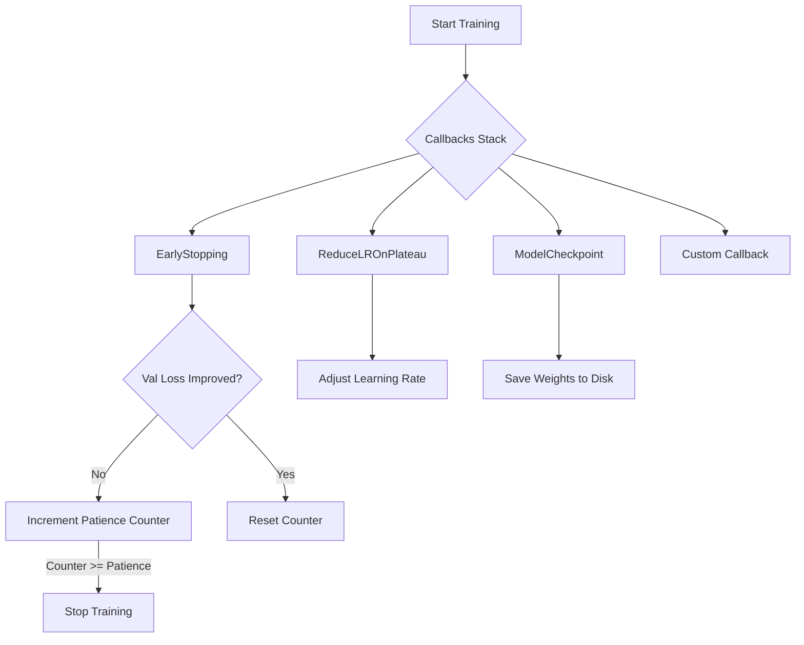
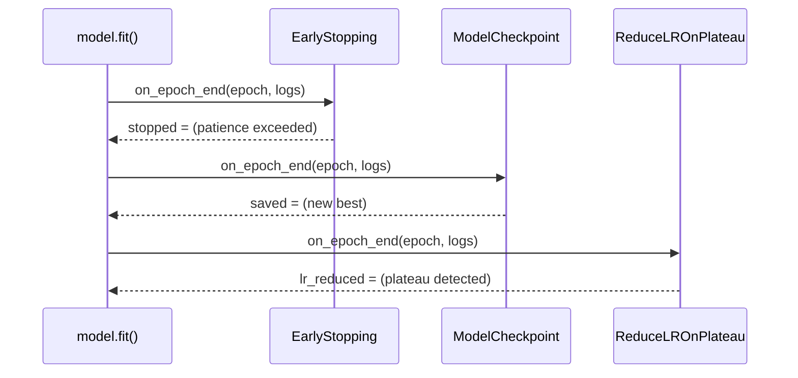
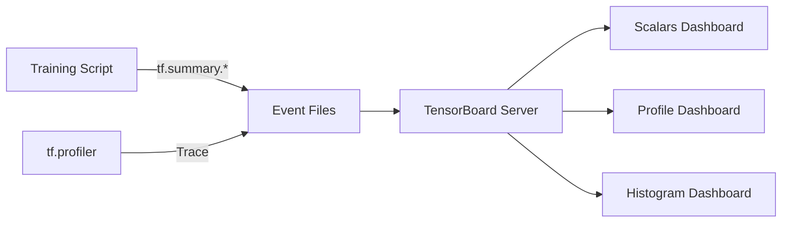
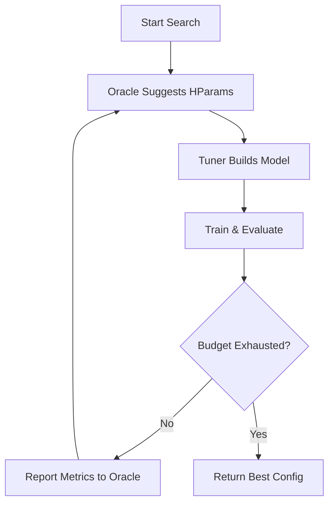
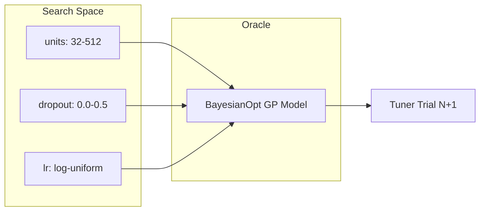

# 🏷️ 04 - TensorBoard, Callbacks, and Tuning

## 🎯 Learning Objectives
- Master the Keras `Callback` base class and its lifecycle hooks.
- Configure built-in callbacks (`EarlyStopping`, `ModelCheckpoint`, `ReduceLROnPlateau`, `TensorBoard`, etc.) for robust training pipelines.
- Build custom callbacks to inject arbitrary logic into the training loop.
- Use TensorBoard to visualize scalars, images, histograms, and computation graphs.
- Profile TensorFlow programs with `tf.profiler` and interpret results in TensorBoard.
- Automate hyperparameter search with KerasTuner (`BayesianOptimization`, `Hyperband`, `RandomSearch`).
- Design reusable `HyperModel` classes and understand `Oracle` and `Tuner` internals.

## Introduction
Training deep neural networks is rarely a fire-and-forget operation. Without intervention, models can overfit, learning rates can stall, or training can waste epochs on a dead-end configuration. Keras callbacks are the canonical mechanism for injecting control logic into the training loop without rewriting the fit routine. They bridge the gap between research experimentation and production reliability, enabling automated checkpointing, adaptive learning rates, and early termination. TensorBoard extends this by providing a time-travel debugger for your model: every weight histogram, gradient norm, and prediction image can be visualized across epochs, turning black-box optimization into an inspectable process. Finally, KerasTuner transforms the art of hyperparameter selection into a reproducible, scalable search process, replacing manual grid-search notebooks with Bayesian optimization and population-based training strategies.

This module connects to the broader ML engineering landscape through model monitoring in [[09 - MLOps y Produccion]], distributed training infrastructure in [[10 - Cloud, Infra y Backend/29 - Distributed ML Infrastructure/00 - Welcome]], and system design patterns in [[10 - Cloud, Infra y Backend/32 - System Design for ML/02 - System Design for ML]]. It also complements the PyTorch training ecosystem covered in [[05 - Deep Learning y Computer Vision/03 - Deep Learning con PyTorch/00 - Bienvenida]].

---

## Module 1: Keras Callbacks Architecture

### 1.1 Theoretical Foundation 🧠

The callback pattern originates from event-driven programming: an object registers interest in lifecycle events and executes code when those events fire. In Keras, the `fit()` loop is a closed system that iterates over epochs and batches. Without callbacks, the only way to alter behavior mid-flight would be to fork the framework itself. The callback API solves this by exposing a rich set of hooks (`on_epoch_begin`, `on_batch_end`, `on_train_end`, etc.) that the training engine calls at predetermined points.

Historically, early deep learning frameworks like Caffe required external shell scripts to snapshot models periodically. Keras unified this into a first-class Python API, making training pipelines composable and testable. The design motivation is separation of concerns: the training loop handles forward/backward passes, while callbacks handle everything orthogonal to gradient descent—checkpointing, logging, learning rate scheduling, and early stopping. This decoupling means you can stack callbacks like middleware in a web framework, each performing a distinct responsibility without interfering with the others.

### 1.2 Mental Model 📐

```
┌─────────────────────────────────────────────┐
│              model.fit() Loop               │
├─────────────────────────────────────────────┤
│  on_train_begin()                           │
│  ├─ Epoch 1                                 │
│  │  ├─ on_epoch_begin()                     │
│  │  │  ├─ Batch 1                           │
│  │  │  │  ├─ on_train_batch_begin()         │
│  │  │  │  │  [Forward + Backward]           │
│  │  │  │  ├─ on_train_batch_end()           │
│  │  │  ├─ Batch 2 ...                       │
│  │  ├─ on_epoch_end()  ◄── Validation here  │
│  ├─ Epoch 2 ...                             │
│  on_train_end()                             │
└─────────────────────────────────────────────┘
         ▲
         │ Each arrow triggers ALL registered callbacks
```

```
┌─────────────┐    ┌─────────────┐    ┌─────────────┐
│  Callback 1 │    │  Callback 2 │    │  Callback N │
│ EarlyStopping│    │ ModelCheckpoint│   │ TensorBoard │
│  (monitors  │    │  (saves     │    │  (writes    │
│   val_loss) │    │   weights)  │    │   logs)     │
└──────┬──────┘    └──────┬──────┘    └──────┬──────┘
       └──────────────────┼──────────────────┘
                          ▼
              ┌─────────────────────┐
              │   Keras Training    │
              │       Engine        │
              └─────────────────────┘
```

### 1.3 Syntax and Semantics 📝

```python
import tensorflow as tf
from tensorflow import keras

# ------------------------------------------------------------------
# Base class: every custom callback inherits from Callback
# WHY: Keras guarantees the model reference and training params
#      are injected automatically before training starts.
# ------------------------------------------------------------------
class MyCallback(keras.callbacks.Callback):
    def on_train_begin(self, logs=None):
        # WHY: Initialize stateful variables (counters, best scores)
        self.best_loss = float('inf')

    def on_epoch_end(self, epoch, logs=None):
        # WHY: logs is a dict with keys like 'loss', 'val_accuracy'
        current = logs.get('val_loss')
        if current < self.best_loss:
            self.best_loss = current
            print(f"Epoch {epoch}: new best val_loss {current:.4f}")

    def on_train_end(self, logs=None):
        # WHY: Clean up resources, send notifications, finalize logs
        print(f"Training finished. Best val_loss: {self.best_loss:.4f}")

# ------------------------------------------------------------------
# Built-in callbacks: compose them like middleware
# WHY: Order matters for side effects (e.g., checkpoint AFTER
#      early stop decision, or learning rate BEFORE weight update).
# ------------------------------------------------------------------
model = keras.Sequential([...])
model.compile(optimizer='adam', loss='sparse_categorical_crossentropy', metrics=['accuracy'])

callbacks = [
    keras.callbacks.EarlyStopping(
        monitor='val_loss',
        patience=5,              # WHY: wait 5 epochs before stopping
        restore_best_weights=True # WHY: rollback to best checkpoint
    ),
    keras.callbacks.ModelCheckpoint(
        filepath='best_model.keras',
        monitor='val_accuracy',
        save_best_only=True      # WHY: avoid I/O thrashing on every epoch
    ),
    keras.callbacks.ReduceLROnPlateau(
        monitor='val_loss',
        factor=0.5,              # WHY: halve LR when stuck
        patience=3,              # WHY: less patient than EarlyStopping
        min_lr=1e-7
    ),
    keras.callbacks.TerminateOnNaN(),  # WHY: fail fast on numerical instability
    MyCallback()
]

model.fit(x_train, y_train, validation_split=0.2, epochs=100, callbacks=callbacks)
```

### 1.4 Visual Representation 🖼️






### 1.5 Application in ML/AI Systems 🤖

| ML Use Case | This Concept | Impact |
|-------------|-------------|--------|
| Real case: Spotify | `EarlyStopping` + `ModelCheckpoint` on music recommendation models | Saves ~30% compute by cutting training when validation NDCG plateaus |
| Real case: Waymo | Custom callback logging per-step LIDAR loss to TensorBoard | Enables real-time anomaly detection during autonomous-driving model training |
| Production training | `ReduceLROnPlateau` | Prevents manual LR tuning across dozens of model variants |

### 1.6 Common Pitfalls ⚠️

⚠️ **Pitfall**: Setting `restore_best_weights=True` in `EarlyStopping` without `ModelCheckpoint` means you lose the exact epoch snapshot if your process crashes after training ends. The callback only restores weights in memory.
💡 **Tip**: Pair `EarlyStopping` with `ModelCheckpoint(save_best_only=True)` so disk and memory are synchronized.

⚠️ **Pitfall**: Using `TerminateOnNaN()` without identifying the root cause (exploding gradients, bad data normalization) turns a training failure into a silent early exit.
💡 **Tip**: Add `tf.debugging.check_numerics` inside your loss function during debugging to catch NaN origins before they propagate.

### 1.7 Knowledge Check ❓

1. Why does callback order in the `callbacks` list matter when `EarlyStopping` and `ModelCheckpoint` are both present?
2. Implement a custom callback that logs the L2 norm of every layer's weights at the end of each epoch using `self.model.layers`.
3. What happens if `ReduceLROnPlateau` patience is greater than `EarlyStopping` patience?

---

## Module 2: TensorBoard and Profiling

### 2.1 Theoretical Foundation 🧠

TensorBoard was introduced alongside TensorFlow 1.0 as a web-based visualization toolkit for machine learning experimentation. Before dedicated visualization tools, practitioners wrote ad-hoc Matplotlib scripts that were slow, non-interactive, and impossible to compare across runs. TensorBoard centralizes this by consuming timestamped event files written during training, enabling scalar tracking, image inspection, histogram analysis, and graph visualization in a single interface.

The underlying mechanism is the `tf.summary` API, which serializes tensors into protocol buffers and appends them to a log directory. TensorBoard watches this directory and updates its web UI in real time. In production ML systems, this log directory becomes the artifact storage for experiment tracking, integrated with MLflow or Vertex AI. Profiling (`tf.profiler`) extends this by capturing hardware-level traces (GPU kernel execution, memory allocation, data pipeline stalls), turning performance optimization from guesswork into data-driven bottleneck removal.

### 2.2 Mental Model 📐

```
┌────────────────────────────────────────────────────────┐
│              TensorBoard Data Flow                     │
├────────────────────────────────────────────────────────┤
│  Training Script                                       │
│  ├─ tf.summary.scalar("loss", loss_value, step=epoch)  │
│  ├─ tf.summary.image("preds", images, step=epoch)      │
│  └─ tf.summary.histogram("weights", w, step=epoch)     │
│         │                                              │
│         ▼                                              │
│  ./logs/run_2025_05_27/                                │
│  ├─ events.out.tfevents.12345                          │
│  └─ plugins/profile/...                                │
│         │                                              │
│         ▼                                              │
│  tensorboard --logdir ./logs                           │
│         │                                              │
│         ▼                                              │
│  http://localhost:6006  (Web UI)                       │
└────────────────────────────────────────────────────────┘
```

```
┌─────────────────────────────────────────────┐
│         tf.profiler Trace Capture           │
├─────────────────────────────────────────────┤
│  CPU Ops ──┐                                │
│  GPU Kernels├─► Trace Events ──► Timeline   │
│  Memory    │                                │
│  XLA Ops ──┘                                │
└─────────────────────────────────────────────┘
```

### 2.3 Syntax and Semantics 📝

```python
import tensorflow as tf
from datetime import datetime

# ------------------------------------------------------------------
# 1. TensorBoard callback: the simplest integration
# WHY: It auto-logs scalars, histograms, and graphs without
#      manual summary calls for standard metrics.
# ------------------------------------------------------------------
log_dir = "logs/fit/" + datetime.now().strftime("%Y%m%d-%H%M%S")

tensorboard_callback = tf.keras.callbacks.TensorBoard(
    log_dir=log_dir,
    histogram_freq=1,        # WHY: compute weight histograms every epoch
    update_freq='batch',     # WHY: log loss every batch for fine-grained curves
    profile_batch='500,520'  # WHY: capture profiler trace between batches 500-520
)

model.fit(dataset, epochs=10, callbacks=[tensorboard_callback])

# ------------------------------------------------------------------
# 2. Manual summary writing (for custom training loops)
# WHY: Gives full control over what, when, and how to log.
# ------------------------------------------------------------------
writer = tf.summary.create_file_writer(log_dir)

with writer.as_default():
    for step, (x, y) in enumerate(train_dataset):
        loss = train_step(x, y)
        # WHY: step parameter aligns x-axis across different summary types
        tf.summary.scalar('train_loss', loss, step=step)
        if step % 100 == 0:
            # WHY: visualize model predictions during training
            preds = model(x[:4])
            tf.summary.image('predictions', preds, step=step, max_outputs=4)

# ------------------------------------------------------------------
# 3. Profiling with tf.profiler
# WHY: Identifies whether your bottleneck is data loading,
#      kernel launch, or memory bandwidth.
# ------------------------------------------------------------------
tf.profiler.experimental.start(log_dir)
for step, (x, y) in enumerate(train_dataset):
    train_step(x, y)
    if step >= 200:
        break
tf.profiler.experimental.stop()

# Launch: tensorboard --logdir=logs/fit
```

### 2.4 Visual Representation 🖼️




### 2.5 Application in ML/AI Systems 🤖

| ML Use Case | This Concept | Impact |
|-------------|-------------|--------|
| Real case: DeepMind | TensorBoard histograms for AlphaFold attention maps | Revealed structural patterns in protein folding attention heads |
| Real case: Google Brain | `profile_batch` on TPU pods | Reduced step time by 18% by identifying all-reduce bottleneck |
| Experiment tracking | `tf.summary.hparams` | Enables hyperparameter comparison across 1000+ runs in HParams dashboard |

### 2.6 Common Pitfalls ⚠️

⚠️ **Pitfall**: Enabling `histogram_freq=1` on every layer for large models writes gigabytes of event data and slows training by 20-40%.
💡 **Tip**: Profile one layer class at a time (e.g., only `Dense` layers) or reduce frequency to every 10 epochs.

⚠️ **Pitfall**: Forgetting to set `update_freq='epoch'` when logging per-batch metrics on very large datasets causes unreadable scalar plots with millions of points.
💡 **Tip**: Use `update_freq='epoch'` for stable plots and per-batch logging only for small datasets or debugging.

### 2.7 Knowledge Check ❓

1. How would you log a custom metric (e.g., F1-score) to TensorBoard when using `model.fit()` with a custom callback?
2. Interpret this profiler insight: "Input pipeline idle time: 65%". What are three remediation strategies?
3. Write a code snippet that logs a 3D point cloud (`tf.summary.mesh`) every 50 steps.

---

## Module 3: KerasTuner for Hyperparameter Optimization

### 3.1 Theoretical Foundation 🧠

Hyperparameter optimization (HPO) is the problem of finding the configuration of knobs that maximize model performance on a validation set. Unlike model weights, which are differentiable with respect to the loss, hyperparameters are discrete or continuous non-differentiable choices. Manual grid search scales exponentially with dimensionality (the curse of dimensionality) and wastes budget on unpromising regions.

KerasTuner abstracts HPO into two components: the `Oracle` (search strategy) and the `Tuner` (execution engine). The Oracle decides which hyperparameter values to try next based on prior observations, while the Tuner handles training, evaluation, and result reporting. `BayesianOptimization` builds a probabilistic model (typically a Gaussian Process) of the objective landscape, selecting points that maximize Expected Improvement. `Hyperband` addresses the budget allocation problem by adaptively allocating more resources only to promising configurations, based on the Successive Halving algorithm. This is a dramatic improvement over naive grid or random search, especially when individual trials are expensive.

### 3.2 Mental Model 📐

```
┌──────────────────────────────────────────────┐
│           KerasTuner Architecture            │
├──────────────────────────────────────────────┤
│                                              │
│   ┌─────────────┐      ┌─────────────┐       │
│   │   Oracle    │◄────►│   Tuner     │       │
│   │ (Strategy)  │      │ (Executor)  │       │
│   └──────┬──────┘      └──────┬──────┘       │
│          │                    │                │
│          ▼                    ▼                │
│   Suggests hparams ──► Builds & trains model  │
│          ▲                    │                │
│          └────── Reports val_loss ────────────┘
│                                              │
└──────────────────────────────────────────────┘
```

```
┌──────────────────────────────────────────────┐
│         Hyperband Successive Halving         │
├──────────────────────────────────────────────┤
│  Round 1: 81 configs x 1 epoch               │
│     └─► keep top 27                          │
│  Round 2: 27 configs x 3 epochs              │
│     └─► keep top 9                           │
│  Round 3: 9 configs x 9 epochs               │
│     └─► keep top 3                           │
│  Round 4: 3 configs x 27 epochs              │
│     └─► best 1                               │
└──────────────────────────────────────────────┘
```

### 3.3 Syntax and Semantics 📝

```python
import keras_tuner as kt
import tensorflow as tf
from tensorflow import keras

# ------------------------------------------------------------------
# 1. Define a HyperModel: a model factory parameterized by hp
# WHY: Encapsulates architecture AND search space in one reusable class.
# ------------------------------------------------------------------
class MyHyperModel(kt.HyperModel):
    def build(self, hp):
        model = keras.Sequential()
        model.add(keras.layers.Input(shape=(28, 28)))
        model.add(keras.layers.Flatten())

        # WHY: tune number of units in first dense layer
        units = hp.Int('units', min_value=32, max_value=512, step=32)
        model.add(keras.layers.Dense(units, activation='relu'))

        # WHY: tune whether to use dropout
        if hp.Boolean('use_dropout'):
            rate = hp.Float('dropout_rate', 0.1, 0.5, step=0.1)
            model.add(keras.layers.Dropout(rate))

        model.add(keras.layers.Dense(10, activation='softmax'))

        # WHY: tune optimizer choice and its learning rate
        optimizer = hp.Choice('optimizer', ['adam', 'sgd'])
        lr = hp.Float('lr', 1e-4, 1e-2, sampling='log')
        if optimizer == 'adam':
            opt = keras.optimizers.Adam(learning_rate=lr)
        else:
            opt = keras.optimizers.SGD(learning_rate=lr, momentum=0.9)

        model.compile(optimizer=opt,
                      loss='sparse_categorical_crossentropy',
                      metrics=['accuracy'])
        return model

    def fit(self, hp, model, *args, **kwargs):
        # WHY: override fit to inject trial-specific callbacks
        return model.fit(
            *args,
            **kwargs,
            callbacks=[
                keras.callbacks.EarlyStopping(patience=2, restore_best_weights=True)
            ]
        )

# ------------------------------------------------------------------
# 2. Instantiate Tuner with an Oracle strategy
# WHY: Hyperband allocates budget adaptively; BayesianOptimization
#      models the objective surface for sample-efficient search.
# ------------------------------------------------------------------
tuner = kt.Hyperband(
    MyHyperModel(),
    objective='val_accuracy',
    max_epochs=40,
    factor=3,              # WHY: reduction factor for successive halving
    directory='my_dir',
    project_name='intro_to_kt',
    overwrite=True
)

# Optional: BayesianOptimization alternative
# tuner = kt.BayesianOptimization(
#     MyHyperModel(),
#     objective='val_accuracy',
#     max_trials=50,
#     directory='my_dir',
#     project_name='bayesian_search'
# )

# ------------------------------------------------------------------
# 3. Run search and inspect results
# WHY: search summarizes the Oracle-Tuner feedback loop.
# ------------------------------------------------------------------
tuner.search(x_train, y_train, epochs=10, validation_split=0.2)

best_hps = tuner.get_best_hyperparameters(num_trials=1)[0]
print(f"Best units: {best_hps.get('units')}")
print(f"Best lr: {best_hps.get('lr'):.4f}")

# Train final model with best hparams
best_model = tuner.hypermodel.build(best_hps)
best_model.fit(x_train, y_train, epochs=50, validation_split=0.2)
```

### 3.4 Visual Representation 🖼️






### 3.5 Application in ML/AI Systems 🤖

| ML Use Case | This Concept | Impact |
|-------------|-------------|--------|
| Real case: Airbnb | KerasTuner `Hyperband` on listing ranking models | Found architecture with +2.3% NDCG in 1/10th the compute of grid search |
| Real case: Spotify | Bayesian optimization for playlist embedding dims | Reduced embedding table memory by 40% with no quality loss |
| AutoML pipelines | `HyperModel` + distributed Oracle | Enables non-ML engineers to train tuned models via config files |

### 3.6 Common Pitfalls ⚠️

⚠️ **Pitfall**: Defining a search space where one hyperparameter is only used conditionally (e.g., `dropout_rate` when `use_dropout=False`) but still sampling it unconditionally. The Oracle wastes trials exploring irrelevant regions.
💡 **Tip**: Use conditional scopes (`hp.conditional_scope`) or default values to keep the search space coherent.

⚠️ **Pitfall**: Setting `max_epochs` in Hyperband too low. Successive halving requires enough epochs to distinguish good from bad configurations.
💡 **Tip**: Ensure `max_epochs` is at least 3x the expected convergence epoch count; use `EarlyStopping` inside `fit()` to cap individual trials.

### 3.7 Knowledge Check ❓

1. Why is `BayesianOptimization` more sample-efficient than `RandomSearch` for expensive objectives?
2. Design a `HyperModel` for a CNN where the number of convolutional blocks (1-4) is itself a hyperparameter.
3. Explain how `Hyperband` avoids the computational waste of training every configuration for the full `max_epochs`.

---

## 📦 Compression Code

```python
"""
Compression: TensorBoard, Callbacks, and Tuning
A single script demonstrating callbacks, TensorBoard logging, and KerasTuner.
"""
import tensorflow as tf
from tensorflow import keras
import keras_tuner as kt
from datetime import datetime

# Data
(x_train, y_train), (x_test, y_test) = keras.datasets.mnist.load_data()
x_train, x_test = x_train / 255.0, x_test / 255.0

# Callbacks
log_dir = "logs/fit/" + datetime.now().strftime("%Y%m%d-%H%M%S")
callbacks = [
    keras.callbacks.EarlyStopping(monitor='val_loss', patience=3, restore_best_weights=True),
    keras.callbacks.ModelCheckpoint('best.keras', save_best_only=True, monitor='val_accuracy'),
    keras.callbacks.ReduceLROnPlateau(monitor='val_loss', factor=0.5, patience=2),
    keras.callbacks.TensorBoard(log_dir=log_dir, histogram_freq=1)
]

# HyperModel
class TunedMLP(kt.HyperModel):
    def build(self, hp):
        model = keras.Sequential([
            keras.layers.Flatten(input_shape=(28, 28)),
            keras.layers.Dense(hp.Int('units', 64, 256, step=64), activation='relu'),
            keras.layers.Dropout(hp.Float('dropout', 0.0, 0.5, step=0.1)),
            keras.layers.Dense(10, activation='softmax')
        ])
        lr = hp.Float('lr', 1e-4, 1e-2, sampling='log')
        model.compile(optimizer=keras.optimizers.Adam(lr),
                      loss='sparse_categorical_crossentropy', metrics=['accuracy'])
        return model

# Search
tuner = kt.Hyperband(TunedMLP(), objective='val_accuracy', max_epochs=20, factor=3,
                     directory='kt_dir', project_name='compression', overwrite=True)
tuner.search(x_train, y_train, epochs=10, validation_split=0.2, callbacks=callbacks)

# Final training
best = tuner.get_best_hyperparameters(1)[0]
model = tuner.hypermodel.build(best)
model.fit(x_train, y_train, epochs=30, validation_split=0.2, callbacks=callbacks)
print(model.evaluate(x_test, y_test))
```

## 🎯 Documented Project

### Description
Build an automated training pipeline for a multi-class image classifier that self-terminates on overfitting, persists the best checkpoint, visualizes training dynamics in TensorBoard, and discovers optimal hyperparameters via KerasTuner.

### Functional Requirements
- Integrate at least 4 built-in Keras callbacks (`EarlyStopping`, `ModelCheckpoint`, `ReduceLROnPlateau`, `TensorBoard`).
- Implement one custom callback that logs per-class precision to TensorBoard every epoch.
- Use `tf.profiler` to capture a training trace and identify data-loading bottlenecks.
- Define a `kt.HyperModel` with at least 3 hyperparameter types (`Int`, `Float`, `Choice`).
- Run a `Hyperband` search and export the best configuration to JSON.

### Main Components
- `train.py`: model definition, callback registry, and `model.fit()` loop.
- `hypermodel.py`: `kt.HyperModel` subclass with conditional architecture logic.
- `custom_callbacks.py`: custom callback for per-class metrics logging.
- `profile_analysis.ipynb`: TensorBoard profiler interpretation and remediation plan.

### Success Metrics
- Validation accuracy within 2% of best manually tuned baseline.
- TensorBoard dashboard loads and displays scalars, histograms, and profiler data.
- Search completes in under 2 hours on a single GPU.
- Custom callback produces non-empty per-class precision curves in TensorBoard.

## 🎯 Key Takeaways
- Keras callbacks are event-driven middleware for the training loop; compose them to handle orthogonal concerns like checkpointing and LR scheduling.
- Always pair `EarlyStopping` with `ModelCheckpoint` to ensure both memory and disk reflect the best model state.
- TensorBoard turns training into an inspectable process; use `tf.summary` APIs for custom loops and the callback for standard `fit()` workflows.
- Profiling with `tf.profiler` is essential for production pipelines where data-loading or kernel-launch overhead can dominate step time.
- KerasTuner separates search strategy (`Oracle`) from execution (`Tuner`), enabling scalable hyperparameter optimization with Bayesian or adaptive bandit methods.
- Define search spaces carefully: conditional hyperparameters should avoid exploring irrelevant regions to maximize Oracle efficiency.
- In PyTorch, `torch.utils.tensorboard` provides similar scalar/image logging but lacks native integration with the training loop; practitioners often use Weights & Biases for experiment tracking instead.

## References
- [Keras Callbacks API](https://keras.io/api/callbacks/)
- [TensorBoard: TensorFlow Visualization Toolkit](https://www.tensorflow.org/tensorboard)
- [tf.profiler Guide](https://www.tensorflow.org/guide/profiler)
- [KerasTuner Documentation](https://keras.io/keras_tuner/)
- Li, L., Jamieson, K., DeSalvo, G., Rostamizadeh, A., & Talwalkar, A. (2017). Hyperband: A Novel Bandit-Based Approach to Hyperparameter Optimization. *Journal of Machine Learning Research*.
