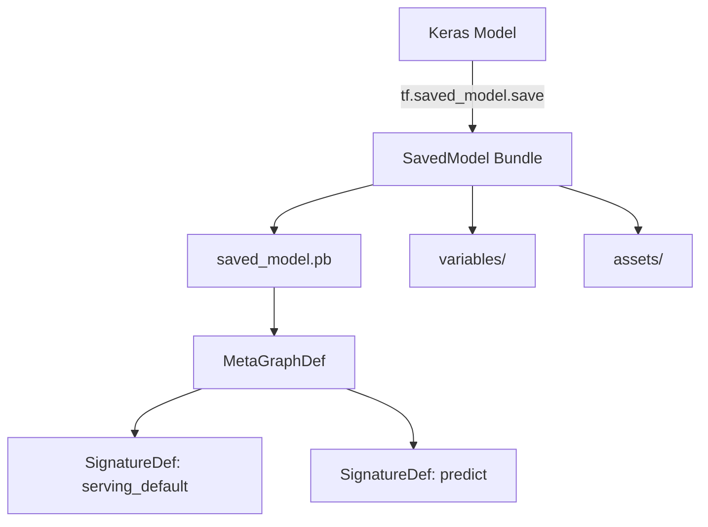
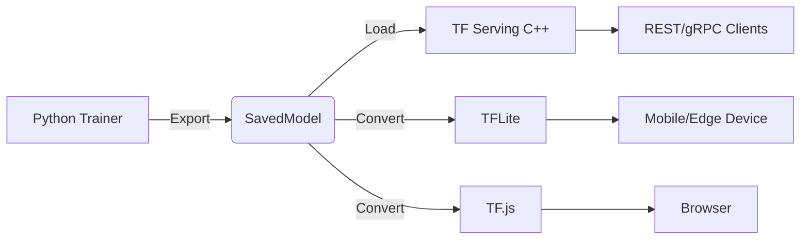
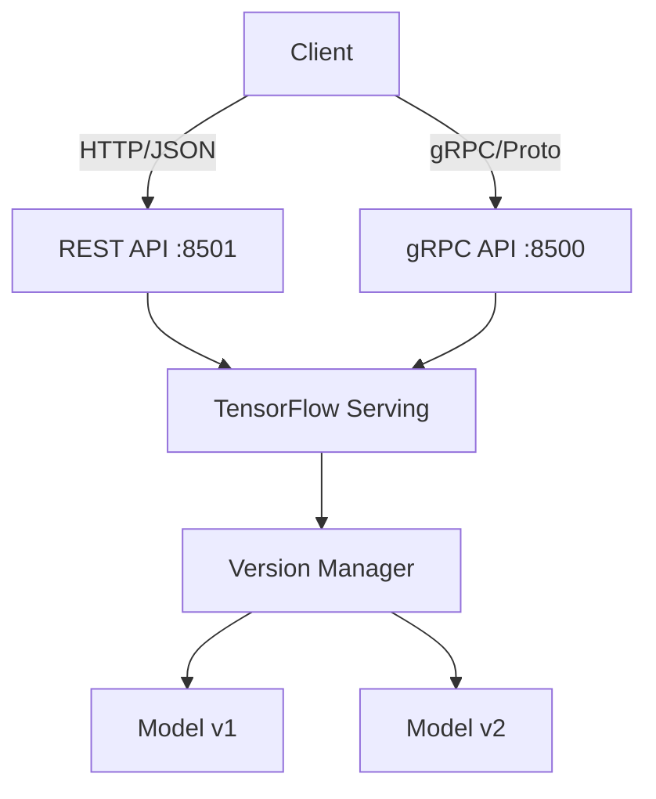
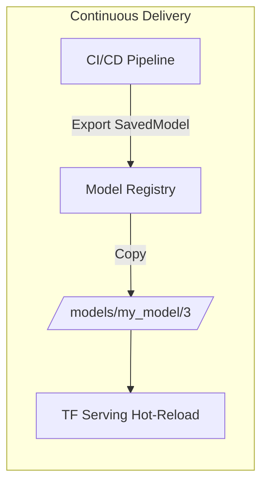
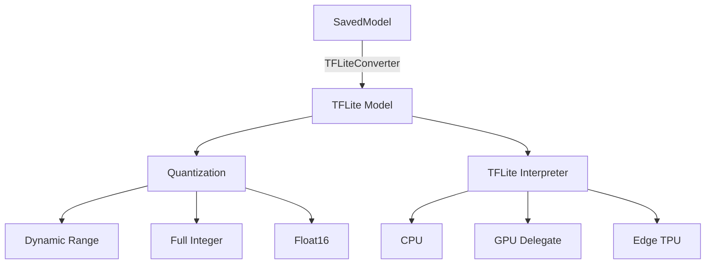
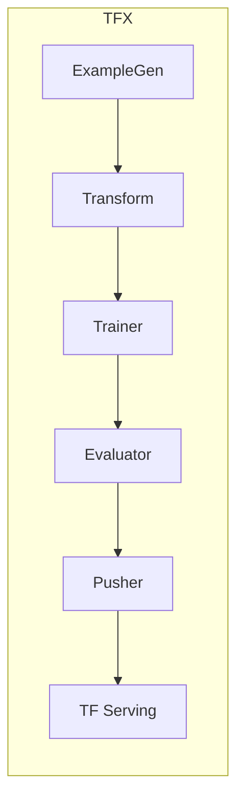

# 🏷️ 05 - TensorFlow Production Ecosystem

## 🎯 Learning Objectives
- Understand the SavedModel format, its directory structure, and signature definitions.
- Save and load models using `tf.saved_model` APIs with explicit signatures.
- Deploy models with TensorFlow Serving via REST and gRPC APIs.
- Convert trained models to TensorFlow Lite with post-training and quantization-aware techniques.
- Export Keras models to TensorFlow.js for browser inference.
- Apply `tf.Transform` for consistent preprocessing across training and serving.
- Map TFX pipeline concepts to the broader MLOps lifecycle.

## Introduction
A trained model in a Jupyter notebook has zero business value until it serves predictions in production. The gap between research artifact and production system is where most ML projects fail. TensorFlow's production ecosystem provides a standardized, language-agnostic serialization format (SavedModel), a high-performance serving system (TF Serving), and lightweight runtimes for edge and mobile (TFLite). Together, these tools form a continuum from data-center GPU clusters to microcontroller inference, all sharing the same core graph representation.

This module is the bridge between model training and the MLOps practices covered in [[09 - MLOps y Produccion]], the distributed infrastructure topics in [[10 - Cloud, Infra y Backend/29 - Distributed ML Infrastructure/00 - Welcome]], and the system design principles in [[10 - Cloud, Infra y Backend/32 - System Design for ML/02 - System Design for ML]]. While [[05 - Deep Learning y Computer Vision/03 - Deep Learning con PyTorch/00 - Bienvenida]] covers PyTorch deployment via TorchScript and ONNX, this note focuses on the TensorFlow-native path.

---

## Module 1: SavedModel Format and Signatures

### 1.1 Theoretical Foundation 🧠

Before SavedModel, TensorFlow used checkpoints—raw variable dumps that required the original Python code to reconstruct the graph. This was fragile: a refactor in layer naming or a version mismatch between training and serving code could render a multi-day training run unloadable. SavedModel solves this by bundling the complete TensorFlow program: the graph definition, variable values, and metadata about how to invoke the model.

The design is inspired by language-agnostic serialization formats like Protocol Buffers and ONNX. A SavedModel directory contains a `saved_model.pb` file (the serialized MetaGraph), a `variables/` directory holding sharded checkpoints, and an optional `assets/` directory for vocabularies or lookup tables. The critical abstraction is the **signature**: a named set of input and output tensors that defines a callable interface. This allows a model trained in Python to be loaded in C++, Java, or Go without any source code dependency. Signatures like `serving_default`, `predict`, `classify`, and `regress` standardize the contract between model producer and consumer.

### 1.2 Mental Model 📐

```
┌─────────────────────────────────────────────┐
│           SavedModel Directory              │
├─────────────────────────────────────────────┤
│  saved_model.pb                             │
│  ├─ MetaGraphDef                            │
│  │  ├─ graph_def (ops & edges)              │
│  │  ├─ signature_def                        │
│  │  │  ├─ serving_default                   │
│  │  │  │  ├─ inputs:  x -> TensorInfo       │
│  │  │  │  └─ outputs: predictions -> TensorInfo│
│  │  │  └─ predict                           │
│  │  └─ asset_file_def                        │
│  variables/                                 │
│  ├─ variables.data-00000-of-00001           │
│  └─ variables.index                         │
│  assets/                                    │
│  └─ vocab.txt (optional)                    │
└─────────────────────────────────────────────┘
```

```
┌─────────────────────────────────────────────┐
│        Signature as API Contract            │
├─────────────────────────────────────────────┤
│  Client Request                             │
│     {"instances": [[1.0, 2.0]]}             │
│              │                                │
│              ▼                                │
│  SignatureDef: serving_default              │
│     input:  tf.TensorSpec(shape=(None,2))   │
│     output: tf.TensorSpec(shape=(None,10))  │
│              │                                │
│              ▼                                │
│  Model Graph Execution                      │
└─────────────────────────────────────────────┘
```

```
┌─────────────────────────────────────────────┐
│   Training Artifact ──► Production Asset    │
├─────────────────────────────────────────────┤
│  Python Keras Model                         │
│     │                                       │
│     ▼ tf.saved_model.save()                 │
│  SavedModel (lang-agnostic)                 │
│     │                                       │
│     ├─► TF Serving (data center)            │
│     ├─► TFLite Converter (mobile/edge)      │
│     └─► TF.js Converter (browser)           │
└─────────────────────────────────────────────┘
```

### 1.3 Syntax and Semantics 📝

```python
import tensorflow as tf
from tensorflow import keras

# ------------------------------------------------------------------
# 1. Train a simple model
# ------------------------------------------------------------------
model = keras.Sequential([
    keras.layers.Dense(64, activation='relu', input_shape=(10,)),
    keras.layers.Dense(10, activation='softmax')
])
model.compile(optimizer='adam', loss='categorical_crossentropy', metrics=['accuracy'])
# ... train ...

# ------------------------------------------------------------------
# 2. Save with explicit signature
# WHY: Explicit signatures define the API contract for serving.
#      Without them, TF Serving may infer a suboptimal signature.
# ------------------------------------------------------------------
@tf.function(input_signature=[tf.TensorSpec(shape=[None, 10], dtype=tf.float32, name='inputs')])
def serve_fn(inputs):
    # WHY: wrapping in @tf.function traces the graph and freezes dtypes/shapes
    return {'predictions': model(inputs, training=False)}

tf.saved_model.save(
    model,
    export_dir='./my_saved_model',
    signatures={'serving_default': serve_fn}
)

# ------------------------------------------------------------------
# 3. Load and inspect
# WHY: Production systems load SavedModels in C++/Java; Python inspection
#      verifies that signatures and variables are intact.
# ------------------------------------------------------------------
loaded = tf.saved_model.load('./my_saved_model')
print(list(loaded.signatures.keys()))  # ['serving_default']

infer = loaded.signatures['serving_default']
print(infer.structured_input_signature)
print(infer.structured_outputs)

# Direct inference
sample = tf.constant([[1.0]*10], dtype=tf.float32)
result = infer(inputs=sample)
print(result['predictions'])
```

### 1.4 Visual Representation 🖼️






### 1.5 Application in ML/AI Systems 🤖

| ML Use Case | This Concept | Impact |
|-------------|-------------|--------|
| Real case: Google Cloud AI Platform | SavedModel as the required upload format | Enables zero-code deployment from training to serving endpoints |
| Real case: Uber | Signature versioning for ranking models | Rollback to previous signature within seconds during incidents |
| Edge ML | TFLite conversion from SavedModel | Deploys identical model logic to Raspberry Pi and data-center GPU |

### 1.6 Common Pitfalls ⚠️

⚠️ **Pitfall**: Saving a Keras model with `model.save('path')` inside a training script that has custom layers or loss functions, then attempting to load it in a different Python environment where those classes are undefined.
💡 **Tip**: Use `tf.saved_model.save()` for serving exports (no code dependency) and `model.save('path.keras')` only when the identical Python environment is guaranteed.

⚠️ **Pitfall**: Forgetting `training=False` inside a `@tf.function` serving signature causes dropout and batch normalization to behave incorrectly at inference time.
💡 **Tip**: Always pass `training=False` explicitly in serving functions, or use `model.call()` with the training argument defaulted to `False`.

### 1.7 Knowledge Check ❓

1. What are the three files/directories inside a SavedModel bundle and what does each contain?
2. Write a `@tf.function` signature that accepts a batch of string tensors and returns embedding vectors.
3. Why is `saved_model.pb` sufficient for inference even if the original `.py` files are lost?

---

## Module 2: TensorFlow Serving

### 2.1 Theoretical Foundation 🧠

TensorFlow Serving (TFS) is a flexible, high-performance serving system for machine learning models designed for production environments. It was open-sourced by Google to solve the problem of deploying and versioning models at scale. Unlike Flask or FastAPI wrappers around `model.predict()`, TFS is written in C++ and optimized for throughput, supporting batching, model versioning, and A/B testing out of the box.

The architecture separates the **model lifecycle manager** (loads/unloads versions) from the **inference core** (executes graphs). Clients communicate via REST (easy debugging) or gRPC (higher performance, lower latency). TFS discovers models by monitoring a file system path, enabling seamless hot-swapping: drop a new SavedModel into a versioned subdirectory, and TFS automatically routes traffic to it. This design is the foundation of continuous delivery for ML, connecting directly to pipeline orchestrators like TFX and Kubeflow.

### 2.2 Mental Model 📐

```
┌─────────────────────────────────────────────┐
│         TensorFlow Serving Architecture       │
├─────────────────────────────────────────────┤
│                                              │
│  Model Base Path                             │
│  /models/my_model/                           │
│  ├─ 1/ (SavedModel v1)                       │
│  └─ 2/ (SavedModel v2)  ◄── active           │
│                                              │
│  TFS Loader ──► Version Policy ──► Servable  │
│       │              │                         │
│       └──────────────┘                         │
│              ▼                                │
│  ┌─────────────────────┐                     │
│  │  Batcher            │                     │
│  │  REST API :8501     │                     │
│  │  gRPC API :8500     │                     │
│  └─────────────────────┘                     │
│                                              │
└─────────────────────────────────────────────┘
```

```
┌─────────────────────────────────────────────┐
│           Request Routing                     │
├─────────────────────────────────────────────┤
│  Client                                      │
│    ├─ /v1/models/my_model:predict           │
│    ├─ /v1/models/my_model/versions/1:predict│
│    └─ /v1/models/my_model/labels/stable:predict│
│              │                                │
│              ▼                                │
│  TFS Servable Handle ──► SessionRun         │
└─────────────────────────────────────────────┘
```

```
┌─────────────────────────────────────────────┐
│        Batching Strategy                    │
├─────────────────────────────────────────────┤
│  Request 1 ──┐                               │
│  Request 2 ──┼─► Batcher Queue ──► Batch    │
│  Request 3 ──┘   (max_batch_size,           │
│                   batch_timeout_micros)      │
└─────────────────────────────────────────────┘
```

### 2.3 Syntax and Semantics 📝

```bash
# ------------------------------------------------------------------
# 1. Start TensorFlow Serving with Docker
# WHY: Docker encapsulates TFS dependencies and exposes
#      standardized ports for REST (8501) and gRPC (8500).
# ------------------------------------------------------------------
docker run -p 8501:8501 -p 8500:8500 \
  --mount type=bind,source=/path/to/my_model,target=/models/my_model \
  -e MODEL_NAME=my_model \
  -t tensorflow/serving:latest

# ------------------------------------------------------------------
# 2. REST API prediction
# WHY: REST is language-agnostic and easy to debug with curl.
# ------------------------------------------------------------------
curl -X POST http://localhost:8501/v1/models/my_model:predict \
  -H 'Content-Type: application/json' \
  -d '{"instances": [[1.0, 2.0, 3.0, ...]]}'

# ------------------------------------------------------------------
# 3. gRPC client (Python) for low-latency production
# WHY: gRPC avoids JSON serialization overhead and supports
#      streaming, making it ideal for high-QPS services.
# ------------------------------------------------------------------
import grpc
import tensorflow as tf
from tensorflow_serving.apis import predict_pb2, prediction_service_pb2_grpc

channel = grpc.insecure_channel('localhost:8500')
stub = prediction_service_pb2_grpc.PredictionServiceStub(channel)

request = predict_pb2.PredictRequest()
request.model_spec.name = 'my_model'
request.model_spec.signature_name = 'serving_default'
request.inputs['inputs'].CopyFrom(
    tf.make_tensor_proto([[1.0]*10], shape=[1, 10], dtype=tf.float32)
)

response = stub.Predict(request, timeout=10.0)
print(response.outputs['predictions'])
```

### 2.4 Visual Representation 🖼️






### 2.5 Application in ML/I Systems 🤖

| ML Use Case | This Concept | Impact |
|-------------|-------------|--------|
| Real case: Airbnb | TFS with batching for listing ranking | 3x throughput improvement over unbatched Flask serving |
| Real case: LinkedIn | gRPC + model versioning for feed ranking | Zero-downtime model updates with canary deployments |
| Edge serving | TFS on Kubernetes with HPA | Auto-scales inference pods based on request queue depth |

### 2.6 Common Pitfalls ⚠️

⚠️ **Pitfall**: Using the REST API under high load without batching causes GPU underutilization and latency spikes.
💡 **Tip**: Enable `batching_parameters_config` in TFS or switch to gRPC with client-side batching.

⚠️ **Pitfall**: Exposing TFS directly to the public internet without authentication or rate limiting.
💡 **Tip**: Place TFS behind a reverse proxy (Envoy/Nginx) or API gateway with auth, logging, and rate limiting.

### 2.7 Knowledge Check ❓

1. What are the trade-offs between REST and gRPC APIs in TFS?
2. Write a `model_config_list` protobuf configuration that serves two models (`model_a`, `model_b`) with version policies.
3. How does TFS handle a new SavedModel version dropped into the model base path while requests are in flight?

---

## Module 3: TFLite, TF.js, and TFX Overview

### 3.1 Theoretical Foundation 🧠

Not all inference happens in data centers. Mobile apps, browsers, microcontrollers, and IoT devices demand models that are small, fast, and hardware-agnostic. TensorFlow Lite (TFLite) addresses this by converting SavedModels into a flatbuffer format optimized for on-device execution, with interpreters written in C++ and Java. It supports acceleration via delegates (GPU, NNAPI, CoreML) and quantization to reduce model size and latency at the cost of minor accuracy degradation.

TensorFlow.js extends this ecosystem to JavaScript environments, enabling training and inference in browsers and Node.js. TF Transform (`tft`) ensures that preprocessing logic (tokenization, normalization) is executed identically during training and serving by compiling transformations into the TensorFlow graph. Finally, TFX (TensorFlow Extended) orchestrates the end-to-end ML pipeline: data validation, transformation, training, evaluation, and serving deployment, embodying the principles of MLOps.

### 3.2 Mental Model 📐

```
┌─────────────────────────────────────────────┐
│         TensorFlow Lite Pipeline            │
├─────────────────────────────────────────────┤
│                                              │
│  SavedModel                                  │
│     │                                        │
│     ▼ TFLiteConverter                        │
│  FlatBuffer (.tflite)                        │
│     │                                        │
│     ├─► Post-training quantization           │
│     ├─► Quantization-aware training          │
│     └─► Float16 / Full-integer               │
│              │                                │
│              ▼                                │
│  TFLite Interpreter (C++/Java/Python)        │
│     ├─► CPU                                  │
│     ├─► GPU Delegate                         │
│     └─► NNAPI / CoreML                       │
│                                              │
└─────────────────────────────────────────────┘
```

```
┌─────────────────────────────────────────────┐
│      Training/Serving Skew Prevention        │
├─────────────────────────────────────────────┤
│  Raw Data                                    │
│     │                                        │
│     ▼ tf.Transform                           │
│  Preprocessing Graph                         │
│     ├─► Saved as TF graph (training)        │
│     └─► Run in TF Serving (inference)       │
│              │                                │
│              ▼                                │
│  Zero skew: same code path                   │
└─────────────────────────────────────────────┘
```

```
┌─────────────────────────────────────────────┐
│           TFX Pipeline Stages               │
├─────────────────────────────────────────────┤
│  ExampleGen ──► StatisticsGen ──► SchemaGen │
│       │                                        │
│       ▼                                        │
│  Transform ──► Trainer ──► Tuner              │
│       │                                        │
│       ▼                                        │
│  Evaluator ──► Pusher ──► Serving             │
└─────────────────────────────────────────────┘
```

### 3.3 Syntax and Semantics 📝

```python
import tensorflow as tf

# ------------------------------------------------------------------
# 1. TFLite Conversion with Post-Training Quantization
# WHY: Quantization reduces model size by ~4x and speeds up
#      CPU inference by using INT8 arithmetic.
# ------------------------------------------------------------------
converter = tf.lite.TFLiteConverter.from_saved_model('./my_saved_model')

# Dynamic range quantization (weights to int8, activations float32)
converter.optimizations = [tf.lite.Optimize.DEFAULT]

# Full integer quantization (requires representative dataset)
# WHY: Necessary for Edge TPU and some mobile NNAPI delegates.
def representative_dataset():
    for _ in range(100):
        data = tf.random.normal([1, 10])
        yield [data]

# converter.representative_dataset = representative_dataset
# converter.target_spec.supported_ops = [tf.lite.OpsSet.TFLITE_BUILTINS_INT8]

tflite_model = converter.convert()
with open('model_quantized.tflite', 'wb') as f:
    f.write(tflite_model)

# ------------------------------------------------------------------
# 2. TF.js Export
# WHY: Enables browser-based inference without backend round-trips.
# ------------------------------------------------------------------
# In shell:
# tensorflowjs_converter \
#   --input_format=keras \
#   --output_format=tfjs_graph_model \
#   ./model.keras \
#   ./tfjs_model

# ------------------------------------------------------------------
# 3. TF Transform (tft) for preprocessing
# WHY: Preprocessing must be part of the graph to avoid
#      training-serving skew.
# ------------------------------------------------------------------
import tensorflow_transform as tft

def preprocessing_fn(inputs):
    x = inputs['x']
    # WHY: compute mean/variance over the entire dataset, not batch
    x_normalized = tft.scale_to_z_score(x)
    return {'x_normalized': x_normalized}
```

### 3.4 Visual Representation 🖼️






### 3.5 Application in ML/AI Systems 🤖

| ML Use Case | This Concept | Impact |
|-------------|-------------|--------|
| Real case: Google Lens | TFLite on Android with NNAPI delegate | Real-time object recognition at 30 FPS on mid-range phones |
| Real case: Spotify | TF.js for browser-based audio features | Client-side inference reduces server load for playlist generation previews |
| Real case: Twitter | TFX pipelines for timeline ranking | Automated retraining and deployment reduced model staleness from days to hours |

### 3.6 Common Pitfalls ⚠️

⚠️ **Pitfall**: Applying post-training quantization to a model with sensitive outputs (e.g., softmax probabilities) without calibration can cause severe accuracy drops.
💡 **Tip**: Always evaluate the quantized model on a held-out test set; use quantization-aware training (QAT) if accuracy degradation exceeds 1%.

⚠️ **Pitfall**: Using unsupported TensorFlow ops in a model destined for TFLite causes conversion failures.
💡 **Tip**: Run `converter.target_spec.supported_ops = [tf.lite.OpsSet.TFLITE_BUILTINS]` to fail fast on unsupported ops, or use SELECT_TF_OPS as a fallback with increased binary size.

### 3.7 Knowledge Check ❓

1. When is full-integer quantization required instead of dynamic-range quantization?
2. Write a shell command to convert a Keras model to TF.js Layers format.
3. Why does `tft.scale_to_z_score` prevent training-serving skew compared to manual `StandardScaler` in scikit-learn?

---

## 📦 Compression Code

```python
"""
Compression: TensorFlow Production Ecosystem
Save, serve, convert, and deploy a Keras model end-to-end.
"""
import tensorflow as tf
from tensorflow import keras

# Train
model = keras.Sequential([
    keras.layers.Dense(64, activation='relu', input_shape=(10,)),
    keras.layers.Dense(10, activation='softmax')
])
model.compile(optimizer='adam', loss='categorical_crossentropy', metrics=['accuracy'])
# model.fit(...)

# SaveModel with signature
@tf.function(input_signature=[tf.TensorSpec([None, 10], tf.float32, name='inputs')])
def serve(inputs):
    return {'outputs': model(inputs, training=False)}

tf.saved_model.save(model, './saved_model', signatures={'serving_default': serve})

# Load and verify
loaded = tf.saved_model.load('./saved_model')
print(loaded.signatures.keys())

# TFLite conversion
converter = tf.lite.TFLiteConverter.from_saved_model('./saved_model')
converter.optimizations = [tf.lite.Optimize.DEFAULT]
tflite_model = converter.convert()
with open('model.tflite', 'wb') as f:
    f.write(tflite_model)

# TF.js export (run in shell):
# tensorflowjs_converter --input_format=keras --output_format=tfjs_graph_model model.keras tfjs_model/

print("Production artifacts generated: SavedModel, TFLite, TF.js command ready.")
```

## 🎯 Documented Project

### Description
Take a trained image classification model and build a complete production deployment pipeline: export to SavedModel with signatures, serve via TensorFlow Serving in Docker, convert to quantized TFLite for mobile, and export to TF.js for a browser demo.

### Functional Requirements
- Export a Keras model to SavedModel with at least two signatures (`serving_default` and `predict`).
- Deploy the SavedModel with `tensorflow/serving` Docker container and test with both `curl` (REST) and a Python gRPC client.
- Convert the SavedModel to TFLite with post-training dynamic-range quantization and measure size reduction.
- Document the TFX pipeline stages that would automate this workflow.

### Main Components
- `export.py`: model training, signature definition, and SavedModel export.
- `serve_test.py`: gRPC client and REST smoke tests.
- `convert_tflite.py`: TFLite conversion with optimization flags.
- `docker-compose.yml`: TFS service with volume-mounted model.
- `README.md`: deployment and testing instructions.

### Success Metrics
- REST API returns predictions in <50ms p99 latency on local CPU.
- TFLite model is <25% of the original SavedModel size.
- gRPC client successfully queries all model signatures.
- Zero manual preprocessing mismatch between training and serving.

## 🎯 Key Takeaways
- SavedModel is the canonical TensorFlow serialization format: language-agnostic, signature-based, and self-contained.
- Always define explicit `SignatureDef` objects so serving systems know exact input/output shapes and names.
- TensorFlow Serving provides production-grade model serving with versioning, batching, and hot-reloading; prefer gRPC for latency-sensitive workloads.
- TFLite enables edge deployment through flatbuffer conversion and quantization; choose dynamic-range, float16, or full-integer based on hardware constraints.
- TF Transform embeds preprocessing into the graph, eliminating training-serving skew—a leading cause of production model degradation.
- TFX pipelines standardize the path from raw data to served model, integrating validation, transformation, tuning, and deployment.
- In PyTorch, `torch.jit.script` traces models for C++ deployment but lacks the standardized directory format of SavedModel; ONNX serves as the cross-framework bridge instead.

## References
- [TensorFlow SavedModel Guide](https://www.tensorflow.org/guide/saved_model)
- [TensorFlow Serving Documentation](https://www.tensorflow.org/tfx/serving/serving_config)
- [TensorFlow Lite Guide](https://www.tensorflow.org/lite/guide)
- [TensorFlow.js Converter](https://www.tensorflow.org/js/guide/conversion)
- [TF Transform Documentation](https://www.tensorflow.org/tfx/transform/get_started)
- [TFX Pipeline Overview](https://www.tensorflow.org/tfx/guide)
