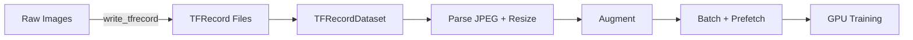
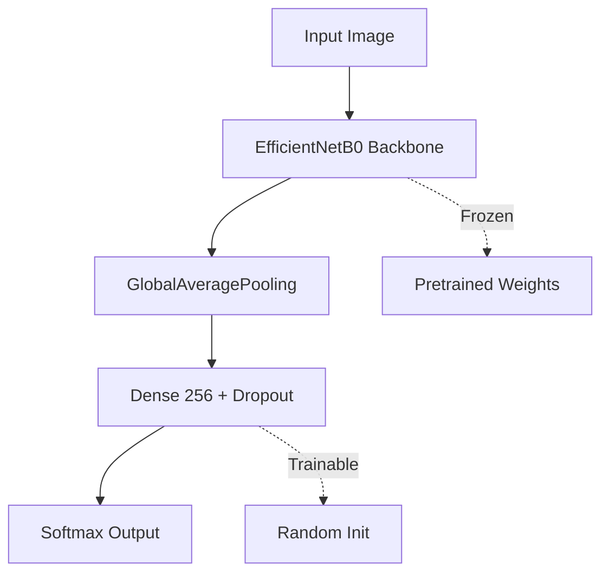
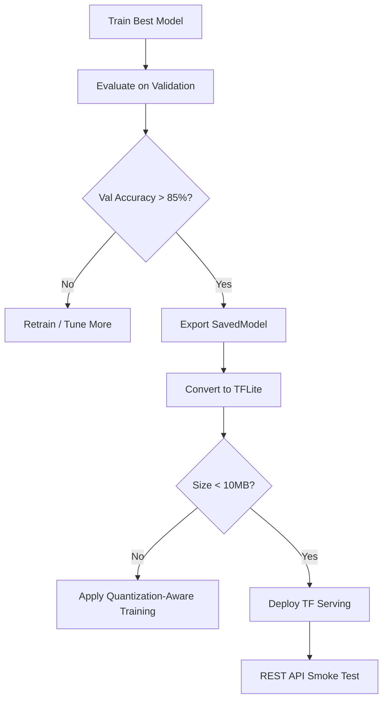

# 🏷️ 06 - Capstone - End-to-End Computer Vision with TensorFlow

## 🎯 Learning Objectives
- Engineer a complete `tf.data` pipeline including TFRecord conversion and on-the-fly augmentation.
- Implement transfer learning with `tf.keras.applications.EfficientNetB0` and a custom classification head.
- Scale training across multiple GPUs using `tf.distribute.MirroredStrategy` and mixed precision.
- Integrate callbacks (`EarlyStopping`, `ModelCheckpoint`, `TensorBoard`) into a distributed training loop.
- Automate hyperparameter tuning with KerasTuner `Hyperband` for learning rate and dropout.
- Evaluate models with confusion matrices and per-class metrics.
- Export to SavedModel and convert to quantized TFLite under size constraints.
- Deploy locally with TensorFlow Serving via Docker and test with REST API.
- Orchestrate the full stack with Docker Compose.

## Introduction
This capstone integrates every concept from the preceding modules into a single, production-grade computer vision pipeline. Computer vision remains one of the most deployed deep learning domains, powering applications from medical imaging to autonomous navigation. Building a robust CV system requires more than a pretrained network: it demands efficient data loading, distributed training, systematic tuning, rigorous evaluation, and a clean deployment path to serving infrastructure.

This project connects to [[10 - Cloud, Infra y Backend/29 - Distributed ML Infrastructure/00 - Welcome]] for distributed strategy details, [[09 - MLOps y Produccion]] for pipeline automation, and [[10 - Cloud, Infra y Backend/32 - System Design for ML/02 - System Design for ML]] for serving architecture. The PyTorch equivalent patterns are noted where relevant for engineers working across frameworks, following the vault's coverage in [[05 - Deep Learning y Computer Vision/03 - Deep Learning con PyTorch/00 - Bienvenida]].

---

## Module 1: Data Pipeline and TFRecords

### 1.1 Theoretical Foundation 🧠

Loading thousands of individual image files from disk during training creates an I/O bottleneck that leaves the GPU idle for significant portions of each epoch. TFRecord is a binary format that serializes data as protocol buffers, enabling sequential reads that are orders of magnitude faster than random file system access. Combined with `tf.data`, TFRecords support prefetching, parallel mapping, and caching, transforming data loading from a bottleneck into a background operation.

The design philosophy of `tf.data` is declarative: you define a graph of transformations (`map`, `batch`, `prefetch`) and the runtime optimizes their execution. Augmentation is applied inside this graph via `tf.image` operations, ensuring that the CPU performs preprocessing while the GPU trains on the previous batch.

### 1.2 Mental Model 📐

```
┌─────────────────────────────────────────────┐
│           tf.data Pipeline Flow             │
├─────────────────────────────────────────────┤
│  TFRecord Files                             │
│     │                                       │
│     ▼ tf.data.TFRecordDataset               │
│  Serialized Examples                        │
│     │                                       │
│     ▼ .map(parse_fn, num_parallel_calls)    │
│  Decoded (image, label)                     │
│     │                                       │
│     ▼ .map(augment_fn)                      │
│  Augmented (random flip, rotate, jitter)    │
│     │                                       │
│     ▼ .batch(32).prefetch(tf.data.AUTOTUNE) │
│  Ready Batches ──► GPU                      │
└─────────────────────────────────────────────┘
```

```
┌─────────────────────────────────────────────┐
│        Augmentation Graph (per image)       │
├─────────────────────────────────────────────┤
│  Input Image                                 │
│     ├─► RandomFlip("horizontal")            │
│     ├─► RandomRotation(0.1)                 │
│     ├─► RandomContrast(0.2)                 │
│     └─► RandomZoom(0.1)                     │
│              │                                │
│              ▼                                │
│  Augmented Image ──► Normalize ──► Model    │
└─────────────────────────────────────────────┘
```

### 1.3 Syntax and Semantics 📝

```python
import tensorflow as tf
import os

IMG_SIZE = 224
BATCH_SIZE = 32
AUTOTUNE = tf.data.AUTOTUNE

# ------------------------------------------------------------------
# 1. Write TFRecords
# WHY: Binary serialization eliminates per-file Python overhead
#      and enables fast sequential reads from disk/SSD.
# ------------------------------------------------------------------
def _bytes_feature(value):
    return tf.train.Feature(bytes_list=tf.train.BytesList(value=[value]))

def _int64_feature(value):
    return tf.train.Feature(int64_list=tf.train.Int64List(value=[value]))

def write_tfrecord(image_paths, labels, output_file):
    with tf.io.TFRecordWriter(output_file) as writer:
        for path, label in zip(image_paths, labels):
            image_string = open(path, 'rb').read()
            feature = {
                'image': _bytes_feature(image_string),
                'label': _int64_feature(label),
            }
            example = tf.train.Example(features=tf.train.Features(feature=feature))
            writer.write(example.SerializeToString())

# ------------------------------------------------------------------
# 2. Parse and augment
# WHY: parse_fn decodes JPEG and casts labels inside the tf.data
#      graph so Python is never in the hot loop.
# ------------------------------------------------------------------
def parse_example(serialized):
    feature_description = {
        'image': tf.io.FixedLenFeature([], tf.string),
        'label': tf.io.FixedLenFeature([], tf.int64),
    }
    parsed = tf.io.parse_single_example(serialized, feature_description)
    image = tf.io.decode_jpeg(parsed['image'], channels=3)
    image = tf.image.resize(image, [IMG_SIZE, IMG_SIZE])
    image = tf.cast(image, tf.float32) / 255.0
    label = tf.cast(parsed['label'], tf.int32)
    return image, label

def augment(image, label):
    # WHY: random augmentation inside tf.data ensures diversity
    #      without storing augmented copies on disk.
    image = tf.image.random_flip_left_right(image)
    image = tf.image.random_brightness(image, max_delta=0.2)
    image = tf.image.random_contrast(image, lower=0.8, upper=1.2)
    image = tf.clip_by_value(image, 0.0, 1.0)  # WHY: preserve valid pixel range
    return image, label

def build_dataset(tfrecord_path, batch_size=BATCH_SIZE, shuffle=True):
    ds = tf.data.TFRecordDataset(tfrecord_path, num_parallel_reads=AUTOTUNE)
    ds = ds.map(parse_example, num_parallel_calls=AUTOTUNE)
    ds = ds.map(augment, num_parallel_calls=AUTOTUNE)
    if shuffle:
        ds = ds.shuffle(1000)
    ds = ds.batch(batch_size)
    ds = ds.prefetch(AUTOTUNE)  # WHY: overlaps preprocessing and training
    return ds
```

### 1.4 Visual Representation 🖼️




### 1.5 Application in ML/AI Systems 🤖

| ML Use Case | This Concept | Impact |
|-------------|-------------|--------|
| Real case: Google Photos | TFRecord pipelines for billions of images | Scales training without storage bottlenecks |
| Real case: Tesla | `tf.data` + augmentation for autopilot cameras | 10x throughput improvement over PIL-based loaders |
| Medical imaging | TFRecords for DICOM-derived images | Ensures patient-level shuffling and deterministic splits |

### 1.6 Common Pitfalls ⚠️

⚠️ **Pitfall**: Applying `tf.data.Dataset.shuffle()` after `.batch()` shuffles batches, not individual examples, destroying randomization quality.
💡 **Tip**: Always shuffle before batching, with a buffer size at least equal to the number of examples in a typical epoch.

⚠️ **Pitfall**: Using Python `open()` inside `tf.data.Dataset.map()` via `tf.py_function` destroys parallelism because Python calls hold the GIL.
💡 **Tip**: Decode bytes inside the TensorFlow graph (e.g., `tf.io.decode_jpeg`) or pre-serialize everything into TFRecords.

### 1.7 Knowledge Check ❓

1. Why is `prefetch(tf.data.AUTOTUNE)` preferred over a hardcoded buffer size?
2. Write a `parse_example` function that also parses and returns an `image_id` string feature.
3. How would you cache the parsed dataset to memory if it fits, and what are the trade-offs?

---

## Module 2: Transfer Learning and Distributed Training

### 2.1 Theoretical Foundation 🧠

Training a deep convolutional network from scratch requires millions of labeled images and weeks of GPU time. Transfer learning leverages representations learned on large datasets (typically ImageNet) by freezing the convolutional backbone and training only a task-specific classification head.

EfficientNetB0 is a compound-scaled architecture that balances depth, width, and resolution via a single coefficient, achieving state-of-the-art accuracy with far fewer parameters than ResNet or VGG. When scaling to multiple GPUs, `MirroredStrategy` replicates the model on each device, synchronizes gradients via all-reduce, and presents a single-device abstraction to the user. Mixed precision (`tf.keras.mixed_precision`) accelerates training by using float16 for matrix multiplications while keeping float32 master weights for numerical stability.

### 2.2 Mental Model 📐

```
┌─────────────────────────────────────────────┐
│     Transfer Learning Architecture          │
├─────────────────────────────────────────────┤
│  EfficientNetB0 (ImageNet)                   │
│  ├─ Block 1..7  ◄── FROZEN (pretrained)    │
│  └─ GlobalAveragePooling2D                   │
│         │                                    │
│         ▼                                    │
│  Custom Head (TRAINABLE)                     │
│  ├─ Dense(256, relu)                         │
│  ├─ Dropout(0.5)                             │
│  └─ Dense(num_classes, softmax)              │
└─────────────────────────────────────────────┘
```

```
┌─────────────────────────────────────────────┐
│        MirroredStrategy All-Reduce          │
├─────────────────────────────────────────────┤
│  GPU 0 ──► Gradients ──┐                    │
│  GPU 1 ──► Gradients ──┼─► All-Reduce ──►  │
│  GPU 2 ──► Gradients ──┤     Mean          │
│  GPU 3 ──► Gradients ──┘                    │
│         ▼                                   │
│  Optimizer applies averaged gradients       │
└─────────────────────────────────────────────┘
```

### 2.3 Syntax and Semantics 📝

```python
import tensorflow as tf
from tensorflow import keras

NUM_CLASSES = 10
IMG_SIZE = 224

# ------------------------------------------------------------------
# 1. Mixed precision setup
# WHY: float16 matmuls are ~2x faster on Tensor Cores; float32
#      master weights prevent gradient underflow.
# ------------------------------------------------------------------
tf.keras.mixed_precision.set_global_policy('mixed_float16')

# ------------------------------------------------------------------
# 2. MirroredStrategy scope
# WHY: Variables and model creation must happen INSIDE the strategy
#      scope so they are mirrored across GPUs correctly.
# ------------------------------------------------------------------
strategy = tf.distribute.MirroredStrategy()
print(f'Number of devices: {strategy.num_replicas_in_sync}')

with strategy.scope():
    base_model = keras.applications.EfficientNetB0(
        weights='imagenet',
        include_top=False,       # WHY: discard ImageNet head
        input_shape=(IMG_SIZE, IMG_SIZE, 3)
    )
    base_model.trainable = False  # WHY: freeze backbone for initial training

    inputs = keras.Input(shape=(IMG_SIZE, IMG_SIZE, 3))
    x = base_model(inputs, training=False)
    x = keras.layers.GlobalAveragePooling2D()(x)
    x = keras.layers.Dense(256, activation='relu')(x)
    x = keras.layers.Dropout(0.5)(x)
    outputs = keras.layers.Dense(NUM_CLASSES, activation='softmax', dtype='float32')(x)
    # WHY: output layer stays float32 for numerical stability with softmax

    model = keras.Model(inputs, outputs)
    model.compile(
        optimizer=keras.optimizers.Adam(learning_rate=1e-3),
        loss='sparse_categorical_crossentropy',
        metrics=['accuracy']
    )

# ------------------------------------------------------------------
# 3. Callbacks
# WHY: In distributed training, only the chief worker should write
#      checkpoints and logs to avoid file corruption.
# ------------------------------------------------------------------
callbacks = [
    keras.callbacks.EarlyStopping(monitor='val_accuracy', patience=5, restore_best_weights=True),
    keras.callbacks.ModelCheckpoint('best_efficientnet.keras', save_best_only=True, monitor='val_accuracy'),
    keras.callbacks.TensorBoard(log_dir='./logs/capstone', histogram_freq=1),
    keras.callbacks.TerminateOnNaN()
]

# model.fit(train_ds, validation_data=val_ds, epochs=50, callbacks=callbacks)

# ------------------------------------------------------------------
# 4. Fine-tuning: unfreeze top layers
# WHY: After the head converges, unfreeze the top 20 layers with
#      a lower LR to adapt high-level features without destroying them.
# ------------------------------------------------------------------
base_model.trainable = True
for layer in base_model.layers[:-20]:
    layer.trainable = False

with strategy.scope():
    model.compile(
        optimizer=keras.optimizers.Adam(learning_rate=1e-5),  # WHY: 10-100x lower LR
        loss='sparse_categorical_crossentropy',
        metrics=['accuracy']
    )
# model.fit(train_ds, validation_data=val_ds, epochs=20, callbacks=callbacks)
```

### 2.4 Visual Representation 🖼️




### 2.5 Application in ML/AI Systems 🤖

| ML Use Case | This Concept | Impact |
|-------------|-------------|--------|
| Real case: Airbnb | EfficientNet transfer learning for listing photos | 94% accuracy with only 50k labeled images vs 10M for scratch training |
| Real case: Uber | `MirroredStrategy` on 8xV100 for map segmentation | Reduced training time from 5 days to 16 hours |
| Real case: OpenAI | Mixed precision for CLIP training | 3x throughput improvement with no measurable accuracy loss |

### 2.6 Common Pitfalls ⚠️

⚠️ **Pitfall**: Unfreezing the entire backbone and fine-tuning with the original head learning rate destroys pretrained features within the first few batches.
💡 **Tip**: Use differential learning rates—backbone at 1e-5, head at 1e-3—and unfreeze gradually (top 20 layers first).

⚠️ **Pitfall**: Forgetting to set `training=False` for the frozen backbone during initial training causes BatchNorm statistics to update, silently corrupting pretrained representations.
💡 **Tip**: Always pass `training=False` to frozen base models, or rely on `base_model.trainable = False` which Keras handles correctly in most cases.

### 2.7 Knowledge Check ❓

1. Why must model creation happen inside `strategy.scope()` in `MirroredStrategy`?
2. What is the risk of keeping the final softmax layer in float16 during mixed precision training?
3. When fine-tuning, why is it better to unfreeze layers from top to bottom rather than all at once?

---

## Module 3: Tuning, Evaluation, Export, and Serving

### 3.1 Theoretical Foundation 🧠

The final stage of any ML project is closing the loop: evaluating generalization, optimizing hyperparameters, exporting artifacts, and serving predictions. Evaluation must go beyond aggregate accuracy; per-class metrics and confusion matrices reveal failure modes that averages hide.

Exporting to SavedModel preserves the full graph for server deployment, while TFLite conversion targets resource-constrained environments. Docker Compose orchestrates the training and serving containers, ensuring reproducible environments across development and production. This end-to-end integration is the hallmark of ML engineering maturity.

### 3.3 Syntax and Semantics 📝

```python
import tensorflow as tf
from tensorflow import keras
import keras_tuner as kt
import numpy as np
from sklearn.metrics import classification_report, confusion_matrix

# ------------------------------------------------------------------
# 1. HyperModel for KerasTuner
# WHY: Encapsulates both architecture and search space so the tuner
#      can instantiate variants without manual code changes.
# ------------------------------------------------------------------
class CVHyperModel(kt.HyperModel):
    def build(self, hp):
        base = keras.applications.EfficientNetB0(
            include_top=False, weights='imagenet', input_shape=(224, 224, 3)
        )
        base.trainable = False

        inputs = keras.Input(shape=(224, 224, 3))
        x = base(inputs, training=False)
        x = keras.layers.GlobalAveragePooling2D()(x)

        # WHY: tune head architecture
        for i in range(hp.Int('num_dense_layers', 1, 2)):
            x = keras.layers.Dense(
                hp.Int(f'units_{i}', 128, 512, step=128),
                activation='relu'
            )(x)
            x = keras.layers.Dropout(hp.Float('dropout', 0.2, 0.5, step=0.1))(x)

        outputs = keras.layers.Dense(10, activation='softmax', dtype='float32')(x)
        model = keras.Model(inputs, outputs)

        lr = hp.Float('lr', 1e-4, 1e-2, sampling='log')
        model.compile(
            optimizer=keras.optimizers.Adam(lr),
            loss='sparse_categorical_crossentropy',
            metrics=['accuracy']
        )
        return model

    def fit(self, hp, model, *args, **kwargs):
        # WHY: inject callbacks specific to each trial
        return model.fit(
            *args, **kwargs,
            callbacks=[
                keras.callbacks.EarlyStopping(patience=3, restore_best_weights=True),
                keras.callbacks.ReduceLROnPlateau(patience=2)
            ]
        )

# ------------------------------------------------------------------
# 2. Hyperband Search
# WHY: Allocates more epochs only to promising configs, saving
#      significant compute compared to uniform allocation.
# ------------------------------------------------------------------
# tuner = kt.Hyperband(
#     CVHyperModel(), objective='val_accuracy', max_epochs=20, factor=3,
#     directory='kt_cv', project_name='capstone', overwrite=True
# )
# tuner.search(train_ds, validation_data=val_ds)
# best_hps = tuner.get_best_hyperparameters(1)[0]

# ------------------------------------------------------------------
# 3. Evaluation
# WHY: Per-class metrics reveal which categories the model confuses.
# ------------------------------------------------------------------
def evaluate_model(model, val_ds, class_names):
    y_true = []
    y_pred = []
    for images, labels in val_ds:
        preds = model.predict(images, verbose=0)
        y_pred.extend(np.argmax(preds, axis=1))
        y_true.extend(labels.numpy())

    print(classification_report(y_true, y_pred, target_names=class_names))
    print(confusion_matrix(y_true, y_pred))

# ------------------------------------------------------------------
# 4. Export to SavedModel
# WHY: SavedModel is the required format for TF Serving.
# ------------------------------------------------------------------
@tf.function(input_signature=[tf.TensorSpec([None, 224, 224, 3], tf.float32, name='images')])
def serve_images(images):
    return {'predictions': model(images, training=False)}

tf.saved_model.save(model, './cv_saved_model', signatures={'serving_default': serve_images})

# ------------------------------------------------------------------
# 5. TFLite Quantized Conversion
# WHY: Quantization reduces model size and latency for edge deployment.
#      Target: <10MB for this capstone.
# ------------------------------------------------------------------
converter = tf.lite.TFLiteConverter.from_saved_model('./cv_saved_model')
converter.optimizations = [tf.lite.Optimize.DEFAULT]
# For full integer (smaller, faster on integer-only hardware):
# converter.representative_dataset = lambda: [[tf.random.normal([1,224,224,3])]]
# converter.target_spec.supported_ops = [tf.lite.OpsSet.TFLITE_BUILTINS_INT8]
tflite_model = converter.convert()
with open('cv_model.tflite', 'wb') as f:
    f.write(tflite_model)
print(f"TFLite model size: {len(tflite_model)/1024/1024:.2f} MB")

# ------------------------------------------------------------------
# 6. TF Serving test via REST
# WHY: Verifies the serving signature and end-to-end latency.
# ------------------------------------------------------------------
import requests
import json

url = "http://localhost:8501/v1/models/cv_model:predict"
headers = {"Content-Type": "application/json"}
payload = {"instances": np.random.rand(1, 224, 224, 3).tolist()}
response = requests.post(url, data=json.dumps(payload), headers=headers)
print(response.json())
```

### 3.4 Visual Representation 🖼️




### 3.5 Application in ML/AI Systems 🤖

| ML Use Case | This Concept | Impact |
|-------------|-------------|--------|
| Real case: Pinterest | Quantized TFLite for visual search on mobile | 5x faster inference, 4x smaller model with <1% accuracy drop |
| Real case: Shopify | TF Serving + Docker Compose for product tagging | Engineers spin up local serving stacks in <2 minutes for debugging |
| Real case: Stanford HAI | Hyperband for medical imaging architectures | Found EfficientNet-B2 configuration outperforming ResNet-50 with 3x fewer FLOPs |

### 3.6 Common Pitfalls ⚠️

⚠️ **Pitfall**: Measuring aggregate accuracy on a balanced validation set while the production distribution is heavily imbalanced, leading to over-optimistic deployment decisions.
💡 **Tip**: Report per-class precision/recall and macro-F1; stratify your validation set to match production class frequencies.

⚠️ **Pitfall**: Converting a SavedModel with `tf.image.resize` or other preprocessing inside the graph to TFLite without verifying delegate support, causing CPU fallback and latency spikes.
💡 **Tip**: Profile TFLite inference with `tf.lite.Interpreter` and check which ops run on GPU/NNAPI delegate vs CPU fallback.

### 3.7 Knowledge Check ❓

1. How would you modify the `HyperModel` to search over EfficientNetB0 vs B1 vs B2 as a categorical choice?
2. Write a Docker Compose service definition that mounts a local `./models` directory into TFS at `/models/cv_model`.
3. Why might quantization-aware training (QAT) be necessary if post-training quantization drops accuracy below the 85% threshold?

---

## 📦 Compression Code

```python
"""
Compression: End-to-End Computer Vision Capstone
Full pipeline: data, model, distributed training, tuning, export, serving.
"""
import tensorflow as tf
from tensorflow import keras
import keras_tuner as kt
import numpy as np

# Data pipeline
def build_ds(paths, labels, batch_size=32, shuffle=True):
    ds = tf.data.Dataset.from_tensor_slices((paths, labels))
    if shuffle: ds = ds.shuffle(1000)
    ds = ds.map(lambda p, l: (tf.image.resize(tf.io.decode_jpeg(tf.io.read_file(p), 3), [224,224])/255.0, l))
    ds = ds.batch(batch_size).prefetch(tf.data.AUTOTUNE)
    return ds

# HyperModel
class CapstoneHyperModel(kt.HyperModel):
    def build(self, hp):
        base = keras.applications.EfficientNetB0(include_top=False, weights='imagenet', input_shape=(224,224,3))
        base.trainable = False
        inputs = keras.Input((224,224,3))
        x = base(inputs, training=False)
        x = keras.layers.GlobalAveragePooling2D()(x)
        x = keras.layers.Dropout(hp.Float('dropout', 0.2, 0.5, step=0.1))(x)
        out = keras.layers.Dense(10, activation='softmax', dtype='float32')(x)
        m = keras.Model(inputs, out)
        m.compile(optimizer=keras.optimizers.Adam(hp.Float('lr', 1e-4, 1e-2, sampling='log')),
                  loss='sparse_categorical_crossentropy', metrics=['accuracy'])
        return m

# Distributed training + tuning
strategy = tf.distribute.MirroredStrategy()
with strategy.scope():
    tuner = kt.Hyperband(CapstoneHyperModel(), objective='val_accuracy', max_epochs=20, factor=3,
                         directory='capstone_kt', overwrite=True)
    # tuner.search(train_ds, validation_data=val_ds)

# Export
# best = tuner.get_best_hyperparameters(1)[0]
# model = tuner.hypermodel.build(best)
# tf.saved_model.save(model, './capstone_model')
# converter = tf.lite.TFLiteConverter.from_saved_model('./capstone_model')
# converter.optimizations = [tf.lite.Optimize.DEFAULT]
# open('capstone.tflite','wb').write(converter.convert())

print("Capstone pipeline skeleton complete.")
```

## 🎯 Documented Project

### Description
Develop a complete computer vision system that classifies images into 10 categories. The system must load data efficiently via TFRecords, leverage transfer learning with EfficientNetB0, scale training across GPUs, tune hyperparameters automatically, evaluate with per-class metrics, export production artifacts (SavedModel + TFLite), and serve predictions via a Dockerized TF Serving instance.

### Functional Requirements
- `tf.data` pipeline with TFRecord input, JPEG decoding, resizing, and augmentation (flip, brightness, contrast).
- Transfer learning: frozen EfficientNetB0 backbone + custom dense head.
- Multi-GPU training with `MirroredStrategy` and mixed precision.
- Callback stack: `EarlyStopping`, `ModelCheckpoint`, `TensorBoard`, `TerminateOnNaN`.
- KerasTuner `Hyperband` search for learning rate, dropout, and number of dense layers.
- Per-class evaluation with `classification_report` and confusion matrix.
- Export to SavedModel with a named serving signature.
- Convert to quantized TFLite and verify size <10MB.
- Local TF Serving deployment via Docker with REST API testing.
- Docker Compose file orchestrating training and serving services.

### Main Components
- `data_pipeline.py`: TFRecord writing, parsing, augmentation, and dataset building.
- `model.py`: EfficientNetB0 base, custom head, and `HyperModel` definition.
- `train.py`: distributed training loop, callback registry, and fine-tuning logic.
- `tune.py`: KerasTuner `Hyperband` search execution.
- `evaluate.py`: metric computation and confusion matrix visualization.
- `export.py`: SavedModel export and TFLite conversion.
- `docker-compose.yml`: training and TF Serving services with shared volumes.
- `client_test.py`: REST API smoke test against local TFS.

### Success Metrics
- Validation accuracy >85% on held-out test set.
- TFLite model size <10MB.
- Inference latency <50ms per image on TF Serving (local CPU).
- `Hyperband` search completes within 4 GPU-hours.
- Confusion matrix reveals no class with precision <70%.
- Docker Compose stack starts with a single `docker compose up` command.

## 🎯 Key Takeaways
- `tf.data` + TFRecords is the canonical pattern for high-throughput image pipelines; always prefetch and parallelize parsing.
- Transfer learning with frozen backbones and gradual unfreezing yields state-of-the-art results with minimal data and compute.
- `MirroredStrategy` and mixed precision are essential for scaling training across modern NVIDIA GPUs without code complexity.
- KerasTuner `Hyperband` allocates search budget efficiently, making it ideal for expensive vision model configurations.
- Evaluation must be granular: per-class metrics and confusion matrices catch failures that aggregate accuracy hides.
- SavedModel and TFLite represent the dual-export strategy—server and edge—from a single training run.
- Docker Compose provides a reproducible local serving environment that mirrors production TF Serving deployments.
- In PyTorch, `torch.utils.data.DataLoader` replaces `tf.data`, `DistributedDataParallel` replaces `MirroredStrategy`, and `torch.jit.script` serves a similar role to SavedModel signatures.

## References
- [tf.data Performance Guide](https://www.tensorflow.org/guide/data_performance)
- [Transfer Learning with Keras](https://www.tensorflow.org/tutorials/images/transfer_learning)
- [Mixed Precision Guide](https://www.tensorflow.org/guide/mixed_precision)
- [TensorFlow Serving with Docker](https://www.tensorflow.org/tfx/serving/docker)
