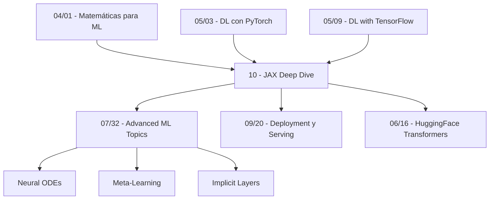

# 🏷️ Welcome to JAX Deep Dive

## 🎯 Learning Objectives
- Understand **why JAX exists** in a landscape dominated by PyTorch and TensorFlow
- Trace the **etymology and philosophy** of JAX: "Just After eXecution" and the functional paradigm
- Map the **course curriculum** across six comprehensive modules
- Identify **prerequisites** and how JAX fits into the broader ML engineering toolkit
- Locate JAX within the **vault's knowledge graph** via internal links

## Introduction

**JAX** — an acronym that playfully stands for **"Just After eXecution"** — is Google's functional numerical computing framework that has quietly become the engine behind the world's most advanced AI systems. Unlike its name suggests, JAX is emphatically **not** an extension of NumPy or a successor to JAX-RS; it is a fundamentally different approach to numerical computation built on three pillars: **functional purity**, **just-in-time compilation via XLA**, and **composable program transformations** (`jit`, `vmap`, `grad`, `pmap`). The name is a double entendre: it refers to the just-in-time nature of XLA compilation, and it's also a nod to the "Autograd and XLA" lineage (though Google officially demurs on the backronym).

Why does JAX exist when PyTorch already dominates both research and production? The answer lies in a fundamental architectural wager. PyTorch's eager-execution model — where every operation executes immediately and builds an implicit computation graph — is intuitive and debuggable, but it imposes a ceiling on compiler optimizations. JAX inverts this: your Python code is a **specification**, not an execution plan. When you decorate a function with `@jax.jit`, JAX **traces** it into a pure mathematical representation, fuses operations at the XLA (Accelerated Linear Algebra) level, eliminates dead code, and generates hardware-optimized kernels. The result is that JAX training loops routinely run **1.5–2× faster** than equivalent PyTorch, and scale to TPU pods with **tens of thousands of cores** — which is precisely why DeepMind chose JAX for Gemini, AlphaFold, Gopher, and PaLM. For the AI/ML engineer, JAX represents the **research frontier**: mastering it opens doors to neural ODEs, implicit layers, equivariant networks, and other cutting-edge architectures that PyTorch's autograd struggles to handle efficiently.

This module, nestled within [[05 - Deep Learning y Computer Vision]], is the vault's definitive JAX reference. It assumes you already know PyTorch [[05/03 - Deep Learning con PyTorch]] and have worked with TensorFlow [[05/09 - Deep Learning with TensorFlow]]. It bridges the gap from "I can train models in PyTorch" to "I understand why JAX is different and when to use it." We'll draw on the mathematical foundations in [[04/01 - Matemáticas para ML]] — particularly vector calculus and linear algebra — and later modules on deployment [[09/20 - Deployment y Serving]] and experiment tracking [[09/24 - Weights and Biases]] will reference back to the JAX training patterns established here.

> **💡 Key Insight:** JAX is not a deep learning framework. It's a numerical computing framework that happens to be excellent for deep learning. The distinction matters: Flax, Haiku, and Equinox are neural network libraries *built on top of* JAX. Understanding this separation of concerns is the first step to JAX mastery.

---

## 📋 Course Map

| Note | Title | Core Concept | Lines |
|------|-------|-------------|-------|
| `00` | **Welcome to JAX Deep Dive** | Etymology, philosophy, prerequisites | ~80 |
| `01` | **JAX Fundamentals — jit, vmap, grad, and XLA** | The four transformation primitives + XLA compilation pipeline | ~400 |
| `02` | **From NumPy to JAX — The Functional Paradigm** | Immutability, PRNG keys, PyTrees, functional purity | ~400 |
| `03` | **Automatic Differentiation — grad, vjp, jvp, and Hessians** | Forward/reverse mode, higher-order derivatives, custom VJPs | ~420 |
| `04` | **Flax — Neural Networks the Functional Way** | Linen modules, init/apply split, TrainState, vs nn.Module | ~420 |
| `05` | **Training Loops with Optax and End-to-End JAX** | Explicit training loops, jit-compiled steps, multi-device scaling | ~420 |

---

## 🔗 Prerequisites & Knowledge Graph

### What You Should Already Know
- **PyTorch fundamentals**: `nn.Module`, `autograd`, training loops, DataLoader. See [[05/03 - Deep Learning con PyTorch]].
- **Linear algebra**: matrix multiplication, gradients, Jacobians, Hessians. See [[04/01 - Matemáticas para ML]].
- **Basic calculus**: partial derivatives, chain rule, gradient descent.
- **Python proficiency**: NumPy, Jupyter, command-line workflows.

### How This Module Connects


> **💡 Pro Tip:** If you're comfortable with PyTorch but rusty on vector calculus, revisit [[04/01 - Matemáticas para ML]] before diving into Note 03 on automatic differentiation. The jump from `loss.backward()` to `jax.grad(jax.grad(f))` is profound but requires comfort with Jacobians.

---

## 🎯 Key Takeaways
- JAX is a **functional numerical computing framework**, not a DL framework — Flax/Equinox fill that role
- The name derives from **"Just After eXecution"**, reflecting the JIT compilation model via XLA
- JAX's functional paradigm (immutability, purity, explicit state) is the **key mental shift** from PyTorch
- Google **DeepMind uses JAX** for Gemini, AlphaFold, PaLM, and Gopher because it scales to TPU pods
- The four core transformations — `jit`, `vmap`, `grad`, `pmap` — are **composable**, enabling patterns impossible in other frameworks
- This module bridges PyTorch knowledge to **research-grade JAX** in 6 comprehensive notes
- JAX powers the `transformers` library backend [[06/16 - HuggingFace Transformers Deep Dive]] and serves as foundation for cutting-edge architectures covered in [[07/32 - Advanced ML Topics]]

## 📦 Código de Compresión

```python
import jax
import jax.numpy as jnp

# The 4 pillars of JAX in 5 lines
@jax.jit                                           # JIT-compile
@jax.vmap                                           # Batch-vectorize
@jax.grad                                           # Differentiate
def pillar_demo(x):
    return jnp.sum(jnp.sin(x) ** 2)

key = jax.random.PRNGKey(42)
x = jax.random.normal(key, (100, 10))
result = pillar_demo(x)
print(f"grad shape: {result.shape}")                # (100, 10) — batched gradient
print(f"JAX compiled and done. ¡Sorpresa! No tensors mutated.")
```

## References
- JAX Official Documentation: https://jax.readthedocs.io/
- Frostig, Johnson, Leary (2018). "Compiling Machine Learning Programs via High-Level Tracing." *SysML 2018*.
- DeepMind (2023). "Scaling Language Models with JAX." Google Research.
- Bradbury et al. (2018). "JAX: composable transformations of Python+NumPy programs." GitHub.
- [[05/03 - Deep Learning con PyTorch]]
- [[05/09 - Deep Learning with TensorFlow]]
- [[04/01 - Matemáticas para ML]]
- [[07/32 - Advanced ML Topics]]
- [[09/20 - Deployment y Serving]]
- [[06/16 - HuggingFace Transformers Deep Dive]]
- [[09/24 - Weights and Biases]]
